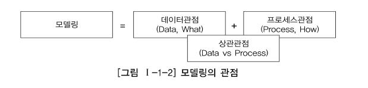

 [데이터 모델의 이해](#데이터-모델의-이해)\
　　 [1. 모델링의 이해](#1-모델링의-이해)\
　　　 [가. 모델링의 정의](#가-모델링의-정의)\
　　　 [나. 모델링의 특징](#나-모델링의-특징)\
　　　 [다. 모델링의 세 가지 관점](#다-모델링의-세-가지-관점)\
　　 [2. 데이터 모델의 기본 개념의 이해](#2-데이터-모델의-기본-개념의-이해)\
　　　 [가. 모델링의 정의](#가-모델링의-정의)\
　　　 [나. 데이터 모델이 제공하는 기능](#나-데이터-모델이-제공하는-기능)\
　　 [3. 데이터 모델링의 중요성 및 유의점](#3-데이터-모델링의-중요성-및-유의점)\
　　　 [가. 파급효과(Leverage)](#가-파급효과leverage)\
　　　 [다. 데이터 품질(Data Quality)](#다-데이터-품질data-quality)\
　　 [4. 데이터 모델링의 3단계 진행](#4-데이터-모델링의-3단계-진행)\
　　　 [가. 개념적 데이터 모델링(Conceptual Data Modeling)](#가-개념적-데이터-모델링conceptual-data-modeling)\
　　　 [나. 논리적 데이터 모델링(Logical Data Modeling)](#나-논리적-데이터-모델링logical-data-modeling)\
　　　 [다. 물리적 데이터 모델링(Physical Data Modeling)](#다-물리적-데이터-모델링physical-data-modeling)\
　　 [5. 프로젝트 생명주기(Life Cycle)에서 데이터 모델링](#5-프로젝트-생명주기life-cycle에서-데이터-모델링)\
　　 [6. 데이터 모델링에서 데이터독립성의 이해](#6-데이터-모델링에서-데이터독립성의-이해)\
　　　 [가. 데이터독립성의 필요성](#가-데이터독립성의-필요성)\
　　　 [나. 데이터베이스 3단계 구조](#나-데이터베이스-3단계-구조)\
　　　 [다. 데이터독립성 요소](#다-데이터독립성-요소)\
　　　 [라. 두 영역의 데이터독립성](#라-두-영역의-데이터독립성)\
　　　 [마. 사상(Mapping)](#마-사상mapping)\
　　 [7. 데이터 모델링의 중요한 세 가지 개념](#7-데이터-모델링의-중요한-세-가지-개념)\
　　　 [가. 데이터 모델링의 세 가지 요소](#가-데이터-모델링의-세-가지-요소)\
　　　 [나. 단수와 집합(복수)의 명명](#나-단수와-집합복수의-명명)\
　　 [8. 데이터 모델링의 이해관계자](#8-데이터-모델링의-이해관계자)\
　　　 [가. 이해관계자의 데이터 모델링 중요성 인식](#가-이해관계자의-데이터-모델링-중요성-인식)\
　　　 [나. 데이터 모델링의 이해관계자](#나-데이터-모델링의-이해관계자)\
　　 [9. 데이터 모델의 표기법인 ERD의 이해](#9-데이터-모델의-표기법인-erd의-이해)\
　　　 [가. 데이터 모델 표기법](#가-데이터-모델-표기법)\
　　　 [나. ERD(Entity Relationship Diagram) 표기법을 이용하여 모델링하는 방법](#나-erdentity-relationship-diagram-표기법을-이용하여-모델링하는-방법)\
　　 [10. 좋은 데이터 모델의 요소](#10-좋은-데이터-모델의-요소)\
　　　 [가. 완전성(Completeness)](#가-완전성completeness)\
　　　 [나. 중복배제(Non-Redundancy)](#나-중복배제non-redundancy)\
　　　 [다. 업무규칙(Business Rules)](#다-업무규칙business-rules)\
　　　 [라. 데이터 재사용(Data Reusability)](#라-데이터-재사용data-reusability)\
　　　 [마. 의사소통(Communication)](#마-의사소통communication)\
　　　 [바. 통합성(Integration)](#바-통합성integration)\
　 [엔터티](#엔터티)\
　　 [1. 엔터티의 개념](#1-엔터티의-개념)\
　　 [2. 엔터티와 인스턴스에 대한 내용과 표기법](#2-엔터티와-인스턴스에-대한-내용과-표기법)\
　　 [3. 엔터티의 특징](#3-엔터티의-특징)\
　　　 [가. 업무에서 필요로 하는 정보](#가-업무에서-필요로-하는-정보)\
　　　 [나. 식별이 가능해야 함](#나-식별이-가능해야-함)\
　　　 [다. 인스턴스의 집합](#다-인스턴스의-집합)\
　　　 [라. 업무프로세스에 의해 이용](#라-업무프로세스에-의해-이용)\
　　　 [마. 속성을 포함](#마-속성을-포함)\
　　　 [바. 관계의 존재](#바-관계의-존재)\
　　 [4. 엔터티의 분류](#4-엔터티의-분류)\
　　　 [가. 유무(有無)형에 따른 분류](#가-유무有無형에-따른-분류)\
　　　 [나. 발생시점(發生時點)에 따른 분류](#나-발생시점發生時點에-따른-분류)\
　　　 [다. 엔터티 분류 방법의 예](#다-엔터티-분류-방법의-예)\
　　 [5. 엔터티의 명명](#5-엔터티의-명명)\
　 [속성](#속성)\
　　 [1. 속성 (Attribute)의 개념](#1-속성-attribute의-개념)\
　　 [2. 엔터티, 인스턴스와 속성, 속성값에 대한 내용과 표기법](#2-엔터티-인스턴스와-속성-속성값에-대한-내용과-표기법)\
　　　 [가. 엔터티, 인스턴스, 속성, 속성값의 관계](#가-엔터티-인스턴스-속성-속성값의-관계)\
　　　 [나. 속성의 표기법](#나-속성의-표기법)\
　　 [3. 속성의 특징](#3-속성의-특징)\
　　 [4. 속성의 분류](#4-속성의-분류)\
　　　 [가. 속성의 특성에 따른 분류](#가-속성의-특성에-따른-분류)\
　　　 [나. 엔터티 구성방식에 따른 분류](#나-엔터티-구성방식에-따른-분류)\
　　 [5. 도메인(Domain)](#5-도메인domain)\
　　 [6. 속성의 명명(Naming)fffff](#6-속성의-명명namingfffff)\
　 [관계](#관계)\
　　 [1. 관계의 개념](#1-관계의-개념)\
　　　 [가. 관계의 정의](#가-관계의-정의)\
　　　 [나. 관계의 패어링](#나-관계의-패어링)\
　　 [2. 관계의 분류](#2-관계의-분류)\
　　 [3. 관계의 표기법](#3-관계의-표기법)\
　　　 [가. 관계명(Membership)](#가-관계명membership)\
　　　 [나. 관계차수(Degree/Cardinality)](#나-관계차수degreecardinality)\
　　　 [다. 관계선택사양(Optionality)](#다-관계선택사양optionality)\
　　 [4. 관계의 정의 및 읽는 방법](#4-관계의-정의-및-읽는-방법)\
　　　 [가. 관계 체크사항](#가-관계-체크사항)\
　　　 [나. 관계 읽기](#나-관계-읽기)\
　 [식별자](#식별자)\
　　 [1. 식별자(Identifiers) 개념](#1-식별자identifiers-개념)\
　　 [2. 식별자의 특징](#2-식별자의-특징)\
　　 [3. 식별자 분류 및 표기법](#3-식별자-분류-및-표기법)\
　　　 [가. 식별자 분류](#가-식별자-분류)\
　　　 [나. 식별자 표기법](#나-식별자-표기법)\
　　 [4. 주식별자 도출기준](#4-주식별자-도출기준)\
　　　 [가. 해당 업무에서 자주 이용되는 속성을 주식별자로 지정하도록 함](#가-해당-업무에서-자주-이용되는-속성을-주식별자로-지정하도록-함)\
　　　 [나. 명칭, 내역 등과 같이 이름으로 기술되는 것은 피함](#나-명칭-내역-등과-같이-이름으로-기술되는-것은-피함)\
　　　 [다. 속성의 수가 많아지지 않도록 함](#다-속성의-수가-많아지지-않도록-함)\
　　 [5. 식별자관계와 비식별자관계에 따른 식별자](#5-식별자관계와-비식별자관계에-따른-식별자)\
　　　 [가. 식별자관계와 비식별자 관계의 결정](#가-식별자관계와-비식별자-관계의-결정)\
　　　 [나. 식별자관계](#나-식별자관계)\
　　　 [다. 비식별자관계](#다-비식별자관계)\
　　　 [라. 식별자 관계로만 설정할 경우의 문제점](#라-식별자-관계로만-설정할-경우의-문제점)\
　　　 [마. 비식별자 관계로만 설정할 경우의 문제점](#마-비식별자-관계로만-설정할-경우의-문제점)\
　　　 [바. 식별자관계와 비식별자관계 모델링](#바-식별자관계와-비식별자관계-모델링)\
　 [관계형 데이터베이스 개요](#관계형-데이터베이스-개요)\
　　 [1. 데이터베이스](#1-데이터베이스)\
　　 [2. SQL(Structured Query Language)](#2-sqlstructured-query-language)\
　　 [3. TABLE](#3-table)\
　　 [4. ERD(Entity Relationship Diagram)](#4-erdentity-relationship-diagram)\
　 [함수(FUNCTION)](#함수function)\
　　 [1. 내장 함수(BUILT-IN FUNCTION) 개요](#1-내장-함수built-in-function-개요)\
　　 [2. 문자형 함수](#2-문자형-함수)\
　　 [3. 숫자형 함수](#3-숫자형-함수)\
　　 [4. 날짜형 함수](#4-날짜형-함수)\
　　 [5. 변환형 함수](#5-변환형-함수)\
　　 [6. CASE 표현](#6-case-표현)\
　　 [7. NULL 관련 함수](#7-null-관련-함수)\
　　　 [가. NVL/ISNULL 함수](#가-nvlisnull-함수)\
　　　 [나. NULL과 공집합](#나-null과-공집합)\
　　　 [다. NULLIF](#다-nullif)\
　　　 [라. 기타 NULL 관련 함수 (COALESCE)](#라-기타-null-관련-함수-coalesce)\
　 [WHERE 절](#where-절)\
　　 [1. WHERE 조건절 개요](#1-where-조건절-개요)\
　　 [2. 연산자의 종류](#2-연산자의-종류)\
　　 [3. 비교 연산자](#3-비교-연산자)\
　　 [4. SQL 연산자](#4-sql-연산자)\
　　 [5. 논리 연산자](#5-논리-연산자)\
　　 [6. 부정 연산자](#6-부정-연산자)\
　　 [7. ROWNUM, TOP 사용](#7-rownum-top-사용)\
　 [GROUP BY, HAVING 절](#group-by-having-절)\
　　 [1. 집계 함수(Aggregate Function)](#1-집계-함수aggregate-function)\
　　 [2. GROUP BY 절](#2-group-by-절)\
　　 [3. HAVING 절](#3-having-절)\
　　 [4. CASE 표현을 활용한 월별 데이터 집계](#4-case-표현을-활용한-월별-데이터-집계)\
　　 [5. 집계 함수와 NULL](#5-집계-함수와-null)\
　 [ORDER BY 절](#order-by-절)\
　　 [1. ORDER BY 정렬](#1-order-by-정렬)\
　　 [2. SELECT 문장 실행 순서](#2-select-문장-실행-순서)\
　　 [3. Top N 쿼리](#3-top-n-쿼리)\
　 [조인(JOIN)](#조인join)\
　　 [1. JOIN 개요](#1-join-개요)\
　　 [2. EQUI JOIN](#2-equi-join)\
　　　 [가. 선수-팀 EQUI JOIN 사례](#가-선수-팀-equi-join-사례)\
　　　 [나. 선수-팀 WHERE 절 검색 조건 사례](#나-선수-팀-where-절-검색-조건-사례)\
　　　 [다. 팀-구장 EQUI JOIN 사례](#다-팀-구장-equi-join-사례)\
　　 [3. Non EQUI JOIN](#3-non-equi-join)\
　　 [4. 3개 이상 TABLE JOIN](#4-3개-이상-table-join)\
　 [표준 조인](#표준-조인)\
　　 [1. STANDARD SQL 개요](#1-standard-sql-개요)\
　　　 [가. 일반 집합 연산자](#가-일반-집합-연산자)\
　　　 [나. 순수 관계 연산자](#나-순수-관계-연산자)\
　　 [2. FROM 절 JOIN 형태](#2-from-절-join-형태)\
　　 [3. INNER JOIN](#3-inner-join)\
　　 [4. NATURAL JOIN](#4-natural-join)\
　　 [5. USING 조건절](#5-using-조건절)\
　　 [6. ON 조건절](#6-on-조건절)\
　　　 [가. WHERE 절과의 혼용](#가-where-절과의-혼용)\
　　　 [나. ON 조건절 + 데이터 검증 조건 추가](#나-on-조건절--데이터-검증-조건-추가)\
　　　 [다. ON 조건절 예제](#다-on-조건절-예제)\
　　　 [라. 다중 테이블 JOIN](#라-다중-테이블-join)\
　　 [7. CROSS JOIN](#7-cross-join)\
　　 [8. OUTER JOIN](#8-outer-join)\
　　　 [가. LEFT OUTER JOIN](#가-left-outer-join)\
　　　 [나. RIGHT OUTER JOIN](#나-right-outer-join)\
　　　 [다. FULL OUTER JOIN](#다-full-outer-join)\
　　 [9. INNER vs OUTER vs CROSS JOIN 비교](#9-inner-vs-outer-vs-cross-join-비교)\
　 [서브쿼리](#서브쿼리)\
　　 [1. 단일 행 서브 쿼리](#1-단일-행-서브-쿼리)\
　　 [12. 다중 행 서브쿼리](#12-다중-행-서브쿼리)\
　　 [3. 다중 칼럼 서브쿼리](#3-다중-칼럼-서브쿼리)\
　　 [4. 연관 서브쿼리](#4-연관-서브쿼리)\
　　 [5. 그밖에 위치에서 사용하는 서브쿼리](#5-그밖에-위치에서-사용하는-서브쿼리)\
　　　 [가. SELECT 절에 서브쿼리 사용하기](#가-select-절에-서브쿼리-사용하기)\
　　　 [나. FROM 절에서 서브쿼리 사용하기](#나-from-절에서-서브쿼리-사용하기)\
　　　 [다. HAVING 절에서 서브쿼리 사용하기](#다-having-절에서-서브쿼리-사용하기)\
　　　 [라. UPDATE문의 SET 절에서 사용하기](#라-update문의-set-절에서-사용하기)\
　　　 [마. INSERT문의 VALUES절에서 사용하기](#마-insert문의-values절에서-사용하기)\
　　 [6. 뷰(View)](#6-뷰view)\
　 [집합 연산자](#집합-연산자)\
　 [그룹 함수](#그룹-함수)\
　　 [1. 데이터 분석 개요](#1-데이터-분석-개요)\
　　 [2. ROLLUP 함수](#2-rollup-함수)\
　　 [3. CUBE 함수](#3-cube-함수)\
　　 [4. GROUPING SETS 함수](#4-grouping-sets-함수)\
　 [윈도우 함수](#윈도우-함수)\
　　 [1. WINDOW FUNCTION 개요](#1-window-function-개요)\
　　 [2. 그룹 내 순위 함수](#2-그룹-내-순위-함수)\
　　　 [가. RANK 함수](#가-rank-함수)\
　　　 [나. DENSE_RANK 함수](#나-dense_rank-함수)\
　　　 [다. ROW_NUMBER 함수](#다-row_number-함수)\
　　 [3. 일반 집계 함수](#3-일반-집계-함수)\
　　　 [가. SUM 함수](#가-sum-함수)\
　　　 [나. MAX 함수](#나-max-함수)\
　　　 [다. MIN 함수](#다-min-함수)\
　　　 [라. AVG 함수](#라-avg-함수)\
　　　 [마. COUNT 함수](#마-count-함수)\
　　 [4. 그룹 내 행 순서 함수](#4-그룹-내-행-순서-함수)\
　　　 [가. FIRST_VALUE 함수](#가-first_value-함수)\
　　　 [나. LAST_VALUE 함수](#나-last_value-함수)\
　　　 [다. LAG 함수](#다-lag-함수)\
　　　 [라. LEAD 함수](#라-lead-함수)\
　　 [5. 그룹 내 비율 함수](#5-그룹-내-비율-함수)\
　　　 [가. RATIO_TO_REPORT 함수](#가-ratio_to_report-함수)\
　　　 [나. PERCENT_RANK 함수](#나-percent_rank-함수)\
　　　 [다. CUME_DIST 함수](#다-cume_dist-함수)\
　　　 [라. NTILE 함수](#라-ntile-함수)\
　 [계층형 질의와 셀프 조인](#계층형-질의와-셀프-조인)\
　　 [1. 계층형 질의](#1-계층형-질의)\
　　　 [가. Oracle 계층형 질의](#가-oracle-계층형-질의)\
　　　 [나. SQL Server 계층형 질의](#나-sql-server-계층형-질의)\
　　 [2. 셀프 조인](#2-셀프-조인)\
　 [DML](#dml)\
　　 [1. INSERT](#1-insert)\
　　 [2. UPDATE](#2-update)\
　　 [3. DELETE](#3-delete)\
　　 [4. SELECT](#4-select)\
　　 [5. 산술 연산자와 합성 연산자](#5-산술-연산자와-합성-연산자)\
　 [TCL](#tcl)\
　　 [1. 트랜잭션 개요](#1-트랜잭션-개요)\
　　 [2. COMMIT](#2-commit)\
　　 [3. ROLLBACK](#3-rollback)\
　　 [4. SAVEPOINT](#4-savepoint)\
　 [DDL](#ddl)\
　　 [1. 데이터 유형](#1-데이터-유형)\
　　 [2. CREATE TABLE](#2-create-table)\
　　　 [가. 테이블과 칼럼 정의](#가-테이블과-칼럼-정의)\
　　　 [나. CREATE TABLE](#나-create-table)\
　　　 [다. 제약조건(CONSTRAINT)](#다-제약조건constraint)\
　　　 [라. 생성된 테이블 구조 확인](#라-생성된-테이블-구조-확인)\
　　　 [마. SELECT 문장을 통한 테이블 생성 사례](#마-select-문장을-통한-테이블-생성-사례)\
　　 [3. ALTER TABLE](#3-alter-table)\
　　　 [가. ADD COLUMN](#가-add-column)\
　　　 [나. DROP COLUMN\](#나-drop-column)\
　　　 [다. MODIFY COLUMN](#다-modify-column)\
　　　 [라. DROP CONSTRAINT](#라-drop-constraint)\
　　　 [마. ADD CONSTRAINT](#마-add-constraint)\
　　 [4. RENAME TABLE](#4-rename-table)\
　　 [5. DROP TABLE](#5-drop-table)\
　　 [6. TRUNCATE TABLE](#6-truncate-table)\
　 [DCL](#dcl)\
　　 [1. DCL 개요](#1-dcl-개요)\
　　 [2. 유저와 권한](#2-유저와-권한)\
　　　 [가. 유저 생성과 시스템 권한 부여](#가-유저-생성과-시스템-권한-부여)\
　　　 [나. OBJECT에 대한 권한 부여](#나-object에-대한-권한-부여)\
　　 [3. Role을 이용한 권한 부여](#3-role을-이용한-권한-부여)\
　 [데이터베이스 아키텍처](#데이터베이스-아키텍처)\
　　 [1. 아키텍처 개관](#1-아키텍처-개관)\
　　　 [가. 모델링의 정의](#가-모델링의-정의)\
　　　 [나. SQL Server 아키텍처](#나-sql-server-아키텍처)\
　　 [2. 프로세스](#2-프로세스)\
　　　 [가. 서버 프로세스(Server Processes)](#가-서버-프로세스server-processes)\
　　　 [나. 백그라운드 프로세스(Background Processes)](#나-백그라운드-프로세스background-processes)\
　　 [3. 파일 구조](#3-파일-구조)\
　　　 [가. 데이터 파일](#가-데이터-파일)\
　　　 [나. 임시 데이터 파일](#나-임시-데이터-파일)\
　　　 [다. 로그 파일](#다-로그-파일)\
　　 [4. 메모리 구조](#4-메모리-구조)\
　　　 [가. DB 버퍼 캐시(DB Buffer Cache)](#가-db-버퍼-캐시db-buffer-cache)\
　　　 [나. 공유 풀(Shared Pool)](#나-공유-풀shared-pool)\
　　　 [다. 로그 버퍼(Log Buffer)](#다-로그-버퍼log-buffer)\
　　　 [라. PGA(Process Global Area)](#라-pgaprocess-global-area)\
　　 [5. 대기 이벤트](#5-대기-이벤트)\
　　　 [가. 라이브러리 캐시 부하](#가-라이브러리-캐시-부하)\
　　　 [나. 데이터베이스 Call과 네트워크 부하](#나-데이터베이스-call과-네트워크-부하)\
　　　 [다. 디스크 I/O 부하](#다-디스크-io-부하)\
　　　 [라. 버퍼 캐시 경합](#라-버퍼-캐시-경합)\
　　　 [마. Lock 관련 대기 이벤트](#마-lock-관련-대기-이벤트)\
　 [데이터베이스 I/O 원리](#데이터베이스-io-원리)\
　　 [4. 데이터 모델링의 3단계 진행](#4-데이터-모델링의-3단계-진행)\
　　 [1. 블록 단위 I/O](#1-블록-단위-io)\
　　 [2. 메모리 I/O vs. 디스크I/O](#2-메모리-io-vs-디스크io)\
　　　 [가. I/O 효율화 튜닝의 중요성](#가-io-효율화-튜닝의-중요성)\
　　　 [나. 버퍼 캐시 히트율(Buffer Cache Hit Ratio)](#나-버퍼-캐시-히트율buffer-cache-hit-ratio)\
　　　 [다. 네트워크, 파일시스템 캐시가 I/O 효율에 미치는 영향](#다-네트워크-파일시스템-캐시가-io-효율에-미치는-영향)\
　　 [3. Sequential I/O vs. Random I/O](#3-sequential-io-vs-random-io)\
　　　 [가. Sequential 액세스에 의한 선택 비중 높이기](#가-sequential-액세스에-의한-선택-비중-높이기)\
　　　 [나. Random 액세스 발생량 줄이기](#나-random-액세스-발생량-줄이기)\
　　 [4. Single Block I/O vs. MultiBlock I/O](#4-single-block-io-vs-multiblock-io)\
　　 [5. I/O 효율화 원리](#5-io-효율화-원리)\
　　　 [가. 필요한 최소 블록만 읽도록 SQL 작성](#가-필요한-최소-블록만-읽도록-sql-작성)\
　　　 [나. 최적의 옵티마이징 팩터 제공](#나-최적의-옵티마이징-팩터-제공)\
　　　 [다. 필요하다면, 옵티마이저 힌트를 사용해 최적의 액세스 경로로 유도](#다-필요하다면-옵티마이저-힌트를-사용해-최적의-액세스-경로로-유도)\
　 [인덱스 기본 원리](#인덱스-기본-원리)\
　　 [1. 인덱스 구조](#1-인덱스-구조)\
　　　 [가. 인덱스 기본](#가-인덱스-기본)\
　　　 [나. 인덱스 탐색](#나-인덱스-탐색)\
　　 [2. 다양한 인덱스 스캔 방식](#2-다양한-인덱스-스캔-방식)\
　　　 [가. Index Range Scan](#가-index-range-scan)\
　　　 [나. Index Full Scan](#나-index-full-scan)\
　　　 [다. Index Unique Scan](#다-index-unique-scan)\
　　　 [라. Index Skip Scan](#라-index-skip-scan)\
　　　 [마. Index Fast Full Scan](#마-index-fast-full-scan)\
　　　 [바. Index Range Scan Descending](#바-index-range-scan-descending)\
　　 [3. 인덱스 종류](#3-인덱스-종류)\
　　　 [가. B*Tree 인덱스](#가-btree-인덱스)\
　　　 [나. 비트맵 인덱스](#나-비트맵-인덱스)\
　　　 [다. 함수기반 인덱스](#다-함수기반-인덱스)\
　　　 [라. 리버스 키 인덱스](#라-리버스-키-인덱스)\
　　　 [마. 클러스터 인덱스](#마-클러스터-인덱스)\
　　　 [바. 클러스터형 인덱스/IOT](#바-클러스터형-인덱스iot)\
　 [인덱스 튜닝](#인덱스-튜닝)\
　　 [1. 인덱스 튜닝 기초](#1-인덱스-튜닝-기초)\
　　　 [가. 범위 스캔이 불가능하거나 인덱스 사용이 아예 불가능한 경우](#가-범위-스캔이-불가능하거나-인덱스-사용이-아예-불가능한-경우)\
　　　 [나. 인덱스 칼럼의 가공](#나-인덱스-칼럼의-가공)\
　　　 [다. 묵시적 형변환](#다-묵시적-형변환)\
　　 [2. 테이블 Random 액세스 최소화](#2-테이블-random-액세스-최소화)\
　　　 [가. 인덱스 ROWID에 의한 테이블 Random 액세스](#가-인덱스-rowid에-의한-테이블-random-액세스)\
　　　 [나. 인덱스 손익분기점](#나-인덱스-손익분기점)\
　　　 [다. 테이블 Random 액세스 최소화 튜닝](#다-테이블-random-액세스-최소화-튜닝)\
　　 [3. 인덱스 스캔범위 최소화](#3-인덱스-스캔범위-최소화)\
　　　 [가. 인덱스 선행 칼럼이 범위조건일 때의 비효율](#가-인덱스-선행-칼럼이-범위조건일-때의-비효율)\
　　　 [나. 범위조건을 In-List로 전환](#나-범위조건을-in-list로-전환)\
　　　 [다. 범위조건을 2개 이상 사용할 때의 비효율](#다-범위조건을-2개-이상-사용할-때의-비효율)\
　　 [4. 인덱스 설계](#4-인덱스-설계)\
　　　 [가. 결합 인덱스 구성을 위한 기본 공식](#가-결합-인덱스-구성을-위한-기본-공식)\
　　　 [나. 추가적인 고려사항](#나-추가적인-고려사항)\
　　　 [다. 인덱스 설계도 작성](#다-인덱스-설계도-작성)\
　 [조인 기본 원리](#조인-기본-원리)\
　　 [1. Nested Loop Join](#1-nested-loop-join)\
　　　 [가. 기본 메커니즘](#가-기본-메커니즘)\
　　　 [나. NL Join 수행 과정 분석](#나-nl-join-수행-과정-분석)\
　　　 [다. NL Join의 특징](#다-nl-join의-특징)\
　　 [2. Sort Merge Join](#2-sort-merge-join)\
　　　 [가. 기본 메커니즘](#가-기본-메커니즘)\
　　　 [나. Sort Merge Join의 특징](#나-sort-merge-join의-특징)\
　　 [3. Hash Join](#3-hash-join)\
　　　 [가. 기본 메커니즘](#가-기본-메커니즘)\
　　　 [나. Build Input이 가용 메모리 공간을 초과할 때 처리 방식](#나-build-input이-가용-메모리-공간을-초과할-때-처리-방식)\
　　　 [다. Build Input 해시 키 값에 중복이 많을 때 발생하는 비효율](#다-build-input-해시-키-값에-중복이-많을-때-발생하는-비효율)\
　　　 [라. Hash Join 사용기준](#라-hash-join-사용기준)\
　　 [4. Scalar Subquery](#4-scalar-subquery)\
　　　 [가. Scalar Subquery의 캐싱 효과](#가-scalar-subquery의-캐싱-효과)\
　 [고급 조인 기법](#고급-조인-기법)\
　　 [1. 인라인 뷰 활용](#1-인라인-뷰-활용)\
　　 [2. 배타적 관계의 조인](#2-배타적-관계의-조인)\
　　 [3. 부등호 조인](#3-부등호-조인)\
　　 [4. Between 조인](#4-between-조인)\
　　　 [가. 선분이력이란?](#가-선분이력이란)\
　　　 [나. 선분이력 기본 조회 패턴](#나-선분이력-기본-조회-패턴)\
　　　 [다. 선분이력 조인](#다-선분이력-조인)\
　　　 [라. Between 조인](#라-between-조인)\
　　 [5. ROWID 활용](#5-rowid-활용)\
　 [옵티마이저](#옵티마이저)\
　　 [1. 옵티마이저 소개](#1-옵티마이저-소개)\
　　　 [가. 옵티마이저란?](#가-옵티마이저란)\
　　　 [나. 옵티마이저 종류](#나-옵티마이저-종류)\
　　　 [다. SQL 최적화 과정](#다-sql-최적화-과정)\
　　　 [라. 최적화 목표](#라-최적화-목표)\
　　 [2. 옵티마이저 행동에 영향을 미치는 요소](#2-옵티마이저-행동에-영향을-미치는-요소)\
　　　 [가. SQL과 연산자 형태](#가-sql과-연산자-형태)\
　　　 [나. 옵티마이징 팩터](#나-옵티마이징-팩터)\
　　　 [다. DBMS 제약 설정](#다-dbms-제약-설정)\
　　　 [라. 옵티마이저 힌트](#라-옵티마이저-힌트)\
　　　 [마. 통계정보](#마-통계정보)\
　　　 [바. 옵티마이저 관련 파라미터](#바-옵티마이저-관련-파라미터)\
　　　 [사. DBMS 버전과 종류](#사-dbms-버전과-종류)\
　　 [3. 옵티마이저의 한계](#3-옵티마이저의-한계)\
　　　 [가. 옵티마이징 팩터의 부족](#가-옵티마이징-팩터의-부족)\
　　　 [나. 통계정보의 부정확성](#나-통계정보의-부정확성)\
　　　 [다. 바인드 변수 사용 시 균등분포 가정](#다-바인드-변수-사용-시-균등분포-가정)\
　　　 [라. 비현실적인 가정](#라-비현실적인-가정)\
　　　 [마. 규칙에 의존하는 CBO](#마-규칙에-의존하는-cbo)\
　　　 [바. 하드웨어 성능](#바-하드웨어-성능)\
　　 [4. 통계정보를 이용한 비용계산 원리](#4-통계정보를-이용한-비용계산-원리)\
　　　 [가. 선택도](#가-선택도)\
　　　 [나. 카디널리티](#나-카디널리티)\
　　　 [다. 히스토그램](#다-히스토그램)\
　　　 [라. 비용](#라-비용)\
　　 [5. 옵티마이저](#5-옵티마이저)\
　　　 [가. Oracle 힌트](#가-oracle-힌트)\
　　　 [나. SQL Server 힌트](#나-sql-server-힌트)\
　 [SQL 파싱 부하](#sql-파싱-부하)\
　　 [2. 데이터 모델의 기본 개념의 이해](#2-데이터-모델의-기본-개념의-이해)\
　　 [1. SQL 처리과정](#1-sql-처리과정)\
　　　 [가. SQL 파싱(Parsing)](#가-sql-파싱parsing)\
　　　 [나. SQL 최적화(Optimization)](#나-sql-최적화optimization)\
　　 [2. 캐싱된 SQL 공유](#2-캐싱된-sql-공유)\
　　　 [가. 실행계획 공유 조건](#가-실행계획-공유-조건)\
　　　 [나. 실행계획을 공유하지 못하는 경우](#나-실행계획을-공유하지-못하는-경우)\
　　 [3. 바인드 변수 사용하기](#3-바인드-변수-사용하기)\
　　　 [가. 바인드 변수의 중요성](#가-바인드-변수의-중요성)\
　　　 [나. 바인드 변수 사용 시 주의사항](#나-바인드-변수-사용-시-주의사항)\
　　　 [다. 바인드 변수 부작용을 극복하기 위한 노력](#다-바인드-변수-부작용을-극복하기-위한-노력)\
　　 [4. Static SQL과 Dynamic SQL](#4-static-sql과-dynamic-sql)\
　　　 [가. Static SQL](#가-static-sql)\
　　　 [나. Dynamic SQL](#나-dynamic-sql)\
　　　 [다. 바인드 변수의 중요성 재강조](#다-바인드-변수의-중요성-재강조)\
　　 [5. 애플리케이션 커서 캐싱](#5-애플리케이션-커서-캐싱)\
　 [쿼리변환](#쿼리변환)\
　　 [1. 쿼리변환이란?](#1-쿼리변환이란)\
　　 [2. 서브쿼리 Unnesting](#2-서브쿼리-unnesting)\
　　 [3. 뷰 Merging](#3-뷰-merging)\
　　 [4. 조건절 Pushing](#4-조건절-pushing)\
　　　 [가. 조건절(Predicate) Pushdown](#가-조건절predicate-pushdown)\
　　　 [나. 조건절(Predicate) Pullup](#나-조건절predicate-pullup)\
　　　 [다. 조인 조건(Join Predicate) Pushdown](#다-조인-조건join-predicate-pushdown)\
　　 [5. 조건절 이행](#5-조건절-이행)\
　　 [6. 불필요한 조인 제거](#6-불필요한-조인-제거)\
　　 [7. OR 조건을 Union으로 변환](#7-or-조건을-union으로-변환)\
　　 [8. 기타 쿼리 변환](#8-기타-쿼리-변환)\
　　　 [가. 집합 연산을 조인으로 변환](#가-집합-연산을-조인으로-변환)\
　　　 [나. 조인 칼럼에 IS NOT NULL 조건 추가](#나-조인-칼럼에-is-not-null-조건-추가)\
　　　 [다. 필터 조건 추가](#다-필터-조건-추가)\
　　　 [라. 조건절 비교 순서](#라-조건절-비교-순서)\
　 [소트 튜닝](#소트-튜닝)\
　　 [1. 소트와 성능](#1-소트와-성능)\
　　　 [가. 메모리 소트와 디스크 소트](#가-메모리-소트와-디스크-소트)\
　　　 [다. 소트 튜닝 요약](#다-소트-튜닝-요약)\
　　 [2. 데이터 모델 측면에서의 검토](#2-데이터-모델-측면에서의-검토)\
　　　 [가. Union을 Union All로 대체](#가-union을-union-all로-대체)\
　　　 [나. Distinct를 Exists 서브쿼리로 대체](#나-distinct를-exists-서브쿼리로-대체)\
　　　 [다. 불필요한 Count 연산 제거](#다-불필요한-count-연산-제거)\
　　 [4. 인덱스를 이용한 소트 연산 대체](#4-인덱스를-이용한-소트-연산-대체)\
　　　 [가. Sort Order By 대체](#가-sort-order-by-대체)\
　　　 [다. 인덱스를 활용한 Min, Max 구하기](#다-인덱스를-활용한-min-max-구하기)\
　　 [5. 소트 영역을 적게 사용하도록 SQL 작성](#5-소트-영역을-적게-사용하도록-sql-작성)\
　　　 [가. 소트 완료 후 데이터 가공](#가-소트-완료-후-데이터-가공)\
　　　 [나. Top-N 쿼리](#나-top-n-쿼리)\
　　 [6. 소트 영역 크기 조정](#6-소트-영역-크기-조정)\
　 [DML 튜닝](#dml-튜닝)\
　　 [1. 인덱스 유지 비용](#1-인덱스-유지-비용)\
　　 [2. Insert 튜닝](#2-insert-튜닝)\
　　　 [가. Oracle Insert 튜닝](#가-oracle-insert-튜닝)\
　　　 [나. SQL Server Insert 튜닝](#나-sql-server-insert-튜닝)\
　　 [3. Update 튜닝](#3-update-튜닝)\
　　　 [가. Truncate &amp; Insert 방식 사용](#가-truncate-amp-insert-방식-사용)\
　　　 [나. 조인을 내포한 Update 튜닝](#나-조인을-내포한-update-튜닝)\
　 [데이터베이스 Call과 네트워크 부하](#데이터베이스-call과-네트워크-부하)\
　　 [1. 데이터베이스 Call 종류](#1-데이터베이스-call-종류)\
　　　 [가. SQL 커서에 대한 작업 요청에 따른 구분](#가-sql-커서에-대한-작업-요청에-따른-구분)\
　　　 [나. Call 발생 위치에 따른 구분](#나-call-발생-위치에-따른-구분)\
　　 [2. 데이터베이스 Call과 성능](#2-데이터베이스-call과-성능)\
　　　 [가. One SQL 구현의 중요성](#가-one-sql-구현의-중요성)\
　　　 [나. 데이터베이스 Call과 시스템 확장성](#나-데이터베이스-call과-시스템-확장성)\
　　 [3. Array Processing 활용](#3-array-processing-활용)\
　　 [4. Fetch Call 최소화](#4-fetch-call-최소화)\
　　　 [가. 부분범위처리 원리](#가-부분범위처리-원리)\
　　　 [나. ArraySize 조정에 의한 Fetch Call 감소 및 블록 I/O 감소 효과](#나-arraysize-조정에-의한-fetch-call-감소-및-블록-io-감소-효과)\
　　 [5. 페이지 처리 활용](#5-페이지-처리-활용)\
　　 [6. 분산 쿼리](#6-분산-쿼리)\
　　 [7. 사용자 정의 함수/프로시저의 특징과 성능](#7-사용자-정의-함수프로시저의-특징과-성능)\
　　　 [가. 사용자 정의 함수/프로시저의 특징](#가-사용자-정의-함수프로시저의-특징)\
　　　 [나. 사용자 정의 함수/프로시저에 의한 성능 저하 해소 방안](#나-사용자-정의-함수프로시저에-의한-성능-저하-해소-방안)\
　 [파티션 활용](#파티션-활용)\
　　 [1. 파티션 개요](#1-파티션-개요)\
　　 [2. 파티션 유형](#2-파티션-유형)\
　　 [3. 파티션 Pruning](#3-파티션-pruning)\
　　　 [가. 정적(Static) 파티션 Pruning](#가-정적static-파티션-pruning)\
　　　 [나. 동적(Dynamic) 파티션 Pruning](#나-동적dynamic-파티션-pruning)\
　　 [4. 인덱스 파티셔닝](#4-인덱스-파티셔닝)\
　　　 [가. Local 파티션 인덱스 vs. Global 파티션 인덱스](#가-local-파티션-인덱스-vs-global-파티션-인덱스)\
　　　 [나. Prefixed 파티션 인덱스 vs. NonPrefixed 파티션 인덱스](#나-prefixed-파티션-인덱스-vs-nonprefixed-파티션-인덱스)\
　　　 [다. 인덱스 파티셔닝 가이드](#다-인덱스-파티셔닝-가이드)\
　 [배치 프로그램 튜닝](#배치-프로그램-튜닝)\
　　 [1. 배치 프로그램 튜닝 개요](#1-배치-프로그램-튜닝-개요)\
　　　 [가. 배치 프로그램이란](#가-배치-프로그램이란)\
　　　 [나. 배치 환경의 변화](#나-배치-환경의-변화)\
　　　 [다. 성능 개선 목표 설정](#다-성능-개선-목표-설정)\
　　　 [라. 배치 프로그램 구현 패턴과 튜닝 방안](#라-배치-프로그램-구현-패턴과-튜닝-방안)\
　　 [2. 병렬 처리 활용](#2-병렬-처리-활용)\
　　　 [가. Query Coordinator와 병렬 서버 프로세스](#가-query-coordinator와-병렬-서버-프로세스)\
　　　 [나. Intra-Operation Parallelism과 Inter-Operation Parallelism](#나-intra-operation-parallelism과-inter-operation-parallelism)\
　　　 [다. 테이블 큐](#다-테이블-큐)\
　　　 [라. IN-OUT 오퍼레이션](#라-in-out-오퍼레이션)\
　　　 [마. 데이터 재분배](#마-데이터-재분배)\
　　　 [바. pq_distribute 힌트 활용](#바-pq_distribute-힌트-활용)\
　　　 [사. 병렬 처리 시 주의사항](#사-병렬-처리-시-주의사항)\
　 [고급 SQL 활용](#고급-sql-활용)\
　　 [1. CASE문 활용](#1-case문-활용)\
　　 [2. 데이터 복제 기법 활용](#2-데이터-복제-기법-활용)\
　　 [3. Union All을 활용한 M:M 관계의 조인](#3-union-all을-활용한-mm-관계의-조인)\
　　 [4. 페이징 처리](#4-페이징-처리)\
　　　 [가. 일반적인 페이징 처리용 SQL](#가-일반적인-페이징-처리용-sql)\
　　　 [나. 뒤쪽 페이지까지 자주 조회할 때](#나-뒤쪽-페이지까지-자주-조회할-때)\
　　　 [다. Union All 활용](#다-union-all-활용)\
　　 [5. 윈도우 함수 활용](#5-윈도우-함수-활용)\
　　 [6. With 구문 활용](#6-with-구문-활용)\
　 [Lock](#lock)\
　　 [1. Lock 기본](#1-lock-기본)\
　　　 [가. Lock이란?](#가-lock이란)\
　　　 [나. 공유 Lock과 배타적 Lock](#나-공유-lock과-배타적-lock)\
　　　 [다. 블로킹과 교착상태](#다-블로킹과-교착상태)\
　　 [2. SQL Server Lock](#2-sql-server-lock)\
　　　 [가. Lock 종류](#가-lock-종류)\
　　　 [나. Lock 레벨과 Escalation](#나-lock-레벨과-escalation)\
　　　 [다. Lock 호환성](#다-lock-호환성)\
　　 [3. Oracle Lock](#3-oracle-lock)\
　　　 [가. 로우 Lock](#가-로우-lock)\
　　　 [나. 테이블 Lock](#나-테이블-lock)\
　 [트랜잭션](#트랜잭션)\
　　 [1. 트랜잭션의 특징](#1-트랜잭션의-특징)\
　　 [2. 트랜잭션 격리성](#2-트랜잭션-격리성)\
　　　 [가. 낮은 단계의 격리성 수준에서 발생할 수 있는 현상들](#가-낮은-단계의-격리성-수준에서-발생할-수-있는-현상들)\
　　　 [나. 트랜잭션 격리성 수준](#나-트랜잭션-격리성-수준)\
　 [동시성 제어](#동시성-제어)\
　　 [1. 비관적 동시성 제어 vs. 낙관적 동시성 제어](#1-비관적-동시성-제어-vs-낙관적-동시성-제어)\
　　　 [가. 비관적 동시성 제어](#가-비관적-동시성-제어)\
　　　 [나. 낙관적 동시성 제어](#나-낙관적-동시성-제어)\
　　 [2. 다중버전 동시성 제어](#2-다중버전-동시성-제어)\
　　　 [가. 일반적인 Locking 메커니즘의 문제점](#가-일반적인-locking-메커니즘의-문제점)\
　　　 [나. 다중버전 동시성 제어](#나-다중버전-동시성-제어)\
　　　 [다. 문장수준 읽기 일관성](#다-문장수준-읽기-일관성)\
　　　 [라. 트랜잭션 수준 읽기](#라-트랜잭션-수준-읽기)\
　　　 [마. Snapshot too old](#마-snapshot-too-old)\
　 [대량 데이터에 따른 성능](#대량-데이터에-따른-성능)\
　　 [1. 대량 데이터발생에 따른 테이블 분할 개요](#1-대량-데이터발생에-따른-테이블-분할-개요)\
　　 [2. 한 테이블에 많은 수의 칼럼을 가지고 있는 경우](#2-한-테이블에-많은-수의-칼럼을-가지고-있는-경우)\
　　 [3. 대량 데이터 저장 및 처리로 인해 성능](#3-대량-데이터-저장-및-처리로-인해-성능)\
　　　 [가. RANGE PARTITION 적용](#가-range-partition-적용)\
　　　 [나. LIST PARTITION 적용](#나-list-partition-적용)\
　　　 [다. HASH PARTITION 적용](#다-hash-partition-적용)\
　　 [4. 테이블에 대한 수평분할/수직분할의 절차](#4-테이블에-대한-수평분할수직분할의-절차)\
　 [데이터베이스 구조와 성능](#데이터베이스-구조와-성능)\
　　 [1. 슈퍼타입/서브타입 모델의 성능고려 방법](#1-슈퍼타입서브타입-모델의-성능고려-방법)\
　　　 [가. 슈퍼/서브타입 데이터 모델의 개요](#가-슈퍼서브타입-데이터-모델의-개요)\
　　　 [나. 슈퍼/서브타입 데이터 모델의 변환](#나-슈퍼서브타입-데이터-모델의-변환)\
　　　 [다. 슈퍼/서브 타입 데이터 모델의 변환기술](#다-슈퍼서브-타입-데이터-모델의-변환기술)\
　　　 [라. 슈퍼/서브타입 데이터 모델의 변환타입 비교](#라-슈퍼서브타입-데이터-모델의-변환타입-비교)\
　　 [2. 인덱스 특성을 고려한 PK/FK 데이터베이스 성능향상](#2-인덱스-특성을-고려한-pkfk-데이터베이스-성능향상)\
　　　 [가. PK/FK 칼럼 순서와 성능개요](#가-pkfk-칼럼-순서와-성능개요)\
　　　 [가. PK/FK 칼럼 순서와 성능개요 데이터를 조회할 때 가장 효과적으로 처리될 수 있도록 접근경로를 제공하는 오브젝트가 바로 인덱스이다. 일반적으로 데이터베이스 테이블에서는 균형 잡힌 트리구조의 B*Tree구조를 많이 사용한다. 우리는 B*Tree구조의 내부 알고리즘까지는 알 필요가 없더라도 그 구조를 이용할 때 정렬되어 있는 특징으로 인해 데이터베이스 설계에 이 특징에 따라 설계에 반영해야 할 요소에 대해서는 반드시 알고 있어야 좋은 데이터 모델을 만들어 낼 수 있게 된다.](#가-pkfk-칼럼-순서와-성능개요-데이터를-조회할-때-가장-효과적으로-처리될-수-있도록-접근경로를-제공하는-오브젝트가-바로-인덱스이다-일반적으로-데이터베이스-테이블에서는-균형-잡힌-트리구조의-btree구조를-많이-사용한다-우리는-btree구조의-내부-알고리즘까지는-알-필요가-없더라도-그-구조를-이용할-때-정렬되어-있는-특징으로-인해-데이터베이스-설계에-이-특징에-따라-설계에-반영해야-할-요소에-대해서는-반드시-알고-있어야-좋은-데이터-모델을-만들어-낼-수-있게-된다)\
　　　 [나. PK칼럼의 순서를 조정하지 않으면 성능이 저하 이유](#나-pk칼럼의-순서를-조정하지-않으면-성능이-저하-이유)\
　　　 [다. PK순서를 잘못 지정하여 성능이 저하된 경우 - 간단한 오류](#다-pk순서를-잘못-지정하여-성능이-저하된-경우---간단한-오류)\
　　　 [라. PK순서를 잘못 지정하여 성능이 저하된 경우 - 복잡한 오류](#라-pk순서를-잘못-지정하여-성능이-저하된-경우---복잡한-오류)\
　　 [3. 물리적인 테이블에 FK제약이 걸려있지 않을 경우 인덱스 미생성으로 성능저하](#3-물리적인-테이블에-fk제약이-걸려있지-않을-경우-인덱스-미생성으로-성능저하)\
　 [분산 데이터베이스와 성능](#분산-데이터베이스와-성능)\
　　 [1. 분산 데이터베이스의 개요](#1-분산-데이터베이스의-개요)\
　　 [2. 분산 데이터베이스의 투명성(Transparency)](#2-분산-데이터베이스의-투명성transparency)\
　　 [3. 분산 데이터베이스의 적용 방법 및 장단점](#3-분산-데이터베이스의-적용-방법-및-장단점)\
　　　 [가. 분산 데이터베이스 적용방법](#가-분산-데이터베이스-적용방법)\
　　　 [나. 분산 데이터베이스 장단점](#나-분산-데이터베이스-장단점)\
　　 [4. 분산 데이터베이스의 활용 방향성](#4-분산-데이터베이스의-활용-방향성)\
　　 [5. 데이터베이스 분산구성의 가치](#5-데이터베이스-분산구성의-가치)\
　　 [6. 분산 데이터베이스의 적용 기법](#6-분산-데이터베이스의-적용-기법)\
　　　 [가. 테이블 위치 분산](#가-테이블-위치-분산)\
　　　 [나. 테이블 분할(Fragmentation) 분산](#나-테이블-분할fragmentation-분산)\
　　　 [다. 테이블 복제(Replication) 분산](#다-테이블-복제replication-분산)\
　　　 [라. 테이블 요약(Summarization) 분산](#라-테이블-요약summarization-분산)\
　　 [7. 분산 데이터베이스를 적용하여 성능이 향상된 사례](#7-분산-데이터베이스를-적용하여-성능이-향상된-사례)\
*****
# 데이터 모델의 이해 

## 1. 모델링의 이해 
### 가. 모델링의 정의 

인류의 가장 보편적인 특징이면서 욕구 중의 하나는 의사소통을 하면서 항상 그에 대한 기록을 남기는 것이다. 어떤 현상에 대해 기록하고 남겨 자신 스스로 또는 다른 사람에게 적절한 의미를 주기 위해 고대부터 기록의 문화는 발전해 왔다고 할 수 있다. 모델이라고 하는 것은 모형(模型), 축소형(縮小型)의 의미로서 사람이 살아가면서 나타날 수 있는 다양한 현상에 대해서 일정한 표기법에 의해 표현해 놓은 모형이라고 할 수 있다. 이 역시 사람이 어떤 목적을 달성하기 위해 커뮤니케이션의 효율성을 극대화한 고급화된 표현방법으로 설명될 수 있다. 

사람이 살아가면서 나타날 수 있는 다양한 현상은 사람, 사물, 개념 등에 의해 발생된다고 할 수 있으며 모델링은 이것을 표기법에 의해 규칙을 가지고 표기하는 것 자체를 의미한다. 즉 모델을 만들어가는 일 자체를 모델링으로 정의할 수 있다. 
 

다음은 모델링에 대한 다양한 정의를 보여준다. 

1) Webster 사전 

* 가설적 또는 일정 양식에 맞춘 표현(a hypothetical or stylized representation) 
* 어떤 것에 대한 예비표현으로 그로부터 최종대상이 구축되도록 하는 계획으로서 기여하는 것 

2) 복잡한 ‘현실세계’를 단순화시켜 표현하는 것이다. 3) 모델이란 사물 또는 사건에 관한 양상(Aspect)이나 관점(Perspective)을 연관된 사람이나 그룹을 위하여 명확하게 하는 것이다. 4) 모델이란 현실 세계의 추상화된 반영이다. 
### 나. 모델링의 특징 

위의 정의를 요약하여 모델링의 특징을 요약하면 추상화, 단순화, 명확화의 3대 특징으로 요약할 수 있다. 

1) 추상화(모형화, 가설적)는 현실세계를 일정한 형식에 맞추어 표현을 한다는 의미로 정리할 수 있다. 즉, 다양한 현상을 일정한 양식인 표기법에 의해 표현한다는 것이다. 2) 단순화는 복잡한 현실세계를 약속된 규약에 의해 제한된 표기법이나 언어로 표현하여 쉽게 이해할 수 있도록 하는 개념을 의미한다. 3) 명확화는 누구나 이해하기 쉽게 하기 위해 대상에 대한 애매모호함을 제거하고 정확(正確)하게 현상을 기술하는 것을 의미한다. 

따라서 모델링을 다시 정의하면 ‘현실세계를 추상화, 단순화, 명확화하기 위해 일정한 표기법에 의해 표현하는 기법’으로 정리할 수 있다. 정보시스템 구축에서는 모델링을 계획/분석/설계 할 때 업무를 분석하고 설계하는데 이용하고 이후 구축/운영 단계에서는 변경과 관리의 목적으로 이용하게 된다. 
### 다. 모델링의 세 가지 관점 

시스템의 대상이 되는 업무를 분석하여 정보시스템으로 구성하는 과정에서 업무의 내용과 정보시스템의 모습을 적절한 표기법(Notation)으로 표현하는 것을 모델링이라고 한다면, 모델링은 크게 세 가지 관점인 데이터관점, 프로세스관점, 데이터와 프로세스의 상관관점으로 구분하여 설명할 수 있다. 

 

1) 데이터관점 : 업무가 어떤 데이터와 관련이 있는지 또는 데이터간의 관계는 무엇인지에 대해서 모델링하는 방법(What, Data) 2) 프로세스관점 : 업무가 실제하고 있는 일은 무엇인지 또는 무엇을 해야 하는지를 모델링하는 방법(How, Process) 3) 데이터와 프로세스의 상관관점 : 업무가 처리하는 일의 방법에 따라 데이터는 어떻게 영향을 받고 있는지 모델링하는 방법(Interaction)으로 설명될 수 있다. 

이 장에서는 데이터 모델링에 대한 기본 개념이 중요하므로 프로세스와 상관모델링에 대한 내용은 생략하고 데이터베이스를 구축하기 위한 데이터 모델링을 중심으로 설명한다. 

## 2. 데이터 모델의 기본 개념의 이해 
### 가. 모델링의 정의 

데이터 모델은 데이터베이스의 골격을 이해하고 그 이해를 바탕으로 SQL문장을 기능과 성능적인 측면에서 효율적으로 작성하기 위해 꼭 알아야 하는 핵심요소이다. SQL 전문가를 위한 지식에서도 데이터베이스의 논리적인 구조를 이해하는 데이터 모델을 이해하는 것은 그 다음 SQL문장을 어떻게 구성할지에 대한 지식과 효율적인 구성에 대한 밑바탕의 지식을 쌓기 위한 핵심 이론이라 할 수 있다. 일반적으로 데이터 모델링은 다음과 같이 다양하게 정의될 수 있다. 

* 정보시스템을 구축하기 위해, 해당 업무에 어떤 데이터가 존재하는지 또는 업무가 필요로 하는 정보는 무엇인지를 분석하는 방법 
* 기업 업무에 대한 종합적인 이해를 바탕으로 데이터에 존재하는 업무 규칙(Business Rule)에 대하여 참(True) 또는 거짓(False)을 판별할 수 있는 사실(사실명제)을 데이터에 접근하는 방법(How), 사람(Who), 전산화와는 별개의(독립적인) 관점에서 이를 명확하게 표현하는 추상화 기법 

이것을 좀 더 실무적으로 해석해 보면 업무에서 필요로 하는 데이터를 시스템 구축 방법론에 의해 분석하고 설계하여 정보시스템을 구축하는 과정으로 정의할 수 있다. 데이터 모델링을 하는 주요한 이유는 업무정보를 구성하는 기초가 되는 정보들을 일정한 표기법에 의해 표현함으로써 정보시스템 구축의 대상이 되는 업무 내용을 정확하게 분석하는 것이 첫 번째 목적이다. 두 번째는 분석된 모델을 가지고 실제 데이터베이스를 생성하여 개발 및 데이터관리에 사용하기 위한 것이다. 즉, 데이터 모델링이라는 것은 단지 데이터베이스만을 구축하기 위한 용도로만 쓰이는 것이 아니라 데이터 모델링 자체로서 업무를 설명하고 분석하는 부분에도 매우 중요한 의미를 가지고 있다고 할 수 있다. 

 
### 나. 데이터 모델이 제공하는 기능 

업무를 분석하는 관점에서 데이터 모델이 제공하는 기능은 다음과 같다. 

* 시스템을 현재 또는 원하는 모습으로 가시화하도록 도와준다. 
* 시스템의 구조와 행동을 명세화 할 수 있게 한다. 
* 시스템을 구축하는 구조화된 틀을 제공한다. 
* 시스템을 구축하는 과정에서 결정한 것을 문서화한다. 
* 다양한 영역에 집중하기 위해 다른 영역의 세부 사항은 숨기는 다양한 관점을 제공한다. 
* 특정 목표에 따라 구체화된 상세 수준의 표현방법을 제공한다. 

## 3. 데이터 모델링의 중요성 및 유의점 

데이터 모델링이 중요한 이유는 파급효과(Leverage), 복잡한 정보 요구사항의 간결한 표현(Conciseness), 데이터 품질(Data Quality)로 정리할 수 있다. 
### 가. 파급효과(Leverage) 

시스템 구축이 완성되어 가는?행하고 대규모의 데이터 이행을 성공적으로 수행하기 위한 많은 단위 테스트들이 수행되고 이러한 과정들이 반복된다. 각 단위 테스트들이 성공적으로 수행되고 완료되면 이를 전체를 묶어서 병행테스트, 통합테스트를 수행하게 된다. 만약, 이러한 시점에 데이터 모델의 변경이 불가피한 상황이 발생한다고 가정해 보자. 이를 위해서 데이터 구조의 변경에 따른 표준 영향 분석, 응용 변경 영향 분석 등 많은 영향 분석이 일어난다. 그 이후에 해당 분야의 실제적인 변경 작업이 발생하게 된다. 변경을 해야 하는 데이터 모델의 형태에 따라서 그 영향 정도는 차이가 있겠지만 이 시기의 데이터 구조의 변경으로 인한 일련의 변경작업은 전체 시스템 구축 프로젝트에서 큰 위험요소가 아닐 수 없다. 이러한 이유로 인해 시스템 구축 작업 중에서 다른 어떤 설계 과정보다 데이터 설계가 더 중요하다고 볼 수 있다. 
복잡한 정보 요구사항의 간결한 표현(Conciseness) 

데이터 모델은 구축할 시스템의 정보 요구사항과 한계를 가장 명확하고 간결하게 표현할 수 있는 도구이다. 정보 요구사항을 파악하는 가장 좋은 방법은 수많은 페이지의 기능적인 요구사항을 파악하는 것보다 간결하게 그려져 있는 데이터 모델을 리뷰하면서 파악하는 것이 훨씬 빠른 방법이다. 데이터 모델은 건축물로 비유하자면 설계 도면에 해당한다. 이것은 건축물의 설계 도면이 건축물을 짓는 많은 사람들이 공유하면서 설계자의 생각대로 일사불란하게 움직여서 아름다운 건축물을 만들어 내는 것에 비유할 수 있다. 데이터 모델은 시스템을 구축하는 많은 관련자들이 설계자의 생각대로 정보요구사항을 이해하고 이를 운용할 수 있는 애플리케이션을 개발하고 데이터 정합성을 유지할 수 있도록 하는 것이다. 이렇게 이상적으로 역할을 할 수 있는 모델이 갖추어야 할 가장 중요한 점은 정보 요구사항이 정확하고 간결하게 표현되어야 한다는 것이다. 우리가 활용하고 있는 데이터 모델이 이와 같은 요소들이 충족된 모델인지를 확인해 볼 필요가 있다. 
### 다. 데이터 품질(Data Quality) 

데이터베이스에 담겨 있는 데이터는 기업의 중요한 자산이다. 이 데이터는 기간이 오래되면 될수록 활용가치는 훨씬 높아진다. 그런데 이러한 오래도록 저장되어진 데이터가 그저 그런 데이터, 정확성이 떨어지는 데이터라고 한다면 어떨까? 이것은 일부 시스템의 기능이 잘못되어 수정하는 성격의 일이 아니다. 이것은 해당 데이터로 얻을 수 있었던 소중한 비즈니스의 기회를 상실할 수도 있는 문제이다. 데이터 품질의 문제가 중요한 이유가 여기에 있다. 데이터 품질의 문제는 데이터 구조가 설계되고 초기에 데이터가 조금 쌓일 때에는 인지하지 못하는 경우가 대부분이다. 이러한 데이터의 문제는 오랜 기간 숙성된 데이터를 전략적으로 활용하려고 하는 시점에 문제가 대두되기 때문이다. 
데이터 품질의 문제가 야기되는 중대한 이유 중 하나가 바로 데이터 구조의 문제이다. 중복 데이터의 미정의, 데이터 구조의 비즈니스 정의의 불충분, 동일한 성격의 데이터를 통합하지 않고 분리함으로써의 나타나는 데이터 불일치 등의 데이터 구조의 문제로 인한 데이터 품질의 문제는 치유하기에 불가능한 경우가 대부분이다. 데이터 모델링을 할 때 유의점은 다음과 같다. 

1) 중복(Duplication) 데이터 모델은 같은 데이터를 사용하는 사람, 시간, 그리고 장소를 파악하는데 도움을 준다. 이러한 지식 응용은 데이터베이스가 여러 장소에 같은 정보를 저장하는 잘못을 하지 않도록 한다. 

2) 비유연성(Inflexibility) 데이터 모델을 어떻게 설계했느냐에 따라 사소한 업무변화에도 데이터 모델이 수시로 변경됨으로써 유지보수의 어려움을 가중시킬 수 있다. 데이터의 정의를 데이터의 사용 프로세스와 분리함으로써 데이터 모델링은 데이터 혹은 프로세스의 작은 변화가 애플리케이션과 데이터베이스에 중대한 변화를 일으킬 수 있는 가능성을 줄인다. 

3) 비일관성(Inconsistency) 데이터의 중복이 없더라도 비일관성은 발생한다. 예를 들어 신용 상태에 대한 갱신 없이 고객의 납부 이력 정보를 갱신하는 것이다. 개발자가 다른 데이터와 모순된다는 고려 없이 일련의 데이터를 수정할 수 있기 때문이다. 데이터 모델링을 할 때 데이터와 데이터간 상호 연관 관계에 대한 명확한 정의는 이러한 위험을 사전에 예방할 수 있도록 해준다. 

## 4. 데이터 모델링의 3단계 진행 

특별히 데이터 모델은 데이터베이스를 만들어내는 설계서로서 분명한 목표를 가지고 있다. 현실세계에서 데이터베이스까지 만들어지는 과정은 [그림 Ⅰ-1-3]과 같이 시간에 따라 진행되는 과정으로서 추상화 수준에 따라 개념적 데이터 모델, 논리적 데이터 모델, 물리적 데이터 모델로 정리할 수 있다. 

 

처음 현실세계에서 추상화 수준이 높은 상위 수준을 형상화하기 위해 개념적 데이터 모
