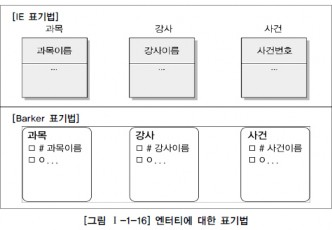
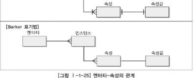
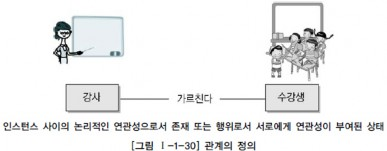

 #엔터티
\
<ol id="l1"> ##엔터티의 개념\
\
데이터 모델을 이해할 때 가장 명확하게 이해해야 하는 개념 중에 하나가 바로 엔터티(Entity)이다. 이것은 우리말로 실체, 객체라고 번역하기도 하는데 실무적으로 엔터티라는 외래어를 많이 사용하기 때문에 본 가이드에서는 엔터티라는 용어를 그대로 사용하기로 한다. 엔터티에 대해서 데이터 모델과 데이터베이스에 권위자가 정의한 사항은 다음과 같다.\
\
변별할 수 있는 사물 - Peter Chen (1976) -\
데이터베이스 내에서 변별 가능한 객체 - C.J Date (1986) -\
정보를 저장할 수 있는 어떤 것 - James Martin (1989) -\
정보가 저장될 수 있는 사람, 장소, 물건, 사건 그리고 개념 등 - Thomas Bruce (1992) - 위 정의들의 공통점은 다음과 같다.\
\
엔터티는 사람, 장소, 물건, 사건, 개념 등의 명사에 해당한다.\
엔터티는 업무상 관리가 필요한 관심사에 해당한다.\
엔터티는 저장이 되기 위한 어떤 것(Thing)이다.\
엔터티란 “업무에 필요하고 유용한 정보를 저장하고 관리하기 위한 집합적인 것(Thing)”으로 설명할 수 있다. 또는, 엔터티는 업무 활동상 지속적인 관심을 가지고 있어야 하는 대상으로서 그 대상들 간에 동질성을 지닌 인스턴스들이나 그들이 행하는 행위의 집합으로 정의할 수 있다. 엔터티는 그 집합에 속하는 개체들의 특성을 설명할 수 있는 속성(Attribute)을 갖는데, 예를 들어 ‘학생’이라는 엔터티는 학번, 이름, 이수학점, 등록일자, 생일, 주소, 전화번호, 전공 등의 속성으로 특징지어질 수 있다. 이러한 속성 가운데에는 엔터티 인스턴스 전체가 공유할 수 있는 공통 속성도 있고, 엔터티 인스턴스 중 일부에만 해당하는 개별 속성도 있을 수 있다. 또한 엔터티는 인스턴스의 집합이라고 말할 수 있고, 반대로 인스턴스라는 것은 엔터티의 하나의 값에 해당한다고 정의할 수 있다. 예를 들어 과목은 수학, 영어, 국어가 존재할 수 있는데 수학, 영어, 국어는 각각이 과목이라는 엔터티의 인스턴스들이라고 할 수 있다. 또한 사건이라는 엔터티에는 사건번호2010-001, 2010-002 등의 사건이 인스턴스가 될 수 있다. 엔터티를 이해할 때 눈에 보이는(Tangible)한 것만 엔터티로 생각해서는 안되며 눈에 보이지 않는 개념 등에 대해서도 엔터티로서 인식을 할 수 있어야 한다. 실제 업무상에는 눈에 보이지 않는 것(Thing)이 엔터티로 도출되는 경우가 많기 때문에 더더욱 주의할 필요가 있다. \

 ##엔터티와 인스턴스에 대한 내용과 표기법
\
엔터티를 표현하는 방법은 각각의 표기법에 따라 조금씩 차이는 있지만 대부분 사각형으로 표현된다. 다만 이 안에 표현되는 속성의 표현방법이 조금씩 다를 뿐이다. 엔터티와 엔터티간의 ERD를 그리면 [그림 Ⅰ-1-15]와 같이 표현할 수 있다.\
\
\
[그림 Ⅰ-1-15]에서 과목, 강사, 사건은 엔터티에 해당하고 수학, 영어는 과목이라는 엔터티의 인스턴스이고 이춘식, 조시형은 강사라는 엔터티의 인스턴스이며 사건번호인 2010-001, 2010-002는 사건 엔터티에 대한 인스턴스에 해당한다.\
※ 참고 : 오브젝트 모델링에는 클래스(Class)와 오브젝트(Object)라는 개념이 있다. 클래스는 여러 개의 오브젝트를 포함하는 오브젝트 깡통이다. 이러한 개념은 정보공학의 엔터티가 인스턴스를 포함하는 개념과 비슷하다.\
위의 엔터티와 인스턴스를 표현하면 [그림 Ⅰ-1-16]과 같다.\
\

 ##엔터티의 특징
엔터티는 다음과 같은 특징을 가지고 있으며 만약 도출된 엔터티가 다음의 성질을 만족하지 못하면 적절하지 않은 엔터티일 확률이 높다. \
반드시 해당 업무에서 필요하고 관리하고자 하는 정보이어야 한다.(예. 환자, 토익의 응시횟수, …) 유일한 식별자에 의해 식별이 가능해야 한다.\
영속적으로 존재하는 인스턴스의 집합이어야 한다.(‘한 개’가 아니라 ‘두 개 이상’) 엔터티는 업무 프로세스에 의해 이용되어야 한다.\
엔터티는 반드시 속성이 있어야 한다.\
엔터티는 다른 엔터티와 최소 한 개 이상의 관계가 있어야 한다.\

 ###가. 업무에서 필요로 하는 정보
\
\
엔터티 특징의 첫 번째는 반드시 시스템을 구축하고자 하는 업무에서 필요로 하고 관리하고자 하는 정보여야 한다는 점이다. 예를 들어 환자라는 엔터티는 의료시스템을 개발하는 병원에서는 반드시 필요한 엔터티이지만 일반회사에서 직원들이 병에 걸려 업무에 지장을 준다하더라도 이 정보를 그 회사의 정보로서 활용하지는 않을 것이다. 즉 시스템 구축 대상인 해당업무에서 그 엔터티를 필요로 하는가를 판단하는 것이 중요하다. \
\
사람이 살아가면서 환자는 발생할 수 밖에 없다. 그러나 일반회사의 인사시스템에서는 비록 직원들에 의해서 환자가 발생이 되지만 인사업무 영역에서 환자를 별도로 관리할 필요가 없다. 다른 예로 병원에서는 환자가 해당 업무의 가장 중요한 엔터티가 되어 꼭 관리해야 할 엔터티가 된다. 이와 같이 엔터티를 도출할 때는 업무영역 내에서 관리할 필요가 있는지를 먼저 판단하는 것이 중요하다.\

 ###나. 식별이 가능해야 함
\
\
두 번째는 식별자(Unique Identifier)에 의해 식별이 가능해야 한다는 점이다. 어떤 엔터티이건 임의의 식별자(일련번호)를 부여하여 유일하게 만들 수는 있지만, 엔터티를 도출하는 경우에 각각의 업무적으로 의미를 가지는 인스턴스가 식별자에 의해 한 개씩만 존재하는지 검증해 보아야 한다. 유일한 식별자는 그 엔터티의 인스턴스만의 고유한 이름이다. 두 개 이상의 엔터티를 대변하면 그 식별자는 잘못 설계된 것이다. 예를 들어 직원을 구분할 수 있는 방법은 이름이나 사원번호가 될 수가 있다. 그러나 이름은 동명이인(同名異人)이 될 수 있으므로 유일하게 식별될 수 없다. 사원번호는 회사에 입사한 사람에게 고유하게 부여된 번호이므로 유일한 식별자가 될 수 있는 것이다.\
\
\

 ###다. 인스턴스의 집합
\
세 번째는 영속적으로 존재하는 인스턴스의 집합이 되어야 한다는 점이다. 엔터티의 특징 중 “한 개”가 아니라 “두 개 이상”이라는 집합개념은 매우 중요한 개념이다. 두 개 이상이라는 개념은 엔터티뿐만 아니라 엔터티간의 관계 프로세스와의 관계 등 업무를 분석하고 설계하는 동안 설계자가 모든 업무에 대입해보고 검증해?러 개의 인스턴스를 포함한다.\
\

 ###라

 ###업무프로세스에 의해 이용
\
.\
네 번째는 업무프로세스(Business Process)가 그 엔터티를 반드시 이용해야 한다는 점이다. 첫 번째 정의에서처럼 업무에서 반드시 필요하다고 생각하여 엔터티로 선정하였는데 업무프로세스에 의해 전혀 이용되지 않는다면 업무 분석이 정확하게 안되어 엔터티가 잘못 선정되거나 업무프로세스 도출이 적절하게 이루어지지 않았음을 의미한다. 이러한 경우는 데이터 모델링을 할 때 미처 발견하지 못하다가 프로세스 모델링을 하면서 데이터 모델과 검증을 하거나, 상관 모델링을 할 때 엔터티와 단위프로세스를 교차 점검하면서 문제점이 도출된다.\
\
\
[그림 Ⅰ-1-20]과 같이 업무프로세스에 의해 CREATE, READ, UPDATE, DELETE 등이 발생하지 않는 고립된 엔터티의 경우는 엔터티를 제거하거나 아니면 누락된 프로세스가 존재하는지 살펴보고 해당 프로세스를 추가해야 한다.\

 ###마. 속성을 포함
\
\
다섯 번째는 엔터티에는 반드시 속성(Attributes)이 포함되어야 한다는 점이다. 속성을 포함하지 않고 엔터티의 이름만 가지고 있는 경우는 관계가 생략되어 있거나 업무 분석이 미진하여 속성정보가 누락되는 경우에 해당한다. 또한 주식별자만 존재하고 일반속성은 전혀 없는 경우도 마찬가지로 적절한 엔터티라고 할 수 없다. 단, 예외적으로 관계엔터티(Associative Entity)의 경우는 주식별자 속성만 가지고 있어도 엔터티로 인정한다. \
\

 ###바. 관계의
 ###존재
 
\
\
여섯 번째는 엔터티는 다른 엔터티와 최소 한 개 이상의 관계가 존재해야 한다는 것이다. 기본적으로 엔터티가 도출되었다는 것은 해당 업무내에서 업무적인 연관성 (존재적 연관성, 행위적 연관성)을 가지고 다른 엔터티와의 연관의 의미를 가지고 있음을 나타낸다. 그러나 관계가 설정되지 않은 엔터티의 도출은 부적절한 엔터티가 도출되었거나 아니면 다른 엔터티와 적절한 관계를 찾지 못했을 가능성이 크다.\
\
단, 데이터 모델링을 하면서 관계를 생략하여 표현해야 하는 경우는 다음과 같은 통계성 엔터티 도출, 코드성 엔터티 도출, 시스템 처리시 내부 필요에 의한 엔터티 도출과 같은 경우이다.\
<ol id="l2">통계를 위한 엔터티의 경우는 업무진행 엔터티로부터 통계업무만(Read Only)을 위해 별도로 엔터티를 다시 정의하게 되므로 엔터티간의 관계가 생략되는 경우에 해당한다.\
코드를 위한 엔터티의 경우 너무 많은 엔터티와 엔터티간의 관계 설정으로 인해 데이터 모델의 읽기효율성(Readability)이 저하되어 도저히 모델링 작업을 진행할 수 없게 된다. 또한 코드성 엔터티는 물리적으로 테이블과 프로그램 구현 이후에도 외부키에 의한 참조무결성을 체크하기 위한 규칙을 데이터베이스 기능에 맡기지 않는 경우가 대부분이기 때문에 논리적으로나 물리적으로 관계를 설정할 이유가 없다.\
시스템 처리시 내부 필요에 의한 엔터티(예를 들어, 트랜잭션 로그 테이블 등)의 경우 트랜잭션이 업무적으로 연관된 테이블과 관계 설정이 필요하지만 이 역시 업무적인 필요가 아니고 시스템 내부적인 필요에 의해 생성된 엔터티이므로 관계를 생략하게 된다. </ol>
 ##엔터티의 분류
엔터티는 엔터티 자신의 성격에 의해 실체유형에 따라 구분하거나 업무를 구성하는 모습에 따라 구분이 되는 발생시점에 의해 분류해 볼 수 있다. \
\
\
가. 유무(有無)형에 따른 분류\
일반적으로 엔터티는 유무형에 따라 유형엔터티, 개념엔터티, 사건엔터티로 구분된다.\
유형엔터티(Tangible Entity)는 물리적인 형태가 있고 안정적이며 지속적으로 활용되는 엔터티로 업무로부터 엔터티를 구분하기가 가장 용이하다. 예를 들면, 사원, 물품, 강사 등이 이에 해당된다. 개념엔터티(Conceptual Entity)는 물리적인 형태는 존재하지 않고 관리해야 할 개념적 정보로 구분이 되는 엔터티로 조직, 보험상품 등이 이에 해당된다.\
사건 엔터티(Event Entity)는 업무를 수행함에 따라 발생되는 엔터티로서 비교적 발생량이 많으며 각종 통계자료에 이용될 수 있다. 주문, 청구, 미납 등이 이에 해당된다.\
\
\
\
나. 발생시점(發生時點)에 따른 분류\
엔터티의 발생시점에 따라 기본/키엔터티(Fundamental Entity, Key Entity), 중심엔터티(Main Entity), 행위엔터티(Active Entity)로 구분할 수 있다. <ol id="l3">기본엔터티\
기본엔터티란 그 업무에 원래 존재하는 정보로서 다른 엔터티와 관계에 의해 생성되지 않고 독립적으로 생성이 가능하고 자신은 타 엔터티의 부모의 역할을 하게 된다. 다른 엔터티로부터 주식별자를 상속받지 않고 자신의 고유한 주식별자를 가지게 된다. 예를 들어 사원, 부서, 고객, 상품, 자재 등이 기본엔터티가 될 수 있다. 중심엔터티\
중심엔터티란 기본엔터티로부터 발생되고 그 업무에 있어서 중심적인 역할을 한다. 데이터의 양이 많이 발생되고 다른 엔터티와의 관계를 통해 많은 행위엔터티를 생성한다. 예를 들어 계약, 사고, 예금원장, 청구, 주문, 매출 등이 될 수 있다.\
행위엔터티\
</ol>행위엔터티는 두 개 이상의 부모엔터티로부터 발생되고 자주 내용이 바뀌거나 데이터량이 증가된다. 분석초기 단계에서는 잘 나타나지 않으며 상세 설계단계나 프로세스와 상관모델링을 진행하면서 도출될 수 있다. 예를 들어 주문목록, 사원변경이력 등이 포함된다. 
 ###다. 엔터티
 ###분류
 ###방법의
 ###예

 
\
[그림 Ⅰ-1-23]은 두 가지 엔터티 분류 방법에 대한 예를 나타낸 것이다.\
\
\
이 밖에도 엔터티가 스스로 생성될 수 있는지 여부에 따라 독립엔터티인지 의존엔터티인지를 구분할 수도 있다. 
 ##엔터티의 명명
</ol>\
엔터티를 명명하는 일반적인 기준은 용어를 사용하는 모든 표기법이 다 그렇듯이 첫 번째는 가능하면 현업업무에서 사용하는 용어를 사용한다. 두 번째는 가능하면 약어를 사용하지 않는다. 세 번째는 단수명사를 사용한다. 네 번째는 모든 엔터티에서 유일하게 이름이 부여되어야 한다. 다섯 번째는 엔터티 생성의미대로 이름을 부여한다.\
첫 번째에서 네 번째에 해당하는 원칙은 대체적으로 잘 지켜진다. 그러나 다섯 번째 원칙인 “엔터티 생성의미대로 이름을 부여한다.”에 대해서는 적절하지 못한 엔터티명이 부여되는 경우가 빈번하게 발생한다. 중심엔터티에서도 간혹 적절하지 못한 엔터티명을 사용한 경우가 발생되고 행위엔터티의 경우에는 꽤 많은 경우에 적절하지 못한 엔터티명을 사용하는 경우가 발생된다. 예를 들어, 고객이 어떤 제품? 주문목록이라고도 할 수 있고 고객제품이라고 할 수 있다. 만약 고객제품이라고 하면 ‘고객이 주문한 제품’인지 아니면 ‘고객의 제품’인지 의미가 애매모호해질 수 있게 된다. 엔터티의 이름을 업무목적에 따라 생성되는 자연스러운 이름을 부여해야 하는데 이와 상관없이 임의로 이름을 부여하게 되면 프로젝트에서는 커뮤니케이션 오류로 인해 문제를 야기할 수 있게 된다. 
 #속성
\
<ol id="l4"> ##속성 (Attribute)의 개념\
\
속성이란 사전적인 의미로는 사물(事物)의 성질, 특징 또는 본질적인 성질, 그것이 없다면 실체를 생각할 수 없는 것으로 정의할 수 있다. 본질적 속성이란 어떤 사물 또는 개념에 없어서는 안 될 징표(徵表)의 전부이다. 이 징표는 사물이나 개념이 어떤 것인지를 나타내고 그것을 다른 것과 구별하는 성질이라고 할 수 있다. 이런 사전적인 정의 이외에 데이터 모델링 관점에서 속성을 정의하자면, “업무에서 필요로 하는 인스턴스로 관리하고자 하는 의미상 더 이상 분리되지 않는 최소의 데이터 단위”로 정의할 수 있다. 업무상 관리하기 위한 최소의 의미 단위로 생각할 수 있고, 이것은 엔터티에서 한 분야를 담당하고 있다. \
\
속성의 정의를 정리해 보면 다음과 같다.\
\
업무에서 필요로 한다.\
의미상 더 이상 분리되지 않는다.\
엔터티를 설명하고 인스턴스의 구성요소가 된다.\
의미상 더 이상 분리되지 않는다는 특징을 살펴보면 다음과 같다. 예를 들어 생년월일은 하나로서 의미가 있다. 만약 이것을 생년, 생월, 생일로 구분한다면 이것은 사실상 하나의 속성을 관리목적에 따라 구분했다라고 이해할 수 있다. 이러한 이유로 인해 S/W비용을 산정하는 기능점수(Function Point)를 산정할 때 이렇게 분리된 속성은 하나의 속성(DET)으로 계산하게 된다. 그러나 만약 서로 관련이 없는 이름, 주소를 하나의 속성 ‘이름주소’로 정의하면 어떻게 될까? 이것은 하나의 속성의 두 개의 의미를 갖기 때문에 기본속성으로서 성립하지 않게 된다. 이렇게 정리된 속성은 그냥 값의 의미로서 속성보다는 내역(Description)으로서 속성으로 예를 들어 인적사항이라는 속성으로 정의하여 관리할 수는 있다.\

 ##엔터티, 인스턴스와 속성, 속성값에 대한 내용과 표기법

 ###가. 엔터티, 인스턴스, 속성, 속성값의 관계
\
\
엔터티에는 두 개 이상의 인스턴스가 존재하고 각각의 엔터티에는 고유의 성격을 표현하는 속성정보를 두 개 이상 갖는다. 업무에서는 엔터티를 구성하는 특징이 무엇인지 또한 각각의 인스턴스들은 어떤 성격의 데이터로 구성되는지를 파악하는 작업이 필요하다. 분석단계에서 엔터티 내에 존재하는 여러 개의 인스턴스가 가지는 동일한 성격은 무엇인지를 파악하고 이에 이름을 부여하여 엔터티의 속성으로 기술하는 작업이 필요하다. 예를 들면 사원은 이름, 주소, 전화번호, 직책 등을 가질 수 있다. 사원이라는 엔터티에 속한 인스턴스들의 성격을 구체적으로 나타내는 항목이 바로 속성이다. 각각의 인스턴스는 속성의 집합으로 설명될 수 있다. 하나의 속성은 하나의 인스턴스에만 존재할 수 있다. 속성은 관계로 기술될 수 없고 자신이 속성을 가질 수도 없다. 엔터티 내에 있는 하나의 인스턴스는 각각의 속성들의 대해 한 개의 속성값만을 가질 수 있다. 예를 들면 사원의 이름은 홍길동이고 주소는 서울시 강남구이며, 전화번호는 123-4567, 직책은 대리이다. 이름, 주소, 전화번호, 직책은 속성이고 홍길동, 서울시 강남구, 123-4567, 대리는 속성값이다. 그러므로 속성값은 각각의 엔터티가 가지는 속성들의 구체적인 내용이라 할 수 있다.\
엔터티, 인스턴스, 속성, 속성값에 대한 관계를 분석하면 다음과 같은 결과를 얻을 수 있다. \
한 개의 엔터티는 두 개 이상의 인스턴스의 집합이어야 한다.\
한 개의 엔터티는 두 개 이상의 속성을 갖는다.\
\
한 개의 속성은 한 개의 속성값을 갖는다.\
\
속성은 엔터티에 속한 엔터티에 대한 자세하고 구체적인 정보를 나타내며 각각의 속성은 구체적인 값을 갖게 된다. 예를 들어 사원이라는 엔터티에는 홍길동이라는 사람(엔터티)이 있을 수 있다. 홍길동이라는 사람의 이름은 홍길동이고 주소는 서울시 강서구이며 생년월일 1967년 12월 31일이다. 여기에 이름, 주소, 생년월일과 같은 각각의 값을 대표하는 이름들을 속성이라 하고 홍길동, 서울시 강서구, 1967년 12월 31일과 같이 각각의 이름에 대한 구체적인 값을 속성 값(VALUE)이라고 한다.\

 ###나. 속성의 표기법
\
\
속성의 표기법은 엔터티 내에 이름을 포함하여 표현하면 된다.\
\

 ##속성의 특징
속성은 다음과 같은 특징을 가지고 있으며 만약 도출된 속성이 다음의 성질을 만족하지 못하면 적절하지 않은 속성일 확률이 높다. \
엔터티와 마찬가지로 반드시 해당 업무에서 필요하고 관리하고자 하는 정보이어야 한다. (예, 강사의 교재이름) 정규화 이론에 근간하여 정해진 주식별자에 함수적 종속성을 가져야 한다.\
하나의 속성에는 한 개의 값만을 가진다. 하나의 속성에 여러 개의 값이 있는 다중값일 경우 별도의 엔터티를 이용하여 분리한다.
 ##속성의 분류

 ###가. 속성의 특성에 따른 분류
\
\
속성은 업무분석을 통해 바로 정의한 속성을 기본속성(Basic Attribute), 원래 업무상 존재하지는 않지만 설계를 하면서 도출해내는 속성을 설계속성(Designed Attribute), 다른 속성으로부터 계산이나 변형이 되어 생성되는 속성을 파생속성(Derived Attribute)이라고 한다. <ol id="l5">기본속성\
기본 속성은 업무로부터 추출한 모든 속성이 여기에 해당하며 엔터티에 가장 일반적이고 많은 속성을 차지한다. 코드성 데이터, 엔터티를 식별하기 위해 부여된 일련번호, 그리고 다른 속성을 계산하거나 영향을 받아 생성된 속성을 제외한 모든 속성은 기본속성이다. 주의해야 할 것은 업무로부터 분석한 속성이라도 이미 업무상 코드로 정의한 속성이 많다는 것이다. 이러한 경우도 속성의 값이 원래 속성을 나타내지 못하므로 기본속성이 되지 않는다. 설계속성\
설계속성은 업무상 필요한 데이터 이외에 데이터 모델링을 위해, 업무를 규칙화하기 위해 속성을 새로 만들거나 변형하여 정의하는 속성이다. 대개 코드성 속성은 원래 속성을 업무상 필요에 의해 변형하여 만든 설계속성이고 일련번호와 같은 속성은 단일(Unique)한 식별자를 부여하기 위해 모델 상에서 새로 정의하는 설계속성이다.\
파생속성\
</ol>\
파생속성은 다른 속성에 영향을 받아 발생하는 속성으로서 보통 계산된 값들이 이에 해당된다. 다른 속성에 영향을 받기 때문에 프로세스 설계 시 데이터 정합성을 유지하기 위해 유의해야 할 점이 많으며 가급적 파생속성을 적게 정의하는 것이 좋다.\
\
이러한 분류 방식은 프로젝트에서 엄격하게 분류하여 속성정의서에 나열하는 경우도 있다?? 속성의 정의서의 기록함으로써 향후 속성 값에 대한 검증 시 활용되기도 한다. 파생속성은 그 속성이 가지고 있는 계산방법에 대해서 반드시 어떤 엔터티에 어떤 속성에 의해 영향을 받는지 정의가 되어야 한다. 예를 들어 ‘이자’라는 속성이 존재한다고 하면 이자는 원금이 1,000원이고 예치기간이 5개월이며 이자율이 5.0%에서 계산되는 속성값이다. 그렇다면 이자는 원금이 1,000원에서 2,000원으로 변하여도 영향을 받고 예치기간이 5개월에서 7개월로 증가하여도 값이 변하며 이자율이 5.0%에서 6.0%로 되어도 이자속성이 가지는 값은 변할 것이다. 한 번 값이 변해도 또 다시 영향을 미치는 속성값의 조건이 변한다면 이자의 값은 지속적으로 변경될 것이다. 이와 같이 타 속성에 의해 지속적으로 영향을 받아 자신의 값이 변하는 성질을 가지고 있는 속성이 파생속성이다. 파생속성은 될 수 있으면 꼭 필요한 경우에만 정의하도록 하여 업무로직이 속성내부에 숨지 않도록 하는 것이 좋다. 파생속성을 정의한 경우는 속성정의서에 파생속성이 가지는 업무로직을 기술하여 데이터의 정합성이 유지될 수 있도록 해야 하며 그 파생속성에 원인이 되는 속성을 이용하는 모든 애플리케이션에서는 값을 생성하고, 수정하고 삭제할 때 파생속성도 함께 고려해 주어야 한다. 파생속성은 일반 엔터티에서는 많이 사용하지 않으며 통계관련 엔터티나 배치 작업이 수행되면서 발생되는 엔터티의 경우 많이 이용된다. 
 ###나. 엔터티 구성방식에 따른 분류
\
\
엔터티를 식별할 수 있는 속성을 PK(Primary Key)속성, 다른 엔터티와의 관계에서 포함된 속성을 FK(Foreign Key)속성, 엔터티에 포함되어 있고 PK, FK에 포함되지 않은 속성을 일반속성이라 한다.\
\
\
\
또한 속성은 그 안에 세부 의미를 쪼갤 수 있는지에 따라 단순형 혹은 복합형으로 분류할 수 있다. 예를 들면 주소 속성은 시, 구, 동, 번지 등과 같은 여러 세부 속성들로 구성될 수 있는데 이를 복합 속성(Composite Attribute)이라 한다. 또한 나이, 성별 등의 속성은 더 이상 다른 속성들로 구성될 수 없는 단순한 속성이므로 단순 속성(Simple Attribute)이라 한다.\
일반적으로 속성은 하나의 값을 가지고 있으나, 그 안에 동일한 성질의 여러 개의 값이 나타나는 경우가 있다. 이 때 속성 하나에 한 개의 값을 가지는 경우를 단일값 (Single Value), 그리고 여러 개의 값을 가지는 경우를 다중값(Multi Value) 속성이라 한다. 주민등록번호와 같은 속성은 반드시 하나의 값만 존재하므로 이 속성은 단일값 속성(Single-Valued Attribute)이라 하고, 어떤 사람의 전화번호와 같은 속성은 집, 휴대전화, 회사 전화번호와 같이 여러 개의 값을 가질 수 있다. 자동차의 색상 속성도 차 지붕, 차체, 외부의 색이 다를 수 있다. 이런 속성을 다중값 속성(Multi-Valued Attribute)이라 한다. 다중값 속성의 경우 하나의 엔터티에 포함될 수 없으므로 1차 정규화를 하거나, 아니면 별도의 엔터티를 만들어 관계로 연결해야 한다.\

 ##도메인(Domain)
각 속성은 가질 수 있는 값의 범위가 있는데 이를 그 속성의 도메인(Domain)이라 한다. 예를 들면 학생이라는 엔터티가 있을 때 학점이라는 속성의 도메인은 0.0에서 4.0 사이의 실수 값이며 주소라는 속성은 길이가 20자리 이내인 문자열로 정의할 수 있다. 여기서 물론 각 속성은 도메인 이외의 값을 갖지 못한다. 따라서 도메인을 좀더 이해하기 쉽게 정리하면, 엔터티 내에서 속성에 대한 데이터타입과 크기 그리고 제약사항을 지정하는 것이라 할 수 있다. 
 ##속성의 명명(Naming)fffff
</ol>\
C/S(Client/Server) 환경이든 Web 환경이든 속성명이 곧 사용자 인터페이스(User Interface)에 나타나기 때문에 업무와 직결되는 항목이다. 그래서 속성 이름을 정확하게 부여하고 용어의 혼란을 없애기 위해 용어사전이라는 업무사전을 프로젝트에 사용하게 된다. 또한 각 속성이 가지는 값의 종류와 범위를 명확하게 하기 위해 도메인정의를 미리 하여 정의하여 용어사전과 같이 사용한다. 용어사전과 도메인정의를 같이 사용하여 프로젝트를 진행할 경우 용어적 표준과 데이터타입의 일관성을 확보할 수 있게 된다.\
속성명을 부여하는 원칙은 [그림 Ⅰ-1-29]와 같다.\
\
\
\
\
속성의 이름을 부여할 때는 현업에서 사용하는 이름을 부여하는 것이 가장 중요하다. 아무리 일반적인 용어라 할지라도 그 업무에서 사용되지 않으면 속성의 명칭으로 사용하지 않는 것이 좋다.\
일반적으로는 서술식의 속성명은 사용하지 말아야 한다. 명사형을 이용하고 수식어가 많이 붙지 않도록 유의하여 작성한다. 수식어가 많으면 의미파악이 힘들고 상세 설계단계에서 물리속성으로 전환하는데 명확한 의미파악이 어렵게 된다. 소유격도 사용하지 않는다. 공용화되지 않은 업무에서 사용하지 않는 약어는 사용하지 않는 것이 좋다. 지나치게 약어를 많이 사용하면 업무분석자 내에서도 의사소통이 제약을 받으며 시스템을 운영할 때도 많은 불편을 초래할 수 있다.\
가능하면 모든 속성의 이름은 유일하게 작성하는 것이 좋다. 물론 대량의 속성을 정의하는 경우 유일하게 작성하는 것이 어려울 수도 있지만 이렇게 하는 것이 나중에 데이터에 대한 흐름을 파악하고 데이터의 정합성을 유지하는데 큰 도움이 된다. 또한 반정규화(테이블통합, 분리, 칼럼의 중복 등)를 적용할 때 속성명의 충돌(Conflict)을 해결하여 안정적으로 반정규화를 적용할 수 있게 된다.\

 #관계
\
<ol id="l6"> ##관계의 개념\

 ###가. 관계의 정의
\
\
관계(Relationship)를 사전적으로 정의하면 상호 연관성이 있는 상태로 말할 수 있다. 이것을 데이터 모델에 대입하여 정의해 보면, “엔터티의 인스턴스 사이의 논리적인 연관성으로서 존재의 형태로서나 행위로서 서로에게 연관성이 부여된 상태”라고 할 수 있다. 관계는 엔터티와 엔터티 간 연관성을 표현하기 때문에 엔터티의 정의에 따라 영향을 받기도 하고, 속성 정의 및 관계 정의에 따라서도 다양하게 변할 수 있다. \
\

 ###나. 관계의 패어링
\
\
유의해야할 점은 관계는 엔터티 안에 인스턴스가 개별적으로 관계를 가지는 것(패어링)이고 이것의 집합을 관계로 표현한다는 것이다. 따라서 개별 인스턴스가 각각 다른 종류의 관계를 가지고 있다면 두 엔터티 사이에 두 개 이상의 관계가 형성될 수 있다. 각각의 엔터티의 인스턴스들은 자신이 관련된 인스턴스들과 관계의 어커런스로 참여하는 형태를 관계 패어링(Relationship Paring)이라 한다. [그림 Ⅰ-1-31]에서는 강사인 정성철은 이춘식과 황종하에게 강의를 하는 형태로 관계가 표현되어 있고 조시형은 황종하에게 강의를 하는 형태로 되어 있다. 이와 같이 엔터티내에 인스턴스와 인스턴스사이에 관계가 설정되어 있는 어커런스를 관계 패어링이라고 한다. 엔터티는 인스턴스의 집합을 논리적으로 표현하였다면 관계는 관계 패어링의 집합을 논리적으로 표현한 것이다.\
최초의 ERD(Chen 모델)에서 관계는 속성을 가질 수 있었으나 요즘 ERD에서는 관계를 위해 속성을 도출하지는 않는다. 관계의 표현에는 이항 관계(Binary Relationship), 삼항 관계(Ternary Relationship), n항 관계가 존재할 수 있는데 실제에 있어서 삼항 관계 이상은 잘 나타나지 않는다. \

 ##관계의 분류
관계가 존재에 의한 관계와 행위에 의한 관계로 구분될 수 있는 것은 관계를 연결함에 있어 어떤 목적으로 연결되었느냐에 따라 분류하기 때문이다.\
\
\
[그림 Ⅰ-1-32]에서 왼쪽 편에 있는 모델은 황경빈이란 사원이 DB팀에 소속되어 있는 상태를 나타낸다. ‘소속된다’라는 의미는 행위에 따른 이벤트에 의해 발생되는 의미가 아니고 그냥 황경빈사원이 DB팀에 소속되어 있기 때문에 나타나는 즉 존재의 형태에 의해 관계가 형성되어 있는 것이다. 반면에 오른편에 있는 김경재 고객은 ‘주문한다’라는 행위를 하여 CTA201이라는 주문번호를 생성하였다. 주문 엔터티의 CTA201 주문번호는 김경재 고객이 ‘주문한다’라는 행위에 의해 발생되었기 때문에 두 엔터티 사이의 관계는 행위에 의한 관계가 되는 것이다. UML(Unified Modeling Language)에는 클래스다이어그램의 관계중 연관관계(Association)와 의존관계(Dependency)가 있다. 이 둘의 차이는 연관관계는 항상 이용하는 관계로 존재적 관계에 해당하고 의존관계는 상대방 클래스의 행위에 의해 관계가 형성될 때 구분하여 표현한다는 것이다. 즉, ERD에서는 존재적 관계와 행위에 의한 관계를 구분하지 않고 표현했다면 클래스다이어그램에서는 이것을 구분하여 연관관계와 의존관계로 표현하고 있는 것이다. 연관관계는 표현방법이 실선으로 표현되고 소스코드에서 멤버변수로 선언하여 사용하게 하고, 의존관계는 점선으로 표현되고 행위를 나타내는 코드인 Operation(Method)에서 파라미터 등으로 이용할 수 있도록 되어 있다.\

 ##관계의 표기법
관계에서는 표기법이 상당히 복잡하고 여러 가지 의미를 가지고 있다. 다음 3가지 개념과 함께 표기법을 이해할 필요가 있다. \
관계명(Membership) : 관계의 이름\
관계차수(Cardinality) : 1:1, 1:M, M:N\
관계선택사양(Optionality) : 필수관계, 선택관계\

 ###가. 관계명(Membership)
\
\
\
관계명은 엔터티가 관계에 참여하는 형태를 지칭한다. 각각의 관계는 두 개의 관계명을 가지고 있다. 또한 각각의 관계명에 의해 두 가지의 관점으로 표현될 수 있다. \
\
\
엔터티에서 관계가 시작되는 편을 관계시작점(The Beginning)이라고 부르고 받는 편을 관계끝점(The End)이라고 부른다. 관계 시작점과 끝점 모두 관계이름을 가져야 하며 참여자의 관점에 따라 관계이름이 능동적(Active)이거나 수동적(Passive)으로 명명된다. 관계명은 다음과 같은 명명규칙에 따라 작성해야 한다. \
애매한 동사를 피한다. 예를 들면 ‘관계된다’, ‘관련이 있다’, ‘이다’, ‘한다’ 등은 구체적이지 않아 어떤 행위가 있는지 또는 두 참여자간 어떤 상태가 존재하는지 파악할 수 없다.\
현재형으로 표현한다. 예를 들면 ‘수강을 신청했다’, ‘강의를 할 것이다’라는 식으로 표현해서는 안된다. ‘수강 신청한다’, ‘강의를 한다’로 표현해야 한다. 
 ###나. 관계차수(Degree/Cardinality)
\
\
\
두 개의 엔터티간 관계에서 참여자의 수를 표현하는 것을 관계차수(Cardinality)라고 한다. 가장 일반적인 관계차수 표현방법은 1:M, 1:1, M:N이다. 가장 중요하게 고려해야 할 사항은 한 개의 관계가 존재하느냐 아니면 두 개 이상의 멤버쉽이 존재하는지를 파악하는 것이 중요하다. 관계차수를 표시하는 방법은 여러 가지 방법이 있지만 Crow’s Foot 모델에서는 선을 이용하여 표현한다. 한 개가 참여하는 경우는 실선을 그대로 유지하고 다수가 참여한 경우는(Many) 까마귀발과 같은 모양으로 그려준다.\
<ol id="l7">1:1(ONE TO ONE) 관계를 표시하는 방법\
\
\
관계에 참여하는 각각의 엔터티는 관계를 맺는 다른 엔터티의 엔터티에 대해 단지 하나의 관계만을 가지고 있다. 1:M(ONE TO MANY) 관계를 표시하는 방법\
\
관계에 참여하는 각각의 엔터티는 관계를 맺는 다른 엔터티의 엔터티에 대해 하나나 그 이상의 수와 관계를 가지고 있다. 그러나 반대의 방향은 단지 하나만의 관계를 가지고 있다.\
M:M(MANY TO MANY) 관계를 표시하는 방법\
</ol>\
관계엔터티의 엔터티에 대해 하나나 그 이상의 수와 관계를 가지고 있다. 반대의 방향도 동일하게 관계에 참여하는 각각의 엔터티는 관계를 맺는 다른 엔터티의 엔터티에 대해 하나 또는 그 이상의 수와 관계를 가지고 있다. 이렇게 M:N 관계로 표현된 데이터 모델은 이후에 두 개의 주식별자를 상속받은 관계엔터티를 이용하여 3개의 엔터티로 구분하여 표현한다.\

 ###다. 관계선택사양(Optionality)
\
\
\
요즈음 웬만한 대도시에는 지하철이 많이 운행된다. 만약 지하철 문이 닫히지 않았는데 지하철이 떠난다면 무슨 일이 발생할까? 아마도 어떤 사람은 머리만 지하철 안에 들어오고 몸은 밖에 있는 채로 끌려갈 것이고, 또 어떤 사람은 가방만 지하철에 실어 보내는 사람도 있을 것이고, 지하철과 승강기 사이에 몸이 낄 수도 있을 것이다. 물론 지하철운행과 지하철문의 관계는 이렇게 설계되지 않아 위와 같은 어처구니없는 일은 발생하지 않을 것이다. “반드시 지하철의 문이 닫혀야만 지하철은 출발한다.” 지하철출발과 지하철문닫힘은 필수(Mandatory)적으로 연결 관계가 있는 것이다. 이와 같은 것이 데이터 모델의 관계에서는 필수참여관계(Mandatory)가 된다.\
또 지하철 안내방송시스템의 예를 들어보자. 지하철의 출발을 알리는 안내방송은 지하철의 출발과 상관없이 방송해도 아무런 문제가 발생하지 않는다. 물론 정해진 시간에 방송을 하면 승객에게 정보로서 유익하겠지만 꼭 그렇게 할 필요는 없다. 그래서 가끔씩 시스템의 녹음된 여성의 목소리가 아닌 시끄러운 남자 기사가 방송을 하는 경우가 있다. 안내방송시스템이 고장이 나도 지하철운행에는 별로 영향을 주지 않는다. 방송시점도 조금씩 다르게 나타나도 지하철이 출발하는 것과는 밀접하게 연관되지 않는다. 이와 같이 지하철의 출발과 지하철방송과는 정보로서 관련은 있지만 서로가 필수적인(Mandatory) 관계는 아닌 선택적인 관계(Optional)가 되는 것이다.\
\
\
\
이와 같은 것이 데이터 모델 관계에서는 선택참여관계(Optional)가 된다. 참여하는 엔터티가 항상 참여하는지 아니면 참여할 수도 있는지를 나타내는 방법이 필수 (Mandatory Membership)와 선택참여(Optional Membership)이다.\
필수참여는 참여하는 모든 참여자가 반드시 관계를 가지는, 타 엔터티의 참여자와 연결이 되어야 하는 관계이다. 예를 들면 주문서는 반드시 주문목록을 가져야 하며 주문목록이 없는 주문서는 의미가 없으므로 주문서와 주문목록은 필수참여관계가 되는 것이다. 반대로 목록은 주문이 될 수도 있고 주문이 되지 않은 목록이 있을 수도 있으므로 목록과 주문목록과의 관계는 선택참여(Optional Membership)가 되는 것이다. 선택참여된 항목은 물리속성에서 Foreign Key로 연결될 경우 Null을 허용할 수 있는 항목이 된다. 만약 선택참여로 지정해야 할 관계를 필수참여로 잘못 지정하면 애플리케이션에서 데이터가 발생할 때 반드시 한 개의 트랜잭션으로 제어해야 하는 제약사항이 발생한다. 그러므로 설계단계에서 필수참여와 선택참여는 개발시점에 업무 로직과 직접적으로 관련된 부분이므로 반드시 고려되어야 한다. 선택참여관계는 ERD에서 관계를 나타내는 선에서 선택참여하는 엔터티 쪽을 원으로 표시한다. 필수참여는 아무런 표시를 하지 않는다.\
\
만약 관계가 표시된 양쪽 엔터티에 모두 선택참여가 표시된다면, 즉 0:0(Zero to Zero)의 관계가 된다면 그 관계는 잘못될 확률이 많으므로 관계설정이 잘못되었는지를 검토해 보아야 한다.\
\
\
관계선택사양은 관계를 통한 상대방과의 업무적인 제약조건을 표현하는 것으로서 간단하면서 아주 중요한 표기법이다. 이것을 어떻게 설정했는지에 따라 참조무결성 제약조건의 규칙이 바뀌게 되므로 주의 깊게 모델링을 해야 한다.\

 ##관계의 정의 및 읽는 방법
</ol>
 ###가. 관계 체크사항
\
\
두 개의 엔터티 사이에서 관계를 정의할 때 다음 사항을 체크해 보도록 한다.\
