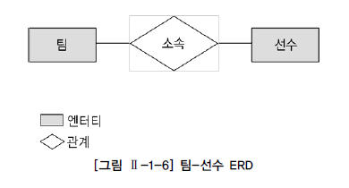
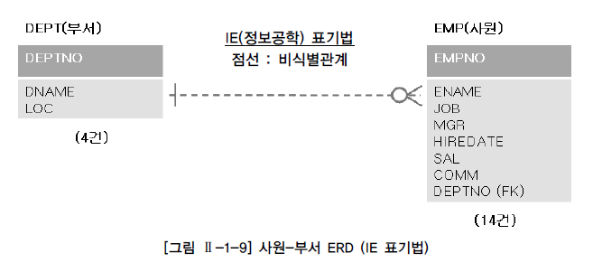
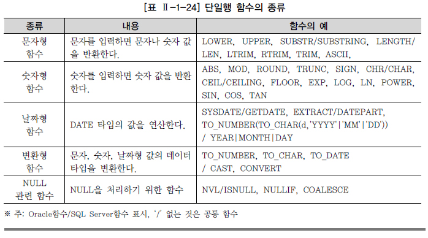
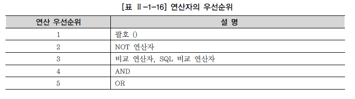
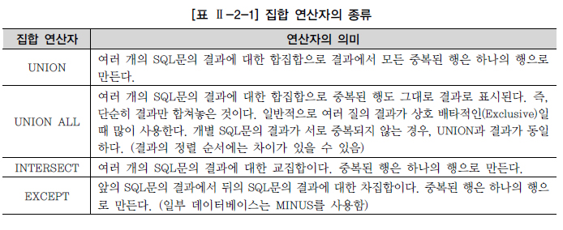
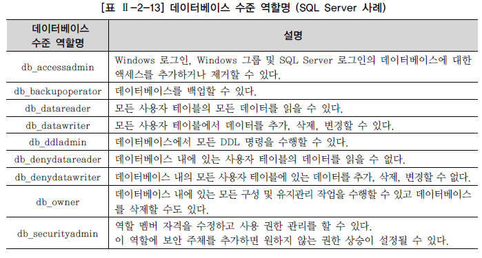

　 [관계형 데이터베이스 개요](#관계형-데이터베이스-개요)\
　　 [1. 데이터베이스](#1-데이터베이스)\
　　 [2. SQL(Structured Query Language)](#2-sqlstructured-query-language)\
　　 [3. TABLE](#3-table)\
　　 [4. ERD(Entity Relationship Diagram)](#4-erdentity-relationship-diagram)\
　 [함수(FUNCTION)](#함수function)\
　　 [1. 내장 함수(BUILT-IN FUNCTION) 개요](#1-내장-함수built-in-function-개요)\
　　 [2. 문자형 함수](#2-문자형-함수)\
　　 [3. 숫자형 함수](#3-숫자형-함수)\
　　 [4. 날짜형 함수](#4-날짜형-함수)\
　　 [5. 변환형 함수](#5-변환형-함수)\
　　 [6. CASE 표현](#6-case-표현)\
　　 [7. NULL 관련 함수](#7-null-관련-함수)\
　　　 [가. NVL/ISNULL 함수](#가-nvlisnull-함수)\
　　　 [나. NULL과 공집합](#나-null과-공집합)\
　　　 [다. NULLIF](#다-nullif)\
　　　 [라. 기타 NULL 관련 함수 (COALESCE)](#라-기타-null-관련-함수-coalesce)\
　 [WHERE 절](#where-절)\
　　 [1. WHERE 조건절 개요](#1-where-조건절-개요)\
　　 [2. 연산자의 종류](#2-연산자의-종류)\
　　 [3. 비교 연산자](#3-비교-연산자)\
　　 [4. SQL 연산자](#4-sql-연산자)\
　　 [5. 논리 연산자](#5-논리-연산자)\
　　 [6. 부정 연산자](#6-부정-연산자)\
　　 [7. ROWNUM, TOP 사용](#7-rownum-top-사용)\
　 [GROUP BY, HAVING 절](#group-by-having-절)\
　　 [1. 집계 함수(Aggregate Function)](#1-집계-함수aggregate-function)\
　　 [2. GROUP BY 절](#2-group-by-절)\
　　 [3. HAVING 절](#3-having-절)\
　　 [4. CASE 표현을 활용한 월별 데이터 집계](#4-case-표현을-활용한-월별-데이터-집계)\
　　 [5. 집계 함수와 NULL](#5-집계-함수와-null)\
　 [ORDER BY 절](#order-by-절)\
　　 [1. ORDER BY 정렬](#1-order-by-정렬)\
　　 [2. SELECT 문장 실행 순서](#2-select-문장-실행-순서)\
　　 [3. Top N 쿼리](#3-top-n-쿼리)\
　 [조인(JOIN)](#조인join)\
　　 [1. JOIN 개요](#1-join-개요)\
　　 [2. EQUI JOIN](#2-equi-join)\
　　　 [가. 선수-팀 EQUI JOIN 사례](#가-선수-팀-equi-join-사례)\
　　　 [나. 선수-팀 WHERE 절 검색 조건 사례](#나-선수-팀-where-절-검색-조건-사례)\
　　　 [다. 팀-구장 EQUI JOIN 사례](#다-팀-구장-equi-join-사례)\
　　 [3. Non EQUI JOIN](#3-non-equi-join)\
　　 [4. 3개 이상 TABLE JOIN](#4-3개-이상-table-join)\
　 [표준 조인](#표준-조인)\
　　 [1. STANDARD SQL 개요](#1-standard-sql-개요)\
　　　 [가. 일반 집합 연산자](#가-일반-집합-연산자)\
　　　 [나. 순수 관계 연산자](#나-순수-관계-연산자)\
　　 [2. FROM 절 JOIN 형태](#2-from-절-join-형태)\
　　 [3. INNER JOIN](#3-inner-join)\
　　 [4. NATURAL JOIN](#4-natural-join)\
　　 [5. USING 조건절](#5-using-조건절)\
　　 [6. ON 조건절](#6-on-조건절)\
　　　 [가. WHERE 절과의 혼용](#가-where-절과의-혼용)\
　　　 [나. ON 조건절 + 데이터 검증 조건 추가](#나-on-조건절--데이터-검증-조건-추가)\
　　　 [다. ON 조건절 예제](#다-on-조건절-예제)\
　　　 [라. 다중 테이블 JOIN](#라-다중-테이블-join)\
　　 [7. CROSS JOIN](#7-cross-join)\
　　 [8. OUTER JOIN](#8-outer-join)\
　　　 [가. LEFT OUTER JOIN](#가-left-outer-join)\
　　　 [나. RIGHT OUTER JOIN](#나-right-outer-join)\
　　　 [다. FULL OUTER JOIN](#다-full-outer-join)\
　　 [9. INNER vs OUTER vs CROSS JOIN 비교](#9-inner-vs-outer-vs-cross-join-비교)\
　 [서브쿼리](#서브쿼리)\
　　 [1. 단일 행 서브 쿼리](#1-단일-행-서브-쿼리)\
　　 [12. 다중 행 서브쿼리](#12-다중-행-서브쿼리)\
　　 [3. 다중 칼럼 서브쿼리](#3-다중-칼럼-서브쿼리)\
　　 [4. 연관 서브쿼리](#4-연관-서브쿼리)\
　　 [5. 그밖에 위치에서 사용하는 서브쿼리](#5-그밖에-위치에서-사용하는-서브쿼리)\
　　　 [가. SELECT 절에 서브쿼리 사용하기](#가-select-절에-서브쿼리-사용하기)\
　　　 [나. FROM 절에서 서브쿼리 사용하기](#나-from-절에서-서브쿼리-사용하기)\
　　　 [다. HAVING 절에서 서브쿼리 사용하기](#다-having-절에서-서브쿼리-사용하기)\
　　　 [라. UPDATE문의 SET 절에서 사용하기](#라-update문의-set-절에서-사용하기)\
　　　 [마. INSERT문의 VALUES절에서 사용하기](#마-insert문의-values절에서-사용하기)\
　　 [6. 뷰(View)](#6-뷰view)\
　 [집합 연산자](#집합-연산자)\
　 [그룹 함수](#그룹-함수)\
　　 [1. 데이터 분석 개요](#1-데이터-분석-개요)\
　　 [2. ROLLUP 함수](#2-rollup-함수)\
　　 [3. CUBE 함수](#3-cube-함수)\
　　 [4. GROUPING SETS 함수](#4-grouping-sets-함수)\
　 [윈도우 함수](#윈도우-함수)\
　　 [1. WINDOW FUNCTION 개요](#1-window-function-개요)\
　　 [2. 그룹 내 순위 함수](#2-그룹-내-순위-함수)\
　　　 [가. RANK 함수](#가-rank-함수)\
　　　 [나. DENSE_RANK 함수](#나-dense_rank-함수)\
　　　 [다. ROW_NUMBER 함수](#다-row_number-함수)\
　　 [3. 일반 집계 함수](#3-일반-집계-함수)\
　　　 [가. SUM 함수](#가-sum-함수)\
　　　 [나. MAX 함수](#나-max-함수)\
　　　 [다. MIN 함수](#다-min-함수)\
　　　 [라. AVG 함수](#라-avg-함수)\
　　　 [마. COUNT 함수](#마-count-함수)\
　　 [4. 그룹 내 행 순서 함수](#4-그룹-내-행-순서-함수)\
　　　 [가. FIRST_VALUE 함수](#가-first_value-함수)\
　　　 [나. LAST_VALUE 함수](#나-last_value-함수)\
　　　 [다. LAG 함수](#다-lag-함수)\
　　　 [라. LEAD 함수](#라-lead-함수)\
　　 [5. 그룹 내 비율 함수](#5-그룹-내-비율-함수)\
　　　 [가. RATIO_TO_REPORT 함수](#가-ratio_to_report-함수)\
　　　 [나. PERCENT_RANK 함수](#나-percent_rank-함수)\
　　　 [다. CUME_DIST 함수](#다-cume_dist-함수)\
　　　 [라. NTILE 함수](#라-ntile-함수)\
　 [계층형 질의와 셀프 조인](#계층형-질의와-셀프-조인)\
　　 [1. 계층형 질의](#1-계층형-질의)\
　　　 [가. Oracle 계층형 질의](#가-oracle-계층형-질의)\
　　　 [나. SQL Server 계층형 질의](#나-sql-server-계층형-질의)\
　　 [2. 셀프 조인](#2-셀프-조인)\
　 [DML](#dml)\
　　 [1. INSERT](#1-insert)\
　　 [2. UPDATE](#2-update)\
　　 [3. DELETE](#3-delete)\
　　 [4. SELECT](#4-select)\
　　 [5. 산술 연산자와 합성 연산자](#5-산술-연산자와-합성-연산자)\
　 [TCL](#tcl)\
　　 [1. 트랜잭션 개요](#1-트랜잭션-개요)\
　　 [2. COMMIT](#2-commit)\
　　 [3. ROLLBACK](#3-rollback)\
　　 [4. SAVEPOINT](#4-savepoint)\
　 [DDL](#ddl)\
　　 [1. 데이터 유형](#1-데이터-유형)\
　　 [2. CREATE TABLE](#2-create-table)\
　　　 [가. 테이블과 칼럼 정의](#가-테이블과-칼럼-정의)\
　　　 [나. CREATE TABLE](#나-create-table)\
　　　 [다. 제약조건(CONSTRAINT)](#다-제약조건constraint)\
　　　 [라. 생성된 테이블 구조 확인](#라-생성된-테이블-구조-확인)\
　　　 [마. SELECT 문장을 통한 테이블 생성 사례](#마-select-문장을-통한-테이블-생성-사례)\
　　 [3. ALTER TABLE](#3-alter-table)\
　　　 [가. ADD COLUMN](#가-add-column)\
　　　 [나. DROP COLUMN](#나-drop-column)\
　　　 [다. MODIFY COLUMN](#다-modify-column)\
　　　 [라. DROP CONSTRAINT](#라-drop-constraint)\
　　　 [마. ADD CONSTRAINT](#마-add-constraint)\
　　 [4. RENAME TABLE](#4-rename-table)\
　　 [5. DROP TABLE](#5-drop-table)\
　　 [6. TRUNCATE TABLE](#6-truncate-table)\
　 [DCL](#dcl)\
　　 [1. DCL 개요](#1-dcl-개요)\
　　 [2. 유저와 권한](#2-유저와-권한)\
　　　 [가. 유저 생성과 시스템 권한 부여](#가-유저-생성과-시스템-권한-부여)\
　　　 [나. OBJECT에 대한 권한 부여](#나-object에-대한-권한-부여)\
　　 [3. Role을 이용한 권한 부여](#3-role을-이용한-권한-부여)\
*****
# 관계형 데이터베이스 개요<br>

## 1. 데이터베이스<br>

흔히 현대사회를 가리켜 정보화 사회라고 한다. 그만큼 일상생활 속에서 수 없이 쏟아져 나오는 다양한 정보들이 우리의 생활과 밀접한 관계를 맺고 있는 것이다. 따라서 이런 다양한 정보들을 수집, 처리하고, 분석, 응용하는 것은 이제 사회 어느 곳에서나 꼭 필요한 요소가 되었다. 넓은 의미에서의 데이터베이스는 이러한 일상적인 정보들을 모아 놓은 것 자체를 의미한다. 그러나 일반적으로 데이터베이스라고 말할 때는 특정 기업이나 조직 또는 개인이 필요에 의해(ex: 부가가치가 발생하는) 데이터를 일정한 형태로 저장해 놓은 것을 의미한다.<br>
예를 들어, 학교에서는 학생 관리를 목적으로 학생 개개인의 정보를 모아둘 것이고, 기업에서는 직원들을 관리하기 위해 직원들의 이름, 부서, 월급 등의 정보를 모아둘 것이다. 그리고 이러한 정보들을 관리하기 위해서 엑셀과 같은 소프트웨어를 이용하여 보기 좋게 정리하여 저장해 놓을 것이다.<br>
그러나 관리 대상이 되는 데이터의 양이 점점 많아지고 같은 데이터를 여러 사람이 동시에 여러 용도로 사용하게 되면서 단순히 엑셀 같은 개인이 관리하는 소프트웨어 만으로는 한계에 부딪히게 된다. 또한 경우에 따라서는 개인의 사소한 부주의로 인해 기업의 사활이 걸린 중요한 데이터가 손상되거나 유실되는 상황이 발생할 수도 있다.<br>
따라서 많은 사용자들은 보다 효율적인 데이터의 관리 뿐만 아니라 예기치 못한 사건으로 인한 데이터의 손상을 피하고, 필요시 필요한 데이터를 복구하기 위한 강력한 기능의 소프트웨어를 필요로 하게 되었고 이러한 기본적인 요구사항을 만족시켜주는 시스템을 DBMS(Database Management System)라고 한다.<br>

* 데이터베이스의 발전<br>

- 1960년대 : 플로우차트 중심의 개발 방법을 사용하였으며 파일 구조를 통해 데이터를 저장하고 관리하였다.<br>
- 1970년대 : 데이터베이스 관리 기법이 처음 태동되던 시기였으며 계층형(Hierarchical) 데이터베이스, 망형(Network) 데이터베이스 같은 제품들이 상용화 되었다.<br>
- 1980년대 : 현재 대부분의 기업에서 사용되고 있는 관계형 데이터베이스가 상용화되었으며 Oracle, Sybase, DB2와 같은 제품이 사용되었다.<br>
- 1990년대 : Oracle, Sybase, Informix, DB2, Teradata, SQL Server 외 많은 제품들이 보다 향상된 기능으로 정보시스템의 확실한 핵심 솔루션으로 자리잡게 되었으며, 인터넷 환경의 급속한 발전과 객체 지향 정보를 지원하기 위해 객체 관계형 데이터베이스로 발전하였다.<br>

* 관계형 데이터베이스(Relational Database)<br>

1970년 영국의 수학자였던 E.F. Codd 박사의 논문에서 처음으로 관계형 데이터베이스가 소개된 이후, IBM의 SQL 개발 단계를 거쳐서, Oracle을 선발로 여러 회사에서 상용화된 제품을 내놓았다. 이후 관계형 데이터베이스의 여러 장점이 알려지면서 기존의 파일시스템과 계층형, 망형 데이터베이스를 대부분 대체하면서 주력 데이터베이스가 되었다.<br>
현재 기업에서 사용하고 있는 대부분의 데이터베이스는 기존 관계형 데이터베이스에 객체 지원 기능을 추가한 객체 관계형 데이터베이스를 사용하고 있지만, 현실적으로 기업의 핵심 데이터는 대부분 관계형 데이터베이스 구조로 저장이 되고, 관계형 데이터베이스를 유일하게 조작할 수 있는 SQL 문장에 의해 관리되고 있으므로 관계형 데이터베이스와 SQL의 중요성은 아무리 강조해도 지나치지 않다.<br>
파일시스템의 경우, 하나의 파일을 많은 사용자가 동시에 검색할 수는 있지만 동시에 입력, 수정, 삭제할 수 없기 때문에 정보의 관리가 어려우므로, 하나의 파일을 여러 사용자나 어플리케이션에서 동시에 사용하기 위해서 원래의 데이터 파일을 여러 개 복사하여 사용하게 된다. 이렇게 여러 개의 데이터 파일이 존재하는 경우에 동일한 데이터가 여러 곳에 저장되는 문제가 발생하고, 하나의 원본 파일에 대한 변경 작업이 발생했을 때 모든 복사본 파일에 대한 변경 작업을 한꺼번에 병행 처리하지 않으면 서로 다른 정보 파일이 존재하기 때문에 데이터의 불일치성이 발생한다.<br>
결과적으로 파일시스템은 분산된 데이터 간의 정합성을 유지하는데 과다한 노력이 필요하게 되고 데이터의 정합성을 보장하기 힘들게 된다.(단, 단일 사용자나 단일 어플리케이션이 파일시스템을 사용하는 경우 데이터베이스보다 처리 성능이 뛰어나므로 특정 업무에서는 아직도 파일시스템을 유용하게 사용하고 있다.)<br>
이러한 문제에 대해 관계형 데이터베이스는 정규화를 통한 합리적인 테이블 모델링을 통해 이상(ANOMALY) 현상을 제거하고 데이터 중복을 피할 수 있으며, 동시성 관리, 병행 제어를 통해 많은 사용자들이 동시에 데이터를 공유 및 조작할 수 있는 기능을 제공하고 있다.<br>
또한, 관계형 데이터베이스는 메타 데이터를 총괄 관리할 수 있기 때문에 데이터의 성격, 속성 또는 표현 방법 등을 체계화할 수 있고, 데이터 표준화를 통한 데이터 품질을 확보할 수 있는 장점을 가지고 있다.<br>
그리고 DBMS는 인증된 사용자만이 참조할 수 있도록 보안 기능을 제공하고 있다. 테이블 생성 시에 사용할 수 있는 다양한 제약조건을 이용하여 사용자가 실수로 조건에 위배되는 데이터를 입력한다든지, 관계를 연결하는 중요 데이터를 삭제하는 것을 방지하여 데이터 무결성(Integrity)을 보장할 수 있다.<br>
추가로 DBMS는 시스템의 갑작스런 장애로부터 사용자가 입력, 수정, 삭제하던 데이터가 제대로 반영될 수 있도록 보장해주는 기능과, 시스템 다운, 재해 등의 상황에서도 데이터를 회복/복구할 수 있는 기능을 제공한다.<br>

## 2. SQL(Structured Query Language)<br>

SQL(Structured Query Language)은 관계형 데이터베이스에서 데이터 정의, 데이터 조작, 데이터 제어를 하기 위해 사용하는 언어이다. SQL의 최초 이름이 SEQUEL(Structured English QUEry Language)이었기 때문에 ‘시큐얼’로 읽는 경우도 있지만, 표준은 SQL이므로 ‘에스큐엘’로 읽는 것을 권고한다.<br>
SQL의 문법이 영어 문법과 흡사하기 때문에 SQL 자체는 다른 개발 언어에 비해 기초 단계 학습은 쉬운 편이지만, SQL이 시스템에 미치는 영향이 크므로 고급 SQL이나 SQL 튜닝의 중요성은 계속 커지고 있다. 참고로 SQL 교육은 정확한 데이터를 출력하는 것이 목표이고, SQL 튜닝의 목적은 시스템에 큰 영향을 주는 SQL을 가장 효과적(응답시간, 자원 활용 최소화)으로 작성하는 것이 목표이다.<br>
1986년부터 ANSI/ISO를 통해 표준화되고 정의된 SQL 기능은 벤더별 DBMS 개발의 목표가 된다. 일부 구체적인 용어는 다르더라도 대부분의 관계형 데이터베이스에서 ANSI/ISO 표준을 최대한 따르고 있기 때문에, SQL에 대한 지식은 다른 데이터베이스를 사용하더라도 상당 부분 기존 지식을 재활용할 수 있고, ANSI/IS0 SQL-99, SQL-2003 이후 기준이 적용된 SQL이라면 프로그램의 이식성을 높이는 데도 공헌한다.<br>
각 벤더의 관계형 데이터베이스(RDBMS)는 표준화된 SQL 이외에도 벤더 차별화 및 이용 편리성을 위해 추가 기능이나 내장 함수 등에서 독자적 개발을 계속 진행하고 있다. 상호 호환성이 뛰어난 표준 기능과, 벤더별 특징을 가지고 있는 독자적 기능 중 어떤 기능을 선택할 지는 사용자의 몫이지만 가능한 ANSI/ISO 표준을 기준으로 할 것을 권고한다.<br>
SQL 문장은 단순 스크립트가 아니라 이름에도 포함되어 있듯이, 일반적인 개발 언어처럼 독립된 하나의 개발 언어이다. 하지만 일반적인 프로그래밍 언어와는 달리 SQL은 관계형 데이터베이스에 대한 전담 접속(다른 언어는 관계형 데이터베이스에 접속할 수 없다) 용도로 사용되며?? 집합 논리에 입각한 것이므로, SQL도 데이터를 집합으로써 취급한다. 예를 들어 ‘포지션이 미드필더(MF)인 선수의 정보를 검색한다’고 할 경우, 선수라는 큰 집합에서 포지션이 미드필더인 조건을 만족하는 요구 집합을 추출하는 조작이 된다.<br>
이렇게 특정 데이터들의 집합에서 필요로 하는 데이터를 꺼내서 조회하고 새로운 데이터를 입력/수정/삭제하는 행위를 통해서 사용자는 데이터베이스와 대화하게 된다. 그리고 SQL은 이러한 대화를 가능하도록 매개 역할을 하는 것이다. 결과적으로 SQL 문장을 배우는 것이 곧 관계형 데이터베이스를 배우는 기본 단계라 할 수 있다.<br>

<br>

SQL 문장과 관련된 용어 중에서 먼저 테이블에 대한 내용은 건드리지 않고 단순히 조회를 하는 SELECT 문장이 있다. 그리고 테이블에 들어 있는 데이터에 변경을 가하는 UPDATE, DELETE, INSERT 문장은 테이블에 들어 있는 데이터들을 조작하는 종류의 SQL 문장들이다. 그 외, 테이블을 생성하고 수정하고 변경하고 삭제하는 테이블 관련 SQL 문장이 있고, 추가로 데이터에 대한 권한을 제어하는 SQL 문장도 있다.<br>

<br>

이들 SQL 명령어는 3가지 SAVEPOINT 그룹인 DDL, DML, DCL로 나눌 수 있는데, TCL의 경우 굳이 나눈다면 일부에서 DCL로 분류하기도 하지만, 다소 성격이 다르므로 별도의 4번째 그룹으로 분리할 것을 권고한다.<br>

## 3. TABLE<br>

월드컵 4강 및 16강으로 한국 축구에 대한 관심은 점점 높아지고 있다. 따라서 현재 K-League에 등록되어 있는 팀들의 정보와 선수들에 관련된 데이터에 관심을 두고, 선수정보를 데이터베이스화 한다.<br>
다음은 K-리그 구단 홈페이지를 방문하여 팀 및 선수들의 정보를 찾아서 선수들의 이름과 소속 구단, 포지션, 생년월일, 키, 몸무게, 등번호를 노트에 적어본 것이다. 참고로 본 가이드의 K-리그 데이터는 팀명이나 일부 실명이 포함되어 있지만 전체적으로는 가공의 데이터이다.<br>

<br>

별도의 정리 작업을 하지 않은 [그림 Ⅱ-1-2]의 왼쪽 내용은 본인이 아니라면 알아보기도 힘들고 다른 사용자에게 큰 도움이 되지 않는다. 그러나 오른쪽의 내용은 선수별로 필요한 정보가 정리되어 관심 있는 다른 사용자에게 도움이 될 수 있다.<br>
그렇지만, 오른쪽의 내용도 한두 명의 선수에 대한 정보는 쉽게 볼 수 있지만 많은 선수들의 정보를 비교하기는 다소 어려워 보인다. 즉, 누가 키가 제일 큰지, 누가 몸무게가 제일 많은지를 판단하기가 어렵다. 엑셀처럼 키는 키대로, 몸무게는 몸무게대로 데이터의 순서를 정해서 비교하는 것이 바람직하다.<br>

<br>

데이터는 관계형 데이터베이스의 기본 단위인 테이블 형태로 저장된다. 모든 자료는 테이블에 등록이 되고, 우리는 테이블로부터 원하는 자료를 꺼내 올 수 있다.<br>
테이블은 어느 특정한 주제와 목적으로 만들어지는 일종의 집합이다. [표 Ⅱ-1-2]처럼 K-리그 선수들의 정보들을 하나의 표에서 정리할 수 있다면, 이 표만 있다면 내가 좋아하는 선수들의 상세한 정보들을 볼 수 있고, 선수들의 정보를 상호간에 비교해 볼 수도 있다. 새로운 선수를 입력하려고 할 때 새로운 테이블을 생성할 필요 없이 데이터만 추가함으로서 선수들의 정보를 모두 관리할 수 있다.<br>

<br>

[표 Ⅱ-1-3]의 내용을 보면 선수, 팀, 팀연고지, 포지션, 등번호, 생년월일, 키, 몸무게가 각각의 칼럼이 되며, 해당 테이블은 반드시 하나 이상의 칼럼을 가져야 한다.<br>
예를 들어 이청용 선수에 대한 정보는 아래와 같이 8개의 칼럼을 가지는 하나의 행으로 데이터화 되어 테이블에 저장된 것이다<br>

<br>

앞서 본 것처럼, 테이블에는 등록된 자료들이 있으며, 이 자료들은 삭제하지 않는 한 지속적으로 유지된다. 만약 우리가 자료를 입력하지 않는다면 테이블은 본래 만들어졌을 때부터 가지고 있던 속성을 그대로 유지하면서 존재하게 된다.<br>

<br>

테이블에 대해서 좀 더 상세히 살펴보면 테이블(TABLE)은 데이터를 저장하는 객체(Object)로서 관계형 데이터베이스의 기본 단위이다. 관계형 데이터베이스에서는 모든 데이터를 칼럼과 행의 2차원 구조로 나타낸다. 세로 방향을 칼럼(Column), 가로 방향을 행(Row)이라고 하고, 칼럼과 행이 겹치는 하나의 공간을 필드(Field)라고 한다. 선수정보 테이블을 예로 들면 선수명과 포지션 등의 칼럼이 있고, 각 선수에 대한 데이터를 행으로 구성하여 저장한다.<br>

<br>

<br>

선수와 관련된 데이터를 저장할 때 모든 데이터를 하나의 테이블로 저장하지 않는다. [그림 Ⅱ-1-5]를 보면 선수와 관련된 데이터를 선수 테이블과 구단 테이블이라는 복수의 테이블로 분할하여 저장하고 있다.<br>
그리고 분할된 테이블은 그 칼럼의 값에 의해 연결된다. 이렇게 테이블을 분할하여 데이터의 불필요한 중복을 줄이는 것을 정규화(Normalization)라고 한다. 데이터의 정합성 확보와 데이터 입력/수정/삭제시 발생할 수 있는 이상현상(Anomaly)을 방지하기 위해 정규화는 관계형 데이터베이스 모델링에서 매우 중요한 프로세스이다.<br>

<br>

각 행을 한 가지 의미로 특정할 수 있는 한 개 이상의 칼럼을 기본키(Primary Key)라고 하며, 여기서는 &lt;선수&gt; 테이블의 ‘선수번호’와 &lt;구단&gt; 테이블의 ‘구단코드’가 기본키가 된다. 또, &lt;선수&gt; 테이블의 ‘구단코드’와 같이 다른 테이블의 기본 키로 사용되면서 테이블과의 관계를 연결하는 역할을 하는 칼럼을 외부키(Foreign Key)라고 한다.<br>

<br>

## 4. ERD(Entity Relationship Diagram)<br>

팀 정보와 선수 정보 간에는 어떤 의미의 관계가 존재하며, 다른 테이블과도 어떤 의미의 연관성이나 관계를 가지고 있다. ERD(Entity Relationship Diagram)는 이와 같은 관계의 의미를 직관적으로 표현할 수 있는 좋은 수단이다.<br>

<br>

[그림 Ⅱ-1-6]처럼 팀과 선수 간에는 “소속”이라는 관계가 맺어져 있다. 테이블 간 서로의 상관 관계를 그림으로 도식화한 것을 E-R 다이어그램이라고 하며, 간략히 ERD라고 한다. ERD의 구성 요소는 엔터티(Entity), 관계(Relationship), 속성(Attribute) 3가지이며 현실 세계의 데이터는 이 3가지 구성 요소로 모두 표현이 가능하다.<br>
[그림 Ⅱ-1-7]과 [그림 Ⅱ-1-8]은 앞으로 사용하게 될 K-리그의 테이블 관계를 IE(Information Engineering) 표기법과 Barker(Case*Method) 표기법으로 표현한 ERD이다.<br>

K-리그 테이블 간의 양방향 관계는 다음과 같다.<br>

- 하나의 팀은 여러 명의 선수를 포함할 수 있다. - 한 명의 선수는 하나의 팀에 꼭 속한다.<br>

- 하나의 팀은 하나의 전용 구장을 꼭 가진다. - 하나의 운동장은 하나의 홈팀을 가질 수 있다.<br>

- 하나의 운동장은 여러 게임의 스케줄을 가질 수 있다. - 하나의 스케줄은 하나의 운동장에 꼭 배정된다.<br>

<br>

[그림 Ⅱ-1-9]와 [그림 Ⅱ-1-10]은 앞으로 사용하게 될 부서-사원 테이블 간의 관계를 IE 표기법과 Barker 표기법으로 표현한 ERD이다.<br>

<br>

사원-부서 테이블 간의 양방향 관계는 다음과 같다.<br>

- 하나의 부서는 여러 명의 사원을 보유할 수 있다. - 한 명의 사원은 하나의 부서에 꼭 소속된다.<br>


*****
# 함수(FUNCTION)<br>

## 1. 내장 함수(BUILT-IN FUNCTION) 개요<br>

함수는 다양한 기준으로 분류할 수 있는데, 벤더에서 제공하는 함수인 내장 함수(Built-in Function)와 사용자가 정의할 수 있는 함수(User Defined Function)로 나눌 수 있다. 본 절에서는 각 벤더에서 제공하는 데이터베이스를 설치하면 기본적으로 제공되는 SQL 내장 함수에 대해 설명한다. 내장 함수는 SQL을 더욱 강력하게 해주고 데이터 값을 간편하게 조작하는데 사용된다. 내장 함수는 벤더별로 가장 큰 차이를 보이는 부분이지만, 핵심적인 기능들은 이름이나 표현법이 다르더라도 대부분의 데이터베이스가 공통적으로 제공하고 있다. 내장 함수는 다시 함수의 입력 값이 단일행 값이 입력되는 단일행 함수(Single-Row Function)와 여러 행의 값이 입력되는 다중행 함수(Multi-Row Function)로 나눌 수 있다. 다중행 함수는 다시 집계 함수(Aggregate Function), 그룹 함수(Group Function), 윈도우 함수(Window Function)로 나눌 수 있는데, 집계 함수는 다음 절에서, 그룹 함수는 2장 5절에서, 윈도우 함수는 2장 6절에서 설명하도록 하고 본 절에서는 단일행 함수에 대해서만 설명한다. 함수는 입력되는 값이 아무리 많아도 출력은 하나만 된다는 M:1 관계라는 중요한 특징을 가지고 있다. 단일행 함수의 경우 단일행 내에 있는 하나의 값 또는 여러 값이 입력 인수로 표현될 수 있다. 다중행 함수의 경우도 여러 레코드의 값들을 입력 인수로 사용하는 것이다.
>함수명 (칼럼이나 표현식 [, Arg1, Arg2, ... ]
>
>)<br>

단일행 함수는 처리하는 데이터의 형식에 따라서 문자형, 숫자형, 날짜형, 변환형, NULL 관련 함수로 나눌 수 있다. 벤더에서 제공하는 내장 함수는 상당히 종류가 많고 벤더별로 사용법이 틀린 경우가 많아, 본 절에서는 Oracle과 SQL Server에서 공통으로 사용하는 중요 함수 위주로 설명을 한다. 함수에 대한 자세한 내용이나 버전에 따른 변경 내용은 벤더에서 제공하는 매뉴얼을 참조하기 바란다. 아래 함수의 예에서 SUBSTR / SUBSTRING으로 표시한 것은 같은 기능을 하지만 다르게 표현되는 Oracle 내장 함수와 SQL Server 내장 함수를 순서대로 표현한 것이다.<br>

<br>

단일행 함수의 중요한 특징은 다음과 같다.<br>

- SELECT, WHERE, ORDER BY 절에 사용 가능하다. - 각 행(Row)들에 대해 개별적으로 작용하여 데이터 값들을 조작하고, 각각의 행에 대한 조작 결과를 리턴한다. - 여러 인자(Argument)를 입력해도 단 하나의 결과만 리턴한다. - 함수의 인자(Arguments)로 상수, 변수, 표현식이 사용 가능하고, 하나의 인수를 가지는 경우도 있지만 여러 개의 인수를 가질 수도 있다. - 특별한 경우가 아니면 함수의 인자(Arguments)로 함수를 사용하는 함수의 중첩이 가능하다.<br>

## 2. 문자형 함수<br>

문자형 함수는 문자 데이터를 매개 변수로 받아들여서 문자나 숫자 값의 결과를 돌려주는 함수이다. 몇몇 문자형 함수의 경우는 결과를 숫자로 리턴하는 함수도 있다.<br>

<br>

* 문자형 함수들이 적용되었을 때 리턴되는 값을 예를 들어 설명한다.<br>

<br>

[예제] ‘SQL Expert’라는 문자형 데이터의 길이를 구하는 문자형 함수를 사용한다.
>[예제 및 실행 결과] Oracle
>
> 
>```sql
>SELECT
>  LENGTH('SQL Expert')
>FROM
>  DUAL;
>```
> LENGTH('SQL Expert') --------------- 10<br>

예제 및 실행 결과를 보면 함수에 대한 결과 값을 마치 테이블에서 값을 조회했을 때와 비슷하게 표현한다. Oracle은 SELECT 절과 FROM 절 두 개의 절을 SELECT 문장의 필수 절로 지정하였으므로 사용자 테이블이 필요 없는 SQL 문장의 경우에도 필수적으로 DUAL이라는 테이블을 FROM 절에 지정한다. DUAL 테이블의 특성은 다음과 같다.<br>

- 사용자 SYS가 소유하며 모든 사용자가 액세스 가능한 테이블이다. - SELECT ~ FROM ~ 의 형식을 갖추기 위한 일종의 DUMMY 테이블이다. - DUMMY라는 문자열 유형의 칼럼에 'X'라는 값이 들어 있는 행을 1건 포함하고 있다.
>[예제 및 실행 결과] Oracle
>
> DESC DUAL;
>
> 칼럼 NULL 가능 데이터 유형 ---------------- -------- ----------- DUMMY VARCHAR2(1)
>[예제 및 실행 결과] Oracle
>
> 
>```sql
>SELECT
>  *
>FROM
>  DUAL;
>```
> DUMMY ----- X 1개의 행이 선택되었다.
>

반면 Sybase나 SQL Server의 경우에는 SELECT 절만으로도 SQL 문장이 수행 가능하도록 정의하였기 때문에 DUAL이란 DUMMY 테이블이 필요 없다. 그러나 Sybase나 SQL Server의 경우에도 사용자 테이블의 칼럼을 사용할 때는 FROM 절이 필수적으로 사용되어야 한다.<br>

[예제] ‘SQL Expert’라는 문자형 데이터의 길이를 구하는 문자형 함수를 사용한다.
>[예제 및 실행 결과] Oracle
>
> 
>```sql
>SELECT
>  LEN('SQL Expert') AS ColumnLength;
>```
> ColumnLength ---------- 10<br>

[예제] 선수 테이블에서 CONCAT 문자형 함수를 이용해 축구선수란 문구를 추가한다.
>[예제]
>
> 
>```sql
>SELECT
>  CONCAT(PLAYER_NAME, ' 축구선수') 선 수 명
>FROM
>  PLAYER;
>```
> CONCAT 함수는 Oracle의 '||' 합성 연산자와 같은 기능이다.
>
> 
>```sql
>SELECT
>  PLAYER_NAME || ' 축구선수' AS 선수명
>FROM
>  PLAYER;
>```
>
>

SQL Server에서 위의 예제와 같은 결과를 얻으려면 아래와 같이 수행하면 된다.
>[예제] SQL Server
>
> 
>```sql
>SELECT
>  PLAYER_NAME + ' 축구선수' AS 선 수 명
>FROM
>  PLAYER;
>```
>
>[실행 결과]
>
>|PLAYER_ID|선수명|
>|---------|------------|
>|2011075|김성환축구선수|
>|2012123|가비축구선수|
>|2010089|강대희축구선수|
>|2007051|고종수축구선수|
>|2012015|고창현축구선수|
>|2009089|정기범축구선수|
>|2009083|정동현축구선수|
>|2011071|정두현축구선수|
>|2012025|정준축구선수|
>|2007040|정진우축구선수|
>|2007069|데니스축구선수|
>|2007274|서정원축구선수|
>
실행 결과를 보면 실제적으로 함수가 모든 행에 대해 적용되어 ‘~ 축구선수’라는 각각의 결과로 출력되었다. 특별한 제약 조건이 없다면 함수는 여러 개 중첩하여 사용이 가능하다. 함수 내부에 다른 함수를 사용하며 안쪽에 위치해 있는 함수부터 실행되어 그 결과 값이 바깥쪽의 함수에 인자(Argument)로 사용되는 것이다.
>함수3 (함수2 (함수1 (칼럼이나 표현식 [, Arg1]
>
>) [, Arg2]
>
>) [, Arg3 ]
>
>)<br>

[예제] 경기장의 지역번호와 전화번호를 합친 번호의 길이를 구하시오. 연결연산자의 결과가 LENGTH(SQL Server는 LEN 사용) 함수의 인수가 된다.
>[예제] Oracle
>
> 
>```sql
>SELECT
>  STADIUM_ID,
>  DDD || TEL as TEL,
>  LENGTH(DDD || TEL) as T_LEN
>FROM
>  STADIUM;
>```
>
>[예제] SQL Server
>
> 
>```sql
>SELECT
>  STADIUM_ID,
>  DDD + TEL a s TEL,
>  LEN(DDD + TEL) as T_LEN
>FROM
>  STADIUM;
>```
>
>[실행 결과]
>
>|STADIUM_ID|TEL|T_LEN|
>|---------|----------|-----|
>|D03|063273-1763|11|
>|B02|031753-3956|11|
>|C06|054282-2002|11|
>|D01|061792-5600|11|
>|B05|022128-2973|11|
>|B01|031666-0496|11|
>|C05|0556644-8468|12|
>|C04|052220-2468|11|
>|D02|042252-2002|11|
>|B04|031259-2150|11|
>|A02|0622468-8642|12|
>|C02|051247-5771|11|
>|A03|033459-3631|11|
>|A04|0643631-2460|12|
>|A05|053602-2011|11|
>|F01|054|3|
>|F02|051|3|
>|F03|031|3|
>|F04|055|3|
>|F05|031|3|
>## 3. 숫자형 함수<br>

숫자형 함수는 숫자 데이터를 입력받아 처리하고 숫자를 리턴하는 함수이다.<br>

<br>

* 숫자형 함수들이 적용되었을 때 리턴되는 값을 예를 들어 설명한다.<br>

<br>

[예제] 소수점 이하 한 자리까지 반올림 및 내림하여 출력한다.
>[예제] SQL Server
>
> 
>```sql
>SELECT
>  ENAME,
>  ROUND(SAL / 12, 1),
>  TRUNC(SAL / 12, 1)
>FROM
>  EMP;
>```
>
>[실행 결과]
>
>|ENAME|ROUND(SAL/12,1)|TRUNC(SAL/12,1)|
>|--------|-------------|-------------|
>|SMITH|66.7|66.6|
>|ALLEN|133.3|133.3|
>|WARD|104.2|104.1|
>|JONES|247.9|247.9|
>|MARTIN|104.2|104.1|
>|BLAKE|237.5|237.5|
>|CLARK|204.2|204.1|
>|SCOTT|250|250|
>|KING|416.7|416.6|
>|TURNER|125|125|
>|ADAMS|91.7|91.6|
>|JAMES|79.2|79.1|
>|FORD|250|250|
>|MILLER|108.3|108.3|
>
[예제] 정수 기준으로 반올림 및 올림하여 출력한다.
>[예제] SQL Server
>
> 
>```sql
>SELECT
>  ENAME,
>  ROUND(SAL / 12),
>  CEILING(SAL / 12)
>FROM
>  EMP;
>```
>
>[실행 결과]
>
>|ENAME|ROUND(SAL/12)|CEILING(SAL/12)|
>|--------|------------|--------------|
>|SMITH|67|67|
>|ALLEN|133|134|
>|WARD|104|105|
>|JONES|248|248|
>|MARTIN|104|105|
>|BLAKE|238|238|
>|CLARK|204|205|
>|SCOTT|250|250|
>|KING|417|417|
>|TURNER|125|125|
>|ADAMS|92|92|
>|JAMES|79|80|
>|FORD|250|250|
>|MILLER|108|109|
>## 4. 날짜형 함수<br>

날짜형 함수는 DATE 타입의 값을 연산하는 함수이다. Oracle의 TO_NUMBER(TO_CHAR( )) 함수의 경우 변환형 함수로 구분할 수도 있으나 SQL Server의 YEAR, MONTH,DAY 함수와 매핑하기 위하여 날짜형 함수에서 설명한다. EXTRACT/DATEPART는 같은 기능을 하는 Oracle 내장 함수와 SQL Server 내장 함수를 표현한 것이다<br>

<br>

DATE 변수가 데이터베이스에 어떻게 저장되는지 살펴보면, 데이터베이스는 날짜를 저장할 때 내부적으로 세기(Century), 년(Year), 월(Month), 일(Day), 시(Hours), 분(Minutes), 초(Seconds)와 같은 숫자 형식으로 변환하여 저장한다. 날짜는 여러 가지 형식으로 출력이 되고 날짜 계산에도 사용되기 때문에 그 편리성을 위해서 숫자형으로 저장하는 것이다. 데이터베이스는 날짜를 숫자로 저장하기 때문에 덧셈, 뺄셈 같은 산술 연산자로도 계산이 가능하다. 즉, 날짜에 숫자 상수를 더하거나 뺄 수 있다.<br>

<br>

[예제] Oracle의 SYSDATE 함수와 SQL Server의 GETDATE( ) 함수를 사용하여 데이터베이스에서 사용하는 현재의 날짜 데이터를 확인한다. 날짜 데이터는 시스템 구성에 따라 다양하게 표현될 수 있으므로 사용자마다 다른 결과가 나올 수 있다.
>[예제 및 실행 결과] Oracle
>
> 
>```sql
>SELECT
>  SYSDATE
>FROM
>  DUAL;
>```
> SYSDATE -------- 12/07/18
>[예제 및 실행 결과] SQL Server
>
> 
>```sql
>SELECT
>  GETDATE() AS CURRENTTIME;
>```
> CURRENTTIME ----------------------- 2012-07-18 13:10:02.047<br>

[예제] 사원(EMP) 테이블의 입사일자에서 년, 월, 일 데이터를 각각 출력한다. 아래 4개의 SQL 문장은 같은 기능을 하는 SQL 문장이다.
>[예제] Oracle
>
> 함?도, EXTRACT(MONTH FROM HIREDATE) 입사월, EXTRACT(DAY FROM HIREDATE) 입사일 FROM EMP;
>
>
>[예제] Oracle
>
> 함수 
>```sql
>SELECT
>  ENAME,
>  HIREDATE,
>  TO_NUMBER(TO_CHAR(HIREDATE, 'YYYY')) 입 사 년 도,
>  TO_NUMBER(TO_CHAR(HIREDATE, 'MM')) 입 사 월,
>  TO_NUMBER(TO_CHAR(HIREDATE, 'DD')) 입 사 일
>FROM
>  EMP;
>```
> TO_NUMBER 함수 제외시 문자형으로 출력됨 (ex: 01,02,03,...)
>[예제] SQL Server
>
> 함수 
>```sql
>SELECT
>  ENAME,
>  HIREDATE,
>  DATEPART(YEAR, HIREDATE) 입 사 년 도,
>  DATEPART(MONTH, HIREDATE) 입 사 월,
>  DATEPART(DAY, HIREDATE) 입 사 일
>FROM
>  EMP;
>```
>
>[예제] SQL Server
>
> 함수 
>```sql
>SELECT
>  ENAME,
>  HIREDATE,
>  YEAR(HIREDATE) 입 사 년 도,
>  MONTH(HIREDATE) 입 사 월,
>  DAY(HIREDATE) 입 사 일
>FROM
>  EMP;
>```
>
>[실행 결과]
>
>|ENAME|HIREDATE|입사년도|입사월|입사일|
>|-------|----------|-------|------|------|
>|SMITH|1980-12-17|1980|12|17|
>|ALLEN|1981-02-20|1981|2|20|
>|WARD|1981-02-22|1981|2|22|
>|JONES|1981-04-02|1981|4|2|
>|MARTIN|1981-09-28|1981|9|28|
>|BLAKE|1981-05-01|1981|5|1|
>|CLARK|1981-06-09|1981|6|9|
>|SCOTT|1987-07-13|1987|7|13|
>|KING|1981-11-17|1981|11|17|
>|TURNER|1981-09-08|1981|9|8|
>|ADAMS|1987-07-13|1987|7|13|
>|JAMES|1981-12-03|1981|12|3|
>|FORD|1981-12-03|1981|12|3|
>|MILLER|1982-01-23|1982|1|23|
>## 5. 변환형 함수<br>

변환형 함수는 특정 데이터 타입을 다양한 형식으로 출력하고 싶을 경우에 사용되는 함수이다. 변환형 함수는 크게 두 가지 방식이 있다.<br>

<br>

암시적 데이터 유형 변환의 경우 성능 저하가 발생할 수 있으며, 자동적으로 데이터베이스가 알아서 계산하지 않는 경우가 있어 에러를 발생할 수 있으므로 명시적인 데이터 유형 변환 방법을 사용하는 것이 바람직하다.<br>

명시적 데이터 유형 변환에 사용되는 대표적인 변환형 함수는 다음과 같다.<br>

<br>

변환형 함수를 사용하여 출력 형식을 지정할 때, 숫자형과 날짜형의 경우 상당히 많은 포맷이 벤더별로 제공된다. 벤더별 데이터 유형과 함께 데이터 출력의 포맷 부분은 벤더의 고유 항목이 많으므로 매뉴얼을 참고하기 바라며, 아래는 대표적인 사례 몇 가지만 소개한다. [예제] 날짜를 정해진 문자 형태로 변형한다.
>[예제 및 실행 결과] Oracle
>
> 
>```sql
>SELECT
>  TO_CHAR(SYSDATE, 'YYYY/MM/DD') 날 짜,
>  TO_CHAR(SYSDATE, 'YYYY. MON, DAY') 문 자 형
>FROM
>  DUAL;
>```
> 날자 문자형 --------- ---------------- 2012-07-19 2012. 7월 , 월요일
>[예제 및 실행 결과] SQL Server
>
> 
>```sql
>
>```
>
>```sql
>SELECT
>  CONVERT(VARCHAR(10), GETDATE(), 111) AS CURRENTDATE CURRNETDATE ---------- 2012/07/19
>```
>

[예제] 금액을 달러와 원화로 표시한다.
>[예제 및 실행 결과] Oracle
>
> 
>```sql
>SELECT
>  TO_CHAR(123456789 / 1200, '$999,999,999.99') 환 율 반 영 달 러,
>  TO_CHAR(123456789, 'L999,999,999') 원 화
>FROM
>  DUAL;
>```
> 환율반영달러 원화 ------------ ---------- $102,880.66 \123,456,789 두 번째 칼럼의 L999에서 L은 로칼 화폐 단위를 의미한다.
>

[예제] 팀(TEAM) 테이블의 ZIP 코드1과 ZIP 코드2를 숫자로 변환한 후 두 항목을 더한 숫자를 출력한다.
>[예제] Oracle
>
> 
>```sql
>SELECT
>  TEAM_ID,
>  TO_NUMBER(ZIP_CODE1, '999') + TO_NUMBER(ZIP_CODE2, '999') 우 편 번 호 합
>FROM
>  TEAM;
>```
>
>[실행 결과] Oracle
>
> TEAM_ID 우편번호합 --------- -------- K05 750 K08 592 K03 840 K07 554 K09 359 K04 838 K11 333 K01 742 K10 331 K02 660 K12 869 K06 620 K13 777 K14 1221 K15 1665 15개의 행이 선택되었다.
>
>[예제 및 실행 결과] SQL Server
>
> 
>```sql
>SELECT
>  TEAM_ID,
>  CAST(ZIP_CODE1 AS INT) + CAST(ZIP_CODE2 AS INT) 우 편 번 호 합
>FROM
>  TEAM;
>```
>
>[실행 결과] SQL Server
>
> TEAM_ID 우편번호합 ------- ------- K05 750 K08 592 K03 840 K07 554 K09 359 K04 838 K11 333 K01 742 K10 331 K02 660 K12 869 K06 620 K13 777 K14 1221 K15 1665 15개의 행이 선택되었다.
>
## 6. CASE 표현<br>

CASE 표현은 IF-THEN-ELSE 논리와 유사한 방식으로 표현식을 작성해서 SQL의 비교 연산 기능을 보완하는 역할을 한다. ANSI/ISO SQL 표준에는 CASE Expression이라고 표시되어 있는데, 함수와 같은 성격을 가지고 있으며 Oracle의 Decode 함수와 같은 기능을 하므로 단일행 내장 함수에서 같이 설명을 한다.
>[예제]
>
> 일반 프로그램의 IF-THEN-ELSE-END 로직과 같다.
>
> IF SAL &gt;
>
> 2000 THEN REVISED_SALARY = SAL ELSE REVISED_SALARY = 2000 END-IF.
>[예제]
>
> 같은 기능을 하는 CASE 표현이다.
>
> 
>```sql
>SELECT
>  ENAME,
>  CASE
>    WHEN SAL & gt;
>```
> 2000 THEN SAL ELSE 2000 END REVISED_SALARY FROM EMP;
>
>
>[실행 결과]
>
>|ENAME|REVISED_SALARY|
>|--------|-------------|
>|SMITH|2000|
>|ALLEN|2000|
>|WARD|2000|
>|JONES|2975|
>|MARTIN|2000|
>|BLAKE|2850|
>|CLARK|2450|
>|SCOTT|3000|
>|KING|5000|
>|TURNER|2000|
>|ADAMS|2000|
>|JAMES|2000|
>|FORD|3000|
>|MILLER|2000|
>
CASE 표현을 하기 위해서는 조건절을 표현하는 두 가지 방법이 있고, Oracle의 경우 DECODE 함수를 사용할 수도 있다.<br>

<br>

IF-THEN-ELSE 논리를 구현하는 CASE Expressions은 Simple Case Expression과 Searched Case Expression 두 가지 표현법 중에 하나를 선택해서 사용하게 된다.
>CASE SIMPLE_CASE_EXPRESSION 조건 or SEARCHED_CASE_EXPRESSION 조건 ELSE 표현절 END<br>

첫 번째 SIMPLE_CASE_EXPRESSION은 CASE 다음에 바로 조건에 사용되는 칼럼이나 표현식을 표시하고, 다음 WHEN 절에서 앞에서 정의한 칼럼이나 표현식과 같은지 아닌지 판단하는 문장으로 EQUI(=) 조건만 사용한다면 SEARCHED_CASE_EXPRESSION보다 간단하게 사용할 수 있는 장점이 있다. Oracle의 DECODE 함수와 기능면에서 동일하다.
>CASE EXPR WHEN COMPARISON_EXPR THEN RETURN_EXPR ELSE 표현절 END<br>

[예제] 부서 정보에서 부서 위치를 미국의 동부, 중부, 서부로 구분하라.
>[예제]
>
> 
>```sql
>SELECT
>  LOC,
>  CASE
>    LOC
>    WHEN 'NEW YORK' THEN 'EAST'
>    WHEN 'BOSTON' THEN 'EAST'
>    WHEN 'CHICAGO' THEN 'CENTER'
>    WHEN 'DALLAS' THEN 'CENTER'
>    ELSE 'ETC'
>  END as AREA
>FROM
>  DEPT;
>```
>
>[실행 결과]
>
>|LOC|AREA|
>|---------|--------|
>|NEWYORK|EAST|
>|DALLAS|CENTER|
>|CHICAGO|CENTER|
>|BOSTON|EAST|
>
두 번째 SEARCHED_CASE_EXPRESSION은 CASE 다음에는 칼럼이나 표현식을 표시하지 않고, 다음 WHEN 절에서 EQUI(=) 조건 포함 여러 조건(&gt;, &gt;=, &lt;, &lt;=)을 이용한 조건절을 사용할 수 있기 때문에 SIMPLE_CASE_EXPRESSION보다 훨씬 다양한 조건을 적용할 수 있는 장점이 있다.
>CASE WHEN CONDITION THEN RETURN_EXPR ELSE 표현절 END<br>

[예제] 사원 정보에서 급여가 3000 이상이면 상등급으로, 1000 이상이면 중등급으로, 1000 미만이면 하등급으로 분류하라.
>[예제]
>
> 
>```sql
>SELECT
>  ENAME,
>  CASE
>    WHEN SAL & gt;
>```
>= 3000 THEN 'HIGH' WHEN SAL &gt;
>
>= 1000 THEN 'MID' ELSE 'LOW' END AS SALARY_GRADE FROM EMP;
>
>
>[실행 결과]
>
>|ENAME|SALARY_GRADE|
>|--------|-------------|
>|SMITH|LOW|
>|ALLEN|MID|
>|WARD|MID|
>|JONES|MID|
>|MARTIN|MID|
>|BLAKE|MID|
>|CLARK|MID|
>|SCOTT|HIGH|
>|KING|HIGH|
>|TURNER|MID|
>|ADAMS|MID|
>|JAMES|LOW|
>|FORD|HIGH|
>|MILLER|MID|
>
CASE 표현은 함수의 성질을 가지고 있으므로, 다른 함수처럼 중첩해서 사용할 수 있다<br>

[예제] 사원 정보에서 급여가 2000 이상이면 보너스를 1000으로, 1000 이상이면 5000으로, 1000 미만이면 0으로 계산한다.
>[예제]
>
> 
>```sql
>SELECT
>  ENAME,
>  SAL,
>  CASE
>    WHEN SAL & gt;
>```
>= 2000 THEN 1000 ELSE (CASE WHEN SAL &gt;
>
>= 1000 THEN 500 ELSE 0 END) END as BONUS FROM EMP;
>
>
>[실행 결과]
>
>|ENAME|SAL|BONUS|
>|---------|----|------|
>|SMITH|800|0|
>|ALLEN|1600|500|
>|WARD|1250|500|
>|JONES|2975|1000|
>|MARTIN|1250|500|
>|BLAKE|2850|1000|
>|CLARK|2450|1000|
>|SCOTT|3000|1000|
>|KING|5000|1000|
>|TURNER|1500|500|
>|ADAMS|1100|500|
>|JAMES|950|0|
>|FORD|3000|1000|
>|MILLER|1300|500|
>## 7. NULL 관련 함수<br>
### 가. NVL/ISNULL 함수<br>

다시 한 번 NULL에 대한 특성을 정리한다.<br>

- 널 값은 아직 정의되지 않은 값으로 0 또는 공백과 다르다. 0은 숫자이고, 공백은 하나의 문자이다. - 테이블을 생성할 때 NOT NULL 또는 PRIMARY KEY로 정의되지 않은 모든 데이터 유형은 널 값을 포함할 수 있다. - 널 값을 포함하는 연산의 경우 결과 값도 널 값이다. 모르는 데이터에 숫자를 더하거나 빼도 결과는 마찬가지로 모르는 데이터인 것과 같다. - 결과값을 NULL이 아닌 다른 값을 얻고자 할 때 NVL/ISNULL 함수를 사용한다. NULL 값의 대상이 숫자 유형 데이터인 경우는 주로 0(Zero)으로, 문자 유형 데이터인 경우는 블랭크보다는 ‘x’ 같이 해당 시스템에서 의미 없는 문자로 바꾸는 경우가 많다.<br>

<br>

NVL/ISNULL 함수를 유용하게 사용하는 예는 산술적인 계산에서 데이터 값이 NULL일 경우이다. 칼럼 간 계산을 수행하는 경우 NULL 값이 존재하면 해당 연산 결과가 NULL 값이 되므로 원하는 결과를 얻을 수 없는 경우가 발생한다. 이런 경우는 NVL 함수?산을 해서 원하는 데이터를 얻는다. 관계형 데이터베이스의 중요한 데이터인 NULL을 처리하는 주요 함수는 다음과 같다.<br>

<br>

Oracle의 경우 NVL 함수를 사용한다.
>NVL (NULL 판단 대상,‘NULL일 때 대체값’)
>[예제 및 실행 결과] Oracle
>
> 
>```sql
>SELECT
>  NVL(NULL, 'NVL-OK') NVL_TEST
>FROM
>  DUAL;
>```
> NVL_TEST ------- NVL-OK 1개의 행이 선택되었다.
>
>[예제 및 실행 결과] Oracle
>
> 
>```sql
>SELECT
>  NVL('Not-Null', 'NVL-OK') NVL_TEST
>FROM
>  DUAL;
>```
> NVL_TEST ------- Not-Null 1개의 행이 선택되었다.
>

SQL Server의 경우 ISNULL 함수를 사용한다.
>ISNULL (NULL 판단 대상,‘NULL일 때 대체값’)
>[예제 및 실행 결과] SQL Server
>
> 
>```sql
>SELECT
>  ISNULL(NULL, 'NVL-OK') ISNULL_TEST;
>```
> ISNULL_TEST --------- NVL-OK 1개의 행이 선택되었다.
>
>[예제 및 실행 결과] SQL Server
>
> 
>```sql
>SELECT
>  ISNULL('Not-Null', 'NVL-OK') ISNULL_TEST;
>```
> ISNULL_TEST --------- Not-Null 1개의 행이 선택되었다.
>

[예제] 선수 테이블에서 성남 일화천마(K08) 소속 선수의 이름과 포지션을 출력하는데, 포지션이 없는 경우는 '없음'으로 표시한다.
>[예제] Oracle
>
> 
>```sql
>
>```
>
>```sql
>SELECT
>  PLAYER_NAME 선수명,
>  POSITION,
>  NVL(POSITION, '없음') 포지션
>FROM
>  PLAYER
>WHERE
>  TEAM_ID = 'K08'
>```
>
>[예제] SQL Server
>
> SELEC PLAYER_NAME 선수명, POSITION, ISNULL(POSITION,'없음') 포지션 FROM PLAYER WHERE TEAM_ID = 'K08'<br>

[예제] NVL 함수와 ISNULL 함수를 사용한 SQL 문장은 벤더 공통적으로 CASE 문장으로 표현할 수 있다
>[예제] SQL Server
>
> 
>```sql
>
>```
>
>```sql
>SELECT
>  PLAYER_NAME 선수명,
>  POSITION,
>  CASE
>    WHEN POSITION IS NULL THEN '없음'
>    ELSE POSITION
>  END AS 포지션
>FROM
>  PLAYER
>WHERE
>  TEAM_ID = 'K08'
>```
>
>[실행 결과]
>
>|선수명|POSITION|포지션|
>|--------|---------|------|
>|차경복|DF|DF|
>|정학범|없음|안익수|
>|없음|차상광|없음|
>|권찬수|GK|GK|
>|정경두|GK|GK|
>|정해운|GK|GK|
>|양영민|GK|GK|
>|가이모토|DF|DF|
>|정두영|DF|DF|
>|정명휘|DF|DF|
>|정영철|DF|DF|
>|곽치국|MF|MF|
>|정상식|MF|MF|
>|서관수|FW|FW|
>|김성운|FW|FW|
>|김정운|FW|FW|
>|장동현|FW|FW|
>
[예제] 급여와 커미션을 포함한 연봉을 계산하면서 NVL 함수의 필요성을 알아본다.
>[예제]
>
> 
>```sql
>SELECT
>  ENAME 사 원 명,
>  SAL 월 급,
>  COMM 커 미 션,
>  (SAL * 12) + COMM 연 봉 A,
>  (SAL * 12) + NVL(COMM, 0) 연 봉 B
>FROM
>  EMP;
>```
>
>[실행 결과]
>
>|사원명|월급|커미션|연봉A|연봉B|
>|-------|-----|------|-----|-----|
>|SMITH|800|9600|ALLEN|1600|
>|300|19500|19500|WARD|1250|
>|500|15500|15500|JONES|2975|
>|35700|MARTIN|1250|1400|16400|
>|16400|BLAKE|2850|34200|CLARK|
>|2450|29400|SCOTT|3000|36000|
>|KING|5000|60000|TURNER|1500|
>|0|18000|18000|ADAMS|1100|
>|13200|JAMES|950|11400|FORD|
>|3000|36000|MILLER|1300|15600|
>
실행 결과에서 월급에 커미션을 더해서 연봉을 계산하는 산술식이 있을 때 커미션에 NULL 값이 있는 경우 커미션 값에 NVL() 함수를 사용하지 않으면 연봉A의 계산 결과가 NULL이 되어서 잘못 계산한 결과를 확인할 수 있다. 따라서 연봉B 결과와 같이 NVL(COMM,0)처럼 NULL 값을 0으로 변환하여 연봉을 계산해야 하는 것이다. 물론 곱셈을 사용해야 하는 경우에는 NVL(COMM,1)을 해야 한다. 그러나 NVL 함수를 다중행 함수의 인자로 사용하는 경우는 오히려 불필요한 부하를 발생할 수 있으므로 굳이 NVL 함수를 사용할 필요가 없다. 다중행 함수는 입력 값으로 전체 건수가 NULL 값인 경우만 함수의 결과가 NULL이 나오고 전체 건수 중에서 일부만 NULL인 경우는 다중행 함수의 대상에서 제외한다. 예를 들면 100명 중 10명의 성적이 NULL 값일 때 평균을 구하는 다중행 함수 AVG를 사용하면 NULL 값이 아닌 90명의 성적에 대해서 평균값을 구하게 된다. 자세한 내용은 1장 7절에서 추가로 설명한다.<br>
### 나. NULL과 공집합<br>

* 일반적인 NVL/ISNULL 함수 사용<br>

STEP1. 정상적으로 매니저 정보를 가지고 있는 SCOTT의 매니저를 출력한다.
>[예제 및 실행 결과]
>
> 
>```sql
>SELECT
>  MGR
>FROM
>  EMP
>WHERE
>  ENAME = 'SCOTT';
>```
> MGR ----- 7566 1개의 행이 선택되었다.
>
> ☞ 'SCOTT'의 관리자(MGR=Manager)는 7566 사번을 가진 JONES이다.
>
>[예제 및 실행 결과]
>
> 
>```sql
>SELECT
>  MGR
>FROM
>  EMP
>WHERE
>  ENAME = 'KING';
>```
> MGR ----- 1개의 행이 선택되었다.
>
> ☞ 빈 칸으로 표시되었지만 실 데이터는 NULL이다.
>
> ☞ 'KING'은 EMP 테이블에서 사장이므로 MGR(관리자) 필드에 NULL이 입력되어 있다.
>
>[예제 및 실행 결과]
>
> 
>```sql
>SELECT
>  NVL(MGR, 9999) MGR
>FROM
>  EMP
>WHERE
>  ENAME = 'KING';
>```
> MGR ----- 9999 1개의 행이 선택되었다.
>
> ☞ NVL 함수로 NULL을 0으로 변경한다.
>

* 공집합의 NVL/ISNULL 함수 사용<br>

SELECT 1 FROM DUAL WHERE 1 = 2; 와 같은 조건이 대표적인 공집합을 발생시키는 쿼리이며, 위와 같이 조건에 맞는 데이터가 한 건도 없는 경우를 공집합이라고 하고, NULL 데이터와는 또 다르게 이해해야 한다.<br>

STEP1. 공집합을 발생시키기 위해 사원 테이블에 존재하지 않는 'JSC'라는 이름으로 데이터를 검색한다.
>[예제 및 실행 결과]
>
> 
>```sql
>SELECT
>  MGR
>FROM
>  EMP
>WHERE
>  ENAME = 'JSC';
>```
> 데이터를 찾을 수 없다.
>
> ☞ EMP 테이블에 ENAME이‘JSC’란 사람은 없으므로 공집합이 발생한다.
>

STEP2. NVL/ISNULL 함수를 이용해 공집합을 9999로 바꾸고자 시도한다.
>[예제 및 실행 결과]
>
> 
>```sql
>SELECT
>  NVL(MGR, 9999) MGR
>FROM
>  EMP
>WHERE
>  ENAME = 'JSC';
>```
> 데이터를 찾을 수 없다.
>
> ☞ 많은 분들이 공집합을 NVL/ISNULL 함수를 이용해서 처리하려고 하는데, 인수의 값이 공집합인 경우는 NVL/ISNULL 함수를 사용해도 역시 공집합이 출력된다.
>
> ☞ NVL/ISNULL 함수는 NULL 값을 대상으로 다른 값으로 바꾸는 함수이지 공집합을 대상으로 하지 않는다.
>

STEP3. 적절한 집계 함수를 찾아서 NVL 함수 대신 적용한다.
>[예제 및 실행 결과]
>
> 
>```sql
>SELECT
>  MAX(MGR) MGR
>FROM
>  EMP
>WHERE
>  ENAME = 'JSC';
>```
> MGR ----- 1개의 행이 선택되었다.
>
> ☞ 빈 칸으로 표시되었지만 실 데이터는 NULL이다.
>
> ☞ 다른 함수와 달리 집계 함수와 Scalar Subquery의 경우는 인수의 결과 값이 공집합인 경우에도 NULL을 출력한다.
>

STEP4. 집계 함수를 인수로 한 NVL/ISNULL 함수를 이용해서 공집합인 경우에도 빈칸이 아닌 9999로 출력하게 한다.
>[예제 및 실행 결과]
>
> 
>```sql
>SELECT
>  NVL(MAX(MGR), 9999) MGR
>FROM
>  EMP
>WHERE
>  ENAME = 'JSC';
>```
> MGR ----- 9999 1개의 행이 선택되었다.
>
> ☞ 공집합의 경우는 NVL 함수를 사용해도 공집합이 출력되므로, 그룹함수와 NVL 함수를 같이 사용해서 처리한다.
>
> 예제는 그룹함수를 NVL 함수의 인자로 사용해서 인수의 값이 공집합인 경우에도 원하는 9999라는 값으로 변환한 사례이다.
>

Oracle의 SQL*PLUS 같이 화면에서 데이터베이스와 직접 대화하는 환경이라면, 화면상에서 “데이터를 찾을 수 없다.”라는 문구로 공집합을 구분할 수 있지만, 다른 개발 언어 내에 SQL 문장이 포함된 경우에는 NULL과 공집합을 쉽게 구분하기 힘들다. 개발자들은 NVL/ISNULL 함수를 사용해야 하는 경우와, 집계 함수를 포함한 NVL/ISNULL 함수를 사용해야 하는 경우와, 1장 7절에서 설명할 NVL/ISNULL 함수를 포함한 집계 함수를 사용하지 않아야 될 경우까지 잘 이해해서 NVL/ISNULL 함수를 정확히 사용해야 한다.<br>
### 다. NULLIF<br>

NULLIF 함수는 EXPR1이 EXPR2와 같으면 NULL을, 같지 않으면 EXPR1을 리턴한다. 특정 값을 NULL로 대체하는 경우에 유용하게 사용할 수 있다.
>NULLIF (EXPR1, EXPR2)<br>

[예제] 사원 테이블에서 MGR와 7698이 같으면 NULL을 표시하고, 같지 않으면 MGR를 표시한다.
>[예제]
>
> 
>```sql
>SELECT
>  ENAME,
>  EMPNO,
>  MGR,
>  NULLIF(MGR, 7698) NUIF
>FROM
>  EMP;
>```
>
>[예제]
>
> NULLIF 함수를 CASE 문장으로 표현할 수 있다.
>
> 
>```sql
>SELECT
>  ENAME,
>  EMPNO,
>  MGR,
>  CASE
>    WHEN MGR = 7698 THEN NULL
>    ELSE MGR
>  END NUIF
>FROM
>  EMP;
>```
>
>[실행 결과]
>
>|ENAME|EMPNO|MGR|NUIF|
>|-------|-------|-----|----|
>|SMITH|7369|7902|7902|
>|ALLEN|7499|7698|WARD|
>|7521|7698|JONES|7566|
>|7839|7839|MARTIN|7654|
>|7698|BLAKE|7698|7839|
>|7839|CLARK|7782|7839|
>|7839|SCOTT|7788|7566|
>|7566|KING|7839|TURNER|
>|7844|7698|ADAMS|7876|
>|7788|7788|JAMES|7900|
>|7698|FORD|7902|7566|
>|7566|MILLER|7934|7782|
>|7782|
>
실행 결과를 보면 MGR의 값이 7698이란 상수가 같은 경우 NUIF칼럼에 NULL이 표시되었다. KING이 속한 행의 NUIF 칼럼에 NULL이 표시된 것은 원래 MGR 데이터가 NULL이었기 때문이다.<br>
### 라. 기타 NULL 관련 함수 (COALESCE)<br>

COALESCE 함수는 인수의 숫자가 한정되어 있지 않으며, 임의의 개수 EXPR에서 NULL이 아닌 최초의 EXPR을 나타낸다. 만일 모든 EXPR이 NULL이라면 NULL을 리턴한다.
>COALESCE (EXPR1, EXPR2, …)<br>

[예제] 사원 테이블에서 커미션을 1차 선택값으로, 급여를 2차 선택값으로 선택하되 두 칼럼 모두 NULL인 경우는 NULL로 표시한다.
>[예제]
>
> 
>```sql
>SELECT
>  ENAME,
>  COMM,
>  SAL,
>  COALESCE(COMM, SAL) COAL
>FROM
>  EMP;
>```
>
>[예제]
>
> COALESCE 함수는 두개의 중첩된 CASE 문장으로 표현할 수 있다.
>
> 
>```sql
>SELECT
>  ENAME,
>  COMM,
>  SAL,
>  CASE
>    WHEN COMM IS NOT NULL THEN COMM
>    ELSE (
>      CASE
>        WHEN SAL IS NOT NULL THEN SAL
>        ELSE NULL
>      END
>    )
>  END COAL
>FROM
>  EMP;
>```
>
>[실행 결과]
>
>|ENAME|COMM|SAL|COAL|
>|-------|-------|------|------|
>|SMITH|800|800|ALLEN|
>|300|1600|300|WARD|
>|500|1250|500|JONES|
>|2975|2975|MARTIN|1400|
>|1250|1400|BLAKE|2850|
>|2850|CLARK|2450|2450|
>|SCOTT|3000|3000|KING|
>|5000|5000|TURNER|0|
>|1500|0|ADAMS|1100|
>|1100|JAMES|950|950|
>|FORD|3000|3000|MILLER|
>|1300|1300|
>*****
# WHERE 절<br>

## 1. WHERE 조건절 개요<br>

자료를 검색할 때 SELECT 절과 FROM 절만을 사용하여 기본적인 SQL 문장을 구성한다면, 테이블에 있는 모든 자료들이 결과로 출력되어 실제로 원하는 자료를 확인하기 어려울 수 있다. 사용자들은 자신이 원하는 자료만을 검색하기 위해서 SQL 문장에 WHERE 절을 이용하여 자료들에 대하여 제한할 수 있다. WHERE 절에는 두 개 이상의 테이블에 대한 조인 조건을 기술하거나 결과를 제한하기 위한 조건을 기술할 수도 있다. WHERE 절의 JOIN 조건에 대해서는 1장 9절에서 설명하고 FROM 절의 JOIN에 대해서는 2장 1절에서 설명하도록 한다. 현실의 데이터베이스는 많은 사용자나 프로그램들이 동시에 접속하여 다량의 트랜잭션을 발생하고 있다. WHERE 조건절을 사용하지 않고 필요 없는 많은 자료들을 데이터베이스로부터 요청하는 SQL 문장은 대량의 데이터를 검색하기 위해 데이터베이스가 설치되어 있는 서버의 CPU나 MEMORY와 같은 시스템 자원(Resources)들을 과다하게 사용한다. 또한 많은 사용자들의 QUERY에 대해 바로바로 처리를 해주지 못하게 되고, 또한 검색된 많은 자료들이 네트워크를 통해서 전달됨으로써 문제점들을 발생시킨다. 이런 문제점을 방지하기 위해 WHERE 절에 조건이 없는 FTS(Full Table Scan) 문장은 SQL 튜닝의 1차적인 검토 대상이 된다. (FTS가 무조건 나쁜 것은 아니며 병렬 처리 등을 이용해 유용하게 사용하는 경우도 많다.) 기본적인 SQL 문장은 Oracle의 경우 필수적으로 SELECT 절과 FROM 절로 이루어져 있다. SQL Server, Sybase 문장은 SELECT 목록에 상수, 변수 및 산술식(열 이름 없이)만 포함되는 경우는 FROM 절이 필요 없지만, 테이블의 칼럼이 사용된 경우는 FROM 절이 필요하다. WHERE 절은 조회하려는 데이터에 특정 조건을 부여할 목적으로 사용하기 때문에 FROM 절 뒤에 오게 된다.
>
>```sql
>SELECT
>  [DISTINCT/ALL] > 칼 럼 명 [ALIAS명] >
>FROM
>  테 이 블 명
>WHERE
>  조 건 식;
>```
>

WHERE 절은 FROM 절 다음에 위치하며, 조건식은 아래 내용으로 구성된다.<br>

- 칼럼(Column)명 (보통 조건식의 좌측에 위치) - 비교 연산자 - 문자, 숫자, 표현식 (보통 조건식의 우측에 위치) - 비교 칼럼명 (JOIN 사용시)<br>

## 2. 연산자의 종류<br>

WHERE 절에 조건식을 사용할 때, 사용되는 비교 연산자에 대해서 살펴본다. 연산자에 대해서 알아보기 전에 위에서 나왔던 조건을 조금 더 복잡하게 바꾸어 본다.
>K-리그 일부 선수들의 이름과 포지션, 백넘버를 알고 싶다.
>
> 조건은 소속팀이 삼성블루윙즈이거나 전남드래곤즈에 소속된 선수들 중에서 포지션이 미드필더(MF:Mid Fielder) 이면서, 키는 170 센티미터 이상, 180 이하여야 한다.
>

위의 요구 조건을 모두 만족하는 Query 문장을 구성하기 위해서는 다양한 연산자들을 사용해야만 한다. WHERE 절에 사용되는 연산자는 3가지 종류가 있다.<br>

- 비교 연산자 (부정 비교 연산자 포함) - SQL 연산자 (부정 SQL 연산자 포함) - 논리 연산자<br>

<br>

<br>

연산자의 우선순위를 살펴보면 다음과 같다.<br>

- 괄호로 묶은 연산이 제일 먼저 연산 처리된다. - 연산자들 중에는 부정 연산자(NOT)가 먼저 처리되고, - 비교 연산자(=,&gt;,&gt;=,&lt;,&lt;=), SQL 비교 연산자(BETWEEN a AND b, IN (list), LIKE, IS NULL)가 처리되고, - 논리 연산자 중에서는 AND, OR의 순으로 처리된다.<br>

만일 이러한 연산에 있어서 연산자들의 우선순위를 염두에 두지 않고 WHERE 절을 작성한다면 테이블에서 자기가 원하는 자료를 찾지 못하거나, 혹은 틀린 자료인지도 모른 채 사용할 수도 있다. 실수하기 쉬운 비교 연산자와 논리 연산자의 경우 괄호를 사용해서 우선순위를 표시하는 것을 권고한다.<br>

## 3. 비교 연산자<br>

비교 연산자의 종류는 [표 Ⅱ-1-17]과 같으며, 비교 연산자들을 적절히 사용하여 다양한 조건을 구성할 수 있다.<br>

<br>

앞의 요구 사항을 다음과 같이 비교 연산자를 적용하여 표현할 수 있다.
>소속팀이 삼성블루윙즈이거나 전남드래곤즈에 소속된 선수들이어야 하고, 포지션이 미드필더(MF:Midfielder)이어야 한다.
>
> 키는 170 센티미터 이상이고 180 이하여야 한다.
>
>1) 소속팀코드 = 삼성블루윙즈팀 코드(K02) 2) 소속팀코드 = 전남드래곤즈팀 코드(K07) 3) 포지션 = 미드필더 코드(MF) 4) 키 &gt;
>
>= 170 센티미터 5) 키 &lt;
>
>= 180 센티미터<br>

각각의 예를 보면 비교 연산자로 소속팀, 포지션, 키와 같은 칼럼(Column)들을 특정한 값들과 조건을 비교하는데 사용되는 것을 알 수 있다.<br>

[예제] 첫 번째 요구 사항인 소속팀이 삼성블루윙즈라는 조건을 WHERE 조건절로 옮겨서 SQL 문장을 완성하여 실행한다.
>[예제 및 실행 결과]
>
> 
>```sql
>SELECT
>  PLAYER_NAME 선 수 이 름,
>  POSITION 포 지 션,
>  BACK_NO 백 넘 버,
>  HEIGHT 키
>FROM
>  PLAYER
>WHERE
>  TEAM_ID = K02;
>```
> WHERE TEAM_ID = K02 * 3행에 오류: ERROR: 열명이 부적합하다.
>

실행 결과는 “열(COLUMN)명이 부적합하다.”라는 에러 메시지를 보이고 SQL 문장의 세 번째 줄에 오류가 있다고 나와 있다. TEAM_ID라는 팀명의 데이터 타입은 CHAR(3)인데 비교 연산자 오른쪽에 K02의 값을 작은따옴표(' ')나 큰따옴표(" ")와 같은 인용 부호로 묶어서 처리하지 않았기 때문에 발생하는 에러이다. CHAR 변수나 VARCHAR2와 같은 문자형 타입을 가진 칼럼을 특정 값과 비교하기 위해서는 인용 부호(작은따옴표, 큰따옴표)로 묶어서 비교 처리를 해야 한다. 하지만 NUMERIC과 같은 숫자형 형태의 값은 인용부호를 사용하지 않는다.<br>

[예제] 첫 번째 요구 사항을 수정하여 다시 실행한다.
>[예제]
>
> 
>```sql
>SELECT
>  PLAYER_NAME 선 수 이 름,
>  POSITION 포 지 션,
>  BACK_NO 백 넘 버,
>  HEIGHT 키
>FROM
>  PLAYER
>WHERE
>  TEAM_ID = 'K02';
>```
>
>[실행 결과]
>
>|선수이름|포지션|백넘버|키|
>|------|----|----|----|
>|김성환|DF|5|183|
>|가비|MF|10|177|
>|강대희|MF|26|174|
>|고종수|MF|22|176|
>|고창F|4|175|정준|
>|MF|44|170|정진우|
>|DF|7|179|데니스|
>|FW|11|176|서정원|
>|FW|14|173|：|
>|：|：|：||
>

[예제] 세 번째 요구 사항인 포지션이 미드필더(MF)인 조건을 WHERE 조건절로 옮겨서 SQL 문장을 완성하여 실행한다.
>[예제]
>
> 
>```sql
>SELECT
>  PLAYER_NAME 선 수 이 름,
>  POSITION 포 지 션,
>  BACK_NO 백 넘 버,
>  HEIGHT 키
>FROM
>  PLAYER
>WHERE
>  POSITION = 'MF';
>```
>
>[실행 결과]
>
>|선수이름|포지션|백넘버|키|
>|------|----|----|---|
>|가비|MF|10|177|
>|강대희|MF|26|174|
>|고종수|MF|22|176|
>|고창현|MF|8|170|
>|정기범|MF|28|173|
>|정동현|MF|25|175|
>|정두현|MF|4|175|
>|정준|MF|44|170|
>|오규찬|MF|24|178|
>|윤원일|MF|45|176|
>|장성철|MF|27|176|
>|：|：|：|：|
>
추가적으로 문자 유형간의 비교 조건이 발생하는 경우는 [표 Ⅱ-1-18]과 같이 처리한다.<br>

<br>

[예제] 네 번째 요구 사항인 "키가 170 센티미터 이상"인 조건도 WHERE 절로 옮겨서 SQL 문장을 완성하여 실행한다.
>[예제]
>
> 
>```sql
>SELECT
>  PLAYER_NAME 선 수 이 름,
>  POSITION 포 지 션,
>  BACK_NO 백 넘 버,
>  HEIGHT 키
>FROM
>  PLAYER
>WHERE
>  HEIGHT & gt;
>```
>= 170;
>
>
>[실행 결과]
>
>|선수이름|포지션|백넘버|키|
>|------|----|----|---|
>|김성환|DF|5|183|
>|가비|MF|10|177|
>|강대희|MF|26|174|
>|고종수|MF|22|176|
>|고창현|MF|8|170|
>|정기범|MF|28|173|
>|정동현|MF|25|175|
>|정두현|MF|4|175|
>|정준|MF|44|170|
>|정진우|DF|7|179|
>|데니스|FW|11|176|
>|：|：|：|：|
>
문자 유형 칼럼의 경우 WHERE TEAM_ID = K02 사례에서 ' ' 표시가 없는 경우 에러가 발생하였지만, 숫자 유형 칼럼의 경우 숫자로 변환이 가능한 문자열(Alpha Numeric)과 비교되면 상대 타입을 숫자 타입으로 바꾸어 비교한다. 예를 들면 [예제]의 WHERE HEIGHT &gt;= 170 조건을 WHERE HEIGHT &gt;= '170' 이라고 표현하더라도, HEIGHT라는 칼럼이 숫자 유형의 변수이므로 내부적으로 ‘170’이라는 문자열을 숫자 유형 170으로 바꾸어 처리한다.<br>

## 4. SQL 연산자<br>

SQL 연산자는 SQL 문장에서 사용하도록 기본적으로 예약되어 있는 연산자로서 모든 데이터 타입에 대해서 연산이 가능한 4가지 종류가 있다.<br>

<br>

앞의 요구 사항을 다음과 같이 비교 연산자와 SQL 비교 연산자를 적용하여 표현할 수 있다.
>1) 소속팀코드 IN (삼성블루윙즈 코드(K02), 전남드래곤즈 코드(K07)) 2) 포지션 LIKE 미드필더(MF) 3) 키 BETWEEN 170 센티미터 AND 180 센티미터<br>

* IN (list) 연산자<br>

[예제] 소속팀 코드와 관련된 IN (list) 형태의 SQL 비교 연산자를 사용하여 WHERE 절에 사용한다.
>[예제]
>
> 
>```sql
>SELECT
>  PLAYER_NAME 선 수 이 름,
>  POSITION 포 지 션,
>  BACK_NO 백 넘 버,
>  HEIGHT 키
>FROM
>  PLAYER
>WHERE
>  TEAM_ID IN ('K02', 'K07');
>```
>
>[실행 결과]
>
>|선수이름|포지션|백넘버|키|
>|------|----|----|---|
>|데니스|FW|11|176|
>|서정원|FW|14|173|
>|손대호|DF|17|186|
>|오규찬|MF|24|178|
>|윤원일|MF|45|176|
>|김동욱|MF|40|176|
>|김회택|DF|서현옥|DF|
>|정상호|DF|최철우|DF|
>|정영광|GK|41|185|
>|：|：|：|：|
>
[예제] 사원 테이블에서 JOB이 MANAGER이면서 20번 부서에 속하거나, JOB이 CLERK이면서 30번 부서에 속하는 사원의 정보를 IN 연산자의 다중 리스트를 이용해 출력하라.
>[예제]
>
> 
>```sql
>SELECT
>  ENAME,
>  JOB,
>  DEPTNO
>FROM
>  EMP
>WHERE
>  (JOB, DEPTNO) IN (('MANAGER', 20),('CLERK', 30));
>```
>
>[실행 결과]
>
>|ENAME|JOB|DEPTNO|
>|------|--------|------|
>|JONES|MANAGER|20|
>|JAMES|CLERK|30|
>
사용자들이 잘 모르고 있는 다중 리스트를 이용한 IN 연산자는 SQL 문장을 짧게 만들어 주면서도 성능 측면에서도 장점을 가질 수 있는 매우 유용한 연산자이므로 적극적인 사용을 권고한다. 다만, 아래 SQL 문장과는 다른 결과가 나오게 되므로 용도를 구분해서 사용해야 한다.
>[예제]
>
> 
>```sql
>SELECT
>  ENAME,
>  JOB,
>  DEPTNO
>FROM
>  EMP
>WHERE
>  JOB IN ('MANAGER', 'CLERK')
>  AND DEPTNO IN (20, 30);
>```
>
>[실행 결과]
>
>|ENAME|JOB|DEPTNO|
>|------|-------|------|
>|SMITH|CLERK|20|
>|JONES|MANAGER|20|
>|BLAKE|MANAGER|30|
>|ADAMS|CLERK|20|
>|JAMES|CLERK|30|
>
* LIKE 연산자<br>

[예제] 요구 사항의 두 번째 조건에 대해서 LIKE 연산자를 WHERE 절에 적용해서 실행한다.
>[예제]
>
> 
>```sql
>SELECT
>  PLAYER_NAME 선 수 이 름,
>  POSITION 포 지 션,
>  BACK_NO 백 넘 버,
>  HEIGHT 키
>FROM
>  PLAYER
>WHERE
>  POSITION LIKE 'MF';
>```
>
>[예제]
>
> 
>```sql
>SELECT
>  PLAYER_NAME 선 수 이 름,
>  POSITION 포 지 션,
>  BACK_NO 백 넘 버,
>  HEIGHT 키
>FROM
>  PLAYER
>WHERE
>  POSITION LIKE 'MF';
>```
>
>[실행 결과]
>
>|선수이름|포지션|백넘버|키|
>|------|-----|-----|---|
>|가비|MF|10|177|
>|강대희|MF|26|174|
>|고종수|MF|22|176|
>|고창현|MF|8|170|
>|정기범|MF|28|173|
>|정동현|MF|25|175|
>|정두현|MF|4|175|
>|정준|MF|44|170|
>|：|：|：|：|
>
LIKE의 사전적 의미는 ‘~와 같다’이다. 따라서 위와 같은 경우라면 비교 연산자인 ‘=’을 사용해서 작성해도 같은 결과를 얻을 수 있을 것이다. 그러나 만약 “장”씨 성을 가진 선수들을 조회할 경우는 어떻게 할까? 이런 문제를 해결하기 위해서 LIKE 연산자에서는 와일드카드(WildCard)를 사용할 수 있다. 와일드카드(WildCard)란 한 개 혹은 0개 이상의 문자를 대신해서 사용하기 위한 특수 문자를 의미하며, 이를 조합하여 사용하는 것도 가능하므로 SQL 문장에서 사용하는 스트링(STRING) 값으로 용이하게 사용할 수 있다.<br>

<br>

[예제] “장”씨 성을 가진 선수들의 정보를 조회하는 WHERE 절을 작성한다.
>[예제]
>
> 
>```sql
>SELECT
>  PLAYER_NAME 선 수 이 름,
>  POSITION 포 지 션,
>  BACK_NO 백 넘 버,
>  HEIGHT 키
>FROM
>  PLAYER
>WHERE
>  PLAYER_NAME LIKE '장%';
>```
>
>[실행 결과]
>
>|선수이름|포지션|백넘버|키|
>|------|----|----|---|
>|장성철|MF|27|176|
>|장윤정|DF|17|173|
>|장서연|FW|7|180|
>|장재우|FW|12|172|
>|장대일|DF|7|184|
>|장기봉|FW|12|180|
>|장철우|DF|7|172|
>|장형석|DF|36|181|
>|장경진|DF|34|184|
>|장성욱|MF|19|174|
>|장철민|MF|24|179|
>|장경호|MF|39|174|
>|장동현|FW|39|178|
>
* BETWEEN a AND b 연산자<br>

[예제] 세 번째로 키가 170 센티미터 이상 180센티미터 이하인 선수들의 정보를 BETWEEN a AND b 연산자를 사용하여 WHERE 절을 완성한다.
>[예제]
>
> 
>```sql
>SELECT
>  PLAYER_NAME 선 수 이 름,
>  POSITION 포 지 션,
>  BACK_NO 백 넘 버,
>  HEIGHT 키
>FROM
>  PLAYER
>WHERE
>  HEIGHT BETWEEN 170
>  AND 180;
>```
> BETWEEN a AND b는 범위에서 'a'와 'b'의 값을 포함하는 범위를 말하는 것이다.
>
>[실행 결과]
>
>|선수이름|포지션|백넘버|키|
>|------|----|----|---|
>|장철우|DF|7|172|
>|홍광철|DF|4|172|
>|강정훈|MF|38|175|
>|공오균|MF|22|177|
>|정국진|MF|16|172|
>|정동선|MF|9|170|
>|최경규|MF|10|177|
>|최내철|MF|24|177|
>|배성재|MF|28|178|
>|샴|MF|25|174|
>|김관우|MF|8|175|
>|：|：|：|：|
>
* IS NULL 연산자<br>

NULL(ASCII 00)은 값이 존재하지 않는 것으로 확정되지 않은 값을 표현할 때 사용한다. 따라서 어떤 값보다 크거나 작지도 않고 ‘ ’(공백, ASCII 32)이나 0(Zero, ASCII 48)과 달리 비교 자체가 불가능한 값인 것이다. 연산 관련 NULL의 특성은 다음과 같다.<br>

- NULL 값과의 수치연산은 NULL 값을 리턴한다. - NULL 값과의 비교연산은 거짓(FALSE)을 리턴한다. - 어떤 값과 비교할 수도 없으며, 특정 값보다 크다, 적다라고 표현할 수 없다.<br>

따라서 NULL 값의 비교는 비교 연산자인 “=”, “&gt;”, “&gt;=”, “&lt;”, “=”를 통해서 비교할 수도 없고, 만일 비교 연산을 하게 되면 결과는 거짓(FALSE)을 리턴하고, 수치 연산자(+,-,*,/ 등)를 통해서 NULL 값과 연산을 하게 되면 NULL 값을 리턴한다. NULL 값의 비교 연산은 IS NULL, IS NOT NULL 이라는 정해진 문구를 사용해야 제대로 된 결과를 얻을 수 있다.
>[예제 및 실행 결과]
>
> 
>```sql
>SELECT
>  PLAYER_NAME 선 수 이 름,
>  POSITION 포 지 션,
>  BACK_NO 백 넘 버,
>  HEIGHT 키
>FROM
>  PLAYER
>WHERE
>  POSITION = NULL;
>```
> 선택된 레코드가 없다.
>

[예제]의 실행 결과로 “선택된 레코드가 없다.”라는 메시지가 출력되었다. 앞에서 살펴본 대로 WHERE 절에서 POSITION = NULL을 사용했는데 문법 에러가 나지는 않았지만 WHERE 절의 조건이 거짓(FALSE)이 되어 WHERE 절의 조건을 만족하는 데이터를 한건도 얻지 못하게 된 것으로 의미 없는 SQL이 되고 말았다.<br>

[예제] POSITION 칼럼(Column) 값이 NULL 값인지를 판단하기 위해서는 IS NULL을 사용하여 다음과 같이 SQL 문장을 수정하여 실행한다.
>[예제]
>
> 
>```sql
>SELECT
>  PLAYER_NAME 선 수 이 름,
>  POSITION 포 지 션,
>  TEAM_ID
>FROM
>  PLAYER
>WHERE
>  POSITION IS NULL;
>```
>
>[실행 결과]
>
>|선수이름|포지션|TEAM_ID|
>|------|-----|-------|
>|정학범|K08|안익수|
>|K08|차상광|K08|
>## 5. 논리 연산자<br>

논리 연산자는 비교 연산자나 SQL 비교 연산자들로 이루어진 여러 개의 조건들을 논리적으로 연결시키기 위해서 사용되는 연산자라고 생각하면 된다. [표 Ⅱ-1-21]울 보고 실제로 적용되는 예를 통해 사용방법을 이해한다.<br>

<br>

[예제] 예를 들어 “소속이 삼성블루윙즈”인 조건과 “키가 170 센티미터 이상”인 조건을 연결해 보면 “소속이 삼성블루윙즈이고 키가 170 센티미터 이상인 조건을 가진 선수들의 자료를 조회”하는 것이 되는 것이다.
>[예제]
>
> 
>```sql
>SELECT
>  PLAYER_NAME 선 수 이 름,
>  POSITION 포 지 션,
>  BACK_NO 백 넘 버,
>  HEIGHT 키
>FROM
>  PLAYER
>WHERE
>  TEAM_ID = 'K02'
>  AND HEIGHT & gt;
>```
>= 170;
>
>
>[실행 결과]
>
>|선수이름|포지션|백넘버|키|
>|------|----|----|---|
>|김반코비|MF|47|185|
>|김선우|FW|33|174|
>|김여성|MF|36|179|
>|김용우|FW|27|175|
>|김종민|MF|30|174|
>|박용훈|MF|9|175|
>|김만근|FW|34|177|
>|김재민|MF|35|180|
>|김현두|MF|12|176|
>|이성용|DF|20|173|
>|하태근|MF|29|182|
>|：|：|：|：|
>|45개의|행이|선택되었다<br>||
>

[예제] “소속이 삼성블루윙즈이거나 전남드래곤즈”인 조건을 SQL 비교 연산자로, “포지션이 미드필더(MF)”인 조건을 비교 연산자로 비교한 결과를 논리 연산bg_gray&gt;[예제] SELECT PLAYER_NAME 선수이름, POSITION 포지션, BACK_NO 백넘버, HEIGHT 키 FROM PLAYER WHERE TEAM_ID IN ('K02','K07') AND POSITION = 'MF';<br>

>[실행 결과]
>
>|선수이름|포지션|백넘버|키|
>|------|----|-----|---|
>|노병준|MF|22|177|
>|최종우|MF|43|176|
>|조진원|MF|9|176|
>|실바|MF|45|173|
>|윤용구|MF|15|168|
>|김반|MF|14|174|
>|김영수|MF|30|175|
>|임관식|MF|29|172|
>|이정호|MF|23|176|
>|하기윤|MF|32|180|
>|김반코비|MF|47|185|
>|：|：|：|：|
>
실행 결과를 보면 소속이 (삼성블루윙즈이거나 전남드래곤즈이고) 포지션이 미드필더(MF)인 선수들의 데이터가 조회되었음을 확인할 수 있다<br>

[예제] 요구 사항을 하나씩 하나씩 AND, OR 같은 논리 연산자를 사용하여 DBMS가 이해할 수 있는 SQL 형식으로 질문을 변경한다. 요구 사항을 순서대로 논리적인 조건을 적용한다.
>소속팀이 삼성블루윙즈이거나 전남드래곤즈에 소속된 선수들이어야 하고, 포지션이 미드필더(MF:Midfielder)이어야 한다.
>
> 키는 170 센티미터 이상이고 180 이하여야 한다.
>
> 1) 소속팀이 삼성블루윙즈 OR 소속팀이 전남드래곤즈 2) AND 포지션이 미드필더 3) AND 키는 170 센티미터 이상 4) AND 키는 180 센티미터 이하
>[예제]
>
> 
>```sql
>SELECT
>  PLAYER_NAME 선 수 이 름,
>  POSITION 포 지 션,
>  BACK_NO 백 넘 버,
>  HEIGHT 키
>FROM
>  PLAYER
>WHERE
>  TEAM_ID = 'K02'
>  OR TEAM_ID = 'K07'
>  AND POSITION = 'MF'
>  AND HEIGHT & gt;
>```
>= 170 AND HEIGHT &lt;
>
>= 180;
>
>
>[실행 결과]
>
>|선수이름|포지션|백넘버|키|
>|------|-----|----|----|
>|김성환|DF|5|183|
>|가비|MF|10|177|
>|강대희|MF|26|174|
>|고종수|MF|22|176|
>|고창현|MF|8|170|
>|정기범|MF|28|173|
>|정동현|MF|25|175|
>|정두현|MF|4|175|
>|정준|MF|44|170|
>|정진우|DF|7|179|
>|데니스|FW|11|176|
>|：|：|：|：|
>
실행 결과의 내용을 보면 포지션이 미드필더(MF: MidFielder)가 아닌 선수들의 명단이 출력되었다. 원하는 데이터는 삼성블루윙즈이거나 전남드래곤즈 중 포지션이 미드필더(MF: Midfielder)인 선수들에 대한 자료만 요청했는데 포지션이 DF나 FW인 선수가 같이 출력된 것이다. [예제]에서 “소속팀 코드가 삼성블루윙즈(K02) 이거나 전남드래곤즈(K07)”라는 조건을 만족하고 “포지션이 미드필더(MF)”인 조건을 동시에 만족해야 하는데, 위의 SQL 문장에서는 괄호가 누락됨으로서 OR 논리 연산자보다 AND 논리 연산자를 먼저 실행하기 때문에 잘못된 결과를 나타낸 것이다. 논리 연산자들이 여러 개가 같이 사용되었을 때의 처리 우선순위는 ( ), NOT, AND, OR의 순서대로 처리된다.<br>

<br>

[예제] 잘못된 결과를 보여 준 SQL 문장을 괄호를 사용하여 다시 적용한다.
>[예제]
>
> 
>```sql
>SELECT
>  PLAYER_NAME 선 수 이 름,
>  POSITION 포 지 션,
>  BACK_NO 백 넘 버,
>  HEIGHT 키
>FROM
>  PLAYER
>WHERE
>  (
>    TEAM_ID = 'K02'
>    OR TEAM_ID = 'K07'
>  )
>  AND POSITION = 'MF'
>  AND HEIGHT & gt;
>```
>= 170 AND HEIGHT &lt;
>
>= 180;
>
>
>[실행 결과]
>
>|선수이름|포지션|백넘버|키|
>|------|----|----|---|
>|가비|MF|10|177|
>|강대희|MF|26|174|
>|고종수|MF|22|176|
>|고창현|MF|8|170|
>|정기범|MF|28|173|
>|정동현|MF|25|175|
>|정두현|MF|4|175|
>|정준|MF|44|170|
>|오규찬|MF|24|178|
>|윤원일|MF|45|176|
>|김동욱|MF|40|176|
>|：|：|：|：|
>
[예제] IN (list)와 BETWEEN a AND b 연산자를 활용하여 같은 결과를 출력하는 SQL 문장을 작성한다. 두개의 SQL 문장은 DBMS 내부적으로 같은 프로세스를 거쳐 수행되므로 당연히 실행 결과도 같다.
>[예제]
>
> 
>```sql
>SELECT
>  PLAYER_NAME 선 수 이 름,
>  POSITION 포 지 션,
>  BACK_NO 백 넘 버,
>  HEIGHT 키
>FROM
>  PLAYER
>WHERE
>WHERE
>  TEAM_ID IN ('K02', 'K07')
>  AND POSITION = 'MF'
>  AND HEIGHT BETWEEN 170
>  AND 180;
>```
> ： 33개의 행이 선택되었다.
>

앞서 살펴본 SQL 비교 연산자인 ‘IN’과 논리 연산자인 ‘OR’은 결과도 같고 내부적으로 처리하는 방법도 같다. 즉, 소속팀이 삼성블루윙즈이거나 전남드래곤즈인 선수들을 조회할 때 WHERE 절에 TEAM_ID = ‘K02’ OR TEAM_ID = ‘K07’라는 논리 연산자 조건과 TEAM_ID IN (‘K02’,‘K07’)라는 SQL 연산자 조건은 같은 기능이다. 그리고 “HEIGHT &gt;= 170 AND HEIGHT &lt;= 180” 라는 비교 연산자 조건과 “HEIGHT BETWEEN 170 AND 180”이라는 SQL 비교 연산자 조건도 결과도 같고 내부적으로 처리되는 방법도 같은 기능이다.<br>

## 6. 부정 연산자<br>

비교 연산자, SQL 비교 연산자에 대한 부정 표현을 부정 논리 연산자, 부정 SQL 연산자로 구분할 수 있다.<br>

<br>

[예제] 삼성블루윙즈 소속인 선수들 중에서 포지션이 미드필더(MF:Midfielder)가 아니고, 키가 175 센티미터 이상 185 센티미터 이하가 아닌 선수들의 자료를 찾아본다.
>[예제]
>
> 
>```sql
>SELECT
>  PLAYER_NAME 선 수 이 름,
>  POSITION 포 지 션,
>  BACK_NO 백 넘 버,
>  HEIGHT 키
>FROM
>  PLAYER
>WHERE
>  TEAM_ID = 'K02'
>  AND NOT POSITION = 'MF'
>  AND NOT HEIGHT BETWEEN 175
>  AND 185;
>```
>
>[예제] Oracle
>
> 위의 SQL과 아래 SQL은 같은 내용을 나타내는 SQL이다.
>
> 
>```sql
>SELECT
>  PLAYER_NAME 선 수 이 름,
>  POSITION 포 지 션,
>  BACK_NO 백 넘 버,
>  HEIGHT 키
>FROM
>  PLAYER
>WHERE
>  TEAM_ID = 'K02'
>  AND POSITION & lt;
>```
>&gt;
>
> 'MF' AND HEIGHT NOT BETWEEN 175 AND 185;
>
>
>[실행 결과]
>
>|선수이름|포지션|백넘버|키|
>|------|-----|-----|---|
>|서정원|FW|14|173|
>|손대호|DF|17|186|
>|김선우|FW|33|174|
>|이성용|DF|20|173|
>|미트로|FW|19|192|
>|최호진|GK|31|190|
>|정유진|DF|37|188|
>|손승준|DF|32|186|
>
[예제] 국적(NATION) 칼럼의 경우 내국인들은 별도 데이터를 입력하지 않았다. 국적 칼럼이 NULL이 아닌 선수와 국적을 표시하라.
>[예제]
>
> 
>```sql
>SELECT
>  PLAYER_NAME 선 수 이 름,
>  NATION 국 적
>FROM
>  PLAYER
>WHERE
>  NATION IS NOT NULL;
>```
>
>[실행 결과]
>
>|선수이름|국적|
>|------|------|
>|가비|루마니아|
>|데니스|러시아|
>|우르모브|유고|
>|이고르|브라질|
>|디디|브라질|
>|하리|콜롬비아|
>|빅토르|나이지리아|
>|콜리|세네갈|
>|김징요|브라질|
>|미트로|보스니아|
>|산드로|브라질|
>|안드레|브라질|
>|뚜따|브라질|
>|마르코|브라질|
>|히카르도|브라질|
>|끌레베르|브라질|
>|에디|브라질|
>|마르코스|브라질|
>|알리송|브라질|
>|파울링뇨|브라질|
>|제프유|미국|
>|롤란|리투아니아|
>|셀라하틴|김탈리아|
>|올리베|브라질|
>|김리네|브라질|
>|쟈스민|크로아티아|
>|코샤|브라질|
>## 7. ROWNUM, TOP 사용<br>

* ROWNUM<br>

Oracle의 ROWNUM은 칼럼과 비슷한 성격의 Pseudo Column으로써 SQL 처리 결과 집합의 각 행에 대해 임시로 부여되는 일련번호이며, 테이블이나 집합에서 원하는 만큼의 행만 가져오고 싶을 때 WHERE 절에서 행의 개수를 제한하는 목적으로 사용한다.<br>

건의 행만 가져오고 싶을 때는 - SELECT PLAYER_NAME FROM PLAYER WHERE ROWNUM = 1; 이나 - SELECT PLAYER_NAME FROM PLAYER WHERE ROWNUM &lt;= 1; 이나 - SELECT PLAYER_NAME FROM PLAYER WHERE ROWNUM &lt; 2; 처럼 사용할 수 있다.<br>

두 건 이상의 N 행을 가져오고 싶을 때는 ROWNUM = N; 처럼 사용할 수 없으며 - SELECT PLAYER_NAME FROM PLAYER WHERE ROWNUM &lt;= N; 이나 - SELECT PLAYER_NAME FROM PLAYER WHERE ROWNUM&lt;n+1; 처럼="" 출력되는="" 행의="" 한계를="" 지정할="" 수="" 있다.="" p=""&gt;&lt;/n+1;&gt;<br>

추가적인 ROWNUM의 용도로는 테이블 내의 고유한 키나 인덱스 값을 만들 수 있다. - UPDATE MY_TABLE SET COLUMN1 = ROWNUM;<br>

* TOP 절<br>

SQL Server는 TOP 절을 사용하여 결과 집합으로 출력되는 행의 수를 제한할 수 있다. TOP 절의 표현식은 다음과 같다.
>TOP (Expression) [PERCENT]
>
> [WITH TIES]
>
>

- Expression : 반환할 행의 수를 지정하는 숫자이다. - PERCENT : 쿼리 결과 집합에서 처음 Expression%의 행만 반환됨을 나타낸다. - WITH TIES : ORDER BY 절이 지정된 경우에만 사용할 수 있으며, TOP N(PERCENT)의 마지막 행과 같은 값이 있는 경우 추가 행이 출력되도록 지정할 수 있다.<br>

한 건의 행만 가져오고 싶을 때는 - SELECT TOP(1) PLAYER_NAME FROM PLAYER; 처럼 사용할 수 있다.<br>

두 건 이상의 N 행을 가져오고 싶을 때는 - SELECT TOP(N) PLAYER_NAME FROM PLAYER; 처럼 출력되는 행의 개수를 지정할 수 있다.<br>

SQL 문장에서 ORDER BY 절이 사용되지 않으면 Oracle의 ROWNUM과 SQL Server의 TOP 절은 같은 기능을 하지만, ORDER BY 절이 같이 사용되면 기능의 차이가 발생한다. 이 부분은 1장 8절 ORDER BY 절에서 설명하도록 한다.
*****
# GROUP BY, HAVING 절<br>

## 1. 집계 함수(Aggregate Function)<br>

여러 행들의 그룹이 모여서 그룹당 단 하나의 결과를 돌려주는 다중행 함수 중 집계 함수(Aggregate Function)의 특성은 다음과 같다.<br>

- 여러 행들의 그룹이 모여서 그룹당 단 하나의 결과를 돌려주는 함수이다. - GROUP BY 절은 행들을 소그룹화 한다. - SELECT 절, HAVING 절, ORDER BY 절에 사용할 수 있다.<br>

ANSI/ISO에서 데이터 분석 기능으로 분류한 함수 중 기본적인 집계 함수는 본 절에서 설명하고, ROLLUP, CUBE, GROUPING SETS 같은 GROUP 함수는 2장 5절에서, 다양한 분석 기능을 가진 WINDOW 함수는 2장 6절에서 설명한다.
>집계 함수명 ( [DISTINCT | ALL]
>
> 칼럼이나 표현식 ) - ALL : Default 옵션이므로 생략 가능함 - DISTINCT : 같은 값을 하나의 데이터로 간주할 때 사용하는 옵션임<br>

자주 사용되는 주요 집계 함수들은 다음과 같다. 집계 함수는 그룹에 대한 정보를 제공하므로 주로 숫자 유형에 사용되지만, MAX, MIN, COUNT 함수는 문자, 날짜 유형에도 적용이 가능한 함수이다.<br>

<br>

[예제] 일반적으로 집계 함수는 GROUP BY 절과 같이 사용되지만 아래와 같이 테이블 전체가 하나의 그룹이 되는 경우에는 GROUP BY 절 없이 단독으로도 사용 가능하다.
>[예제]
>
> 
>```sql
>SELECT
>  COUNT(*) "전체 행수",
>  COUNT(HEIGHT) "키 건수",
>  MAX(HEIGHT) 최 대 키,
>  MIN(HEIGHT) 최 소 키,
>  ROUND(AVG(HEIGHT), 2) 평 균 키
>FROM
>  PLAYER;
>```
>
>[실행 결과]
> 전체 행수
>|키|건수|최대키|최소키|평균키|
>|------|-----|----|----|-----|
>|480|447|196|165|179.31|
>
실행 결과를 보면 COUNT(HEIGHT)는 NULL값이 아닌 키(HEIGHT) 칼럼의 건수만 출력하므로 COUNT(*)의 480보다 작은 것을 볼 수 있다. 그 이유는 COUNT(*) 함수에 사용된 와일드카드(*)는 전체 칼럼을 뜻하는데 전체 칼럼이 NULL인 행은 존재할 수 없기 때문에 결국 COUNT(*)는 전체 행의 개수를 출력한 것이고, COUNT(HEIGHT)는 HEIGHT 칼럼 값이 NULL인 33건은 제외된 건수의 합이다.<br>

## 2. GROUP BY 절<br>

WHERE 절을 통해 조건에 맞는 데이터를 조회했지만 테이블에 1차적으로 존재하는 데이터 이외의 정보, 예를 들면 각 팀별로 선수가 몇 명인지, 선수들의 평균 신장과 몸무게가 얼마나 되는지, 또는 각 팀에서 가장 큰 키의 선수가 누구인지 등의 2차 가공 정보도 필요하다. GROUP BY 절은 SQL 문에서 FROM 절과 WHERE 절 뒤에 오며, 데이터들을 작은 그룹으로 분류하여 소그룹에 대한 항목별로 통계 정보를 얻을 때 추가로 사용된다.
>
>```sql
>SELECT
>  [DISTINCT] > 칼 럼 명 [ALIAS명] >
>FROM
>  테 이 블 명 [WHERE 조건식] > [GROUP BY 칼럼(Column)이나 표현식] > [HAVING 그룹조건식] >;
>```
>

GROUP BY 절과 HAVING 절은 다음과 같은 특성을 가진다.<br>

- GROUP BY 절을 통해 소그룹별 기준을 정한 후, SELECT 절에 집계 함수를 사용한다. - 집계 함수의 통계 정보는 NULL 값을 가진 행을 제외하고 수행한다. - GROUP BY 절에서는 SELECT 절과는 달리 ALIAS 명을 사용할 수 없다. - 집계 함수는 WHERE 절에는 올 수 없다. (집계 함수를 사용할 수 있는 GROUP BY 절보다 WHERE 절이 먼저 수행된다) - WHERE 절은 전체 데이터를 GROUP으로 나누기 전에 행들을 미리 제거시킨다. - HAVING 절은 GROUP BY 절의 기준 항목이나 소그룹의 집계 함수를 이용한 조건을 표시할 수 있다. - GROUP BY 절에 의한 소그룹별로 만들어진 집계 데이터 중, HAVING 절에서 제한 조건을 두어 조건을 만족하는 내용만 출력한다. - HAVING 절은 일반적으로 GROUP BY 절 뒤에 위치한다.<br>

일부 데이터베이스의 과거 버전에서 데이터베이스가 GROUP BY 절에 명시된 칼럼의 순서대로 오름차순 정렬을 자동으로 실시(비공식적인 지원이었음)하는 경우가 있었으나, 원칙적으로 관계형 데이터베이스 환경에서는 뒤에서 언급할 ORDER BY 절을 명시해야 데이터 정렬이 수행된다. ANSI/ISO 기준에서도 데이터 정렬에 대한 내용은 ORDER BY 절에서만 언급되어있지, GROUP BY 절에는 언급되어 있지 않다.<br>

[예제] K-리그 선수들의 포지션별 평균키는 어떻게 되는가란 요구 사항을 접수하였다. GROUP BY 절을 사용하지 않고 집계 함수를 사용했을 때 어떤 결과를 보이는지 포지션별 평균키를 구해본다.
>[예제 및 실행 결과]
>
> 
>```sql
>SELECT
>  POSITION 포 지 션,
>  AVG(HEIGHT) 평 균 키
>FROM
>  PLAYER;
>```
> 
>```sql
>SELECT
>  POSITION 포지션,
>  AVG(HEIGHT) 평균키* 1 행에오류: ERROR: 단일그룹의집계함수가아니다.
>```
>

GROUP BY 절에서 그룹 단위를 표시해 주어야 SELECT 절에서 그룹 단위의 칼럼과 집계 함수를 사용할 수 있다. 그렇지 않으면 예제와 같이 에러를 발생하게 된다.<br>

[예제] SELECT 절에서 사용된 포지션이라는 한글 ALIAS를 GROUP BY 절의 기준으로 사용해본다.
>[예제 및 실행 결과]
>
> 
>```sql
>SELECT
>  POSITION 포 지 션,
>  AVG(HEIGHT) 평 균 키
>FROM
>  PLAYER
>GROUP BY
>  POSITION 포 지 션;
>```
> GROUP BY POSITION 포지션 * 3행에 오류: ERROR: SQL 명령어가 올바르게 종료되지 않았다.
>

실행 결과를 살펴보면 GROUP BY 절에 “포지션”이라고 표시된 부분에 에러가 발생했다는 것을 알 수 있다. 칼럼에 대한 ALIAS는 SELECT 절에서 정의하고 ORDER BY 절에서는 재활용할 수 있지만, GROUP BY 절에서는 ALIAS 명을 사용할 수 없다는 것을 보여 주는 사례이다.<br>

[예제] 포지션별 최대키, 최소키, 평균키를 출력한다. (포지션별이란 소그룹의 조건을 제시하였기 때문에 GROUP BY 절을 사용한다.)
>[예제]
>
> 
>```sql
>SELECT
>  POSITION 포 지 션,
>  COUNT(*) 인 원 수,
>  COUNT(HEIGHT) 키 대 상,
>  MAX(HEIGHT) 최 대 키,
>  MIN(HEIGHT) 최 소 키,
>  ROUND(AVG(HEIGHT), 2) 평 균 키
>FROM
>  PLAYER
>GROUP BY
>  POSITION;
>```
>
>[실행 결과]
>

실행 결과를 보면 포지션별로 평균키 외에도 인원수, 키대상 인원수, 최대키, 최소키가 제대로 출력된 것을 확인할 수 있다. ORDER BY 절이 없기 때문에 포지션 별로 정렬은 되지 않았다. 추가로 포지션과 키 정보가 없는 선수가 3명이라는 정보를 얻을 수 있으며, 포지션이 DF인 172명 중 30명은 키에 대한 정보가 없는 것도 알 수 있다. GK, DF, FW, MF의 최대키, 최소키, 평균키를 구할 때 키 값이 NULL인 경우는 계산 대상에서 제외된다. 즉, 포지션 DF의 최대키, 최소키, 평균키 결과는 키 값이 NULL인 30명을 제외한 142명을 대상으로 수행한 통계 결과이다.<br>

## 3. HAVING 절<br>

[예제] K-리그 선수들의 포지션별 평균키를 구하는데, 평균키가 180 센티미터 이상인 정보만 표시하라는 요구 사항이 접수되었으므로 WHERE 절과 GROUP BY 절을 사용해 SQL 문장을 작성한다.
>[예제 및 실행 결과]
>
> 
>```sql
>SELECT
>  POSITION 포 지 션,
>  ROUND(AVG(HEIGHT), 2) 평 균 키
>FROM
>  PLAYER
>WHERE
>  AVG(HEIGHT) & gt;
>```
>= 180 GROUP BY POSITION;
>
> WHERE AVG(HEIGHT) &gt;
>
>= 180 * 3행에 오류: ERROR: 집계 함수는 허가되지 않는다.
>

실행 결과에서 WHERE 절의 집계 함수 AVG(HEIGHT) 부분에서 “집계 함수는 허가되지 않는다”는 에러 메시지가 출력되었다. 즉, WHERE 절에는 AVG()라는 집계 함수는 사용할 수 없다. WHERE 절은 FROM 절에 정의된 집합(주로 테이블)의 개별 행에 WHERE 절의 조건절이 먼저 적용되고, WHERE 절의 조건에 맞는 행이 GROUP BY 절의 대상이 된다. 그런 다음 결과 집합의 행에 HAVING 조건절이 적용된다. 결과적으로 HAVING 절의 조건을 만족하는 내용만 출력된다. 즉, HAVING 절은 WHERE 절과 비슷하지만 그룹을 나타내는 결과 집합의 행에 조건이 적용된다는 점에서 차이가 있다.<br>

[예제] HAVING 조건절에는 GROUP BY 절에서 정의한 소그룹의 집계 함수를 이용한 조건을 표시할 수 있으므로, HAVING 절을 이용해 평균키가 180 센티미터 이상인 정보만 표시한다.
>[예제]
>
> 
>```sql
>SELECT
>  POSITION 포 지 션,
>  ROUND(AVG(HEIGHT), 2) 평 균 키
>FROM
>  PLAYER
>GROUP BY
>  POSITION
>HAVING
>  AVG(HEIGHT) & gt;
>```
>= 180;
>
>
>[예제]
>
> 포지션 평균키 ------ ------ GK 186.26 DF 180.21 2개의 행이 선택되었다.
>

실행 결과에서 전체 4개 포지션 중에서 평균 키가 180cm가 넘는 2개의 데이터만 출력된 것을 확인할 수 있다.<br>

[예제] SQL 문장은 GROUP BY 절과 HAVING 절의 순서를 바꾸어서 수행한다.
>[예제]
>
> 
>```sql
>SELECT
>  POSITION 포 지 션,
>  AVG(HEIGHT) 평 균 키
>FROM
>  PLAYER
>HAVING
>  AVG(HEIGHT) & gt;
>```
>= 180 GROUP BY POSITION;
>
>
>[실행 결과]
>
>|포지션|평균키|
>|-----|----|
>|GK|186.26|
>|DF|180.21|
>
GROUP BY 절과 HAVING 절의 순서를 바꾸어서 수행하더라도 문법 에러도 없고 결과물도 동일한 결과를 출력한다. 그렇지만, SQL 내용을 보면, 포지션이란 소그룹으로 그룹핑(GROUPING)되어 통계 정보가 만들어지고, 이후 적용된 결과 값에 대한 HAVING 절의 제한 조건에 맞는 데이터만을 출력하는 것이므로 논리적으로 GROUP BY 절과 HAVING 절의 순서를 지키는 것을 권고한다.<br>

[예제] K-리그의 선수들 중 삼성블루윙즈(K02)와 FC서울(K09)의 인원수는 얼마인가란 요구 사항이 접수되었다. WHERE 절과 GROUP BY 절을 사용한 SQL과 GROUP BY 절과 HAVING 절을 사용한 SQL을 모두 작성한다.
>[예제 및 실행 결과]
>
> 
>```sql
>SELECT
>  TEAM_ID 팀 ID,
>  COUNT(*) 인 원 수
>FROM
>  PLAYER
>WHERE
>  TEAM_ID IN ('K09', 'K02')
>GROUP BY
>  TEAM_ID;
>```
> 팀ID 인원수 ---- ----- K02 49 K09 49 2개의 행이 선택되었다.
>
>[예제 및 실행 결과]
>
> 
>```sql
>SELECT
>  TEAM_ID 팀 ID,
>  COUNT(*) 인 원 수
>FROM
>  PLAYER
>GROUP BY
>  TEAM_ID
>HAVING
>  TEAM_ID IN ('K09', 'K02');
>```
> 팀ID 인원수 ----- ----- K02 49 K09 49 2개의 행이 선택되었다.
>

GROUP BY 소그룹의 데이터 중 일부만 필요한 경우, GROUP BY 연산 전 WHERE 절에서 조건을 적용하여 필요한 데이터만 추출하여 GROUP BY 연산을 하는 방법과, GROUP BY 연산 후 HAVING 절에서 필요한 데이터만 필터링 하는 두 가지 방법을 사용할 수 있다. 같은 실행 결과를 얻는 두 가지 방법 중 HAVING 절에서 TEAM_ID 같은 GROUP BY 기준 칼럼에 대한 조건을 추가할 수도 있으나, 가능하면 WHERE 절에서 조건절을 적용하여 GROUP BY의 계산 대상을 줄이는 것이 효율적인 자원 사용 측면에서 바람직하다.<br>

[예제] 포지션별 평균키만 출력하는데, 최대키가 190cm 이상인 선수를 가지고 있는 포지션의 정보만 출력한다.
>[예제]
>
> 
>```sql
>SELECT
>  POSITION 포 지 션,
>  ROUND(AVG(HEIGHT), 2) 평 균 키
>FROM
>  PLAYER
>GROUP BY
>  POSITION
>HAVING
>  MAX(HEIGHT) & gt;
>```
>= 190;
>
>
>[실행 결과]
>
>|포지션|평균키|
>|------|-----|
>|GK|186.26|
>|DF|180.21|
>|FW|179.91|
>
SQL을 보면 SELECT 절에서 사용하지 않는 MAX 집계 함수를 HAVING 절에서 조건절로 사용한 사례이다. 즉, HAVING 절은 SELECT 절에 사용되지 않은 칼럼이나 집계 함수가 아니더라도 GROUP BY 절의 기준 항목이나 소그룹의 집계 함수를 이용한 조건을 표시할 수 있다. 이 부분은 1장 8절의 SELECT 문장의 실행 순서에서 추가 설명한다. 여기서 주의할 것은 WHERE 절의 조건 변경은 대상 데이터의 개수가 변경되므로 결과 데이터 값이 변경될 수 있지만, HAVING 절의 조건 변경은 결과 데이터 변경은 없고 출력되는 레코드의 개수만 변경될 수 있다. 실행 결과를 보면 다른 결과 값의 변경 없이 MAX(HEIGHT)가 189cm로 190cm 미만인 MF 포지션의 데이터만 HAVING 조건에 의해 누락된 것을 확인할 수 있다. (다른 포포지션의 통계 정보는 다음과 같ss=bg_gray&gt;포지션 인원수 키대상 최대키 최소키 평균키 ----- ----- ----- ----- ---- ---- MF 162 162 189 165 176.31<br>

## 4. CASE 표현을 활용한 월별 데이터 집계<br>

“집계 함수(CASE( ))~GROUP BY” 기능은, 모델링의 제1정규화로 인해 반복되는 칼럼의 경우 구분 칼럼을 두고 여러 개의 레코드로 만들어진 집합을, 정해진 칼럼 수만큼 확장해서 집계 보고서를 만드는 유용한 기법이다. 부서별로 월별 입사자의 평균 급여를 알고 싶다는 고객의 요구사항이 있는데, 입사 후 1년마다 급여 인상이나 보너스 지급과 같은 일정이 정기적으로 잡힌다면 업무적으로 중요한 정보가 될 수 있다.<br>

STEP1. 개별 데이터 확인<br>

[예제] 먼저 개별 입사정보에서 월별 데이터를 추출하는 작업을 진행한다. 이 단계는 월별 정보가 있다면 생략 가능하다.
>[예제] Oracle
>
> 
>```sql
>SELECT
>  ENAME,
>  DEPTNO,
>  EXTRACT(
>    MONTH
>    FROM
>      HIREDATE
>  ) 입 사 월,
>  SAL
>FROM
>  EMP;
>```
>
>[예제] SQL Server
>
> 
>```sql
>SELECT
>  ENAME,
>  DEPTNO,
>  DATEPART(MONTH, HIREDATE) 입 사 월,
>  SAL
>FROM
>  EMP;
>```
>
>[예제] SQL Server
>
> 
>```sql
>SELECT
>  ENAME,
>  DEPTNO,
>  MONTH(HIREDATE) 입 사 월,
>  SAL
>FROM
>  EMP;
>```
>
>[실행 결과]
>
>|ENAME|DEPTNO|입사월|SAL|
>|-------|-------|------|-----|
>|SMITH|20|12|800|
>|ALLEN|30|2|1600|
>|WARD|30|2|1250|
>|JONES|20|4|2975|
>|MARTIN|30|9|1250|
>|BLAKE|30|5|2850|
>|CLARK|10|6|2450|
>|SCOTT|20|7|3000|
>|KING|10|11|5000|
>|TURNER|30|9|1500|
>|ADAMS|20|7|1100|
>|JAMES|30|12|950|
>|FORD|20|12|3000|
>|MILLER|10|1|1300|
>
STEP2. 월별 데이터 구분<br>

[예제] 추출된 MONTH 데이터를 Simple Case Expression을 이용해서 12개의 월별 칼럼으로 구분한다. 실행 결과에서 보여 주는 ENAME 칼럼은 최종 리포트에서 요구되는 데이터는 아니지만, 정보의 흐름을 이해하기 위해 부가적으로 보여 주는 임시 정보이다. FROM 절에서 사용된 인라인 뷰는 2장 4절에서 설명한다.
>[예제]
>
> 
>```sql
>SELECT
>  ENAME,
>  DEPTNO,
>  CASE
>    MONTH
>    WHEN 1 THEN SAL
>  END M01,
>  CASE
>    MONTH
>    WHEN 2 THEN SAL
>  END M02,
>  CASE
>    MONTH
>    WHEN 3 THEN SAL
>  END M03,
>  CASE
>    MONTH
>    WHEN 4 THEN SAL
>  END M04,
>  CASE
>    MONTH
>    WHEN 5 THEN SAL
>  END M05,
>  CASE
>    MONTH
>    WHEN 6 THEN SAL
>  END M06,
>  CASE
>    MONTH
>    WHEN 7 THEN SAL
>  END M07,
>  CASE
>    MONTH
>    WHEN 8 THEN SAL
>  END M08,
>  CASE
>    MONTH
>    WHEN 9 THEN SAL
>  END M09,
>  CASE
>    MONTH
>    WHEN 10 THEN SAL
>  END M10,
>  CASE
>    MONTH
>    WHEN 11 THEN SAL
>  END M11,
>  CASE
>    MONTH
>    WHEN 12 THEN SAL
>  END M12
>FROM
>  (
>    SELECT
>      ENAME,
>      DEPTNO,
>      EXTRACT(
>        MONTH
>        FROM
>          HIREDATE
>      ) MONTH,
>      SAL
>    FROM
>      EMP
>  );
>```
>
>[실행 결과]
>
>|ENAME|DEPTNO|M01|M02|M03|M04|M05|M06|M07|M08|M09|M10|M11|M12|
>|------|-----|---|---|---|---|---|---|---|---|---|---|---|---|
>|SMITH|20|　　　　　　　　　　　|800|ALLEN|30|　|1600|　　　　　　　　　　|WARD|30|　|1250|　　　　　　　　　　|
>|JONES|20|　　　|2975|　　　　　　　　|MARTIN|30|　　　　　　　　|1250|　　　|BLAKE|30|　　　　|2850|
>|　　　　　　　|CLARK|10|　　　　　|2450|　　　　　　|SCOTT|20|　　　　　　|3000|　　　　　|KING|10|　　　　　　　　　　|
>|5000|　|TURNER|30|　　　　　　　　|1500|　　　|ADAMS|20|　　　　　　|1100|　　　　　|JAMES|30|
>|　　　　　　　　　　　|950|FORD|20|　　　　　　　　　　　|3000|MILLER|10|1300|
>
STEP3. 부서별 데이터 집계<br>

[예제] 최종적으로 보여주는 리포트는 부서별로 월별 입사자의 평균 급여를 알고 싶다는 요구사항이므로 부서별 평균값을 구하기 위해 GROUP BY 절과 AVG 집계 함수를 사용한다. 직원 개인에 대한 정보는 더 이상 필요 없으므로 제외한다. ORDER BY 절을 사용하지 않았기 때문에 부서번호별로 정렬이 되지는 않았다.
>[예제]
>
> 
>```sql
>SELECT
>  DEPTNO,
>  AVG(
>    CASE
>      MONTH
>      WHEN 1 THEN SAL
>    END
>  ) M01,
>  AVG(
>    CASE
>      MONTH
>      WHEN 2 THEN SAL
>    END
>  ) M02,
>  AVG(
>    CASE
>      MONTH
>      WHEN 3 THEN SAL
>    END
>  ) M03,
>  AVG(
>    CASE
>      MONTH
>      WHEN 4 THEN SAL
>    END
>  ) M04,
>  AVG(
>    CASE
>      MONTH
>      WHEN 5 THEN SAL
>    END
>  ) M05,
>  AVG(
>    CASE
>      MONTH
>      WHEN 6 THEN SAL
>    END
>  ) M06,
>  AVG(
>    CASE
>      MONTH
>      WHEN 7 THEN SAL
>    END
>  ) M07,
>  AVG(
>    CASE
>      MONTH
>      WHEN 8 THEN SAL
>    END
>  ) M08,
>  AVG(
>    CASE
>      MONTH
>      WHEN 9 THEN SAL
>    END
>  ) M09,
>  AVG(
>    CASE
>      MONTH
>      WHEN 10 THEN SAL
>    END
>  ) M10,
>  AVG(
>    CASE
>      MONTH
>      WHEN 11 THEN SAL
>    END
>  ) M11,
>  AVG(
>    CASE
>      MONTH
>      WHEN 12 THEN SAL
>    END
>  ) M12
>FROM
>  (
>    SELECT
>      ENAME,
>      DEPTNO,
>      EXTRACT(
>        MONTH
>        FROM
>          HIREDATE
>      ) MONTH,
>      SAL
>    FROM
>      EMP
>  )
>GROUP BY
>  DEPTNO;
>```
>
>[실행 결과]
>
>|DEPTNO|M01|M02|M03|M04|M05|M06|M07|M08|M09|M10|M11|M12|
>|------|---|---|---|---|---|---|---|---|---|---|---|---|
>|30|　|1425|　　|2850|　　　|1375|　　|950|20|　　　|2975|　　|
>|2050|　　　　|1900|10|1300|　　　　|2450|　　　　|5000|
>
하나의 데이터에 여러 번 CASE 표현을 사용하고 집계 함수가 적용되므로 SQL 처리 성능 측면에서 나쁜 것이 아니냐는 생각을 할 수도 있다. 그렇지만, 같은 기능을 하는 리포트를 작성하기 위해?을 활용하면 복잡한 프로그램이 아닌 하나의 SQL 문장으로 처리 가능하므로 DBMS 자원 활용이나 처리 속도에서 훨씬 효율?? 차이는 더 크질 수 있다. 개발자들은 가능한 하나의 SQL 문장으로 비즈니스적인 요구 사항을 처리할 수 있도록 노력해야 한다.<br>

[예제] Simple Case Expression으로 표현된 위의 SQL과 같은 내용으로 Oracle의 DECODE 함수를 사용한 SQL 문장을 작성한다.
>[예제]
>
> 
>```sql
>SELECT
>  DEPTNO,
>  AVG(DECODE(MONTH, 1, SAL)) M01,
>  AVG(DECODE(MONTH, 2, SAL)) M02,
>  AVG(DECODE(MONTH, 3, SAL)) M03,
>  AVG(DECODE(MONTH, 4, SAL)) M04,
>  AVG(DECODE(MONTH, 5, SAL)) M05,
>  AVG(DECODE(MONTH, 6, SAL)) M06,
>  AVG(DECODE(MONTH, 7, SAL)) M07,
>  AVG(DECODE(MONTH, 8, SAL)) M08,
>  AVG(DECODE(MONTH, 9, SAL)) M09,
>  AVG(DECODE(MONTH, 10, SAL)) M10,
>  AVG(DECODE(MONTH, 11, SAL)) M11,
>  AVG(DECODE(MONTH, 12, SAL)) M12
>FROM
>  (
>    SELECT
>      ENAME,
>      DEPTNO,
>      EXTRACT(
>        MONTH
>        FROM
>          HIREDATE
>      ) MONTH,
>      SAL
>    FROM
>      EMP
>  )
>GROUP BY
>  DEPTNO;
>```
>

DECODE 함수를 사용함으로써 SQL 문장이 조금 더 짧아졌다. CASE 표현과 Oracle의 DECODE 함수는 표현상 서로 장단점이 있으므로 어떤 기능을 선택할 지는 사용자의 몫이다.<br>

## 5. 집계 함수와 NULL<br>

리포트의 빈칸을 NULL이 아닌 ZERO로 표현하기 위해 NVL(Oracle)/ISNULL(SQL Server) 함수를 사용하는 경우가 많은데, 다중 행 함수를 사용하는 경우는 오히려 불필요한 부하가 발생하므로 굳이 NVL 함수를 다중 행 함수 안에 사용할 필요가 없다. 다중 행 함수는 입력 값으로 전체 건수가 NULL 값인 경우만 함수의 결과가 NULL이 나오고 전체 건수 중에서 일부만 NULL인 경우는 NULL인 행을 다중 행 함수의 대상에서 제외한다. 예를 들면 100명 중 10명의 성적이 NULL 값일 때 평균을 구하는 다중 행 함수 AVG를 사용하면 NULL 값이 아닌 90명의 성적에 대해서 평균값을 구하게 된다. CASE 표현 사용시 ELSE 절을 생략하게 되면 Default 값이 NULL이다. NULL은 연산의 대상이 아닌 반면, SUM(CASE MONTH WHEN 1 THEN SAL ELSE 0 END)처럼 ELSE 절에서 0(Zero)을 지정하면 불필요하게 0이 SUM 연산에 사용되므로 자원의 사용이 많아진다. 같은 결과를 얻을 수 있다면 가능한 ELSE 절의 상수값을 지정하지 않거나 ELSE 절을 작성하지 않도록 한다. 같은 이유로 Oracle의 DECODE 함수는 4번째 인자를 지정하지 않으면 NULL이 Default로 할당된다. 많이 실수하는 것 중에 하나가 Oracle의 SUM(NVL(SAL,0)), SQL Server의 SUM(ISNULL (SAL,0)) 연산이다. 개별 데이터의 급여(SAL)가 NULL인 경우는 NULL의 특성으로 자동적으로 SUM 연산에서 빠지는 데, 불필요하게 NVL/ISNULL 함수를 사용해 0(Zero)으로 변환시켜 데이터 건수만큼의 연산이 일어나게 하는 것은 시스템의 자원을 낭비하는 일이다. 리포트 출력 때 NULL이 아닌 0을 표시하고 싶은 경우에는 NVL(SUM(SAL),0)이나, ISNULL(SUM(SAL),0)처럼 전체 SUM의 결과가 NULL인 경우(대상 건수가 모두 NULL인 경우)에만 한 번 NVL/ISNULL 함수를 사용하면 된다.<br>

[예제] 팀별 포지션별 FW, MF, DF, GK 포지션의 인원수와 팀별 전체 인원수를 구하는 SQL 문장을 작성한다. 데이터가 없는 경우는 0으로 표시한다.
>[예제]
>
> SIMPLE_CASE_EXPRESSION 조건 - Oracle 
>```sql
>SELECT
>  TEAM_ID,
>  NVL(
>    SUM(
>      CASE
>        POSITION
>        WHEN 'FW' THEN 1
>        ELSE 0
>      END
>    ),
>    0
>  ) FW,
>  NVL(
>    SUM(
>      CASE
>        POSITION
>        WHEN 'MF' THEN 1
>        ELSE 0
>      END
>    ),
>    0
>  ) MF,
>  NVL(
>    SUM(
>      CASE
>        POSITION
>        WHEN 'DF' THEN 1
>        ELSE 0
>      END
>    ),
>    0
>  ) DF,
>  NVL(
>    SUM(
>      CASE
>        POSITION
>        WHEN 'GK' THEN 1
>        ELSE 0
>      END
>    ),
>    0
>  ) GK,
>  COUNT(*) SUM
>FROM
>  PLAYER
>GROUP BY
>  TEAM_ID;
>```
>
>[예제]
>
> SIMPLE_CASE_EXPRESSION 조건 - Oracle CASE 표현의 ELSE 0, ELSE NULL 문구는 생략 가능하므로 다음과 같이 조금 더 짧게 SQL 문장을 작성할 수 있다.
>
> Default 값인 NULL이 적용됨. 
>```sql
>SELECT
>  TEAM_ID,
>  NVL(
>    SUM(
>      CASE
>        POSITION
>        WHEN 'FW' THEN 1
>      END
>    ),
>    0
>  ) FW,
>  NVL(
>    SUM(
>      CASE
>        POSITION
>        WHEN 'MF' THEN 1
>      END
>    ),
>    0
>  ) MF,
>  NVL(
>    SUM(
>      CASE
>        POSITION
>        WHEN 'DF' THEN 1
>      END
>    ),
>    0
>  ) DF,
>  NVL(
>    SUM(
>      CASE
>        POSITION
>        WHEN 'GK' THEN 1
>      END
>    ),
>    0
>  ) GK,
>  COUNT(*) SUM
>FROM
>  PLAYER
>GROUP BY
>  TEAM_ID;
>```
>
>[예제]
>
> SEARCHED_CASE_EXPRESSION 조건 - Oracle 
>```sql
>SELECT
>  TEAM_ID,
>  NVL(
>    SUM(
>      CASE
>        WHEN POSITION = 'FW' THEN 1
>      END
>    ),
>    0
>  ) FW,
>  NVL(
>    SUM(
>      CASE
>        WHEN POSITION = 'MF' THEN 1
>      END
>    ),
>    0
>  ) MF,
>  NVL(
>    SUM(
>      CASE
>        WHEN POSITION = 'DF' THEN 1
>      END
>    ),
>    0
>  ) DF,
>  NVL(
>    SUM(
>      CASE
>        WHEN POSITION = 'GK' THEN 1
>      END
>    ),
>    0
>  ) GK,
>  COUNT(*) SUM
>FROM
>  PLAYER
>GROUP BY
>  TEAM_ID;
>```
>
>[예제]
>
> SEARCHED_CASE_EXPRESSION 조건 - SQL Server 
>```sql
>SELECT
>  TEAM_ID,
>  ISNULL(
>    SUM(
>      CASE
>        WHEN POSITION = 'FW' THEN 1
>      END
>    ),
>    0
>  ) FW,
>  ISNULL(
>    SUM(
>      CASE
>        WHEN POSITION = 'MF' THEN 1
>      END
>    ),
>    0
>  ) MF,
>  ISNULL(
>    SUM(
>      CASE
>        WHEN POSITION = 'DF' THEN 1
>      END
>    ),
>    0
>  ) DF,
>  ISNULL(
>    SUM(
>      CASE
>        WHEN POSITION = 'GK' THEN 1
>      END
>    ),
>    0
>  ) GK,
>  COUNT(*) SUM
>FROM
>  PLAYER
>GROUP BY
>  TEAM_ID;
>```
>
>[실행 결과]
>
>|TEAM_ID|FW|MF|DF|GK|SUM|
>|------|---|---|---|---|---|
>|K14|0|1|1|0|2|
>|K06|11|11|20|4|46|
>|K13|1|0|1|1|3|
>|K15|1|1|1|0|3|
>|K02|10|18|17|4|49|
>|K12|1|0|1|0|2|
>|K04|13|11|18|4|46|
>|K03|6|15|23|5|49|
>|K07|9|22|16|4|51|
>|K05|10|19|17|5|51|
>|K08|8|15|15|4|45|
>|K11|1|1|1|0|3|
>|K01|12|15|13|5|45|
>|K10|5|15|13|3|36|
>|K09|12|18|15|4|49|
>
4개의 예제 SQL 문장은 같은 실행 결과를 출력한다. ORDER BY 절이 적용?다. TEAM_ID 'K08'의 경우 POSITION이 NULL인 3건이 포지션별 분류에는 빠져 있지만 COUNT(*) SUM에는 추가되어 있다.<br>

[예제] GROUP BY 절 없이 전체 선수들의 포지션별 평균 키 및 전체 평균 키를 출력할 수도 있다.
>[예제]
>
> 
>```sql
>SELECT
>  ROUND(
>    AVG(
>      CASE
>        WHEN POSITION = 'MF' THEN HEIGHT
>      END
>    ),
>    2
>  ) 미 드 필 더,
>  ROUND(
>    AVG(
>      CASE
>        WHEN POSITION = 'FW' THEN HEIGHT
>      END
>    ),
>    2
>  ) 포 워 드,
>  ROUND(
>    AVG(
>      CASE
>        WHEN POSITION = 'DF' THEN HEIGHT
>      END
>    ),
>    2
>  ) 디 펜 더,
>  ROUND(
>    AVG(
>      CASE
>        WHEN POSITION = 'GK' THEN HEIGHT
>      END
>    ),
>    2
>  ) 골 키 퍼,
>  ROUND(AVG(HEIGHT), 2) 전 체 평 균 키
>FROM
>  PLAYER;
>```
>
>[실행 결과]
>
>|미드필더|포워드|디펜더|골키퍼|전체평균키|
>|-----|-----|-----|-----|--------|
>|176.31|179.91|180.21|186.26|179.31|
>*****
# ORDER BY 절<br>

## 1. ORDER BY 정렬<br>

ORDER BY 절은 SQL 문장으로 조회된 데이터들을 다양한 목적에 맞게 특정 칼럼을 기준으로 정렬하여 출력하는데 사용한다. ORDER BY 절에 칼럼(Column)명 대신에 SELECT 절에서 사용한 ALIAS 명이나 칼럼 순서를 나타내는 정수도 사용 가능하다. 그리고 별도로 정렬 방식을 지정하지 않으면 기본적으로 오름차순이 적용되며, SQL 문장의 제일 마지막에 위치한다.
>
>```sql
>SELECT
>  칼 럼 명 [ALIAS명] >
>FROM
>  테 이 블 명 [WHERE 조건식] > [GROUP BY 칼럼(Column)이나 표현식] > [HAVING 그룹조건식] > [ORDER BY 칼럼(Column)이나 표현식 [ASC 또는 DESC] > ] >;
>```
> ASC(Ascending) : 조회한 데이터를 오름차순으로 정렬한다.
>(기본 값이므로 생략 가능) DESC(Descending) : 조회한 데이터를 내림차순으로 정렬한다.
>

[예제] ORDER BY 절의 예로 선수 테이블에서 선수들의 이름, 포지션, 백넘버를 출력하는데 사람 이름을 내림차순으로 정렬하여 출력한다.
>[예제]
>
> 
>```sql
>SELECT
>  PLAYER_NAME 선 수 명,
>  POSITION 포 지 션,
>  BACK_NO 백 넘 버
>FROM
>  PLAYER
>ORDER BY
>  PLAYER_NAME DESC;
>```
>
>[실행 결과]
>
>|선수명|포지션|백넘버|
>|-----|-----|----|
>|히카르도|MF|10|
>|황철민|MF|35|
>|황연석|FW|16|
>|황승주|DF|98|
>|홍종하|MF|32|
>|홍인기|DF|35|
>|홍성요|DF|28|
>|홍복표|FW|19|
>|홍명보|DF|20|
>|홍도표|MF|9|
>|홍광철|DF|4|
>|호제리오|DF|3|
>
[예제] ORDER BY 절의 예로 선수 테이블에서 선수들의 이름, 포지션, 백넘버를 출력하는데 선수들의 포지션 내림차순으로 출력한다. 칼럼명이 아닌 ALIAS를 이용한다.
>[예제]
>
> 
>```sql
>SELECT
>  PLAYER_NAME 선 수 명,
>  POSITION 포 지 션,
>  BACK_NO 백 넘 버
>FROM
>  PLAYER
>ORDER BY
>  포 지 션 DESC;
>```
>
>[실행 결과] Oracle
>
> 선수명 포지션 백넘버 키 ------ ------ ----- --- 정학범 173 차상광 186 안익수 174 백영철 MF 22 173 조태용 MF 7 192 올리베 MF 29 190 김리네 MF 26 188 쟈스민 MF 33 186 480개의 행이 선택되었다.
>

실행 결과에서 포지션에 아무 것도 없는 값들이 있다. 현재 선수 테이블에서 포지션 칼럼에 NULL이 들어 있는데 포지션의 내림차순에서 NULL 값이 앞에 출력되었다는 것은 Oracle이 NULL 값을 가장 큰 값으로 취급했다는 것을 알 수 있다. 반면 SQL Server는 반대의 정렬 순서를 가진다. ORDER BY 절 사용 특징은 아래와 같다.<br>

- 기본적인 정렬 순서는 오름차순(ASC)이다. - 숫자형 데이터 타입은 오름차순으로 정렬했을 경우에 가장 작은 값부터 출력된다. - 날짜형 데이터 타입은 오름차순으로 정렬했을 경우 날짜 값이 가장 빠른 값이 먼저 출력된다. 예를 들어 ‘01-JAN-2012’는 ‘01-SEP-2012’보다 먼저 출력된다. - Oracle에서는 NULL 값을 가장 큰 값으로 간주하여 오름차순으로 정렬했을 경우에는 가장 마지막에, 내림차순으로 정렬했을 경우에는 가장 먼저 위치한다. - 반면, SQL Server에서는 NULL 값을 가장 작은 값으로 간주하여 오름차순으로 정렬했을 경우에는 가장 먼저, 내림차순으로 정렬했을 경우에는 가장 마지막에 위치한다.<br>

[예제] 한 개의 칼럼이 아닌 여러 가지 칼럼(Column)을 기준으로 정렬해본다. 먼저 키가 큰 순서대로, 키가 같은 경우 백넘버 순으로 ORDER BY 절을 적용하여 SQL 문장을 작성하는데, 키가 NULL인 데이터는 제외한다.
>[예제]
>
> 
>```sql
>SELECT
>  PLAYER_NAME 선 수 이 름,
>  POSITION 포 지 션,
>  BACK_NO 백 넘 버,
>  HEIGHT 키
>FROM
>  PLAYER
>WHERE
>  HEIGHT IS NOT NULL
>ORDER BY
>  HEIGHT DESC,
>  BACK_NO;
>```
>
>[실행 결과]
>
>|선수명|포지션|백넘버|키|
>|-----|------|-----|---|
>|서동명|GK|21|196|
>|권정혁|GK|1|195|
>|김석|FW|20|194|
>|정경두|GK|41|194|
>|이현|GK|1|192|
>|황연석|FW|16|192|
>|미트로|FW|19|192|
>|김대희|GK|31|192|
>|조의손|GK|44|192|
>|김창민|GK|1|191|
>|우성용|FW|22|191|
>|최동석|GK|1|190|
>|샤샤|FW|10|190|
>
실행 결과를 보면 키가 192cm인 선수가 5명 있는데, ORDER BY 절에서 키가 큰 순서대로 출력하고, 키가 같으면 백넘버 순으로 정렬하라는 조건에 따라서 백넘버 순으로 정렬되어 있는 것을 확인할 수 있다. 칼럼명이나 ALIAS 명을 대신해서 SELECT 절의 칼럼 순서를 정수로 매핑하여 사용할 수도 있다. SELECT 절의 칼럼명이 길거나 정렬 조건이 많을 경우 편리하게 사용할 수 있으나 향후 유지보수성이나 가독성이 떨어지므로 가능한 칼럼명이나 ALIAS 명을 권고한다. ORDER BY 절에서 칼럼명, ALIAS명, 칼럼 순서를 같이 혼용하는 것도 가능하다.<br>

[예제] ORDER BY 절의 예로 선수 테이블에서 선수들의 이름, 포지션, 백넘버를 출력하는데 선수들의 백넘버 내림차순, 백넘버가 같은 경우 포지션, 포지션까지 같은 경우 선수명 순서로 출력한다. BACK_NO가 NULL인 경우는 제외하고, 칼럼명이나 ALIAS가 아닌 칼럼 순서를 매핑하여 사용한다.
>[예제]
>
> 
>```sql
>SELECT
>  PLAYER_NAME 선 수 명,
>  POSITION 포 지 션,
>  BACK_NO 백 넘 버
>FROM
>  PLAYER
>WHERE
>  BACK_NO IS NOT NULL
>ORDER BY
>  3 DESC,
>  2,
>  1;
>```
>
>[실행 결과]
>
>|선수명|포지션|백넘버|
>|------|----|-----|
>|뚜따|FW|99|
>|쿠키|FW|99|
>|황승주|DF|98|
>|무스타파|MF|77|
>|다보|FW|63|
>|다오|DF|61|
>|김충호|GK|60|
>|최동우|GK|60|
>|최주호|GK|51|
>|안동원|DF|49|
>|오재진|DF|49|
>|...|...|..|
>
[예제] DEPT 테이블 정보를 부서명, 지역, 부서번호 내림차순으로 정렬해서 출력한다. 아래의 SQL 문장은 출력되는 칼럼 레이블은 다를 수 있지만 결과는 모두 같다.<br>

Case1. 칼럼명 사용 ORDER BY 절 사용
>[예제]
>
> 
>```sql
>SELECT
>  DNAME,
>  LOC,
>  DEPTNO
>FROM
>  DEPT
>ORDER BY
>  DNAME,
>  LOC,
>  DEPTNO DESC;
>```
>
>[실행 결과]
>
>|DNAME|LOC|DEPTNO|
>|-----------|---------|------|
>|ACCOUNTING|NEWYORK|10|
>|OPERATIONS|BOSTON|40|
>|RESEARCH|DALLAS|20|
>|SALES|CHICAGO|30|
>
Case2. 칼럼명 + ALIAS 명 사용 ORDER BY 절 사용
>[예제]
>
> 
>```sql
>SELECT
>  DNAME DEPT,
>  LOC AREA,
>  DEPTNO
>FROM
>  DEPT
>ORDER BY
>  DNAME,
>  AREA,
>  DEPTNO DESC;
>```
>
>[실행 결과]
>
>|DEPT|AREA|DEPTNO|
>|----------|---------|------|
>|ACCOUNTING|NEWYORK|10|
>|OPERATIONS|BOSTON|40|
>|RESEARCH|DALLAS|20|
>|SALES|CHICAGO|30|
>
Case3. 칼럼 순서번호 + ALIAS 명 사용 ORDER BY 절 사용
>[예제]
>
> 
>```sql
>SELECT
>  DNAME,
>  LOC AREA,
>  DEPTNO
>FROM
>  DEPT
>ORDER BY
>  1,
>  AREA,
>  3 DESC;
>```
>
>[실행 결과]
>
>|DNAME|AREA|DEPTNO|
>|-----------|----------|------|
>|ACCOUNTING|NEWYORK|10|
>|OPERATIONS|BOSTON|40|
>|RESEARCH|DALLAS|20|
>|SALES|CHICAGO|30|
>## 2. SELECT 문장 실행 순서<br>

GROUP BY 절과 ORDER BY가 같이 사용될 때 SELECT 문장은 6개의 절로 구성이 되고, SELECT 문장의 수행 단계는 아래와 같다.
>5. 
>```sql
>SELECT
>  칼 럼 명 [ALIAS명] > 1.
>FROM
>  테 이 블 명 2.
>WHERE
>  조 건 식 3.
>GROUP BY
>  칼 럼(Column) 이 나 표 현 식 4.
>HAVING
>  그 룹 조 건 식 6.
>ORDER BY
>  칼 럼(Column) 이 나 표 현 식;
>```
>

1. 발췌 대상 테이블을 참조한다. (FROM) 2. 발췌 대상 데이터가 아닌 것은 제거한다. (WHERE) 3. 행들을 소그룹화 한다. (GROUP BY) 4. 그룹핑된 값의 조건에 맞는 것만을 출력한다. (HAVING) 5. 데이터 값을 출력/계산한다. (SELECT) 6. 데이터를 정렬한다. (ORDER BY)<br>

위 순서는 옵티마이저가 SQL 문장의 SYNTAX, SEMANTIC 에러를 점검하는 순서이기도 하다. 예를 들면 FROM 절에 정의되지 않은 테이블의 칼럼을 WHERE 절, GROUP BY 절, HAVING 절, SELECT 절, ORDER BY 절에서 사용하면 에러가 발생한다. 그러나 ORDER BY 절에는 SELECT 목록에 나타나지 않은 문자형 항목이 포함될 수 있다. 단, SELECT DISTINCT를 지정하거나 SQL 문장에 GROUP BY 절이 있거나 또는 SELECT 문에 UNION 연산자가 있으면 열 정의가 SELECT 목록에 표시되어야 한다. 이 부분은 관계형 데이터베이스가 데이터를 메모리에 올릴 때 행 단위로 모든 칼럼을 가져오게 되므로, SELECT 절에서 일부 칼럼만 선택하더라도 ORDER BY 절에서 메모리에 올라와 있는 다른 칼럼의 데이터를 사용할 수 있다.<br>

[예제] SELECT 절에 없는 EMP 칼럼을 ORDER BY 절에 사용한다.
>[예제]
>
> 
>```sql
>SELECT
>  EMPNO,
>  ENAME
>FROM
>  EMP
>ORDER BY
>  MGR;
>```
>
>[실행 결과]
>
>|EMPNO|ENAME|
>|-----|-------|
>|7902|FORD|
>|7788|SCOTT|
>|7900|JAMES|
>|7499|ALLEN|
>|7521|WARD|
>|7844|TURNER|
>|7654|MARTIN|
>|7934|MILLER|
>|7876|ADAMS|
>|7698|BLAKE|
>|7566|JONES|
>|7782|CLARK|
>|7369|SMITH|
>|7839|KING|
>
실행 결과에서 ORDER BY 절에서 SELECT 절에서 정의하지 않은 칼럼을 사용해도 문제없음을 확인할 수 있다.<br>

[예제] 인라인 뷰에 정의된 SELECT 칼럼을 메인쿼리에서 사용한다.
>[예제 및 실행 결과]
>
> 
>```sql
>SELECT
>  EMPNO
>FROM
>  (
>    SELECT
>      EMPNO,
>      ENAME
>    FROM
>      EMP
>    ORDER BY
>      MGR
>  );
>```
> 14개의 행이 선택되었다.
>

실행 결과에서 2장에서 배울 인라인 뷰의 SELECT 절에서 정의한 칼럼은 메인쿼리에서도 사용할 수 있는 것을 확인할 수 있다.<br>

[예제] 인라인 뷰에 미정의된 칼럼을 메인쿼리에서 사용해본다.
>[예제 및 실행 결과]
>
> 
>```sql
>SELECT
>  MGR
>FROM
>  (
>    SELECT
>      EMPNO,
>      ENAME
>    FROM
>      EMP
>    ORDER BY
>      MGR
>  );
>```
> 
>```sql
>SELECT
>  MGR
>FROM;
>```
>
> * ERROR: "MGR": 부적합한 식별자<br>

그러나 서브쿼리의 SELECT 절에서 선택되지 않은 칼럼들은 계속 유지되는 것이 아니라 서브쿼리 범위를 벗어나면 더 이상 사용할 수 없게 된다. (인라인 뷰도 동일함) GROUP BY 절에서 그룹핑 기준을 정의하게 되면 데이터베이스는 일반적인 SELECT 문장처럼 FROM 절에 정의된 테이블의 구조를 그대로 가지고 가는 것이 아니라, GROUP BY 절의 그룹핑 기준에 사용된 칼럼과 집계 함수에 사용될 수 있는 숫자형 데이터 칼럼들의 집합을 새로 만든다. GROUP BY 절을 사용하게 되면 그룹핑 기준에 사용된 칼럼과 집계 함수에 사용될 수 있는 숫자형 데이터 칼럼들의 집합을 새로 만드는데, 개별 데이터는 필요 없으므로 저장하지 않는다. GROUP BY 이후 수행 절인 SELECT 절이나 ORDER BY 절에서 개별 데이터를 사용하는 경우 에러가 발생한다. 결과적으로 SELECT 절에서는 그룹핑 기준과 숫자 형식 칼럼의 집계 함수를 사용할 수 있지만, 그룹핑 기준 외의 문자 형식 칼럼은 정할 수 없다.<br>

[예제] GROUP BY 절 사용시 SELECT 절에 일반 칼럼을 사용해본다.
>[예제 및 실행 결과]
>
> 
>```sql
>SELECT
>  JOB,
>  SAL
>FROM
>  EMP
>GROUP BY
>  JOB
>HAVING
>  COUNT(*) & gt;
>```
> 0 ORDER BY SAL;
>
> 
>```sql
>SELECT
>  JOB,
>  SAL;
>```
>
> * ERROR: GROUP BY 표현식이 아니다.
>

[예제] GROUP BY 절 사용시 ORDER BY 절에 일반 칼럼을 사용해본다.
>[예제 및 실행 결과]
>
> 
>```sql
>SELECT
>  JOB
>FROM
>  EMP
>GROUP BY
>  JOB
>HAVING
>  COUNT(*) & gt;
>```
> 0 ORDER BY SAL;
>
> ORDER BY SAL;
>
> * ERROR: GROUP BY 표현식이 아니다.
>

[예제] GROUP BY 절 사용시 ORDER BY 절에 집계 칼럼을 사용해본다.
>[예제]
>
> 
>```sql
>SELECT
>  JOB
>FROM
>  EMP
>GROUP BY
>  JOB
>HAVING
>  COUNT(*) & gt;
>```
> 0 ORDER BY MAX(EMPNO), MAX(MGR), SUM(SAL), COUNT(DEPTNO), MAX(HIREDATE);
>
>
>[실행 결과]
>

SELECT SQL에서 GROUP BY 절이 사용되었기 때문에 SELECT 절에 정의하지 않은 MAX, SUM, COUNT 집계 함수도 ORDER BY 절에서 사용할 수 있는 것을 실행 결과에서 확인할 수 있다.<br>

## 3. Top N 쿼리<br>

* ROWNUM<br>

Oracle에서 순위가 높은 N개의 로우를 추출하기 위해 ORDER BY 절과 WHERE 절의 ROWNUM 조건을 같이 사용하는 경우가 있는데 이 두 조건으로는 원하는 결과를 얻을 수 없다. Oracle의 경우 정렬이 완료된 후 데이터의 일부가 출력되는 것이 아니라, 데이터의 일부가 먼저 추출된 후(ORDER BY 절은 결과 집합을 결정하는데 관여하지 않음) 데이터에 대한 정렬 작업이 일어나므로 주의해야 한다.<br>

[예제] 사원 테이블에서 급여가 높은 3명만 내림차순으로 출력하고자 하는데, 잘못 사용된 SQL의 사례이다.
>[예제]
>
> 
>```sql
>SELECT
>  ENAME,
>  SAL
>FROM
>  EMP
>WHERE
>  ROWNUM & lt;
>```
> 4 ORDER BY SAL DESC;
>
>
>[실행 결과]
>
>|ENAME|SAL|
>|------|----|
>|ALLEN|1600|
>|WARD|1250|
>|SMITH|800|
>
실행 결과의 3명은 급여가 상위인 3명을 출력한 것이 아니라, 급여 순서에 상관없이 무작위로 추출된 3명에 한해서 급여를 내림차순으로 정렬한 결과이므로 원하는 결과를 출력한 것이 아니다.<br>

[예제] ORDER BY 절이 없으면 ORACLE의 ROWNUM 조건과 SQL SERVER의 TOP 절은 같은 결과를 보인다. 그렇지만, ORDER BY 절이 사용되는 경우 ORACLE은 ROWNUM 조건을 ORDER BY 절보다 먼저 처리되는 WHERE 절에서 처리하므로, 정렬 후 원하는 데이터를 얻기 위해서는 2장 4절에서 배울 인라인 뷰에서 먼저 데이터 정렬을 수행한 후 메인쿼리에서 ROWNUM 조건을 사용해야 한다.
>[예제]
>
> 
>```sql
>SELECT
>  ENAME,
>  SAL
>FROM
>  (
>    SELECT
>      ENAME,
>      SAL
>    FROM
>      EMP
>    ORDER BY
>      SAL DESC
>  )
>WHERE
>  ROWNUM & lt;
>```
> 4 ;
>
>
>[실행 결과]
>
>|ENAME|SAL|
>|------|----|
>|KING|5000|
>|SCOTT|3000|
>|FORD|3000|
>
위 사례에서는 인라인 뷰를 사용하여 추출하고자 하는 접합을 정렬한 후 ROWNUM을 적용시킴으로써 결과에 참여하는 순서와 추출되는 로우 순서를 일치시킴으로써 Top N 쿼리의 결과를 만들어내었다. 실행 결과를 보면 EMP 테이블의 데이터를 급여가 많은 순서부터 정렬을 수행한 후 상위 3건의 데이터를 출력한 것을 알 수 있다. 추가로, 원하는 추출 결과와 동일한 순서로 정렬된 인덱스가 존재한다면 그 인덱스를 사용하여 동일한 결과를 얻을 수도 있다.<br>

* TOP ( )<br>

반면 SQL Server는 TOP 조건을 사용하게 되면 별도 처리 없이 관련 Order By 절의 데이터 정렬 후 원하는 일부 데이터만 쉽게 출력할 수 있다.
>TOP (Expression) [PERCENT]
>
> [WITH TIES]
>
>

TOP 절을 사용하여 결과 집합으로 반환되는 행 수를 제한할 수 있다. WITH TIES 옵션은 ORDER BY 절의 조건 기준으로 TOP N의 마지막 행으로 표시되는 추가 행의 데이터가 같을 경우 N+ 동일 정렬 순서 데이터를 추가 반환하도록 지정하는 옵션이다.<br>

[예제] 사원 테이블에서 급여가 높은 2명을 내림차순으로 출력하고자 한다.
>[예제]
>
> 
>```sql
>SELECT
>  TOP(2) ENAME,
>  SAL
>FROM
>  EMP
>ORDER BY
>  SAL DESC;
>```
>
>[실행 결과]
>
>|ENAME|SAL|
>|------|----|
>|KING|5000|
>|SCOTT|3000|
>
[예제] 사원 테이블에서 급여가 높은 2명을 내림차순으로 출력하는데 같은 급여를 받는 사원이 있으면 같이 출력한다.
>[예제]
>
> 
>```sql
>SELECT
>  TOP(2) WITH TIES ENAME,
>  SAL
>FROM
>  EMP
>ORDER BY
>  SAL DESC;
>```
>
>[실행 결과]
>
>|ENAME|SAL|
>|-----|---|
>|KING|5000|
>|SCOTT|3000|
>|FORD|3000|
>
TOP(2) WITH TIES 옵션은 동일 수치의 데이터를 추가로 더 추출하는 것으로, SCOTT과 FORD의 급여가 공동 2위이므로 TOP(2) WITH TIES의 실행 결과는 3건의 데이터가 출력된다.
*****
# 조인(JOIN)<br>

## 1. JOIN 개요<br>

지금까지는 하나의 테이블에서 데이터를 출력하는 것을 살펴보았다. 하지만, 이것은 일상생활에서 발생하는 다양한 조건을 만족하는 SQL 문장을 작성하기에는 부족하다. 예를 들어, [그림 Ⅱ-1-12]와 같이 선수들의 소속팀에 대한 정보나 프로 축구팀의 전용구장에 대한 정보 등 다른 정보가 들어있는 두 개 이상의 테이블과 연결 또는 결합하여 데이터를 출력하는 경우가 아주 많이 발생한다. 두 개 이상의 테이블 들을 연결 또는 결합하여 데이터를 출력하는 것을 JOIN이라고 하며, 일반적으로 사용되는 SQL 문장의 상당수가 JOIN이라고 생각하면 JOIN의 중요성을 이해하기 쉬울 것이다. JOIN은 관계형 데이터베이스의 가장 큰 장점이면서 대표적인 핵심 기능이라고 할 수 있다. 일반적인 경우 행들은 PRIMARY KEY(PK)나 FOREIGN KEY(FK) 값의 연관에 의해 JOIN이 성립된다. 하지만 어떤 경우에는 이러한 PK, FK의 관계가 없어도 논리적인 값들의 연관만으로 JOIN이 성립 가능하다. 선수라는 테이블과 팀이라는 테이블이 있는 경우, 선수 테이블을 기준으로 필요한 데이터를 검색하고 이 데이터와 연관된 팀 테이블의 특정 행을 찾아오는 과정이 JOIN을 이용하여 데이터를 검색하는 과정으로 볼 수 있는 것이다. 팀과 운동장 테이블도 조인 조건을 통해 필요한 데이터를 조합해서 가져올 수 있으며, 하나의 SQL 문장에서 선수, 팀, 운동장 등 여러 테이블을 조인해서 사용할 수도 있다. 다만 한 가지 주의할 점은 FROM 절에 여러 테이블이 나열되더라도 SQL에서 데이터를 처리할 때는 단 두 개의 집합 간에만 조인이 일어난다는 것이다. FROM 절에 A, B, C 테이블이 나열되었더라도 특정 2개의 테이블만 먼저 조인 처리되고, 2개의 테이블이 조인되어서 처리된 새로운 데이터 집합과 남은 한 개의 테이블이 다음 차례로 조인되는 것이다. 이순서는 4개 이상의 테이블이 사용되더라도 같은 프로세스를 반복한다. 예를 들어 A, B, C, D 4개의 테이블을 조인하고자 할 경우 옵티마이저는 ( ( (A JOIN D) JOIN C) JOIN B)와 같이 순차적으로 조인을 처리하게 된다. 먼저 A와 D 테이블을 조인 처리하고, 그 결과 집합과 C 테이블을 다음 순서에 조인 처리하고, 마지막으로 3개의 테이블을 조인 처리한 집합과 B 테이블을 조인 수행하게 된다. 이때 테이블의 조인 순서는 옵티마이저에 의해서 결정되고 과목3의 주요 튜닝 포인트가 된다. [그림 Ⅱ-1-12]는 선수와 팀, 팀과 운동장 테이블 간의 관계를 설명한 것이다. 경기일정결과 테이블은 복잡성을 피하기 위해 설명상 제외하였다.<br>

<br>

## 2. EQUI JOIN<br>

EQUI(등가) JOIN은 두 개의 테이블 간에 칼럼 값들이 서로 정확하게 일치하는 경우에 사용되는 방법으로 대부분 PK ↔ FK의 관계를 기반으로 한다. 그러나 일반적으로 테이블 설계 시에 나타난 PK ↔ FK의 관계를 이용하는 것이지 반드시 PK ↔ FK의 관계로만 EQUI JOIN이 성립하는 것은 아니다. 이 기능은 계층형(Hierarchical)이나 망형(Network) 데이터베이스와 비교해서 관계형 데이터베이스의 큰 장점이다. JOIN의 조건은 WHERE 절에 기술하게 되는데 “=” 연산자를 사용해서 표현한다. 다음은 EQUI JOIN의 대략적인 형태이다.
>
>```sql
>SELECT
>  테 이 블 1.칼 럼 명,
>  테 이 블 2.칼 럼 명,...
>FROM
>  테 이 블 1,
>  테 이 블 2
>WHERE
>  테 이 블 1.칼 럼 명 1 = 테 이 블 2.칼 럼 명 2;
>```
> → WHERE 절에 JOIN 조건을 넣는다.
>

같은 내용을 ANSI/ISO SQL 표준 방식으로 표현하면 아래와 같다. ON 절에 대해서는 2장 1절에서 자세히 다룬다.
>
>```sql
>SELECT
>  테 이 블 1.칼 럼 명,
>  테 이 블 2.칼 럼 명,...
>FROM
>  테 이 블 1
>  INNER JOIN 테 이 블 2 ON 테 이 블 1.칼 럼 명 1 = 테 이 블 2.칼 럼 명 2;
>```
> → ON 절에 JOIN 조건을 넣는다.
>

[예제] 선수 테이블과 팀 테이블에서 선수 이름과 소속된 팀의 이름을 출력하시오.
>[예제]
>
> 
>```sql
>SELECT
>  PLAYER.PLAYER_NAME 선 수 명,
>  TEAM.TEAM_NAME 소 속 팀 명
>FROM
>  PLAYER,
>  TEAM
>WHERE
>  PLAYER.TEAM_ID = TEAM.TEAM_ID;
>```
> 또는 INNER JOIN을 명시하여 사용할 수도 있다.
>
> 
>```sql
>SELECT
>  PLAYER.PLAYER_NAME 선수명,
>  TEAM.TEAM_NAME 소속팀명
>FROM
>  PLAYER
>  INNER JOIN TEAM ON PLAYER.TEAM_ID = TEAM.TEAM_ID;
>```
>
>

위 SQL을 보면 SELECT 구문에 단순히 칼럼명이 오지 않고 “테이블명.칼럼명”처럼 테이블명과 칼럼명이 같이 나타난다. 이렇게 특정 칼럼에 접근하기 위해 그 칼럼이 어느 테이블에 존재하는 칼럼인지를 명시하는 것은 두 가지 이유가 있다. 먼저 모든 테이블에 칼럼들이 유일한 이름을 가진다면 상관없지만, JOIN에 사용되는 두 개의 테이블에 같은 칼럼명이 존재하는 경우에는 DBMS의 옵티마이저는 어떤 칼럼을 사용해야 할지 모르기 때문에 파싱 단계에서 에러가 발생된다. 두 번째는 개발자나 사용자가 조회할 데이터가 어느 테이블에 있는 칼럼을 말하는 것인지 쉽게 알 수 있게 하므로 SQL에 대한 가독성이나 유지보수성을 높이는 효과가 있다. 하나의 SQL 문장 내에서 유일하게 사용하는 칼럼명이라면 칼럼명 앞에 테이블 명을 붙이지 않아도 되지만, 현재 두 집합에서 유일하다고 하여 미래에도 두 집합에서 유일하다는 보장은 없기 때문에 향후 발생할 오류를 방지하고 일관성을 위해 유일한 칼럼도 출력할 칼럼명 앞에 테이블명을 붙여서 사용하는 습관을 기르는 것을 권장한다. 조인 조건에 맞는 데이터만 출력하는 INNER JOIN에 참여하는 대상 테이블이 N개라고 했을 때, N개의 테이블로부터 필요한 데이터를 조회하기 위해 필요한 JOIN 조건은 대상 테이블의 개수에서 하나를 뺀 N-1개 이상이 필요하다. 즉 FROM 절에 테이블이 3개가 표시되어 있다면 JOIN 조건은 3-1=2개 이상이 필요하며, 테이블이 4개가 표시되어 있다면 JOIN 조건은 4-1=3개 이상이 필요하다. (옵티마이저의 발전으로 옵티마이저가 일부 JOIN 조건을 실행계획 수립 단계에서 추가할 수도 있지만, 예외적인 사항이다.) JOIN 조건은 WHERE 절에 기술하며, JOIN은 두 개 이상의 테이블에서 필요한 데이터를 출력하기 위한 가장 기본적인 조건이다. FROM 절에 조인 조건을 명시하는 또 다른 방법은 2장 1절에서 설명한다. (JOIN 조건이 없는 CROSS JOIN도 2장 1절에서 설명한다.) 위 예제는 테이블1과 테이블2 이름을 가진 두개 테이블에 2 - 1 = 1인 한 개의 JOIN 조건(PLAYER.TEAM_ID = TEAM.TEAM_ID)을 WHERE 절에 기술한 것이다.<br>
### 가. 선수-팀 EQUI JOIN 사례<br>

[그림 Ⅱ-1-13]과 같이 선수(PLAYER) 테이블과 팀(TEAM) 테이블에서 K-리그 소속 선수들의 이름, 백넘버와 그 선수가 소속되어 있는 팀명 및 연고지를 알고 싶다는 요구사항을 확인한다.<br>

<br>

이 질의를 해결하기 위해 테이블 간의 관계를 이해할 필요가 있다. 우선 선수(PLAYER) 테이블과 팀(TEAM) 테이블에 있는 데이터와 이들 간의 관계를 나타내는 그림을 통해서?. 위와 같이 선수들의 정보가 들어 있는 선수(PLAYER) 테이블이 있고, 팀의 정보가 들어 있는 팀(TEAM) 테이블이 있다. 그런데 선수(PLAYER) 테이블에 있는 소속팀코드(TEAM_ID) 칼럼이 팀(TEAM) 테이블의 팀코드(TEAM_ID)와 PK(팀 테이블의 팀코드)와 FK(선수 테이블의 소속팀 코드)의 관계에 있다. 선수들과 선수들이 소속해 있는 팀명 및 연고지를 알아보기 위해서 선수 테이블의 소속팀코드를 기준으로 팀 테이블에 들어 있는 데이터를 다음과 같이 순서를 바꾸어 주면 아래 [그림 Ⅱ-1-14]와 같이 바꿀 수 있다.<br>

<br>

[그림 Ⅱ-1-14]의 실바 선수를 예로 들면 백넘버는 45번이고, 소속팀코드는 K07번이다. K07번 팀코드의 팀명은 드래곤즈이고 연고지는 전남이라는 결과를 얻을 수 있게 된다.<br>

[예제] [그림 Ⅱ-1-14]의 데이터를 출력하기 위한 SELECT SQL 문장을 작성한다.
>[예제]
>
> 
>```sql
>SELECT
>  PLAYER.PLAYER_NAME,
>  PLAYER.BACK_NO,
>  PLAYER.TEAM_ID,
>  TEAM.TEAM_NAME,
>  TEAM.REGION_NAME
>FROM
>  PLAYER,
>  TEAM
>WHERE
>  PLAYER.TEAM_ID = TEAM.TEAM_ID;
>```
> 또는 INNER JOIN을 명시하여 사용할 수도 있다.
>
> 
>```sql
>SELECT
>  PLAYER.PLAYER_NAME,
>  PLAYER.BACK_NO,
>  PLAYER.TEAM_ID,
>  TEAM.TEAM_NAME,
>  TEAM.REGION_NAME
>FROM
>  PLAYER
>  INNER JOIN TEAM ON PLAYER.TEAM_ID = TEAM.TEAM_ID;
>```
>
>
>[실행 결과]
>
>|PLAYER_NAME|BACK_NO|TEAM_ID|TEAM_NAME|REGION_NAME|
>|-----------|-------|-------|----------|-----------|
>|이고르|21|K06|아이파크|부산|
>|오비나|26|K10|시티즌|대전|
>|윤원일|45|K02|삼성블루윙즈|수원|
>|페르난도|44|K04|유나이티드|인천|
>|레오|45|K03|스틸러스|포항|
>|실바|45|K07|드래곤즈|전남|
>|무스타파|77|K04|유나이티드|인천|
>|에디|7|K01|울산현대|울산|
>|알리송|14|K01|울산현대|울산|
>|쟈스민|33|K08|일화천마|성남|
>|디디|8|K06|아이파크|부산|
>|480개|항이|선택되었다.
>위 예제를 확인하면 JOIN 대상이 되는 테이블명이 조회하고자 하는 칼럼 앞에 반복해서 나오는 것을 알 수 있다. 긴 테이블명을 계속 되풀이해서 입력하다보면 개발 생산성이 떨어지는 문제점과 함께 개발자의 실수가 발생할 가능성이 높아지는 문제가 있다. 그래서 SELECT 절에서 칼럼에 대한 ALIAS를 사용하는 것처럼 FROM 절의 테이블에 대해서도 ALIAS를 사용할 수 있다. 조회할 칼럼명 앞에 테이블명을 명시적으로 기술하는 것이 이론적으로는 가장 좋은 방법일 수 있지만, 테이블명이 길고 SQL의 복잡도가 높아지면 오히려 가독성이 떨어지기 때문에 테이블명 대신 ALIAS를 주로 사용한다. 단일 테이블을 사용하는 SQL 문장에서는 필요성은 없지만 사용하더라도 에러는 발생하지 않으며, 여러 테이블을 사용하는 조인을 이용하는 경우는 매우 유용하게 사용할 수 있다.<br>

[예제] 칼럼과 테이블에 ALIAS를 적용하여 위 SQL을 수정한다. 실행 결과는 ALIAS 적용 전과 같음을 확인 할 수 있다.
>[예제]
>
> 
>```sql
>SELECT
>  P.PLAYER_NAME 선 수 명,
>  P.BACK_NO 백 넘 버,
>  P.TEAM_ID 팀 코 드,
>  T.TEAM_NAME 팀 명,
>  T.REGION_NAME 연 고 지
>FROM
>  PLAYER P,
>  TEAM T
>WHERE
>  P.TEAM_ID = T.TEAM_ID;
>```
> 또는 INNER JOIN을 명시하여 사용할 수도 있다.
>
> 
>```sql
>SELECT
>  P.PLAYER_NAME 선수명,
>  P.BACK_NO 백넘버,
>  P.TEAM_ID 팀코드,
>  T.TEAM_NAME 팀명,
>  T.REGION_NAME 연고지
>FROM
>  PLAYER P
>  INNER JOIN TEAM T ON P.TEAM_ID = T.TEAM_ID;
>```
>
>

[실행 결과] 선수명 백넘버 팀코드 팀명 연고지 -------- ----- ----- -------- ----- 이고르 21 K06 아이파크 부산 오비나 26 K10 시티즌 대전 윤원일 45 K02 삼성블루윙즈 수원 페르난도 44 K04 유나이티드 인천 레오 45 K03 스틸러스 포항 실바 45 K07 드래곤즈 전남 무스타파 77 K04 유나이티드 인천 에디 7 K01 울산현대 울산 알리송 14 K01 울산현대 울산 쟈스민 33 K08 일화천마 성남 디디 8 K06 아이파크 부산 … … … … … 480개 항이 선택되었다.<br>
### 나. 선수-팀 WHERE 절 검색 조건 사례<br>

지금까지는 EQUI JOIN에 대한 JOIN 조건만을 다루었는데, 추가로 WHERE 절에서 JOIN 조건 이외의 검색 조건에 대한 제한 조건을 덧붙여 사용할 수 있다. 즉, EQUI JOIN의 최소한의 연관 관계를 위해서 테이블 개수 - 1개의 JOIN 조건을 WHERE 절에 명시하고, 부수적인 제한 조건을 논리 연산자를 통하여 추가로 입력하는 것이 가능하다.<br>

[예제] 위 SQL 문장의 WHERE 절에 포지션이 골키퍼인(골키퍼에 대한 포지션 코드는 ‘GK’임) 선수들에 대한 데이터만을 백넘버 순으로 출력하는 SQL문을 만들어 본다.
>[예제]
>
> 
>```sql
>SELECT
>  P.PLAYER_NAME 선 수 명,
>  P.BACK_NO 백 넘 버,
>  T.REGION_NAME 연 고 지,
>  T.TEAM_NAME 팀 명
>FROM
>  PLAYER P,
>  TEAM T
>WHERE
>  P.TEAM_ID = T.TEAM_ID
>  AND P.POSITION = 'GK'
>ORDER BY
>  P.BACK_NO;
>```
> 또는 INNER JOIN을 명시하여 사용할 수도 있다.
>
> 
>```sql
>SELECT
>  P.PLAYER_NAME 선수명,
>  P.BACK_NO 백넘버,
>  T.REGION_NAME 연고지,
>  T.TEAM_NAME 팀명
>FROM
>  PLAYER P
>  INNER JOIN TEAM T ON P.TEAM_ID = T.TEAM_ID
>WHERE
>  P.POSITION = 'GK'
>ORDER BY
>  P.BACK_NO;
>```
>
>
>[실행 결과]
>
>|선수명|백넘버|연고지|팀명|
>|-------|----|-----|----|
>|최종문|1|전남|드래곤즈|
>|정병지|1|포항|스틸러스|
>|박유석|1|부산|아이파크|
>|김승준|1|대전|시티즌|
>|이현|1|인천|유나이티드|
>|김운재|1|수원|삼성블루윙즈|
>|정해운|1|성남|일화천마|
>|권정혁|1|울산|울산현대|
>|최동석|1|서울|FC서울|
>|김창민|1|전북|현대모터스|
>|김용발|18|전북|현대모터스|
>|한동진|21|인천|유나이티드|
>|이은성|21|대전|시티즌|
>|김준호|21|포항|스틸러스|
>|조범철|21|수원|삼성블루윙즈|
>|백민철|21|서울|FC서울|
>|권찬수|21|성남|일화천마|
>|서동명|21|울산|울산현대|
>|강성일|30|대전|시티즌|
>|김대희|31|포항|스틸러스|
>|남현우|31|인천|유나이티드|
>|정지혁|31|부산|아이파크|
>|양영민|31|성남|일화천마|
>|염동균|31|전남|드래곤즈|
>|이무림|31|울산|울산현대|
>|최관민|31|전북|현대모터스|
>|최호진|31|수원|삼성블루윙즈|
>|우태식|31|서울|FC서울|
>|김정래|33|전남|드래곤즈|
>|최창주|40|울산|울산현대|
>|정용대|40|부산|아이파크|
>|정경진|41|부산|아이파크|
>|정광수|41|수원|삼성블루윙즈|
>|정경두|41|성남|일화천마|
>|허인무|41|포항|스틸러스|
>|정영광|41|전남|드래곤즈|
>|조의손|44|서울|FC서울|
>|정이섭|45|전북|현대모터스|
>|양지원|45|울산|울산현대|
>|선원길|46|강원|강원FC|
>|최주호|51|포항|스틸러스|
>|최동우|60|전북|현대모터스|
>|김충호|60|인천|유나이티드|
>|43개|항이|선택되었다.
>||
>

JOIN 조건을 기술할 때 주의해야 할 사항이 한 가지 있다. 만약 테이블에 대한 ALIAS를 적용해서 SQL 문장을 작성했을 경우, WHERE 절과 SELECT 절에는 테이블명이 아닌 테이블에 대한 ALIAS를 사용해야 한다는 점이다. 그러나, 권장 사항은 아니지만 하나의 SQL 문장 내에서 유일하게 사용하는 칼럼명이라면 칼럼명 앞에 ALIAS를 붙이지 않아도 된다.<br>

[예제] 위 SQL 문장에서 FROM 절에서 테이블에 대한 ALIAS를 정의했는데, SELECT 절이나 WHERE 절에서 테이블명을 사용한다면 DBMS의 옵티마이저가 칼럼명이 부적합하다는 에러를 파싱 단계에서 발생시킨다. (SQL 문장의 파싱 순서는 FROM 절, WHERE 절, SELECT 절, ORDER BY 절 순서이다.)
>[예제 및 실행 결과]
>
> 
>```sql
>SELECT
>  PLAYER.PLAYER_NAME 선 수 명,
>  P.BACK_NO 백 넘 버,
>  T.REGION_NAME 연 고 지,
>  T.TEAM_NAME 팀 명
>FROM
>  PLAYER P,
>  TEAM T
>WHERE
>  P.TEAM_ID = T.TEAM_ID
>  AND P.POSITION = 'GK'
>ORDER BY
>  P.BACK_NO;
>```
> 
>```sql
>SELECT
>  PLAYER.PLAYER_NAME 선수명,
>  P.BACK_NO 백넘버,
>  * 1 행에오류: ERROR: 열명이부적합하다.
>```
>
### 다. 팀-구장 EQUI JOIN 사례<br>

<br>

[예제] 이번에는 [그림 Ⅱ-1-15]에 나와 있는 팀(TEAM) 테이블과 구장(STADIUM) 테이블의 관계를 이용해서 소속팀이 가지고 있는 전용구장의 정보를 팀의 정보와 함께 출력하는 SQL문을 작성한다.
>[예제]
>
> 
>```sql
>SELECT
>  TEAM.REGION_NAME,
>  TEAM.TEAM_NAME,
>  TEAM.STADIUM_ID,
>  STADIUM.STADIUM_NAME,
>  STADIUM.SEAT_COUNT
>FROM
>  TEAM,
>  STADIUM
>WHERE
>  TEAM.STADIUM_ID = STADIUM.STADIUM_ID;
>```
> 또는 INNER JOIN을 명시하여 사용할 수도 있다.
>
> 
>```sql
>SELECT
>  TEAM.REGION_NAME,
>  TEAM.TEAM_NAME,
>  TEAM.STADIUM_ID,
>  STADIUM.STADIUM_NAME,
>  STADIUM.SEAT_COUNT
>FROM
>  TEAM
>  INNER JOIN STADIUM ON TEAM.STADIUM_ID = STADIUM.STADIUM_ID;
>```
>
> 위 SQL문과 ALIAS를 사용한 아래 SQL문은 같은 결과를 얻을 수 있다.
>
> 
>```sql
>SELECT
>  T.REGION_NAME,
>  T.TEAM_NAME,
>  T.STADIUM_ID,
>  S.STADIUM_NAME,
>  S.SEAT_COUNT
>FROM
>  TEAM T,
>  STADIUM S
>WHERE
>  T.STADIUM_ID = S.STADIUM_ID;
>```
>
> 또는 INNER JOIN을 명시하여 사용할 수도 있다.
>
> 
>```sql
>SELECT
>  T.REGION_NAME,
>  T.TEAM_NAME,
>  T.STADIUM_ID,
>  S.STADIUM_NAME,
>  S.SEAT_COUNT
>FROM
>  TEAM T
>  INNER JOIN STADIUM S ON T.STADIUM_ID = S.STADIUM_ID;
>```
>
> 중복이 되지 않는 칼럼의 경우 ALIAS를 사용하지 않아도 되므로, 아래 SQL 문은 위 SQL문과 같은 결과를 얻을 수 있다.
>
> 그러나 같은 이름을 가진 중복 칼럼의 경우는 테이블명이나 ALIAS가 필수 조건이다.
>
> 
>```sql
>SELECT
>  REGION_NAME,
>  TEAM_NAME,
>  T.STADIUM_ID,
>  STADIUM_NAME,
>  SEAT_COUNT
>FROM
>  TEAM T,
>  STADIUM S
>WHERE
>  T.STADIUM_ID = S.STADIUM_ID;
>```
>
>
>[실행 결과]
>
>|REGION_NAME|TEAM_NAME|STADIUM_ID|STADIUM_NAME|SEAT_COUNT|
>|-----------|------------|---------|------------|----------|
>|전북|현대모터스|D03|전주월드컵경기장|28000|
>|성남|일화천마|B02|성남종합운동장|27000|
>|포항|스틸러스|C06|포항스틸야드|25000|
>|전남|드래곤즈|D01|광양전용경기장|20009|
>|서울|FC서울|B05|서울월드컵경기장|66806|
>|인천|유나이티드|B01|인천월드컵경기장|35000|
>|경남|경남FC|C05|창원종합운동장|27085|
>|울산|울산현대|C04|울산문수경기장|46102|
>|대전|시티즌|D02|대전월드컵경기장|41000|
>|수원|삼성블루윙즈|B04|수원월드컵경기장|50000|
>|광주|광주상무|A02|광주월드컵경기장|40245|
>|부산|아이파크|C02|부산아시아드경기장|30000|
>|강원|강원FC|A03|강릉종합경기장|33000|
>|제주|제주유나이티드FC|A04|제주월드컵경기장|42256|
>|대구|대구FC|A05|대구월드컵경기장|66422|
>## 3. Non EQUI JOIN<br>

Non EQUI(비등가) JOIN은 두 개의 테이블 간에 칼럼 값들이 서로 정확하게 일치하지 않는 경우에 사용된다. Non EQUI JOIN의 경우에는 “=” 연산자가 아닌 다른(Between, &gt;, &gt;=, &lt;, &lt;= 등) 연산자들을 사용하여 JOIN을 수행하는 것이다. 두 개의 테이블이 PK-FK로 연관관계를 가지거나 논리적으로 같은 값이 존재하는 경우에는 “=” 연산자를 이용하여 EQUI JOIN을 사용한다. 그러나 두 개의 테이블 간에 칼럼 값들이 서로 정확하게 일치하지 않는 경우에는 EQUI JOIN을 사용할 수 없다. 이런 경우 Non EQUI JOIN을 시도할 수 있으나 데이터 모델에 따라서 Non EQUI JOIN이 불가능한 경우도 있다. 다음은 Non EQUI JOIN의 대략적인 형태이다. 아래 BETWEEN a AND b 조건은 Non EQUI JOIN의 한 사례일 뿐이다.
>
>```sql
>SELECT
>  테 이 블 1.칼 럼 명,
>  테 이 블 2.칼 럼 명,...
>FROM
>  테 이 블 1,
>  테 이 블 2
>WHERE
>  테 이 블 1.칼 럼 명 1 BETWEEN 테 이 블 2.칼 럼 명 1
>  AND 테 이 블 2.칼 럼 명 2;
>```
>

[예제] Non EQUI JOIN에 대한 샘플은 K-리그 관련 테이블로 구현되지 않으므로, 사원(EMP) 테이블과 가상의 급여등급(SAL_GRADE) 테이블로 설명을 하도록 한다. 어떤 사원이 받고 있는 급여가 어느 등급에 속하는 등급인지 알고 싶다는 요구사항에 대한 Non EQUI JOIN의 사례는 다음과 같다.
>[예제]
>
> 
>```sql
>SELECT
>  E.ENAME,
>  E.JOB,
>  E.SAL,
>  S.GRADE
>FROM
>  EMP E,
>  SALGRADE S
>WHERE
>  E.SAL BETWEEN S.LOSAL
>  AND S.HISAL;
>```
>

테이블 간의 관계를 설명하기 위해 먼저 사원(EMP) 테이블과 급여등급(SALGRADE) 테이블에 있는 데이터와 이들 간의 관계를 나타내는 [그림 Ⅱ-1-16]을 가지고 실제적인 데이터들이 어떻게 연결되는지 설명한다. 급여등급(SALGRADE) 테이블에는 1급(700 이상 ~ 1200 이하), 2급(1201 이상 ~ 1400 이하), 3급(1401 이상 ~ 2000 이하), 4급(2001 이상 ~ 3000 이하), 5급(3001 이상 ~ 9999 이하)으로 구분한 5개의 급여등급이 존재한다고 가정한다.<br>

<br>

사원(EMP) 테이블에서 사원들의 급여가 급여등급(SALGRADE) 테이블의 등급으로 표시되기 위해서는 “=” 연산자로 JOIN을 이용할 수가 없다. 그래서 사원들과 사원들의 급여가 급여등급 테이블의 어느 급여등급에 해당되는지 알아보기 위해서 사원 테이블에 들어 있는 데이터를 기준으로 급여등급 테이블의 어느 등급에 속하는지 1:1로 해당하는 값들을 나열해 보면 아래 [그림 Ⅱ-1-17]과 같이 바꿀 수 있다.<br>

<br>

[그림 Ⅱ-1-17]을 보면 SCOTT라는 사원을 예로 들어 급여는 3,000달러($)이고, 3,000달러($)는 급여등급 테이블에서 2,001 ~ 3,000달러($) 사이의 4급에 해당하는 급여등급이라는 값을 얻을 수 있다.<br>

[예제] 사원 14명 모두에 대해 아래 SQL로 급여와 급여등급을 알아본다.
>[예제]
>
> 
>```sql
>SELECT
>  E.ENAME 사 원 명,
>  E.SAL 급 여,
>  S.GRADE 급 여 등 급
>FROM
>  EMP E,
>  SALGRADE S
>WHERE
>  E.SAL BETWEEN S.LOSAL
>  AND S.HISAL;
>```
>
>[실행 결과]
>
>|사원명|급여|급여등급|
>|------|----|------|
>|SMITH|800|1|
>|JAMES|950|1|
>|ADAMS|1100|1|
>|WARD|1250|2|
>|MARTIN|1250|2|
>|MILLER|1300|2|
>|TURNER|1500|3|
>|ALLEN|1600|3|
>|CLARK|2450|4|
>|BLAKE|2850|4|
>|JONES|2975|4|
>|SCOTT|3000|4|
>|FORD|3000|4|
>|KING|5000|5|
>
앞에서도 언급했지만 BETWEEN a AND b와 같은 SQL 연산자 뿐만 아니라 “=” 연산자가 아닌 “&gt;”나 “&lt;”와 같은 다른 연산자를 사용했을 경우에도 모두 Non EQUI JOIN에 해당한다. 단지 BETWEEN SQL 연산자가 Non EQUI JOIN을 설명하기 쉽기 때문에 예를 들어 설명한 것에 불과하며, 데이터 모델에 따라서 Non EQUI JOIN이 불가능한 경우도 있다. /p&gt;<br>

## 4. 3개 이상 TABLE JOIN<br>

JOIN을 처음 설명할 때 나왔던 [그림 Ⅱ-1-12]를 보면서 세 개의 테이블에 대한 JOIN을 구현해 보도록 한다. [그림 Ⅱ-1-12]에서는 선수 테이블, 팀 테이블, 운동장 테이블을 예로 들었다. 선수들 별로 홈그라운드 경기장이 어디인지를 출력하고 싶다고 했을 때, 선수 테이블과 운동장 테이블이 서로 관계가 없으므로 중간에 팀 테이블이라는 서로 연관관계가 있는 테이블을 추가해서 세 개의 테이블을 JOIN 해야만 원하는 데이터를 얻을 수 있다.<br>

[예제] 앞의 예제에서 보았듯이 선수 테이블의 소속팀코드(TEAM_ID)가 팀 테이블의 팀코드(TEAM_ID)와 PK-FK의 관계가 있다는 것을 알 수 있고, 운동장 테이블의 운동장코드(STADIUM_ID)와 팀 테이블의 전용구장코드(STADIUM_ID)가 PK-FK 관계인 것을 생각하며 다음 SQL을 작성한다. 세 개의 테이블에 대한 JOIN이므로 WHERE 절에 2개 이상의 JOIN 조건이 필요하다.
>[예제]
>
> [예제]
>
> 
>```sql
>SELECT
>  P.PLAYER_NAME 선 수 명,
>  P.POSITION 포 지 션,
>  T.REGION_NAME 연 고 지,
>  T.TEAM_NAME 팀 명,
>  S.STADIUM_NAME 구 장 명
>FROM
>  PLAYER P,
>  TEAM T,
>  STADIUM S
>WHERE
>  P.TEAM_ID = T.TEAM_ID
>  AND T.STADIUM_ID = S.STADIUM_ID
>ORDER BY
>  선 수 명;
>```
> 또는 INNER JOIN을 명시하여 사용할 수도 있다.
>
> 
>```sql
>SELECT
>  P.PLAYER_NAME 선수명,
>  P.POSITION 포지션,
>  T.REGION_NAME 연고지,
>  T.TEAM_NAME 팀명,
>  S.STADIUM_NAME 구장명
>FROM
>  PLAYER P
>  INNER JOIN TEAM T ON P.TEAM_ID = T.TEAM_ID
>  INNER JOIN STADIUM S ON T.STADIUM_ID = S.STADIUM_ID
>ORDER BY
>  선수명;
>```
>
>
>[실행 결과]
>
>|선수명|포지션|연고지|팀명|구장명|
>|------|-----|-----|---------|-------------|
>|가비|MF|수원|삼성블루윙즈|수원월드컵경기장|
>|가이모토|DF|성남|일화천마|성남종합운동장|
>|강대희|MF|수원|삼성블루윙즈|수원월드컵경기장|
>|강성일|GK|대전|시티즌|대전월드컵경기장|
>|강용|DF|포항|스틸러스|포항스틸야드|
>|강정훈|MF|대전|시티즌|대전월드컵경기장|
>|강철|DF|전남|드래곤즈|광양전용경기장|
>|고관영|MF|전북|현대모터스|전주월드컵경기장|
>|고규억|DF|광주|광주상무|광주월드컵경기장|
>|고민기|FW|전북|현대모터스|전주월드컵경기장|
>|고병운|DF|포항|스틸러스|포항스틸야드|
>|고종수|MF|수원|삼성블루윙즈|수원월드컵경기장|
>|고창현|MF|수원|삼성블루윙즈|수원월드컵경기장|
>|공오균|MF|대전|시티즌|대전월드컵경기장|
>|곽경근|FW|인천|유나이티드|인천월드컵경기장|
>|곽기훈|FW|울산|울산현대|울산문수경기장|
>|곽기훈|FW|울산|울산현대|울산문수경기장|
>|곽치국|MF|성남|일화천마|성남종합운동장|
>|…|…|…|…|…|
>
지금까지 JOIN에 대한 기본적인 사용법을 확인해 보았는데, JOIN이 필요한 기본적인 이유는 과목1에서 배운 정규화에서부터 출발한다. 정규화란 불필요한 데이터의 정합성을 확보하고 이상현상(Anomaly) 발생을 피하기 위해, 테이블을 분할하여 생성하는 것이다. 사실 데이터웨어하우스 모델처럼 하나의 테이블에 모든 데이터를 집중시켜놓고 그 테이블로부터 필요한 데이터를 조회할 수도 있다. 그러나 이렇게 됐을 경우, 가장 중요한 데이터의 정합성에 더 큰 비용을 지불해야 하며, 데이터를 추가, 삭제, 수정하는 작업 역시 상당한 노력이 요구될 것이다. 성능 측면에서도 간단한 데이터를 조회하는 경우에도 규모가 큰 테이블에서 필요한 데이터를 찾아야 하기 때문에 오히려 검색 속도가 떨어질 수도 있다. 테이블을 정규화하여 데이터를 분할하게 되면 위와 같은 문제는 자연스럽게 해결 된다. 그렇지만 특정 요구조건을 만족하는 데이터들을 분할된 테이블로부터 조회하기 위해서는 테이블 간에 논리적인 연관관계가 필요하고 그런 관계성을 통해서 다양한 데이터들을 출력할 수 있는 것이다. 그리고, 이런 논리적인 관계를 구체적으로 표현하는 것이 바로 SQL 문장의 JOIN 조건인 것이다. 관계형 데이터베이스의 큰 장점이면서, SQL 튜닝의 중요 대상이 되는 JOIN을 잘못 기술하게 되면 시스템 자원 부족이나 과다한 응답시간 지연을 발생시키는 중요 원인이 되므로 JOIN 조건은 신중하게 작성해야 한다.
*****
# 표준 조인<br>

## 1. STANDARD SQL 개요<br>

1970년: Dr. E.F.Codd 관계형 DBMS(Relational DB) 논문 발표 1974년: IBM SQL 개발 1979년: Oracle 상용 DBMS 발표 1980년: Sybase SQL Server 발표 (이후 Sybase ASE로 개명) 1983년: IBM DB2 발표 1986년: ANSI/ISO SQL 표준 최초 제정 (SQL-86, SQL1) 1992년: ANSI/ISO SQL 표준 개정 (SQL-92, SQL2) 1993년: MS SQL Server 발표 (Windows OS, Sybase Code 활용) 1999년: ANSI/ISO SQL 표준 개정 (SQL-99, SQL3) 2003년: ANSI/ISO SQL 표준 개정 (SQL-2003) 2008년: ANSI/ISO SQL 표준 개정 (SQL-2008)<br>

국내뿐만 아니라 전 세계적으로 많이 사용되고 있는 관계형 데이터베이스의 경우 오브젝트 개념을 포함한 여러 새로운 기능들이 꾸준히 개발되고 있으며, 현재 기업형 DBMS는 순수 관계형 데이터베이스가 아닌 객체 지원 기능이 포함된 객체관계형(Object Relational) 데이터베이스를 대부분 사용하고 있다. 현재 우리가 사용하는 많은 시스템의 두뇌 역할을 하는 관계형 데이터베이스를 유일하게 접속할 수 있는 언어가 바로 SQL이다. 사용자와 개발자 입장에서는 SQL의 진화 및 변화가 가장 큰 관심 내용인데, 초창기 SQL의 기본 기능을 정리했던 최초의 SQL-86 표준과 관계형 DBMS의 폭발적인 전성기를 주도했던 ANSI/ISO SQL2 세대를 지나면서 많은 기술적인 발전이 있었다. 그러나, ANSI/ISO SQL2의 경우 표준 SQL에 대한 명세가 부족한 부분이 있었고, DBMS 벤더 별로 문법이나 사용되는 용어의 차이가 너무 커져서 상호 호환성이나 SQL 학습 효율이 많이 부족한 문제가 발생하였다. 이에 향후 SQL에서 필요한 기능을 정리하고 호환 가능한 여러 기준을 제정한 것이 1999년에 정해진 ANSI/ISO SQL3이다. 이후 가장 먼저 ANSI/ISO SQL3의 기능을 시현한 것이 Oracle의 8i/9i 버전이라고 할 수 있다. 참고로 2003년에 ANSI/ISO SQL 기준이 소폭 추가 개정되었고 현재 사용되는 데이터베이스는 대부분 SQL-2003 표준을 기준으로 하고 있다. 다른 벤더의 DBMS도 2006년 이후 발표된 버전에서 ANSI/ISO SQL-99와 SQL-2003의 핵심적인 기능은 만족스러운 수준으로 구현된 것으로 평가 받고 있다. 마지막으로 2008년에 진행된 추가 개정 내용은 아직 사용자 레벨에 큰 영향을 미치지 않고 있다. 아직도 벤더별로 일부 기능의 개발이 진행 중인 경우도 있고 벤더별 특이한 기술 용어는 여전히 호환이 안 되고 있지만, ANSI/ISO SQL 표준을 통해 STANDARD JOIN을 포함한 많은 기능이 상호 벤치마킹하고 발전하면서 DBMS 간에 평준화를 이루어 가고 있다고 볼 수 있다. 예를 들면, IBM DB2나 SYBASE ASE DBMS는 과거 버전부터 CASE 기능이나 FULL OUTER JOIN 기능을 지원하였지만, Oracle DBMS는 양쪽(FULL) OUTER JOIN의 경우 (+) 표시를 이용한 두 개의 SQL 문장을 UNION 오퍼레이션으로 처리하거나, CASE 기능을 구현하기 위해 DECODE 함수를 복잡하게 구현해야 하는 불편함이 있었다. 이런 불편 사항은 Oracle에서 표준 SQL에 포함된 CASE 기능과 FULL OUTER JOIN 기능을 추가함으로써 문제가 해결되었다.(참고로, Oracle DECODE 함수가 CASE 기능보다 장점도 있으므로 Oracle 사용자는 요구사항에 따라 DECODE나 CASE 함수를 선택할 수 있다.) 결과적으로 사용자 입장에서는 ANSI/ISO SQL의 새로운 기능들을 사용함으로써 보다 쉽게 데이터를 추출하거나 SQL 튜닝의 효과를 함께 얻을 수 있게 되었다. 대표적인 ANSI/ISO 표준 SQL의 기능은 다음 내용을 포함한다.<br>

- STANDARD JOIN 기능 추가 (CROSS, OUTER JOIN 등 새로운 FROM 절 JOIN 기능들) - SCALAR SUBQUERY, TOP-N QUERY 등의 새로운 SUBQUERY 기능들 - ROLLUP, CUBE, GROUPING SETS 등의 새로운 리포팅 기능 - WINDOW FUNCTION 같은 새로운 개념의 분석 기능들<br>
### 가. 일반 집합 연산자<br>

<br>

현재 사용하는 SQL의 많은 기능이 관계형 데이터베이스의 이론을 수립한 E.F.Codd 박사의 논문에 언급이 되어 있다. 논문에 언급된 8가지 관계형 대수는 다시 각각 4개의 일반 집합 연산자와 순수 관계 연산자로 나눌 수 있으며, 관계형 데이터베이스 엔진 및 SQL의 기반 이론이 되었다. 일반 집합 연산자를 현재의 SQL과 비교하면,<br>

1. UNION 연산은 UNION 기능으로, 2. INTERSECTION 연산은 INTERSECT 기능으로, 3. DIFFERENCE 연산은 EXCEPT(Oracle은 MINUS) 기능으로, 4. PRODUCT 연산은 CROSS JOIN 기능으로 구현되었다.<br>

첫 번째, UNION 연산은 수학적 합집합을 제공하기 위해, 공통 교집합의 중복을 없애기 위한 사전 작업으로 시스템에 부하를 주는 정렬 작업이 발생한다. 이후 UNION ALL 기능이 추가되었는데, 특별한 요구 사항이 없다면 공통집합을 중복해서 그대로 보여 주기 때문에 정렬 작업이 일어나지 않는 장점을 가진다. 만일 UNION과 UNION ALL의 출력 결과가 같다면, 응답 속도 향상이나 자원 효율화 측면에서 데이터 정렬 작업이 발생하지 않는 UNION ALL을 사용하는 것을 권고한다. 두 번째, INTERSECTION은 수학의 교집합으로써 두 집합의 공통집합을 추출한다. 세 번째, DIFFERENCE는 수학의 차집합으로써 첫 번째 집합에서 두 번째 집합과의 공통집합을 제외한 부분이다. 대다수 벤더는 EXCEPT를, Oracle은 MINUS 용어를 사용한다. (SQL 표준에는 EXCEPT로 표시되어 있으며, 벤더에서 SQL 표준 기능을 구현할 때 다른 용어를 사용하는 것은 현실적으로 허용되고 있다.) 네 번째, PRODUCT의 경우는 CROSS(ANIS/ISO 표준) PRODUCT라고 불리는 곱집합으로, JOIN 조건이 없는 경우 생길 수 있는 모든 데이터의 조합을 말한다. 양쪽 집합의 M*N 건의 데이터 조합이 발생하며, CARTESIAN(수학자 이름) PRODUCT라고도 표현한다.<br>
### 나. 순수 관계 연산자<br>

<br>

순수 관계 연산자는 관계형 데이터베이스를 구현하기 위해 새롭게 만들어진 연산자이다. 순수 관계 연산자를 현재의 SQL 문장과 비교하면 다음과 같다.<br>

5. SELECT 연산은 WHERE 절로 구현되었다. 6. PROJECT 연산은 SELECT 절로 구현되었다. 7. (NATURAL) JOIN 연산은 다양한 JOIN 기능으로 구현되었다. 8. DIVIDE 연산은 현재 사용되지 않는다.<br>

다섯 번째, SELECT 연산은 SQL 문장에서는 WHERE 절의 조건절 기능으로 구현이 되었다. (SELECT 연산과 SELECT 절의 의미가 다름을 유의하자.) 여섯 번째, PROJECT 연산은 SQL 문장에서는 SELECT 절의 칼럼 선택 기능으로 구현이 되었다. 일곱 번째, JOIN 연산은 WHERE 절의 INNER JOIN 조건과 함께 FROM 절의 NATURAL JOIN, INNER JOIN, OUTER JOIN, USING 조건절, ON 조건절 등으로 가장 다양하게 발전하였다. 여덟 번째, DIVIDE 연산은 나눗셈과 비슷한 개념으로 왼쪽의 집합을 ‘XZ’로 나누었을 때, 즉 ‘XZ’를 모두 가지고 있는 ‘A’가 답이 되는 기능으로 현재 사용되지 않는다. 관계형 데이터베이스의 경우 요구사항 분석, 개념적 데이터 모델링, 논리적 데이터 모델링, 물리적 데이터 모델링 단계를 거치게 되는데, 이 단계에서 엔터티 확정 및 정규화 과정, 그리고 M:M (다대다) 관계를 분해하는 절차를 거치게 된다. 특히 정규화 과정의 경우 데이터 정합성과 데이터 저장 공간의 절약을 위해 엔터티를 최대한 분리하는 작업으로, 일반적으로 3차 정규형이나 보이스코드 정규형까지 진행하게 된다. 이런 정규화를 거치면 하나의 주제에 관련 있는 엔터티가 여러 개로 나누어지게 되고, 이 엔터티들이 주로 테이블이 되는데 이렇게 흩어진 데이터를 연결해서 원하는 데이터를 가져오는 작업이 바로 JOIN이라고 할 수 있다. 관계형 데이터베이스에 있어서 JOIN은 SQL의 가장 중요한 기능이므로 충분히 이해할 필요가 있다.<br>

## 2. FROM 절 JOIN 형태<br>

ANSI/ISO SQL에서 표시하는 FROM 절의 JOIN 형태는 다음과 같다.<br>

- INNER JOIN - NATURAL JOIN - USING 조건절 - ON 조건절 - CROSS JOIN - OUTER JOIN<br>

ANSI/ISO SQL에서 규정한 JOIN 문법은 WHERE 절을 사용하던 기존 JOIN 방식과 차이가 있다. 사용자는 기존 WHERE 절의 검색 조건과 테이블 간의 JOIN 조건을 구분 없이 사용하던 방식을 그대로 사용할 수 있으면서, 추가된 선택 기능으로 테이블 간의 JOIN 조건을 FROM 절에서 명시적으로 정의할 수 있게 되었다. INNER JOIN은 WHERE 절에서부터 사용하던 JOIN의 DEFAULT 옵션으로 JOIN 조건에서 동일한 값이 있는 행만 반환한다. DEFAULT 옵션이므로 생략이 가능하지만, CROSS JOIN, OUTER JOIN과는 같이 사용할 수 없다. NATURAL JOIN은 INNER JOIN의 하위 개념으로 NATURAL JOIN은 두 테이블 간의 동일한 이름을 갖는 모든 칼럼들에 대해 EQUI(=) JOIN을 수행한다. NATURAL INNER JOIN이라고도 표시할 수 있으며, 결과는 NATURAL JOIN과 같다. 새로운 SQL JOIN 문장 중에서 가장 중요하게 기억해야 하는 문장은 ON 조건절을 사용하는 경우이다. 과거 WHERE 절에서 JOIN 조건과 데이터 검증 조건이 같이 사용되어 용도가 불분명한 경우가 발생할 수 있었는데, WHERE 절의 JOIN 조건을 FROM 절의 ON 조건절로 분리하여 표시함으로써 사용자가 이해하기 쉽도록 한다. ON 조건절의 경우 NATURAL JOIN처럼 JOIN 조건이 숨어 있지 않고, 명시적으로 JOIN 조건을 구분할 수 있고, NATURAL JOIN이나 USING 조건절처럼 칼럼명이 똑같아야 된다는 제약 없이 칼럼명이 상호 다르더라도 JOIN 조건으로 사용할 수 있으므로 앞으로 가장 많이 사용될 것으로 예상된다. 다만, FROM 절에 테이블이 많이 사용될 경우 다소 복잡하게 보여 가독성이 떨어지는 단점이 있다. 그런 측면에서 SQL Server의 경우 ON 조건절만 지원하고 NATURAL JOIN과 USING 조건절을 지원하지 않고 있는 것으로 보인다. 본 가이드는 ANSI/ISO SQL 기준에 NATURAL JOIN과 USING 조건절이 표시되어 있으므로 이 부분도 설명을 하도록 한다.<br>

## 3. INNER JOIN<br>

INNER JOIN은 OUTER(외부) JOIN과 대비하여 내부 JOIN이라고 하며 JOIN 조건에서 동일한 값이 있는 행만 반환한다. INNER JOIN 표시는 그 동안 WHERE 절에서 사용하던 JOIN 조건을 FROM 절에서 정의하겠다는 표시이므로 USING 조건절이나 ON 조건절을 필수적으로 사용해야 한다.<br>

[예제] 사원 번호와 사원 이름, 소속부서 코드와 소속부서 이름을 찾아본다.
>[예제]
>
> WHERE 절 JOIN 조건 
>```sql
>SELECT
>  EMP.DEPTNO,
>  EMPNO,
>  ENAME,
>  DNAME
>FROM
>  EMP,
>  DEPT
>WHERE
>  EMP.DEPTNO = DEPT.DEPTNO;
>```
> 위 SQL과 아래 SQL은 같은 결과를 얻을 수 있다.
>
> FROM 절 JOIN 조건 
>```sql
>SELECT
>  EMP.DEPTNO,
>  EMPNO,
>  ENAME,
>  DNAME
>FROM
>  EMP
>  INNER JOIN DEPT ON EMP.DEPTNO = DEPT.DEPTNO;
>```
>
> INNER는 JOIN의 디폴트 옵션으로 아래 SQL문과 같이 생략 가능하다.
>
> 
>```sql
>SELECT
>  EMP.DEPTNO,
>  EMPNO,
>  ENAME,
>  DNAME
>FROM
>  EMP
>  JOIN DEPT ON EMP.DEPTNO = DEPT.DEPTNO;
>```
>
>
>[실행 결과]
>
>|DEPTNO|EMPNO|ENAME|DNAME|
>|------|-----|------|---------|
>|20|7369|SMITH|RESEARCH|
>|30|7499|ALLEN|SALES|
>|30|7521|WARD|SALES|
>|20|7566|JONES|RESEARCH|
>|30|7654|MARTIN|SALES|
>|30|7698|BLAKE|SALES|
>|10|7782|CLARK|ACCOUNTING|
>|20|7788|SCOTT|RESEARCH|
>|10|7839|KING|ACCOUNTING|
>|30|7844|TURNER|SALES|
>|20|7876|ADAMS|RESEARCH|
>|30|7900|JAMES|SALES|
>|20|7902|FORD|RESEARCH|
>|10|7934|MILLER|ACCOUNTING|
>
위에서 사용한 ON 조건절에 대해서는 뒤에서 추가 설명하도록 한다.<br>

## 4. NATURAL JOIN<br>

NATURAL JOIN은 두 테이블 간의 동일한 이름을 갖는 모든 칼럼들에 대해 EQUI(=) JOIN을 수행한다. NATURAL JOIN이 명시되면, 추가로 USING 조건절, ON 조건절, WHERE 절에서 JOIN 조건을 정의할 수 없다. 그리고, SQL Server에서는 지원하지 않는 기능이다.<br>

[예제] 사원 번호와 사원 이름, 소속부서 코드와 소속부서 이름을 찾아본다.
>[예제]
>
> 
>```sql
>SELECT
>  DEPTNO,
>  EMPNO,
>  ENAME,
>  DNAME
>FROM
>  EMP NATURAL
>  JOIN DEPT;
>```
>
>[실행 결과]
>
>|DEPTNO|EMPNO|ENAME|DNAME|
>|------|------|------|------|
>|20|7369|SMITH|RESEARCH|
>|30|7499|ALLEN|SALES|
>|30|7521|WARD|SALES|
>|20|7566|JONES|RESEARCH|
>|30|7654|MARTIN|SALES|
>|30|7698|BLAKE|SALES|
>|10|7782|CLARK|ACCOUNTING|
>|20|7788|SCOTT|RESEARCH|
>|10|7839|KING|ACCOUNTING|
>|30|7844|TURNER|SALES|
>|20|7876|ADAMS|RESEARCH|
>|30|7900|JAMES|SALES|
>|20|7902|FORD|RESEARCH|
>|10|7934|MILLER|ACCOUNTING|
>
위 SQL은 별도의 JOIN 칼럼을 지정하지 않았지만, 두 개의 테이블에서 DEPTNO라한 것이다. JOIN에 사용된 칼럼들은 같은 데이터 유형이어야 하며, ALIAS나 테이블 명과 같은 접두사를 붙일 수 없다.
>[예제]
>
> 
>```sql
>SELECT
>  EMP.DEPTNO,
>  EMPNO,
>  ENAME,
>  DNAME
>FROM
>  EMP NATURAL
>  JOIN DEPT;
>```
> ERROR: NATURAL JOIN에 사용된 열은 식별자를 가질 수 없음<br>

NATURAL JOIN은 JOIN이 되는 테이블의 데이터 성격(도메인)과 칼럼명 등이 동일해야 하는 제약 조건이 있다. 간혹 모델링 상의 부주의로 인해 동일한 칼럼명이더라도 다른 용도의 데이터를 저장하는 경우도 있으므로 주의해서 사용해야 한다.<br>

[예제] 아래 '*' 와일드카드처럼 별도의 칼럼 순서를 지정하지 않으면 NATURAL JOIN의 기준이 되는 칼럼 들이 다른 칼럼보다 먼저 출력된다. (ex: DEPTNO가 첫 번째 칼럼이 된다.) 이때 NATURAL JOIN은 JOIN에 사용된 같은 이름의 칼럼을 하나로 처리한다.
>[예제]
>
> 
>```sql
>SELECT
>  *
>FROM
>  EMP NATURAL
>  JOIN DEPT;
>```
>
>[실행 결과]
>
>|DEPTNO|EMPNO|ENAME|JOB|MGR|HIREDATE|SAL|COMM|DNAME|LOC|
>|-----|-----|-----|--------|---|--------|----|----|---------|------|
>|20|7369|SMITH|CLERK|7902|1980-12-17|800|RESEARCH|DALLAS|30|
>|7499|ALLEN|SALESMAN|7698|1981-02-20|1600|300|SALES|CHICAGO|30|
>|7521|WARD|SALESMAN|7698|1981-02-22|1250|500|SALES|CHICAGO|20|
>|7566|JONES|MANAGER|7839|1981-04-02|2975|RESEARCH|DALLAS|30|7654|
>|MARTIN|SALESMAN|7698|1981-09-28|1250|1400|SALES|CHICAGO|30|7698|
>|BLAKE|MANAGER|7839|1981-05-01|2850|SALES|CHICAGO|10|7782|CLARK|
>|MANAGER|7839|1981-06-09|2450|ACCOUNTING|NEWYORK|20|7788|SCOTT|ANALYST|
>|7566|1987-07-13|3000|RESEARCH|DALLAS|10|7839|KING|PRESIDENT|1981-11-17|
>|5000|ACCOUNTING|NEWYORK|30|7844|TURNER|SALESMAN|7698|1981-09-08|1500|
>|SALES|CHICAGO|20|7876|ADAMS|CLERK|7788|1987-07-13|1100|RESEARCH|
>|DALLAS|30|7900|JAMES|CLERK|7698|1981-12-03|950|0|SALES|
>|CHICAGO|20|7902|FORD|ANALYST|7566|1981-12-03|3000|RESEARCH|DALLAS|
>|10|7934|MILLER|CLERK|7782|1982-01-23|1300|ACCOUNTING|NEWYORK||
>

[예제] 반면, INNER JOIN의 경우 첫 번째 테이블, 두 번째 테이블의 칼럼 순서대로 데이터가 출력된다. 이때 NATURAL JOIN은 JOIN에 사용된 같은 이름의 칼럼을 하나로 처리하지만, INNER JOIN은 별개의 칼럼으로 표시한다.
>[예제]
>
> 
>```sql
>SELECT
>  *
>FROM
>  EMP
>  INNER JOIN DEPT ON EMP.DEPTNO = DEPT.DEPTNO;
>```
>
>[실행 결과]
>
>|EMPNO|ENAME|JOB|MGR|HIREDATE|SAL|COMM|DEPTNO|DEPTNO|DNAME|LOC|
>|----|-----|------|---|-------|---|----|-----|-----|--------|-----|
>|7369|SMITH|CLERK|7902|1980-12-17|800|20|20|RESEARCH|DALLAS|7499|
>|ALLEN|SALESMAN|7698|1981-02-20|1600|300|30|30|SALES|CHICAGO|7521|
>|WARD|SALESMAN|7698|1981-02-22|1250|500|30|30|SALES|CHICAGO|7566|
>|JONES|MANAGER|7839|1981-04-02|2975|20|20|RESEARCH|DALLAS|7654|MARTIN|
>|SALESMAN|7698|1981-09-28|1250|1400|30|30|SALES|CHICAGO|7698|BLAKE|
>|MANAGER|7839|1981-05-01|2850|30|30|SALES|CHICAGO|7782|CLARK|MANAGER|
>|7839|1981-06-09|2450|10|10|ACCOUNTING|NEWYORK|7788|SCOTT|ANALYST|7566|
>|1987-07-13|3000|20|20|RESEARCH|DALLAS|7839|KING|PRESIDENT|1981-11-17|5000|
>|10|10|ACCOUNTING|NEWYORK|7844|TURNER|SALESMAN|7698|1981-09-08|1500|0|
>|30|30|SALES|CHICAGO|7876|ADAMS|CLERK|7788|1987-07-13|1100|20|
>|20|RESEARCH|DALLAS|7900|JAMES|CLERK|7698|1981-12-03|950|30|30|
>|SALES|CHICAGO|7902|FORD|ANALYST|7566|1981-12-03|3000|20|20|RESEARCH|
>|DALLAS|7934|MILLER|CLERK|7782|1982-01-23|1300|10|10|ACCOUNTING|NEWYORK|
>
[예제] NATURAL JOIN과 INNER JOIN의 차이를 자세히 설명하기 위해 DEPT_TEMP 테이블을 임시로 만든다.
>[예제] Oracle
>
> 
>```sql
>CREATE TABLE DEPT_TEMP AS
>SELECT
>  *
>FROM
>  DEPT;
>```
>
>[예제] SQL Server
>
> 
>```sql
>SELECT
>  * INTO DEPT_TEMP
>FROM
>  DEPT;
>```
>
>[예제]
>
> 
>```sql
>UPDATE
>  DEPT_TEMP
>SET
>  DNAME = 'R&amp;
>```
>
>D' WHERE DNAME = 'RESEARCH';
>
> 
>```sql
>UPDATE
>  DEPT_TEMP
>SET
>  DNAME = 'MARKETING'
>WHERE
>  DNAME = 'SALES';
>```
>
> 
>```sql
>SELECT
>  *
>FROM
>  DEPT_TEMP;
>```
>
>[실행 결과]
>
>|DEPTNO|DNAME|LOC|
>|--------|----------|---------|
>|10|ACCOUNTING|NEWYORK|
>|20|R&amp;||
>
>D DALLAS 30 MARKETING CHICAGO 40 OPERATIONS BOSTON 4개의 행이 선택되었다.
>

부서번호 20과 30의 DNAME이 'R&amp;D'와 'MARKETING'으로 변경된 것을 확인할 수 있다.<br>

[예제] 세 개의 칼럼명이 모두 같은 DEPT와 DEPT_TEMP 테이블을 NATURAL [INNER] JOIN으로 수행한다.
>[예제]
>
> 
>```sql
>SELECT
>  *
>FROM
>  DEPT NATURAL
>  INNER JOIN DEPT_TEMP;
>```
> INNER는 DEFAULT 옵션으로 아래와 같이 생략? 수 있다.
>
> 
>```sql
>SELECT
>  *
>FROM
>  DEPT NATURAL
>  JOIN DEPT_TEMP;
>```
>
>
>[실행 결과]
>
>|DEPTNO|DNAME|LOC|
>|------|----------|----------|
>|10|ACCOUNTING|NEWYORK|
>|40|OPERATIONS|BOSTON|
>
위 SQL의 경우 DNAME의 내용이 바뀐 부서번호 20, 30의 데이터는 실행 결과에서 제외된 것을 알 수 있다.<br>

[예제] 다음에는 같은 조건이지만 출력 칼럼에서 차이가 나는 일반적인 INNER JOIN을 수행한다.
>[예제]
>
> 
>```sql
>SELECT
>  *
>FROM
>  DEPT
>  JOIN DEPT_TEMP ON DEPT.DEPTNO = DEPT_TEMP.DEPTNO
>  AND DEPT.DNAME = DEPT_TEMP.DNAME
>  AND DEPT.LOC = DEPT_TEMP.LOC;
>```
> 위 SQL과 아래 SQL은 같은 결과를 얻을 수 있다.
>
> 
>```sql
>SELECT
>  *
>FROM
>  DEPT,
>  DEPT_TEMP
>WHERE
>  DEPT.DEPTNO = DEPT_TEMP.DEPTNO
>  AND DEPT.DNAME = DEPT_TEMP.DNAME
>  AND DEPT.LOC = DEPT_TEMP.LOC;
>```
>
>
>[실행 결과]
>
>|DEPTNO|DNAME|LOC|DEPTNO|DNAME|LOC|
>|------|----------|--------|------|----------|------|
>|10|ACCOUNTING|NEWYORK|10|ACCOUNTING|NEWYORK|
>|40|OPERATIONS|BOSTON|40|OPERATIONS|BOSTON|
>
위 SQL의 경우 DNAME의 내용이 바뀐 부서번호 20, 30의 경우는 결과에서 제외된 것을 알 수 있다. 차이가 나는 부분은 NATURAL JOIN은 JOIN에 사용된 같은 이름의 칼럼을 하나로 처리하지만, INNER JOIN의 경우는 2개의 칼럼으로 표시된다.<br>

## 5. USING 조건절<br>

NATURAL JOIN에서는 모든 일치되는 칼럼들에 대해 JOIN이 이루어지지만, FROM 절의 USING 조건절을 이용하면 같은 이름을 가진 칼럼들 중에서 원하는 칼럼에 대해서만 선택적으로 EQUI JOIN을 할 수가 있다. 다만, 이 기능은 SQL Server에서는 지원하지 않는다.<br>

[예제] 세 개의 칼럼명이 모두 같은 DEPT와 DEPT_TEMP 테이블을 DEPTNO 칼럼을 이용한 [INNER] JOIN의 USING 조건절로 수행한다.
>[예제]
>
> 
>```sql
>SELECT
>  *
>FROM
>  DEPT
>  JOIN DEPT_TEMP USING (DEPTNO);
>```
>
>[실행 결과]
>
>|DEPTNO|DNAME|LOC|DNAME|LOC|
>|------|----------|---------|----------|---------|
>|10|ACCOUNTING|NEWYORK|ACCOUNTING|NEWYORK|
>|20|RESEARCH|DALLAS|R&amp;||
>
>D DALLAS 30 SALES CHICAGO MARKETING CHICAGO 40 OPERATIONS BOSTON OPERATIONS BOSTON 4개의 행이 선택되었다.
>

위 SQL의 '*' 와일드카드처럼 별도의 칼럼 순서를 지정하지 않으면 USING 조건절의 기준이 되는 칼럼이 다른 칼럼보다 먼저 출력된다. (ex: DEPTNO가 첫 번째 칼럼이 된다.) 이때 USING JOIN은 JOIN에 사용된 같은 이름의 칼럼을 하나로 처리한다.<br>

[예제] USING 조건절을 이용한 EQUI JOIN에서도 NATURAL JOIN과 마찬가지로 JOIN 칼럼에 대해서는 ALIAS나 테이블 이름과 같은 접두사를 붙일 수 없다. (DEPT.DEPTNO → DEPTNO)
>[예제]
>
> 잘못된 사례: 
>```sql
>SELECT
>  DEPT.DEPTNO,
>  DEPT.DNAME,
>  DEPT.LOC,
>  DEPT_TEMP.DNAME,
>  DEPT_TEMP.LOC
>FROM
>  DEPT
>  JOIN DEPT_TEMP USING (DEPTNO);
>```
> ERROR: USING 절의 열 부분은 식별자를 가질 수 없음 바른 사례: 
>```sql
>SELECT
>  DEPTNO,
>  DEPT.DNAME,
>  DEPT.LOC,
>  DEPT_TEMP.DNAME,
>  DEPT_TEMP.LOC
>FROM
>  DEPT
>  JOIN DEPT_TEMP USING (DEPTNO);
>```
>
>
>[실행 결과]
>
>|DEPTNO|DNAME|LOC|DNAME|LOC|
>|-------|---------|---------|-----------|--------|
>|10|ACCOUNTING|NEWYORK|ACCOUNTING|NEWYORK|
>|20|RESEARCH|DALLAS|R&amp;||
>
>D DALLAS 30 SALES CHICAGO MARKETING CHICAGO 40 OPERATIONS BOSTON OPERATIONS BOSTON 4개의 행이 선택되었다.
>

[예제] 이번에는 DEPT와 DEPT_TEMP 테이블의 일부 데이터 내용이 변경되었던 DNAME 칼럼을 조인 조건으로 [INNER] JOIN의 USING 조건절을 수행한다.
>[예제]
>
> 
>```sql
>SELECT
>  *
>FROM
>  DEPT
>  JOIN DEPT_TEMP USING (DNAME);
>```
>
>[실행 결과]
>
>|DNAME|DEPTNO|LOC|DEPTNO|LOC|
>|----------|------|---------|-------|---------|
>|ACCOUNTING|10|NEWYORK|10|NEWYORK|
>|OPERATIONS|40|BOSTON|40|BOSTON|
>
위 SQL의 경우 DNAME의 내용이 바뀐 부서번호 20, 30의 경우는 결과에서 제외된 것을 알 수 있다. 그리고 USING에 사용된 DNAME이 첫 번째 칼럼으로 출력된 것과 함께, JOIN 조건에 참여하지 않은 DEPTNO와 LOC가 2개의 칼럼으로 표시된 것을 알 수 있다.<br>

[예제] 이번에는 세 개의 칼럼명이 모두 같은 DEPT와 DEPT_TEMP 테이블을 LOC와 DEPTNO 2개 칼럼을 이용한 [INNER] JOIN의 USING 조건절로 수행한다.
>[예제]
>
> 
>```sql
>SELECT
>  *
>FROM
>  DEPT
>  JOIN DEPT_TEMP USING (LOC, DEPTNO);
>```
>
>[실행 결과]
>
>|LOC|DEPTNO|DNAME|DNAME|
>|--------|------|----------|----------|
>|NEWYORK|10|ACCOUNTING|ACCOUNTING|
>|DALLAS|20|RESEARCH|R&amp;|
>D CHICAGO 30 SALES MARKETING BOSTON 40 OPERATIONS OPERATIONS 4개의 행이 선택되었다.
>

USING에 사용된 LOC, DEPTNO가 첫 번째, 두 번째 칼럼으로 출력되고, JOIN 조건에 참여하지 않은 DNAME 칼럼은 2개의 칼럼으로 표시된 것을 알 수 있다.<br>

[예제] 이번에는 DEPTNO, DNAME 2개의 칼럼을 이용한 [INNER] JOIN의 USING 조건절로 수행한다.
>[예제]
>
> 
>```sql
>SELECT
>  *
>FROM
>  DEPT
>  JOIN DEPT_TEMP USING (DEPTNO, DNAME);
>```
>
>[실행 결과]
>
>|DEPTNO|DNAME|LOC|LOC|
>|------|----------|--------|--------|
>|10|ACCOUNTING|NEWYORK|NEWYORK|
>|40|OPERATIONS|BOSTON|BOSTON|
>
위 SQL의 경우 DNAME의 내용이 바뀐 부서번호 20, 30의 경우는 결과에서 제외된 것을 알 수 있다. 그리고 USING에 사용된 DEPTNO, DNAME이 첫 번째, 두 번째 칼럼으로 출력된 것과 함께, JOIN 조건에 참여하지 않은 LOC가 2개의 칼럼으로 표시된 것을 알 수 있다<br>

## 6. ON 조건절<br>

JOIN 서술부(ON 조건절)와 비 JOIN 서술부(WHERE 조건절)를 분리하여 이해가 쉬우며, 칼럼명이 다르더라도 JOIN 조건을 사용할 수 있는 장점이 있다.<br>

[예제] 사원 테이블과 부서 테이블에서 사원 번호와 사원 이름, 소속부서 코드, 소속부서 이름을 출력한다.
>[예제]
>
> 
>```sql
>SELECT
>  E.EMPNO,
>  E.ENAME,
>  E.DEPTNO,
>  D.DNAME
>FROM
>  EMP E
>  JOIN DEPT D ON (E.DEPTNO = D.DEPTNO);
>```
>
>[실행 결과]
>
>|EMPNO|ENAME|DEPTNO|DNAME|
>|-----|-------|------|-----------|
>|7369|SMITH|20|RESEARCH|
>|7499|ALLEN|30|SALES|
>|7521|WARD|30|SALES|
>|7566|JONES|20|RESEARCH|
>|7654|MARTIN|30|SALES|
>|7698|BLAKE|30|SALES|
>|7782|CLARK|10|ACCOUNTING|
>|7788|SCOTT|20|RESEARCH|
>|7839|KING|10|ACCOUNTING|
>|7844|TURNER|30|SALES|
>|7876|ADAMS|20|RESEARCH|
>|7900|JAMES|30|SALES|
>|7902|FORD|20|RESEARCH|
>|7934|MILLER|10|ACCOUNTING|
>
NATURAL JOIN의 JOIN 조건은 기본적으로 같은 이름을 가진 모든 칼럼들에 대한 동등 조건이지만, 임의의 JOIN 조건을 지정하거나, 이름이 다른 칼럼명을 JOIN 조건으로 사용하거나, JOIN 칼럼을 명시하기 위해서는 ON 조건절을 사용한다. ON 조건절에 사용된 괄호는 옵션 사항이다. USING 조건절을 이용한 JOIN에서는 JOIN 칼럼에 대해서 ALIAS나 테이블 명과 같은 접두사를 사용하면 SYNTAX 에러가 발생하지만, 반대로 ON 조건절을 사용한 JOIN의 경우는 ALIAS나 테이블 명과 같은 접두사를 사용하여 SELECT에 사용되는 칼럼을 논리적으로 명확하게 지정해주어야 한다. (DEPTNO → E.DEPTNO) ON 조건절은 WHERE 절의 JOIN 조건과 같은 기능을 하면서도, 명시적으로 JOIN의 조건을 구분할 수 있으므로 가장 많이 사용될 것으로 예상된다. 다만, FROM 절에 테이블이 많이 사용될 경우 다소 복잡하게 보여 가독성이 떨어지는 단점이 있다.<br>
### 가. WHERE 절과의 혼용<br>

[예제] ON 조건절과 WHERE 검색 조건은 충돌 없이 사용할 수 있다. 부서코드 30인 부서의 소속 사원 이름 및 소속 부서 코드, 부서 코드, 부서 이름을 찾아본다.
>[예제]
>
> 
>```sql
>SELECT
>  E.ENAME,
>  E.DEPTNO,
>  D.DEPTNO,
>  D.DNAME
>FROM
>  EMP E
>  JOIN DEPT D ON (E.DEPTNO = D.DEPTNO)
>WHERE
>  E.DEPTNO = 30;
>```
>
>[실행 결과]
>
>|ENAME|DEPTNO|DEPTNO|DNAME|
>|-------|------|------|------|
>|ALLEN|30|30|SALES|
>|WARD|30|30|SALES|
>|MARTIN|30|30|SALES|
>|BLAKE|30|30|SALES|
>|TURNER|30|30|SALES|
>|JAMES|30|30|SALES|
>### 나. ON 조건절 + 데이터 검증 조건 추가<br>

ON 조건절에 JOIN 조건 외에도 데이터 검색 조건을 추가할 수는 있으나, 검색 조건 목적인 경우는 WHERE 절을 사용할 것을 권고한다. (다만, 아우터 조인에서 조인의 대상을 제한하기 위한 목적으로 사용되는 추가 조건의 경우는 ON 절에 표기되어야 한다.)<br>

[예제] 매니저 사원번호가 7698번인 사원들의 이름 및 소속 부서 코드, 부서 이름을 찾아본다.
>[예제]
>
> 
>```sql
>SELECT
>  E.ENAME,
>  E.MGR,
>  D.DEPTNO,
>  D.DNAME
>FROM
>  EMP E
>  JOIN DEPT D ON (
>    E.DEPTNO = D.DEPTNO
>    AND E.MGR = 7698
>  );
>```
> 위 SQL과 아래 SQL은 같은 결과를 얻을 수 있다.
>
> 
>```sql
>SELECT
>  E.ENAME,
>  E.MGR,
>  D.DEPTNO,
>  D.DNAME
>FROM
>  EMP E
>  JOIN DEPT D ON (E.DEPTNO = D.DEPTNO)
>WHERE
>  E.MGR = 7698;
>```
>
>
>[실행 결과]
>
>|ENAME|MGR|DEPTNO|DNAME|
>|-------|----|------|------|
>|ALLEN|7698|30|SALES|
>|WARD|7698|30|SALES|
>|MARTIN|7698|30|SALES|
>|TURNER|7698|30|SALES|
>|JAMES|7698|30|SALES|
>### 다. ON 조건절 예제<br>

[예제] 팀과 스타디움 테이블을 스타디움ID로 JOIN하여 팀이름, 스타디움ID, 스타디움 이름을 찾아본다.
>[예제]
>
> 
>```sql
>SELECT
>  TEAM_NAME,
>  TEAM.STADIUM_ID,
>  STADIUM_NAME
>FROM
>  TEAM
>  JOIN STADIUM ON TEAM.STADIUM_ID = STADIUM.STADIUM_ID
>ORDER BY
>  STADIUM_ID;
>```
>;
>
> 위 SQL은 STADIUM_ID라는 공통된 칼럼이 있기 때문에 아래처럼 USING 조건절로 구현할 수도 있다.
>
> 
>```sql
>SELECT
>  TEAM_NAME,
>  STADIUM_ID,
>  STADIUM_NAME
>FROM
>  TEAM
>  JOIN STADIUM USING (STADIUM_ID)
>ORDER BY
>  STADIUM_ID;
>```
>
> 위 SQL은 고전적인 방식인 WHERE 절의 INNER JOIN으로 구현할 수도 있다.
>
> 
>```sql
>SELECT
>  TEAM_NAME,
>  TEAM.STADIUM_ID,
>  STADIUM_NAME
>FROM
>  TEAM,
>  STADIUM
>WHERE
>  TEAM.STADIUM_ID = STADIUM.STADIUM_ID
>ORDER BY
>  STADIUM_ID
>```
>
>[실행 결과]
>
>|TEAM_NAME|STADIUM_ID|STADIUM_NAME|
>|-------------|---------|-------------|
>|광주상무|A02|광주월드컵경기장|
>|강원FC|A03|강릉종합경기장|
>|제주유나이티드FC|A04|제주월드컵경기장|
>|대구FC|A05|대구월드컵경기장|
>|유나이티드|B01|인천월드컵경기장|
>|일화천마|B02|성남종합운동장|
>|삼성블루윙즈|B04|수원월드컵경기장|
>|FC서울|B05|서울월드컵경기장|
>|아이파크|C02|부산아시아드경기장|
>|울산현대|C04|울산문수경기장|
>|경남FC|C05|창원종합운동장|
>|스틸러스|C06|포항스틸야드|
>|드래곤즈|D01|광양전용경기장|
>|시티즌|D02|대전월드컵경기장|
>
[예제] 팀과 스타디움 테이블을 팀ID로 JOIN하여 팀이름, 팀ID, 스타디움 이름을 찾아본다. STADIUM에는 팀ID가 HOMETEAM_ID라는 칼럼으로 표시되어 있다.
>[예제]
>
> 
>```sql
>SELECT
>  TEAM_NAME,
>  TEAM_ID,
>  STADIUM_NAME
>FROM
>  TEAM
>  JOIN STADIUM ON TEAM.TEAM_ID = STADIUM.HOMETEAM_ID
>ORDER BY
>  TEAM_ID;
>```
> 위 SQL은 고전적인 방식인 WHERE 절의 INNER JOIN으로 구현할 수도 있다.
>
> 
>```sql
>SELECT
>  TEAM_NAME,
>  TEAM_ID,
>  STADIUM_NAME
>FROM
>  TEAM,
>  STADIUM
>WHERE
>  TEAM.TEAM_ID = STADIUM.HOMETEAM_ID
>ORDER BY
>  TEAM_ID;
>```
>
> 위 SQL은 TEAM_ID와 HOMETEAM_ID라는 다른 이름의 칼럼을 사용하기 때문에 USING 조건절을 사용할 수는 없다.
>
>[실행 결과]
>
>|TEAM_NAME|TEAM_ID|STADIUM_NAME|
>|-----------|-------|-------------|
>|울산현대|K01|울산문수경기장|
>|삼성블루윙즈|K02|수원월드컵경기장|
>|스틸러스|K03|포항스틸야드|
>|유나이티드|K04|인천월드컵경기장|
>|현대모터스|K05|전주월드컵경기장|
>|아이파크|K06|부산아시아드경기장|
>|드래곤즈|K07|광양전용경기장|
>|일화천마|K08|성남종합운동장|
>|FC서울|K09|서울월드컵경기장|
>|시티즌|K10|대전월드컵경기장|
>|경남FC|K11|창원종합운동장|
>|광주상무|K12|광주월드컵경기장|
>|강원FC|K13|강릉종합경기장|
>|제주유나이티드FC|K14|제주월드컵경기장|
>### 라. 다중 테이블 JOIN<br>

[예제] 사원과 DEPT 테이블의 소속 부서명, DEPT_TEMP 테이블의 바뀐 부서명 정보를 출력한다.
>[예제]
>
> 
>```sql
>SELECT
>  E.EMPNO,
>  D.DEPTNO,
>  D.DNAME,
>  T.DNAME New_DNAME
>FROM
>  EMP E
>  JOIN DEPT D ON (E.DEPTNO = D.DEPTNO)
>  JOIN DEPT_TEMP T ON (E.DEPTNO = T.DEPTNO);
>```
> 위 SQL은 고전적인 방식인 WHERE 절의 INNER JOIN으로 구현할 수도 있다.
>
> 
>```sql
>SELECT
>  E.EMPNO,
>  D.DEPTNO,
>  D.DNAME,
>  T.DNAME New_DNAME
>FROM
>  EMP E,
>  DEPT D,
>  DEPT_TEMP T
>WHERE
>  E.DEPTNO = D.DEPTNO
>  AND E.DEPTNO = T.DEPTNO;
>```
>
>
>[실행 결과]
>
>|EMPNO|DEPTNO|DNAME|NEW_DNAME|
>|------|------|---------|-----------|
>|7369|20|RESEARCH|R&amp;|
>D 7499 30 SALES MARKETING 7521 30 SALES MARKETING 7566 20 RESEARCH R&amp;
>
>D 7654 30 SALES MARKETING 7698 30 SALES MARKETING 7782 10 ACCOUNTING ACCOUNTING 7788 20 RESEARCH R&amp;
>
>D 7839 10 ACCOUNTING ACCOUNTING 7844 30 SALES MARKETING 7876 20 RESEARCH R&amp;
>
>D 7900 30 SALES MARKETING 7902 20 RESEARCH R&amp;
>
>D 7934 10 ACCOUNTING ACCOUNTING 14개의 행이 선택되었다.
>

[예제] GK 포지션의 선수별 연고지명, 팀명, 구장명을 출력한다.
>[예제]
>
> 
>```sql
>SELECT
>  P.PLAYER_NAME 선 수 명,
>  P.POSITION 포 지 션,
>  T.REGION_NAME 연 고 지 명,
>  T.TEAM_NAME 팀 명,
>  S.STADIUM_NAME 구 장 명
>FROM
>  PLAYER P
>  JOIN TEAM T ON P.TEAM_ID = T.TEAM_ID
>  JOIN STADIUM S ON T.STADIUM_ID = S.STADIUM_ID
>WHERE
>  P.POSITION = 'GK'
>ORDER BY
>  선 수 명;
>```
> 위 SQL은 고전적인 방식인 WHERE 절의 INNER JOIN으로 구현할 수도 있다.
>
> 
>```sql
>SELECT
>  P.PLAYER_NAME 선수명,
>  P.POSITION 포지션,
>  T.REGION_NAME 연고지명,
>  T.TEAM_NAME 팀명,
>  S.STADIUM_NAME 구장명
>FROM
>  PLAYER P,
>  TEAM T,
>  STADIUM S
>WHERE
>  P.TEAM_ID = T.TEAM_ID
>  AND T.STADIUM_ID = S.STADIUM_ID
>  AND P.POSITION = 'GK'
>ORDER BY
>  선수명;
>```
>
>
>[실행 결과]
>
>|선수명|포지션|연고지명|팀명|구장명|
>|-----|----|------|--------|----------|
>|강성일|GK|대전|시티즌|대전월드컵경기장|
>|권정혁|GK|울산|울산현대|울산문수경기장|
>|권찬수|GK|성남|일화천마|성남종합운동장|
>|김대희|GK|포항|스틸러스|포항스틸야드|
>|김승준|GK|대전|시티즌|대전월드컵경기장|
>|김용발|GK|전북|현대모터스|전주월드컵경기장|
>|김운재|GK|수원|삼성블루윙즈|수원월드컵경기장|
>|김정래|GK|전남|드래곤즈|광양전용경기장|
>|김준호|GK|포항|스틸러스|포항스틸야드|
>|김창민|GK|전북|현대모터스|전주월드컵경기장|
>|김충호|GK|인천|유나이티드|인천월드컵경기장|
>|남현우|GK|인천|유나이티드|인천월드컵경기장|
>|박유석|GK|부산|아이파크|부산아시아드경기장|
>
[예제] 홈팀이 3점 이상 차이로 승리한 경기의 경기장 이름, 경기 일정, 홈팀 이름과 원정팀 이름 정보를 출력한다.
>[예제]
>
> 
>```sql
>SELECT
>  ST.STADIUM_NAME,
>  SC.STADIUM_ID,
>  SCHE_DATE,
>  HT.TEAM_NAME,
>  AT.TEAM_NAME,
>  HOME_SCORE,
>  AWAY_SCORE
>FROM
>  SCHEDULE SC
>  JOIN STADIUM ST ON SC.STADIUM_ID = ST.STADIUM_ID
>  JOIN TEAM HT ON SC.HOMETEAM_ID = HT.TEAM_ID
>  JOIN TEAM AT ON SC.AWAYTEAM_ID = AT.TEAM_ID
>WHERE
>  HOME_SCORE & gt;
>```
> = AWAY_SCORE +3;
>
> 위 SQL은 고전적인 방식인 WHERE 절의 INNER JOIN으로 구현할 수도 있다.
>
> 
>```sql
>SELECT
>  ST.STADIUM_NAME,
>  SC.STADIUM_ID,
>  SCHE_DATE,
>  HT.TEAM_NAME,
>  AT.TEAM_NAME,
>  HOME_SCORE,
>  AWAY_SCORE
>FROM
>  SCHEDULE SC,
>  STADIUM ST,
>  TEAM HT,
>  TEAM AT
>WHERE
>  HOME_SCORE &gt;
>```
>
> = AWAY_SCORE +3 AND SC.STADIUM_ID = ST.STADIUM_ID AND SC.HOMETEAM_ID = HT.TEAM_ID AND SC.AWAYTEAM_ID = AT.TEAM_ID;
>
> FROM 절에 4개의 테이블이 JOIN에 참여하였으며, HOME TEAM과 AWAY TEAM의 팀 이름을 구하기 위해 TEAM 테이블을 HT와 AT 두 개의 ALIAS로 구분하였다.
>
>[실행 결과]
>
>|STADIUM_NAME|STADIUM_ID|SCHE_DATE|TEAM_NAME|TEAM_NAME|HOME_SCORE|AWAY_SCORE|
>|------------|---------|--------|---------|---------|---------|---------|
>|서울월드컵경기장|B05|20120714|FC서울|삼성블루윙즈|3|0|
>|부산아시아드경기장|C02|20120727|아이파크|시티즌|3|0|
>|울산문수경기장|C04|20120803|울산현대|스틸러스|3|0|
>|성남종합운동장|B02|20120317|일화천마|유나이티드|6|0|
>|창원종합운동장|C05|20120427|경남FC|아이파크|5|2|
>## 7. CROSS JOIN<br>

CROSS JOIN은 E.F.CODD 박사가 언급한 일반 집합 연산자의 PRODUCT의 개념으로 테이블 간 JOIN 조건이 없는 경우 생길 수 있는 모든 데이터의 조합을 말한다. 두 개의 테이블에 대한 CARTESIAN PRODUCT 또는 CROSS PRODUCT와 같은 표현으로, 결과는 양쪽 집합의 M*N 건의 데이터 조합이 발생한다. (아래 56건의 데이터는 EMP 14건 * DEPT 4건의 데이터 조합 건수이다.)<br>

[예제] 사원 번호와 사원 이름, 소속부서 코드와 소속부서 이름을 찾아본다.
>[예제]
>
> 
>```sql
>SELECT
>  ENAME,
>  DNAME
>FROM
>  EMP
>  CROSS JOIN DEPT
>ORDER BY
>  ENAME;
>```
>
>[실행 결과]
>
>|ENAME|DNAME|
>|--------|---------|
>|ADAMS|SALES|
>|ADAMS|RESEARCH|
>|ADAMS|OPERATIONS|
>|ADAMS|ACCOUNTING|
>|ALLEN|OPERATIONS|
>|ALLEN|RESEARCH|
>|ALLEN|ACCOUNTING|
>|ALLEN|SALES|
>|BLAKE|SALES|
>|BLAKE|OPERATIONS|
>|BLAKE|RESEARCH|
>|BLAKE|ACCOUNTING|
>|CLARK|SALES|
>|CLARK|RESEARCH|
>|CLARK|OPERATIONS|
>|CLARK|ACCOUNTING|
>
[예제] NATURAL JOIN의 경우 WHERE 절에서 JOIN 조건을 추가할 수 없지만, CROSS JOIN의 경우 WHERE 절에 JOIN 조건을 추가할 수 있다. 그러나, 이 경우는 CROSS JOIN이 아니라 INNER JOIN과 같은 결과를 얻기 때문에 CROSS JOIN을 사용하는 의미가 없어지므로 권고하지 않는다.
>[예제]
>
> 
>```sql
>SELECT
>  ENAME,
>  DNAME
>FROM
>  EMP
>  CROSS JOIN DEPT
>WHERE
>  EMP.DEPTNO = DEPT.DEPTNO;
>```
> 위 SQL과 아래 SQL은 같은 결과를 얻을 수 있다.
>
> 
>```sql
>SELECT
>  ENAME,
>  DNAME
>FROM
>  EMP
>  INNER JOIN DEPT
>WHERE
>  EMP.DEPTNO = DEPT.DEPTNO;
>```
>
>
>[실행 결과]
>
>|ENAME|DNAME|
>|-------|---------|
>|SMITH|RESEARCH|
>|ALLEN|SALES|
>|WARD|SALES|
>|JONES|RESEARCH|
>|MARTIN|SALES|
>|BLAKE|SALES|
>|CLARK|ACCOUNTING|
>|SCOTT|RESEARCH|
>|KING|ACCOUNTING|
>|TURNER|SALES|
>|ADAMS|RESEARCH|
>|JAMES|SALES|
>|FORD|RESEARCH|
>|MILLER|ACCOUNTING|
>
정상적인 데이터 모델이라면 CROSS PRODUCT가 필요한 경우는 많지 않지만, 간혹 튜닝이나 리포트를 작성하기 위해 고의적으로 사용하는 경우가 있을 수 있다. 그리고 데이터웨어하우스의 개별 DIMENSION(차원)을 FACT(사실) 칼럼과 JOIN하기 전에 모든 DIMENSION의 CROSS PRODUCT를 먼저 구할 때 유용하게 사용할 수 있다.<br>

## 8. OUTER JOIN<br>

INNER(내부) JOIN과 대비하여 OUTER(외부) JOIN이라고 불리며, JOIN 조건에서 동일한 값이 없는 행도 반환할 때 사용할 수 있다.<br>

<br>

[그림 Ⅱ-2-3]은 TAB1 테이블이 TAB2 테이블을 JOIN 하되, TAB2의 JOIN 데이터가 있는 경우는 TAB2의 데이터를 함께 출력하고, TAB2의 JOIN 데이터가 없는 경우에도 TAB1의 모든 데이터를 표시하고 싶은 경우이다. TAB1의 모든 값에 대해 TAB2의 데이터가 반드시 존재한다는 보장이 없는 경우 OUTER JOIN을 사용하여 해결이 가능하다. 과거 OUTER JOIN을 위해 Oracle은 JOIN 칼럼 뒤에 ‘(+)’를 표시하였고, Sybase는 비교 연산자의 앞이나 뒤에 ‘(+)’를 표시했었는데, JOIN 조건과 WHERE 절 검색 조건이 불명확한 단점, IN이나 OR 연산자 사용시 에러 발생, ‘(+)’ 표시가 누락된 칼럼 존재시 OUTER JOIN 오류 발생, FULL OUTER JOIN 미지원 등 불편함이 많았다. STANDARD JOIN을 사용함으로써 OUTER JOIN의 많은 문제점을 해결할 수 있고, 대부분의 관계형 DBMS 간에 호환성을 확보할 수 있으므로 명시적인 OUTER JOIN을 사용할 것을 적극적으로 권장한다. 추가로 OUTER JOIN 역시 JOIN 조건을 FROM 절에서 정의하겠다는 표시이므로 USING 조건절이나 ON 조건절을 필수적으로 사용해야 한다. 그리고, LEFT/RIGHT OUTER JOIN의 경우에는 기준이 되는 테이블이 조인 수행시 무조건 드라이빙 테이블이 된다. 옵티마이저는 이 원칙에 위배되는 다른 실행계획을 고려하지 않는다.<br>
### 가. LEFT OUTER JOIN<br>

조인 수행시 먼저 표기된 좌측 테이블에 해당하는 데이터를 먼저 읽은 후, 나중 표기된 우측 테이블에서 JOIN 대상 데이터를 읽어 온다. 즉, Table A와 B가 있을 때(Table 'A'가 기준이 됨), A와 B를 비교해서 B의 JOIN 칼럼에서 같은 값이 있을 때 그 해당 데이터를 가져오고, B의 JOIN 칼럼에서 같은 값이 없는 경우에는 B 테이블에서 가져오는 칼럼들은 NULL 값으로 채운다. 그리고 LEFT JOIN으로 OUTER 키워드를 생략해서 사용할 수 있다.<br>

[예제] STADIUM에 등록된 운동장 중에는 홈팀이 없는 경기장도 있다. STADIUM과 TEAM을 JOIN 하되 홈팀이 없는 경기장의 정보도 같이 출력하도록 한다.
>[예제]
>
> 
>```sql
>SELECT
>  STADIUM_NAME,
>  STADIUM.STADIUM_ID,
>  SEAT_COUNT,
>  HOMETEAM_ID,
>  TEAM_NAME
>FROM
>  STADIUM
>  LEFT OUTER JOIN TEAM ON STADIUM.HOMETEAM_ID = TEAM.TEAM_ID
>ORDER BY
>  HOMETEAM_ID;
>```
> OUTER는 생략 가능한 키워드이므로 아래 SQL은 같은 결과를 얻을 수 있다.
>
> 
>```sql
>SELECT
>  STADIUM_NAME,
>  STADIUM.STADIUM_ID,
>  SEAT_COUNT,
>  HOMETEAM_ID,
>  TEAM_NAME
>FROM
>  STADIUM
>  LEFT JOIN TEAM ON STADIUM.HOMETEAM_ID = TEAM.TEAM_ID
>ORDER BY
>  HOMETEAM_ID;
>```
>
>
>[실행 결과]
>
>|STADIUM_NAME|STADIUM_ID|SEAT_COUNT|HOMETEAM_ID|TEAM_NAME|
>|------------|---------|----------|-----------|----------|
>|울산문수경기장|C04|46102|K01|울산현대|
>|수원월드컵경기장|B04|50000|K02|삼성블루윙즈|
>|포항스틸야드|C06|25000|K03|스틸러스|
>|인천월드컵경기장|B01|35000|K04|유나이티드|
>|전주월드컵경기장|D03|28000|K05|현대모터스|
>|부산아시아드경기장|C02|30000|K06|아이파크|
>|광양전용경기장|D01|20009|K07|드래곤즈|
>|성남종합운동장|B02|27000|K08|일화천마|
>|서울월드컵경기장|B05|66806|K09|FC서울|
>|대전월드컵경기장|D02|41000|K10|시티즌|
>|창원종합운동장|C05|27085|K11|경남FC|
>|광주월드컵경기장|A02|40245|K12|광주상무|
>|강릉종합경기장|A03|33000|K13|강원FC|
>|제주월드컵경기장|A04|42256|K14|제주유나이티드FC|
>|대구월드컵경기장|A05|66422|K15|대구FC|
>|안양경기장|F05|20000|마산경기장|F04|
>|20000|일산경기장|F03|20000|부산시민경기장|
>|F02|30000|대구시민경기장|F01|30000|
>
INNER JOIN이라면 홈팀이 배정된 15개의 경기장만 출력 되었겠지만, LEFT OUTER JOIN을 사용하였기 때문에 홈팀이 없는 대구시민경기장, 부산시민경기장, 일산경기장, 마산경기장, 안양경기장의 정보까지 추가로 출력되었다.<br>
### 나. RIGHT OUTER JOIN<br>

조인 수행시 LEFT JOIN과 반대로 우측 테이블이 기준이 되어 결과를 생성한다. 즉, TABLE A와 B가 있을 때(TABLE 'B'가 기준이 됨), A와 B를 비교해서 A의 JOIN 칼럼에서 같은 값이 있을 때 그 해당 데이터를 가져오고, A의 JOIN 칼럼에서 같은 값이 없는 경우에는 A 테이블에서 가져오는 칼럼들은 NULL 값으로 채운다. 그리고 RIGHT JOIN으로 OUTER 키워드를 생략해서 사용할 수 있다.<br>

[예제] DEPT에 등록된 부서 중에는 사원이 없는 부서도 있다. DEPT와 EMP를 조인하되 사원이 없는 부서 정보도 같이 출력하도록 한다.
>[예제]
>
> 
>```sql
>SELECT
>  E.ENAME,
>  D.DEPTNO,
>  D.DNAME
>FROM
>  EMP E
>  RIGHT OUTER JOIN DEPT D ON E.DEPTNO = D.DEPTNO;
>```
> OUTER는 생략 가능한 키워드이므로 아래 SQL은 같은 결과를 얻을 수 있다.
>
> 
>```sql
>SELECT
>  E.ENAME,
>  D.DEPTNO,
>  D.DNAME,
>  D.LOC
>FROM
>  EMP E
>  RIGHT JOIN DEPT D ON E.DEPTNO = D.DEPTNO;
>```
>
>
>[실행 결과]
>
>|ENAME|DEPTNO|DNAME|LOC|
>|-----|------|----------|--------|
>|CLARK|10|ACCOUNTING|NEWYORK|
>|KING|10|ACCOUNTING|NEWYORK|
>|MILLER|10|ACCOUNTING|NEWYORK|
>|JONES|20|RESEARCH|DALLAS|
>|FORD|20|RESEARCH|DALLAS|
>|ADAMS|20|RESEARCH|DALLAS|
>|SMITH|20|RESEARCH|DALLAS|
>|SCOTT|20|RESEARCH|DALLAS|
>|WARD|30|SALES|CHICAGO|
>|TURNER|30|SALES|CHICAGO|
>|ALLEN|30|SALES|CHICAGO|
>|JAMES|30|SALES|CHICAGO|
>|BLAKE|30|SALES|CHICAGO|
>|MARTIN|30|SALES|CHICAGO|
>|40|OPERATIONS|BOSTON||
>

INNER JOIN이라면 사원 정보와 함께 사원이 배정된 3개의 부서 정보와 14명의 사원 정보만 출력 되었겠지만, RIGHT OUTER JOIN을 사용하였기 때문에 사원이 배정되지 않은 부서번호 40의 OPERATIONS 부서의 LOC 정보까지 출력되었다.<br>
### 다. FULL OUTER JOIN<br>

조인 수행시 좌측, 우측 테이블의 모든 데이터를 읽어 JOIN하여 결과를 생성한다. 즉, TABLE A와 B가 있을 때(TABLE 'A', 'B' 모두 기준이 됨), RIGHT OUTER JOIN과 LEFT OUTER JOIN의 결과를 합집합으로 처리한 결과와 동일하다. 단, UNION ALL이 아닌 UNION 기능과 같으므로 중복되는 데이터는 삭제한다. (UNION ALL과 UNION에 대해서는 다음 절에서 설명하도록 한다.) 그리고 FULL JOIN으로 OUTER 키워드를 생략해서 사용할 수 있다.<br>

[예제] DEPT 테이블과 DEPT_TEMP 테이블의 FULL OUTER JOIN 사례를 만들기 위해 DEPT_TEMP의 DEPTNO를 수정한다. 결과적으로 DEPT_TEMP 테이블의 새로운 DEPTNO 데이터는 DETP 테이블의 DEPTNO와 2건은 동일하고 2건은 새로운 DEPTNO가 생성된다.
>[예제]
>
> 
>```sql
>UPDATE
>  DEPT_TEMP
>SET
>  DEPTNO = DEPTNO + 20;
>```
>
> 
>```sql
>SELECT
>  *
>FROM
>  DEPT_TEMP;
>```
>
>[실행 결과]
>
>|DEPTNO|DNAME|LOC|
>|------|----------|----------|
>|30|ACCOUNTING|NEWYORK|
>|40|R&amp;||
>
>D DALLAS 50 MARKETING CHICAGO 60 OPERATIONS BOSTON 4개의 행이 선택되었다.
>

[예제] DEPTNO 기준으로 DEPT와 DEPT_TEMP 데이터를 FULL OUTER JOIN으로 출력한다. 예제에 사용된 UNION(중복 데이터는 제거됨)은 다음 절에서 설명하도록 한다.
>[예제]
>
> 
>```sql
>SELECT
>  *
>FROM
>  DEPT FULL
>  OUTER JOIN DEPT_TEMP ON DEPT.DEPTNO = DEPT_TEMP.DEPTNO;
>```
> OUTER는 생략 가능한 키워드이므로 아래 SQL은 같은 결과를 얻을 수 있다.
>
> 
>```sql
>SELECT
>  *
>FROM
>  DEPT FULL
>  JOIN DEPT_TEMP ON DEPT.DEPTNO = DEPT_TEMP.DEPTNO;
>```
>
> 위 SQL과 아래 SQL은 같은 결과를 얻을 수 있다.
>
> 
>```sql
>SELECT
>  L.DEPTNO,
>  L.DNAME,
>  L.LOC,
>  R.DEPTNO,
>  R.DNAME,
>  R.LOC
>FROM
>  DEPT L
>  LEFT OUTER JOIN DEPT_TEMP R ON L.DEPTNO = R.DEPTNO
>UNION
>SELECT
>  L.DEPTNO,
>  L.DNAME,
>  L.LOC,
>  R.DEPTNO,
>  R.DNAME,
>  R.LOC
>FROM
>  DEPT L
>  RIGHT OUTER JOIN DEPT_TEMP R ON L.DEPTNO = R.DEPTNO;
>```
>
>
>[실행 결과]
>
>|DEPTNO|DNAME|LOC|DEPTNO|DNAME|LOC|
>|------|----------|--------|------|-----------|------|
>|10|ACCOUNTING|NEWYORK|20|RESEARCH|DALLAS|
>|30|SALES|CHICAGO|30|ACCOUNTING|NEWYORK|
>|40|OPERATIONS|BOSTON|40|R&amp;||
>
>D DALLAS 50 MARKETING CHICAGO 60 OPERATIONS BOSTON 6개의 행이 선택되었다.
>

INNER JOIN이라면 부서번호가 동일한 30, 40 부서의 2개 정보만 출력되었겠지만, FULL OUTER JOIN을 사용하였기 때문에 DEPT 테이블에만 있는 부서번호 10, 20의부서와 DEPT_TEMP 테이블에만 있는 부서번호 50, 60의 부서 정보까지 같이 출력되었다.<br>

## 9. INNER vs OUTER vs CROSS JOIN 비교<br>

<br>

첫 번째, INNER JOIN의 결과는 다음과 같다. 양쪽 테이블에 모두 존재하는 키 값이 B-B, C-C 인 2건이 출력된다. 두 번째, LEFT OUTER JOIN의 결과는 다음과 같다. TAB1을 기준으로 키 값 조합이 B-B, C-C, D-NULL, E-NULL 인 4건이 출력된다. 세 번째, RIGHT OUTER JOIN의 결과는 다음과 같다. TAB2를 기준으로 키 값 조합이 NULL-A, B-B, C-C 인 3건이 출력된다. 네 번째, FULL OUTER JOIN의 결과는 다음과 같다. 양쪽 테이블을 기준으로 키 값 조합이 NULL-A, B-B, C-C, D-NULL, E-NULL 인 5건이 출력된다. 다섯 번째, CROSS JOIN의 결과는 다음과 같다. JOIN 가능한 모든 경우의 수를 표시하지만 단, OUTER JOIN은 제외한다. 양쪽 테이블 TAB1과 TAB2의 데이터를 곱한 개수인 4 * 3 = 12건이 추출됨 키 값 조합이 B-A, B-B, B-C, C-A, C-B, C-C, D-A, D-B, D-C, E-A, E-B, E-C 인 12건이 출력된다.
*****
# 서브쿼리<br>

서브쿼리(Subquery)란 하나의 SQL문안에 포함되어 있는 또 다른 SQL문을 말한다. 서브쿼리는 알려지지 않은 기준을 이용한 검색을 위해 사용한다. 서브쿼리는 [그림 Ⅱ-2-12]와 같이 메인쿼리가 서브쿼리를 포함하는 종속적인 관계이다.<br>

<br>

조인은 조인에 참여하는 모든 테이블이 대등한 관계에 있기 때문에 조인에 참여하는 모든 테이블의 칼럼을 어느 위치에서라도 자유롭게 사용할 수 있다. 그러나 서브쿼리는 메인쿼리의 칼럼을 모두 사용할 수 있지만 메인쿼리는 서브쿼리의 칼럼을 사용할 수 없다. 질의 결과에 서브쿼리 칼럼을 표시해야 한다면 조인 방식으로 변환하거나 함수, 스칼라 서브쿼리(Scalar Subquery) 등을 사용해야 한다. 조인은 집합간의 곱(Product)의 관계이다. 즉, 1:1 관계의 테이블이 조인하면 1(= 1 * 1) 레벨의 집합이 생성되고, 1:M 관계의 테이블을 조인하면 M(= 1 * M) 레벨의 집합이 생성된다. 그리고 M:N 관계의 테이블을 조인하면 MN(= M * N) 레벨의 집합이 결과로서 생성된다. 예를 들어, 조직(1)과 사원(M) 테이블을 조인하면 결과는 사원 레벨(M)의 집합이 생성된다. 그러나 서브쿼리는 서브쿼리 레벨과는 상관없이 항상 메인쿼리 레벨로 결과 집합이 생성된다. 예를 들어, 메인쿼리로 조직(1), 서브쿼리로 사원(M) 테이블을 사용하면 결과 집합은 조직(1) 레벨이 된다. SQL문에서 서브쿼리 방식을 사용해야 할 때 잘못 판단하여 조인 방식을 사용하는 경우가 있다. 예를 들어, 결과는 조직 레벨이고 사원 테이블에서 체크해야 할 조건이 존재한다고 가정하자. 이런 상황에서 SQL문을 작성할 때 조인을 사용한다면 결과 집합은 사원(M) 레벨이 될 것이다. 이렇게 되면 원하는 결과가 아니기 때문에 SQL문에 DISTINCT를 추가해서 결과를 다시 조직(1) 레벨로 만든다. 이와 같은 상황에서는 조인 방식이 아니라 서브쿼리 방식을 사용해야 한다. 메인쿼리로 조직을 사용하고 서브쿼리로 사원 테이블을 사용하면 결과 집합은 조직 레벨이 되기 때문에 원하는 결과가 된다.<br>

서브쿼리를 사용할 때 다음 사항에 주의해야 한다.<br>

① 서브쿼리를 괄호로 감싸서 사용한다. ② 서브쿼리는 단일 행(Single Row) 또는 복수 행(Multiple Row) 비교 연산자와 함께 사용 가능하다. 단일 행 비교 연산자는 서브쿼리의 결과가 반드시 1건 이하이어야 하고 복수 행 비교 연산자는 서브쿼리의 결과 건수와 상관 없다. ③ 서브쿼리에서는 ORDER BY를 사용하지 못한다. ORDER BY절은 SELECT절에서 오직 한 개만 올 수 있기 때문에 ORDER BY절은 메인쿼리의 마지막 문장에 위치해야 한다.<br>

서브쿼리가 SQL문에서 사용이 가능한 곳은 다음과 같다.<br>

- SELECT 절 - FROM 절 - WHERE 절 - HAVING 절 - ORDER BY 절 - INSERT문의 VALUES 절 - UPDATE문의 SET 절<br>

서브쿼리의 종류는 동작하는 방식이나 반환되는 데이터의 형태에 따라 분류할 수 있다. 동작하는 방식에 따라 서브쿼리를 분류하면 [표 Ⅱ-2-4]와 같이 두 가지로 나눌 수 있다.<br>

<br>

서브쿼리는 메인쿼리 안에 포함된 종속적인 관계이기 때문에 논리적인 실행순서는 항상 메인쿼리에서 읽혀진 데이터에 대해 서브쿼리에서 해당 조건이 만족하지를 확인하는 방식으로 수행되어야 한다. 그러나 실제 서브쿼리의 실행순서는 상황에 따라 달라질 수 있다. 반환되는 데이터의 형태에 따라 서브쿼리는 [표 Ⅱ-2-5]와 같이 세가지로 분류된다.<br>

<br>

## 1. 단일 행 서브 쿼리<br>

서브쿼리가 단일 행 비교 연산자(=, &lt;, &lt;=, &gt;, &gt;=, &lt;&gt;)와 함께 사용할 때는 서브쿼리의 결과 건수가 반드시 1건 이하이어야 한다. 만약, 서브쿼리의 결과 건수가 2건 이상을 반환하면 SQL문은 실행시간(Run Time) 오류가 발생한다. 이런 종류의 오류는 컴파일 할 때(Compile Time)는 알 수 없는 오류이다. 단일 행 서브쿼리의 예로 '정남일' 선수가 소속된 팀의 선수들에 대한 정보를 표시하는 문제를 가지고 설명해 보면 다음과 같다.<br>

<br>

[그림 Ⅱ-2-13]은 2개의 SQL문으로 구성되어 있다. 정남일 선수의 소속팀을 알아내는 SQL문(서브쿼리 부분)과 이 결과를 이용해서 해당 팀에 소속된 선수들의 정보를 출력하는 SQL문(메인쿼리 부분)으로 구성된다. 정남일 선수가 소속된 팀의 선수들에 대한 정보를 표시하는 문제를 서브쿼리 방식의 SQL문으로 작성하면 다음과 같다.
>[예제]
>
> 
>```sql
>SELECT
>  PLAYER_NAME 선 수 명,
>  POSITION 포 지 션,
>  BACK_NO 백 넘 버
>FROM
>  PLAYER
>WHERE
>  TEAM_ID = (
>    SELECT
>      TEAM_ID
>    FROM
>      PLAYER
>    WHERE
>      PLAYER_NAME = '정남일'
>  )
>ORDER BY
>  PLAYER_NAME;
>```
>
>[실행 결과]
>
>|선수명|포지션|백넘버|
>|-------|-----|-----|
>|강철|DF|3|
>|김반|MF|14|
>|김영수|MF|30|
>|김정래|GK|33|
>|김창원|DF|5|
>|김회택|TM|꼬레아|
>|FW|16|노병준|
>|MF|22||
>

정남일 선수의 소속팀을 알아내는 서브쿼리가 먼저 수행되어 정남일 선수의 소속팀 코드가 반환된다. 메인쿼리는서브쿼리에서 반환된 결과를 이용해서 조건을 만족하는 선수들의 정보를 출력한다. 만약, 정남일 선수가 동명이인이었다면 2건 이상의 결과가 반환되어 SQL문은 오류가 발생될 것이다. 테이블 전체에 하나의 그룹함수를 적용할 때는 그 결과값이 1건이 생성되기 때문에 단일 행 서브쿼리로서 사용 가능하다. 선수들 중에서 키가 평균 이하인 선수들의 정보를 출력하는 문제를 가지고 그룹함수를 사용한 서브쿼리를 알아보도록 한다.<br>

<br>

[그림 Ⅱ-2-14]는 2개의 SQL문으로 구성되어 있다. 선수들의 평균키를 알아내는 SQL문(서브쿼리 부분)과 이 결과를 이용해서 키가 평균 이하의 선수들의 정보를 출력하는 SQL문(메인쿼리 부분)으로 구성된다. [그림 Ⅱ-2-14]를 SQL문으로 작성하면 다음과 같다.
>[예제]
>
> 
>```sql
>SELECT
>  PLAYER_NAME 선 수 명,
>  POSITION 포 지 션,
>  BACK_NO 백 넘 버
>FROM
>  PLAYER
>WHERE
>  HEIGHT & lt;
>```
>= (
>```sql
>SELECT
>  AVG(HEIGHT)
>FROM
>  PLAYER
>)
>ORDER BY
>  PLAYER_NAME;
>```
>
>
>[실행 결과]
>
>|선수명|포지션|백넘버|
>|-------|------|-----|
>|가비|MF|10|
>|강대희|MF|26|
>|강용|DF|2|
>|강정훈|MF|38|
>|강철|DF|3|
>|고규억|DF|29|
>|고민기|FW|24|
>|고종수|MF|22|
>## 12. 다중 행 서브쿼리<br>

서브쿼리의 결과가 2건 이상 반환될 수 있다면 반드시 다중 행 비교 연산자(IN, ALL, ANY, SOME)와 함께 사용해야 한다. 그렇지 않으면 SQL문은 오류를 반환한다. 다중 행 비교 연산자는 다음과 같다.<br>

<br>

선수들 중에서 ‘정현수’라는 선수가 소속되어 있는 팀 정보를 출력하는 서브쿼리를 작성하면 다음과 같다.
>[예제]
>
> 
>```sql
>SELECT
>  REGION_NAME 연 고 지 명,
>  TEAM_NAME 팀 명,
>  E_TEAM_NAME 영 문 팀 명
>FROM
>  TEAM
>WHERE
>  TEAM_ID = (
>    SELECT
>      TEAM_ID
>    FROM
>      PLAYER
>    WHERE
>      PLAYER_NAME = '정현수'
>  )
>ORDER BY
>  TEAM_NAME;
>```
> ORA-01427: 단일 행 하위 질의에 2개 이상의 행이 리턴되었다.
>

위의 SQL문은 서브쿼리의 결과로 2개 이상의 행이 반환되어 단일 행 비교 연산자인 '='로는 처리가 불가능하기 때문에 에러가 반환되었다. 따라서 다중 행 비교 연산자로 바꾸어서 SQL문을 작성하면 다음과 같다.
>[예제]
>
> 
>```sql
>SELECT
>  REGION_NAME 연 고 지 명,
>  TEAM_NAME 팀 명,
>  E_TEAM_NAME 영 문 팀 명
>FROM
>  TEAM
>WHERE
>  TEAM_ID IN (
>    SELECT
>      TEAM_ID
>    FROM
>      PLAYER
>    WHERE
>      PLAYER_NAME = '정현수'
>  )
>ORDER BY
>  TEAM_NAME;
>```
>
>[실행 결과]
>
>|연고지명|팀명|영문팀명|
>|------|-----|-----------------------|
>|전남|드래곤즈|CHUNNAM|
>|DRAGONS|FC|성남|
>|일화천마|SEONGNAM|ILHWA|
>|CHUNMA|FC||
>

실행 결과를 보면 '정현수'란 이름을 가진 선수가 두 명이 존재한다. 소속팀은 각각 전남 드래곤즈팀(K07)과 성남 일화천마팀(K08)이다. 본 예제에서는 동명이인에 대한 내용을 예로 들었지만, 서브쿼리의 실행 결과가 2건 이상이 나오는 모든 경우에 다중 행 비교 연산자를 사용해야 한다.<br>

## 3. 다중 칼럼 서브쿼리<br>

다중 칼럼 서브쿼리는 서브쿼리의 결과로 여러 개의 칼럼이 반환되어 메인쿼리의 조건과 동시에 비교되는 것을 의미한다. 소속팀별 키가 가장 작은 사람들의 정보를 출력하는 문제를 가지고 다중 칼럼 서브쿼리를 알아보도록 한다. 소속팀별 키가 가장 작은 사람들의 정보는 GROUP BY를 이용하여 찾을 수 있으므로 다음과 같이 SQL문을 작성할 수 있다.
>[예제]
>
> 
>```sql
>SELECT
>  TEAM_ID 팀 코 드,
>  PLAYER_NAME 선 수 명,
>  POSITION 포 지 션,
>  BACK_NO 백 넘 버,
>  HEIGHT 키
>FROM
>  PLAYER
>WHERE
>  (TEAM_ID, HEIGHT) IN (
>    SELECT
>      TEAM_ID,
>      MIN(HEIGHT)
>    FROM
>      PLAYER
>    GROUP BY
>      TEAM_ID
>  )
>ORDER BY
>  TEAM_ID,
>  PLAYER_NAME;
>```
>
>[실행 결과]
>
>|팀코드|선수명|포지션|백넘버|키|
>|-----|--------|------|----|---|
>|K01|마르코스|FW|44|170|
>|K01|박정수|MF|8|170|
>|K02|고창현|MF|8|170|
>|K02|정준|MF|44|170|
>|K03|김중규|MF|42|170|
>
SQL문의 실행 결과를 보면 서브쿼리의 결과값으로 소속팀코드(TEAM_ID)와 소속팀별 가장 작은 키를 의미하는 MIN(HEIGHT)라는 두 개의 칼럼을 반환했다. 메인쿼리에서는 조건절에 TEAM_ID와 HEIGHT 칼럼을 괄호로 묶어서 서브쿼리 결과와 비교하여 원하는 결과를 얻었다. 실행 결과에서 보면 하나 팀에서 키가 제일 작은 선수 한 명씩만 반환된 것이 아니라 같은 팀에서 여러 명이 반환된 것을 확인할 수 있다. 이것은 동일 팀 내에서 조건(팀별 가장 작은 키)을 만족하는 선수가 여러 명이 존재하기 때문이다. 그러나 이 기능은 SQL Server에서는 지원되지 않는 기능이다.<br>

## 4. 연관 서브쿼리<br>

연관 서브쿼리(Correlated Subquery)는 서브쿼리 내에 메인쿼리 칼럼이 사용된 서브쿼리이다. 선수 자신이 속한 팀의 평균 키보다 작은 선수들의 정보를 출력하는 SQL문을 연관 서브쿼리를 이용해서 작성해 보면 다음과 같다
>[예제]
>
> 
>```sql
>SELECT
>  T.TEAM_NAME 팀 명,
>  M.PLAYER_NAME 선 수 명,
>  M.POSITION 포 지 션,
>  M.BACK_NO 백 넘 버,
>  M.HEIGHT 키
>FROM
>  PLAYER M,
>  TEAM T
>WHERE
>  M.TEAM_ID = T.TEAM_ID
>  AND M.HEIGHT & lt;
>```
> ( 
>```sql
>SELECT
>  AVG(S.HEIGHT)
>FROM
>  PLAYER S
>WHERE
>  S.TEAM_ID = M.TEAM_ID
>  AND S.HEIGHT IS NOT NULL
>GROUP BY
>  S.TEAM_ID
>)
>ORDER BY
>  선수명;
>```
>
>
>[실행 결과]
>
>|팀명|선수명|포지션|백넘버|키|
>|--------|-----|-----|-----|--|
>|삼성블루윙즈|가비|MF|10|177|
>|삼성블루윙즈|강대희|MF|26|174|
>|스틸러스|강용|DF|2|179|
>|시티즌|강정훈|MF|38|175|
>|드래곤즈|강철|DF|3|178|
>|현대모터스|고관영|MF|32|180|
>|현대모터스|고민기|FW|24|178|
>|삼성블루윙즈|고종수|MF|22|176|
>|224의|행이|선택되었다.
>
예를 들어, 가비 선수는 삼성블루윙즈팀 소속이므로 삼성블루윙즈팀 소속의 평균키를 구하고 그 평균키와 가비 선수의 키를 비교하여 적을 경우에 선수에 대한 정보를 출력한다. 만약, 평균키 보다 선수의 키가 크거나 같으면 조건에 맞지 않기 때문에 해당 데이터는 출력되지 않는다. 이와 같은 작업을 메인쿼리에 존재하는 모든 행에 대해서 반복 수행한다. EXISTS 서브쿼리는 항상 연관 서브쿼리로 사용된다. 또한 EXISTS 서브쿼리의 특징은 아무리 조건을 만족하는 건이 여러 건이더라도 조건을 만족하는 1건만 찾으면 추가적인 검색을 진행하지 않는다. 다음은 EXISTS 서브쿼리를 사용하여 '20120501' 부터 '20120502' 사이에 경기가 있는 경기장을 조회하는 SQL문이다.
>[예제]
>
> 
>```sql
>
>```
>
>```sql
>SELECT
>  STADIUM_ID ID,
>  STADIUM_NAME 경기장명
>FROM
>  STADIUM A
>WHERE
>  EXISTS (
>    SELECT
>      1
>    FROM
>      SCHEDULE X
>    WHERE
>      X.STADIUM_ID = A.STADIUM_ID
>      AND X.SCHE_DATE BETWEEN '20120501'
>      AND '20120502'
>  )
>```
>
>[실행 결과]
>
>|ID|경기장명|
>|---|---------------------------------|
>|B01|인천월드컵경기장|
>|B04|수원월드컵경기장|
>|B05|서울월드컵경기장|
>|C02|부산아시아드경기장|
>## 5. 그밖에 위치에서 사용하는 서브쿼리<br>
### 가. SELECT 절에 서브쿼리 사용하기<br>

다음은 SELECT 절에서 사용하는 서브쿼리인 스칼라 서브쿼리(Scalar Subquery)에 대해서 알아본다. 스칼라 서브쿼리는 한 행, 한 칼럼(1 Row 1 Column)만을 반환하는 서브쿼리를 말한다. 스칼라 서브쿼리는 칼럼을 쓸 수 있는 대부분의 곳에서 사용할 수 있다. 선수 정보와 해당 선수가 속한 팀의 평균 키를 함께 출력하는 예제로 스칼라 서브쿼리를 설명하면 다음과 같다.<br>

<br>

[그림 Ⅱ-2-15]는 2개의 SQL문으로 구성되어 있다. 선수들의 정보를 출력하는 SQL문(메인쿼리 부분)과 해당 선수의 소속팀별 평균키를 알아내는 SQL문(서브쿼리 부분)으로 구성된다. 여기서 선수의 소속팀별 평균키를 알아내는 스칼라 서브쿼리는 메인쿼리의 결과 건수만큼 반복수행 된다. [그림 Ⅱ-2-15]를 SQL문으로 작성하면 다음과 같다.
>[예제]
>
> 
>```sql
>
>```
>
>```sql
>SELECT
>  PLAYER_NAME 선수명,
>  HEIGHT 키,
>  (
>    SELECT
>      AVG(HEIGHT)
>    FROM
>      PLAYER X
>    WHERE
>      X.TEAM_ID = P.TEAM_ID
>  ) 팀평균키
>FROM
>  PLAYER P
>```
>
>[실행 결과]
>
>|선수명|키|팀평균키|
>|-------|----|-------------|
>|가비|177|179.067|
>|가이모토|182|178.854|
>|강대희|174|179.067|
>|강성일|182|177.485|
>|강용|179|179.911|
>|강정훈|175|177.485|
>|강철|178|178.391|
>|고관영|180|180.422|
>
스칼라 서브쿼리 또한 단일 행 서브쿼리이기 때문에 결과가 2건 이상 반환되면 SQL문은 오류를 반환한다.<br>
### 나. FROM 절에서 서브쿼리 사용하기<br>

FROM 절에서 사용되는 서브쿼리를 인라인 뷰(Inline View)라고 한다. FROM 절에는 테이블 명이 오도록 되어 있다. 그런데 서브쿼리가 FROM 절에 사용되면 어떻게 될까? 서브쿼리의 결과가 마치 실행 시에 동적으로 생성된 테이블인 것처럼 사용할 수 있다. 인라인 뷰는 SQL문이 실행될 때만 임시적으로 생성되는 동적인 뷰이기 때문에 데이터베이스에 해당 정보가 저장되지 않는다. 그래서 일반적인 뷰를 정적 뷰(Static View)라고 하고 인라인 뷰를 동적 뷰(Dynamic View)라고도 한다. 뷰에 대해서는 뒤에서 좀더 설명하기로 한다. 인라인 뷰는 테이블 명이 올 수 있는 곳에서 사용할 수 있다. 서브쿼리의 칼럼은 메인쿼리에서 사용할 수 없다고 했다. 그러나 인라인 뷰는 동적으로 생성된 테이블이다. 인라인 뷰를 사용하는 것은 조인 방식을 사용하는 것과 같다. 그렇기 때문에 인라인 뷰의 칼럼은 SQL문 자유롭게 참조할 수 있다. K-리그 선수들 중에서 포지션이 미드필더(MF)인 선수들의 소속팀명 및 선수 정보를 출력하고자 한다. 인라인 뷰를 활용해서 SQL문을 만들어 보자.
>[예제]
>
> 
>```sql
>SELECT
>  T.TEAM_NAME 팀 명,
>  P.PLAYER_NAME 선 수 명,
>  P.BACK_NO 백 넘 버
>FROM
>  (
>    SELECT
>      TEAM_ID,
>      PLAYER_NAME,
>      BACK_NO
>    FROM
>      PLAYER
>    WHERE
>      POSITION = 'MF'
>  ) P,
>  TEAM T
>WHERE
>  P.TEAM_ID = T.TEAM_ID
>ORDER BY
>  선 수 명;
>```
>
>[실행 결과]
>
>|팀명|선수명|백넘버|
>|---------|-------|-----|
>|삼성블루윙즈|가비|10|
>|삼성블루윙즈|강대희|26|
>|시티즌|강정훈|38|
>|현대모터스|고관영|32|
>|삼성블루윙즈|고종수|22|
>|삼성블루윙즈|고창현|8|
>|시티즌|공오균|22|
>|일화천마|곽치국|32|
>
SQL문을 보면 선수들 중에서 포지션이 미드필더(MF) 선수들을 인라인 뷰를 통해서 추출하고 인라인 뷰의 결과와 TEAM 테이블과 조인해서 팀명(TEAM_NAME)을 출력하고 있다. 인라인 뷰에서는 ORDER BY절을 사용할 수 있다. 인라인 뷰에 먼저 정렬을 수행하고 정렬된 결과 중에서 일부 데이터를 추출하는 것을 TOP-N 쿼리라고 한다. TOP-N 쿼리를 수행하기 위해서는 정렬 작업과 정렬 결과 중에서 일부 데이터만을 추출할 수 있는 방법이 필요하다. Oracle에서는 ROWNUM이라는 연산자를 통해서 결과로 추출하고자 하는 데이터 건수를 제약할 수 있다.
>[예제] Oracle
>
> 
>```sql
>SELECT
>  PLAYER_NAME 선 수 명,
>  POSITION 포 지 션,
>  BACK_NO 백 넘 버,
>  HEIGHT 키
>FROM
>  (
>    SELECT
>      PLAYER_NAME,
>      POSITION,
>      BACK_NO,
>      HEIGHT
>    FROM
>      PLAYER
>    WHERE
>      HEIGHT IS NOT NULL
>    ORDER BY
>      HEIGHT DESC
>  )
>WHERE
>  ROWNUM & lt;
>```
>= 5;
>
>
>[예제] SQL Server
>
> 
>```sql
>
>```
>
>```sql
>SELECT
>  TOP(5) PLAYER_NAME AS 선수명,
>  POSITION AS 포지션,
>  BACK_NO AS 백넘버,
>  HEIGHT AS 키
>FROM
>  PLAYER
>WHERE
>  HEIGHT IS NOT NULL
>ORDER BY
>  HEIGHT DESC
>```
>
>[실행 결과]
>
>|선수명|포지션|백넘버|키|
>|--------|-----|---|---|
>|서동명|GK|21|196|
>|권정혁|GK|1|195|
>|김석|FW|20|194|
>|정경두|GK|41|194|
>|이현|GK|1|192|
>
당 SQL문의 인라인 뷰에서 선수의 키를 내림차순으로 정렬(가장 키가 큰 선수부터 출력)한 후 메인쿼리에서 ROWNUM을 사용해서 5명의 선수의 정보만을 추출하였다. 이것은 모든 선수들 중에서 가장 키가 큰 5명의 선수를 출력한 것이다. 만약, 다른 선수 중에서 키가 192인 선수가 더 존재하더라도 해당 SQL문에서는 데이터가 출력되지 않는다. 이런 데이터까지 추출하고자 한다면 분석함수의 RANK관련 함수를 사용해야 한다.<br>
### 다. HAVING 절에서 서브쿼리 사용하기<br>

HAVING 절은 그룹함수와 함께 사용될 때 그룹핑된 결과에 대해 부가적인 조건을 주기 위해서 사용한다. 평균키가 삼성 블루윙즈팀의 평균키보다 작은 팀의 이름과 해당 팀의 평균키를 구하는 SQL문을 작성하면 다음과 같다.
>[예제]
>
> 
>```sql
>SELECT
>  P.TEAM_ID 팀 코 드,
>  T.TEAM_NAME 팀 명,
>  AVG(P.HEIGHT) 평 균 키
>FROM
>  PLAYER P,
>  TEAM T
>WHERE
>  P.TEAM_ID = T.TEAM_ID
>GROUP BY
>  P.TEAM_ID,
>  T.TEAM_NAME
>HAVING
>  AVG(P.HEIGHT) & lt;
>```
> (
>```sql
>SELECT
>  AVG(HEIGHT)
>FROM
>  PLAYER
>WHERE
>  TEAM_ID = 'K02'
>)
>```
>
>[실행 결과]
>
>|팀코드|팀명|평균키|
>|----|-----------|------|
>|K13|강원FC|173.667|
>|K15|대구FC|175.333|
>|K11|경남FC|176.333|
>|K14|제주유나이티드FC|169.5|
>|K12|광주상무|173.5|
>|K07|드래곤즈|178.391|
>|K08|일화천마|178.854|
>|K10|시티즌|177.485|
>### 라. UPDATE문의 SET 절에서 사용하기<br>

현재 TEAM 테이블에는 STADIUM_NAME 칼럼이 없다. TEAM 테이블에 STADIUM_NAME을 추가(ALTER TABLE ADD COLUMN)하였다고 가정하자. TEAM 테이블에 추가된 STADIUM_NAME의 값을 STADIUM 테이블을 이용하여 변경하고자 할 때 다음과 같이 SQL문을 작성할 수 있다.
>
>```sql
>UPDATE
>  TEAM A
>SET
>  A.STADIUM_NAME = (
>SELECT
>  X.STADIUM_NAME
>FROM
>  STADIUM X
>WHERE
>  X.STADIUM_ID = A.STADIUM_ID
>);
>```
>

서브쿼리를 사용한 변경 작업을 할 때 서브쿼리의 결과가 NULL을 반환할 경우 해당 컬럼의 결과가 NULL이 될 수 있기 때문에 주의해야 한다.<br>
### 마. INSERT문의 VALUES절에서 사용하기<br>

PLAYER 테이블에 '홍길동'이라는 선수를 삽입하고자 한다. 이때 PLAYER_ID의 값을 현재 사용중인 PLAYER_ID에 1을 더한 값으로 넣고자 한다. 다음과 같이 SQL문을 SQL문을 작성할 수 있다.
>
>```sql
>INSERT INTO
>  PLAYER(PLAYER_ID, PLAYER_NAME, TEAM_ID)
>VALUES(
>    (
>SELECT
>  TO_CHAR(MAX(TO_NUMBER(PLAYER_ID)) + 1)
>FROM
>  PLAYER
>),
>'홍길동',
>'K06'
>);
>```
>
## 6. 뷰(View)<br>

테이블은 실제로 데이터를 가지고 있는 반면, 뷰(View)는 실제 데이터를 가지고 있지 않다. 뷰는 단지 뷰 정의(View Definition)만을 가지고 있다. 질의에서 뷰가 사용되면 뷰 정의를 참조해서 DBMS 내부적으로 질의를 재작성(Rewrite)하여 질의를 수행한다. 뷰는 실제 데이터를 가지고 있지 않지만 테이블이 수행하는 역할을 수행하기 때문에 가상 테이블(Virtual Table)이라고도 한다. 뷰는 [표 Ⅱ-2-7]과 같은 장점을 갖는다.<br>

<br>

뷰는 다음과 같이 CREATE VIEW문을 통해서 생성할 수 있다.
>
>```sql
>CREATE VIEW V_PLAYER_TEAM AS
>SELECT
>  P.PLAYER_NAME,
>  P.POSITION,
>  P.BACK_NO,
>  P.TEAM_ID,
>  T.TEAM_NAME
>FROM
>  PLAYER P,
>  TEAM T
>WHERE
>  P.TEAM_ID = T.TEAM_ID;
>```
>

해당 뷰는 선수 정보와 해당 선수가 속한 팀명을 함께 추출하는 것이다. 뷰의 명칭은 'V_PLAYER_TEAM'이다. 뷰는 테이블뿐만 아니라 이미 존재하는 뷰를 참조해서도 생성할 수 있다.
>
>```sql
>CREATE VIEW V_PLAYER_TEAM_FILTER AS
>SELECT
>  PLAYER_NAME,
>  POSITION,
>  BACK_NO,
>  TEAM_NAME
>FROM
>  V_PLAYER_TEAM
>WHERE
>  POSITION IN ('GK', 'MF');
>```
>

V_PLAYER_TEAM_FILTER 뷰는 이미 앞에서 생성했던 V_PLAYER_TEAM 뷰를 기반으로 해서 생성된 뷰다. V_PLAYER_TEAM_FILTER 뷰는 선수 포지션이 골키퍼(GK), 미드필더(MF)인 선수만을 추출하고자 하는 뷰이다.(뷰를 포함하는 뷰를 잘못 생성하는 경우 성능상의 문제를 유발할 수 있으므로, 뷰와 SQL의 수행원리를 잘 이해하고 사용하기 바란다) 뷰를 사용하기 위해서는 해당 뷰의 이름을 이용하면 된다. 뷰를 사용하는 방법은 다음과 같다.
>[예제]
>
> 
>```sql
>
>```
>
>```sql
>SELECT
>  PLAYER_NAME,
>  POSITION,
>  BACK_NO,
>  TEAM_ID,
>  TEAM_NAME
>FROM
>  V_PLAYER_TEAM
>WHERE
>  PLAYER_NAME LIKE '황%'
>```
>
>[실행 결과]
> PLAYER_NAME
>|POSITION|BACK_NO|TEAM|ID|TEAM_NAME|
>|-----------|-------|-------|-------|---------|
>|황철민|MF|35|K06|아이파크|
>|황승주|DF|98|K05|현대모터스|
>|황연석|FW|16|K08|일화천마|
>
이것은 V_PLAYER_TEAM 뷰에서 성이 '황'씨인 선수만을 추출하는 SQL문이다. 결과로서 3건이 추출되었다. 뷰를 사용하는 경우에는 DBMS가 내부적으로 SQL문을 다음과 같이 재작성한다.
>
>```sql
>
>```
>
>```sql
>SELECT
>  PLAYER_NAME,
>  POSITION,
>  BACK_NO,
>  TEAM_ID,
>  TEAM_NAME
>FROM
>  (
>    SELECT
>      P.PLAYER_NAME,
>      P.POSITION,
>      P.BACK_NO,
>      P.TEAM_ID,
>      T.TEAM_NAME
>    FROM
>      PLAYER P,
>      TEAM T
>    WHERE
>      P.TEAM_ID = T.TEAM_ID
>  )
>WHERE
>  PLAYER_NAME LIKE '황%'
>```
>

이것은 앞에서 설명했던 인라인 뷰와 유사한 모습임을 알 수 있다. 이와 같은 형태로 사용되기 때문에 뷰는 데이터를 저장하지 않고도 데이터를 조회할 수 있다. 뷰를 제거하기 위해서는 DROP VIEW문을 사용한다.
>
>```sql
>DROP VIEW V_PLAYER_TEAM;
>```
> 
>```sql
>DROP VIEW V_PLAYER_TEAM_FILTER;
>```
>
>
*****
# 집합 연산자<br>

두 개 이상의 테이블에서 조인을 사용하지 않고 연관된 데이터를 조회하는 방법 중에 또 다른 방법이 있는데 그 방법이 바로 집합 연산자(Set Operator)를 사용하는 방법이다. 기존의 조인에서는 FROM 절에 검색하고자 하는 테이블을 나열하고, WHERE 절에 조인 조건을 기술하여 원하는 데이터를 조회할 수 있었다. 하지만 집합 연산자는 여러 개의 질의의 결과를 연결하여 하나로 결합하는 방식을 사용한다. 즉, 집합 연산자는 2개 이상의 질의 결과를 하나의 결과로 만들어 준다. 일반적으로 집합 연산자를 사용하는 상황은 서로 다른 테이블에서 유사한 형태의 결과를 반환하는 것을 하나의 결과로 합치고자 할 때와 동일 테이블에서 서로 다른 질의를 수행하여 결과를 합치고자 할 때 사용할 수 있다. 이외에도 튜닝관점에서 실행계획을 분리하고자 하는 목적으로도 사용할 수 있다. 집합 연산자를 사용하기 위해서는 다음 제약조건을 만족해야 한다. SELECT 절의 칼럼 수가 동일하고 SELECT 절의 동일 위치에 존재하는 칼럼의 데이터 타입이 상호 호환 가능(반드시 동일한 데이터 타입일 필요는 없음)해야 한다. 그렇지 않으면 데이터베이스가 오류를 반환한다.<br>

<br>

집합 연산자는 개별 SQL문의 결과 집합에 대해 합집합(UNION/UNION ALL), 교집합(INTERSECT), 차집합(EXCEPT)으로 집합간의 관계를 가지고 작업을 한다.<br>

<br>

집합 연산자를 가지고 연산한 결과는 [그림 Ⅱ-2-5]와 같다. [그림 Ⅱ-2-5]의 왼쪽에 존재하는 R1, R2는 각각의 SQL문을 실행해서 생성된 개별 결과 집합을 의미한다. [그림 Ⅱ-2-5]에서 보면 알 수 있듯이 UNION ALL을 제외한 다른 집합 연산자에서는 SQL문의 결과 집합에서 먼저 중복된 건을 배제하는 작업을 수행한 후에 집합 연산을 적용한다(논리적인 관점의 처리임). UNION 연산에서 R1 = {1, 2, 3, 5}, R2 = {1, 2, 3, 4}가 되고, 이것의 합집합(R1 ∪ R2)의 결과는 {1, 2, 3, 4, 5}이다. UNION ALL 연산은 중복에 대한 배제 없이 2개의 결과 집합을 단순히 합친 것과 동일한 결과이다. UNION ALL의 결과는 {1, 1, 1, 2, 2, 3, 3, 5, 1, 1, 2, 2, 2, 3, 4}이다. INTERSECT 연산에서 R1 = {1, 2, 3, 5}, R2 = {1, 2, 3, 4}가 되어, 이것의 교집합(R1 ∩ R2)의 결과는 {1, 2, 3}이다. EXCEPT 연산에서는 R1 = {1, 2, 3, 5}, R2 = {1, 2, 3, 4}가 되고, 이것의 차집합(R1 R2)의 결과는 {5}이다. EXCEPT 연산에서는 순서가 중요하다. 만약 순서가 바뀌어서 R2 R1의 차집합이었다면 결과는 {4}가 된다. 집합 연산자를 사용하여 만들어지는 SQL문의 형태는 다음과 같다.
>
>```sql
>SELECT
>  칼 럼 명 1,
>  칼 럼 명 2,...
>FROM
>  테 이 블 명 1 [WHERE 조건식 ] > [[GROUP BY 칼럼(Column)이나 표현식 [HAVING 그룹조건식 ] > ] > 집 합 연 산 자
>SELECT
>  칼 럼 명 1,
>  칼 럼 명 2,...
>FROM
>  테 이 블 명 2 [WHERE 조건식 ] > [[GROUP BY 칼럼(Column)이나 표현식 [HAVING 그룹조건식 ] > ] > [ORDER BY 1, 2 [ASC또는 DESC ] >;
>```
> 
>```sql
>SELECT
>  PLAYER_NAME 선수명,
>  BACK_NO 백넘버
>FROM
>  PLAYER
>WHERE
>  TEAM_ID = 'K02'
>UNION
>SELECT
>  PLAYER_NAME 선수명,
>  BACK_NO 백넘버
>FROM
>  PLAYER
>WHERE
>  TEAM_ID = 'K07'
>ORDER BY
>  1;
>```
>
>

집합 연산자는 사용상의 제약조건을 만족한다면 어떤 형태의 SELECT문이라도 이용할 수 있다. 집합 연산자는 여러 개의 SELECT문을 연결하는 것에 지나지 않는다. ORDER BY는 집합 연산을 적용한 최종 결과에 대한 정렬 처리이므로 가장 마지막 줄에 한번만 기술한다. 아래 질문에 대해 집합 연산자를 사용하여 처리하는 방법을 알아보자.<br>

[집합 연산자를 연습하기 위한 질문]
>1) K-리그 소속 선수들 중에서 소속이 삼성블루윙즈팀인 선수들과전남드레곤즈팀인 선수들에 대한 내용을 모두보고 싶다.
>
> 2) K-리그 소속 선수들 중에서 소속이 삼성블루윙즈팀인 선수들과 포지션이 골키퍼(GK)인 선수들을 모두 보고 싶다.
>
> 3) K-리그 소속 선수들에 대한 정보 중에서 포지션별 평균키와 팀별 평균키를 알고 싶다.
>
> 4) K-리그 소속 선수를 중에서 소속이 삼성블루윙즈팀이면서 포지션이 미드필더(MF)가 아닌 선수들의 정보를 보고 싶다.
>
> 5) K-리그 소속 선수들 중에서 소속이 삼성블루윙즈팀이면서 포지션이 골키퍼(GK)인 선수들의 정보를 보고 싶다.
>

SQL문을 작성하기에 전에 [집합 연산자를 연습하기 위한 질문]을 다음과 같이 집합 연산자를 사용 형태로 해석할 수 있다.<br>

[질문을 집합 연산의 개념으로 해석한 결과]
>1) K-리그 소속 선수 중 소속이 삼성블루윙즈팀인 선수들의 집합과K-리그 소속 선수 중 소속이 전남드레곤즈팀인 선수들의 집합의 합집합 2) K-리그 소속 선수 중 소속이 삼성블루윙즈팀인 선수들의 집합과K-리그 소속 선수 중 포지션이 골키퍼(GK)인 선수들의 집합의 합집합 3) K-리그 소속 선수 중 포지션별 평균키에 대한 집합과K-리그 소속 선수 중 팀별 평균키에 대한 집합의 합집합 4) K-리그 소속 선수 중 소속이 삼성블루윙즈팀인 선수들의 집합과K-리그 소속 선수 중 포지션이 미드필더(MF))인 선수들의 집합의 차집합 5) K-리그 소속 선수 중 소속이 삼성블루윙즈팀인 선수들의 집합과K-리그 소속 선수 중 포지션이 골키퍼(GK)인 선수들의 집합의 교집합<br>

위의 결과를 집합 연산자를 사용하여 SQL문을 작성하고 그 결과를 확인해 보도록 하자. 먼저 첫 번째 질문에 대한 SQL문을 작성하고 실행해 보자.
>[질문1]
>
> 1) K-리그 소속 선수들 중에서 소속이 삼성블루윙즈팀인 선수들과전남드레곤즈팀인 선수들에 대한 내용을 모두보고 싶다.
>
> 1) K-리그 소속 선수 중 소속이 삼성블루윙즈팀인 선수들의 집합과K-리그 소속 선수 중 소속이 전남드레곤즈팀인 선수들의 집합의 합집합
>[예제]
>
> 
>```sql
>
>```
>
>```sql
>SELECT
>  TEAM_ID 팀코드,
>  PLAYER_NAME 선수명,
>  POSITION 포지션,
>  BACK_NO 백넘버,
>  HEIGHT 키
>FROM
>  PLAYER
>WHERE
>  TEAM_ID = 'K02'
>UNION
>SELECT
>  TEAM_ID 팀코드,
>  PLAYER_NAME 선수명,
>  POSITION 포지션,
>  BACK_NO 백넘버,
>  HEIGHT 키
>FROM
>  PLAYER
>WHERE
>  TEAM_ID = 'K07'
>```
>
>[실행 결과]
>
>|팀코드|선수명|포지션|백넘버|키|
>|----|----|----|----|--|
>|K02|가비|MF|10|177|
>|K02|강대희|MF|26|174|
>|K02|고종수|MF|22|176|
>|K02|고창현|MF|8|170|
>|K02|김강진|DF|43|181|
>|K07|강철|DF|3|178|
>|K07|김반|MF|14|174|
>|K07|김영수|MF|30|175|
>|K07|김정래|GK|33|185|
>|K07|김창원|DF|5|183|
>
첫 번째 질문에 대한 SQL문에서 삼성 블루윙즈팀인 선수들과 전남 드레곤즈팀의 선수들의 합집합이라는 것은 WHERE 절에 IN 또는 OR 연산자로도 변환이 가능하다. 다만 IN 또는 OR 연산자를 사용할 경우에는 결과의 표시 순서가 달라질 수 있다. 집합이라는 관점에서는 결과가 표시되는 순서가 틀렸다고 두 집합이 서로 다르다고 말할 수 없다. 만약, 결과의 동일한 표시 순서를 원한다면 ORDER BY절을 사용해서 명시적으로 정렬 순서를 정의하는 것이 바람직하다. 첫 번째 질문에 대한 SQL문을 IN 또는 OR 연산자를 사용한 SQL문으로 변경해 보고 결과의 표시 순서가 다름을 확인해 보자.
>[예제]
>
> (비교) 
>```sql
>SELECT
>  TEAM_ID 팀 코 드,
>  PLAYER_NAME 선 수 명,
>  POSITION 포 지 션,
>  BACK_NO 백 넘 버,
>  HEIGHT 키
>FROM
>  PLAYER
>WHERE
>  TEAM_ID = 'K02'
>  OR TEAM_ID = 'K07';
>```
> 
>```sql
>SELECT
>  TEAM_ID 팀코드,
>  PLAYER_NAME 선수명,
>  POSITION 포지션,
>  BACK_NO 백넘버,
>  HEIGHT 키
>FROM
>  PLAYER
>WHERE
>  TEAM_ID IN ('K02', 'K07');
>```
>
>
>[실행 결과]
>
>|팀|선수명|포지션|백넘버|키|
>|----|-----|----|-----|---|
>|K07|김회택|TM|K07|서현옥|
>|TC|K07|정상호|TC|K07|
>|최철우|TC|K07|정영광|GK|
>|41|185|K02|정호|TM|
>|K02|왕선재|TC|K02|코샤|
>|TC|K02|윤성효|TC|K02|
>|정광수|GK|41|182|100개의|
>|행이|선택되다.
>
두 번째 질문에 대해 SQL문을 작성하고 결과를 확인해 보자.
>[질문2]
>
> 2) K-리그 소속 선수들 중에서 소속이 삼성블루윙즈팀인 선수들과 포지션이 골키퍼(GK)인 선수들을 모두 보고 싶다.
>
> 2) K-리그 소속 선수 중 소속이 삼성블루윙즈팀인 선수들의 집합과K-리그 소속 선수 중 포지션이 골키퍼(GK)인 선수들의 집합의 합집합
>[예제]
>
> 
>```sql
>SELECT
>  TEAM_ID 팀 코 드,
>  PLAYER_NAME 선 수 명,
>  POSITION 포 지 션,
>  BACK_NO 백 넘 버,
>  HEIGHT 키
>FROM
>  PLAYER
>WHERE
>  TEAM_ID = 'K02'
>UNION
>SELECT
>  TEAM_ID 팀 코 드,
>  PLAYER_NAME 선 수 명,
>  POSITION 포 지 션,
>  BACK_NO 백 넘 버,
>  HEIGHT 키
>FROM
>  PLAYER
>WHERE
>  POSITION = 'GK';
>```
>
>[실행 결과]
>
>|팀코드|선수명|포지션|백넘버|키|
>|----|-----|-----|----|--|
>|K01|권정혁|GK|1|195|
>|K01|서동명|GK|21|196|
>|K01|양지원|GK|45|181|
>|K01|이무림|GK|31|185|
>|K01|최창주|GK|40|187|
>|K02|가비|MF|10|177|
>|K02|강대희|MF|26|174|
>|K02|고종수|MF|22|176|
>|K02|고창현|MF|8|170|
>|K02|김강진|DF|43|181|
>
두 번째 질문에 대한 실행 결과는 첫 번째 실행 결과와 비교해 보면 집합의 대상만 차이가 날뿐 다른 점은 없다. 마찬가지로 두 번째 질문에 대해 OR 연산자를 사용한 SQL문으로 변경하면 다음과 같다. 여기서는 서로 다른 칼럼에 조건을 사용했기 때문에 IN 연산자를 사용할 수 없다.
>[예제]
>
> (비교) 
>```sql
>SELECT
>  TEAM_ID 팀 코 드,
>  PLAYER_NAME 선 수 명,
>  POSITION 포 지 션,
>  BACK_NO 백 넘 버,
>  HEIGHT 키
>FROM
>  PLAYER
>WHERE
>  TEAM_ID = 'K02'
>  OR POSITION = 'GK';
>```
>

만약, 두 번째 질문에 대한 SQL문에서 UNION이라는 집합 연산자 대신에 UNION ALL이라는 집합 연산자를 사용하면 어떻게 될지 한번 수행해 보자.
>[예제]
>
> 
>```sql
>SELECT
>  TEAM_ID 팀 코 드,
>  PLAYER_NAME 선 수 명,
>  POSITION 포 지 션,
>  BACK_NO 백 넘 버,
>  HEIGHT 키
>FROM
>  PLAYER
>WHERE
>  TEAM_ID = 'K02'
>UNION ALL
>SELECT
>  TEAM_ID 팀 코 드,
>  PLAYER_NAME 선 수 명,
>  POSITION 포 지 션,
>  BACK_NO 백 넘 버,
>  HEIGHT 키
>FROM
>  PLAYER
>WHERE
>  POSITION = 'GK';
>```
>
>[실행 결과]
>
>|팀코드|선수명|포지션|백넘버|키|
>|----|-----|----|----|---|
>|K02|정호|TM|K02|왕선재|
>|TC|K02|코샤|TC|K02|
>|윤성효|TC|K02|정광수|GK|
>|41|182|K04|남현우|GK|
>|31|180|K04|김충호|GK|
>|60|185|K04|이현|GK|
>|1|192|K04|한동진|GK|
>|21|183|K10|강성일|GK|
>|30|182|
>
수행 결과에서 알 수 있듯이 결과 건수가 UNION은 88건이었으나 UNION ALL은 92건으로 결과 건수가 늘어났다. 두 SQL문의 결과가 서로 다르다. 결과가 다른 이유는 UNION은 결과에서 중복이 존재할 경우 중복을 제외시키지만 UNION ALL은 각각의 질의 결과를 단순히 결합시켜 줄 뿐 중복된 결과를 제외시키지 않기 때문이다. 이와 같이 결과 집합에 중복이 존재하면 UNION과 UNION ALL의 결과는 달라진다. UNION ALL에서 중복된 결과들을 확인해 보고자 할 때는 ORDER BY절을 사용하면 용이하다. 아래 SQL문을 통해 중복된 결과를 확인해 보자.
>[예제]
>
> 
>```sql
>SELECT
>  TEAM_ID 팀 코 드,
>  PLAYER_NAME 선 수 명,
>  POSITION 포 지 션,
>  BACK_NO 백 넘 버,
>  HEIGHT 키
>FROM
>  PLAYER
>WHERE
>  TEAM_ID = 'K02'
>UNION ALL
>SELECT
>  TEAM_ID 팀 코 드,
>  PLAYER_NAME 선 수 명,
>  POSITION 포 지 션,
>  BACK_NO 백 넘 버,
>  HEIGHT 키
>FROM
>  PLAYER
>WHERE
>  POSITION = 'GK'
>ORDER BY
>  1,
>  2,
>  3,
>  4,
>  5;
>```
>
>[실행 결과]
>
>|팀코드|선수명|포지션|백넘버|키|
>|----|----|----|----|---|
>|K02|김운재|GK|1|182|
>|K02|김운재|GK|1|182|
>|K02|정광수|GK|41|182|
>|K02|정광수|GK|41|182|
>|K02|조범철|GK|21|185|
>|K02|조범철|GK|21|185|
>|K02|최호진|GK|31|190|
>|K02|최호진|GK|31|190|
>
결과에서 삼성블루윙즈팀(K02)에서 포지션이 골키퍼(GK)인 사람이 중복 표시되째 질문에 대한 SQL문을 작성하고 결과를 확인해 보자.
>[질문3]
>
> 3) K-리그 소속 선수들에 대한 정보 중에서 포지션별 평균키와 팀별 평균키를 알고 싶다.
>
> 3) K-리그 소속 선수 중 포지션별 평균키에 대한 집합과K-리그 소속 선수 중 팀별 평균키에 대한 집합의 합집합
>[예제]
>
> 
>```sql
>SELECT
>  'P' 구 분 코 드,
>  POSITION 포 지 션,
>  AVG(HEIGHT) 평 균 키
>FROM
>  PLAYER
>GROUP BY
>  POSITION
>UNION
>SELECT
>  'T' 구 분 코 드,
>  TEAM_ID 팀 명,
>  AVG(HEIGHT) 평 균 키
>FROM
>  PLAYER
>GROUP BY
>  TEAM_ID
>ORDER BY
>  1;
>```
>
>[실행 결과]
>
>|구분코드|포지션|평균키|
>|------|-----|--------|
>|P|DF|180.409|
>|P|FW|179.91|
>|P|GK|186.256|
>|P|MF|176.309|
>|P|TC|178.833|
>|T|K01|180.089|
>|T|K02|179.067|
>|T|K03|179.911|
>|T|K04|180.511|
>|T|K05|180.422|
>
세 번째 질문에서는 평균키에 대한 값들의 합집합을 구하는 것이다. 합집합을 구하기 위해 SQL문에서 그룹함수를 사용했다. 그룹함수도 집합 연산자에서 사용이 가능하다는 것을 알 수 있다. 또한 실제로 테이블에는 존재하지 않지만 결과 행을 구분하기 위해 SELECT 절에 칼럼('구분코드')을 추가할 수 있다는 것을 알 수 있다. 이와 같이 목적을 위해 SELECT 절에 임의의 칼럼을 추가하는 것은 다른 모든 SQL문에서 적용 가능하다. 집합 연산자의 결과를 표시할 때 HEADING 부분은 첫 번째 SQL문에서 사용된 HEADING이 적용된다는 것을 알 수 있다. SQL문에서 첫 번째 SELECT 절에서는 '포지션' HEADING을 사용하였고 두 번째 SELECT 절에서는 '팀명' HEADING을 사용하였다. 그러나 결과에는 '포지션' HEADING으로 표시되었다.<br>

네 번째 질문인 삼성 블루윙즈팀인 집합과 포지션이 미드필더(MF)인 선수들의 차집합에 대한 SQL문을 작성하고 결과를 확인해 보자.
>[질문4]
>
> 4) K-리그 소속 선수를 중에서 소속이 삼성블루윙즈팀이면서 포지션이 미드필더(MF)가 선수들의 정보를 보고 싶다.
>
> 4) K-리그 소속 선수 중 소속이 삼성블루윙즈팀인 선수들의 집합과K-리그 소속 선수 중 포지션이 미드필더(MF))인 선수들의 집합의 차집합
>[예제] Oracle
>
> 
>```sql
>SELECT
>  TEAM_ID 팀 코 드,
>  PLAYER_NAME 선 수 명,
>  POSITION 포 지 션,
>  BACK_NO 백 넘 버,
>  HEIGHT 키
>FROM
>  PLAYER
>WHERE
>  TEAM_ID = 'K02' MINUS
>SELECT
>  TEAM_ID 팀 코 드,
>  PLAYER_NAME 선 수 명,
>  POSITION 포 지 션,
>  BACK_NO 백 넘 버,
>  HEIGHT 키
>FROM
>  PLAYER
>WHERE
>  POSITION = 'MF'
>ORDER BY
>  1,
>  2,
>  3,
>  4,
>  5;
>```
>

SQL Server에서는 MINUS대신 EXCEPT를 사용할 수 있다.
>[실행 결과]
>
>|팀코드|선수명|포지션|백넘버|키|
>|----|-------|-----|----|--|
>|K02|김강진|DF|43|181|
>|K02|김관희|FW|39|180|
>|K02|김만근|FW|34|177|
>|K02|김병국|DF|2|183|
>|K02|김병근|DF|3|175|
>|K02|왕선재|TC|K02|윤성효|
>|TC|K02|윤화평|FW|42|
>|182|K02|이성용|DF|20|
>|173|K02|정광수|GK|41|
>|182|
>
차집합은 앞의 집합의 결과에서 뒤의 집합의 결과를 빼는 것이다. 이번 SQL문은 삼성블루윙즈팀의 선수들 중에서 포지션이 미드필더(MF)인 선수들의 정보를 빼는 것이다. 해당 SQL문은 다른 형태의 SQL문으로 변경 가능하다. EXCEPT 연산자의 앞에 오는 SQL문의 조건은 만족하고 뒤에 오는 SQL문의 조건은 만족하지 않는 SQL문과 동일한 결과를 얻을 수 있다. 그러므로 EXCEPT 연산자를 사용하지 않고 논리 연산자를 이용하여 동일한 결과의 SQL문을 작성할 수 있다. SQL문을 실행하여 결과가 동일한지 직접 확인해 보자.
>[예제]
>
> 
>```sql
>SELECT
>  TEAM_ID 팀 코 드,
>  PLAYER_NAME 선 수 명,
>  POSITION 포 지 션,
>  BACK_NO 백 넘 버,
>  HEIGHT 키
>FROM
>  PLAYER
>WHERE
>  TEAM_ID = 'K02'
>  AND POSITION & lt;
>```
>&gt;
>
> 'MF' ORDER BY 1, 2, 3, 4, 5;
>
>

MINUS 연산자는 NOT EXISTS 또는 NOT IN 서브쿼리를 이용한 SQL문으로도 변경 가능하다. (NOT EXISTS와 NOT IN에 대한 설명은 제5절 서브쿼리에서 참고)
>[예제]
>
> 
>```sql
>SELECT
>  TEAM_ID 팀 코 드,
>  PLAYER_NAME 선 수 명,
>  POSITION 포 지 션,
>  BACK_NO 백 넘 버,
>  HEIGHT 키
>FROM
>  PLAYER X
>WHERE
>  X.TEAM_ID = 'K02'
>  AND NOT EXISTS (
>    SELECT
>      1
>    FROM
>      PLAYER Y
>    WHERE
>      Y.PLAYER_ID = X.PLAYER_ID
>      AND POSITION = 'MF'
>  )
>ORDER BY
>  1,
>  2,
>  3,
>  4,
>  5;
>```
> 
>```sql
>SELECT
>  TEAM_ID 팀코드,
>  PLAYER_NAME 선수명,
>  POSITION 포지션,
>  BACK_NO 백넘버,
>  HEIGHT 키
>FROM
>  PLAYER
>WHERE
>  TEAM_ID = 'K02'
>  AND PLAYER_ID NOT IN (
>    SELECT
>      PLAYER_ID
>    FROM
>      PLAYER
>    WHERE
>      POSITION = 'MF'
>  )
>ORDER BY
>  1,
>  2,
>  3,
>  4,
>  5;
>```
>
>

이제 마지막으로 삼성블루윙즈팀이면서 포지션이 골키퍼인 선수들인 교집합을 얻기 위한 SQL문을 작성해 보자.
>[질문 5]
>
> 5) K-리그 소속 선수들 중에서 소속이 삼성블루윙즈팀이면서 포지션이 골키퍼(GK)인 선수들의 정보를 보고 싶다.
>
> 5) K-리그 소속 선수 중 소속이 삼성블루윙즈팀인 선수들의 집합과K-리그 소속 선수 중 포지션이 골키퍼(GK)인 선수들의 집합의 교집합
>[예제]
>
> 
>```sql
>SELECT
>  TEAM_ID 팀 코 드,
>  PLAYER_NAME 선 수 명,
>  POSITION 포 지 션,
>  BACK_NO 백 넘 버,
>  HEIGHT 키
>FROM
>  PLAYER
>WHERE
>  TEAM_ID = 'K02'
>INTERSECT
>SELECT
>  TEAM_ID 팀 코 드,
>  PLAYER_NAME 선 수 명,
>  POSITION 포 지 션,
>  BACK_NO 백 넘 버,
>  HEIGHT 키
>FROM
>  PLAYER
>WHERE
>  POSITION = 'GK'
>ORDER BY
>  1,
>  2,
>  3,
>  4,
>  5;
>```
>
>[실행 결과]
>
>|팀코드|선수명|포지션|백넘버|키|
>|----|------|-----|----|--|
>|K02|김운재|GK|1|182|
>|K02|정광수|GK|41|182|
>|K02|조범철|GK|21|185|
>|K02|최호진|GK|31|190|
>
교집합의 결과는 소속이 삼성 블루윙즈팀인 선수의 집합이면서 포지션이 골키퍼인 집합인 두 개의 조건을 만족하는 집합이다. 이것은 INTERSECT 연산자의 앞에 오는 SQL문의 조건은 만족하면서 뒤의 SQL문의 조건을 만족하는 것과 동일한 결과를 얻을 수 있다. 다음과 같이 INTERSECT 연산자를 사용하지 않고도 논리 연산자만으로 결과가 동일한 SQL문을 작성할 수 있다. SQL문을 실행하여 결과가 동일한지 직접 확인해 보자.
>[예제]
>
> 
>```sql
>SELECT
>  TEAM_ID 팀 코 드,
>  PLAYER_NAME 선 수 명,
>  POSITION 포 지 션,
>  BACK_NO 백 넘 버,
>  HEIGHT 키
>FROM
>  PLAYER
>WHERE
>  TEAM_ID = 'K02'
>  AND POSITION = 'GK'
>ORDER BY
>  1,
>  2,
>  3,
>  4,
>  5;
>```
>

INTERSECT 연산자는 EXISTS 또는 IN 서브쿼리를 이용한 SQL문으로 변경 가능하다. (EXISTS와 IN에 대한 설명은 제5절 서브쿼리에서 참고)
>[예제]
>
> 
>```sql
>SELECT
>  TEAM_ID 팀 코 드,
>  PLAYER_NAME 선 수 명,
>  POSITION 포 지 션,
>  BACK_NO 백 넘 버,
>  HEIGHT 키
>FROM
>  PLAYER X
>WHERE
>  X.TEAM_ID = 'K02'
>  AND EXISTS (
>    SELECT
>      1
>    FROM
>      PLAYER Y
>    WHERE
>      Y.PLAYER_ID = X.PLAYER_ID
>      AND Y.POSITION = 'GK'
>  )
>ORDER BY
>  1,
>  2,
>  3,
>  4,
>  5;
>```
>
>[예제]
>
> 
>```sql
>SELECT
>  TEAM_ID 팀 코 드,
>  PLAYER_NAME 선 수 명,
>  POSITION 포 지 션,
>  BACK_NO 백 넘 버,
>  HEIGHT 키
>FROM
>  PLAYER
>WHERE
>  TEAM_ID = 'K02'
>  AND PLAYER_ID IN (
>    SELECT
>      PLAYER_ID
>    FROM
>      PLAYER
>    WHERE
>      POSITION = 'GK'
>  )
>ORDER BY
>  1,
>  2,
>  3,
>  4,
>  5;
>```
>
*****
# 그룹 함수<br>

## 1. 데이터 분석 개요<br>

ANSI/ISO SQL 표준은 데이터 분석을 위해서 다음 세 가지 함수를 정의하고 있다.<br>

- AGGREGATE FUNCTION - GROUP FUNCTION - WINDOW FUNCTION<br>

* AGGREGATE FUNCTION<br>

GROUP AGGREGATE FUNCTION이라고도 부르며, GROUP FUNCTION의 한 부분으로 분류할 수 있다. 1장 7절에서 설명한 COUNT, SUM, AVG, MAX, MIN 외 각종 집계 함수들이 포함되어 있다.<br>

* GROUP FUNCTION<br>

결산 개념의 업무를 가지는 원가나 판매 시스템의 경우는 소계, 중계, 합계, 총 합계 등 여러 레벨의 결산 보고서를 만드는 것이 중요 업무 중의 하나이다. 개발자들이 이런 보고서를 작성하기 위해서는 SQL이 포함된 3GL으로 배치 프로그램을 작성하거나, 레벨별 집계를 위한 여러 단계의 SQL을 UNION, UNION ALL로 묶은 후 하나의 테이블을 여러 번 읽어 다시 재정렬하는 복잡한 단계를 거쳐야 했다. 그러나 그룹 함수를 사용한다면 하나의 SQL로 테이블을 한 번만 읽어서 빠르게 원하는 리포트를 작성할 수 있다. 추가로, 소계/합계를 표시하기 위해 GROUPING 함수와 CASE 함수를 이용하면 쉽게 원하는 포맷의 보고서 작성도 가능하다. 그룹 함수로는 집계 함수를 제외하고, 소그룹 간의 소계를 계산하는 ROLLUP 함수, GROUP BY 항목들 간 다차원적인 소계를 계산 할 수 있는 CUBE 함수, 특정 항목에 대한 소계를 계산하는 GROUPING SETS 함수가 있다. ROLLUP은 GROUP BY의 확장된 형태로 사용하기가 쉬우며 병렬로 수행이 가능하기 때문에 매우 효과적일 뿐 아니라 시간 및 지역처럼 계층적 분류를 포함하고 있는 데이터의 집계에 적합하도록 되어 있다. CUBE는 결합 가능한 모든 값에 대하여 다차원적인 집계를 생성하게 되므로 ROLLUP에 비해 다양한 데이터를 얻는 장점이 있는 반면에, 시스템에 부하를 많이 주는 단점이 있다. GROUPING SETS는 원하는 부분의 소계만 손쉽게 추출할 수 있는 장점이 있다. ROLLUP, CUBE, GROUPING SETS 결과에 대한 정렬이 필요한 경우는 ORDER BY 절에 정렬 칼럼을 명시해야 한다.<br>

* WINDOW FUNCTION<br>

분석 함수(ANALYTIC FUNCTION)나 순위 함수(RANK FUNCTION)로도 알려져 있는 윈도우 함수는 데이터웨어하우스에서 발전한 기능이며, 자세한 내용은 다음 절에서 설명한다.<br>

## 2. ROLLUP 함수<br>

ROLLUP에 지정된 Grouping Columns의 List는 Subtotal을 생성하기 위해 사용되어지며, Grouping Columns의 수를 N이라고 했을 때 N+1 Level의 Subtotal이 생성된다. 중요한 것은, ROLLUP의 인수는 계층 구조이므로 인수 순서가 바뀌면 수행 결과도 바뀌게 되므로 인수의 순서에도 주의해야 한다. ROLLUP과 CUBE의 효과를 알아보기 위해 단계별로 데이터를 출력해본다.<br>

STEP 1. 일반적인 GROUP BY 절 사용<br>

[예제] 부서명과 업무명을 기준으로 사원수와 급여 합을 집계한 일반적인 GROUP BY SQL 문장을 수행한다.
>[예제]
>
> 
>```sql
>SELECT
>  DNAME,
>  JOB,
>  COUNT(*) "Total Empl",
>  SUM(SAL) "Total Sal"
>FROM
>  EMP,
>  DEPT
>WHERE
>  DEPT.DEPTNO = EMP.DEPTNO
>GROUP BY
>  DNAME,
>  JOB;
>```
>
>[실행 결과]
>
>|DNAME|JOB|TotalEmpl|TotalSal|
>|---------|--------|-------|-------|
>|SALES|MANAGER|1|2850|
>|SALES|CLERK|1|950|
>|ACCOUNTING|MANAGER|1|2450|
>|RESEARCH|ANALYST|2|6000|
>|ACCOUNTING|CLERK|1|1300|
>|SALES|SALESMAN|4|5600|
>|RESEARCH|MANAGER|1|2975|
>|ACCOUNTING|PRESIDENT|1|5000|
>|RESEARCH|CLERK|2|1900|
>
Oracle을 포함한 일부 DBMS의 과거 버전에서는 GROUP BY 절 사용시 자동적으로 정렬을 수행하였으나, 현재 대부분의 DBMS 버전은 집계 기능만 지원하고 있으며 정렬이 필요한 경우는 ORDER BY 절에 명시적으로 정렬 칼럼이 표시되어야 한다.<br>

STEP 1-2. GROUP BY 절 + ORDER BY 절 사용<br>

[예제] 부서명과 업무명을 기준으로 집계한 일반적인 GROUP BY SQL 문장에 ORDER BY 절을 사용함으로써 부서, 업무별로 정렬이 이루어진다.
>[예제]
>
> 
>```sql
>SELECT
>  DNAME,
>  JOB,
>  COUNT(*) "Total Empl",
>  SUM(SAL) "Total Sal"
>FROM
>  EMP,
>  DEPT
>WHERE
>  DEPT.DEPTNO = EMP.DEPTNO
>GROUP BY
>  DNAME,
>  JOB
>ORDER BY
>  DNAME,
>  JOB;
>```
>
>[실행 결과]
>
>|DNAME|JOB|TotalEmpl|TotalSal|
>|----------|--------|--------|-------|
>|ACCOUNTING|CLERK|1|1300|
>|ACCOUNTING|MANAGER|1|2450|
>|ACCOUNTING|PRESIDENT|1|5000|
>|RESEARCH|ANALYST|2|6000|
>|RESEARCH|CLERK|2|1900|
>|RESEARCH|MANAGER|1|2975|
>|SALES|CLERK|1|950|
>|SALES|MANAGER|1|2850|
>|SALES|SALESMAN|4|5600|
>
STEP 2. ROLLUP 함수 사용<br>

[예제] 부서명과 업무명을 기준으로 집계한 일반적인 GROUP BY SQL 문장에 ROLLUP 함수를 사용한다.
>[예제]
>
> 
>```sql
>SELECT
>  DNAME,
>  JOB,
>  COUNT(*) "Total Empl",
>  SUM(SAL) "Total Sal"
>FROM
>  EMP,
>  DEPT
>WHERE
>  DEPT.DEPTNO = EMP.DEPTNO
>GROUP BY
>  ROLLUP (DNAME, JOB);
>```
>
>[실행 결과]
>
>|DNAME|JOB|TotalEmpl|TotalSal|
>|----------|--------|---------|--------|
>|SALES|CLERK|1|950|
>|SALES|MANAGER|1|2850|
>|SALES|SALESMAN|4|5600|
>|SALES|6|9400|RESEARCH|
>|CLERK|2|1900|RESEARCH|
>|ANALYST|2|6000|RESEARCH|
>|MANAGER|1|2975|RESEARCH|
>|5|10875|ACCOUNTING|CLERK|
>|1|1300|ACCOUNTING|MANAGER|
>|1|2450|ACCOUNTING|PRESIDENT|
>|1|5000|ACCOUNTING|3|
>|8750|14|29025||
>

실행 결과에서 2개의 GROUPING COLUMNS(DNAME, JOB)에 대하여 다음과 같은 추가 LEVEL의 집계가 생성된 것을 볼 수 있다.<br>

L1 - GROUP BY 수행시 생성되는 표준 집계 (9건) L2 - DNAME 별 모든 JOB의 SUBTOTAL (3건) L3 - GRAND TOTAL (마지막 행, 1건)<br>

추가로 ROLLUP의 경우 계층 간 집계에 대해서는 LEVEL 별 순서(L1→L2→L3)를 정렬하지만, 계층 내 GROUP BY 수행시 생성되는 표준 집계에는 별도의 정렬을 지원하지 않는다. L1, L2, L3 계층 내 정렬을 위해서는 별도의 ORDER BY 절을 사용해야 한다.<br>

STEP 2-2. ROLLUP 함수 + ORDER BY 절 사용<br>

[예제] 부서명과 업무명을 기준으로 집계한 일반적인 GROUP BY SQL 문장에 ROLLUP 함수를 사용한다. 추가로 ORDER BY 절을 사용해서 부서, 업무별로 정렬한다.
>[예제]
>
> 
>```sql
>SELECT
>  DNAME,
>  JOB,
>  COUNT(*) "Total Empl",
>  SUM(SAL) "Total Sal"
>FROM
>  EMP,
>  DEPT
>WHERE
>  DEPT.DEPTNO = EMP.DEPTNO
>GROUP BY
>  ROLLUP (DNAME, JOB)
>ORDER BY
>  DNAME,
>  JOB;
>```
>
>[실행 결과]
>
>|DNAME|JOB|TotalEmpl|TotalSal|
>|------------|-------|--------|--------|
>|ACCOUNTING|CLERK|1|1300|
>|ACCOUNTING|MANAGER|1|2450|
>|ACCOUNTING|PRESIDENT|1|5000|
>|ACCOUNTING|3|8750|RESEARCH|
>|ANALYST|2|6000|RESEARCH|
>|CLERK|2|1900|RESEARCH|
>|MANAGER|1|2975|RESEARCH|
>|5|10875|SALES|CLERK|
>|1|950|SALES|MANAGER|
>|1|2850|SALES|SALESMAN|
>|4|5600|SALES|6|
>|9400|14|29025||
>

STEP 3. GROUPING 함수 사용<br>

ROLLUP, CUBE, GROUPING SETS 등 새로운 그룹 함수를 지원하기 위해 GROUPING 함수가 추가되었다.<br>

- ROLLUP이나 CUBE에 의한 소계가 계산된 결과에는 GROUPING(EXPR) = 1 이 표시되고, - 그 외의 결과에는 GROUPING(EXPR) = 0 이 표시된다.<br>

GROUPING 함수와 CASE/DECODE를 이용해, 소계를 나타내는 필드에 원하는 문자열을 지정할 수 있어, 보고서 작성시 유용하게 사용할 수 있다.<br>

[예제] ROLLUP 함수를 추가한 집계 보고서에서 집계 레코드를 구분할 수 있는 GROUPING 함수가 추가된 SQL 문장이다.
>[예제]
>
> 
>```sql
>SELECT
>  DNAME,
>  GROUPING(DNAME),
>  JOB,
>  GROUPING(JOB),
>  COUNT(*) "Total Empl",
>  SUM(SAL) "Total Sal"
>FROM
>  EMP,
>  DEPT
>WHERE
>  DEPT.DEPTNO = EMP.DEPTNO
>GROUP BY
>  ROLLUP (DNAME, JOB);
>```
>
>[실행 결과]
> DNAME ------ GROUPING(DNAME) -------------- JOB --- GROUPING(JOB) ----------- TotalEmpl -------- TotalSal ------ SALES 0 CLERK 0 1 950 SALES 0 MANAGER 0 1 2850 SALES 0 SALESMAN 0 4 5600 SALES 0 1 6 9400 RESEARCH 0 CLERK 0 2 1900 RESEARCH 0 ANALYST 0 2 6000 RESEARCH 0 MANAGER 0 1 2975 RESEARCH 0 1 5 10875 ACCOUNTING 0 CLERK 0 1 1300 ACCOUNTING 0 MANAGER 0 1 2450 ACCOUNTING 0 PRESIDENT 0 1
>|5000|ACCOUNTING|0|1|3|8750|1|1|14|29025|
>
부서별, 업무별과 전체 집계를 표시한 레코드에서는 GROUPING 함수가 1을 리턴한 것을 확인할 수 있다. 그리고 전체 합계를 나타내는 결과 라인에서는 부서별 GROUPING 함수와 업무별 GROUPING 함수가 둘 다 1인 것을 알 수 있다.<br>

STEP 4. GROUPING 함수 + CASE 사용<br>

[예제] ROLLUP 함수를 추가한 집계 보고서에서 집계 레코드를 구분할 수 있는 GROUPING 함수와 CASE 함수를 함께 사용한 SQL 문장을 작성한다.
>[예제]
>
> 
>```sql
>SELECT
>  CASE
>    GROUPING(DNAME)
>    WHEN 1 THEN 'All Departments'
>    ELSE DNAME
>  END AS DNAME,
>  CASE
>    GROUPING(JOB)
>    WHEN 1 THEN 'All Jobs'
>    ELSE JOB
>  END AS JOB,
>  COUNT(*) "Total Empl",
>  SUM(SAL) "Total Sal"
>FROM
>  EMP,
>  DEPT
>WHERE
>  DEPT.DEPTNO = EMP.DEPTNO
>GROUP BY
>  ROLLUP (DNAME, JOB);
>```
> Oracle의 경우는 DECODE 함수를 사용해서 좀더 짧게 표현할 수 있다.
>
> 
>```sql
>SELECT
>  DECODE(GROUPING(DNAME), 1, 'All Departments', DNAME) AS DNAME,
>  DECODE(GROUPING(JOB), 1, 'All Jobs', JOB) AS JOB,
>  COUNT(*) "Total Empl",
>  SUM(SAL) "Total Sal"
>FROM
>  EMP,
>  DEPT
>WHERE
>  DEPT.DEPTNO = EMP.DEPTNO
>GROUP BY
>  ROLLUP (DNAME, JOB);
>```
>
>
>[실행 결과]
>
>|DNAME|JOB|TotalEmpl|TotalSal|
>|-----------|--------|--------|--------|
>|SALES|CLERK|1|950|
>|SALES|MANAGER|1|2850|
>|SALES|SALESMAN|4|5600|
>|SALES|All|Jobs|6|
>|9400|RESEARCH|CLERK|2|
>|1900|RESEARCH|ANALYST|2|
>|6000|RESEARCH|MANAGER|1|
>|2975|RESEARCH|All|Jobs|
>|5|10875|ACCOUNTING|CLERK|
>|1|1300|ACCOUNTING|MANAGER|
>|1|2450|ACCOUNTING|PRESIDENT|
>|1|5000|ACCOUNTING|All|
>|Jobs|3|8750|All|
>|Departments|All|Jobs|14|
>|29025|
>
부서별과 전체 집계를 표시한 레코드에서 ‘ALL JOBS’와 ‘ALL DEPARTMENTS’라는 사용자 정의 텍스트를 확인할 수 있다. 일부 DBMS는 GROUPING_ID라는 비슷한 용도의 함수를 추가로 사용할 수도 있으므로 참조하기 바란다.<br>

STEP 4-2. ROLLUP 함수 일부 사용<br>

[예제] GROUP BY ROLLUP (DNAME, JOB) 조건에서 GROUP BY DNAME, ROLLUP(JOB) 조건으로 변경한 경우이다.
>[예제]
>
> 
>```sql
>
>```
>
>```sql
>SELECT
>  CASE
>    GROUPING(DNAME)
>    WHEN 1 THEN 'All Departments'
>    ELSE DNAME
>  END AS DNAME,
>  CASE
>    GROUPING(JOB)
>    WHEN 1 THEN 'All Jobs'
>    ELSE JOB
>  END AS JOB,
>  COUNT(*) "Total Empl",
>  SUM(SAL) "Total Sal"
>FROM
>  EMP,
>  DEPT
>WHERE
>  DEPT.DEPTNO = EMP.DEPTNO
>GROUP BY
>  DNAME,
>  ROLLUP(JOB)
>```
>
>[실행 결과]
>
>|DNAME|JOB|TotalEmpl|TotalSal|
>|-----------|--------|--------|--------|
>|SALES|CLERK|1|950|
>|SALES|MANAGER|1|2850|
>|SALES|SALESMAN|4|5600|
>|SALES|All|Jobs|6|
>|9400|RESEARCH|CLERK|2|
>|1900|RESEARCH|ANALYST|2|
>|6000|RESEARCH|MANAGER|1|
>|2975|RESEARCH|All|Jobs|
>|5|10875|ACCOUNTING|CLERK|
>|1|1300|ACCOUNTING|MANAGER|
>|1|2450|ACCOUNTING|PRESIDENT|
>|1|5000|ACCOUNTING|All|
>|Jobs|3|8750||
>

결과는 마지막 ALL DEPARTMENTS &amp; ALL JOBS 줄만 계산이 되지 않았다. ROLLUP이 JOB 칼럼에만 사용되었기 때문에 DNAME에 대한 집계는 필요하지 않기 때문이다.<br>

<br>

STEP 4-3. ROLLUP 함수 결합 칼럼 사용<br>

[예제] JOB과 MGR는 하나의 집합으로 간주하고, 부서별, JOB &amp; MGR에 대한 ROLLUP 결과를 출력한다.
>[예제]
>
> 
>```sql
>SELECT
>  DNAME,
>  JOB,
>  MGR,
>  SUM(SAL) "Total Sal"
>FROM
>  EMP,
>  DEPT
>WHERE
>  DEPT.DEPTNO = EMP.DEPTNO
>GROUP BY
>  ROLLUP (DNAME, (JOB, MGR));
>```
> ☞ JOB, MGR을 소계시 하나의 집합으로 간주하여 구분하지 않음
>[실행 결과]
>
>|DNAME|JOB|MGR|TotalSal|
>|---------|---------|----|------|
>|SALES|CLERK|7698|950|
>|SALES|MANAGER|7839|2850|
>|SALES|SALESMAN|7698|5600|
>|SALES|9400|RESEARCH|CLERK|
>|7788|1100|RESEARCH|CLERK|
>|7902|800|RESEARCH|ANALYST|
>|7566|6000|RESEARCH|MANAGER|
>|7839|2975|RESEARCH|10875|
>|ACCOUNTING|CLERK|7782|1300|
>|ACCOUNTING|MANAGER|7839|2450|
>|ACCOUNTING|PRESIDENT|5000|ACCOUNTING|
>|8750|29025|
>
ROLLUP 함수 사용시 괄호로 묶은 JOB과 MGR의 경우 하나의 집합(JOB+MGR) 칼럼으로 간주하여 괄호 내 각 칼럼별 집계를 구하지 않는다.<br>

## 3. CUBE 함수<br>

ROLLUP에서는 단지 가능한 Subtotal만을 생성하였지만, CUBE는 결합 가능한 모든 값에 대하여 다차원 집계를 생성한다. CUBE를 사용할 경우에는 내부적으로는 Grouping Columns의 순서를 바꾸어서 또 한 번의 Query를 추가 수행해야 한다. 뿐만 아니라 Grand Total은 양쪽의 Query 에서 모두 생성이 되므로 한 번의 Query에서는 제거되어야만 하므로 ROLLUP에 비해 시스템의 연산 대상이 많다. 이처럼 Grouping Columns이 가질 수 있는 모든 경우에 대하여 Subtotal을 생성해야 하는 경우에는 CUBE를 사용하는 것이 바람직하나, ROLLUP에 비해 시스템에 많은 부담을 주므로 사용에 주의해야 한다. CUBE 함수의 경우 표시된 인수들에 대한 계층별 집계를 구할 수 있으며, 이때 표시된 인수들 간에는 계층 구조인 ROLLUP과는 달리 평등한 관계이므로 인수의 순서가 바뀌는 경우 행간에 정렬 순서는 바뀔 수 있어도 데이터 결과는 같다. 그리고 CUBE도 결과에 대한 정렬이 필요한 경우는 ORDER BY 절에 명시적으로 정렬 칼럼이 표시가 되어야 한다.<br>

STEP 5. CUBE 함수 이용<br>

[예제] GROUP BY ROLLUP (DNAME, JOB) 조건에서 GROUP BY CUBE (DNAME, JOB) 조건으로 변경해서 수행한다.
>[예제]
>
> 
>```sql
>SELECT
>  CASE
>    GROUPING(DNAME)
>    WHEN 1 THEN 'All Departments'
>    ELSE DNAME
>  END AS DNAME,
>  CASE
>    GROUPING(JOB)
>    WHEN 1 THEN 'All Jobs'
>    ELSE JOB
>  END AS JOB,
>  COUNT(*) "Total Empl",
>  SUM(SAL) "Total Sal"
>FROM
>  EMP,
>  DEPT
>WHERE
>  DEPT.DEPTNO = EMP.DEPTNO
>GROUP BY
>  CUBE (DNAME, JOB);
>```
>
>[실행 결과]
>
>|DNAME|JOB|TotalEmpl|TotalSal|
>|-------------|---------|---------|--------|
>|All|Departments|All|Jobs|
>|14|29025|All|Departments|
>|CLERK|4|4150|All|
>|Departments|ANALYST|2|6000|
>|All|Departments|MANAGER|3|
>|8275|All|Departments|SALESMAN|
>|4|5600|All|Departments|
>|PRESIDENT|1|5000|SALES|
>|All|Jobs|6|9400|
>|SALES|CLERK|1|950|
>|SALES|MANAGER|1|2850|
>|SALES|SALESMAN|4|5600|
>|RESEARCH|All|Jobs|5|
>|10875|RESEARCH|CLERK|2|
>|1900|RESEARCH|ANALYST|2|
>|6000|RESEARCH|MANAGER|1|
>|2975|ACCOUNTING|All|Jobs|
>|3|8750|ACCOUNTING|CLERK|
>|1|1300|ACCOUNTING|MANAGER|
>|1|2450|ACCOUNTING|PRESIDENT|
>|1|5000|
>
CUBE는 GROUPING COLUMNS이 가질 수 있는 모든 경우의 수에 대하여 Subtotal을 생성하므로 GROUPING COLUMNS의 수가 N이라고 가정하면, 2의 N승 LEVEL의 Subtotal을 생성하게 된다. 실행 결과에서 CUBE 함수 사용으로 ROLLUP 함수의 결과에다 업무별 집계까지 추가해서 출력할 수 있는데, ROLLUP 함수에 비해 업무별 집계를 표시한 5건의 레코드가 추가된 것을 확인할 수 있다. (All Departments - CLERK, ANALYST, MANAGER, SALESMAN, PRESIDENT 별 집계가 5건 추가되었다.)<br>

STEP 5-2. UNION ALL 사용 SQL<br>

UNION ALL은 Set Operation 내용으로, 여러 SQL 문장을 연결하는 역할을 할 수 있다. 위 SQL은 첫 번째 SQL 모듈부터 차례대로 결과가 나오므로 위 CUBE SQL과 결과 데이터는 같으나 행들의 정렬은 다를 수 있다.
>[예제]
>
> 
>```sql
>SELECT
>  DNAME,
>  JOB,
>  COUNT(*) "Total Empl",
>  SUM(SAL) "Total Sal"
>FROM
>  EMP,
>  DEPT
>WHERE
>  DEPT.DEPTNO = EMP.DEPTNO
>GROUP BY
>  DNAME,
>  JOB
>UNION ALL
>SELECT
>  DNAME,
>  'All Jobs',
>  COUNT(*) "Total Empl",
>  SUM(SAL) "Total Sal"
>FROM
>  EMP,
>  DEPT
>WHERE
>  DEPT.DEPTNO = EMP.DEPTNO
>GROUP BY
>  DNAME
>UNION ALL
>SELECT
>  'All Departments',
>  JOB,
>  COUNT(*) "Total Empl",
>  SUM(SAL) "Total Sal"
>FROM
>  EMP,
>  DEPT
>WHERE
>  DEPT.DEPTNO = EMP.DEPTNO
>GROUP BY
>  JOB
>UNION ALL
>SELECT
>  'All Departments',
>  'All Jobs',
>  COUNT(*) "Total Empl",
>  SUM(SAL) "Total Sal"
>FROM
>  EMP,
>  DEPT
>WHERE
>  DEPT.DEPTNO = EMP.DEPTNO;
>```
>

CUBE 함수를 사용하면서 가장 크게 개선되는 부분은 CUBE 사용 전 SQL에서 EMP, DEPT 테이블을 네 번이나 반복 액세스하는 부분을 CUBE 사용 SQL에서는 한 번으로 줄일 수 있는 부분이다. 기존에 같은 테이블을 네 번 액세스하는 이유가 되었던 부서와 업무별 소계와 총계 부분을 CUBE 함수를 사용함으로써 한 번의 액세스만으로 구현한다. 결과적으로 수행속도 및 자원 사용율을 개선할 수 있으며, SQL 문장도 더 짧아졌으므로 가독성도 높아졌다. 실행 결과는 STEP5의 결과와 동일하다. ROLLUP 함수도 똑 같은 개선 효과를 얻을 수 있다.<br>

## 4. GROUPING SETS 함수<br>

GROUPING SETS를 이용해 더욱 다양한 소계 집합을 만들 수 있는데, GROUP BY SQL 문장을 여러 번 반복하지 않아도 원하는 결과를 쉽게 얻을 수 있게 되었다. GROUPING SETS에 표시된 인수들에 대한 개별 집계를 구할 수 있으며, 이때 표시된 인수들 간에는 계층 구조인 ROLLUP과는 달리 평등한 관계이므로 인수의 순서가 바뀌어도 결과는 같다. 그리고 GROUPING SETS 함수도 결과에 대한 정렬이 필요한 경우는 ORDER BY 절에 명시적으로 정렬 칼럼이 표시가 되어야 한다.<br>

* 일반 그룹함수를 이용한 SQL<br>

[예제] 일반 그룹함수를 이용하여 부서별, JOB별 인원수와 급여 합을 구하라.
>[예제]
>
> 
>```sql
>SELECT
>  DNAME,
>  'All Jobs' JOB,
>  COUNT(*) "Total Empl",
>  SUM(SAL) "Total Sal"
>FROM
>  EMP,
>  DEPT
>WHERE
>  DEPT.DEPTNO = EMP.DEPTNO
>GROUP BY
>  DNAME
>UNION ALL
>SELECT
>  'All Departments' DNAME,
>  JOB,
>  COUNT(*) "Total Empl",
>  SUM(SAL) "Total Sal"
>FROM
>  EMP,
>  DEPT
>WHERE
>  DEPT.DEPTNO = EMP.DEPTNO
>GROUP BY
>  JOB;
>```
>
>[실행 결과]
>
>|DNAME|JOB|TotalEmpl|TotalSal|
>|----------|-------|--------|------|
>|ACCOUNTING|All|Jobs|3|
>|8750|RESEARCH|All|Jobs|
>|5|10875|SALES|All|
>|Jobs|6|9400|All|
>|Departments|CLERK|4|4150|
>|All|Departments|SALESMAN|4|
>|5600|All|Departments|PRESIDENT|
>|1|5000|All|Departments|
>|MANAGER|3|8275|All|
>|Departments|ANALYST|2|6000|
>
실행 결과는 별도의 ORDER BY 조건을 명시하지 않았기 때문에 DNAME이나 JOB에 대해서 정렬이 되어 있지 않다.<br>

* GROUPING SETS 사용 SQL<br>

[예제] 일반 그룹함수를 GROUPING SETS 함수로 변경하여 부서별, JOB별 인원수와 급여 합을 구하라.
>[예제]
>
> 
>```sql
>SELECT
>  DECODE(GROUPING(DNAME), 1, 'All Departments', DNAME) AS DNAME,
>  DECODE(GROUPING(JOB), 1, 'All Jobs', JOB) AS JOB,
>  COUNT(*) "Total Empl",
>  SUM(SAL) "Total Sal"
>FROM
>  EMP,
>  DEPT
>WHERE
>  DEPT.DEPTNO = EMP.DEPTNO
>GROUP BY
>  GROUPING SETS (DNAME, JOB);
>```
>
>[실행 결과]
>
>|DNAME|JOB|TotalEmpl|TotalSal|
>|----------------|----------|--------|-------|
>|All|Departments|CLERK|4|
>|4150|All|Departments|SALESMAN|
>|4|5600|All|Departments|
>|PRESIDENT|1|5000|All|
>|Departments|MANAGER|3|8275|
>|All|Departments|ANALYST|2|
>|6000|ACCOUNTING|All|Jobs|
>|3|8750|RESEARCH|All|
>|Jobs|5|10875|SALES|
>|All|Jobs|6|9400|
>
GROUPING SETS 함수 사용시 UNION ALL을 사용한 일반 그룹함수를 사용한 SQL과 같은 결과를 얻을 수 있으며, 괄호로 묶은 집합 별로(괄호 내는 계층 구조가 아닌 하나의 데이터로 간주함) 집계를 구할 수 있다. GROUPING SETS의 경우 일반 그룹함수를 이용한 SQL과 결과 데이터는 같으나 행들의 정렬 순서는 다를 수 있다.<br>

* GROUPING SETS 사용 SQL - 순서 변경<br>

[예제] 일반 그룹함수를 GROUPING SETS 함수로 변경하여 부서별, JOB별 인원수와 급여 합을 구하는데 GROUPING SETS의 인수들의 순서를 바꾸어 본다.
>[예제]
>
> 
>```sql
>SELECT
>  DECODE(GROUPING(DNAME), 1, 'All Departments', DNAME) AS DNAME,
>  DECODE(GROUPING(JOB), 1, 'All Jobs', JOB) AS JOB,
>  COUNT(*) "Total Empl",
>  SUM(SAL) "Total Sal"
>FROM
>  EMP,
>  DEPT
>WHERE
>  DEPT.DEPTNO = EMP.DEPTNO
>GROUP BY
>  GROUPING SETS (JOB, DNAME);
>```
>
>[실행 결과]
>
>|DNAME|JOB|TotalEmpl|TotalSal|
>|--------------|---------|----------|---------|
>|All|Departments|CLERK|4|
>|4150|All|Departments|SALESMAN|
>|4|5600|All|Departments|
>|PRESIDENT|1|5000|All|
>|Departments|MANAGER|3|8275|
>|All|Departments|ANALYST|2|
>|6000|ACCOUNTING|All|Jobs|
>|3|8750|RESEARCH|All|
>|Jobs|5|10875|SALES|
>|All|Jobs|6|9400|
>
GROUPING SETS 인수들은 평등한 관계이므로 인수의 순서가 바뀌어도 결과는 같다. (JOB과 DNAME의 순서가 바뀌었지만 결과는 같다.)<br>

* 3개의 인수를 이용한 GROUPING SETS 이용<br>

[예제] 부서-JOB-매니저 별 집계와, 부서-JOB 별 집계와, JOB-매니저 별 집계를 GROUPING SETS 함수를 이용해서 구해본다.
>[예제]
>
> 
>```sql
>SELECT
>  DNAME,
>  JOB,
>  MGR,
>  SUM(SAL) "Total Sal"
>FROM
>  EMP,
>  DEPT
>WHERE
>  DEPT.DEPTNO = EMP.DEPTNO
>GROUP BY
>  GROUPING SETS ((DNAME, JOB, MGR), (DNAME, JOB), (JOB, MGR));
>```
> GROUPING SETS 함수 사용시 괄호로 묶은 집합별로(괄호 내는 계층구조가 아닌 하나의 데이터로 간주함) 집계를 구할 수 있다.
>
>[실행 결과]
>
>|DNAME|JOB|MGR|TotalSal|
>|-----------|----------|-------|-------|
>|SALES|CLERK|7698|950|
>|ACCOUNTING|CLERK|7782|1300|
>|RESEARCH|CLERK|7788|1100|
>|RESEARCH|CLERK|7902|800|
>|RESEARCH|ANALYST|7566|6000|
>|SALES|MANAGER|7839|2850|
>|RESEARCH|MANAGER|7839|2975|
>|ACCOUNTING|MANAGER|7839|2450|
>|SALES|SALESMAN|7698|5600|
>|ACCOUNTING|PRESIDENT|5000|CLERK|
>|7698|950|CLERK|7782|
>|1300|CLERK|7788|1100|
>|CLERK|7902|800|ANALYST|
>|7566|6000|MANAGER|7839|
>|8275|SALESMAN|7698|5600|
>|PRESIDENT|5000|SALES|MANAGER|
>|2850|SALES|CLERK|950|
>|ACCOUNTING|CLERK|1300|ACCOUNTING|
>|MANAGER|2450|ACCOUNTING|PRESIDENT|
>|5000|RESEARCH|MANAGER|2975|
>|SALES|SALESMAN|5600|RESEARCH|
>|ANALYST|6000|RESEARCH|CLERK|
>|1900|
>
실행 결과에서 첫 번째 10건의 데이터는 (DNAME+JOB+MGR) 기준의 집계이며, 두 번째 8건의 데이터는 (JOB+MGR) 기준의 집계이며, 세 번째 9건의 데이터는 (DNAME+JOB) 기준의 집계이다.
*****
# 윈도우 함수<br>

## 1. WINDOW FUNCTION 개요<br>

기존 관계형 데이터베이스는 칼럼과 칼럼간의 연산, 비교, 연결이나 집합에 대한 집계는 쉬운 반면, 행과 행간의 관계를 정의하거나, 행과 행간을 비교, 연산하는 것을 하나의 SQL 문으로 처리 하는 것은 매우 어려운 문제였다. PL/SQL, SQL/PL, T-SQL, PRO*C 같은 절차형 프로그램을 작성하거나, INLINE VIEW를 이용해 복잡한 SQL 문을 작성해야 하던 것을 부분적이나마 행과 행간의 관계를 쉽게 정의하기 위해 만든 함수가 바로 WINDOW FUNCTION이다. 윈도우 함수를 활용하면 복잡한 프로그램을 하나의 SQL 문장으로 쉽게 해결할 수 있다. 분석 함수(ANALYTIC FUNCTION)나 순위 함수(RANK FUNCTION)로도 알려져 있는 윈도우 함수(ANSI/ISO SQL 표준은 WINDOW FUNCTION이란 용어를 사용함)는 데이터웨어하우스에서 발전한 기능이다. SQL 사용자 입장에서는 INLINE VIEW 이후 SQL의 중요한 기능이 추가되었다고 할 수 있으며, 많은 프로그램이나 튜닝 팁을 대체할 수 있을 것이다. 복잡하거나 자원을 많이 사용하는 튜닝 기법들을 대체할 수 있는 DBMS의 새로운 기능은 튜닝 관점에서도 최적화된 방법이므로 적극적으로 활용할 필요가 있다. 같은 결과가 나오는 변형된 튜닝 문장보다는 DBMS 벤더에서 최적화된 자원을 사용하도록 만들어진 새로운 기능을 사용하는 것이 일반적으로 더욱 효과가 좋기 때문이다. WINDOW 함수는 기존에 사용하던 집계 함수도 있고, 새로이 WINDOW 함수 전용으로 만들어진 기능도 있다. 그리고 WINDOW 함수는 다른 함수와는 달리 중첩(NEST)해서 사용하지는 못하지만, 서브쿼리에서는 사용할 수 있다.<br>

* WINDOW FUNCTION 종류<br>

WINDOW FUNCTION의 종류는 크게 다섯 개의 그룹으로 분류할 수 있는데 벤더별로 지원하는 함수에는 차이가 있다. 첫 번째, 그룹 내 순위(RANK) 관련 함수는 RANK, DENSE_RANK, ROW_NUMBER 함수가 있다. ANSI/ISO SQL 표준과 Oracle, SQL Server 등 대부분의 DBMS에서 지원하고 있다. 두 번째, 그룹 내 집계(AGGREGATE) 관련 함수는 일반적으로 많이 사용하는 SUM, MAX, MIN, AVG, COUNT 함수가 있다. ANSI/ISO SQL 표준과 Oracle, SQL Server 등 대부분의 DBMS에서 지원하고 있는데, SQL Server의 경우 집계 함수는 뒤에서 설명할 OVER 절 내의 ORDER BY 구문을 지원하지 않는다. 세 번째, 그룹 내 행 순서 관련 함수는 FIRST_VALUE, LAST_VALUE, LAG, LEAD 함수가 있다. Oracle에서만 지원되는 함수이기는 하지만, FIRST_VALUE, LAST_VALUE 함수는 MAX, MIN 함수와 비슷한 결과를 얻을 수 있고, LAG, LEAD 함수는 DW에서 유용하게 사용되는 기능이므로 같이 설명하도록 한다. 네 번째, 그룹 내 비율 관련 함수는 CUME_DIST, PERCENT_RANK, NTILE, RATIO_TO_REPORT 함수가 있다. CUME_DIST, PERCENT_RANK 함수는 ANSI/ISO SQL 표준과 Oracle DBMS에서 지원하고 있으며, NTILE 함수는 ANSI/ISO SQL 표준에는 없지만, Oracle, SQL Server에서 지원하고 있다. 마지막으로 RATIO_TO_REPORT 함수는 Oracle에서만 지원되는 함수이기는 하나, 현업에서 유용한 기능을 구현하는데 참조하기 위해 설명하도록 한다. 다섯 번째, 선형 분석을 포함한 통계 분석 관련 함수가 있는데, 통계에 특화된 기능이므로 본 가이드에서는 설명을 생략한다. 아래는 Oracle의 통계 관련 함수를 참조로 표시한 것이다.<br>

CORR, COVAR_POP, COVAR_SAMP, STDDEV, STDDEV_POP, STDDEV_SAMP, VARIANCE, VAR_POP, VAR_SAMP, REGR_(LINEAR REGRESSION), REGR_SLOPE, REGR_INTERCEPT, REGR_COUNT, REGR_R2, REGR_AVGX, REGR_AVGY, REGR_SXX, REGR_SYY, REGR_SXY<br>

* WINDOW FUNCTION SYNTAX<br>

- WINDOW 함수에는 OVER 문구가 키워드로 필수 포함된다.
>
>```sql
>SELECT
>  WINDOW_FUNCTION (ARGUMENTS) OVER (
>    [PARTITION BY 칼럼] > [ORDER BY 절] > [WINDOWING 절] >
>  )
>FROM
>  테 이 블 명;
>```
>

- WINDOW_FUNCTION : 기존에 사용하던 함수도 있고, 새롭게 WINDOW 함수용으로 추가된 함수도 있다. - ARGUMENTS (인수) : 함수에 따라 0 ~ N개의 인수가 지정될 수 있다. - PARTITION BY 절 : 전체 집합을 기준에 의해 소그룹으로 나눌 수 있다. - ORDER BY 절 : 어떤 항목에 대해 순위를 지정할 지 ORDER BY 절을 기술한다. - WINDOWING 절 : WINDOWING 절은 함수의 대상이 되는 행 기준의 범위를 강력하게 지정할 수 있다. ROWS는 물리적인 결과 행의 수를, RANGE는 논리적인 값에 의한 범위를 나타내는데, 둘 중의 하나를 선택해서 사용할 수 있다. 다만, WINDOWING 절은 SQL Server에서는 지원하지 않는다.
>BETWEEN 사용 타입 ROWS | RANGE BETWEEN UNBOUNDED PRECEDING | CURRENT ROW | VALUE_EXPR PRECEDING/FOLLOWING AND UNBOUNDED FOLLOWING | CURRENT ROW | VALUE_EXPR PRECEDING/FOLLOWING BETWEEN 미사용 타입 ROWS | RANGE UNBOUNDED PRECEDING | CURRENT ROW | VALUE_EXPR PRECEDING
## 2. 그룹 내 순위 함수<br>
### 가. RANK 함수<br>

RANK 함수는 ORDER BY를 포함한 QUERY 문에서 특정 항목(칼럼)에 대한 순위를 구하는 함수이다. 이때 특정 범위(PARTITION) 내에서 순위를 구할 수도 있고 전체 데이터에 대한 순위를 구할 수도 있다. 또한 동일한 값에 대해서는 동일한 순위를 부여하게 된다.<br>

[예제] 사원 데이터에서 급여가 높은 순서와 JOB 별로 급여가 높은 순서를 같이 출력한다.
>[예제]
>
> 
>```sql
>SELECT
>  JOB,
>  ENAME,
>  SAL,
>  RANK() OVER (
>    ORDER BY
>      SAL DESC
>  ) ALL_RANK,
>  RANK() OVER (
>    PARTITION BY JOB
>    ORDER BY
>      SAL DESC
>  ) JOB_RANK
>FROM
>  EMP;
>```
>
>[실행 결과]
>
>|JOB|ENAME|SAL|ALL_RANK|JOB_RANK|
>|--------|-----|----|--------|-------|
>|PRESIDENT|KING|5000|1|1|
>|ANALYST|FORD|3000|2|1|
>|ANALYST|SCOTT|3000|2|1|
>|MANAGER|JONES|2975|4|1|
>|MANAGER|BLAKE|2850|5|2|
>|MANAGER|CLARK|2450|6|3|
>|SALESMAN|ALLEN|1600|7|1|
>|SALESMAN|TURNER|1500|8|2|
>|CLERK|MILLER|1300|9|1|
>|SALESMAN|WARD|1250|10|3|
>|SALESMAN|MARTIN|1250|10|3|
>|CLERK|ADAMS|1100|12|2|
>|CLERK|JAMES|950|13|3|
>|CLERK|SMITH|800|14|4|
>
업무 구분이 없는 ALL_RANK 칼럼에서 FORD와 SCOTT, WARD와 MARTIN은 동일한 SALARY이므로 같은 순위를 부여한다. 그리고 업무를 PARTITION으로 구분한 JOB_RANK의 경우 같은 업무 내 범위에서만 순위를 부여한다. 하나의 SQL 문장에 ORDER BY SAL DESC 조건과 PARTITION BY JOB 조건이 충돌이 났기 때문에 JOB 별로는 정렬이 되지 않고, ORDER BY SAL DESC 조건으로 정렬이 되었다.<br>

[예제] 앞의 SQL문의 결과는 JOB과 SALARY 기준으로 정렬이 되어있지 않다. 새로운 SQL에서는 전체 SALARY 순위를 구하는 ALL_RANK 칼럼은 제외하고, 업무별로 SALARY 순서를 구하는 JOB_RANK만 알아보도록 한다.
>[예제]
>
> 
>```sql
>SELECT
>  JOB,
>  ENAME,
>  SAL,
>  RANK() OVER (
>    PARTITION BY JOB
>    ORDER BY
>      SAL DESC
>  ) JOB_RANK
>FROM
>  EMP;
>```
>
>[실행 결과]
>
>|JOB|ENAME|SAL|JOB_RANK|
>|--------|------|-----|-------|
>|ANALYST|FORD|3000|1|
>|ANALYST|SCOTT|3000|1|
>|CLERK|MILLER|1300|1|
>|CLERK|ADAMS|1100|2|
>|CLERK|JAMES|950|3|
>|CLERK|SMITH|800|4|
>|MANAGER|JONES|2975|1|
>|MANAGER|BLAKE|2850|2|
>|MANAGER|CLARK|2450|3|
>|PRESIDENT|KING|5000|1|
>|SALESMAN|ALLEN|1600|1|
>|SALESMAN|TURNER|1500|2|
>|SALESMAN|MARTIN|1250|3|
>|SALESMAN|WARD|1250|3|
>
업무별로 SALARY 순서를 구하는 JOB_RANK만 사용한 경우 파티션의 기준이 된 JOB과 SALARY 별로 정렬이 되어 있는 것을 알 수 있다.<br>
### 나. DENSE_RANK 함수<br>

DENSE_RANK 함수는 RANK 함수와 흡사하나, 동일한 순위를 하나의 건수로 취급하는 것이 틀린 점이다.<br>

[예제] 사원데이터에서 급여가 높은 순서와, 동일한 순위를 하나의 등수로 간주한 결과도 같이 출력한다.
>[예제]
>
> 
>```sql
>SELECT
>  JOB,
>  ENAME,
>  SAL,
>  RANK() OVER (
>    ORDER BY
>      SAL DESC
>  ) RANK,
>  DENSE_RANK() OVER (
>    ORDER BY
>      SAL DESC
>  ) DENSE_RANK
>FROM
>  EMP;
>```
>
>[실행 결과]
>
>|JOB|ENAME|SAL|RANK|DENSE_RANK|
>|----------|------|----|----|---------|
>|PRESIDENT|KING|5000|1|1|
>|ANALYST|FORD|3000|2|2|
>|ANALYST|SCOTT|3000|2|2|
>|MANAGER|JONES|2975|4|3|
>|MANAGER|BLAKE|2850|5|4|
>|MANAGER|CLARK|2450|6|5|
>|SALESMAN|ALLEN|1600|7|6|
>|SALESMAN|TURNER|1500|8|7|
>|CLERK|MILLER|1300|9|8|
>|SALESMAN|WARD|1250|10|9|
>|SALESMAN|MARTIN|1250|10|9|
>|CLERK|ADAMS|1100|12|10|
>|CLERK|JAMES|950|13|11|
>|CLERK|SMITH|800|14|12|
>
FORD와 SCOTT, WARD와 MARTIN은 동일한 SALARY이므로 RANK와 DENSE_RANK 칼럼에서 모두 같은 순위를 부여한다. 그러나 RANK와 DENSE_RANK의 차이를 알 수 있는 데이터는 FORD와 SCOTT의 다음 순위인 JONES의 경우 RANK는 4등으로 DENSE_RANK는 3등으로 표시되어 있다. 마찬가지로 WARD와 MARTIN의 다음 순위인 ADAMS의 경우 RANK는 12등으로 DENSE_RANK는 10등으로 표시되어 있다.<br>
### 다. ROW_NUMBER 함수<br>

ROW_NUMBER 함수는 RANK나 DENSE_RANK 함수가 동일한 값에 대해서는 동일한 순위를 부여하는데 반해, 동일한 값이라도 고유한 순위를 부여한다.<br>

[예제] 사원데이터에서 급여가 높은 순서와, 동일한 순위를 인정하지 않는 등수도 같이 출력한다.
>[예제]
>
> 
>```sql
>SELECT
>  JOB,
>  ENAME,
>  SAL,
>  RANK() OVER (
>    ORDER BY
>      SAL DESC
>  ) RANK,
>  ROW_NUMBER() OVER (
>    ORDER BY
>      SAL DESC
>  ) ROW_NUMBER
>FROM
>  EMP;
>```
>
>[실행 결과]
>
>|JOB|ENAME|SAL|RANK|ROW_NUMBER|
>|---------|------|-----|-----|----------|
>|PRESIDENT|KING|5000|1|1|
>|ANALYST|FORD|3000|2|2|
>|ANALYST|SCOTT|3000|2|3|
>|MANAGER|JONES|2975|4|4|
>|MANAGER|BLAKE|2850|5|5|
>|MANAGER|CLARK|2450|6|6|
>|SALESMAN|ALLEN|1600|7|7|
>|SALESMAN|TURNER|1500|8|8|
>|CLERK|MILLER|1300|9|9|
>|SALESMAN|WARD|1250|10|10|
>|SALESMAN|MARTIN|1250|10|11|
>|CLERK|ADAMS|1100|12|12|
>|CLERK|JAMES|950|13|13|
>|CLERK|SMITH|800|14|14|
>
FORD와 SCOTT, WARD와 MARTIN은 동일한 SALARY이므로 RANK는 같은 순위를 부여했지만, ROW_NUMBER의 경우 동일한 순위를 배제하기 위해 유니크한 순위를 정한다. 위 경우는 같은 SALARY에서는 어떤 순서가 정해질지 알 수 없다. (Oracle의 경우 rowid가 적은 행이 먼저 나온다) 이 부분은 데이터베이스 별로 틀린 결과가 나올 수 있으므로, 만일 동일 값에 대한 순서까지 관리하고 싶으면 ROW_NUMBER( ) OVER (ORDER BY SAL DESC, ENAME) 같이 ORDER BY 절을 이용해 추가적인 정렬 기준을 정의해야 한다.<br>

## 3. 일반 집계 함수<br>
### 가. SUM 함수<br>

SUM 함수를 이용해 파티션별 윈도우의 합을 구할 수 있다.<br>

[예제] 사원들의 급여와 같은 매니저를 두고 있는 사원들의 SALARY 합을 구한다.
>[예제]
>
> 
>```sql
>SELECT
>  MGR,
>  ENAME,
>  SAL,
>  SUM(SAL) OVER (PARTITION BY MGR) MGR_SUM
>FROM
>  EMP;
>```
> PARTITION BY MGR 구문을 통해 매니저별로 데이터를 파티션화 한다.
>
>[실행 결과]
>
>|MGR|ENAME|SAL|MGR_SUM|
>|----|------|----|-------|
>|7566|FORD|3000|6000|
>|7566|SCOTT|3000|6000|
>|7698|JAMES|950|6550|
>|7698|ALLEN|1600|6550|
>|7698|WARD|1250|6550|
>|7698|TURNER|1500|6550|
>|7698|MARTIN|1250|6550|
>|7782|MILLER|1300|1300|
>|7788|ADAMS|1100|1100|
>|7839|BLAKE|2850|8275|
>|7839|JONES|2975|8275|
>|7839|CLARK|2450|8275|
>|7902|SMITH|800|800|
>|KING|5000|5000||
>

[예제] OVER 절 내에 ORDER BY 절을 추가해 파티션 내 데이터를 정렬하고 이전 SALARY 데이터까지의 누적값을 출력한다. (SQL Server의 경우 집계 함수의 경우 OVER 절 내의 ORDER BY 절을 지원하지 않는다.)
>[예제]
>
> 
>```sql
>
>```
>
>```sql
>SELECT
>  MGR,
>  ENAME,
>  SAL,
>  SUM(SAL) OVER (
>    PARTITION BY MGR
>    ORDER BY
>      SAL RANGE UNBOUNDED PRECEDING
>  ) as MGR_SUM
>FROM
>  EMP RANGE UNBOUNDED PRECEDING: 현재행을기준으로파티션내의첫번째행까지의범위를지정한다.
>```
>
>[실행 결과]
>
>|MGR|ENAME|SAL|MGR_SUM|
>|----|--------|----|-------|
>|7566|SCOTT|3000|6000|
>|7566|FORD|3000|6000|
>|7698|JAMES|950|950|
>|7698|WARD|*|1250|
>|3450|7698|MARTIN|*|
>|1250|3450|7698|TURNER|
>|1500|4950|7698|ALLEN|
>|1600|6550|7782|MILLER|
>|1300|1300|7788|ADAMS|
>|1100|1100|7839|CLARK|
>|2450|2450|7839|BLAKE|
>|2850|5300|7839|JONES|
>|2975|8275|7902|SMITH|
>|800|800|KING|5000|
>|5000|
>
* 표시된 7699-WARD와 7699-MARTIN의 급여가 같으므로, 같은 ORDER로 취급하여 950+1250+1250=3450의 값이 되었다. 7698-TURNER의 경우 950+1250+1250+1500=4950의 누적합을 가진다.<br>
### 나. MAX 함수<br>

MAX 함수를 이용해 파티션별 윈도우의 최대값을 구할 수 있다.<br>

[예제] 사원들의 급여와 같은 매니저를 두고 있는 사원들의 SALARY 중 최대값을 같이 구한다.
>[예제]
>
> 
>```sql
>SELECT
>  MGR,
>  ENAME,
>  SAL,
>  MAX(SAL) OVER (PARTITION BY MGR) as MGR_MAX
>FROM
>  EMP;
>```
>
>[실행 결과]
>
>|MGR|ENAME|SAL|MGR_MAX|
>|----|-----|----|-------|
>|7566|FORD|3000|3000|
>|7566|SCOTT|3000|3000|
>|7698|JAMES|950|1600|
>|7698|ALLEN|1600|1600|
>|7698|WARD|1250|1600|
>|7698|TURNER|1500|1600|
>|7698|MARTIN|1250|1600|
>|7782|MILLER|1300|1300|
>|7788|ADAMS|1100|1100|
>|7839|BLAKE|2850|2975|
>|7839|JONES|2975|2975|
>|7839|CLARK|2450|2975|
>|7902|SMITH|800|800|
>|KING|5000|5000||
>

실행 결과를 확인하면 파티션 내의 최대값을 파티션 내 모든 행에서 MGR_MAX라는 칼럼 값으로 가질 수 있다.<br>

[예제] 추가로, INLINE VIEW를 이용해 파티션별 최대값을 가진 행만 추출할 수도 있다.
>[예제]
>
> 
>```sql
>SELECT
>  MGR,
>  ENAME,
>  SAL
>FROM
>  (
>    SELECT
>      MGR,
>      ENAME,
>      SAL,
>      MAX(SAL) OVER (PARTITION BY MGR) as IV_MAX_SAL
>    FROM
>      EMP
>  )
>WHERE
>  SAL = IV_MAX_SAL;
>```
>
>[실행 결과]
>
>|MGR|ENAME|SAL|
>|------|-------|-----|
>|7566|FORD|3000|
>|7566|SCOTT|3000|
>|7698|ALLEN|1600|
>|7782|MILLER|1300|
>|7788|ADAMS|1100|
>|7839|JONES|2975|
>|7902|SMITH|800|
>|KING|5000||
>

실행 결과를 보면 MGR 7566의 SCOTT, FORD는 같은 최대값을 가지므로, WHERE SAL = IV_MAX_SAL 조건에 의해 두건 모두 추출되었다.<br>
### 다. MIN 함수<br>

MIN 함수를 이용해 파티션별 윈도우의 최소값을 구할 수 있다.<br>

[예제] 사원들의 급여와 같은 매니저를 두고 있는 사원들을 입사일자를 기준으로 정렬하고, SALARY 최소값을 같이 구한다.
>[예제]
>
> 
>```sql
>SELECT
>  MGR,
>  ENAME,
>  HIREDATE,
>  SAL,
>  MIN(SAL) OVER(
>    PARTITION BY MGR
>    ORDER BY
>      HIREDATE
>  ) as MGR_MIN
>FROM
>  EMP;
>```
>
>[실행 결과]
>
>|MGR|ENAME|HIREDATE|SAL|MGR_MIN|
>|----|------|---------|----|-------|
>|7566|FORD|1981-12-03|3000|3000|
>|7566|SCOTT|1987-07-13|3000|3000|
>|7698|ALLEN|1981-02-20|1600|1600|
>|7698|WARD|1981-02-22|1250|1250|
>|7698|TURNER|1981-09-08|1500|1250|
>|7698|MARTIN|1981-09-28|1250|1250|
>|7698|JAMES|1981-12-03|950|950|
>|7782|MILLER|1982-01-23|1300|1300|
>|7788|ADAMS|1987-07-13|1100|1100|
>|7839|JONES|1981-04-02|2975|2975|
>|7839|BLAKE|1981-05-01|2850|2850|
>|7839|CLARK|1981-06-09|2450|2450|
>|7902|SMITH|1980-12-17|800|800|
>|KING|1981-11-17|5000|5000||
>
### 라. AVG 함수<br>

AVG 함수와 파티션별 ROWS 윈도우를 이용해 원하는 조건에 맞는 데이터에 대한 통계값을 구할 수 있다.<br>

[예제] EMP 테이블에서 같은 매니저를 두고 있는 사원들의 평균 SALARY를 구하는데, 조건은 같은 매니저 내에서 자기 바로 앞의 사번과 바로 뒤의 사번인 직원만을 대상으로 한다.
>[예제]
>
> 
>```sql
>SELECT
>  MGR,
>  ENAME,
>  HIREDATE,
>  SAL,
>  ROUND (
>    AVG(SAL) OVER (
>      PARTITION BY MGR
>      ORDER BY
>        HIREDATE ROWS BETWEEN 1 PRECEDING
>        AND 1 FOLLOWING
>    )
>  ) as MGR_AVG
>FROM
>  EMP;
>```
> ROWS BETWEEN 1 PRECEDING AND 1 FOLLOWING : 현재 행을 기준으로 파티션 내에서 앞의 한 건, 현재 행, 뒤의 한 건을 범위로 지정한다.
>
> (ROWS는 현재 행의 앞뒤 건수를 말하는 것임)
>[실행 결과]
>
>|MGR|ENAME|HIREDATE|SAL|MGR_AVG|
>|----|------|--------|----|-------|
>|7566|FORD|1981-12-03|3000|3000|
>|7566|SCOTT|1987-07-13|3000|3000|
>|7698|ALLEN|1981-02-20|1600|1425|
>|7698|WARD|1981-02-22|1250|1450|
>|7698|TURNER|1981-09-08|1500|1333|
>|7698|MARTIN|1981-09-28|1250|1233|
>|7698|JAMES|1981-12-03|950|1100|
>|7782|MILLER|1982-01-23|1300|1300|
>|7788|ADAMS|1987-07-13|1100|1100|
>|7839|JONES|1981-04-02|2975|2913|
>|7839|BLAKE|1981-05-01|2850|2758|
>|7839|CLARK|1981-06-09|2450|2650|
>|7902|SMITH|1980-12-17|800|800|
>|KING|1981-11-17|5000|5000||
>

실행 결과에서 ALLEN의 경우 파티션 내에서 첫 번째 데이터이므로 앞의 한 건은 평균값 집계 대상이 없다. 결과적으로 평균값 집계 대상은 본인의 데이터와 뒤의 한 건으로 평균값을 구한다. (1600 + 1250) / 2 = 1425의 값을 가진다. TURNER의 경우 앞의 한건과, 본인의 데이터와, 뒤의 한 건으로 평균값을 구한다. (1250 + 1500 + 1250) / 3 = 1333의 값을 가진다. JAMES의 경우 파티션 내에서 마지막 데이터이므로 뒤의 한 건을 제외한, 앞의 한 건과 본인의 데이터를 가지고 평균값을 구한다. (1250 + 950) / 2 = 1100의 값을 가진다.<br>
### 마. COUNT 함수<br>

COUNT 함수와 파티션별 ROWS 윈도우를 이용해 원하는 조건에 맞는 데이터에 대한 통계값을 구할 수 있다.<br>

[예제] 사원들을 급여 기준으로 정렬하고, 본인의 급여보다 50 이하가 적거나 150 이하로 많은 급여를 받는 인원수를 출력하라.
>[예제]
>
> 
>```sql
>SELECT
>  ENAME,
>  SAL,
>  COUNT(*) OVER (
>    ORDER BY
>      SAL RANGE BETWEEN 50 PRECEDING
>      AND 150 FOLLOWING
>  ) as SIM_CNT
>FROM
>  EMP;
>```
> RANGE BETWEEN 50 PRECEDING AND 150 FOLLOWING : 현재 행의 급여값을 기준으로 급여가 -50에서 +150의 범위 내에 포함된 모든 행이 대상이 된다.
>
> (RANGE는 현재 행의 데이터 값을 기준으로 앞뒤 데이터 값의 범위를 표시하는 것임)
>[실행 결과]
> ENAME SAL
>|SIM_CNT|(|범위값|)|
>|------|----|------|---------|
>|SMITH|800|2|(|
>|750~|950)|JAMES|950|
>|2|(|900~1100)|ADAMS|
>|**|1100|3|(1050~1250)|
>|WARD|1250|3|(1200~1400)|
>|MARTIN|1250|3|(1200~1400)|
>|MILLER|1300|3|(1250~1450)|
>|TURNER|1500|2|(1450~1650)|
>|ALLEN|1600|1|(1550~1750)|
>|CLARK|2450|1|(2400~2600)|
>|BLAKE|2850|4|(2800~3000)|
>|JONES|2975|3|(2925~3125)|
>|SCOTT|3000|3|(2950~3100)|
>|FORD|3000|3|(2950~3100)|
>|KING|5000|1|(4950~5100)|
>
위 SQL 문장은 파티션이 지정되지 않았으므로 모든 건수를 대상으로 -50 ~ +150 기준에 맞는지 검사하게 된다. ORDER BY SAL로 정렬이 되어 있으므로 비교 연산이 쉬워진다. ** 표시된 ADAMS의 경우 자기가 가지고 있는 SALARY 1100을 기준으로 -50에서 +150까지 값을 가진 1050에서 1250까지의 값을 가진 JAMES(950), ADAMS(1100), WARD(1250) 3명의 데이터 건수를 구할 수 있다.<br>

## 4. 그룹 내 행 순서 함수<br>
### 가. FIRST_VALUE 함수<br>

FIRST_VALUE 함수를 이용해 파티션별 윈도우에서 가장 먼저 나온 값을 구한다. SQL Server에서는 지원하지 않는 함수이다. MIN 함수를 활용하여 같은 결과를 얻을 수도 있다.<br>

[예제] 부서별 직원들을 연봉이 높은 순서부터 정렬하고, 파티션 내에서 가장 먼저 나온 값을 출력한다.
>[예제]
>
> 
>```sql
>SELECT
>  DEPTNO,
>  ENAME,
>  SAL,
>  FIRST_VALUE(ENAME) OVER (
>    PARTITION BY DEPTNO
>    ORDER BY
>      SAL DESC ROWS UNBOUNDED PRECEDING
>  ) as DEPT_RICH
>FROM
>  EMP;
>```
> RANGE UNBOUNDED PRECEDING : 현재 행을 기준으로 파티션 내의 첫 번째 행까지의 범위를 지정한다.
>
>[실행 결과]
>
>|DEPTNO|ENAME|SAL|DEPT_RICH|
>|------|-------|----|--------|
>|10|KING|5000|KING|
>|10|CLARK|2450|KING|
>|10|MILLER|1300|KING|
>|20|SCOTT|*|3000|
>|SCOTT|20|FORD|*|
>|3000|SCOTT|20|JONES|
>|2975|SCOTT|20|ADAMS|
>|1100|SCOTT|20|SMITH|
>|800|SCOTT|30|BLAKE|
>|2850|BLAKE|30|ALLEN|
>|1600|BLAKE|30|TURNER|
>|1500|BLAKE|30|MARTIN|
>|1250|BLAKE|30|WARD|
>|1250|BLAKE|30|JAMES|
>|950|BLAKE|
>
실행 결과를 보면 같은 부서 내에 최고 급여를 받는 사람이 둘 있는 경우, 즉, * 표시가 있는 부서번호 20의 SCOTT과 FORD 중에서 어느 사람이 최고 급여자로 선택될지는 위의 SQL 문만 가지고는 판단할 수 없다. FIRST_VALUE는 다른 함수와 달리 공동 등수를 인정하지 않고 처음 나온 행만을 처리한다. 위처럼 공동 등수가 있을 경우에 의도적으로 세부 항목을 정렬하고 싶다면 별도의 정렬 조건을 가진 INLINE VIEW를 사용하거나, OVER () 내의 ORDER BY 절에 칼럼을 추가해야 한다.<br>

[예제] 앞의 SQL 문장에서 같은 값을 가진 FIRST_VALUE를 처리하기 위해 ORDER BY 정렬 조건을 추가한다.
>[예제]
>
> 
>```sql
>SELECT
>  DEPTNO,
>  ENAME,
>  SAL,
>  FIRST_VALUE(ENAME) OVER (
>    PARTITION BY DEPTNO
>    ORDER BY
>      SAL DESC,
>      ENAME ASC ROWS UNBOUNDED PRECEDING
>  ) as RICH_EMP
>FROM
>  EMP;
>```
>
>[실행 결과]
>
>|DEPTNO|ENAME|SAL|RICH_EMP|
>|------|-------|----|-------|
>|10|KING|5000|KING|
>|10|CLARK|2450|KING|
>|10|MILLER|1300|KING|
>|20|FORD|3000|FORD|
>|20|SCOTT|3000|FORD|
>|20|JONES|2975|FORD|
>|20|ADAMS|1100|FORD|
>|20|SMITH|800|FORD|
>|30|BLAKE|2850|BLAKE|
>|30|ALLEN|1600|BLAKE|
>|30|TURNER|1500|BLAKE|
>|30|MARTIN|1250|BLAKE|
>|30|WARD|1250|BLAKE|
>|30|JAMES|950|BLAKE|
>
SQL에서 같은 부서 내에 최고 급여를 받는 사람이 둘 있는 경우를 대비해서 이름을 두 번째 정렬 조건으로 추가한다. 실행 결과를 확인하면 부서번호 20의 최고 급여자가 이전의 SCOTT 값에서 ASCII 코드가 적은 값인 FORD로 변경 된 것을 확인할 수 있다.<br>
### 나. LAST_VALUE 함수<br>

LAST_VALUE 함수를 이용해 파티션별 윈도우에서 가장 나중에 나온 값을 구한다. SQL Server에서는 지원하지 않는 함수이다. MAX 함수를 활용하여 같은 결과를 얻을 수도 있다.<br>

[예제] 부서별 직원들을 연봉이 높은 순서부터 정렬하고, 파티션 내에서 가장 마지막에 나온 값을 출력한다.
>[예제]
>
> 
>```sql
>SELECT
>  DEPTNO,
>  ENAME,
>  SAL,
>  LAST_VALUE(ENAME) OVER (
>    PARTITION BY DEPTNO
>    ORDER BY
>      SAL DESC ROWS BETWEEN CURRENT ROW
>      AND UNBOUNDED FOLLOWING
>  ) as DEPT_POOR
>FROM
>  EMP;
>```
> ROWS BETWEEN CURRENT ROW AND UNBOUNDED FOLLOWING: 현재 행을 포함해서 파티션 내의 마지막 행까지의 범위를 지정한다.
>
>[실행 결과]
>
>|DEPTNO|ENAME|SAL|DEPT_POOR|
>|------|-------|----|---------|
>|10|KING|5000|MILLER|
>|10|CLARK|2450|MILLER|
>|10|MILLER|1300|MILLER|
>|20|SCOTT|3000|SMITH|
>|20|FORD|3000|SMITH|
>|20|JONES|2975|SMITH|
>|20|ADAMS|1100|SMITH|
>|20|SMITH|800|SMITH|
>|30|BLAKE|2850|JAMES|
>|30|ALLEN|1600|JAMES|
>|30|TURNER|1500|JAMES|
>|30|MARTIN|1250|JAMES|
>|30|WARD|1250|JAMES|
>|30|JAMES|950|JAMES|
>
실행 결과에서 LAST_VALUE는 다른 함수와 달리 공동 등수를 인정하지 않고 가장 나중에 나온 행만을 처리한다. 만일 공동 등수가 있을 경우를 의도적으로 정렬하고 싶다면 별도의 정렬 조건을 가진 INLINE VIEW를 사용하거나, OVER () 내의 ORDER BY 조건에 칼럼을 추가해야 한다.<br>
### 다. LAG 함수<br>

LAG 함수를 이용해 파티션별 윈도우에서 이전 몇 번째 행의 값을 가져올 수 있다. SQL Server에서는 지원하지 않는 함수이다.<br>

[예제] 직원들을 입사일자가 빠른 기준으로 정렬을 하고, 본인보다 입사일자가 한 명 앞선 사원의 급여를 본인의 급여와 함께 출력한다.
>[예제]
>
> 
>```sql
>SELECT
>  ENAME,
>  HIREDATE,
>  SAL,
>  LAG(SAL) OVER (
>    ORDER BY
>      HIREDATE
>  ) as PREV_SAL
>FROM
>  EMP
>WHERE
>  JOB = 'SALESMAN';
>```
>
>[실행 결과]
>
>|ENAME|HIREDATE|SAL|PREV_SAL|
>|-------|---------|----|-------|
>|ALLEN|1981-02-20|1600|WARD|
>|1981-02-22|1250|1600|TURNER|
>|1981-09-08|1500|1250|MARTIN|
>|1981-09-28|1250|1500||
>

[예제] LAG 함수는 3개의 ARGUMENTS 까지 사용할 수 있는데, 두 번째 인자는 몇 번째 앞의 행을 가져올지 결정하는 것이고 (DEFAULT 1), 세 번째 인자는 예를 들어 파티션의 첫 번째 행의 경우 가져올 데이터가 없어 NULL 값이 들어오는데 이 경우 다른 값으로 바꾸어 줄 수 있다. 결과적으로 NVL이나 ISNULL 기능과 같다.
>[예제]
>
> 
>```sql
>
>```
>
>```sql
>SELECT
>  ENAME,
>  HIREDATE,
>  SAL,
>  LAG(SAL, 2, 0) OVER (
>    ORDER BY
>      HIREDATE
>  ) as PREV_SAL
>FROM
>  EMP
>WHERE
>  JOB = 'SALESMAN' LAG(SAL, 2, 0) 의기능은두행앞의SALARY 를가져오고,
>  가져올값이없는경우는0 으로처리한다.
>```
>
>[실행 결과]
>
>|ENAME|HIREDATE|SAL|PREV_SAL|
>|-------|--------|----|-------|
>|ALLEN|1981-02-20|1600|0|
>|WARD|1981-02-22|1250|0|
>|TURNER|1981-09-08|1500|1600|
>|MARTIN|1981-09-28|1250|1250|
>### 라. LEAD 함수<br>

LEAD 함수를 이용해 파티션별 윈도우에서 이후 몇 번째 행의 값을 가져올 수 있다. 참고로 SQL Server에서는 지원하지 않는 함수이다.<br>

[예제] 직원들을 입사일자가 빠른 기준으로 정렬을 하고, 바로 다음에 입사한 인력의 입사일자를 함께 출력한다.
>[예제]
>
> 
>```sql
>SELECT
>  ENAME,
>  HIREDATE,
>  LEAD(HIREDATE, 1) OVER (
>    ORDER BY
>      HIREDATE
>  ) as "NEXTHIRED"
>FROM
>  EMP;
>```
>
>[실행 결과]
>
>|ENAME|HIREDATE|NEXTHIRED|
>|--------|---------|---------|
>|ALLEN|1981-02-20|1981-02-22|
>|WARD|1981-02-22|1981-04-02|
>|TURNER|1981-09-08|1981-09-28|
>|MARTIN|1981-09-28||
>

LEAD 함수는 3개의 ARGUMENTS 까지 사용할 수 있는데, 두 번째 인자는 몇 번째 후의 행을 가져올지 결정하는 것이고 (DEFAULT 1), 세 번째 인자는 예를 들어 파티션의 마지막 행의 경우 가져올 데이터가 없어 NULL 값이 들어오는데 이 경우 다른 값으로 바꾸어 줄 수 있다. 결과적으로 NVL이나 ISNULL 기능과 같다.<br>

## 5. 그룹 내 비율 함수<br>
### 가. RATIO_TO_REPORT 함수<br>

RATIO_TO_REPORT 함수를 이용해 파티션 내 전체 SUM(칼럼)값에 대한 행별 칼럼 값의 백분율을 소수점으로 구할 수 있다. 결과 값은 &gt; 0 &amp; &lt;= 1 의 범위를 가진다. 그리고 개별 RATIO의 합을 구하면 1이 된다. SQL Server에서는 지원하지 않는 함수이다.<br>

[예제] JOB이 SALESMAN인 사원들을 대상으로 전체 급여에서 본인이 차지하는 비율을 출력한다.
>[예제]
>
> 
>```sql
>SELECT
>  ENAME,
>  SAL,
>  ROUND(RATIO_TO_REPORT(SAL) OVER (), 2) as R_R
>FROM
>  EMP
>WHERE
>  JOB = 'SALESMAN';
>```
>
>[실행 결과]
>
>|ENAME|SAL|R_R|
>|------|----|----|
>|ALLEN|1600|0.29|
>|(1600|/|5600)|
>|WARD|1250|0.22|
>|(1250|/|5600)|
>|MARTIN|1250|0.22|
>|(1250|/|5600)|
>|TURNER|1500|0.27|
>|500|/|5600)|
>
실행 결과에서 전체 값은 1650 + 1250 + 1250 + 1500 = 5600이 되고, RATIO_TO_REPORT 함수 연산의 분모로 사용된다. 그리고 개별 RATIO의 전체 합을 구하면 1이 되는 것을 확인할 수 있다.
>0.29 + 0.22 + 0.22 + 0.27 = 1<br>
### 나. PERCENT_RANK 함수<br>

PERCENT_RANK 함수를 이용해 파티션별 윈도우에서 제일 먼저 나오는 것을 0으로, 제일 늦게 나오는 것을 1로 하여, 값이 아닌 행의 순서별 백분율을 구한다. 결과 값은 &gt;= 0 &amp; &lt;= 1 의 범위를 가진다. 참고로 SQL Server에서는 지원하지 않는 함수이다.<br>

[예제] 같은 부서 소속 사원들의 집합에서 본인의 급여가 순서상 몇 번째 위치쯤에 있는지 0과 1 사이의 값으로 출력한다.
>[예제]
>
> 
>```sql
>SELECT
>  DEPTNO,
>  ENAME,
>  SAL,
>  PERCENT_RANK() OVER (
>    PARTITION BY DEPTNO
>    ORDER BY
>      SAL DESC
>  ) as P_R
>FROM
>  EMP;
>```
>
>[실행 결과]
>
>|DEPTNO|ENAME|SAL|P_R|
>|------|------|----|----|
>|10|KING|5000|0|
>|10|CLARK|2450|0.5|
>|10|MILLER|1300|1|
>|20|SCOTT|3000|0|
>|20|FORD|3000|0|
>|20|JONES|2975|0.5|
>|20|ADAMS|1100|0.75|
>|20|SMITH|800|1|
>|30|BLAKE|2850|0|
>|30|ALLEN|1600|0.2|
>|30|TURNER|1500|0.4|
>|30|MARTIN|1250|0.6|
>|30|WARD|1250|0.6|
>|30|JAMES|950|1|
>
DEPTNO 10의 경우 3건이므로 구간은 2개가 된다. 0과 1 사이를 2개의 구간으로 나누면 0, 0.5, 1이 된다. DEPTNO 20의 경우 5건이므로 구간은 4개가 된다. 0과 1 사이를 4개의 구간으로 나누면 0, 0.25, 0.5, 0.75, 1이 된다. DEPTNO 30의 경우 6건이므로 구간은 5개가 된다. 0과 1 사이를 5개의 구간으로 나누면 0, 0.2, 0.4, 0.6, 0.8, 1이 된다. SCOTT, FORD와 WARD, MARTIN의 경우 ORDER BY SAL DESC 구문에 의해 급여가 같으므로 같은 ORDER로 취급한다.<br>
### 다. CUME_DIST 함수<br>

CUME_DIST 함수를 이용해 파티션별 윈도우의 전체건수에서 현재 행보다 작거나 같은 건수에 대한 누적백분율을 구한다. 결과 값은 &gt; 0 &amp; &lt;= 1 의 범위를 가진다. 참고로 SQL Server에서는 지원하지 않는 함수이다.<br>

[예제] 같은 부서 소속 사원들의 집합에서 본인의 급여가 누적 순서상 몇 번째 위치쯤에 있는지 0과 1 사이의 값으로 출력한다.
>[예제]
>
> 
>```sql
>SELECT
>  DEPTNO,
>  ENAME,
>  SAL,
>  CUME_DIST() OVER (
>    PARTITION BY DEPTNO
>    ORDER BY
>      SAL DESC
>  ) as CUME_DIST
>FROM
>  EMP;
>```
>
>[실행 결과]
>
>|DEPTNO|ENAME|SAL|CUME_DIST|
>|------|------|----|--------|
>|10|KING|5000|0.3333|
>|10|CLARK|2450|0.6667|
>|10|MILLER|1300|1.0000|
>|20|SCOTT|*|3000|
>|0.4000|20|FORD|*|
>|3000|0.4000|20|JONES|
>|2975|0.6000|20|ADAMS|
>|1100|0.8000|20|SMITH|
>|800|1.0000|30|BLAKE|
>|2850|0.1667|30|ALLEN|
>|1600|0.3333|30|TURNER|
>|1500|0.5000|30|MARTIN|
>|**|1250|0.8333|30|
>|WARD|**|1250|0.8333|
>|30|JAMES|950|1.0000|
>
DEPTNO가 10인 경우 윈도우가 전체 3건이므로 0.3333 단위의 간격을 가진다. 즉, 0.3333, 0.6667, 1의 값이 된다. DEPTNO가 20인 경우 윈도우가 전체 5건이므로 0.2000 단위의 간격을 가진다. 즉, 0.2000, 0.4000, 0.6000, 0.8000, 1의 값이 된다. DEPTNO가 30인 경우 윈도우가 전체 6건이므로 0.1667 단위의 간격을 가진다. 즉, 0.1667, 0.3333, 0.5000, 0.6667, 0.8333, 1의 값이 된다. * 표시가 있는 SCOTT, FORD와 ** 표시가 있는 WARD, MARTIN의 경우 ORDER BY SAL에 의해 SAL 이 같으므로 같은 ORDER로 취급한다. 다른 WINDOW 함수의 경우 동일 순서면 앞 행의 함수 결과 값을 따르는데, CUME_DIST의 경우는 동일 순서면 뒤 행의 함수 결과값을 기준으로 한다.<br>
### 라. NTILE 함수<br>

NTILE 함수를 이용해 파티션별 전체 건수를 ARGUMENT 값으로 N 등분한 결과를 구할 수 있다.<br>

[예제] 전체 사원을 급여가 높은 순서로 정렬하고, 급여를 기준으로 4개의 그룹으로 분류한다.
>[예제]
>
> 
>```sql
>
>```
>
>```sql
>SELECT
>  ENAME,
>  SAL,
>  NTILE(4) OVER (
>    ORDER BY
>      SAL DESC
>  ) as QUAR_TILE
>FROM
>  EMP
>```
>
>[실행 결과]
>
>|DEPTNO|ENAME|SAL|QUAR_TILE|
>|------|-------|----|--------|
>|10|KING|5000|1|
>|10|FORD|3000|1|
>|10|SCOTT|3000|1|
>|20|JONES|2975|1|
>|20|BLAKE|2850|2|
>|20|CLARK|2450|2|
>|20|ALLEN|1600|2|
>|20|TURNER|1500|2|
>|30|MILLER|1300|3|
>|30|WARD|1250|3|
>|30|MARTIN|1250|3|
>|30|ADAMS|1100|4|
>|30|JAMES|950|4|
>|30|SMITH|800|4|
>
위 예제에서 NTILE(4)의 의미는 14명의 팀원을 4개 조로 나눈다는 의미이다. 전체 14명을 4개의 집합으로 나누면 몫이 3명, 나머지가 2명이 된다. 나머지 두 명은 앞의 조부터 할당한다. 즉, 4명 + 4명 + 3명 + 3명으로 조를 나누게 된다.
*****
# 계층형 질의와 셀프 조인<br>

## 1. 계층형 질의<br>

테이블에 계층형 데이터가 존재하는 경우 데이터를 조회하기 위해서 계층형 질의(Hierarchical Query)를 사용한다. 계층형 데이터란 동일 테이블에 계층적으로 상위와 하위 데이터가 포함된 데이터를 말한다. 예를 들어, 사원 테이블에서는 사원들 사이에 상위 사원(관리자)과 하위 사원 관계가 존재하고 조직 테이블에서는 조직들 사이에 상위 조직과 하위 조직 관계가 존재한다. 엔터티를 순환관계 데이터 모델로 설계할 경우 계층형 데이터가 발생한다. 순환관계 데이터 모델의 예로는 조직, 사원, 메뉴 등이 있다.<br>

<br>

[그림 Ⅱ-2-6]은 사원에 대한 순환관계 데이터 모델을 표현한 것이다. (2)계층형 구조에서 A의 하위 사원은 B, C이고 B 밑에는 하위 사원이 없고 C의 하위 사원은 D, E가 있다. 계층형 구조를 데이터로 표현한 것이 (3)샘플 데이터이다. 계층형 데이터 조회는 DBMS 벤더와 버전에 따라 다른 방법으로 지원한다. 여기서는 Oracle과 SQL Server 기준으로 설명한다.<br>
### 가. Oracle 계층형 질의<br>

Oracle은 계층형 질의를 지원하기 위해서 [그림 Ⅱ-2-7]과 같은 계층형 질의 구문을 제공한다.<br>

<br>

- START WITH절은 계층 구조 전개의 시작 위치를 지정하는 구문이다. 즉, 루트 데이터를 지정한다.(액세스) - CONNECT BY절은 다음에 전개될 자식 데이터를 지정하는 구문이다. 자식 데이터는 CONNECT BY절에 주어진 조건을 만족해야 한다.(조인) - PRIOR : CONNECT BY절에 사용되며, 현재 읽은 칼럼을 지정한다. PRIOR 자식 = 부모 형태를 사용하면 계층구조에서 자식 데이터에서 부모 데이터(자식 → 부모) 방향으로 전개하는 순방향 전개를 한다. 그리고 PRIOR 부모 = 자식 형태를 사용하면 반대로 부모 데이터에서 자식 데이터(부모 → 자식) 방향으로 전개하는 역방향 전개를 한다. - NOCYCLE : 데이터를 전개하면서 이미 나타났던 동일한 데이터가 전개 중에 다시 나타난다면 이것을 가리켜 사이클(Cycle)이 형성되었다라고 말한다. 사이클이 발생한 데이터는 런타임 오류가 발생한다. 그렇지만 NOCYCLE를 추가하면 사이클이 발생한 이후의 데이터는 전개하지 않는다. - ORDER SIBLINGS BY : 형제 노드(동일 LEVEL) 사이에서 정렬을 수행한다. - WHERE : 모든 전개를 수행한 후에 지정된 조건을 만족하는 데이터만 추출한다.(필터링)<br>

Oracle은 계층형 질의를 사용할 때 다음과 같은 가상 칼럼(Pseudo Column)을 제공한다.<br>

<br>

다음은 [그림 Ⅱ-2-6]의 (3)샘플 데이터를 계층형 질의 구문을 이용해서 조회한 것이다. 여기서는 결과 데이터를 들여쓰기 하기 위해서 LPAD 함수를 사용하였다.
>[예제]
>
> 
>```sql
>SELECT
>  LEVEL,
>  LPAD(' ', 4 * (LEVEL -1)) || 사 원 사 원,
>  관 리 자,
>  CONNECT_BY_ISLEAF ISLEAF
>FROM
>  사 원 START WITH 관 리 자 IS NULL CONNECT BY PRIOR 사 원 = 관 리 자;
>```
>
>[실행 결과]
>
>|LEVEL|사원|관리자|ISLEAF|
>|-----|--------|-----|------|
>|1|A|0|2|
>|B|A|1|2|
>|C|A|0|3|
>|D|C|1|3|
>|E|C|1<br>||
>

A는 루트 데이터이기 때문에 레벨이 1이다. A의 하위 데이터인 B, C는 레벨이 2이다. 그리고 C의 하위 데이터인 D, E는 레벨이 3이다. 리프 데이터는 B, D, E이다. 관리자 → 사원 방향을 전개이기 때문에 순방향 전개이다. [그림 Ⅱ-2-8]은 계층형 질의에 대한 논리적인 실행 모습이다.<br>

<br>

다음 예제는 사원 'D'로부터 자신의 상위관리자를 찾는 역방향 전개의 예이다.
>[예제]
>
> 
>```sql
>SELECT
>  LEVEL,
>  LPAD(' ', 4 * (LEVEL -1)) || 사 원 사 원,
>  관 리 자,
>  CONNECT_BY_ISLEAF ISLEAF
>FROM
>  사 원 START WITH 사 원 = 'D' CONNECT BY PRIOR 관 리 자 = 사 원;
>```
>
>[실행 결과]
>
>|LEVEL|사원|관리자|ISLEAF|
>|-----|---------|-----|-----|
>|1|D|C|0|
>|2|C|A|0|
>|3|A|1<br>||
>

본 예제는 역방향 전개이기 때문에 하위 데이터에서 상위 데이터로 전개된다. 결과를 보면 내용을 제외하고 표시 형태는 순방향 전개와 동일하다. D는 루트 데이터이기 때문에 레벨이 1이다. D의 상위 데이터인 C는 레벨이 2이다. 그리고 C의 상위 데이터인 A는 레벨이 3이다. 리프 데이터는 A이다. 루트 및 레벨은 전개되는 방향에 따라 반대가 됨을 알 수 있다. [그림 Ⅱ-2-9]는 역방향 전개에 대한 계층형 질의에 대한 논리적인 실행 모습이다.<br>

<br>

Orcle은 계층형 질의를 사용할 때 사용자 편의성을 제공하기 위해서 [표 Ⅱ-2-3]과 같은 함수를 제공한다<br>

<br>

SYS_CONNECT_BY_PATH, CONNECT_BY_ROOT를 사용한 예는 다음과 같다.
>[예제]
>
> 
>```sql
>
>```
>
>```sql
>SELECT
>  CONNECT_BY_ROOT 사원루트사원,
>  SYS_CONNECT_BY_PATH(사원, '/') 경로,
>  사원,
>  관리자
>FROM
>  사원START WITH 관리자IS NULL CONNECT BY PRIOR 사원= 관리자
>```
>
>[실행 결과]
>
>|루트사원|경로|사원|관리자|
>|-------|-------|----|-----|
>|A|/A|A|A|
>|/A/B|B|A|A|
>|/A/C|C|A|A|
>|/A/C/D|D|C|A|
>|/A/C/E|E|C<br>||
>

START WITH를 통해 추출된 루트 데이터가 1건 이기 때문에 루트사원은 모두 A이다. 경로는 루트로부터 현재 데이터까지의 경로를 표시한다. 예를 들어, D의 경로는 A → C → D 이다.<br>
### 나. SQL Server 계층형 질의<br>

SQL Server 2000 버전까지는 계층형 질의를 작성 계층적 구조를 가진 데이터는 저장 프로시저를 재귀 호출하거나 While 루프 문에서 임시 테이블을 사용하는 등 (순수한 쿼리가 아닌) 프로그램 방식으로 전개해야만 했다. 그러나 SQL Server 2005 버전부터는 하나의 질의로 원하는 결과를 얻을 수 있게 되었다. 먼저, Northwind 데이터베이스에 접속하여 Employees 테이블의 데이터를 조회해 보자.
>USE NORTHWIND GO 
>```sql
>
>```
>
>```sql
>SELECT
>  EMPLOYEEID,
>  LASTNAME,
>  FIRSTNAME,
>  REPORTSTO
>FROM
>  EMPLOYEES
>GO
>  * * * * * * * * * * * * * * * * * * * * * * * * * * * * * * * * * * * * * * * * * * * * * * * * * * * * * * * * * * * * * * * * * * * * * * * * * * EmployeeID LastName FirstName ReportsTo --------- -------- ------- -------- 1 Davolio Nancy 2 2 Fulle Andrew NULL 3 Leverling Janet 2 4 Peacock Margaret 2 5 Buchanan Steven 2 6 Suyama Michael 5 7 King Robert 5 8 Callahan Laura 2 9 Dodsworth Anne 5 (9개행적용됨)
>```
>

총 9개 로우가 있는데, ReportsTo 칼럼이 상위 사원에 해당하며 EmployeeID 칼럼과 재귀적 관계를 맺고 있다. EmployeeID가 2인 Fuller 사원을 살펴보면, ReportsTo 칼럼 값이 NULL이므로 계층 구조의 최상위에 있음을 알 수 있다. CTE(Common Table Expression)를 재귀 호출함으로써 Employees 데이터의 최상위부터 시작해 하위 방향으로 계층 구조를 전개하도록 작성한 쿼리와 결과는 다음과 같다.
>WITH EMPLOYEES_ANCHOR AS ( 
>```sql
>
>```
>
>```sql
>SELECT
>  EMPLOYEEID,
>  LASTNAME,
>  FIRSTNAME,
>  REPORTSTO,
>  0 AS LEVEL
>FROM
>  EMPLOYEES
>WHERE
>  REPORTSTO IS NULL
>  /* 재귀호출의시작점*/
>UNION ALL
>SELECT
>  R.EMPLOYEEID,
>  R.LASTNAME,
>  R.FIRSTNAME,
>  R.REPORTSTO,
>  A.LEVEL + 1
>FROM
>  EMPLOYEES_ANCHOR A,
>  EMPLOYEES R
>WHERE
>  A.EMPLOYEEID = R.REPORTSTO
>)
>SELECT
>  LEVEL,
>  EMPLOYEEID,
>  LASTNAME,
>  FIRSTNAME,
>  REPORTSTO
>FROM
>  EMPLOYEES_ANCHOR
>GO
>  * * * * * * * * * * * * * * * * * * * * * * * * * * * * * * * * * * * * * * * * * * * * * * * * * * * * * * * * * * * * * * * * * * * * * * * * * * Level EmployeeID LastName FirstName ReportsTo ---- -------- ------- ----- -------- 0 2 Fuller Andrew NULL 1 1 Davolio Nancy 2 1 3 Leverling Janet 2 1 4 Peacock Margaret 2 1 5 Buchanan Steven 2 1 8 Callahan Laura 2 2 6 Suyama Michael 5 2 7 King Robert 5 2 9 Dodsworth Anne 5 (9개행적용됨)
>```
>

WITH 절의 CTE 쿼리를 보면, UNION ALL 연산자로 쿼리 두 개를 결합했다. 둘 중 위에 있는 쿼리를 ‘앵커 멤버’(Anchor Member)라고 하고, 아래에 있는 쿼리를 ‘재귀 멤버’(Recursive Member)라고 한다. 아래는 재귀적 쿼리의 처리 과정이다.<br>

1. CTE 식을 앵커 멤버와 재귀 멤버로 분할한다. 2. 앵커 멤버를 실행하여 첫 번째 호출 또는 기본 결과 집합(T0)을 만든다. 3. Ti는 입력으로 사용하고 Ti+1은 출력으로 사용하여 재귀 멤버를 실행한다. 4. 빈 집합이 반환될 때까지 3단계를 반복한다. 5. 결과 집합을 반환한다. 이것은 T0에서 Tn까지의 UNION ALL이다.<br>

정리하자면 다음과 같다. 먼저, 앵커 멤버가 시작점이자 Outer 집합이 되어 Inner 집합인 재귀 멤버와 조인을 시작한다. 이어서, 앞서 조인한 결과가 다시 Outer 집합이 되어 재귀 멤버와 조인을 반복하다가 조인 결과가 비어 있으면 즉, 더 조인할 수 없으면 지금까지 만들어진 결과 집합을 모두 합하여 리턴한다. [그림 Ⅱ-2-10]에 있는 조직도를 쿼리로 출력했을 때, 대부분 사용자는 아래와 같은 결과를 기대할 것이다.(보기 편하도록 각 로우 앞쪽에 자신의 레벨만큼 빈칸을 삽입했다.)<br>


>EmployeeID ManagerID -------- --------- 1000 NULL 1100 1000 1110 1100 1120 1100 1121 1120 1122 1120 1200 1000 1210 1200 1211 1210 1212 1210 1220 1200 1221 1220 1222 1220 1300 1000<br>

아래에 t_emp 데이터의 최상위부터 시작해 하위 방향으로 계층 구조를 전개하도록 작성한 쿼리와 그 결과이다.
>WITH T_EMP_ANCHOR AS ( 
>```sql
>
>```
>
>```sql
>SELECT
>  EMPLOYEEID,
>  MANAGERID,
>  0 AS LEVEL
>FROM
>  T_EMP
>WHERE
>  MANAGERID IS NULL
>  /* 재귀호출의시작점*/
>UNION ALL
>SELECT
>  R.EMPLOYEEID,
>  R.MANAGERID,
>  A.LEVEL + 1
>FROM
>  T_EMP_ANCHOR A,
>  T_EMP R
>WHERE
>  A.EMPLOYEEID = R.MANAGERID
>)
>SELECT
>  LEVEL,
>  REPLICATE(' ', LEVEL) + EMPLOYEEID AS EMPLOYEEID,
>  MANAGERID
>FROM
>  T_EMP_ANCHOR
>GO
>  * * * * * * * * * * * * * * * * * * * * * * * * * * * * * * * * * * * * * * * * * * * * * * * * * * * * * * * * * * * * * * * * * * * * * * * * * * Level EmployeeID ManagerID --- ------- --------- 0 1000 NULL 1 1100 1000 1 1200 1000 1 1300 1000 2 1210 1200 2 1220 1200 3 1221 1220 3 1222 1220 3 1211 1210
>```
>
>3 1212 1210 2 1110 1100 2 1120 1100 3 1121 1120 3 1122 1120 (14개 행 적용됨<br>

보다시피, 계층 구조를 단순히 하위 방향으로 전개했을 뿐 [그림 Ⅱ-2-10]에 있는 조직도와는 많이 다른 모습이다. 앞서 보았듯이, CTE 재귀 호출로 만들어낸 계층 구조는 실제와 다른 모습으로 출력된다. 따라서 조직도와 같은 모습으로 출력하려면 order by 절을 추가해 원하는 순서대로 결과를 정렬해야 한다. 실제 조직도와 같은 모습의 결과를 출력하도록, CTE에 Sort라는 정렬용 칼럼을 추가하고 쿼리 마지막에 order by 조건을 추가해보자.(단, 앵커 멤버와 재귀 멤버 양쪽에서 convert 함수 등으로 데이터 형식을 일치시켜야 한다.)
>WITH T_EMP_ANCHOR AS ( 
>```sql
>
>```
>
>```sql
>SELECT
>  EMPLOYEEID,
>  MANAGERID,
>  0 AS LEVEL,
>  CONVERT(VARCHAR(1000), EMPLOYEEID) AS SORT
>FROM
>  T_EMP
>WHERE
>  MANAGERID IS NULL
>  /* 재귀호출의시작점*/
>UNION ALL
>SELECT
>  R.EMPLOYEEID,
>  R.MANAGERID,
>  A.LEVEL + 1,
>  CONVERT(VARCHAR(1000), A.SORT + '/' + R.EMPLOYEEID) AS SORT
>FROM
>  T_EMP_ANCHOR A,
>  T_EMP R
>WHERE
>  A.EMPLOYEEID = R.MANAGERID
>)
>SELECT
>  LEVEL,
>  REPLICATE(' ', LEVEL) + EMPLOYEEID AS EMPLOYEEID,
>  MANAGERID,
>  SORT
>FROM
>  T_EMP_ANCHOR
>ORDER BY
>  SORT
>GO
>```
>

CTE 안에서 Sort 칼럼에 사번(=EmployeeID)을 재귀적으로 더해 나가면 정렬 기준으로 삼을 수 있는 값이 만들어진다. 아래는 Sort 칼럼으로 정렬하여 출력한 결과인데, [그림 Ⅱ-2-10]에 있는 조직도의 모습과 일치한다.
>Level EmployeeID ManagerID Sort ---- -------- -------- ------------- 0 1000 NULL 1000 1 1100 1000 1000/1100 2 1110 1100 1000/1100/1110 2 1120 1100 1000/1100/1120 3 1121 1120 1000/1100/1120/1121 3 1122 1120 1000/1100/1120/1122 1 1200 1000 1000/1200 2 1210 1200 1000/1200/1210 3 1211 1210 1000/1200/1210/1211 3 1212 1210 1000/1200/1210/1212 2 1220 1200 1000/1200/1220 3 1221 1220 1000/1200/1220/1221 3 1222 1220 1000/1200/1220/1222 1 1300 1000 1000/1300 (14개 행 적용됨)<br>

가상의 Sort 칼럼을 추가해 정렬하는 게 아쉽기는 하지만, SQL Server에서 계층 구조를 실제 모습대로 출력하려면 현재(2005, 2008 버전 기준)로서는 감수해야 할 수밖에 없다.<br>

## 2. 셀프 조인<br>

셀프 조인(Self Join)이란 동일 테이블 사이의 조인을 말한다. 따라서 FROM 절에 동일 테이블이 두 번 이상 나타난다. 동일 테이블 사이의 조인을 수행하면 테이블과 칼럼 이름이 모두 동일하기 때문에 식별을 위해 반드시 테이블 별칭(Alias)를 사용해야 한다. 그리고 칼럼에도 모두 테이블 별칭을 사용해서 어느 테이블의 칼럼인지 식별해줘야 한다. 이외 사항은 조인과 동일하다.<br>

셀프 조인에 대한 기본적인 사용법은 다음과 같다
>
>```sql
>SELECT
>  ALIAS 명 1.칼 럼 명,
>  ALIAS 명 2.칼 럼 명,...
>FROM
>  테 이 블 1 ALIAS 명 1,
>  테 이 블 2 ALIAS 명 2
>WHERE
>  ALIAS 명 1.칼 럼 명 2 = ALIAS 명 2.칼 럼 명 1;
>```
>
>
>```sql
>SELECT
>  WORKER.ID 사 원 번 호,
>  WORKER.NAME 사 원 명,
>  MANAGER.NAME 관 리 자 명
>FROM
>  EMP WORKER,
>  EMP MANAGER
>WHERE
>  WORKER.MGR = MANAGER.ID;
>```
>

계층형 질의에서 살펴보았던 사원이라는 테이블 속에는 사원과 관리자가 모두 하나의 사원이라는 개념으로 동일시하여 같이 입력되어 있다. 이것을 이용해서 다음 문제를 셀프 조인으로 해결해 보면 다음과 같다. “자신과 상위, 차상위 관리자를 같은 줄에 표시하라.” 이 문제를 해결하기 위해서는 FROM 절에 사원 테이블을 두 번 사용해야 한다.<br>

<br>

셀프 조인은 동일한 테이블(사원)이지만 [그림 Ⅱ-2-11]과 같이 개념적으로는 두 개의 서로 다른 테이블(사원, 관리자)을 사용하는 것과 동일하다. 동일 테이블을 다른 테이블인 것처럼 처리하기 위해 테이블 별칭을 사용한다. 여기서는 E1(사원), E2(관리자) 테이블 별칭을 사용하였다. 차상위 관리자를 구하기 위해서 E1.관리자 = E2.사원 조인 조건을 사용한다. 셀프 조인을 이용한 SQL문은 다음과 같다.
>[예제]
>
> 
>```sql
>SELECT
>  E1.사 원,
>  E1.관 리 자,
>  E2.관 리 자 차 상 위 _ 관 리 자
>FROM
>  사 원 E1,
>  사 원 E2
>WHERE
>  E1.관 리 자 = E2.사 원
>ORDER BY
>  E1.사 원;
>```
>
>[실행 결과]
>
>|사원|관리자|차상위_관리자|
>|----|------|----------|
>|B|A|C|
>|A|D|C|
>|A|E|C|
>|A<br>
자신과 자신의 직속 관리자는 동일한 행에서 데이터를 구할 수 있으나 차상위 관리자는 바로 구할 수 없다. 차상위 관리자를 구하기 위해서는 자신의 직속 관리자를 기준으로 사원 테이블과 한번 더 조인(셀프 조인)을 수행해야 한다. 결과 표시를 위해 SELECT절에 2개의 ‘관리자’ 칼럼을 사용되었다. 한 명은 자신의 직속 관리자(E1.관리자)이고 다른 한 명은 자신의 차상위 관리자(E2.관리자)이다. 결과를 보면, B와 C의 관리자는 A이고 차상위 관리자는 없다. D와 E의 관리자는 C이고 차상위 관리자는 A이다. 결과에서 A에 대한 정보는 누락되었다. 내부 조인(Inner Join)을 사용할 경우 자신의 관리자가 존재하지 않는 경우에는 관리자(E2) 테이블에서 조인할 대상이 존재하지 않기 때문에 해당 데이터는 결과에서 누락된다. 이를 방지하기 위해서는 아우터 조인을 사용해야 한다. 다음은 아우터 조인을 사용한 예이다.
>[예제]
>
> 
>```sql
>SELECT
>  E1.사 원,
>  E1.관 리 자,
>  E2.관 리 자 차 상 위 _ 관 리 자
>FROM
>  사 원 E1
>  LEFT OUTER JOIN 사 원 E2 ON (E1.관 리 자 = E2.사 원)
>ORDER BY
>  E1.사 원;
>```
>
>[실행 결과]
>
>|사원|관리자|차상위_관리자|
>|----|-----|----------|
>|A|B|A|
>|C|A|D|
>|C|A|E|
>|C|A<br>||
>

아우터 조인을 사용해서 관리자가 존재하지 않는 데이터까지 모두 결과에 표시되었다.
*****
# DML<br>

앞 절에서 테이블을 생성하고 생성된 테이블의 구조를 변경하는 명령어에 대해서 알아보았다. 지금부터는 만들어진 테이블에 관리하기를 원하는 자료들을 입력, 수정, 삭제, 조회하는 DML(DATA MANIPULATION LANGUAGE) 사용 방법을 알아본다.<br>

## 1. INSERT<br>

테이블에 데이터를 입력하는 방법은 두 가지 유형이 있으며 한 번에 한 건만 입력된다.
>▶ 
>```sql
>INSERT INTO
>  테 이 블 명 (COLUMN_LIST)
>VALUES
>  (COLUMN_LIST 에 넣 을 VALUE_LIST);
>```
> ▶ 
>```sql
>INSERT INTO
>  테이블명
>VALUES
>  (전체COLUMN 에넣을VALUE_LIST);
>```
>
>

해당 칼럼명과 입력되어야 하는 값을 서로 1:1로 매핑해서 입력하면 된다. 해당 칼럼의 데이터 유형이 CHAR나 VARCHAR2 등 문자 유형일 경우 『 ' 』(SINGLE QUOTATION)로 입력할 값을 입력한다. 숫자일 경우 『 ' 』(SINGLE QUOTATION)을 붙이지 않아야 한다. 첫 번째 유형은 테이블의 칼럼을 정의할 수 있는데, 이때 칼럼의 순서는 테이블의 칼럼 순서와 매치할 필요는 없으며, 정의하지 않은 칼럼은 Default로 NULL 값이 입력된다. 단, Primary Key나 Not NULL 로 지정된 칼럼은 NULL이 허용되지 않는다. 두 번째 유형은 모든 칼럼에 데이터를 입력하는 경우로 굳이 COLUMN_LIST를 언급하지 않아도 되지만, 칼럼의 순서대로 빠짐없이 데이터가 입력되어야 한다.<br>

[예제] 선수 테이블에 박지성 선수의 데이터를 일부 칼럼만 입력한다.
>[예제]
>
> ▶ 테이블명 : PLAYER 
>```sql
>INSERT INTO
>  PLAYER (
>    PLAYER_ID,
>    PLAYER_NAME,
>    TEAM_ID,
>    POSITION,
>    HEIGHT,
>    WEIGHT,
>    BACK_NO
>  )
>VALUES
>  ('2002007', '박지성', 'K07', 'MF', 178, 73, 7);
>```
> 1개의 행이 만들어졌다.
>

[표 Ⅱ-1-11]은 데이터베이스 내에 있는 PLAYER 테이블에 박지성 선수 정보가 입력되어 있는 것을 나타낸 것이다. INSERT 문장에서 BACK_NO가 마지막에 정의가 되었더라도 테이블에는 칼럼 순서대로 데이터가 입력되었다. 칼럼명이 정의되지 않은 경우 NULL 값이 입력되었다.<br>

<br>

[예제] 해당 테이블에 이청용 선수의 데이터를 입력해본다.
>[예제]
>
> 
>```sql
>INSERT INTO
>  PLAYER
>VALUES
>  (
>    '2002010',
>    '이청용',
>    'K07',
>    '',
>    'BlueDragon',
>    '2002',
>    'MF',
>    '17',
>    NULL,
>    NULL,
>    '1',
>    180,
>    69
>  );
>```
> 1개의 행이 만들어졌다.
>

<br>

데이터를 입력하는 경우 정의되지 않은 미지의 값인 E_PLAYER_NAME은 두 개의 『 '' 』SINGLE QUOTATION을 붙여서 표현하거나, NATION이나 BIRTH_DATE의 경우처럼 NULL이라고 명시적으로 표현할 수 있다.<br>

## 2. UPDATE<br>

입력한 정보 중에 잘못 입력되거나 변경이 발생하여 정보를 수정해야 하는 경우가 발생할 수 있다. 다음은 UPDATE 문장의 기본 형태이다. UPDATE 다음에 수정되어야 할 칼럼이 존재하는 테이블명을 입력하고 SET 다음에 수정되어야 할 칼럼명과 해당 칼럼에 수정되는 값으로 수정이 이루어진다.
>
>```sql
>UPDATE
>  테 이 블 명
>SET
>  수 정 되 어 야 할 칼 럼 명 = 수 정 되 기 를 원 하 는 새 로 운 값;
>```
>

[예제] 선수 테이블의 백넘버를 일괄적으로 99로 수정한다.
>[예제]
>
> 
>```sql
>UPDATE
>  PLAYER
>SET
>  BACK_NO = 99;
>```
> 480개의 행이 수정되었다.
>

[예제] 선수 테이블의 포지션을 일괄적으로 ‘MF’로 수정한다.
>[예제]
>
> 
>```sql
>UPDATE
>  PLAYER
>SET
>  POSITION = 'MF';
>```
> 480개의 행이 수정되었다.
>
## 3. DELETE<br>

테이블의 정보가 필요 없게 되었을 경우 데이터 삭제를 수행한다. 다음은 DELETE 문장의 기본적인 형태이다. DELETE FROM 다음에 삭제를 원하는 자료가 저장되어 있는 테이블명을 입력하고 실행한다. 이때 FROM 문구는 생략이 가능한 키워드이며, 뒤에서 배울 WHERE 절을 사용하지 않는다면 테이블의 전체 데이터가 삭제된다.
>
>```sql
>DELETE [FROM] > 삭 제 를 원 하 는 정 보 가 들 어 있 는 테 이 블 명;
>```
>

[예제] 선수 테이블의 데이터를 전부 삭제한다.
>[예제]
>
> 
>```sql
>DELETE FROM
>  PLAYER;
>```
> 480개의 행이 삭제되었다.
>

참고로 데이터베이스는 DDL 명령어와 DML 명령어를 처리하는 방식에 있어서 차이를 보인다. DDL(CREATE, ALTER, RENAME, DROP) 명령어인 경우에는 직접 데이터베이스의 테이블에 영향을 미치기 때문에 DDL 명령어를 입력하는 순간 명령어에 해당하는 작업이 즉시(AUTO COMMIT) 완료된다. 하지만 DML(INSERT, UPDATE, DELETE, SELECT) 명령어의 경우, 조작하려는 테이블을 메모리 버퍼에 올려놓고 작업을 하기 때문에 실시간으로 테이블에 영향을 미치는 것은 아니다. 따라서 버퍼에서 처리한 DML 명령어가 실제 테이블에 반영되기 위해서는 COMMIT 명령어를 입력하여 TRANSACTION을 종료해야 한다. 그러나 SQL Server의 경우는 DML의 경우도 AUTO COMMIT으로 처리되기 때문에 실제 테이블에 반영하기 위해 COMMIT 명령어를 입력할 필요가 없다. 테이블의 전체 데이터를 삭제하는 경우, 시스템 활용 측면에서는 삭제된 데이터를 로그로 저장하는 DELETE TABLE 보다는 시스템 부하가 적은 TRUNCATE TABLE을 권고한다. 단, TRUNCATE TABLE의 경우 삭제된 데이터의 로그가 없으므로 ROLLBACK이 불가능하므로 주의해야 한다. 그러나 SQL Server의 경우 사용자가 임의적으로 트랜잭션을 시작한 후 TRUNCATE TABLE을 이용하여 데이터를 삭제한 이후 오류가 발견되어, 다시 복구를 원할 경우 ROLLBACK 문을 이용하여 테이블 데이터를 원 상태로 되돌릴 수 있다. 트랜잭션과 COMMIT, ROLLBACK에 대해서는 다음 절에서 설명한다.<br>

## 4. SELECT<br>

사용자가 입력한 데이터는 언제라도 조회가 가능하다. 앞에서 입력한 자료들을 조회해보는 SQL 문은 다음과 같다. (별도 제공한 SQL SCRIPT를 통해 모든 테이블의 데이터를 새롭게 생성한 후, 이후 본 가이드 내용을 진행하기 바STINCT] 보고??들이 있는 테이블명; - ALL : Default 옵션이므로 별도로 표시하지 않아도 된다. 중복된 데이터가 있어도 모두 출력한다. - DISTINCT : 중복된 데이터가 있는 경우 1건으로 처리해서 출력한다.<br>
<br>

[예제] 조회하기를 원하는 칼럼명을 SELECT 다음에 콤마 구분자(,)로 구분하여 나열하고, FROM 다음에 해당 칼럼이 존재하는 테이블명을 입력하여 실행시킨다. 입력한 선수들의 데이터를 조회한다.
>[예제]
>
> 
>```sql
>SELECT
>  PLAYER_ID,
>  PLAYER_NAME,
>  TEAM_ID,
>  POSITION,
>  HEIGHT,
>  WEIGHT,
>  BACK_NO
>FROM
>  PLAYER;
>```
>
>[실행 결과]
>
>|PLAYER_ID|PLAYER_NAME|TEAM_ID|POSITION|BACK_NO|HEIGHT|WEIGHT|
>|--------|----------|------|------|-------|-----|------|
>|2007155|정경량|K05|MF|19|173|65|
>|2010025|정은익|K05|MF|35|176|63|
>|2012001|레오마르|K05|MF|5|183|77|
>|2008269|명재용|K05|MF|7|173|63|
>|2007149|변재섭|K05|MF|11|170|63|
>|2012002|보띠|K05|MF|10|174|68|
>|2011123|비에라|K05|MF|21|176|73|
>|2008460|서동원|K05|MF|22|184|78|
>|2010019|안대현|K05|MF|25|179|72|
>|2010018|양현정|K05|MF|14|176|72|
>|2010022|유원섭|K05|MF|37|180|77|
>|2012008|김수철|K05|MF|34|171|68|
>|2012013|임다한|K05|DF|39|181|67|
>|：|：|：|：|：|：|：|
>
* DISTINCT 옵션<br>

>[예제 및 실행 결과]
>
> 
>```sql
>SELECT
>  ALL POSITION
>FROM
>  PLAYER;
>```
> ALL은 생략 가능한 키워드이므로 아래 SQL 문장도 같은 결과를 출력한다, 
>```sql
>SELECT
>  POSITION
>FROM
>  PLAYER;
>```
>
> 480개의 행이 선택되었다.
>
>[예제]
>
> 
>```sql
>SELECT
>  DISTINCT POSITION
>FROM
>  PLAYER;
>```
>
>[실행 결과] Oracle
>
> POSITION -------- GK DF FW MF 5개의 행이 선택되었다.
>

실행 결과를 보면 480개의 행이 모두 출력된 것이 아니라 포지션의 종류인 4개의 행과 포지션 데이터가 아직 미정인 NULL까지 5건의 데이터만 출력이 되었다.<br>

* WILDCARD 사용하기<br>

입력한 정보들을 보기위해 PLAYER 테이블에서 보고 싶은 정보들이 있는 칼럼들을 선택하여 조회해보는 것이다. 해당 테이블의 모든 칼럼 정보를 보고 싶을 경우에는 와일드카드로 애스터리스크(*)를 사용하여 조회할 수 있다.
>
>```sql
>SELECT
>  *
>FROM
>  테 이 블 명;
>```
>

[예제] 입력한 선수들의 정보를 모두 조회한다.
>[예제]
>
> 
>```sql
>SELECT
>  *
>FROM
>  PLAYER;
>```
>
>[실행 결과]
>
>|PLAYER_ID|PLAYER_NAME|TEAM_ID|E_PLAYER_NAME|NICKNAME|JOIN_YYYY|POSITION|BACK_NO|NATION|BIRTH_DATE|SOLAR|HEIGHT|WEIGHT|
>|--------|----------|------|----------------|--------|--------|-------|-------|------|----------|-----|------|------|
>|2007155|정경량|K05|JEONG,|KYUNGRYANG|2006|MF|19|1983-12-22|1|173|65|2010025|
>|정은익|K05|MF|35|1991-03-09|1|176|63|2012001|레오마르|K05|Leomar|Leiria|
>|레오|2012|MF|5|1981-06-26|1|183|77|2008269|명재용|K05|MYUNG,|JAEYOENG|
>|2007|MF|7|1983-02-26|2|173|63|2007149|변재섭|K05|BYUN,|JAESUB|작은탱크|
>|2007|MF|11|1985-09-17|2|170|63|2012002|보띠|K05|Raphael|JoseBotti|Zacarias|
>|Sena|Botti|2012|MF|10|1991-02-23|1|174|68|2011123|비에라|K05|Vieira|
>|2011|MF|21|1984-02-25|1|176|73|2008460|서동원|K05|SEO,|DONGWON|2008|
>|MF|22|1985-08-14|1|184|78|2010019|안대현|K05|AN,|DAEHYUN|2010|MF|
>|25|1987-08-20|1|179|72|2010018|양현정|K05|YANG,|HYUNJUNG|2010|MF|14|
>|1987-07-25|1|176|72|2010022|유원섭|K05|YOU,|WONSUOB|앙마|2010|MF|37|
>|1991-05-24|1|180|77|2012008|김수철|K05|KIM,|SUCHEUL|2012|MF|34|1989-05-26|
>|1|171|68|2012013|임다한|K05|LIM,|DAHAN|달마|2012|DF|39|1989-07-21|
>|1|181|67|：|：|：|：|：|：|：|：|：|：|
>|：|：|：|
>
실행 결과 화면을 보면 칼럼 레이블(LABLE)이 맨 위에 보이고, 레이블 밑에 점선이 보인다. 실질적인 자료는 다음 줄부터 시작된다. 레이블은 기본적으로 대문자로 보이고, 첫 라인에 보이는 레이블의 정렬은 다음과 같다.<br>

- 좌측 정렬 : 문자 및 날짜 데이터 - 우측 정렬 : 숫자 데이터<br>

본 가이드에서는 가독성을 위해 일부 칼럼의 좌정렬, 우정렬을 무시한 경우가 있으니 참고하기 바란다.<br>

* ALIAS 부여하기<br>

조회된 결과에 일종의 별명(ALIAS, ALIASES)을 부여해서 칼럼 레이블을 변경할 수 있다. 칼럼 별명(ALIAS)에 대한 사항을 정리하면 다음과 같다.<br>

- 칼럼명 바로 뒤에 온다. - 칼럼명과 ALIAS 사이에 AS, as 키워드를 사용할 수도 있다. (option) - 이중 인용부호(Double quotation)는 ALIAS가 공백, 특수문자를 포함할 경우와 대소문자 구분이 필요할 경우 사용된다.<br>

[예제] 입력한 선수들의 정보를 칼럼 별명을 이용하여 출력한다.
>[예제]
>
> 
>```sql
>SELECT
>  PLAYER_NAME AS 선 수 명,
>  POSITION AS 위 치,
>  HEIGHT AS 키,
>  WEIGHT AS 몸 무 게
>FROM
>  PLAYER;
>```
> 칼럼 별명에서 AS를 꼭 사용하지 않아도 되므로, 아래 SQL은 위 SQL과 같은 결과를 출력한다.
>
> 
>```sql
>SELECT
>  PLAYER_NAME 선수명,
>  POSITION 위치,
>  HEIGHT 키,
>  WEIGHT 몸무게
>FROM
>  PLAYER;
>```
>
>
>[실행 결과]
>
>|선수명|위치|키|몸무게|
>|-----|---|--|----|
>|정경량|MF|173|65|
>|정은익|MF|176|63|
>|레오마르|MF|183|77|
>|명재용|MF|173|63|
>|변재섭|MF|170|63|
>|보띠|MF|174|68|
>|비에라|MF|176|73|
>|서동원|MF|184|78|
>|안대현|MF|179|72|
>|양현정|MF|176|72|
>|유원섭|MF|180|77|
>|김수철|MF|171|68|
>|임다한|DF|181|67|
>|：|：|：|：|
>
[예제] 칼럼 별명을 적용할 때 별명 중간에 공백이 들어가는 경우 『" " 』를 사용해야 한다. SQL Server의 경우『" "』, 『' 』', 『[ ]』와 같이 3가지의 방식으로 별명을 부여할 수 있다.
>[예제]
>
> 
>```sql
>SELECT
>  PLAYER_NAME "선수 이름",
>  POSITION "그라운드 포지션",
>  HEIGHT "키",
>  WEIGHT "몸무게"
>FROM
>  PLAYER;
>```
>
>[실행 결과]
> 선수 이름
>|그라운드|포지션|키|몸무게|
>|------|-----------|--|----|
>|정경량|MF|173|65|
>|정은익|MF|176|63|
>|레오마르|MF|183|77|
>|명재용|MF|173|63|
>|변재섭|MF|170|63|
>|보띠|MF|174|68|
>|비에라|MF|176|73|
>|서동원|MF|184|78|
>|안대현|MF|179|72|
>|양현정|MF|176|72|
>|유원섭|MF|180|77|
>|김수철|MF|171|68|
>|임다한|DF|181|67|
>|：|：|：|：|
>## 5. 산술 연산자와 합성 연산자<br>

* 산술 연산자<br>

산술 연산자는 NUMBER와 DATE 자료형에 대해 적용되며 일반적으로 수학에서의 4칙 연산과 동일하다. 그리고 우선순위를 위한 괄호 적용이 가능하다. 일반적으로 산술 연산을 사용하거나 특정 함수를 적용하게 되면 칼럼의 LABEL이 길어지게 되고, 기존의 칼럼에 대해 새로운 의미를 부여한 것이므로 적절한 ALIAS를 새롭게 부여하는 것이 좋다. 그리고 산술 연산자는 수학에서와 같이 (), *, /, +, - 의 우선순위를 가진다.<br>

<br>

[예제] 선수들의 키에서 몸무게를 뺀 값을 알아본다.
>[예제]
>
> 
>```sql
>SELECT
>  PLAYER_NAME 이 름,
>  HEIGHT - WEIGHT "키-몸무게"
>FROM
>  PLAYER;
>```
>
>[실행 결과]
>
>|이름|키-몸무게|
>|---|-------|
>|정경량|108.00|
>|정은익|113.00|
>|레오마르|106.00|
>|명재용|110.00|
>|변재섭|107.00|
>|보띠|106.00|
>|비에라|103.00|
>|서동원|106.00|
>|안대현|107.00|
>|양현정|104.00|
>|유원섭|103.00|
>|김수철|103.00|
>|임다한|114.00|
>|…|…|
>
[예제] 선수들의 키와 몸무게를 이용해서 BMI(Body Mass Index) 비만지수를 측정한다. ※ 예제에서 사용된 ROUND( ) 함수는 반올림을 위한 내장 함수로써 6절에서 학습한다
>[예제]
>
> 
>```sql
>SELECT
>  PLAYER_NAME 이 름,
>  ROUND(WEIGHT /((HEIGHT / 100) *(HEIGHT / 100)), 2) "BMI 비만지수"
>FROM
>  PLAYER;
>```
>
>[실행 결과]
>

* 합성(CONCATENATION) 연산자<br>

문자와 문자를 연결하는 합성(CONCATENATION) 연산자를 사용하면 별도의 프로그램 도움 없이도 SQL 문장만으로도 유용한 리포트를 출력할 수 있다. 합성(CONCATENATION) 연산자의 특징은 다음과 같다.<br>

- 문자와 문자를 연결하는 경우 2개의 수직 바(||)에 의해 이루어진다. (Oracle) - 문자와 문자를 연결하는 경우 + 표시에 의해 이루어진다. (SQL Server) - 두 벤더 모두 공통적으로 CONCAT (string1, string2) 함수를 사용할 수 있다. - 칼럼과 문자 또는 다른 칼럼과 연결시킨다. - 문자 표현식의 결과에 의해 새로운 칼럼을 생성한다.<br>

[예제] 다음과 같은 선수들의 출력 형태를 만들어 본다.
>출력 형태) 선수명 선수, 키 cm, 몸무게 kg 예) 박지성 선수, 176 cm, 70 kg
>[예제] Oracle
>
> 
>```sql
>SELECT
>  PLAYER_NAME || '선수,' || HEIGHT || 'cm,' || WEIGHT || 'kg' 체 격 정 보
>FROM
>  PLAYER;
>```
>
>[예제] SQL Server
>
> 
>```sql
>SELECT
>  PLAYER_NAME + '선수, ' + HEIGHT + 'cm, ' + WEIGHT + 'kg' 체 격 정 보
>FROM
>  PLAYER;
>```
>
>[실행 결과]
>
*****
# TCL<br>

## 1. 트랜잭션 개요<br>

트랜잭션은 데이터베이스의 논리적 연산단위이다. 트랜잭션(TRANSACTION)이란 밀접히 관련되어 분리될 수 없는 한 개 이상의 데이터베이스 조작을 가리킨다. 하나의 트랜잭션에는 하나 이상의 SQL 문장이 포함된다. 트랜잭션은 분할할 수 없는 최소의 단위이다. 그렇기 때문에 전부 적용하거나 전부 취소한다. 즉, TRANSACTION은 ALL OR NOTHING의 개념인 것이다. 은행에서의 계좌이체 상황을 연상하면 트랜잭션을 이해하는데 도움이 된다. 계좌이체는 최소한 두 가지 이상의 작업으로 이루어져 있다. 우선 자신의 계좌에서 잔액을 확인하고 이체할 금액을 인출한 다음 나머지 금액을 저장한다. 그리고 이체할 계좌를 확인하고 앞에서 인출한 금액을 더한 다음에 저장하면 계좌이체가 성공한다.<br>

계좌이체 사례 - STEP1. 100번 계좌의 잔액에서 10,000원을 뺀다. - STEP2. 200번 계좌의 잔액에 10,000원을 더한다.<br>

계좌이체라는 작업 단위는 이런 두 개의 업데이트가 모두 성공적으로 완료되었을 때 종료된다. 둘 중 하나라도 실패할 경우 계좌이체는 원래의 금액을 유지하고 있어야만 한다. 만약 어떠한 장애에 의해 어느 쪽이든 한 쪽만 실행했을 경우, 이체한 금액은 어디로 증발해 버렸거나 마음대로 증가하게 된다. 당연히 그런 일이 있어서는 안 되므로 이러한 경우에는 수정을 취소하여 원 상태로 되돌려야 한다. 이런 계좌이체 같은 하나의 논리적인 작업 단위를 구성하는 세부적인 연산들의 집합을 트랜잭션이라 한다. 이런 관점에서 데이터베이스 응용 프로그램은 트랜잭션의 집합으로 정의할 수도 있다. 올바르게 반영된 데이터를 데이터베이스에 반영시키는 것을 커밋(COMMIT), 트랜잭션 시작 이전의 상태로 되돌리는 것을 롤백(ROLLBACK)이라고 하며, 저장점(SAVEPOINT) 기능과 함께 3가지 명령어를 트랜잭션을 콘트롤하는 TCL(TRANSACTION CONTROL LANGUAGE)로 분류한다. 트랜잭션의 대상이 되는 SQL문은 UPDATE, INSERT, DELETE 등 데이터를 수정하는 DML 문이다. SELECT 문장은 직접적인 트랜잭션의 대상이 아니지만, SELECT FOR UPDATE 등 배타적 LOCK을 요구하는 SELECT 문장은 트랜잭션의 대상이 될 수 있다. 트랜잭션의 특성을 살펴보면 [표 Ⅱ-1-14]와 같다.<br>

<br>

계좌이체는 한 계좌에서 현금이 인출된 후에 다른 계좌로 입금이 되는데. 현금이 인출되기 전에 다른 계좌에 입금이 되는 것은 문제를 발생시킬 수 있다. 그리고 이체가 결정되기 전까지는 다른 사람이 이 계좌의 정보를 변경할 수 없다. 이것을 보통 문에 자물쇠를 채우듯이 한다고 하여 잠금(LOCKING)이라고 표현한다. 트랜잭션의 특성(특히 원자성)을 충족하기 위해 데이터베이스는 다양한 레벨의 잠금 기능을 제공하고 있는데, 잠금은 기본적으로 트랜잭션이 수행하는 동안 특정 데이터에 대해서 다른 트랜잭션이 동시에 접근하지 못하도록 제한하는 기법이다. 잠금이 걸린 데이터는 잠금을 실행한 트랜잭션만 독점적으로 접근할 수 있고 다른 트랜잭션으로부터 간섭이나 방해를 받지 않는 것이 보장된다. 그리고 잠금이 걸린 데이터는 잠금을 수행한 트랜잭션만이 해제할 수 있다.<br>

## 2. COMMIT<br>

입력한 자료나 수정한 자료에 대해서 또는 삭제한 자료에 대해서 전혀 문제가 없다고 판단되었을 경우 COMMIT 명령어를 통해서 트랜잭션을 완료할 수 있다. COMMIT이나 ROLLBACK 이전의 데이터 상태는 다음과 같다.<br>

- 단지 메모리 BUFFER에만 영향을 받았기 때문에 데이터의 변경 이전 상태로 복구 가능하다. - 현재 사용자는 SELECT 문장으로 결과를 확인 가능하다. - 다른 사용자는 현재 사용자가 수행한 명령의 결과를 볼 수 없다. - 변경된 행은 잠금(LOCKING)이 설정되어서 다른 사용자가 변경할 수 없다.<br>

[예제] PLAYER 테이블에 데이터를 입력하고 COMMIT을 실행한다.
>[예제] Oracle
>
> 
>```sql
>INSERT INTO
>  PLAYER (
>    PLAYER_ID,
>    TEAM_ID,
>    PLAYER_NAME,
>    POSITION,
>    HEIGHT,
>    WEIGHT,
>    BACK_NO
>  )
>VALUES
>  ('1997035', 'K02', '이운재', 'GK', 182, 82, 1);
>```
> 1개의 행이 만들어졌다.
>
> COMMIT;
>
> 커밋이 완료되었다.
>

[예제] PLAYER 테이블에 있는 데이터를 수정하고 COMMIT을 실행한다.
>[예제] Oracle
>
> 
>```sql
>UPDATE
>  PLAYER
>SET
>  HEIGHT = 100;
>```
> 480개의 행이 수정되었다.
>
> COMMIT;
>
> 커밋이 완료되었다.
>

[예제] PLAYER 테이블에 있는 데이터를 삭제하고 COMMIT을 실행한다.
>[예제] Oracle
>
> 
>```sql
>DELETE FROM
>  PLAYER;
>```
> 480개의 행이 삭제되었다.
>
> COMMIT;
>
> 커밋이 완료되었다.
>

COMMIT 명령어는 이처럼 INSERT 문장, UPDATE 문장, DELETE 문장을 사용한 후에 이런 변경 작업이 완료되었음을 데이터베이스에 알려 주기 위해 사용한다. COMMIT 이후의 데이터 상태는 다음과 같다.<br>

- 데이터에 대한 변경 사항이 데이터베이스에 반영된다. - 이전 데이터는 영원히 잃어버리게 된다. - 모든 사용자는 결과를 볼 수 있다. - 관련된 행에 대한 잠금(LOCKING)이 풀리고, 다른 사용자들이 행을 조작할 수 있게 된다.<br>

* SQL Server의 COMMIT<br>

Oracle은 DML을 실행하는 경우 DBMS가 트랜잭션을 내부적으로 실행하며 DML 문장 수행 후 사용자가 임의로 COMMIT 혹은 ROLLBACK을 수행해 주어야 트랜잭션이 종료된다. (일부 툴에서는 AUTO COMMIT을 옵션으로 선택할 수 있다.) 하지만, SQL Server는 기본적으로 AUTO COMMIT 모드이기 때문에 DML 수행 후 사용자가 COMMIT이나 ROLLBACK을 처리할 필요가 없다. DML 구문이 성공이면 자동으로 COMMIT이 되고 오류가 발생할 경우 자동으로 ROLLBACK 처리된다. 위의 예제를 SQL Server용으로 변경하면 아래와 같다.<br>

[예제] PLAYER 테이블에 데이터를 입력한다.
>[예제] SQL Server
>
> 
>```sql
>INSERT INTO
>  PLAYER (
>    PLAYER_ID,
>    TEAM_ID,
>    PLAYER_NAME,
>    POSITION,
>    HEIGHT,
>    WEIGHT,
>    BACK_NO
>  )
>VALUES
>  ('1997035', 'K02', '이운재', 'GK', 182, 82, 1);
>```
> 1개의 행이 만들어졌다.
>

[예제] PLAYER 테이블에 있는 데이터를 수정한다.
>[예제] SQL Server
>
> 
>```sql
>UPDATE
>  PLAYER
>SET
>  HEIGHT = 100;
>```
> 480개의 행이 수정되었다.
>

[예제] PLAYER 테이블에 있는 데이터를 삭제한다.
>[예제] SQL Server
>
> 
>```sql
>DELETE FROM
>  PLAYER;
>```
> 480개의 행이 삭제되었다.
>

SQL Server에서의 트랜잭션은 기본적으로 3가지 방식으로 이루어진다.<br>

1) AUTO COMMIT SQL Server의 기본 방식이며, DML, DDL을 수행할 때마다 DBMS가 트랜잭션을 컨트롤하는 방식이다. 명령어가 성공적으로 수행되면 자동으로 COMMIT을 수행하고 오류가 발생하면 자동으로 ROLLBACK을 수행한다.<br>

2) 암시적 트랜잭션 Oracle과 같은 방식으로 처리된다. 즉, 트랜잭션의 시작은 DBMS가 처리하고 트랜잭션의 끝은 사용자가 명시적으로 COMMIT 또는 ROLLBACK으로 처리한다. 인스턴스 단위 또는 세션 단위로 설정할 수 있다. 인스턴스 단위로 설정하려면 서버 속성 창의 연결화면에서 기본연결 옵션 중 암시적 트랜잭션에 체크를 해주면 된다. 세션 단위로 설정하기 위해서는 세션 옵션 중 SET IMPLICIT TRANSACTION ON을 사용하면 된다.<br>

3) 명시적 트랜잭션 트랜잭션의 시작과 끝을 모두 사용자가 명시적으로 지정하는 방식이다. BEGIN TRANSACTION (BEGIN TRAN 구문도 가능)으로 트랜잭션을 시작하고 COMMIT TRANSACTION(TRANSACTION은 생략 가능) 또는 ROLLBACK TRANSACTION(TRANSACTION은 생략 가능)으로 트랜잭션을 종료한다. ROLLBACK 구문을 만나면 최초의 BEGIN TRANSACTION 시점까지 모두 ROLLBACK이 수행된다.<br>

## 3. ROLLBACK<br>

테이블 내 입력한 데이터나, 수정한 데이터, 삭제한 데이터에 대하여 COMMIT 이전에는 변경 사항을 취소할 수 있는데 데이터베이스에서는 롤백(ROLLBACK) 기능을 사용한다. 롤백(ROLLBACK)은 데이터 변경 사항이 취소되어 데이터의 이전 상태로 복구되며, 관련된 행에 대한 잠금(LOCKING)이 풀리고 다른 사용자들이 데이터 변경을 할 수 있게 된다.<br>

[예제] PLAYER 테이블에 데이터를 입력하고 ROLLBACK을 실행한다.
>[예제] Oracle
>
> 
>```sql
>INSERT INTO
>  PLAYER (
>    PLAYER_ID,
>    TEAM_ID,
>    PLAYER_NAME,
>    POSITION,
>    HEIGHT,
>    WEIGHT,
>    BACK_NO
>  )
>VALUES
>  ('1999035', 'K02', '이운재', 'GK', 182, 82, 1);
>```
> 1개의 행이 만들어졌다.
>
> ROLLBACK;
>
> 롤백이 완료되었다.
>

[예제] PLAYER 테이블에 있는 데이터를 수정하고 ROLLBACK을 실행한다.
>[예제] Oracle
>
> 
>```sql
>UPDATE
>  PLAYER
>SET
>  HEIGHT = 100;
>```
> 480개의 행이 수정되었다.
>
> ROLLBACK;
>
> 롤백이 완료되었다.
>

[예제] PLAYER 테이블에 있는 데이터를 삭제하고 ROLLBACK을 실행한다.
>[예제] Oracle
>
> 
>```sql
>DELETE FROM
>  PLAYER;
>```
> 480개의 행이 삭제되었다.
>
> ROLLBACK;
>
> 롤백이 완료되었다.
>

* SQL Server의 ROLLBACK<br>

SQL Server는 위에서 언급한 바와 같이 AUTO COMMIT이 기본 방식이므로 임의적으로 ROLLBACK을 수행하려면 명시적으로 트랜잭션을 선언해야 한다. 위의 예제는 아래와 같이 변경된다.<br>

[예제] PLAYER 테이블에 데이터를 입력하고 ROLLBACK을 실행한다.
>[예제] SQL Server
>
> BEGIN TRAN 
>```sql
>INSERT INTO
>  PLAYER (
>    PLAYER_ID,
>    TEAM_ID,
>    PLAYER_NAME,
>    POSITION,
>    HEIGHT,
>    WEIGHT,
>    BACK_NO
>  )
>VALUES
>  ('1999035', 'K02', '이운재', 'GK', 182, 82, 1);
>```
> 1개의 행이 만들어졌다.
>
> ROLLBACK;
>
> 롤백이 완료되었다.
>

[예제] PLAYER 테이블에 있는 데이터를 수정하고 ROLLBACK을 실행한다.
>[예제] SQL Server
>
> BEGIN TRAN 
>```sql
>UPDATE
>  PLAYER
>SET
>  HEIGHT = 100;
>```
> 480개의 행이 수정되었다.
>
> ROLLBACK;
>
> 롤백이 완료되었다.
>

[예제] PLAYER 테이블에 있는 데이터를 삭제하고 ROLLBACK을 실행한다.
>[예제] SQL Server
>
> BEGIN TRAN 
>```sql
>DELETE FROM
>  PLAYER;
>```
> 480개의 행이 삭제되었다.
>
> ROLLBACK;
>
> 롤백이 완료되었다.
>

ROLLBACK 후의 데이터 상태는 다음과 같다.<br>

- 데이터에 대한 변경 사항은 취소된다. - 이전 데이터는 다시 재저장된다. - 관련된 행에 대한 잠금(LOCKING)이 풀리고, 다른 사용자들이 행을 조작할 수 있게 된다.<br>

COMMIT과 ROLLBACK을 사용함으로써 다음과 같은 효과를 볼 수 있다.<br>

- 데이터 무결성 보장 - 영구적인 변경을 하기 전에 데이터의 변경 사항 확인 가능 - 논리적으로 연관된 작업을 그룹핑하여 처리 가능<br>

## 4. SAVEPOINT<br>

저장점(SAVEPOINT)을 정의하면 롤백(ROLLBACK)할 때 트랜잭션에 포함된 전체 작업을 롤백하는 것이 아니라 현 시점에서 SAVEPOINT까지 트랜잭션의 일부만 롤백할 수 있다. 따라서 복잡한 대규모 트랜잭션에서 에러가 발생했을 때 SAVEPOINT까지의 트랜잭션만 롤백하고 실패한 부분에 대해서만 다시 실행할 수 있다. (일부 툴에서는 지원이 안 될 수 있음) 복수의 저장점을 정의할 수 있으며, 동일이름으로 저장점을 정의했을 때는 나중에 정의한 저장점이 유효하다. 다음의 SQL문은 SVPT1이라는 저장점을 정의하고 있다.
>SAVEPOINT SVPT1;
>
>

저장점까지 롤백할 때는 ROLLBACK 뒤에 저장점 명을 지정한다.
>ROLLBACK TO SVPT1;
>
>
>위와 같이 롤백(ROLLBACK)에 SAVEPOINT 명을 부여하여 실행하면 저장점 설정 이후에 있었던 데이터 변경에 대해서만 원래 데이터 상태로 되돌아가게 된다.
>
> SQL Server는 SAVE TRANSACTION을 사용하여 동일한 기능을 수행할 수 있다.
>
> 다음의 SQL문은 SVTR1이라는 저장점을 정의하고 있다.
>

SAVE TRANSACTION SVTR1;<br>

저장점까지 롤백할 때는 ROLLBACK 뒤에 저장점 명을 지정한다.
>ROLLBACK TRANSACTION SVTR1;
>
>

[예제] SAVEPOINT를 지정하고, PLAYER 테이블에 데이터를 입력한 다음 롤백(ROLLBACK)을 이전에 설정한 저장점까지 실행한다.
>[예제] Oracle
>
> SAVEPOINT SVPT1;
>
> 저장점이 생성되었다.
>
> 
>```sql
>INSERT INTO
>  PLAYER (
>    PLAYER_ID,
>    TEAM_ID,
>    PLAYER_NAME,
>    POSITION,
>    HEIGHT,
>    WEIGHT,
>    BACK_NO
>  )
>VALUES
>  ('1999035', 'K02', '이운재', 'GK', 182, 82, 1);
>```
> 1개의 행이 만들어졌다.
>
> ROLLBACK TO SVPT1;
>
> 롤백이 완료되었다.
>
>[예제] SQL Server
>
> SAVE TRAN SVTR1;
>
> 저장점이 생성되었다.
>
> 
>```sql
>INSERT INTO
>  PLAYER (
>    PLAYER_ID,
>    TEAM_ID,
>    PLAYER_NAME,
>    POSITION,
>    HEIGHT,
>    WEIGHT,
>    BACK_NO
>  )
>VALUES
>  ('1999035', 'K02', '이운재', 'GK', 182, 82, 1);
>```
> 1개의 행이 만들어졌다.
>
> ROLLBACK TRAN SVTR1;
>
> 롤백이 완료되었다.
>

[예제] 먼저 SAVEPOINT를 지정하고 PLAYER 테이블에 있는 데이터를 수정한 다음 롤백(ROLLBACK)을 이전에 설정한 저장점까지 실행한다.
>[예제] Oracle
>
> SAVEPOINT SVPT2;
>
> 저장점이 생성되었다.
>
> 
>```sql
>UPDATE
>  PLAYER
>SET
>  WEIGHT = 100;
>```
> 480개의 행이 수정되었다.
>
> ROLLBACK TO SVPT2;
>
> 롤백이 완료되었다.
>
>[예제] SQL Server
>
> SAVE TRAN SVTR2;
>
> 저장점이 생성되었다.
>
> 
>```sql
>UPDATE
>  PLAYER
>SET
>  WEIGHT = 100;
>```
> 480개의 행이 수정되었다.
>
> ROLLBACK TRAN SVTR2;
>
> 롤백이 완료되었다.
>

[예제] SAVEPOINT를 지정하고, PLAYER 테이블에 있는 데이터를 삭제한 다음 롤백(ROLLBACK)을 이전에 설정한 저장점까지 실행한다.
>[예제] Oracle
>
> SAVEPOINT SVPT3;
>
> 저장점이 생성되었다.
>
> 
>```sql
>DELETE FROM
>  PLAYER;
>```
> 480개의 행이 삭제되었다.
>
> ROLLBACK TO SVPT3;
>
> 롤백이 완료되었다.
>
>[예제] SQL Server
>
> SAVE TRAN SVTR3;
>
> 저장점이 생성되었다.
>
> 
>```sql
>DELETE FROM
>  PLAYER;
>```
> 480개의 행이 삭제되었다.
>
> ROLLBACK TRAN SVTR3;
>
> 롤백이 완료되었다.
>

<br>

[그림 Ⅱ-1-11]에서 보듯이 저장점 A로 되돌리고 나서 다시 B와 같이 미래 방향으로 되돌릴 수는 없다. 일단 특정 저장점까지 롤백하면 그 저장점 이후에 설정한 저장점이 무효가 되기 때문이다. 즉, ‘ROLLBACK TO A’를 실행한 시점에서 저장점 A 이후에 정의한 저장점 B는 존재하지 않는다. 저장점 지정 없이 “ROLLBACK”을 실행했을 경우 반영안된 모든 변경 사항을 취소하고 트랜잭션 시작 위치로 되돌아간다.<br>

[예제] 새로운 트랜잭션을 시작하기 전에 PLAYER 테이블의 데이터 건수와 몸무게가 100인 선수의 데이터 건수를 확인한다. ※ 몸무게를 확인할 수 있는 WHERE 절 조건과 데이터 건수를 집계하기 위한 COUNT 함수는 1장 5절과 6절에서 설명한다.
>[예제 및 실행 결과] Oracle
>
> 
>```sql
>SELECT
>  COUNT(*)
>FROM
>  PLAYER;
>```
> COUNT(*) ------- 480 1개의 행이 선택되었다.
>
> 
>```sql
>SELECT
>  COUNT(*)
>FROM
>  PLAYER
>WHERE
>  WEIGHT = 100;
>```
>
> COUNT(*) ------- 0 1개의 행이 선택되었다.
>

[예제] [그림 Ⅱ-1-11]을 확인하기 위해 새로운 트랜잭션을 시작하고 SAVEPOINT A와 SAVEPOINT B를 지정한다. (툴에 AUTO COMMIT 옵션이 적용되어 있는 경우 해제함)
>[예제 및 실행 결과] Oracle
>
> 새로운 트랜잭션 시작 
>```sql
>INSERT INTO
>  PLAYER (
>    PLAYER_ID,
>    TEAM_ID,
>    PLAYER_NAME,
>    POSITION,
>    HEIGHT,
>    WEIGHT,
>    BACK_NO
>  )
>VALUES
>  ('1999035', 'K02', '이운재', 'GK', 182, 82, 1);
>```
>
> 1개의 행이 만들어졌다.
>
> SAVEPOINT SVPT_A;
>
> 저장점이 생성되었다.
>
> 
>```sql
>UPDATE
>  PLAYER
>SET
>  WEIGHT = 100;
>```
> 481개의 행이 수정되었다.
>
> SAVEPOINT SVPT_B;
>
> 저장점이 생성되었다.
>
> 
>```sql
>DELETE FROM
>  PLAYER;
>```
>
> 481개의 행이 삭제되었다.
>
> 현재 위치에서 [예제]
>
> CASE 1,2,3을 순서대로 수행해본다.
>

[예제] CASE1. SAVEPOINT B 저장점까지 롤백(ROLLBACK)을 수행하고 롤백 전후 데이터를 확인해본다.
>[예제 및 실행 결과] Oracle
>
> 
>```sql
>SELECT
>  COUNT(*)
>FROM
>  PLAYER;
>```
> COUNT(*) -------- 0 1개의 행이 선택되었다.
>
> ROLLBACK TO SVPT_B;
>
> 롤백이 완료되었다.
>
> 
>```sql
>SELECT
>  COUNT(*)
>FROM
>  PLAYER;
>```
>
> COUNT(*) ------- 481 1개의 행이 선택되었다.
>

[예제] CASE2. SAVEPOINT A 저장점까지 롤백(ROLLBACK)을 수행하고 롤백 전후 데이터를 확인해본다.
>[예제 및 실행 결과] Oracle
>
> 
>```sql
>SELECT
>  COUNT(*)
>FROM
>  PLAYER
>WHERE
>  WEIGHT = 100;
>```
> COUNT(*) ------- 481 1개의 행이 선택되었다.
>
> ROLLBACK TO SVPT_A;
>
> 롤백이 완료되었다.
>
> 
>```sql
>SELECT
>  COUNT(*)
>FROM
>  PLAYER
>WHERE
>  WEIGHT = 100;
>```
>
> COUNT(*) ------- 0 1개의 행이 선택되었다.
>

[예제] CASE3. 트랜잭션 최초 시점까지 롤백(ROLLBACK)을 수행하고 롤백 전후 데이터를 확인해본다.
>[예제 및 실행 결과] Oracle
>
> 
>```sql
>SELECT
>  COUNT(*)
>FROM
>  PLAYER;
>```
> COUNT(*) ------- 481 1개의 행이 선택되었다.
>
> ROLLBACK;
>
> 롤백이 완료되었다.
>
> 
>```sql
>SELECT
>  COUNT(*)
>FROM
>  PLAYER;
>```
>
> COUNT(*) ------- 480 1개의 행이 선택되었다.
>

* 앞서 배운 트랜잭션에 대해서 다시 한 번 정리한다.<br>

해당 테이블에 데이터의 변경을 발생시키는 입력(INSERT), 수정(UPDATE), 삭제(DELETE) 수행시 그 변경되는 데이터의 무결성을 보장하는 것이 커밋(COMMIT)과 롤백(ROLLBACK)의 목적이다?적으로 반영해라”라는 의미를 갖는 것이고, 롤백(ROLLBACK)은 “?? 복귀하라”라는 의미이다. 저장점(SAVEPOINT/SAVE TRANSACTION)은 “데이터 변경을 사전에 지정한 저장점까지만 롤백하라”는 의미이다. Oracle의 트랜잭션은 트랜잭션의 대상이 되는 SQL 문장을 실행하면 자동으로 시작되고, COMMIT 또는 ROLLBACK을 실행한 시점에서 종료된다. 단, 다음의 경우에는 COMMIT과 ROLLBACK을 실행하지 않아도 자동으로 트랜잭션이 종료된다.<br>

- CREATE, ALTER, DROP, RENAME, TRUNCATE TABLE 등 DDL 문장을 실행하면 그 전후 시점에 자동으로 커밋된다. - 부연하면, DML 문장 이후에 커밋 없이 DDL 문장이 실행되면 DDL 수행 전에 자동으로 커밋된다. - 데이터베이스를 정상적으로 접속을 종료하면 자동으로 트랜잭션이 커밋된다. - 애플리케이션의 이상 종료로 데이터베이스와의 접속이 단절되었을 때는 트랜잭션이 자동으로 롤백된다.<br>

SQL Server의 트랜잭션은 DBMS가 트랜잭션을 컨트롤하는 방식인 AUTO COMMIT이 기본 방식이다. 다음의 경우는 Oracle과 같이 자동으로 트랜잭션이 종료된다.<br>

- 애플리케이션의 이상 종료로 데이터베이스(인스턴스)와의 접속이 단절되었을 때는 트랜잭션이 자동으로 롤백된다.
*****
# DDL<br>

## 1. 데이터 유형<br>

데이터 유형은 데이터베이스의 테이블에 특정 자료를 입력할 때, 그 자료를 받아들일 공간을 자료의 유형별로 나누는 기준이라고 생각하면 된다. 즉 특정 칼럼을 정의할 때 선언한 데이터 유형은 그 칼럼이 받아들일 수 있는 자료의 유형을 규정한다. 따라서 선언한 유형이 아닌 다른 종류의 데이터가 들어오려고 하면 데이터베이스는 에러를 발생시킨다. 예를 들어 선수의 몸무게 정보를 모아놓은 공간에 ‘박지성’이라는 문자가 입력되었을 때, 숫자가 의미를 가지는 칼럼 정보에 문자가 입력되었으니 잘못된 데이터라고 판단할 수 있는 것이다. 또한 데이터 유형과 더불어 지정한 크기(SIZE)도 중요한 기능을 제공한다. 즉 선언 당시에 지정한 데이터의 크기를 넘어선 자료가 입력되는 상황도 에러를 발생시키는 중요한 요인이기 때문이다. 데이터베이스에서 사용하는 데이터 유형은 다양한 형태로 제공된다. 벤더별로 SQL 문장의 차이는 적어지고 있지만, 데이터 유형과 내장형 함수 부분에서는 차이가 많은 편이다. 물론 데이터베이스 내부의 구조적인 차이점은 더 크지만 본 가이드 범위를 벗어나므로 여기서는 언급하지 않는다. 숫자 타입을 예를 들어 보면 ANSI/ISO 기준에서는 NUMERIC Type의 하위 개념으로 NUMERIC, DECIMAL, DEC, SMALLINT, INTEGER, INT, BIGINT, FLOAT, REAL, DOUBLE PRECISION을 소개하고 있다. SQL Server와 Sybase는 ANSI/ISO 기준의 하위 개념에 맞추어서 작은 정수형, 정수형, 큰 정수형, 실수형 등 여러 숫자 타입을 제공하고 있으며, 추가로 MONEY, SMALLMONEY 등의 숫자 타입도 가지고 있다. 반면, Oracle은 숫자형 타입에 대해서 NUMBER 한 가지 숫자 타입의 데이터 유형만 지원한다. 사용자 입장에서는 데이터 유형이나 내장형 함수까지 표준화가 되면 편리하겠지만, 벤더별 특화된 기능마다 장단점이 있으므로 사용자가 여러 상황을 고려해서 판단할 문제이다. 그리고 벤더에서 ANSI/ISO 표준을 사용할 때는 기능을 중심으로 구현하므로, 일반적으로 표준과 다른(ex: NUMERIC → NUMBER, WINDOW FUNCTION → ANALYTIC/RANK FUNCTION) 용어를 사용하는 것은 현실적으로 허용이 된다. 테이블의 칼럼이 가지고 있는 대표적인 4가지 데이터 유형을 정리하였다. 아래 4가지 유형 외에도 ANSI/ISO에서는 Binary String Type, Binary Large Object String Type, National Character String Type, Boolean Type 등의 다양한 유형을 표시하고 있다.<br>

<br>

문자열 유형의 경우, CHAR 유형과 VARCHAR 유형 중 어느 유형을 지정하는지에 대한 문제가 자주 논의된다. 중요한 것은 저장 영역과 문자열의 비교 방법이다. VARCHAR 유형은 가변 길이이므로 필요한 영역은 실제 데이터 크기뿐이다. 그렇기 때문에 길이가 다양한 칼럼과, 정의된 길이와 실제 데이터 길이에 차이가 있는 칼럼에 적합하다. 저장 측면에서도 CHAR 유형보다 작은 영역에 저장할 수 있으므로 장점이 있다. 또 하나는 비교 방법의 차이이다. CHAR에서는 문자열을 비교할 때 공백(BLANK)을 채워서 비교하는 방법을 사용한다. 공백 채우기 비교에서는 우선 짧은 쪽의 끝에 공백을 추가하여 2개의 데이터가 같은 길이가 되도록 한다. 그리고 앞에서부터 한 문자씩 비교한다. 그렇기 때문에 끝의 공백만 다른 문자열은 같다고 판단된다. 그에 반해 VARCHAR 유형에서는 맨 처음부터 한 문자씩 비교하고 공백도 하나의 문자로 취급하므로 끝의 공백이 다르면 다른 문자로 판단한다.
>예) CHAR 유형'AA' = 'AA '
>예) VARCHAR 유형 'AA' ≠ 'AA '<br>

가장 많이 사용하는 VARCHAR 유형에 대하여 예를 들어 설명하면, 영문 이름이 VARCHAR(40)으로 40바이트가 지정되더라도 실제 ‘PARK,JISUNG’으로 데이터가 입력되는 경우 11바이트의 공간만을 차지한다. 주민등록번호나 사번처럼 자료들이 고정된 길이의 문자열을 가지지 않는다면 데이터 유형은 VARCHAR 유형을 적용하는 것이 바람직하다. 예를 들자면, 팀이나 운동장의 주소는 정확히 얼마의 문자 길이를 사용할지 예측할 수 없는 경우가 대표적이다. CHAR가 아닌 VARCHAR, NUMERIC 유형에서 정의한 길이나 자릿수의 의미는 해당 데이터 유형이 가질 수 있는 최대한의 한계값을 정의한 것이라고 보아야 한다. 문자열(CHAR와 VARCHAR)에 대한 최대 길이와 NUMBER 칼럼의 정밀도(Precision)를 지정하는 것은 테이블 설계시 반드시 고려해야 할 중요 요소이다. 잘못된 판단은 추후 ALTER TABLE 명령으로 정정할 수는 있지만 데이터가 입력된 상황이라면 처리 과정이 쉽지 않다.<br>

## 2. CREATE TABLE<br>

테이블은 일정한 형식에 의해서 생성된다. 테이블 생성을 위해서는 해당 테이블에 입력될 데이터를 정의하고, 정의한 데이터를 어떠한 데이터 유형으로 선언할 것인지를 결정해야 한다.<br>
### 가. 테이블과 칼럼 정의<br>

테이블에 존재하는 모든 데이터를 고유하게 식별할 수 있으면서 반드시 값이 존재하는 단일 칼럼이나 칼럼의 조합들(후보키) 중에 하나를 선정하여 기본키 칼럼으로 지정한다. 선수 테이블을 예로 들면 ‘선수ID’ 칼럼이 기본키로 적당할 것이다. 기본키는 단일 칼럼이 아닌 여러 개의 칼럼으로도 만들어질 수 있다. 그리고 테이블과 테이블 간에 정의된 관계는 기본키(PRIMARY KEY)와 외부키(FOREIGN KEY)를 활용해서 설정하도록 한다. 선수 테이블에 선수의 소속팀 정보가 같이 존재한다고 가정하면, 특정 팀의 이름이 변경되었을 경우 그 팀에 소속된 선수 데이터를 일일이 찾아서 수정을 하거나, 또한 팀이 해체되었을 경우 선수 관련 정보까지 삭제되는 수정/삭제 이상(Anomaly) 현상이 발생할 수 있다. 이런 이상 현상을 방지하기 위해 팀 정보를 관리하는 팀 테이블을 별도로 분리해서 팀ID와 팀 이름을 저장하고, 선수 테이블에서는 팀ID를 외부키로 참조하게 한다. 데이터 모델링 및 정규화에 대한 내용은 업무를 개선시킬 수 있는 고급 SQL을 작성하는데 필요한 내용이므로 이 부분도 기본적인 내용은 학습할 것을 권고한다.<br>

* 아래는 선수 정보와 함께 K-리그와 관련 있는 다른 데이터들도 같이 살펴본 내용이다.<br>

<br>

* K-리그와는 별개로 회사의 부서와 사원 테이블의 칼럼들도 정리한다.<br>

<br>
### 나. CREATE TABLE<br>

테이블을 생성하는 구문 형식은 다음과 같다.
>
>```sql
>CREATE TABLE 테 이 블 이 름 (
>  칼 럼 명 1 DATATYPE [DEFAULT 형식] >,
>  칼 럼 명 2 DATATYPE [DEFAULT 형식] >,
>  칼 럼 명 2 DATATYPE [DEFAULT 형식] >
>);
>```
>

다음은 테이블 생성 시에 주의해야 할 몇 가지 규칙이다.<br>

- 테이블명은 객체를 의미할 수 있는 적절한 이름을 사용한다. 가능한 단수형을 권고한다. - 테이블 명은 다른 테이블의 이름과 중복되지 않아야 한다. - 한 테이블 내에서는 칼럼명이 중복되게 지정될 수 없다. - 테이블 이름을 지정하고 각 칼럼들은 괄호 "( )" 로 묶어 지정한다. - 각 칼럼들은 콤마 ","로 구분되고, 테이블 생성문의 끝은 항상 세미콜론 ";"으로 끝난다. - 칼럼에 대해서는 다른 테이블까지 고려하여 데이터베이스 내에서는 일관성 있게 사용하는 것이 좋다.(데이터 표준화 관점) - 칼럼 뒤에 데이터 유형은 꼭 지정되어야 한다. - 테이블명과 칼럼명은 반드시 문자로 시작해야 하고, 벤더별로 길이에 대한 한계가 있다. - 벤더에서 사전에 정의한 예약어(Reserved word)는 쓸 수 없다. - A-Z, a-z, 0-9, _, $, # 문자만 허용된다. - 테이블명이 잘못된 사례<br>

<br>

한 테이블 안에서 칼럼 이름은 달라야 하지만, 다른 테이블의 칼럼 이름과는 같을 수 있다. 예를 들면 선수 테이블의 TEAM_ID, 팀 테이블의 TEAM_ID는 같은 칼럼 이름을 가지고 있다. 실제 DBMS는 팀 테이블의 TEAM_ID를 PC나 UNIX의 디렉토리 구조처럼 ‘DB명+DB사용자명+테이블명+칼럼명’처럼 계층적 구조를 가진 전체 경로로 관리하고 있다. 이처럼 같은 이름을 가진 칼럼들은 기본키와 외래키의 관계를 가지는 경우가 많으며, 향후 테이블 간의 조인 조건으로 주로 사용되는 중요한 연결고리 칼럼들이다.<br>

[예제] 다음 조건의 형태로 선수 테이블을 생성한다.
>테이블명 : PLAYER 테이블 설명 : K-리그 선수들의 정보를 가지고 있는 테이블 칼럼명 : PLAYER_ID (선수ID) 문자 고정 자릿수 7자리,PLAYER_NAME (선수명) 문자 가변 자릿수 20자리,TEAM_ID (팀ID) 문자 고정 자릿수 3자리,E_PLAYER_NAME (영문선수명) 문자 가변 자릿수 40자리,NICKNAME (선수별명) 문자 가변 자릿수 30자리,JOIN_YYYY (입단년도) 문자 고정 자릿수 4자리,POSITION (포지션) 문자 가변 자릿수 10자리,BACK_NO (등번호) 숫자 2자리,NATION (국적) 문자 가변 자릿수 20자리,BIRTH_DATE (생년월일) 날짜,SOLAR (양/음) 문자 고정 자릿수 1자리,HEIGHT (신장) 숫자 3자리,WEIGHT (몸무게) 숫자 3자리, 제약조건 : 기본키(PRIMARY KEY) → PLAYER_ID (제약조건명은 PLAYER_ID_PK) 값이 반드시 존재 (NOT NULL) → PLAYER_NAME, TEAM_ID
>[예제] Oracle
>
> 
>```sql
>CREATE TABLE PLAYER (
>  PLAYER_ID CHAR(7) NOT NULL,
>  PLAYER_NAME VARCHAR2(20) NOT NULL,
>  TEAM_ID CHAR(3) NOT NULL,
>  E_PLAYER_NAME VARCHAR2(40),
>  NICKNAME VARCHAR2(30),
>  JOIN_YYYY CHAR(4),
>  POSITION VARCHAR2(10),
>  BACK_NO NUMBER(2),
>  NATION VARCHAR2(20),
>  BIRTH_DATE DATE,
>  SOLAR CHAR(1),
>  HEIGHT NUMBER(3),
>  WEIGHT NUMBER(3),
>  CONSTRAINT PLAYER_PK PRIMARY KEY (PLAYER_ID),
>  CONSTRAINT PLAYER_FK FOREIGN KEY (TEAM_ID) REFERENCES TEAM(TEAM_ID)
>);
>```
> 테이블이 생성되었다.
>
>[예제] SQL Server
>
> 
>```sql
>CREATE TABLE PLAYER (
>  PLAYER_ID CHAR(7) NOT NULL,
>  PLAYER_NAME VARCHAR(20) NOT NULL,
>  TEAM_ID CHAR(3) NOT NULL,
>  E_PLAYER_NAME VARCHAR(40),
>  NICKNAME VARCHAR(30),
>  JOIN_YYYY CHAR(4),
>  POSITION VARCHAR(10),
>  BACK_NO TINYINT,
>  NATION VARCHAR(20),
>  BIRTH_DATE DATE,
>  SOLAR CHAR(1),
>  HEIGHT SMALLINT,
>  WEIGHT SMALLINT,
>  CONSTRAINT PLAYER_PK PRIMARY KEY (PLAYER_ID),
>  CONSTRAINT PLAYER_FK FOREIGN KEY (TEAM_ID) REFERENCES TEAM(TEAM_ID)
>);
>```
> 테이블이 생성되었다.
>

테이블 생성 예제에서 추가적인 주의 사항 몇 가지를 확인하면 다음과 같다.<br>

- 테이블 생성시 대/소문자 구분은 하지 않는다. 기본적으로 테이블이나 칼럼명은 대문자로 만들어진다. - DATETIME 데이터 유형에는 별도로 크기를 지정하지 않는다. - 문자 데이터 유형은 반드시 가질 수 있는 최대 길이를 표시해야 한다. - 칼럼과 칼럼의 구분은 콤마로 하되, 마지막 칼럼은 콤마를 찍지 않는다. - 칼럼에 대한 제약조건이 있으면 CONSTRAINT를 이용하여 추가할 수 있다.<br>

제약조건은 PLAYER_NAME, TEAM_ID 칼럼의 데이터 유형 뒤에 NOT NULL을 정의한 사례와 같은 칼럼 LEVEL 정의 방식과, PLAYER_PK PRIMARY KEY, PLAYER_FK FOREIGN KEY 사례처럼 테이블 생성 마지막에 모든 제약조건을 기술하는 테이블 LEVEL 정의 방식이 있다. 하나의 SQL 문장 내에서 두 가지 방식은 혼용해서 사용할 수 있으며, 같은 기능을 가지고 있다.<br>
### 다. 제약조건(CONSTRAINT)<br>

제약조건(CONSTRAINT)이란 사용자가 원하는 조건의 데이터만 유지하기 위한 즉, 데이터의 무결성을 유지하기 위한 데이터베이스의 보편적인 방법으로 테이블의 특정 칼럼에 설정하는 제약이다. 테이블을 생성할 때 제약조건을 반드시 기술할 필요는 없지만, 이후에 ALTER TABLE을 이용해서 추가, 수정하는 경우 데이터가 이미 입력된 경우라면 처리 과정이 쉽지 않으므로 초기 테이블 생성 시점부터 적합한 제약 조건에 대한 충분한 검토가 있어야 한다.<br>

* 제약조건의 종류<br>

<br>

* NULL 의미<br>

NULL(ASCII 코드 00번)은 공백(BLANK, ASCII 코드 32번)이나 숫자 0(ZERO, ASCII 48)과는 전혀 다른 값이며, 조건에 맞는 데이터가 없을 때의 공집합과도 다르다. ‘NULL’은 ‘아직 정의되지 않은 미지의 값’이거나 ‘현재 데이터를 입력하지 못하는 경우’를 의미한다.<br>

* DEFAULT 의미<br>

데이터? 기본값(DEFAULT)을 사전에 설정할 수 있다. 데이터 입력시 명시된 값을 지정하지 않은 경우에 NULL 값이 입력되고, DEFAULT 값을 정의했다면 해당 칼럼에 NULL 값이 입력되지 않고 사전에 정의된 기본 값이 자동으로 입력된다.<br>

[예제] 다음 조건의 형태로 팀 테이블을 생성한다.
>테이블명 : TEAM 테이블 설명 : K-리그 선수들의 소속팀에 대한 정보를 가지고 있는 테이블 칼럼명 : TEAM_ID (팀 고유 ID) 문자 고정 자릿수 3자리,REGION_NAME (연고지 명) 문자 가변 자릿수 8자리,TEAM_NAME (한글 팀 명) 문자 가변 자릿수 40자리,E-TEAM_NAME (영문 팀 명) 문자 가변 자릿수 50자리 ,ORIG_YYYY (창단년도) 문자 고정 자릿수 4자리,STADIUM_ID (구장 고유 ID) 문자 고정 자릿수 3자리,ZIP_CODE1 (우편번호 앞 3자리) 문자 고정 자릿수 3자리,ZIP_CODE2 (우편번호 뒷 3자리) 문자 고정 자릿수 3자리,ADDRESS (주소) 문자 가변 자릿수 80자리,DDD (지역번호) 문자 가변 자릿수 3자리,TEL (전화번호) 문자 가변 자릿수 10자리,FAX (팩스번호) 문자 가변 자릿수 10자리,HOMEPAGE (홈페이지) 문자 가변 자릿수 50자리OWNER (구단주) 문자 가변 자릿수 10자리, 제약조건 : 기본 키(PRIMARY KEY) → TEAM_ID (제약조건명은 TEAM_ID_PK) NOT NULL → REGION_NAME, TEAM_NAME, STADIUM_ID (제약조건명은 미적용)
>[예제] Oracle
>
> 
>```sql
>CREATE TABLE TEAM (
>  TEAM_ID CHAR(3) NOT NULL,
>  REGION_NAME VARCHAR2(8) NOT NULL,
>  TEAM_NAME VARCHAR2(40) NOT NULL,
>  E_TEAM_NAME VARCHAR2(50),
>  ORIG_YYYY CHAR(4),
>  STADIUM_ID CHAR(3) NOT NULL,
>  ZIP_CODE1 CHAR(3),
>  ZIP_CODE2 CHAR(3),
>  ADDRESS VARCHAR2(80),
>  DDD VARCHAR2(3),
>  TEL VARCHAR2(10),
>  FAX VARCHAR2(10),
>  HOMEPAGE VARCHAR2(50),
>  OWNER VARCHAR2(10),
>  CONSTRAINT TEAM_PK PRIMARY KEY (TEAM_ID),
>  CONSTRAINT TEAM_FK FOREIGN KEY (STADIUM_ID) REFERENCES STADIUM(STADIUM_ID)
>);
>```
> 테이블이 생성되었다.
>
>[예제] SQL Server
>
> 
>```sql
>CREATE TABLE TEAM (
>  TEAM_ID CHAR(3) NOT NULL,
>  REGION_NAME VARCHAR(8) NOT NULL,
>  TEAM_NAME VARCHAR(40) NOT NULL,
>  E_TEAM_NAME VARCHAR(50),
>  ORIG_YYYY CHAR(4),
>  STADIUM_ID CHAR(3) NOT NULL,
>  ZIP_CODE1 CHAR(3),
>  ZIP_CODE2 CHAR(3),
>  ADDRESS VARCHAR(80),
>  DDD VARCHAR(3),
>  TEL VARCHAR(10),
>  FAX VARCHAR(10),
>  HOMEPAGE VARCHAR(50),
>  OWNER VARCHAR(10),
>  CONSTRAINT TEAM_PK PRIMARY KEY (TEAM_ID),
>  CONSTRAINT TEAM_FK FOREIGN KEY (STADIUM_ID) REFERENCES STADIUM(STADIUM_ID)
>);
>```
> 테이블이 생성되었다.
>
### 라. 생성된 테이블 구조 확인<br>

테이블을 생성한 후 테이블의 구조가 제대로 만들어졌는지 확인할 필요가 있다. Oracle의 경우 “DESCRIBE 테이블명;” 또는 간략히 “DESC 테이블명;”으로 해당 테이블에 대한 정보를 확인할 수 있다. SQL Server의 경우 “sp_help ‘dbo.테이블명’”으로 해당 테이블에 대한 정보를 확인할 수 있다.<br>

[예제] 선수(PLAYER) 테이블의 구조를 확인한다.
>[실행 결과] Oracle
>
> DESCRIBE PLAYER;
>
> 칼럼 NULL 가능 데이터 유형 ------------------ ----------- -------------- PLAYER_ID NOT NULL CHAR(7) PLAYER_NAME NOT NULL VARCHAR2(20) TEAM_ID NOT NULL CHAR(3) E_PLAYER_NAME VARCHAR2(40) NICKNAME VARCHAR2(30) JOIN_YYYY CHAR(4) POSITION VARCHAR2(10) BACK_NO NUMBER(2) NATION VARCHAR2(20) BIRTH_DATE DATE SOLAR CHAR(1) HEIGHT NUMBER(3) WEIGHT NUMBER(3)
>[실행 결과] SQL Server
>
> exec sp_help 'dbo.PLAYER' go 칼럼이름 데이터 유형 길이 NULL 가능 --------------- ------------ ------ -------- PLAYER_ID CHAR(7) 7 NO PLAYER_NAME VARCHAR(20) 20 NO TEAM_ID CHAR(3) 3 NO E_PLAYER_NAME VARCHAR(40) 40 YES NICKNAME VARCHAR(30) 30 YES JOIN_YYYY CHAR(4) 4 YES POSITION VARCHAR(10) 10 YES BACK_NO TINYINT 1 YES NATION VARCHAR(20) 20 YES BIRTH_DATE DATE 3 YES SOLAR CHAR(1) 1 YES HEIGHT SMALLINT 2 YES WEIGHT SMALLINT 2 YES<br>
### 마. SELECT 문장을 통한 테이블 생성 사례<br>

다음 절에서 배울 DML 문장 중에 SELECT 문장을 활용해서 테이블을 생성할 수 있는 방법(CTAS: Create Table ~ As Select ~)이 있다. 기존 테이블을 이용한 CTAS 방법을 이용할 수 있다면 칼럼별로 데이터 유형을 다시 재정의 하지 않아도 되는 장점이 있다. 그러나 CTAS 기법 사용시 주의할 점은 기존 테이블의 제약조건 중에 NOT NULL만 새로운 복제 테이블에 적용이 되고, 기본키, 고유키, 외래키, CHECK 등의 다른 제약 조건은 없어진다는 점이다. 제약 조건을 추가하기 위해서는 뒤에 나오는 ALTER TABLE 기능을 사용해야 한다. SQL Server에서는 Select ~ Into ~ 를 활용하여 위와 같은 결과를 얻을 수 있다. 단, 칼럼 속성에 Identity를 사용했다면 Identity 속성까지 같이 적용이 된다.<br>

[예제] 선수(PLAYER) 테이블과 같은 내용으로 TEAM_TEMP라는 복사 테이블을 만들어 본다.
>[예제] Oracle
>
> 
>```sql
>CREATE TABLE TEAM_TEMP AS
>SELECT
>  *
>FROM
>  TEAM;
>```
> 테이블이 생성되었다.
>
>[실행 결과] Oracle
>
> DESC TEAM_TEMP;
>
> 칼럼 NULL 가능 데이터 유형 -------------- -------- ----------- TEAM_ID NOT NULL CHAR(3) REGION_NAME NOT NULL VARCHAR2(4) TEAM_NAME NOT NULL VARCHAR2(40) E_TEAM_NAME VARCHAR2(50) ORIG_YYYY CHAR(4) STADIUM_ID NOT NULL CHAR(3) ZIP_CODE1 CHAR(3) ZIP_CODE2 CHAR(3) ADDRESS VARCHAR2(80) DDD VARCHAR2(3) TEL VARCHAR2(10) FAX VARCHAR2(10) HOMEPAGE VARCHAR2(50) OWNER VARCHAR2(10)
>[예제] SQL Server
>
> 
>```sql
>SELECT
>  * INTO TEAM_TEMP
>FROM
>  TEAM;
>```
> (1개 행이 영향을 받음)
>[실행 결과] SQL Server
>
> exec sp_help 'dbo.TEAM_TEMP' go 칼럼이름 데이터 유형 길이 NULL 가능 ------------ -------- ----- --------- TEAM_ID CHAR(3) 3 NO REGION_NAME VARCHAR(8) 8 NO TEAM_NAME VARCHAR(40) 40 NO E_TEAM_NAME VARCHAR(50) 50 YES ORIG_YYYY CHAR(4) 4 YES STADIUM_ID CHAR(3) 3 NO ZIP_CODE1 CHAR(3) 3 YES ZIP_CODE2 CHAR(3) 3 YES ADDRESS VARCHAR(80) 80 YES DDD VARCHAR(3) 3 YES TEL VARCHAR(10) 10 YES FAX VARCHAR(10) 10 YES HOMEPAGE VARCHAR(50) 50 YES OWNER VARCHAR(10) 10 YES
## 3. ALTER TABLE<br>

한 번 생성된 테이블은 특별히 사용자가 구조를 변경하기 전까지 생성 당시의 구조를 유지하게 된다. 처음의 테이블 구조를 그대로 유지하는 것이 최선이지만, 업무적인 요구 사항이나 시스템 운영상 테이블을 사용하는 도중에 변경해야 할 일들이 발생할 수도 있다. 이 경우 주로 칼럼을 추가/삭제하거나 제약조건을 추가/삭제하는 작업을 진행하게 된다.<br>
### 가. ADD COLUMN<br>

다음은 기존 테이블에 필요한 칼럼을 추가하는 명령이다.
>
>```sql
>ALTER TABLE
>  테 이 블 명
>ADD
>  추 가 할 칼 럼 명 데 이 터 유 형;
>```
>

주의할 것은 새롭게 추가된 칼럼은 테이블의 마지막 칼럼이 되며 칼럼의 위치를 지정할 수는 없다.<br>

[예제] PLAYER 테이블에 ADDRESS(데이터 유형은 가변 문자로 자릿수 80자리로 설정한다.) 칼럼을 추가한다.
>[예제] Oracle
>
> 
>```sql
>ALTER TABLE
>  PLAYER
>ADD
>  (ADDRESS VARCHAR2(80));
>```
> 테이블이 변경되었다.
>
>[실행 결과] Oracle
>
> DESC PLAYER;
>
> 칼럼 NULL 가능 데이터 유형 -------------- ---------- ------------- PLAYER_ID NOT NULL CHAR(7) PLAYER_NAME NOT NULL VARCHAR2(20) TEAM_ID NOT NULL CHAR(3) E_PLAYER_NAME VARCHAR2(40) NICKNAME VARCHAR2(30) JOIN_YYYY CHAR(4) POSITION VARCHAR2(10) BACK_NO NUMBER(2) NATION VARCHAR2(20) BIRTH_DATE DATE SOLAR CHAR(1) HEIGHT NUMBER(3) WEIGHT NUMBER(3) ADDRESS VARCHAR2(80) ☜ 추가된 열
>[예제] SQL Server
>
> 
>```sql
>ALTER TABLE
>  PLAYER
>ADD
>  ADDRESS VARCHAR(80);
>```
> 명령이 완료되었다.
>
>[실행 결과] SQL Server
>
> exec sp_help 'dbo.PLAYER' go 칼럼이름 데이터 유형 길이 NULL 가능 ----------- ---------- ----- ------- PLAYER_ID CHAR(7) 7 NO PLAYER_NAME VARCHAR(20 20 NO TEAM_ID CHAR(3) 3 NO E_PLAYER_NAME VARCHAR(40) 40 YES NICKNAME VARCHAR(30) 30 YES JOIN_YYYY CHAR(4) 4 YES POSITION VARCHAR(10) 10 YES BACK_NO TINYINT 1 YES NATION VARCHAR(20) 20 YES BIRTH_DATE DATE 3 YES SOLAR CHAR(1) 1 YES HEIGHT SMALLINT 2 YES WEIGHT SMALLINT 2 YES ADDRESS VARCHAR(80) 80 YES ☜ 추가된 열<br>
### 나. DROP COLUMN\<br>

DROP COLUMN은 테이블에서 필요 없는 칼럼을 삭제할 수 있으며, 데이터가 있거나 없거나 모두 삭제 가능하다. 한 번에 하나의 칼럼만 삭제 가능하며, 칼럼 삭제 후 최소 하나 이상의 칼럼이 테이블에 존재해야 한다. 주의할 부분은 한 번 삭제된 칼럼은 복구가 불가능하다. 다음은 테이블의 불필요한 칼럼을 삭제하는 명령이다.
>
>```sql
>ALTER TABLE
>  테 이 블 명
>DROP COLUMN 삭 제 할 칼 럼 명;
>```
>

[예제] 앞에서 PLAYER 테이블에 새롭게 추가한 ADDRESS 칼럼을 삭제한다.
>[예제] Oracle
>
> 
>```sql
>ALTER TABLE
>  PLAYER
>DROP COLUMN ADDRESS;
>```
> 테이블이 변경되었다.
>
>[예제] SQL Server
>
> 
>```sql
>ALTER TABLE
>  PLAYER
>DROP COLUMN ADDRESS;
>```
> 명령이 완료되었다.
>

실행 결과에서 삭제된 칼럼 ADDRESS가 존재하지 않는 것을 확인할 수 있다.
>[실행 결과] Oracle
>
> DESC PLAYER;
>
> 칼럼 NULL 가능 데이터 유형 -------------- --------- ----------- PLAYER_ID NOT NULL CHAR(7) PLAYER_NAME NOT NULL VARCHAR2(20) TEAM_ID NOT NULL CHAR(3) E_PLAYER_NAME VARCHAR2(40) NICKNAME VARCHAR2(30) JOIN_YYYY CHAR(4) POSITION VARCHAR2(10) BACK_NO NUMBER(2) NATION VARCHAR2(20) BIRTH_DATE DATE SOLAR CHAR(1) HEIGHT NUMBER(3) WEIGHT NUMBER(3)
>[실행 결과] SQL Server
>
> exec sp_help 'dbo.PLAYER' go 칼럼이름 데이터 유형 길이 NULL 가능 -------------- ---------- ----- -------- PLAYER_ID CHAR(7) 7 NO PLAYER_NAME VARCHAR(20) 20 NO TEAM_ID CHAR(3) 3 NO E_PLAYER_NAME VARCHAR(40) 40 YES NICKNAME VARCHAR(30) 30 YES JOIN_YYYY CHAR(4) 4 YES POSITION VARCHAR(10) 10 YES BACK_NO TINYINT 1 YES NATION VARCHAR(20) 20 YES BIRTH_DATE DATE 3 YES SOLAR CHAR(1) 1 YES HEIGHT SMALLINT 2 YES WEIGHT SMALLINT 2 YES<br>
### 다. MODIFY COLUMN<br>

테이블에 존재하는 칼럼에 대해서 ALTER TABLE 명령을 이용해 칼럼의 데이터 유형, 디폴트(DEFAULT) 값, NOT NULL 제약조건에 대한 변경을 포함할 수 있다. 다음은 테이블의 칼럼에 대한 정의를 변경하는 명령이다.
>[Oracle]
>
> 
>```sql
>ALTER TABLE
>  테 이 블 명
>MODIFY
>  (
>    칼 럼 명 1 데 이 터 유 형 [DEFAULT 식] > [NOT NULL] >,
>    칼 럼 명 2 데 이 터 유 형 …
>  );
>```
>
>[SQL Server]
>
> 
>```sql
>ALTER TABLE
>  테 이 블 명 ALTER (
>    칼 럼 명 1 데 이 터 유 형 [DEFAULT 식] > [NOT NULL] >,
>    칼 럼 명 2 데 이 터 유 형 …
>  );
>```
>

칼럼을 변경할 때는 몇 가지 사항을 고려해서 변경해야 한다.<br>

- 해당 칼럼의 크기를 늘릴 수는 있지만 줄이지는 못한다. 이는 기존의 데이터가 훼손될 수 있기 때문이다. - 해당 칼럼이 NULL 값만 가지고 있거나 테이블에 아무 행도 없으면 칼럼의 폭을 줄일 수 있다. - 해당 칼럼이 NULL 값만을 가지고 있으면 데이터 유형을 변경할 수 있다. - 해당 칼럼의 DEFAULT 값을 바꾸면 변경 작업 이후 발생하는 행 삽입에만 영향을 미치게 된다. - 해당 칼럼에 NULL 값이 없을 경우에만 NOT NULL 제약조건을 추가할 수 있다.<br>

[예제] TEAM 테이블의 ORIG_YYYY 칼럼의 데이터 유형을 CHAR(4)→VARCHAR2(8)으로 변경하고, 향후 입력되는 데이터의 DEFAULT 값으로 '20020129'을 적용하고, 모든 행의 ORIG_YYYY 칼럼에 NULL이 없으므로 제약조건을 NULL → NOT NULL로 변경한다.
>[예제] Oracle
>
> 
>```sql
>ALTER TABLE
>  TEAM_TEMP
>MODIFY
>  (
>    ORIG_YYYY VARCHAR2(8) DEFAULT '20020129' NOT NULL
>  );
>```
> 테이블이 변경되었다.
>
>[예제] SQL Server
>
> 
>```sql
>ALTER TABLE
>  TEAM_TEMP
>ALTER COLUMN
>  ORIG_YYYY VARCAHR(8) NOT NULL;
>```
> 명령이 완료되었다.
>
> 
>```sql
>ALTER TABLE
>  TEAM_TEMP
>ADD
>  CONSTRAINT DF_ORIG_YYYY DEFAULT '20020129' FOR ORIG_YYYY;
>```
>
> 명령이 완료되었다.
>

실행 결과에서 테이블 구조의 변경 사항을 확인할 수 있다.
>[실행 결과] Oracle
>
> DESC TEAM_TEMP;
>
> 칼럼 NULL 가능 데이터 유형 ----------------- --------- ---------- TEAM_ID NOT NULL CHAR(3) REGION_NAME NOT NULL VARCHAR2(4) TEAM_NAME NOT NULL VARCHAR2(40) E_TEAM_NAME VARCHAR2(50) ORIG_YYYY NOT NULL VARCHAR2(8) ☜ 기본값 '20020129' STADIUM_ID NOT NULL CHAR(3) ZIP_CODE1 CHAR(3) ZIP_CODE2 CHAR(3) ADDRESS VARCHAR2(80) DDD VARCHAR2(3) TEL VARCHAR2(10) FAX VARCHAR2(10) HOMEPAGE VARCHAR2(50) OWNER VARCHAR2(10)
>[실행 결과] SQL Server
>
> exec sp_help 'dbo.TEAM_TEMP' go 칼럼이름 데이터 유형 길이 NULL 가능 -------------- --------- ----- ---------- TEAM_ID CHAR(3) 3 NO REGION_NAME VARCHAR(8) 8 NO TEAM_NAME VARCHAR(40) 40 NO E_TEAM_NAME VARCHAR(50) 50 YES ORIG_YYYY CHAR(4) 4 YES STADIUM_ID CHAR(3) 3 NO ZIP_CODE1 CHAR(3) 3 YES ZIP_CODE2 CHAR(3) 3 YES ADDRESS VARCHAR(80) 80 YES DDD VARCHAR(3) 3 YES TEL VARCHAR(10) 10 YES FAX VARCHAR(10) 10 YES HOMEPAGE VARCHAR(50) 50 YES OWNER VARCHAR(10) 10 YES constraint_type constraint_name constraint_keys ----------------------- ------------ ------------- DEFAULT on column ORIG_YYYY DF_ORIG_YYYY ('20020129')<br>

* RENAME COLUMN<br>

아래는 테이블을 생성하면서 만들어졌던 칼럼명을 어떤 이유로 불가피하게 변경해야 하는 경우에 유용하게 쓰일 수 있는 RENAME COLUMN 문구이다.
>
>```sql
>ALTER TABLE
>  테 이 블 명 RENAME COLUMN 변 경 해 야 할 칼 럼 명 TO 새 로 운 칼 럼 명;
>```
> /div&gt;
>
>

RENAME COLUMN으로 칼럼명이 변경되면, 해당 칼럼과 관계된 제약조건에 대해서도 자동으로 변경되는 장점이 있지만, ADD/DROP COLUMN 기능처럼 ANSI/ISO에 명시되어 있는 기능이 아니고 Oracle 등 일부 DBMS에서만 지원하는 기능이다.
>
>```sql
>ALTER TABLE
>  PLAYER RENAME COLUMN PLAYER_ID TO TEMP_ID;
>```
> 테이블이 변경되었다.
>
> 
>```sql
>ALTER TABLE
>  PLAYER RENAME COLUMN TEMP_ID TO PLAYER_ID;
>```
>
> 테이블이 변경되었다.
>

SQL Server에서는 sp_rename 저장 프로시저를 이용하여 칼럼 이름을 변경할 수 있다.
>sp_rename 변경해야 할 칼럼명, 새로운 칼럼명, 'COLUMN';
>
>
>sp_rename 'dbo.TEAM_TEMP.TEAM_ID', 'TEAM_TEMP_ID', 'COLUMN';
>
> 주의: 엔터티 이름 부분을 변경하면 스크립트 및 저장 프로시저를 손상시킬 수 있다.
>
### 라. DROP CONSTRAINT<br>

테이블 생성 시 부여했던 제약조건을 삭제하는 명령어 형태는 다음과 같다.
>
>```sql
>ALTER TABLE
>  테 이 블 명
>DROP CONSTRAINT 제 약 조 건 명;
>```
>

[예제] PLAYER 테이블의 외래키 제약조건을 삭제한다.
>[예제] Oracle
>
> 
>```sql
>ALTER TABLE
>  PLAYER 
>DROP CONSTRAINT PLAYER_FK;
>```
> 테이블이 변경되었다.
>
>[예제] SQL Server
>
> 
>```sql
>ALTER TABLE
>  PLAYER
>DROP CONSTRAINT PLAYER_FK;
>```
> 명령이 완료되었다.
>
### 마. ADD CONSTRAINT<br>

테이블 생성 시 제약조건을 적용하지 않았다면, 생성 이후에 필요에 의해서 제약조건을 추가할 수 있다. 다음은 특정 칼럼에 제약조건을 추가하는 명령어 형태이다.
>
>```sql
>ALTER TABLE
>  테 이 블 명
>ADD
>  CONSTRAINT 제 약 조 건 명 제 약 조 건 (칼 럼 명);
>```
>

[예제] PLAYER 테이블에 TEAM 테이블과의 외래키 제약조건을 추가한다. 제약조건명은 PLAYER_FK로 하고, PLAYER 테이블의 TEAM_ID 칼럼이 TEAM 테이블의 TEAM_ID를 참조하는 조건이다.
>[예제] Oracle
>
> 
>```sql
>ALTER TABLE
>  PLAYER
>ADD
>  CONSTRAINT PLAYER_FK FOREIGN KEY (TEAM_ID) REFERENCES TEAM(TEAM_ID);
>```
> 테이블이 변경되었다.
>
>[예제] SQL Server
>
> 
>```sql
>ALTER TABLE
>  PLAYER
>ADD
>  CONSTRAINT PLAYER_FK FOREIGN KEY (TEAM_ID) REFERENCES TEAM(TEAM_ID);
>```
> 명령이 완료되었다.
>

[예제] PLAYER 테이블이 참조하는 TEAM 테이블을 제거해본다.
>[예제] Oracle
>
> 
>```sql
>DROP TABLE TEAM;
>```
> ERROR: 외래 키에 의해 참조되는 고유/기본 키가 테이블에 있다.
>
> ※ 테이블은 삭제되지 않음
>[예제] SQL Server
>
> 
>```sql
>DROP TABLE TEAM;
>```
> ERROR: 엔터티 'TEAM'은 FOREIGN KEY 제약 조건을 참조하므로 삭제할 수 없다.
>
> ※ 테이블은 삭제되지 않음<br>

[예제] PLAYER 테이블이 참조하는 TEAM 테이블의 데이터를 삭제해본다.
>[예제] Oracle
>
> 
>```sql
>DELETE TEAM
>WHERE
>  TEAM_ID = 'K10';
>```
> ERROR: 무결성 제약조건(SCOTT.PLAYER_FK)이 위배되었다.
>
> 자식 레코드가 발견되었다.
>
> ※ 데이터는 삭제되지 않음
>[예제] SQL Server
>
> 
>```sql
>DELETE TEAM
>WHERE
>  TEAM_ID = 'K10';
>```
> ERROR: FOREIGN KEY 제약 조건을 참조하므로 삭제할 수 없다.
>
> ※ 데이터는 삭제되지 않음<br>

위와 같이 참조 제약조건을 추가하면 PLAYER 테이블의 TEAM_ID 칼럼이 TEAM 테이블의 TEAM_ID 칼럼을 참조하게 된다. 참조 무결성 옵션에 따라서 만약 TEAM 테이블이나 TEAM 테이블의 데이터를 삭제하려 할 경우 외부(PLAYER 테이블)에서 참조되고 있기 때문에 삭제가 불가능하게 제약을 할 수 있다. 즉, 외부키(FK)를 설정함으로써 실수에 의한 테이블 삭제나 필요한 데이터의 의도하지 않은 삭제와 같은 불상사를 방지하는 효과를 볼 수 있다.<br>

## 4. RENAME TABLE<br>

RENAME 명령어를 사용하여 테이블의 이름을 변경할 수 있다.
>RENAME 변경전 테이블명 TO 변경후 테이블명;
>
>

SQL Server에서는 sp_rename을 이용하여 테이블 이름을 변경할 수 있다.
>sp_rename 변경전 테이블명, 변경후 테이블명;
>
>

[예제] RENAME 문장을 이용하여 TEAM 테이블명을 다른 이름으로 변경하고, 다시 TEAM 테이블로 변경한다.
>[예제] Oracle
>
> RENAME TEAM TO TEAM_BACKUP;
>
> 테이블 이름이 변경되었다.
>
> RENAME TEAM_BACKUP TO TEAM;
>
> 테이블 이름이 변경되었다.
>
>[예제] SQL Server
>
> sp_rename 'dbo.TEAM','TEAM_BACKUP';
>
> 주의: 엔터티 이름 부분을 변경하면 스크립트 및 저장 프로시저를 손상시킬 수 있다.
>
> sp_rename 'dbo.TEAM_BACKUP','TEAM';
>
> 주의: 엔터티 이름 부분을 변경하면 스크립트 및 저장 프로시저를 손상시킬 수 있다.
>
## 5. DROP TABLE<br>

테이블을 잘못 만들었거나 테이블이 더 이상 필요 없을 경우 해당 테이블을 삭제해야 한다. 다음은 불필요한 테이블을 삭제하는 명령이다.
>
>```sql
>DROP TABLE 테 이 블 명 [CASCADE CONSTRAINT] >;
>```
>

DROP 명령어를 사용하면 테이블의 모든 데이터 및 구조를 삭제한다. CASCADE CONSTRAINT 옵션은 해당 테이블과 관계가 있었던 참조되는 제약조건에 대해서도 삭제한다는 것을 의미한다. SQL Server에서는 CASCADE 옵션이 존재하지 않으며 테이블을 삭제하기 전에 참조하는 FOREIGN KEY 제약 조건 또는 참조하는 테이블을 먼저 삭제해야 한다.<br>

[예제] PLAYER 테이블을 제거한다.
>[예제] Oracle
>
> 
>```sql
>DROP TABLE PLAYER;
>```
> 테이블이 삭제되었다.
>
> DESC PLAYER;
>
> ERROR: 설명할 객체를 찾을 수 없다.
>
>[예제] SQL Server
>
> 
>```sql
>DROP TABLE PLAYER;
>```
> 명령이 완료되었다.
>
> exec sp_help 'dbo.PLAYER';
>
> 메시지 15009, 수준 16, 상태 1, 프로시저 sp_help, 줄 66 데이터베이스 ‘northwind'에 엔터티 'dbo.player'이(가) 없거나 이 작업에 적합하지 않다.
>
## 6. TRUNCATE TABLE<br>

TRUNCATE TABLE은 테이블 자체가 삭제되는 것이 아니고, 해당 테이블에 들어있던 모든 행들이 제거되고 저장 공간을 재사용 가능하도록 해제한다. 테이블 구조를 완전히 삭제하기 위해서는 DROP TABLE을 실행하면 된다.
>TRUNCATE TABLE PLAYER;
>
>

[예제] TRUNCATE TABLE을 사용하여 해당 테이블의 모든 행을 삭제하고 테이블 구조를 확인한다.
>[예제] Oracle
>
> TRUNCATE TABLE TEAM;
>
> 테이블이 트렁케이트되었다.
>
>[예제] SQL Server
>
> TRUNCATE TABLE TEAM;
>
> 명령이 완료되었다.
>
>[실행 결과] Oracle
>
> DESC TEAM;
>
> 칼럼 NULL 가능 데이터 유형 ----------------- ---------- --------- TEAM_ID NOT NULL CHAR(3) REGION_NAME NOT NULL VARCHAR2(4) TEAM_NAME NOT NULL VARCHAR2(40) E_TEAM_NAME VARCHAR2(50) ORIG_YYYY CHAR(4) STADIUM_ID NOT NULL CHAR(3) ZIP_CODE1 CHAR(3) ZIP_CODE2 CHAR(3) ADDRESS VARCHAR2(80) DDD VARCHAR2(3) TEL VARCHAR2(10) FAX VARCHAR2(10) HOMEPAGE VARCHAR2(50) OWNER VARCHAR2(10)
>[실행 결과] SQL Server
>
> exec sp_help 'dbo.TEAM' go 칼럼이름 데이터 유형 길이 NULL 가능 ---------------- ---------- ----- --------- TEAM_ID CHAR(3) 3 NO REGION_NAME VARCHAR(8) 8 NO TEAM_NAME VARCHAR(40) 40 NO E_TEAM_NAME VARCHAR(50) 50 YES ORIG_YYYY CHAR(4) 4 YES STADIUM_ID CHAR(3) 3 NO ZIP_CODE1 CHAR(3) 3 YES ZIP_CODE2 CHAR(3) 3 YES ADDRESS VARCHAR(80) 80 YES DDD VARCHAR(3) 3 YES TEL VARCHAR(10) 10 YES FAX VARCHAR(10) 10 YES HOMEPAGE VARCHAR(50) 50 YES OWNER VARCHAR(10) 10 YES<br>

[예제] DROP TABLE을 사용하여 해당 테이블을 제거하고 테이블 구조를 확인한다.
>[예제] Oracle
>
> 
>```sql
>DROP TABLE TEAM;
>```
> 테이블이 삭제되었다.
>
> DESC TEAM;
>
> ERROR: 설명할 객체를 찾을 수 없다.
>
>[예제] SQL Server
>
> 
>```sql
>DROP TABLE TEAM;
>```
> 명령이 완료되었다.
>
> exec sp_help 'dbo.TEAM';
>
> 메시지 15009, 수준 16, 상태 1, 프로시저 sp_help, 줄 66 데이터베이스 'northwind'에 엔터티 'dbo.TEAM'이(가) 없거나 이 작업에 적합하지 않다.
>

DROP TABLE의 경우는 테이블 자체가 없어지기 때문에 테이블 구조를 확인할 수 없다. 반면 TRUNCATE TABLE의 경우는 테이블 구조는 그대로 유지한 체 데이터만 전부 삭제하는 기능이다. TRUNCATE는 데이터 구조의 변경 없이 테이블의 데이터를 일괄 삭제하는 명령어로 DML로 분류할 수도 있지만 내부 처리 방식이나 Auto Commit 특성 등으로 인해 DDL로 분류하였다. 테이블에 있는 데이터를 삭제하는 명령어는 TRUNCATE TABLE 명령어 이외에도 다음 DML 절에서 살펴볼 DELETE 명령어가 있다. 그러나 DELETE와 TRUNCATE는 처리하는 방식 자체가 다르다. 테이블의 전체 데이터를 삭제하는 경우, 시스템 활용 측면에서는 DELETE TABLE 보다는 시스템 부하가 적은 TRUNCATE TABLE을 권고한다. 단, TRUNCATE TABLE의 경우 정상적인 복구가 불가능하므로 주의해야 한다.<br>

*****
# DCL<br>

## 1. DCL 개요<br>

지금까지 살펴본 SQL 문장을 분류하면 테이블 생성과 조작에 관련된 명령어(DDL)와, 데이터를 조작하기 위한 명령어(DML), 그리고 TRANSACTION을 제어하기 위한 명령어(TCL)이다. 추가로, 이런 명령어들 이외에도 유저를 생성하고 권한을 제어할 수 있는 DCL(DATA CONTROL LANGUAGE) 명령어가 있다.<br>

## 2. 유저와 권한<br>

다른 부서 간에 또는 다른 회사 간에 데이터를 공유하기 위해 데이터베이스를 오픈해야 하는 경우가 가끔 발생한다. 물론 데이터베이스를 오픈하는 것 자체가 문제가 될 수 있다. 즉, 운영 시스템에서 사용하던 유저를 오픈하면 데이터의 손실 우려가 너무 커지게 되는 것이다. 이런 경우에 새로운 유저를 생성하고, 생성한 유저에게 공유할 테이블이나 기타 오브젝트에 대한 접근 권한만을 부여한다면 문제는 쉽게 해결할 수 있다. 일반적으로 회원제 웹사이트를 방문하여 서비스를 이용하려면 먼저 회원 가입을 해야 한다. 유저 아이디, 패스워드, 기타 개인정보를 입력하고 약관에 동의하면 회원 가입이 된다. 그리고 유저 아이디와 패스워드로 로그인하면 웹사이트의 서비스를 이용할 수 있게 된다. 그러나 영화나 유료 게임과 같은 특정 컨텐츠를 이용하려면 ‘권한이 없다’라는 메시지를 볼 수 있다. 여기서 유저 아이디와 패스워드를 유저라 할 수 있고, 유료 서비스에 대한 결재 여부를 권한이라 할 수 있다. 대부분의 데이터베이스는 데이터 보호와 보안을 위해서 유저와 권한을 관리하고 있는데, 예를 들어 Oracle을 설치하면 기본적으로 제공되는 유저들인 SYS, SYSTEM, SCOTT 유저에 대해서 [표 Ⅱ-2-8]을 통해서 간단하게 알아본다.<br>

<br>

Oracle과 SQL Server의 사용자에 대한 아키텍처는 다른 면이 많다. Oracle은 유저를 통해 데이터베이스에 접속을 하는 형태이다. 즉, 아이디와 비밀번호 방식으로 인스턴스에 접속을 하고 그에 해당하는 스키마에 오브젝트 생성 등의 권한을 부여받게 된다. SQL Server는 인스턴스에 접속하기 위해 로그인이라는 것을 생성하게 되며, 인스턴스 내에 존재하는 다수의 데이터베이스에 연결하여 작업하기 위해 유저를 생성한 후 로그인과 유저를 매핑해 주어야 한다. 더 나아가 특정 유저는 특정 데이터베이스 내의 특정 스키마에 대해 권한을 부여받을 수 있다. SQL Server 로그인은 두 가지 방식으로 가능하다. 첫 번째, Windows 인증 방식으로 Windows에 로그인한 정보를 가지고 SQL Server에 접속하는 방식이다. Microsoft Windows 사용자 계정을 통해 연결되면 SQL Server는 운영 체제의 Windows 보안 주체 토큰을 사용하여 계정 이름과 암호가 유효한지 확인한다. 즉, Windows에서 사용자 ID를 확인한다. SQL Server는 암호를 요청하지 않으며 ID의 유효성 검사를 수행하지 않는다. Windows 인증은 기본 인증 모드이며 SQL Server 인증보다 훨씬 더 안전하다. Windows 인증은 Kerberos 보안 프로토콜을 사용하고, 암호 정책을 적용하여 강력한 암호에 대해 적합한 복잡성 수준을 유지하도록 하며, 계정 잠금 및 암호 만료를 지원한다. SQL Server가 Windows에서 제공하는 자격 증명을 신뢰하므로 Windows 인증을 사용한 연결을 트러스트된 연결이라고도 한다. 두 번째, 혼합 모드(Windows 인증 또는 SQL 인증) 방식으로 기본적으로 Windows 인증으로도 SQL Server에 접속 가능하며, Oracle의 인증과 같은 방식으로 사용자 아이디와 비밀번호로 SQL Server에 접속하는 방식이다. SQL 인증을 사용할 때는 강력한 암호(숫자+문자+특수문자 등을 혼합하여 사용)를 사용해야 한다. 예를 들어, 아래 [그림 Ⅱ-1-16]을 보면 SCOTT이라는 LOGIN 이름으로 인스턴스 INST1에 접속을 하여 미리 매핑되어 있는 SCOTT이라는 유저를 통해 PRODUCT라는 스키마에 속해 있는 ITEM이라는 테이블의 데이터를 액세스하고 있다.<br>

<br>
### 가. 유저 생성과 시스템 권한 부여<br>

유저를 생성하고 데이터베이스에 접속한다. 하지만 데이터베이스에 접속했다고 해서 테이블, 뷰, 인덱스 등과 같은 오브젝트(OBJECT)를 생성할 수는 없다. 사용자가 실행하는 모든 DDL 문장(CREATE, ALTER, DROP, RENAME 등)은 그에 해당하는 적절한 권한이 있어야만 문장을 실행할 수 있다. 이러한 권한을 시스템 권한이라고 하며 약 100개 이상의 종류가 있다. 일반적으로 시스템 권한은 일일이 유저에게 부여되지 않는다. 100개 이상의 시스템 권한을 일일이 사용자에게 설정하는 것은 너무 복잡하고, 특히 유저로부터 권한을 관리하기가 어렵기 때문이다. 그래서 롤(ROLE)을 이용하여 간편하고 쉽게 권한을 부여하게 된다. 롤에 대한 자세한 설명은 차후에 하도록 하고 먼저 유저를 생성하고 권한을 부여한다. 새로운 유저를 생성하려면 일단 유저 생성 권한(CREATE USER)이 있어야 한다.<br>

[예제] SCOTT 유저로 접속한 다음 PJS 유저(패스워드: KOREA7)를 생성해 본다.
>[예제] Oracle
>
> CONN SCOTT/TIGER 연결되었다.
>
> 
>```sql
>CREATE USER PJS IDENTIFIED BY KOREA7;
>```
> 
>```sql
>CREATE USER PJS IDENTIFIED BY KOREA7;
>```
>
> * 1행에 오류: ERROR: 권한이 불충분하다<br>

현재 SCOTT 유저는 유저를 생성할 권한을 부여받지 못했기 때문에 권한이 불충분하다는 오류가 발생한다. Oracle의 DBA 권한을 가지고 있는 SYSTEM 유저로 접속하면 유저 생성 권한(CREATE USER)을 다른 유저에게 부여할 수 있다.<br>

[예제] SCOTT 유저에게 유저생성 권한(CREATE USER)을 부여한 후 다시 PJS 유저를 생성한다.
>[예제 및 실행 결과] Oracle
>
> GRANT 
>```sql
>CREATE USER TO SCOTT;
>```
> 권한이 부여되었다.
>
> CONN SCOTT/TIGER 연결되었다.
>
> 
>```sql
>CREATE USER PJS IDENTIFIED BY KOREA7;
>```
>
> 사용자가 생성되었다.
>

SQL Server는 유저를 생성하기 전 먼저 로그인을 생성해야 한다. 로그인을 생성할 수 있는 권한을 가진 로그인은 기본적으로 sa이다.<br>

[예제] sa로 로그인을 한 후 SQL 인증을 사용하는 PJS라는 로그인(패스워드: KOREA7)을 생성해 본다. 로그인 후 최초로 접속할 데이터베이스는 AdventureWorks 데이터베이스로 설정한다.
>[예제 및 실행 결과] SQL Server
>
> 
>```sql
>
>```
>
>```sql
>CREATE LOGIN PJS WITH PASSWORD = 'KOREA7',
>DEFAULT_DATABASE = AdventureWorks
>```
>

SQL Server에서의 유저는 데이터베이스마다 존재한다. 그러므로 유저를 생성하기 위해서는 생성하고자 하는 유저가 속할 데이터베이스로 이동을 한 후 처리해야 한다.
>[예제 및 실행 결과] SQL Server
>
> USE ADVENTUREWORKS;
>
> GO 
>```sql
>CREATE USER PJS FOR LOGIN PJS WITH DEFAULT_SCHEMA = dbo;
>```
>

[예제] 생성된 PJS 유저로 로그인한다.
>[예제 및 실행 결과] Oracle
>
> CONN PJS/KOREA7;
>
> 오류: ERROR: 사용자 PJS는 
>```sql
>CREATE SESSION 권 한 을 가 지 고 있 지 않 음;
>```
> 로그온이 거절되었다.
>

PJS 유저가 생성됐지만 아무런 권한도 부여받지 못했기 때문에 로그인을 하면 CREATE SESSION 권한이 없다는 오류가 발생한다. 유저가 로그인을 하려면 CREATE SESSION 권한을 부여받아야 한다.<br>

[예제] PJS 유저가 로그인할 수 있도록 CREATE SESSION 권한을 부여한다.
>[예제 및 실행 결과] Oracle
>
> CONN SCOTT/TIGER 연결되었다.
>
> GRANT 
>```sql
>CREATE SESSION TO PJS;
>```
> 권한이 부여되었다.
>
> CONN PJS/KOREA7 연결되었다.
>

[예제] PJS 유저로 테이블을 생성한다.
>[예제 및 실행 결과] Oracle
>
> 
>```sql
>SELECT
>  *
>FROM
>  TAB;
>```
>
> 선택된 레코드가 없다.
>
> 
>```sql
>CREATE TABLE MENU (MENU_SEQ NUMBER NOT NULL, TITLE VARCHAR2(10));
>```
> 
>```sql
>CREATE TABLE MENU (
>  * 1 행에오류: ERROR: 권한이불충분하다.
>```
>
>[예제 및 실행 결과] SQL Server
>
> 
>```sql
>CREATE TABLE MENU (MENU_SEQ INT NOT NULL, TITLE VARCHAR(10));
>```
> 데이터베이스 ‘AdventureWorks'에서 
>```sql
>CREATE TABLE 사용권한이거부되었다.
>```
>

PJS 유저는 로그인 권한만 부여되었기 때문에 테이블을 생성하려면 테이블 생성 권한(CREATE TABLE)이 불충분하다는 오류가 발생한다.(Oracle, SQL Server)<br>

[예제] SYSTEM 유저를 통하여 PJS 유저에게 CREATE TABLE 권한을 부여한 후 다시 테이블을 생성한다.
>[예제 및 실행 결과] Oracle
>
> CONN SYSTEM/MANAGER 연결되었다.
>
> GRANT 
>```sql
>CREATE TABLE TO PJS;
>```
> 권한이 부여되었다.
>
> CONN PJS/KOREA7 연결되었다.
>
> 
>```sql
>CREATE TABLE MENU (MENU_SEQ NUMBER NOT NULL, TITLE VARCHAR2(10));
>```
>
> 테이블이 생성되었다.
>
>[예제 및 실행 결과] SQL Server
>
> GRANT 
>```sql
>CREATE TABLE TO PJS;
>```
> 권한이 부여되었다.
>
> 스키마에 권한을 부여한다.
>
> GRANT Control ON SCHEMA::dbo TO PJS 권한이 부여되었다.
>
> PJS로 로그인한다.
>
> 
>```sql
>CREATE TABLE MENU (MENU_SEQ INT NOT NULL, TITLE VARCHAR(10));
>```
>
> 테이블이 생성되었다.
>
### 나. OBJECT에 대한 권한 부여<br>

앞에서 PJS 유저를 생성하여 로그인하고 테이블을 만드는 과정에서 몇 가지의 권한에 대해서 살펴보았다. 이제는 특정 유저가 소유한 객체(OBJECT) 권한에 대해 알아본다. 오브젝트 권한은 특정 오브젝트인 테이블, 뷰 등에 대한 SELECT, INSERT, DELETE, UPDATE 작업 명령어를 의미한다. [표 Ⅱ-2-9]는 오브젝트 권한과 오브젝트와의 관계를 보여 주고 있다.<br>

<br>

앞에서 PJS 유저가 생성한 MENU 테이블을 SCOTT 유저를 통해서 조회하면 어떻게 될까? SCOTT, PJS 뿐만 아니라 모든 유저는 각각 자신이 생성한 테이블 외에 다른 유저의 테이블에 접근하려면 해당 테이블에 대한 오브젝트 권한을 소유자로부터 부여받아야 한다. 우리가 남의 집에 방문했을 때 집주인의 허락 없이는 집에 들어갈 수 없는 것과 같은 이치이다. SQL Server도 같은 방식으로 동작한다. 한 가지 다른 점은 위에서 언급했듯이 유저는 단지 스키마에 대한 권한만을 가진다. 다시 말하면 테이블과 같은 오브젝트는 유저가 소유하는 것이 아니고 스키마가 소유를 하게 되며 유저는 스키마에 대해 특정한 권한을 가지는 것이다. 먼저 SCOTT 유저로 접속하여 PJS.MENU 테이블을 조회한다. 다른 유저가 소유한 객체에 접근하기 위해서는 객체 앞에 객체를 소유한 유저의 이름을 붙여서 접근해야 한다. SQL Server는 객체 앞에 소유한 유저의 이름을 붙이는 것이 아니고 객체가 속한 스키마 이름을 붙여야 한다.
>[예제 및 실행 결과] Oracle
>
> CONN SCOTT/TIGER 연결되었다.
>
> 
>```sql
>SELECT
>  *
>FROM
>  PJS.MENU;
>```
> 
>```sql
>SELECT
>  *
>FROM
>  PJS.MENU * 1 행에오류: ERROR: 테이블또는뷰가존재하지않는다.
>```
>
>[예제 및 실행 결과] SQL Server
>
> SCOTT로 로그인한다.
>
> 
>```sql
>SELECT
>  *
>FROM
>  dbo.MENU;
>```
> 개체이름 ‘dbo.MENU'이(가) 잘못되었다.
>

SCOTT 유저는 PJS 유저로부터 MENU 테이블을 SELECT할 수 있는 권한을 부여받지 못했기 때문에 MENU 테이블을 조회할 수 없다.<br>

[예제] PJS 유저로 접속하여 SCOTT 유저에게 MENU 테이블을 SELECT 할 수 있는 권한을 부여한다.
>[예제 및 실행 결과] Oracle
>
> CONN PJS/KOREA7 연결되었다.
>
> 
>```sql
>INSERT INTO
>  MENU
>VALUES
>  (1, '화이팅');
>```
>
> 1개의 행이 만들어졌다.
>
> COMMIT;
>
> 커밋이 완료되었다.
>
> GRANT 
>```sql
>SELECT
>  ON MENU TO SCOTT;
>```
> 권한이 부여되었다.
>
>[예제 및 실행 결과] SQL Server
>
> PJS로 로그인한다.
>
> 
>```sql
>INSERT INTO
>  MENU
>VALUES
>  (1, '화이팅');
>```
>
> 1개의 행이 만들어졌다.
>
> GRANT 
>```sql
>SELECT
>  ON MENU TO SCOTT;
>```
> 권한이 부여되었다.
>

다시 한 번 SCOTT 유저로 접속하여 PJS.MENU 테이블을 조회한다. 이제 PJS.MENU 테이블을 SELECT하면 테이블 자료를 볼 수 있다. SCOTT 유저는 PJS.MENU 테이블을 SELECT하는 권한만 부여 받았기 때문에 UPDATE, INSERT, DELETE와 같은 다른 작업을 할 수 없다. 오브젝트 권한은 SELECT, INSERT, DELETE, UPDATE 등의 권한을 따로따로 관리한다.<br>

[예제] PJS.MENU 테이블에 UPDATE를 시도한다.
>[예제 및 실행 결과] Oracle
>
> CONN SCOTT/TIGER 연결되었다.
>
> 
>```sql
>SELECT
>  *
>FROM
>  PJS.MENU;
>```
> MENU_SEQ TITLE -------- -------- 1 화이팅 
>```sql
>UPDATE
>  PJS.MENU
>SET
>  TITLE = '코리아'
>WHERE
>  MENU_SEQ = 1;
>```
>
> 
>```sql
>UPDATE
>  PJS.MENU * 1 행에오= text &gt;
>```
>
>
>[예제 및 실행 결과] SQL Server
>
> SCOTT으로 로그인한다.
>
> 
>```sql
>SELECT
>  *
>FROM
>  PJS.MENU;
>```
> MENU_SEQ TITLE -------- ---------- 1 화이팅 
>```sql
>UPDATE
>  PJS.MENU
>SET
>  TITLE = '코리아'
>WHERE
>  MENU_SEQ = 1;
>```
>
> 개체 ‘MENU', 데이터베이스 ’AdventureWorks', 스키마 ‘dbo'에 대한 
>```sql
>UPDATE
>  권한이거부되었다.
>```
>

권한이 부족하여 UPDATE를 할 수 없다는 오류가 나타난다. PJS 유저에게 UPDATE 권한을 부여한 후 다시 시도하면 업데이트가 가능하다.<br>

## 3. Role을 이용한 권한 부여<br>

유저를 생성하면 기본적으로 CREATE SESSION, CREATE TABLE, CREATE PROCEDURE 등 많은 권한을 부여해야 한다. 데이터베이스 관리자는 유저가 생성될 때마다 각각의 권한들을 유저에게 부여하는 작업을 수행해야 하며 간혹 권한을 빠뜨릴 수도 있으므로 각 유저별로 어떤 권한이 부여되었는지를 관리해야 한다. 하지만 관리해야 할 유저가 점점 늘어나고 자주 변경되는 상황에서는 매우 번거로운 작업이 될 것이다. 이와 같은 문제를 줄이기 위하여 많은 데이터베이스에서 유저들과 권한들 사이에서 중개 역할을 하는 ROLE을 제공한다. 데이터베이스 관리자는 ROLE을 생성하고, ROLE에 각종 권한들을 부여한 후 ROLE을 다른 ROLE이나 유저에게 부여할 수 있다. 또한 ROLE에 포함되어 있는 권한들이 필요한 유저에게는 해당 ROLE만을 부여함으로써 빠르고 정확하게 필요한 권한을 부여할 수 있게 된다. [그림 Ⅱ-2-17]에서는 유저들과 권한들 사이 간 ROLE의 역할을 보여 주고 있다. 왼쪽 그림은 권한을 직접 유저에게 할당할 때를 나타내는 것이며, 오른쪽 그림은 ROLE에 권한을 부여한 후 ROLE을 유저들에게 부여하는 것을 나타내고 있다.<br>

<br>

ROLE에는 시스템 권한과 오브젝트 권한을 모두 부여할 수 있으며, ROLE은 유저에게 직접 부여될 수도 있고, 다른 ROLE에 포함하여 유저에게 부여될 수도 있다.<br>

[예제] JISUNG 유저에게 CREATE SESSION과 CREATE TABLE 권한을 가진 ROLE을 생성한 후 ROLE을 이용하여 다시 권한을 할당한다. 권한을 취소할 때는 REVOKE를 사용한다.
>[예제 및 실행 결과] Oracle
>
> CONN SYSTEM/MANAGER 연결되었다.
>
> REVOKE 
>```sql
>CREATE SESSION,
>CREATE TABLE
>FROM
>  JISUNG;
>```
> 권한이 취소되었다.
>
> CONN JISUNG/KOREA7 ERROR: 사용자 JISUNG은 
>```sql
>CREATE SESSION 권한을가지고있지않음.로그온이거절되었다.
>```
>
>[예제 및 실행 결과] SQL Server
>
> sa로 로그인한다.
>
> REVOKE 
>```sql
>CREATE TABLE
>FROM
>  PJS;
>```
> 권한이 취소되었다.
>
> PJS로 로그인한다.
>
> 
>```sql
>CREATE TABLE MENU (MENU_SEQ INT NOT NULL, TITLE VARCHAR(10));
>```
>
> 데이터베이스 ‘AdventureWorks'에서 
>```sql
>CREATE TABLE 사용권한이거부되었다.
>```
>

[예제] 이제 LOGIN_TABLE이라는 ROLE을 만들고, 이 ROLE을 이용하여 JISUNG 유저에게 권한을 부여한다.
>[예제 및 실행 결과] Oracle
>
> CONN SYSTEM/MANAGER 연결되었다.
>
> 
>```sql
>CREATE ROLE LOGIN_TABLE;
>```
> 롤이 생성되었다.
>
> GRANT 
>```sql
>CREATE SESSION,
>CREATE TABLE TO LOGIN_TABLE;
>```
>
> 권한이 부여되었다.
>
> GRANT LOGIN_TABLE TO JISUNG;
>
> 권한이 부여되었다.
>
> CONN JISUNG/KOREA7 연결되었다.
>
> 
>```sql
>CREATE TABLE MENU2(MENU_SEQ NUMBER NOT NULL, TITLE VARCHAR2(10));
>```
>
> 테이블이 생성되었다.
>

이와 같이 ROLE을 만들어 사용하는 것이 권한을 직접 부여하는 것보다 빠르고 안전하게 유저를 관리할 수 있는 방법이다. Oracle에서는 기본적으로 몇 가지 ROLE을 제공하고 있다. 그 중 가장 많이 사용하는 ROLE은 CONNECT와 RESOURCE이다. 참조를 위해 [표 Ⅱ-2-11]은 CONNECT와 RESOURCE ROLE에 부여된 권한 목록을 정리한 것이다. CONNECT는 CREATE SESSION과 같은 로그인 권한이 포함되어 있고, RESOURCE는 CREATE TABLE과 같은 오브젝트의 생성 권한이 포함되어 있다. 일반적으로 유저를 생성할 때 CONNECT와 RESOURCE ROLE을 사용하여 기본 권한을 부여한다.<br>

<br>

유저를 삭제하는 명령어는 DROP USER이고, CASCADE 옵션을 주면 해당 유저가 생성한 오브젝트를 먼저 삭제한 후 유저를 삭제한다.<br>

[예제] 앞에서 MENU라는 테이블을 생성했기 때문에 CASCADE 옵션을 사용하여 JISUNG 유저를 삭제한 후, 유저 재생성 및 기본적인 ROLE을 부여한다.
>[예제 및 실행 결과] Oracle
>
> CONN SYSTEM/MANAGER 연결되었다.
>
> 
>```sql
>DROP USER JISUNG CASCADE;
>```
>
> 사용자가 삭제되었다.
>
> ☞ JISUNG 유저가 만든 MENU 테이블도 같이 삭제되었다.
>
> 
>```sql
>CREATE USER JISUNG IDENTIFIED BY KOREA7;
>```
> 사용자가 생성되었다.
>
> GRANT CONNECT, RESOURCE TO JISUNG;
>
> 권한이 부여되었다.
>
> CONN JISUNG/KOREA7 연결되었다.
>
> 
>```sql
>CREATE TABLE MENU (MENU_SEQ NUMBER NOT NULL, TITLE VARCHAR2(10));
>```
>
> 테이블이 생성되었다.
>

SQL Server에서는 위와 같이 ROLE을 생성하여 사용하기보다는 기본적으로 제공되는 ROLE에 멤버로 참여하는 방식으로 사용한다. 특정 로그인이 멤버로 참여할 수 있는 서버 수준 역할(ROLE)은 [표 Ⅱ-2-12]와 같다.<br>

<br>

데이터베이스에 존재하는 유저에 대해서는 아래와 같은 데이터베이스 역할의 멤버로 참여할 수 있다.<br>

<br>

SQL Server에서는 Oracle과 같이 Role을 자주 사용하지 않는다. 대신 위에서 언급한 서버 수준 역할 및 데이터베이스 수준 역할을 이용하여 로그인 및 사용자 권한을 제어한다. 인스턴스 수준의 작업이 필요한 경우 서버 수준 역할을 부여하고 그보다 작은 개념인 데이터베이스 수준의 권한이 필요한 경우 데이터베이스 수준의 역할을 부여하면 된다. 즉, 인스턴스 수준을 요구하는 로그인에는 서버 수준 역할을, 데이터베이스 수준을 요구하는 사용자에게는 데이터베이스 수준 역할을 부여한다.<br>


