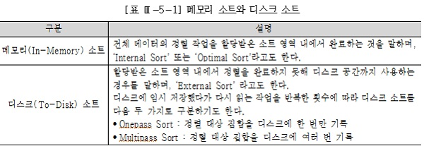
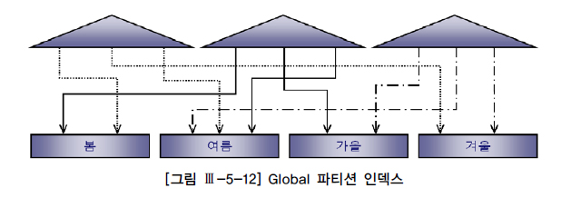

　 [데이터베이스 아키텍처](#데이터베이스-아키텍처)\
　　 [1. 아키텍처 개관](#1-아키텍처-개관)\
　　　 [가. 모델링의 정의](#가-모델링의-정의)\
　　　 [나. SQL Server 아키텍처](#나-sql-server-아키텍처)\
　　 [2. 프로세스](#2-프로세스)\
　　　 [가. 서버 프로세스(Server Processes)](#가-서버-프로세스server-processes)\
　　　 [나. 백그라운드 프로세스(Background Processes)](#나-백그라운드-프로세스background-processes)\
　　 [3. 파일 구조](#3-파일-구조)\
　　　 [가. 데이터 파일](#가-데이터-파일)\
　　　 [나. 임시 데이터 파일](#나-임시-데이터-파일)\
　　　 [다. 로그 파일](#다-로그-파일)\
　　 [4. 메모리 구조](#4-메모리-구조)\
　　　 [가. DB 버퍼 캐시(DB Buffer Cache)](#가-db-버퍼-캐시db-buffer-cache)\
　　　 [나. 공유 풀(Shared Pool)](#나-공유-풀shared-pool)\
　　　 [다. 로그 버퍼(Log Buffer)](#다-로그-버퍼log-buffer)\
　　　 [라. PGA(Process Global Area)](#라-pgaprocess-global-area)\
　　 [5. 대기 이벤트](#5-대기-이벤트)\
　　　 [가. 라이브러리 캐시 부하](#가-라이브러리-캐시-부하)\
　　　 [나. 데이터베이스 Call과 네트워크 부하](#나-데이터베이스-call과-네트워크-부하)\
　　　 [다. 디스크 I/O 부하](#다-디스크-io-부하)\
　　　 [라. 버퍼 캐시 경합](#라-버퍼-캐시-경합)\
　　　 [마. Lock 관련 대기 이벤트](#마-lock-관련-대기-이벤트)\
　 [데이터베이스 I/O 원리](#데이터베이스-io-원리)\
　　 [4. 데이터 모델링의 3단계 진행](#4-데이터-모델링의-3단계-진행)\
　　 [1. 블록 단위 I/O](#1-블록-단위-io)\
　　 [2. 메모리 I/O vs. 디스크I/O](#2-메모리-io-vs-디스크io)\
　　　 [가. I/O 효율화 튜닝의 중요성](#가-io-효율화-튜닝의-중요성)\
　　　 [나. 버퍼 캐시 히트율(Buffer Cache Hit Ratio)](#나-버퍼-캐시-히트율buffer-cache-hit-ratio)\
　　　 [다. 네트워크, 파일시스템 캐시가 I/O 효율에 미치는 영향](#다-네트워크-파일시스템-캐시가-io-효율에-미치는-영향)\
　　 [3. Sequential I/O vs. Random I/O](#3-sequential-io-vs-random-io)\
　　　 [가. Sequential 액세스에 의한 선택 비중 높이기](#가-sequential-액세스에-의한-선택-비중-높이기)\
　　　 [나. Random 액세스 발생량 줄이기](#나-random-액세스-발생량-줄이기)\
　　 [4. Single Block I/O vs. MultiBlock I/O](#4-single-block-io-vs-multiblock-io)\
　　 [5. I/O 효율화 원리](#5-io-효율화-원리)\
　　　 [가. 필요한 최소 블록만 읽도록 SQL 작성](#가-필요한-최소-블록만-읽도록-sql-작성)\
　　　 [나. 최적의 옵티마이징 팩터 제공](#나-최적의-옵티마이징-팩터-제공)\
　　　 [다. 필요하다면, 옵티마이저 힌트를 사용해 최적의 액세스 경로로 유도](#다-필요하다면-옵티마이저-힌트를-사용해-최적의-액세스-경로로-유도)\
　 [인덱스 기본 원리](#인덱스-기본-원리)\
　　 [1. 인덱스 구조](#1-인덱스-구조)\
　　　 [가. 인덱스 기본](#가-인덱스-기본)\
　　　 [나. 인덱스 탐색](#나-인덱스-탐색)\
　　 [2. 다양한 인덱스 스캔 방식](#2-다양한-인덱스-스캔-방식)\
　　　 [가. Index Range Scan](#가-index-range-scan)\
　　　 [나. Index Full Scan](#나-index-full-scan)\
　　　 [다. Index Unique Scan](#다-index-unique-scan)\
　　　 [라. Index Skip Scan](#라-index-skip-scan)\
　　　 [마. Index Fast Full Scan](#마-index-fast-full-scan)\
　　　 [바. Index Range Scan Descending](#바-index-range-scan-descending)\
　　 [3. 인덱스 종류](#3-인덱스-종류)\
　　　 [가. B*Tree 인덱스](#가-btree-인덱스)\
　　　 [나. 비트맵 인덱스](#나-비트맵-인덱스)\
　　　 [다. 함수기반 인덱스](#다-함수기반-인덱스)\
　　　 [라. 리버스 키 인덱스](#라-리버스-키-인덱스)\
　　　 [마. 클러스터 인덱스](#마-클러스터-인덱스)\
　　　 [바. 클러스터형 인덱스/IOT](#바-클러스터형-인덱스iot)\
　 [인덱스 튜닝](#인덱스-튜닝)\
　　 [1. 인덱스 튜닝 기초](#1-인덱스-튜닝-기초)\
　　　 [가. 범위 스캔이 불가능하거나 인덱스 사용이 아예 불가능한 경우](#가-범위-스캔이-불가능하거나-인덱스-사용이-아예-불가능한-경우)\
　　　 [나. 인덱스 칼럼의 가공](#나-인덱스-칼럼의-가공)\
　　　 [다. 묵시적 형변환](#다-묵시적-형변환)\
　　 [2. 테이블 Random 액세스 최소화](#2-테이블-random-액세스-최소화)\
　　　 [가. 인덱스 ROWID에 의한 테이블 Random 액세스](#가-인덱스-rowid에-의한-테이블-random-액세스)\
　　　 [나. 인덱스 손익분기점](#나-인덱스-손익분기점)\
　　　 [다. 테이블 Random 액세스 최소화 튜닝](#다-테이블-random-액세스-최소화-튜닝)\
　　 [3. 인덱스 스캔범위 최소화](#3-인덱스-스캔범위-최소화)\
　　　 [가. 인덱스 선행 칼럼이 범위조건일 때의 비효율](#가-인덱스-선행-칼럼이-범위조건일-때의-비효율)\
　　　 [나. 범위조건을 In-List로 전환](#나-범위조건을-in-list로-전환)\
　　　 [다. 범위조건을 2개 이상 사용할 때의 비효율](#다-범위조건을-2개-이상-사용할-때의-비효율)\
　　 [4. 인덱스 설계](#4-인덱스-설계)\
　　　 [가. 결합 인덱스 구성을 위한 기본 공식](#가-결합-인덱스-구성을-위한-기본-공식)\
　　　 [나. 추가적인 고려사항](#나-추가적인-고려사항)\
　　　 [다. 인덱스 설계도 작성](#다-인덱스-설계도-작성)\
　 [조인 기본 원리](#조인-기본-원리)\
　　 [1. Nested Loop Join](#1-nested-loop-join)\
　　　 [가. 기본 메커니즘](#가-기본-메커니즘)\
　　　 [나. NL Join 수행 과정 분석](#나-nl-join-수행-과정-분석)\
　　　 [다. NL Join의 특징](#다-nl-join의-특징)\
　　 [2. Sort Merge Join](#2-sort-merge-join)\
　　　 [가. 기본 메커니즘](#가-기본-메커니즘)\
　　　 [나. Sort Merge Join의 특징](#나-sort-merge-join의-특징)\
　　 [3. Hash Join](#3-hash-join)\
　　　 [가. 기본 메커니즘](#가-기본-메커니즘)\
　　　 [나. Build Input이 가용 메모리 공간을 초과할 때 처리 방식](#나-build-input이-가용-메모리-공간을-초과할-때-처리-방식)\
　　　 [다. Build Input 해시 키 값에 중복이 많을 때 발생하는 비효율](#다-build-input-해시-키-값에-중복이-많을-때-발생하는-비효율)\
　　　 [라. Hash Join 사용기준](#라-hash-join-사용기준)\
　　 [4. Scalar Subquery](#4-scalar-subquery)\
　　　 [가. Scalar Subquery의 캐싱 효과](#가-scalar-subquery의-캐싱-효과)\
　 [고급 조인 기법](#고급-조인-기법)\
　　 [1. 인라인 뷰 활용](#1-인라인-뷰-활용)\
　　 [2. 배타적 관계의 조인](#2-배타적-관계의-조인)\
　　 [3. 부등호 조인](#3-부등호-조인)\
　　 [4. Between 조인](#4-between-조인)\
　　　 [가. 선분이력이란?](#가-선분이력이란)\
　　　 [나. 선분이력 기본 조회 패턴](#나-선분이력-기본-조회-패턴)\
　　　 [다. 선분이력 조인](#다-선분이력-조인)\
　　　 [라. Between 조인](#라-between-조인)\
　　 [5. ROWID 활용](#5-rowid-활용)\
　 [옵티마이저](#옵티마이저)\
　　 [1. 옵티마이저 소개](#1-옵티마이저-소개)\
　　　 [가. 옵티마이저란?](#가-옵티마이저란)\
　　　 [나. 옵티마이저 종류](#나-옵티마이저-종류)\
　　　 [다. SQL 최적화 과정](#다-sql-최적화-과정)\
　　　 [라. 최적화 목표](#라-최적화-목표)\
　　 [2. 옵티마이저 행동에 영향을 미치는 요소](#2-옵티마이저-행동에-영향을-미치는-요소)\
　　　 [가. SQL과 연산자 형태](#가-sql과-연산자-형태)\
　　　 [나. 옵티마이징 팩터](#나-옵티마이징-팩터)\
　　　 [다. DBMS 제약 설정](#다-dbms-제약-설정)\
　　　 [라. 옵티마이저 힌트](#라-옵티마이저-힌트)\
　　　 [마. 통계정보](#마-통계정보)\
　　　 [바. 옵티마이저 관련 파라미터](#바-옵티마이저-관련-파라미터)\
　　　 [사. DBMS 버전과 종류](#사-dbms-버전과-종류)\
　　 [3. 옵티마이저의 한계](#3-옵티마이저의-한계)\
　　　 [가. 옵티마이징 팩터의 부족](#가-옵티마이징-팩터의-부족)\
　　　 [나. 통계정보의 부정확성](#나-통계정보의-부정확성)\
　　　 [다. 바인드 변수 사용 시 균등분포 가정](#다-바인드-변수-사용-시-균등분포-가정)\
　　　 [라. 비현실적인 가정](#라-비현실적인-가정)\
　　　 [마. 규칙에 의존하는 CBO](#마-규칙에-의존하는-cbo)\
　　　 [바. 하드웨어 성능](#바-하드웨어-성능)\
　　 [4. 통계정보를 이용한 비용계산 원리](#4-통계정보를-이용한-비용계산-원리)\
　　　 [가. 선택도](#가-선택도)\
　　　 [나. 카디널리티](#나-카디널리티)\
　　　 [다. 히스토그램](#다-히스토그램)\
　　　 [라. 비용](#라-비용)\
　　 [5. 옵티마이저](#5-옵티마이저)\
　　　 [가. Oracle 힌트](#가-oracle-힌트)\
　　　 [나. SQL Server 힌트](#나-sql-server-힌트)\
　 [SQL 파싱 부하](#sql-파싱-부하)\
　　 [2. 데이터 모델의 기본 개념의 이해](#2-데이터-모델의-기본-개념의-이해)\
　　 [1. SQL 처리과정](#1-sql-처리과정)\
　　　 [가. SQL 파싱(Parsing)](#가-sql-파싱parsing)\
　　　 [나. SQL 최적화(Optimization)](#나-sql-최적화optimization)\
　　 [2. 캐싱된 SQL 공유](#2-캐싱된-sql-공유)\
　　　 [가. 실행계획 공유 조건](#가-실행계획-공유-조건)\
　　　 [나. 실행계획을 공유하지 못하는 경우](#나-실행계획을-공유하지-못하는-경우)\
　　 [3. 바인드 변수 사용하기](#3-바인드-변수-사용하기)\
　　　 [가. 바인드 변수의 중요성](#가-바인드-변수의-중요성)\
　　　 [나. 바인드 변수 사용 시 주의사항](#나-바인드-변수-사용-시-주의사항)\
　　　 [다. 바인드 변수 부작용을 극복하기 위한 노력](#다-바인드-변수-부작용을-극복하기-위한-노력)\
　　 [4. Static SQL과 Dynamic SQL](#4-static-sql과-dynamic-sql)\
　　　 [가. Static SQL](#가-static-sql)\
　　　 [나. Dynamic SQL](#나-dynamic-sql)\
　　　 [다. 바인드 변수의 중요성 재강조](#다-바인드-변수의-중요성-재강조)\
　　 [5. 애플리케이션 커서 캐싱](#5-애플리케이션-커서-캐싱)\
　 [쿼리변환](#쿼리변환)\
　　 [1. 쿼리변환이란?](#1-쿼리변환이란)\
　　 [2. 서브쿼리 Unnesting](#2-서브쿼리-unnesting)\
　　 [3. 뷰 Merging](#3-뷰-merging)\
　　 [4. 조건절 Pushing](#4-조건절-pushing)\
　　　 [가. 조건절(Predicate) Pushdown](#가-조건절predicate-pushdown)\
　　　 [나. 조건절(Predicate) Pullup](#나-조건절predicate-pullup)\
　　　 [다. 조인 조건(Join Predicate) Pushdown](#다-조인-조건join-predicate-pushdown)\
　　 [5. 조건절 이행](#5-조건절-이행)\
　　 [6. 불필요한 조인 제거](#6-불필요한-조인-제거)\
　　 [7. OR 조건을 Union으로 변환](#7-or-조건을-union으로-변환)\
　　 [8. 기타 쿼리 변환](#8-기타-쿼리-변환)\
　　　 [가. 집합 연산을 조인으로 변환](#가-집합-연산을-조인으로-변환)\
　　　 [나. 조인 칼럼에 IS NOT NULL 조건 추가](#나-조인-칼럼에-is-not-null-조건-추가)\
　　　 [다. 필터 조건 추가](#다-필터-조건-추가)\
　　　 [라. 조건절 비교 순서](#라-조건절-비교-순서)\
　 [소트 튜닝](#소트-튜닝)\
　　 [1. 소트와 성능](#1-소트와-성능)\
　　　 [가. 메모리 소트와 디스크 소트](#가-메모리-소트와-디스크-소트)\
　　　 [다. 소트 튜닝 요약](#다-소트-튜닝-요약)\
　　 [2. 데이터 모델 측면에서의 검토](#2-데이터-모델-측면에서의-검토)\
　　　 [가. Union을 Union All로 대체](#가-union을-union-all로-대체)\
　　　 [나. Distinct를 Exists 서브쿼리로 대체](#나-distinct를-exists-서브쿼리로-대체)\
　　　 [다. 불필요한 Count 연산 제거](#다-불필요한-count-연산-제거)\
　　 [4. 인덱스를 이용한 소트 연산 대체](#4-인덱스를-이용한-소트-연산-대체)\
　　　 [가. Sort Order By 대체](#가-sort-order-by-대체)\
　　　 [다. 인덱스를 활용한 Min, Max 구하기](#다-인덱스를-활용한-min-max-구하기)\
　　 [5. 소트 영역을 적게 사용하도록 SQL 작성](#5-소트-영역을-적게-사용하도록-sql-작성)\
　　　 [가. 소트 완료 후 데이터 가공](#가-소트-완료-후-데이터-가공)\
　　　 [나. Top-N 쿼리](#나-top-n-쿼리)\
　　 [6. 소트 영역 크기 조정](#6-소트-영역-크기-조정)\
　 [DML 튜닝](#dml-튜닝)\
　　 [1. 인덱스 유지 비용](#1-인덱스-유지-비용)\
　　 [2. Insert 튜닝](#2-insert-튜닝)\
　　　 [가. Oracle Insert 튜닝](#가-oracle-insert-튜닝)\
　　　 [나. SQL Server Insert 튜닝](#나-sql-server-insert-튜닝)\
　　 [3. Update 튜닝](#3-update-튜닝)\
　　　 [가. Truncate &amp; Insert 방식 사용](#가-truncate-amp-insert-방식-사용)\
　　　 [나. 조인을 내포한 Update 튜닝](#나-조인을-내포한-update-튜닝)\
　 [데이터베이스 Call과 네트워크 부하](#데이터베이스-call과-네트워크-부하)\
　　 [1. 데이터베이스 Call 종류](#1-데이터베이스-call-종류)\
　　　 [가. SQL 커서에 대한 작업 요청에 따른 구분](#가-sql-커서에-대한-작업-요청에-따른-구분)\
　　　 [나. Call 발생 위치에 따른 구분](#나-call-발생-위치에-따른-구분)\
　　 [2. 데이터베이스 Call과 성능](#2-데이터베이스-call과-성능)\
　　　 [가. One SQL 구현의 중요성](#가-one-sql-구현의-중요성)\
　　　 [나. 데이터베이스 Call과 시스템 확장성](#나-데이터베이스-call과-시스템-확장성)\
　　 [3. Array Processing 활용](#3-array-processing-활용)\
　　 [4. Fetch Call 최소화](#4-fetch-call-최소화)\
　　　 [가. 부분범위처리 원리](#가-부분범위처리-원리)\
　　　 [나. ArraySize 조정에 의한 Fetch Call 감소 및 블록 I/O 감소 효과](#나-arraysize-조정에-의한-fetch-call-감소-및-블록-io-감소-효과)\
　　 [5. 페이지 처리 활용](#5-페이지-처리-활용)\
　　 [6. 분산 쿼리](#6-분산-쿼리)\
　　 [7. 사용자 정의 함수/프로시저의 특징과 성능](#7-사용자-정의-함수프로시저의-특징과-성능)\
　　　 [가. 사용자 정의 함수/프로시저의 특징](#가-사용자-정의-함수프로시저의-특징)\
　　　 [나. 사용자 정의 함수/프로시저에 의한 성능 저하 해소 방안](#나-사용자-정의-함수프로시저에-의한-성능-저하-해소-방안)\
　 [파티션 활용](#파티션-활용)\
　　 [1. 파티션 개요](#1-파티션-개요)\
　　 [2. 파티션 유형](#2-파티션-유형)\
　　 [3. 파티션 Pruning](#3-파티션-pruning)\
　　　 [가. 정적(Static) 파티션 Pruning](#가-정적static-파티션-pruning)\
　　　 [나. 동적(Dynamic) 파티션 Pruning](#나-동적dynamic-파티션-pruning)\
　　 [4. 인덱스 파티셔닝](#4-인덱스-파티셔닝)\
　　　 [가. Local 파티션 인덱스 vs. Global 파티션 인덱스](#가-local-파티션-인덱스-vs-global-파티션-인덱스)\
　　　 [나. Prefixed 파티션 인덱스 vs. NonPrefixed 파티션 인덱스](#나-prefixed-파티션-인덱스-vs-nonprefixed-파티션-인덱스)\
　　　 [다. 인덱스 파티셔닝 가이드](#다-인덱스-파티셔닝-가이드)\
　 [배치 프로그램 튜닝](#배치-프로그램-튜닝)\
　　 [1. 배치 프로그램 튜닝 개요](#1-배치-프로그램-튜닝-개요)\
　　　 [가. 배치 프로그램이란](#가-배치-프로그램이란)\
　　　 [나. 배치 환경의 변화](#나-배치-환경의-변화)\
　　　 [다. 성능 개선 목표 설정](#다-성능-개선-목표-설정)\
　　　 [라. 배치 프로그램 구현 패턴과 튜닝 방안](#라-배치-프로그램-구현-패턴과-튜닝-방안)\
　　 [2. 병렬 처리 활용](#2-병렬-처리-활용)\
　　　 [가. Query Coordinator와 병렬 서버 프로세스](#가-query-coordinator와-병렬-서버-프로세스)\
　　　 [나. Intra-Operation Parallelism과 Inter-Operation Parallelism](#나-intra-operation-parallelism과-inter-operation-parallelism)\
　　　 [다. 테이블 큐](#다-테이블-큐)\
　　　 [라. IN-OUT 오퍼레이션](#라-in-out-오퍼레이션)\
　　　 [마. 데이터 재분배](#마-데이터-재분배)\
　　　 [바. pq_distribute 힌트 활용](#바-pq_distribute-힌트-활용)\
　　　 [사. 병렬 처리 시 주의사항](#사-병렬-처리-시-주의사항)\
　 [고급 SQL 활용](#고급-sql-활용)\
　　 [1. CASE문 활용](#1-case문-활용)\
　　 [2. 데이터 복제 기법 활용](#2-데이터-복제-기법-활용)\
　　 [3. Union All을 활용한 M:M 관계의 조인](#3-union-all을-활용한-mm-관계의-조인)\
　　 [4. 페이징 처리](#4-페이징-처리)\
　　　 [가. 일반적인 페이징 처리용 SQL](#가-일반적인-페이징-처리용-sql)\
　　　 [나. 뒤쪽 페이지까지 자주 조회할 때](#나-뒤쪽-페이지까지-자주-조회할-때)\
　　　 [다. Union All 활용](#다-union-all-활용)\
　　 [5. 윈도우 함수 활용](#5-윈도우-함수-활용)\
　　 [6. With 구문 활용](#6-with-구문-활용)\
　 [Lock](#lock)\
　　 [1. Lock 기본](#1-lock-기본)\
　　　 [가. Lock이란?](#가-lock이란)\
　　　 [나. 공유 Lock과 배타적 Lock](#나-공유-lock과-배타적-lock)\
　　　 [다. 블로킹과 교착상태](#다-블로킹과-교착상태)\
　　 [2. SQL Server Lock](#2-sql-server-lock)\
　　　 [가. Lock 종류](#가-lock-종류)\
　　　 [나. Lock 레벨과 Escalation](#나-lock-레벨과-escalation)\
　　　 [다. Lock 호환성](#다-lock-호환성)\
　　 [3. Oracle Lock](#3-oracle-lock)\
　　　 [가. 로우 Lock](#가-로우-lock)\
　　　 [나. 테이블 Lock](#나-테이블-lock)\
　 [트랜잭션](#트랜잭션)\
　　 [1. 트랜잭션의 특징](#1-트랜잭션의-특징)\
　　 [2. 트랜잭션 격리성](#2-트랜잭션-격리성)\
　　　 [가. 낮은 단계의 격리성 수준에서 발생할 수 있는 현상들](#가-낮은-단계의-격리성-수준에서-발생할-수-있는-현상들)\
　　　 [나. 트랜잭션 격리성 수준](#나-트랜잭션-격리성-수준)\
　 [동시성 제어](#동시성-제어)\
　　 [1. 비관적 동시성 제어 vs. 낙관적 동시성 제어](#1-비관적-동시성-제어-vs-낙관적-동시성-제어)\
　　　 [가. 비관적 동시성 제어](#가-비관적-동시성-제어)\
　　　 [나. 낙관적 동시성 제어](#나-낙관적-동시성-제어)\
　　 [2. 다중버전 동시성 제어](#2-다중버전-동시성-제어)\
　　　 [가. 일반적인 Locking 메커니즘의 문제점](#가-일반적인-locking-메커니즘의-문제점)\
　　　 [나. 다중버전 동시성 제어](#나-다중버전-동시성-제어)\
　　　 [다. 문장수준 읽기 일관성](#다-문장수준-읽기-일관성)\
　　　 [라. 트랜잭션 수준 읽기](#라-트랜잭션-수준-읽기)\
　　　 [마. Snapshot too old](#마-snapshot-too-old)\
*****
# 데이터베이스 아키텍처 

## 1. 아키텍처 개관 
### 가. 모델링의 정의 

DBMS마다 데이터베이스에 대한 정의가 조금씩 다른데, Oracle에서는 디스크에 저장된 데이터 집합(Datafile, Redo Log File, Control File 등)을 데이터베이스(Database)라고 부른다. 그리고 SGA 공유 메모리 영역과 이를 액세스하는 프로세스 집합을 합쳐서 인스턴스(Instance)라고 부른다.([그림 Ⅲ-1-1] 참조) 
 

기본적으로 하나의 인스턴스가 하나의 데이터베이스만 액세스하지만, RAC(Real Application Cluster) 환경에서는 여러 인스턴스가 하나의 데이터베이스를 액세스할 수 있다. 하나의 인스턴스가 여러 데이터베이스를 액세스할 수는 없다. 
### 나. SQL Server 아키텍처 

[그림 Ⅲ-1-1]과 대비해 SQL Server 아키텍처를 간단히 표현하면 [그림 Ⅲ-1-2]와 같다. SQL Server는 하나의 인스턴스 당 최고 32,767개의 데이터베이스를 정의해 사용할 수 있다. 기본적으로 master, model, msdb, tempdb 등의 시스템 데이터베이스가 만들어지며, 여기에 사용자 데이터베이스를 추가로 생성하는 구조다. 
 

데이터베이스 하나를 만들 때마다 주(Primary 또는 Main) 데이터 파일과 트랜잭션 로그 파일이 하나씩 생기는데, 전자는 확장자가 mdf이고 후자는 ldf이다. 저장할 데이터가 많으면 보조(Non-Primary) 데이터 파일을 추가할 수 있으며, 확장자는 ndf이다. 

## 2. 프로세스 

SQL Server는 쓰레드(Thread) 기반 아키텍처이므로 프로세스 대신 쓰레드라는 표현을 써야 한다. SQL Server 뿐만 아니라 Oracle도 Windows 버전에선 쓰레드(Thread)를 사용하지만, 프로세스와 일일이 구분하면서 설명하려면 복잡해지므로 특별히 쓰레드를 언급해야 할 경우가 아니라면 간단히 ‘프로세스’로 통칭하기로 한다. 잠시 후 표로써 정리해 보이겠지만, 주요 쓰레드의 역할은 Oracle 프로세스와 크게 다르지 않다. 프로세스는 서버 프로세스(Server Processes)와 백그라운드 프로세스(Background Processes) 집합으로 나뉜다. 서버 프로세스는 전면에 나서 사용자가 던지는 각종 명령을 처리하고, 백그라운드 프로세스는 뒤에서 묵묵히 주어진 역할을 수행한다. 
### 가. 서버 프로세스(Server Processes) 

서버 프로세스는 사용자 프로세스와 통신하면서 사용자의 각종 명령을 처리하며, SQL Server에선 Worker 쓰레드가 같은 역할을 담당한다. 좀 더 구체적으로 말해, SQL을 파싱하고 필요하면 최적화를 수행하며, 커서를 열어 SQL을 실행하면서 블록을 읽고, 읽은 데이터를 정렬해서 클라이언트가 요청한 결과집합을 만들어 네트워크를 통해 전송하는 일련의 작업을 모두 서버 프로세스가 처리해 준다. 스스로 처리하도록 구현되지 않은 기능, 이를테면 데이터 파일로부터 DB 버퍼 캐시로 블록을 적재하거나 Dirty 블록을 캐시에서 밀어냄으로써 Free 블록을 확보하는 일, 그리고 Redo 로그 버퍼를 비우는 일 등은 OS, I/O 서브시스템, 백그라운드 프로세스가 대신 처리하도록 시스템 Call을 통해 요청한다. 클라이언트가 서버 프로세스와 연결하는 방식은 DBMS마다 다르지만 Oracle을 예로 들면, 전용 서버 방식과 공유 서버 방식, 두 가지가 있다. 

1) 전용 서버(Dedicated Server) 방식 

[그림 Ⅲ-1-3]은 전용 서버 방식으로 접속할 때 내부적으로 어떤 과정을 거쳐 세션을 수립하고 사용자 명령을 처리하는지 잘 보여준다 
 

처음 연결요청을 받는 리스너가 서버 프로세스(Window 환경에서는 쓰레드)를 생성해 주고, 이 서버 프로세스가 단 하나의 사용자 프로세스를 위해 전용(Dedicated) 서비스를 제공한다는 점이 특징이다. 만약 SQL을 수행할 때마다 연결 요청을 반복하면 서버 프로세스의 생성과 해제도 반복하게 되므로 DBMS에 매우 큰 부담을 주고 성능을 크게 떨어뜨린다. 따라서 전용 서버 방식을 사용하는 OLTP성 애플리케이션에선 Connection Pooling 기법을 필수적으로 사용해야 한다. 예를 들어, 50개의 서버 프로세스와 연결된 50개의 사용자 프로세스를 공유해서 반복 재사용하는 방식이다. 

2) 공유 서버(Shared Server) 방식 

공유 서버는 말 그대로 하나의 서버 프로세스를 여러 사용자 세션이 공유하는 방식으로서, 앞서 설명한 Connection Pooling 기법을 DBMS 내부에 구현해 놓은 것으로 생각하면 쉽다. 즉, 미리 여러 개의 서버 프로세스를 띄어 놓고 이를 공유해서 반복 재사용한다. 
 

[그림 Ⅲ-1-4]에서 보이듯, 공유 서버 방식으로 Oracle에 접속하면 사용자 프로세스는 서버 프로세스와 직접 통신하지 않고 Dispatcher 프로세스를 거친다. 사용자 명령이 Dispatcher에게 전달되면 Dispatcher는 이를 SGA에 있는 요청 큐(Request Queue)에 등록한다. 이후 가장 먼저 가용해진 서버 프로세스가 요청 큐에 있는 사용자 명령을 꺼내서 처리하고, 그 결과를 응답 큐(Response Queue)에 등록한다. 응답 큐를 모니터링하던 Dispatcher가 응답 결과를 발견하면 사용자 프로세스에게 전송해 준다. 
### 나. 백그라운드 프로세스(Background Processes) 

## 3. 파일 구조 
### 가. 데이터 파일 
 

Oracle과 SQL Server 모두 물리적으로는 데이터 파일에 데이터를 저장하고 관리한다. 공간을 할당하고 관리하기 위한 논리적인 구조도 크게 다르지 않지만 약간의 차이는 있다 

1) 블록(=페이지) 

대부분 DBMS에서 I/O는 블록 단위로 이루어진다. 데이터를 읽고 쓸 때의 논리적인 단위가 블록인 것이다. Oracle은 ‘블록(Block)’이라고 하고, SQL Server는 ‘페이지(Page)’라고 한다. Oracle은 2KB, 4KB, 8KB, 16KB, 32KB, 64KB의 다양한 블록 크기를 사용할 수 있지만, SQL Server에선 8KB 단일 크기를 사용한다. 블록 단위로 I/O 한다는 것은, 하나의 레코드에서 하나의 칼럼만을 읽으려 할 때도 레코드가 속한 블록 전체를 읽게 됨을 뜻한다. SQL 성능을 좌우하는 가장 중요한 성능지표는 액세스하는 블록 개수이며, 옵티마이저의 판단에 가장 큰 영향을 미치는 것도 액세스해야 할 블록 개수다. 예를 들어, 옵티마이저가 인덱스를 이용해 테이블을 액세스할지 아니면 Full Table Scan 할지를 결정하는 데 있어 가장 중요한 판단 기준은 읽어야 할 레코드 수가 아니라 읽어야 하는 블록 개수다. 

2) 익스텐트(Extent) 

데이터를 읽고 쓰는 단위는 블록이지만, 테이블 스페이스로부터 공간을 할당하는 단위는 익스텐트다. 테이블이나 인덱스에 데이터를 입력하다가 공간이 부족해지면 해당 오브젝트가 속한 테이블 스페이스(물리적으로는 데이터 파일)로부터 추가적인 공간을 할당받는데, 이때 정해진 익스텐트 크기의 연속된 블록을 할당받는다. 예를 들어, 블록 크기가 8KB인 상태에서 64KB 단위로 익스텐트를 할당하도록 정의했다면, 공간이 부족할 때마다 테이블 스페이스로부터 8개의 연속된 블록을 찾아(찾지 못하면 새로 생성) 세그먼트에 할당해 준다. 익스텐트 내 블록은 논리적으로 인접하지만, 익스텐트끼리 서로 인접하지는 않는다. 예를 들어, 어떤 세그먼트에 익스텐트 2개가 할당됐는데, 데이터 파일 내에서 이 둘이 서로 멀리 떨어져 있을 수 있다. 참고로 Oracle은 다양한 크기의 익스텐트를 사용하지만, SQL Server에선 8개 페이지의 익스텐트만을 사용한다. 페이지 크기도 8KB로 고정됐으므로 익스텐트는 항상 64KB인 셈이다. 또한 Oracle은 한 익스텐트에 속한 모든 블록을 단일 오브젝트가 사용하지만, SQL Server에서는 2개 이상 오브젝트가 나누어 사용할 수도 있다. SQL Server는 다음 2가지 타입의 익스텐트를 사용한다. 

* 균일(Uniform) 익스텐트 : 64KB 이상의 공간을 필요로 하는 테이블이나 인덱스를 위해 사용되며, 8개 페이지 단위로 할당된 익스텐트를 단일 오브젝트가 모두 사용한다. 
* 혼합(Mixed) 익스텐트 : 한 익스텐트에 할당된 8개 페이지를 여러 오브젝트가 나누어 사용하는 형태다. 모든 테이블이 처음에는 혼합 익스텐트로 시작하지만 64KB를 넘으면서 2번째부터 균일 익스텐트를 사용하게 된다. 

3) 세그먼트 

SQL Server에서는 세그먼트라는 용어를 사용하지 않지만, 힙 구조 또는 인덱스 구조의 오브젝트가 여기에 속한다. 세그먼트는 테이블, 인덱스, Undo처럼 저장공간을 필요로 하는 데이터베이스 오브젝트다. 저장공간을 필요로 한다는 것은 한 개 이상의 익스텐트를 사용함을 뜻한다. 테이블을 생성할 때, 내부적으로는 테이블 세그먼트가 생성된다. 인덱스를 생성할 때, 내부적으로 인덱스 세그먼트가 생성된다. 다른 오브젝트는 세그먼트와 1:1 대응 관계를 갖지만 파티션은 1:M 관계를 갖는다. 즉, 파티션 테이블(또는 인덱스)을 만들면, 내부적으로 여러 개의 세그먼트가 만들어진다. 한 세그먼트는 자신이 속한 테이블 스페이스 내 여러 데이터 파일에 걸쳐 저장될 수 있다. 즉, 세그먼트에 할당된 익스텐트가 여러 데이터 파일에 흩어져 저장되는 것이며, 그래야 디스크 경합을 줄이고 I/O 분산 효과를 얻을 수 있다. 

4) 테이블 스페이스 

테이블 스페이스는 세그먼트를 담는 콘테이너로서, 여러 데이터 파일로 구성된다. SQL Server의 파일 그룹이 Oracle 테이블 스페이스에 해당한다. 데이터는 물리적으로 데이터 파일에 저장되지만, 사용자가 데이터 파일을 직접 선택하진 않는다. 사용자는 세그먼트를 위한 테이블 스페이스를 지정할 뿐, 실제 값을 저장할 데이터 파일을 선택하고 익스텐트를 할당하는 것은 DBMS의 몫이다. 각 세그먼트는 정확히 한 테이블 스페이스에만 속하지만, 한 테이블 스페이스에는 여러 세그먼트가 존재할 수 있다. 특정 세그먼트에 할당된 모든 익스텐트는 해당 세그먼트와 관련된 테이블 스페이스 내에서만 찾아진다. 한 세그먼트가 여러 테이블 스페이스에 걸쳐 저장될 수는 없는 것이다. 하지만 앞서 얘기했듯이 한 세그먼트가 여러 데이터 파일에 걸쳐 저장될 수는 있다. 한 테이블 스페이스가 여러 데이터 파일로 구성되기 때문이다. 

지금까지 설명한 내용을 그림으로 요약하면 [그림 Ⅲ-1-6]과 같다. 
 

SQL Server에서는 한 익스텐트에 속한 모든 페이지를 2개 이상 오브젝트가 나누어 사용할 수 있으므로(혼합 익스텐트) [그림 Ⅲ-1-7]과 같다. 
 
### 나. 임시 데이터 파일 

임시(Temporary) 데이터 파일은 특별한 용도로 사용된다. 대량의 정렬이나 해시 작업을 수행하다가 메모리 공간이 부족해지면 중간 결과집합을 저장하는 용도다. 임시 데이터 파일에 저장되는 오브젝트는 말 그대로 임시로 저장했다가 자동으로 삭제된다. Redo 정보를 생성하지 않기 때문에 나중에 파일에 문제가 생겼을 때 복구되지 않는다. 따라서 백업할 필요도 없다. Oracle에선 임시 테이블 스페이스를 여러 개 생성해 두고, 사용자마다 별도의 임시 테이블 스페이스를 지정해 줄 수도 있다. 
>create temporary tablespace big_temp tempfile '/usr/local/oracle/oradata/ora10g/big_temp.dbf' size 2000m; alter user scott temporary tablespace big_temp; 

SQL Server는 단 하나의 tempdb 데이터베이스를 사용한다. tempdb는 전역 리소스로서 시스템에 연결된 모든 사용자의 임시 데이터를 여기에 저장한다. 
### 다. 로그 파일 

DB 버퍼 캐시에 가해지는 모든 변경사항을 기록하는 파일을 Oracle은 ‘Redo 로그’라고 부르며, SQL Server는 ‘트랜잭션 로그’라고 부른다. 변경된 메모리 버퍼 블록을 디스크 상의 데이터 블록에 기록하는 작업은 Random I/O 방식으로 이루어지기 때문에 느리다. 반면 로그 기록은 Append 방식으로 이루어지기 때문에 상대적으로 매우 빠르다. 따라서 대부분 DBMS는 버퍼 블록에 대한 변경사항을 건건이 데이터 파일에 기록하기보다 우선 로그 파일에 Append 방식으로 빠르게 기록하는 방식을 사용한다. 그러고 나서 버퍼 블록과 데이터 파일 간 동기화는 적절한 수단(DBWR, Checkpoint)을 이용해 나중에 배치(Batch) 방식으로 일괄 처리한다. 사용자의 갱신내용이 메모리상의 버퍼 블록에만 기록된 채 아직 디스크에 기록되지 않았더라도 Redo 로그를 믿고 빠르게 커밋을 완료한다는 의미에서, 이를 ‘Fast Commit’ 메커니즘이라고 부른다. 인스턴스 장애가 발생하더라도 로그 파일을 이용해 언제든 복구 가능하므로 안심하고 커밋을 완료할 수 있는 것이다. Fast Commit은 빠르게 트랜잭션을 처리해야 하는 모든 DBMS의 공통적인 메커니즘이다. 

* Online Redo 로그 
캐시에 저장된 변경사항이 아직 데이터 파일에 기록되지 않은 상태에서 정전 등으로 인스턴스가 비정상 종료되면, 그때까지의 작업내용을 모두 잃게 된다. 이러한 트랜잭션 데이터의 유실에 대비하기 위해 Oracle은 Online Redo 로그를 사용한다. 마지막 체크포인트 이후부터 사고 발생 직전까지 수행되었던 트랜잭션들을 Redo 로그를 이용해 재현하는 것이며, 이를 ‘캐시 복구’라고 한다. Online Redo 로그는 최소 두 개 이상의 파일로 구성된다. 현재 사용 중인 파일이 꽉 차면 다음 파일로 로그 스위칭(log switching)이 발생하며, 계속 로그를 써 나가다가 모든 파일이 꽉 차면 다시 첫 번째 파일부터 재사용하는 라운드 로빈(round-robin) 방식을 사용한다 
* 트랜잭션 로그 
트랜잭션 로그는 Oracle의 Online Redo 로그와 대응되는 SQL Server의 로그 파일이다. 주 데이터 파일마다, 즉 데이터베이스마다 트랜잭션 로그 파일이 하나씩 생기며, 확장자는 ldf이다. 트랜잭션 로그 파일은 내부적으로 ‘가상 로그 파일’이라 불리는 더 작은 단위의 세그먼트로 나뉘며, 이 가상 로그 파일의 개수가 너무 많아지지 않도록(즉, 조각화가 발생하지 않도록) 옵션을 지정하는 게 좋다. 예를 들어, 로그 파일을 애초에 넉넉한 크기로 만들어 자동 증가가 발생하지 않도록 하거나, 어쩔 수 없이 자동 증가한다면 증가하는 단위를 크게 지정하는 것이다. 
* Archived(=Offline) Redo 로그 
Archived Redo 로그는 Oracle에서 Online Redo 로그가 재사용되기 전에 다른 위치로 백업해 둔 파일을 말한다. 디스크가 깨지는 등 물리적인 저장 매체에 문제가 생겼을 때 데이터베이스(또는 미디어) 복구를 위해 사용된다. 참고로, SQL Server에는 Archived Redo 로그에 대응되는 개념이 없다. 

## 4. 메모리 구조 

메모리 구조는 시스템 공유 메모리 영역과 프로세스 전용 메모리 영역으로 구분된다. 

* 시스템 공유 메모리 영역 
시스템 공유 메모리는 말 그대로 여러 프로세스(또는 쓰레드)가 동시에 액세스할 수 있는 메모리 영역으로서, Oracle에선 ‘System Global Area(SGA)’, SQL Server에선 ‘Memory Pool’이라고 부른다. 공유 메모리를 구성하는 캐시 영역은 매우 다양하지만, 모든 DBMS가 공통적으로 사용하는 캐시 영역으로는 DB 버퍼 캐시, 공유 풀, 로그 버퍼가 있다. 공유 메모리 영역은 그 외에 Large 풀(Large Pool), 자바 풀(Java Pool) 등을 포함하고, 시스템 구조와 제어 구조를 캐싱하는 영역도 포함한다.시스템 공유 메모리 영역은 여러 프로세스에 공유되기 때문에 내부적으로 래치(Latch), 버퍼 Lock, 라이브러리 캐시 Lock/Pin 같은 액세스 직렬화 메커니즘이 사용된다. 
* 프로세스 전용 메모리 영역 
Oracle은 프로세스 기반 아키텍처이므로 서버 프로세스가 자신만의 전용 메모리 영역을 가질 수 있는데, 이를 ‘Process Global Area(PGA)’라고 부르며, 데이터를 정렬하고 세션과 커서에 관한 상태 정보를 저장하는 용도로 사용한다.쓰레드(Thread) 기반 아키텍처를 사용하는 SQL Server는 프로세스 전용 메모리 영역을 갖지 않는다. 쓰레드는 전용 메모리 영역을 가질 수 없고, 부모 프로세스의 메모리 영역을 사용하기 때문이다. 참고로, Windows 버전 Oracle도 쓰레드를 사용하지만 프로세스 기반의 Unix 버전과 같은 인터페이스를 제공하고 구조에 대한 개념과 설명도 구별하지 않는다. 

지금부터 시스템 공유 메모리 영역의 구성요소인 DB 버퍼 캐시, 공유 풀, 로그 버퍼를 순서대로 살펴보고, 마지막으로 프로세스 전용 메모리 영역인 Process Global Area에 대해 살펴본다. 
### 가. DB 버퍼 캐시(DB Buffer Cache) 

DB 버퍼 캐시는 데이터 파일로부터 읽어 들인 데이터 블록을 담는 캐시 영역이다. 인스턴스에 접속한 모든 사용자 프로세스는 서버 프로세스를 통해 DB 버퍼 캐시의 버퍼 블록을 동시에(내부적으로는 버퍼 Lock을 통해 직렬화) 액세스할 수 있다. 일부 Direct Path Read 메커니즘이 작동하는 경우를 제외하면, 모든 블록 읽기는 버퍼 캐시를 통해 이루어진다. 즉, 읽고자 하는 블록을 먼저 버퍼 캐시에서 찾아보고 없을 때 디스크에서 읽는다. 디스크에서 읽을 때도 먼저 버퍼 캐시에 적재한 후에 읽는다. 데이터 변경도 버퍼 캐시에 적재된 블록을 통해 이루어지며, 변경된 블록(Dirty 버퍼 블록)을 주기적으로 데이터 파일에 기록하는 작업은 DBWR 프로세스의 몫이다. 디스크 I/O는 물리적으로 액세스 암(Arm)이 움직이면서 헤드를 통해 이루어지는 반면, 메모리 I/O는 전기적 신호에 불과하기 때문에 디스크 I/O에 비교할 수 없을 정도로 빠르다. 디스크에서 읽은 데이터 블록을 메모리 상에 보관해 두는 기능이 모든 데이터베이스 시스템에 필수적인 이유다. 

1) 버퍼 블록의 상태 

모든 버퍼 블록은 아래 세 가지 중 하나의 상태에 놓인다. 

* Free 버퍼 : 인스턴스 기동 후 아직 데이터가 읽히지 않아 비어 있는 상태(Clean 버퍼)이거나, 데이터가 담겼지만 데이터 파일과 서로 동기화돼 있는 상태여서 언제든지 덮어 써도 무방한 버퍼 블록을 말한다. 데이터 파일로부터 새로운 데이터 블록을 로딩하려면 먼저 Free 버퍼를 확보해야 한다. Free 상태인 버퍼에 변경이 발생하면 그 순간 Dirty 버퍼로 상태가 바뀐다. 
* Dirty 버퍼 : 버퍼에 캐시된 이후 변경이 발생했지만, 아직 디스크에 기록되지 않아 데이터 파일 블록과 동기화가 필요한 버퍼 블록을 말한다. 이 버퍼 블록들이 다른 데이터 블록을 위해 재사용되려면 디스크에 먼저 기록되어야 하며, 디스크에 기록되는 순간 Free 버퍼로 상태가 바뀐다. 
* Pinned 버퍼 : 읽기 또는 쓰기 작업이 현재 진행 중인 버퍼 블록을 말한다. 

2) LRU 알고리즘 

버퍼 캐시는 유한한 자원이므로 모든 데이터를 캐싱해 둘 수 없다. 따라서 모든 DBMS는 사용빈도가 높은 데이터 블록 위주로 버퍼 캐시가 구성되도록 LRU(least recently used) 알고리즘을 사용한다. 모든 버퍼 블록 헤더를 LRU 체인에 연결해 사용빈도 순으로 위치를 옮겨가다가, Free 버퍼가 필요해질 때면 액세스 빈도가 낮은 쪽(LRU end) 데이터 블록부터 밀어내는 방식이다. [그림 Ⅲ-1-8]과 같은 컨베이어 벨트를 연상하면 LRU 알고리즘을 쉽게 이해할 수 있다. 
 
### 나. 공유 풀(Shared Pool) 

공유 풀은 딕셔너리 캐시와 라이브러리 캐시로 구성되며, 버퍼 캐시처럼 LRU 알고리즘을 사용한다. SQL Server에서 같은 역할을 하는 메모리 영역을 ‘프로시저 캐시(Procedure Cache)’라고 부른다. 

* 딕셔너리 캐시 
데이터베이스 딕셔너리(Dictionary)는 테이블, 인덱스 같은 오브젝트는 물론 테이블 스페이스, 데이터 파일, 세그먼트, 익스텐트, 사용자, 제약에 관한 메타 정보를 저장하는 곳이다. 그리고 딕셔너리 캐시는 말 그대로 딕셔너리 정보를 캐싱하는 메모리 영역이다. ‘주문’ 테이블을 예로 들면, 입력한 주문 데이터는 데이터 파일에 저장됐다가 버퍼 캐시를 경유해 읽히지만, 테이블 메타 정보는 딕셔너리에 저장됐다가 딕셔너리 캐시를 경유해 읽힌다. 
* 라이브러리 캐시 
라이브러리 캐시(Library Cache)는 사용자가 수행한 SQL문과 실행계획, 저장 프로시저를 저장해 두는 캐시영역이다. 사용자가 SQL 명령어를 통해 결과집합을 요청하면 이를 최적으로(→가장 적은 리소스를 사용하면서 가장 빠르게) 수행하기 위한 처리 루plan)이라고 한다. 빠른 쿼리 수행을 위해 내부적으로 생성한 일종의 프로시저와 같은 것이라고 이해하면 쉽다. 쿼리 구문을 분석해서 문법 오류 및 실행 권한 등을 체크하고, 최적화(Optimization) 과정을 거쳐 실행계획을 만들고, SQL 실행엔진이 이해할 수 있는 형태로 포맷팅하는 전 과정을 하드 파싱(Hard Parsing)이라고 한다. 특히 최적화 과정은 하드 파싱을 무겁게 만드는 가장 결정적 요인인데, 같은 SQL을 처리하려고 이런 무거운 작업을 반복 수행하는 것은 매우 비효율적이다. 그??하기 위한 캐시 공간을 따로 두게 되었고, 그것이 바로 라이브러리 캐시 영역이다. 캐싱된 SQL과 그 실행계획의 재사용성을 높이는 것은 SQL 수행 성능을 높이고 DBMS 부하를 최소화하는 핵심 원리 중 한가지다. 

### 다. 로그 버퍼(Log Buffer) 

DB 버퍼 캐시에 가해지는 모든 변경사항을 로그 파일에 기록한다고 앞서 설명했는데, 로그 엔트리도 파일에 곧바로 기록하는 것이 아니라 먼저 로그 버퍼에 기록한다. 건건이 디스크에 기록하기보다 일정량을 모았다가 기록하면 훨씬 빠르기 때문이다. 좀 더 자세히 설명하면, 서버 프로세스가 데이터 블록 버퍼에 변경을 가하기 전에 Redo 로그 버퍼에 먼저 기록해 두면 주기적으로 LGWR 프로세스가 Redo 로그 파일에 기록한다. Oracle의 Redo 로그, Redo 로그 버퍼와 대비되는 개념이 SQL Server의 트랜잭션 로그, 로그 캐시다. 변경이 가해진 Dirty 버퍼를 데이터 파일에 기록하기 전에 항상 로그 버퍼를 먼저 로그 파일에 기록해야만 하는데, 그 이유는 인스턴스 장애가 발생할 때면 로그 파일에 기록된 내용을 재현해 캐시 블록을 복구하고, 최종적으로 커밋되지 않은 트랜잭션은 롤백해야 한다. 이때, 로그 파일에는 없는 변경내역이 이미 데이터 파일에 기록돼 있으면 사용자가 최종 커밋하지 않은 트랜잭션이 커밋되는 결과를 초래하기 때문이다. 정리해 보면, 버퍼 캐시 블록을 갱신하기 전에 변경사항을 먼저 로그 버퍼에 기록해야 하며, Dirty 버퍼를 디스크에 기록하기 전에 해당 로그 엔트리를 먼저 로그 파일에 기록해야 하는데, 이를 ‘Write Ahead Logging’이라고 한다. 그리고 로그 버퍼를 주기적으로 로그 파일에 기록한다고 했는데, 늦어도 커밋 시점에는 로그 파일에 기록해야 한다(Log Force at commit). 메모리상의 로그 버퍼는 언제든 유실될 가능성이 있기 때문이다. 로그를 이용한 Fast Commit이 가능한 이유는 로그를 이용해 언제든 복구 가능하기 때문이라고 설명한 것을 상기하기 바란다. 다시 말하지만, 로그 파일에 기록했음이 보장돼야 안심하고 커밋을 완료할 수 있다. 
### 라. PGA(Process Global Area) 

각 Oracle 서버 프로세스는 자신만의 PGA(Process/Program/Private Global Area) 메모리 영역을 할당받고, 이를 프로세스에 종속적인 고유 데이터를 저장하는 용도로 사용한다. PGA는 다른 프로세스와 공유되지 않는 독립적인 메모리 공간으로서, 래치 메커니즘이 필요 없어 똑같은 개수의 블록을 읽더라도 SGA 버퍼 캐시에서 읽는 것보다 훨씬 빠르다. 

* User Global Area(UGA) 
전용 서버(Dedicated Server) 방식으로 연결할 때는 프로세스와 세션이 1:1 관계를 갖지만, 공유 서버(Shared Server) 방식으로 연결할 때는 1:M 관계를 갖는다. 즉, 세션이 프로세스 개수보다 많아질 수 있는 구조로서, 하나의 프로세스가 여러 개 세션을 위해 일한다. 따라서 각 세션을 위한 독립적인 메모리 공간이 필요해지는데, 이를 ‘UGA(User Global Area)’라고 한다. 전용 서버 방식이라고 해서 UGA를 사용하지 않는 것은 아니다. UGA는 전용 서버 방식으로 연결할 때는 PGA에 할당되고, 공유 서버 방식으로 연결할 때는 SGA에 할당된다. 구체적으로 후자는, Large Pool이 설정됐을 때는 Large Pool에, 그렇지 않을 때는 Shared Pool에 할당하는 방식이다. 
* Call Global Area(CGA) 
PGA에 할당되는 메모리 공간으로는 CGA도 있다. Oracle은 하나의 데이터베이스 Call을 넘어서 다음 Call까지 계속 참조되어야 하는 정보는 UGA에 담고, Call이 진행되는 동안에만 필요한 데이터는 CGA에 담는다. CGA는 Parse Call, Execute Call, Fetch Call마다 매번 할당받는다. Call이 진행되는 동안 Recursive Call이 발생하면 그 안에서도 Parse, Execute, Fetch 단계별로 CGA가 추가로 할당된다. CGA에 할당된 공간은 하나의 Call이 끝나자마자 해제돼 PGA로 반환된다. 
* Sort Area 
데이터 정렬을 위해 사용되는 Sort Area는 소트 오퍼레이션이 진행되는 동안 공간이 부족해질 때마다 청크(Chunk) 단위로 조금씩 할당된다. 세션마다 사용할 수 있는 최대 크기를 예전에는 sort_area_size 파라미터로 설정하였으나, 9i부터는 새로 생긴 workarea_size_policy 파라미터를 auto(기본 값)로 설정하면 Oracle이 내부적으로 결정한다. 

PGA 내에서 Sort Area가 할당되는 위치는 SQL문 종류와 소트 수행 단계에 따라 다르다. DML 문장은 하나의 Execute Call 내에서 모든 데이터 처리를 완료하므로 Sort Area가 CGA에 할당된다. SELECT 문장의 경우, 수행 중간 단계에 필요한 Sort Area는 CGA에 할당되고, 최종 결과집합을 출력하기 직전 단계에 필요한 Sort Area는 UGA에 할당된다. 

앞에서 이미 설명한 것처럼, 쓰레드(Thread) 기반 아키텍처를 사용하는 SQL Server는 프로세스 전용 메모리 영역을 갖지 않는다. 대신, 데이터 정렬은 Memory Pool 안에 있는 버퍼 캐시에서 수행하며, 세션 관련 정보는 Memory Pool 안에 있는 Connection Context 영역에 저장한다. 

## 5. 대기 이벤트 

DBMS 내부에서 활동하는 수많은 프로세스 간에는 상호작용이 필요하며, 그 과정에서 다른 프로세스가 일을 마칠 때까지 기다려야만 하는 상황이 자주 발생한다. 그때마다 해당 프로세스는 자신이 일을 계속 진행할 수 있는 조건이 충족될 때까지 수면(sleep) 상태로 대기하는데, 그 기간에 정해진 간격으로(1초, 3초 등) 각 대기 유형별 상태와 시간 정보가 공유 메모리 영역에 저장된다. 대개 누적치만 저장되지만, 사용자가 원하면(10046 이벤트 트레이스를 활성화하면) 로그처럼 파일로 기록해 주기도 한다. 이러한 대기 정보를 Oracle에서는 ‘대기 이벤트(Wait Event)’라고 부르며, SQL Server에서는 ‘대기 유형(Wait Type)’이라고 부른다. 대기 이벤트가 중요한 이유는, 1990년대 후반부터 이를 기반으로 한 ‘Response Time Analysis’ 성능관리 방법론이 데이터베이스 성능 진단 분야에 일대 변혁을 가져왔기 때문이다. 세션 또는 시스템 전체에 발생하는 병목 현상과 그 원인을 찾아 문제를 해결하는 방법과 과정을 다루는 이 방법론은, 데이터베이스 서버의 응답 시간을 서비스 시간과 대기 시간의 합으로 정의하고 있다. 
>Response Time = Service Time + Wait Time 
= CPU Time + Queue Time 

서비스 시간(Service Time)은 프로세스가 정상적으로 동작하며 일을 수행한 시간을 말한다. CPU Time과 같은 의미다. 대기 시간(Wait Time)은 프로세스가 잠시 수행을 멈추고 대기한 시간을 말한다. 다른 말로?법론은 Response Time을 위와 같이 정의하고, CPU Time과 Wait Time을 각각 break down 하면서 서버의 일량과 대기 시간을 분석해 나간다. CPU Time은 파싱 작업에 소비한 시간인지 아니면 쿼리 본연의 오퍼레이션 수행을 위해 소비한 시간인지를 분석한다. Wait Time은 각각 발생한 대기 이벤트들을 분석해 가장 시간을 많이 소비한 이벤트 중심으로 해결방안을 모색한다. Oracle 10g 기준으로 대기 이벤트 개수는 890여 개에 이르는데, 그 중 가장 자주 발생하고 성능 문제와 직결되는 것들을 일부 소개하고자 한다. 참고로 본 단락은 Oracle 중심으로만 설명하는데, SQL Server는 대기 유형이 잘 알려지지 않은 데다 아직 활용도가 낮은 편이기 때문이다. 

참고로, DB를 모니터링하거나 성능 진단 업무를 담당하지 않는다면 아래 내용을 굳이 공부하지 않아도 된다. 그럼에도 여기서 소개하는 이유는, DBMS 병목이 주로 어디서 발생하는지 그리고 어떤 이벤트로써 측정되는지를 간단하게나마 보여주기 위한 것이므로 부담없이 읽어 나가기 바란다. 
### 가. 라이브러리 캐시 부하 

아래는 라이브러리 캐시에서 SQL 커서를 찾고 최적화하는 과정에 경합이 발생했음을 나타나는 대기 이벤트다. 

* latch: shared pool 
* latch: library cache/li&gt; 

라이브러리 캐시와 관련해 자주 발생하는 대기 이벤트로는 아래 2가지가 있는데, 이들은 수행 중인 SQL이 참조하는 오브젝트에 다른 사용자가 DDL 문장을 수행할 때 나타난다. 

* library cache lock 
* library cache pin 

라이브러리 캐시 관련 경합이 급증하면 심각한 동시성 저하를 초래하는데, 2절에서 이를 최소화하는 방안을 소개한다. 
### 나. 데이터베이스 Call과 네트워크 부하 

아래 이벤트에 의해 소모된 시간은 애플리케이션과 네트워크 구간에서 소모된 시간으로 이해하면 된다. 

* SQL*Net message from client 
* SQL*Net message to client 
* SQL*Net more data to client 
* SQL*Net more data from client/li&gt; 

SQL*Net message from client 이벤트는 사실 데이터베이스 경합과는 관련이 없다. 클라이언트로부터 다음 명령이 올 때까지 Idle 상태로 기다릴 때 발생하기 때문이다. 반면, 나머지 세 개의 대기 이벤트는 실제 네트워크 부하가 원인일 수 있다. SQL*Net message to client와 SQL*Net more data to client 이벤트는 클라이언트에게 메시지를 보냈는데 메시지를 잘 받았다는 신호가 정해진 시간보다 늦게 도착하는 경우에 나타나며, 클라이언트가 너무 바쁜 경우일 수도 있다. SQL*Net more data from client 이벤트는 클라이언트로부터 더 받을 데이터가 있는데 지연이 발생하는 경우다. 이들 대기 이벤트를 해소하는 방안에 대해서는 3절에서 다룬다. 
### 다. 디스크 I/O 부하 

아래는 모두 디스크 I/O가 발생할 때마다 나타나는 대기 이벤트이다. 

* db file sequential read 
* db file scattered read 
* direct path read 
* direct path write 
* direct path write temp 
* direct path read temp 
* db file parallel read 

이들 중 특히 주목할 대기 이벤트는 db file sequential read와 db file scattered read이다. 전자는 Single Block I/O를 수행할 때 나타나는 대기 이벤트다. Single Block I/O는 말 그대로 한번의 I/O Call에 하나의 데이터 블록만 읽는 것을 말한다. 인덱스 블록을 읽을 때, 그리고 인덱스를 거쳐 테이블 블록을 액세스할 때 이 방식을 사용한다. 후자는 Multiblock I/O를 수행할 때 나타나는 대기 이벤트다. Multiblock I/O는 I/O Call이 필요한 시점에 인접한 블록들을 같이 읽어 메모리에 적재하는 것을 말한다. Table Full Scan 또는 Index Fast Full Scan 시 나타난다. 이들 대기 이벤트를 해소하는 방안에 대해서는 4절에서 다루며, 4장과 5장에서 더 자세히 다룬다. 
### 라. 버퍼 캐시 경합 

아래는 버퍼 캐시에서 블록을 읽는 과정에 경합이 발생했음을 나타나는 대기 이벤트이다. 

* latch: cache buffers chains 
* latch: cache buffers lru chain 
* buffer busy waits 
* dfree buffer waits 

버퍼 캐시에서 블록을 읽더라도 이들 대기 이벤트가 심하게 발생하는 순간 동시성은 현저히 저하되는데, 이들 대기 이벤트를 해소하는 방안도 디스크 I/O 부하 해소 방안과 다르지 않다. 따라서 이들 경합의 해소 원리도 4절과 더불어 4장, 5장에서 함께 다루게 된다. 
### 마. Lock 관련 대기 이벤트 

아래 ‘enq’로 시작되는 대기 이벤트는 Lock과 관련된 것으로서, 그 발생 원인과 해소 방안을 2장에서 일부 소개한다. 

* enq: TM - contention 
* enq: TX - row lock contention 
* enq: TX - index contention 
* enq: TX - allocate ITL entry 
* enq: TX contention 
* latch free 

latch free는 특정 자원에 대한 래치를 여러 차례(2,000번 가량) 요청했지만 해당 자원이 계속 사용 중이어서 잠시 대기 상태로 빠질 때마다 발생하는 대기 이벤트다. 래치(latch)는 우리가 흔히 말하는 Lock과 조금 다르다. Lock은 사용자 데이터를 보호하는 반면, 래치는 SGA에 공유돼 있는 갖가지 자료구조를 보호할 목적으로 사용하는 가벼운 Lock이다. 래치도 일종의 Lock이지만, 큐잉(Queueing) 메커니즘을 사용하지 않는다. 따라서 특정 자원에 액세스하려는 프로세스는 래치 획득에 성공할 때까지 시도를 반복할 뿐, 우선권을 부여 받지는 못한다. 이는 가장 먼저 래치를 요구했던 프로세스가 가장 늦게 래치를 얻을 수도 있음을 뜻한다. 

지금까지 소개한 것 외에 자주 발생하는 대기 이벤트로는 아래와 같은 것들이 있다. 

* log file sync/li&gt; 
* checkpoint completed 
* log file switch completion 
* log buffer space 

*****
# 데이터베이스 I/O 원리 

## 4. 데이터 모델링의 3단계 진행 

앞에서 라이브러리 캐시 최적화와 데이터베이스 Call 최소화를 통한 성능 개선 방법을 알아보았다. 본 절에서는 데이터베이스 I/O 효율화 및 버퍼캐시 최적화 방법을 이해하는데 필요한 기본 개념과 원리를 소개한다. 데이터베이스 I/O 튜닝을 위해서는 인덱스, 조인, 옵티마이저 원리, 소트 원리 등에 관한 종합적인 이해가 필요한데, 이에 대한 자세한 내용은 3~5장에서 다룬다. 

## 1. 블록 단위 I/O 

Oracle을 포함한 모든 DBMS에서 I/O는 블록(SQL Server 등 다른 DBMS는 페이지라는 용어를 사용) 단위로 이루어진다. 즉 하나의 레코드를 읽더라도 레코드가 속한 블록 전체를 읽는다. SQL 성능을 좌우하는 가장 중요한 성능지표는 액세스하는 블록 개수이며, 옵티마이저의 판단에 가장 큰 영향을 미치는 것도 액세스해야 할 블록 개수다. 블록 단위 I/O는 버퍼 캐시와 데이터 파일 I/O 모두에 적용된다. 

* 데이터 파일에서 DB 버퍼 캐시로 블록을 적재할 때 
* 데이터 파일에서 블록을 직접 읽고 쓸 때 
* 버퍼 캐시에서 블록을 읽고 쓸 때 
* 버퍼 캐시에서 변경된 블록을 다시 데이터 파일에 쓸 때 

## 2. 메모리 I/O vs. 디스크I/O 
### 가. I/O 효율화 튜닝의 중요성 

디스크를 경유한 데이터 입출력은 디스크의 액세스 암(Arm)이 움직이면서 헤드를 통해 데이터를 읽고 쓰기 때문에 느린 반면, 메모리를 통한 입출력은 전기적 신호에 불과하기 때문에 디스크를 통한 I/O에 비해 비교할 수 없을 정도로 빠르다. 모든 DBMS는 읽고자 하는 블록을 먼저 버퍼 캐시에서 찾아보고, 없을 경우에만 디스크에서 읽어 버퍼 캐시에 적재한 후 읽기/쓰기 작업을 수행한다. 물리적인 디스크 I/O가 필요할 때면 서버 프로세스는 시스템에 I/O Call을 하고 잠시 대기 상태에 빠진다. 디스크 I/O 경합이 심할수록 대기 시간도 길어진다. ([그림 Ⅲ-1-12] 참조) 
 

모든 데이터를 메모리에 올려 놓고 사용할 수 있다면 좋겠지만 비용과 기술 측면에 한계가 있다. 메모리는 물리적으로 한정된 자원이므로, 결국 디스크 I/O를 최소화하고 버퍼 캐시 효율을 높이는 것이 데이터베이스 I/O 튜닝의 목표가 된다. 
### 나. 버퍼 캐시 히트율(Buffer Cache Hit Ratio) 

버퍼 캐시 효율을 측정하는 지표로서, 전체 읽은 블록 중에서 메모리 버퍼 캐시에서 찾은 비율을 나타낸다. 즉, 버퍼 캐시 히트율(Buffer Cache Hit Ratio, 이하 BCHR)은 물리적인 디스크 읽기를 수반하지 않고 곧바로 메모리에서 블록을 찾은 비율을 말한다. Direct Path Read 방식 이외의 모든 블록 읽기는 버퍼 캐시를 통해 이뤄진다. 읽고자 하는 블록을 먼저 버퍼 캐시에서 찾아보고, 없을 때만 디스크로부터 버퍼 캐시에 적재한 후 읽어 들인다. 
>BCHR = (버퍼 캐시에서 곧바로 찾은 블록 수 / 총 읽은 블록 수) × 100 

BCHR은 주로 시스템 전체적인 관점에서 측정하지만, 개별 SQL 측면에서 구해볼 수도 있는데 이 비율이 낮은 것이 SQL 성능을 떨어뜨리는 주원인이라고 할 수 있다 
>call count cpu elapsed disk query current rows ------ ---- ----- ------ ---- ----- ------ ---- Parse 15 0.00 0.08 0 0 0 0 Execute 44 0.03 0.03 0 0 0 0 Fetch 44 0.01 0.13 18 822 0 44 ------ ---- ----- ------ ---- ----- ------ ---- total 103 0.04 0.25 18 822 0 44 

위에서 Disk 항목이 디스크를 경유한 블록 수를 의미하며, 버퍼 캐시에서 읽은 블록 수는 Query와 Current 항목을 더해서 구하게 된다. 따라서 위 샘플에서 BCHR은 98%다. 즉 100개 블록읽기를 요청하면 98개는 메모리에서 찾고, 나머지 2개는 디스크 I/O를 발생시켰다는 뜻이다. 

* 총 읽은 블록 수 = 822 
* 버퍼 캐시에서 곧바로 찾은 블록 수 = 822 - 18 = 804 
* CHR = (822 - 18) / 822 = 97.8% 

모든 블록 읽기는 버퍼 캐시를 경유하며, 디스크 I/O가 수반되더라도 먼저 버퍼 캐시에 적재한 후 읽는다고 했다. 총 읽은 블록 수(Query + Current)가 디스크로부터 읽은 블록 수를 이미 포함하므로, 총 읽은 블록 수를 840개(Disk + Query + Current)로 잘못 해석하지 않도록 주의하기 바란다. 논리적인 블록 요청 횟수를 줄이고, 물리적으로 디스크에서 읽어야 할 블록 수를 줄이는 것이 I/O 효율화 튜닝의 핵심 원리다. 같은 블록을 반복적으로 액세스하는 형태의 SQL은 논리적인 I/O 요청이 비효율적으로 많이 발생함에도 불구하고 BCHR은 매우 높게 나타난다. 이는 BCHR이 성능지표로서 갖는 한계점이라 할 수 있다. 예를 들어 NL Join에서 작은 Inner 테이블을 반복적으로 룩업(Lookup)하는 경우가 그렇다. 작은 테이블을 반복 액세스하면 모든 블록이 메모리에서 찾아져 BCHR은 높겠지만 일량이 작지 않고, 블록을 찾는 과정에서 래치(Latch) 경합과 버퍼 Lock 경합까지 발생한다면 메모리 I/O 비용이 디스크 I/O 비용보다 커질 수 있다. 따라서 논리적으로 읽어야 할 블록 수의 절대량이 많다면 반드시 튜닝을 통해 논리적인 블록 읽기를 최소화해야 한다. 
### 다. 네트워크, 파일시스템 캐시가 I/O 효율에 미치는 영향 

대용량 데이터를 읽고 쓰는 데 다양한 네트워크 기술(DB서버와 스토리지 간에 NAS 서버나 SAN을 사용)이 사용됨에 따라 네트워크 속도도 SQL 성능에 크게 영향을 미치고 있다. 이에 하드웨어나 DBMS 벤더는 네트워크를 통한 데이터 전송속도를 향상시키려고 노력하고 있지만, 네트워크 전송량이 많을 수 밖에 없도록 SQL을 작성한다면 결코 좋은 성능을 기대할 수 없다. 따라서 SQL을 작성할 때는 다양한 I/O 튜닝 기법을 사용해서 네트워크 전송량을 줄이려고 노력하는 것이 중요하다. RAC 같은 클러스터링(Clustering) 데이터베이스 환경에선 인스턴스 간 캐시된 블록을 공유하므로 메모리 I/O 성능에도 네트워크 속도가 지대한 영향을 미치게 되었다. 같은 양의 디스크 I/O가 발생하더라도 I/O 대기 시간이 크게 차이 날 때가 있다. 디스크 경합 때문일 수도 있고, OS에서 지원하는 파일 시스템 버퍼 캐시와 SAN 캐시 때문일 수도 있다. SAN 캐시는 크다고 문제될 것이 없지만, 파일 시스템 버퍼캐시는 최소화해야 한다. 데이터베이스 자체적으로 캐시 영역을 갖고 있으므로 이를 위한 공간을 크게 할당하는 것이 더 효과적이다. 네트워크 문제이든, 파일시스템 문제이든 I/O 성능에 관한 가장 확실하고 근본적인 해결책은 논리적인 블록 요청 횟수를 최소화하는 것이다. 

## 3. Sequential I/O vs. Random I/O 
 

Sequential 액세스는 레코드간 논리적 또는 물리적인 순서를 따라 차례대로 읽어 나가는 방식이다. 인덱스 리프 블록에 위치한 모든 레코드는 포인터를 따라 논리적으로 연결돼 있고, 이 포인터를 따라 스캔하는 것([그림 Ⅲ-1-13]에서 ⑤번)은 Sequential 액세스 방식이다. 테이블 레코드 간에는 포인터로 연결되지 않지만 테이블을 스캔할 때는 물리적으로 저장된 순서대로 읽어 나가므로 이것 또한 Sequential 액세스 방식이다. Random 액세스는 레코드간 논리적, 물리적인 순서를 따르지 않고, 한 건을 읽기 위해 한 블록씩 접근하는 방식을 말한다.([그림 Ⅲ-1-13]에서 ①, ②, ③, ④, ⑥번) 블록 단위 I/O를 하더라도 한번 액세스할 때 Sequential 방식으로 그 안에 저장된 모든 레코드를 읽는다면 비효율은 없다. 반면, 하나의 레코드를 읽으려고 한 블록씩 Random 액세스한다면 매우 비효율적이라고 할 수 있다. 여기서 I/O튜닝의 핵심 원리 두 가지를 발견할 수 있다. 

* Sequential 액세스에 의한 선택 비중을 높인다. 
* Random 액세스 발생량을 줄인다 

### 가. Sequential 액세스에 의한 선택 비중 높이기 

Sequential 액세스 효율성을 높이려면, 읽은 총 건수 중에서 결과집합으로 선택되는 비중을 높여야 한다. 즉, 같은 결과를 얻기 위해 얼마나 적은 레코드를 읽느냐로 효율성을 판단할 수 있다. 테스트를 통해 살펴보자. 
>-- 테스트용 테이블 생성 SQL&gt; create table t 2 as 3 select * from all_objects 4 order by dbms_random.value; -- 테스트용 테이블 데이터 건수 : 49,906 SQL&gt; select count(*) from t; COUNT(*) -------- 49906 

T 테이블에는 49,906건의 레코드가 저장돼 있다. 
>select count(*) from t where owner like 'SYS%' Rows Row Source Operation ---- ------------------------------ 1 SORT AGGREGATE (cr=691 pr=0 pw=0 time=13037 us) 24613 TABLE ACCESS FULL T (cr=691 pr=0 pw=0 time=98473 us) 

위 SQL은 24,613개 레코드를 선택하려고 49,906개 레코드를 읽었으므로 49%가 선택되었다. Table Full Scan에서 이 정도면 나쁘지 않다. 읽은 블록 수는 691개였다. 
>select count(*) from t where owner like 'SYS%' and object_name = 'ALL_OBJECTS' Rows Row Source Operation ---- ------------------------------ 1 SORT AGGREGATE (cr=691 pr=0 pw=0 time=7191 us) 1 TABLE ACCESS FULL T (cr=691 pr=0 pw=0 time=7150 us) 

위 SQL은 49,906개 레코드를 스캔하고 1개 레코드를 선택했다. 선택 비중이 0.002% 밖에 되지 않으므로 Table Full Scan 비효율이 크다. 여기서도 읽은 블록 수는 똑같이 691개다. 이처럼 테이블을 스캔하면서 읽은 레코드 중 대부분 필터링되고 일부만 선택된다면 아래 처럼 인덱스를 이용하는 게 효과적이다. 
>create index t_idx on t(owner, object_name); select /*+ index(t t_idx) */ count(*) from t where owner like 'SYS%' and object_name = 'ALL_OBJECTS' Rows Row Source Operation ---- ------------------------------ 1 SORT AGGREGATE (cr=76 pr=0 pw=0 time=7009 us) 1 INDEX RANGE SCAN T_IDX (cr=76 pr=0 pw=0 time=6972 us)(Object ID 55337) 

위 SQL에서 참조하는 칼럼이 모두 인덱스에 있으므로 인덱스만 스캔하고 결과를 구할 수 있었다. 하지만 1개의 레코드를 읽기 위해 76개의 블록을 읽어야 했다. 테이블뿐만 아니라 인덱스를 Sequential 액세스 방식으로 스캔할 때도 비효율이 나타날 수 있고, 조건절에 사용된 칼럼과 연산자 형태, 인덱스 구성에 의해 효율성이 결정된다. 아래는 인덱스 구성 칼럼의 순서를 변경한 후에 테스트한 결과다. 
>drop index t_idx; create index t_idx on t(object_name, owner); select /*+ index(t t_idx) */ count(*) from t where owner like 'SYS%' and object_name = 'ALL_OBJECTS' Rows Row Source Operation ---- ------------------------------ 1 SORT AGGREGATE (cr=2 pr=0 pw=0 time=44 us) 1 INDEX RANGE SCAN T_IDX (cr=2 pr=0 pw=0 time=23 us)(Object ID 55338) 

루트와 리프, 단 2개의 인덱스 블록만 읽었다. 한 건을 얻으려고 읽은 건수도 한 건일 것이므로 가장 효율적인 방식으로 Sequential 액세스를 수행했다. 
### 나. Random 액세스 발생량 줄이기 

Random 액세스 발생량을 낮추는 방법을 살펴보자. 인덱스에 속하지 않는 칼럼(object_id)을 참조하도록 쿼리를 변경함으로써 테이블 액세스가 발생하도록 할 것이다. 
>drop index t_idx; create index t_idx on t(owner); select object_id from t where owner = 'SYS' and object_name = 'ALL_OBJECTS' Rows Row Source Operation ---- ------------------------------ 1 TABLE ACCESS BY INDEX ROWID T (cr=739 pr=0 pw=0 time=38822 us) 22934 INDEX RANGE SCAN T_IDX (cr=51 pr=0 pw=0 time=115672 us)(Object ID 55339) 

인덱스로부터 조건을 만족하는 22,934건을 읽어 그 횟수만큼 테이블을 Random 액세스하였다. 최종적으로 한 건이 선택된 것에 비해 너무 많은 Random 액세스가 발생했다. 아래는 인덱스를 변경하여 테이블 Random 액세스 발생량을 줄인 결과다. 
>drop index t_idx; create index t_idx on t(owner, object_name); select object_id from t where owner = 'SYS' and object_name = 'ALL_OBJECTS' Rows Row Source Operation ---- ------------------------------ 1 TABLE ACCESS BY INDEX ROWID T (cr=4 pr=0 pw=0 time=67 us) 1 INDEX RANGE SCAN T_IDX (cr=3 pr=0 pw=0 time=51 us)(Object ID 55340) 

인덱스로부터 1건을 출력했으므로 테이블을 1번 방문한다. 실제 발생한 테이블 Random 액세스도 1(=4-3)번이다. 같은 쿼리를 수행했는데 인덱스 구성이 바뀌자 테이블 Random 액세스가 대폭 감소한 것이다. 지금까지의 테스트 결과가 쉽게 이해되지 않을 수도 있다. 만약 그렇다면, 세부적인 인덱스 튜닝 원리를 설명한 4장을 읽고서 다시 학습하기 바란다. 

## 4. Single Block I/O vs. MultiBlock I/O 

Single Block I/O는 한번의 I/O Call에 하나의 데이터 블록만 읽어 메모리에 적재하는 방식이다. 인덱스를 통해 테이블을 액세스할 때는, 기본적으로 인덱스와 테이블 블록 모두 이 방식을 사용한다. MultiBlock I/O는 I/O Call이 필요한 시점에, 인접한 블록들을 같이 읽어 메모리에 적재하는 방식이다. Table Full Scan처럼 물리적으로 저장된 순서에 따라 읽을 때는 인접한 블록들을 같이 읽는 것이 유리하다. ‘인접한 블록’이란, 한 익스텐트(Extent)내에 속한 블록을 말한다. 달리 말하면, MultiBlock I/O 방식으로 읽더라도 익스텐트 범위를 넘어서까지 읽지는 않는다. 인덱스 스캔 시에는 Single Block I/O 방식이 효율적이다. 인덱스 블록간 논리적 순서(이중 연결 리스트 구조로 연결된 순서)는 데이터 파일에 저장된 물리적인 순서와 다르기 때문이다. 물리적으로 한 익스텐트에 속한 블록들을 I/O Call 시점에 같이 메모리에 올렸는데, 그 블록들이 논리적 순서로는 한참 뒤쪽에 위치할 수 있다. 그러면 그 블록들은 실제 사용되지 못한 채 버퍼 상에서 밀려나는 일이 발생한다. 하나의 블록을 캐싱하려면 다른 블록을 밀어내야 하는데, 이런 현상이 자주 발생한다면 앞에서 소개한 버퍼 캐시 효율만 떨어뜨리게 된다. 대량의 데이터를 MultiBlock I/O 방식으로 읽을 때 Single Block I/O 보다 성능상 유리한 이유는 I/O Call 발생 횟수를 줄여주기 때문이다. 아래 예제를 통해 Single Block I/O 방식과 MultiBlock I/O 방식의 차이점을 설명해 보자. 
>create table t as select * from all_objects; alter table t add constraint t_pk primary key(object_id); select /*+ index(t) */ count(*) from t where object_id &gt; 0 call count cpu elapsed disk query current rows ----- ---- ---- ------ ---- ---- ----- ---- Parse 1 0.00 0.00 0 0 0 0 Execute 1 0.00 0.00 0 0 0 0 Fetch 2 0.26 0.25 64 65 0 1 ----- ---- ---- ------ ---- ---- ----- ---- total 4 0.26 0.25 64 65 0 1 Rows Row Source Operation ---- ------------------------------ 1 SORT AGGREGATE (cr=65 r=64 w=0 time=256400 us) 31192 INDEX RANGE SCAN T_PK (cr=65 r=64 w=0 time=134613 us) Elapsed times include waiting on following events: Event waited on Times Max. Wait Total Waited ------------------------------- Waited -------- --------- SQL*Net message to client 2 0.00 0.00 db file sequential read 64 0.00 0.00 SQL*Net message from client 2 0.05 0.05 

위 실행 결과를 보면 64개 인덱스 블록을 디스크에서 읽으면서 64번의 I/O Call(db file sequential read 대기 이벤트)이 발생했다. 아래는 같은 양의 인덱스 블록을 MultiBlock I/O 방식으로 수행한 결과다. 
>-- 디스크 I/O가 발생하도록 버퍼 캐시 Flushing alter system flush buffer_cache; -- Multiblock I/O 방식으로 인덱스 스캔 select /*+ index_ffs(t) */ count(*) from t where object_id &gt; 0 call count cpu elapsed disk query current rows ----- ---- ---- ------ ---- ----- ------ ---- Parse 1 0.00 0.00 0 0 0 0 Execute 1 0.00 0.00 0 0 0 0 Fetch 2 0.26 0.26 64 69 0 1 ----- ---- ---- ------ ---- ----- ------ ---- total 4 0.26 0.26 64 69 0 1 Rows Row Source Operation ---- ------------------------------ 1 SORT AGGREGATE (cr=69 r=64 w=0 time=267453 us) 31192 INDEX FAST FULL SCAN T_PK (cr=69 r=64 w=0 time=143781 us) Elapsed times include waiting on following events: Event waited on Times Max. Wait Total Waited ------------------------------ Waited ------- --------- SQL*Net message to client 2 0.00 0.00 db file scattered read 9 0.00 0.00 SQL*Net message from client 2 0.35 0.36 

똑같이 64개 블록을 디스크에서 읽었는데, I/O Call이 9번(db file scattered read 대기 이벤트)에 그쳤다. 참고로, 위 테스트는 Oracle 9i에서 수행한 것이다. Oracle 10g부터는 Index Range Scan 또는 Index Full Scan 일 때도 Multiblock I/O 방식으로 읽는 경우가 있는데, 위처럼 테이블 액세스 없이 인덱스만 읽고 처리할 때가 그렇다. 인덱스를 스캔하면서 테이블을 Random 액세스할 때는 9i 이전과 동일하게 테이블과 인덱스 블록을 모두 Single Block I/O 방식으로 읽는다. Single Block I/O 방식으로 읽은 블록들은 LRU 리스트 상 MRU 쪽(end)으로 위치하므로 한번 적재되면 버퍼 캐시에 비교적 오래 머문다. 반대로 MultiBlock I/O 방식으로 읽은 블록들은 LRU 리스트 상 LRU 쪽(end)으로 연결되므로 적재된 지 얼마 지나지 않아 1순위로 버퍼캐시에서 밀려난다. 

## 5. I/O 효율화 원리 

논리적인 I/O 요청 횟수를 최소화하는 것이 I/O 효율화 튜닝의 핵심 원리다. I/O 때문에 시스템 성능이 낮게 측정될 때 하드웨어적인 방법을 통해 I/O 성능을 향상 시킬 수도 있다. 하지만 SQL 튜닝을 통해 I/O 발생 횟수 자체를 줄이는 것이 더 근본적이고 확실한 해결 방안이다. 애플리케이션 측면에서의 I/O 효율화 원리는 다음과 같이 요약할 수 있다. 

* 필요한 최소 블록만 읽도록 SQL 작성 
* 최적의 옵티마이징 팩터 제공 
* 필요하다면, 옵티마이저 힌트를 사용해 최적의 액세스 경로로 유도 

### 가. 필요한 최소 블록만 읽도록 SQL 작성 

데이터베이스 성능은 I/O 효율에 달렸고, 이를 달성하려면 동일한 데이터를 중복 액세스하지 않고, 필요??령을 사용자는 최소 일량을 요구하는 형태로 논리적인 집합을 정의하고, 효율적인 처리가 가능하도록 작성하는 것이 무엇보다 중요하다. 아래는 비효율적인 중복 액세스를 없애고 필요한 최소 블록만 액세스하도록 튜닝한 사례다. 
>select a.카드번호 , a.거래금액 전일_거래금액 , b.거래금액 주간_거래금액 , c.거래금액 전월_거래금액 , d.거래금액 연중_거래금액 from ( -- 전일거래실적 select 카드번호, 거래금액 from 일별카드거래내역 where 거래일자 = to_char(sysdate-1,'yyyymmdd') ) a , ( -- 전주거래실적 select 카드번호, sum(거래금액) 거래금액 from 일별카드거래내역 where 거래일자 between to_char(sysdate-7,'yyyymmdd') and to_char(sysdate-1,'yyyymmdd') group by 카드번호 ) b , ( -- 전월거래실적 select 카드번호, sum(거래금액) 거래금액 from 일별카드거래내역 where 거래일자 between to_char(add_months(sysdate,-1),'yyyymm') || '01' and to_char(last_day(add_months(sysdate,-1)),'yyyymmdd') group by 카드번호 ) c , ( -- 연중거래실적 select 카드번호, sum(거래금액) 거래금액 from 일별카드거래내역 where 거래일자 between to_char(add_months(sysdate,-12),'yyyymmdd') and to_char(sysdate-1,'yyyymmdd') group by 카드번호 ) d where b.카드번호 (+) = a.카드번호 and c.카드번호 (+) = a.카드번호 and d.카드번호 (+) = a.카드번호 

위 SQL은 어제 거래가 있었던 카드에 대한 전일, 주간, 전월, 연중 거래 실적을 집계하고 있다. 논리적인 전체 집합은 과거 1년치인데, 전일, 주간, 전월 데이터를 각각 액세스한 후 조인한 것을 볼 수 있다. 전일 데이터는 총 4번을 액세스한 셈이다. SQL을 아래와 같이 작성하면 과거 1년치 데이터를 한번만 읽고 전일, 주간, 전월 결과를 구할 수 있다. 즉 논리적인 집합 재구성을 통해 액세스해야 할 데이터 양을 최소화 할 수 있다. 
>select 카드번호 , sum( case when 거래일자 = to_char(sysdate-1,'yyyymmdd') then 거래금액 end ) 전일_거래금액 , sum( case when 거래일자 between to_char(sysdate-7,'yyyymmdd') and to_char(sysdate-1,'yyyymmdd') then 거래금액 end ) 주간_거래금액 , sum( case when 거래일자 between to_char(add_months(sysdate,-1),'yyyymm') || '01' and to_char(last_day(add_months(sysdate,-1)),'yyyymmdd') then 거래금액 end ) 전월_거래금액 , sum( 거래금액 )연중_거래금액 from 일별카드거래내역 where 거래일자 between to_char(add_months(sysdate,-12),'yyyymmdd') and to_char(sysdate-1,'yyyymmdd') group by 카드번호 having sum( case when 거래일자 = to_char(sysdate-1,'yyyymmdd') then 거래금액 end ) &gt; 0 
### 나. 최적의 옵티마이징 팩터 제공 

옵티마이저가 블록 액세스를 최소화하면서 효율적으로 처리할 수 있도록 하려면 최적의 옵티마이징 팩터를 제공해 주어야 한다. 

* 략적인 인덱스 구성 
전략적인 인덱스 구성은 가장 기본적인 옵티마이징 팩터다. 
* DBMS가 제공하는 기능 활용 
인덱스 외에도 DBMS가 제공하는 다양한 기능을 적극적으로 활용한다. 인덱스, 파티션, 클러스터, 윈도우 함수 등을 적극 활용해 옵티마이저가 최적의 선택을 할 수 있도록 한다. 
* 옵티마이저 모드 설정 
옵티마이저 모드(전체 처리속도 최적화, 최초 응답속도 최적화)와 그 외 옵티마이저 행동에 영향을 미치는 일부 파라미터를 변경해 주는 것이 도움이 될 수 있다. 
* 통계정보 
옵티마이저에게 정확한 정보를 제공한다. 

### 다. 필요하다면, 옵티마이저 힌트를 사용해 최적의 액세스 경로로 유도 

최적의 옵티마이징 팩터를 제공했다면 가급적 옵티마이저 판단에 맡기는 것이 바람직하지만 옵티마이저가 생각만큼 최적의 실행계획을 수립하지 못하는 경우가 종종 있다. 그럴 때는 어쩔 수 없이 힌트를 사용해야 한다. 아래는 옵티마이저 힌트를 이용해 실행계획을 제어하는 방법을 예시하고 있다. 
>[예제] Oracle select /*+ leading(d) use_nl(e) index(d dept_loc_idx) */ * from emp e, dept d where e.deptno = d.deptno and d.loc = 'CHICAGO' [예제] SQL Server select * from dept d with (index(dept_loc_idx)), emp e where e.deptno = d.deptno and d.loc = 'CHICAGO' option (force order, loop join) 

옵티마이저 힌트를 사용할 때는 의도한 실행계획으로 수행되는지 반드시 확인해야 한다. 

CBO 기술이 고도로 발전하고 있긴 하지만 여러 가지 이유로 옵티마이저 힌트의 사용은 불가피하다. 따라서 데이터베이스 애플리케이션 개발자라면 인덱스, 조인, 옵티마이저의 기본 원리를 이해하고, 그것을 바탕으로 최적의 액세스 경로로 유도할 수 있는 능력을 필수적으로 갖추어야 한다. 3장부터 그런 원리들을 하나씩 학습하게 될 것이다.
*****
# 인덱스 기본 원리 

지금 당장 책장에서 아무 책이나 골라 맨 뒤쪽에 있는 인덱스(색인) 부분을 펼쳐보기 바란다. 가나다순(혹은 ABC 순)으로 정렬되었고, 키워드가 같을 땐 페이지 순으로 정렬된 것을 볼 수 있을 것이다. 인덱스를 이용하면 원하는 키워드를 포함한 페이지를 빠르게 찾을 수 있다. 인덱스가 없다면? 책 전체를 한 장씩 훑어가며 찾는 수밖에 없다. 데이터베이스에서 사용하는 인덱스도 다르지 않다. 대용량 테이블에서 우리에게 필요한 데이터를 빨리 찾으려면 인덱스의 도움이 필요하다. 인덱스가 아예 없거나, 적절한 인덱스를 찾지 못하면 테이블 전체를 읽어야 하기 때문에 시간이 오래 걸리는 것은 당연하다. 

## 1. 인덱스 구조 
### 가. 인덱스 기본 

모든 DBMS는 나름의 다양한 인덱스를 제공하는데, 저장방식과 구조, 탐색 알고리즘이 조금씩 다르긴 해도 원하는 데이터를 빨리 찾도록 돕는다는 근본적인 목적은 같다. 여기서, 가장 일반적으로 사용되는 B*Tree 인덱스 구조부터 살펴보자. 좀 더 다양한 인덱스 구조는 뒤에서 보게 될 것이다. 

 

[그림 Ⅲ-4-1]에 예시한 인덱스 칼럼은 양의 정수만 저장할 수 있는 데이터 타입이라고 가정하고 그린 것이다. 이름에서 알 수 있듯이 B*Tree 인덱스는 나뭇잎으로 무성한 나무를 뒤집어 놓은 듯한 모습이다. 나무를 뒤집어 놓았으므로 맨 위쪽 뿌리(Root)에서부터 가지(Branch)를 거쳐 맨 아래 나뭇잎(Leaf)까지 연결되는 구조다. 처음에는 단 하나의 루트 블록에서 시작하겠지만 데이터가 점점 쌓이면서 루트, 브랜치, 리프 노드를 모두 갖춘 풍성한 나무로 성장한다. 중간에 물론, 루트와 리프만으로 구성된 2단계 구조를 거친다. 참고로, 루트에서 리프 블록까지의 거리를 인덱스 깊이(Height)라고 부르며, 인덱스를 반복적으로 탐색할 때 성능에 영향을 미친다. 루트와 브랜치 블록은 각 하위 노드들의 데이터 값 범위를 나타내는 키 값과, 그 키 값에 해당하는 블록을 찾는 데 필요한 주소 정보를 가진다. 리프 블록은 인덱스 키 값과, 그 키 값에 해당하는 테이블 레코드를 찾아가는 데 필요한 주소 정보(ROIWD)를 가진다. 키 값이 같을 때는 ROWID 순으로 정렬된다는 사실도 기억하기 바란다. 리프 블록은 항상 인덱스 키(Key) 값 순으로 정렬돼 있기 때문에 ‘범위 스캔(Range Scan, 검색조건에 해당하는 범위만 읽다가 멈추는 것을 말함)’이 가능하고, 정방향(Ascending)과 역방향(Descending) 스캔이 둘 다 가능하도록 양방향 연결 리스트(Double linked list) 구조로 연결돼 있다. 아래는 null 값을 인덱스에 저장하는 데 있어 Oracle과 SQL Server의 차이점을 설명한 것이다. 

* Oracle에서 인덱스 구성 칼럼이 모두 null인 레코드는 인덱스에 저장하지 않는다. 반대로 말하면, 인덱스 구성 칼럼 중 하나라도 null 값이 아닌 레코드는 인덱스에 저장한다. 
* SQL Server는 인덱스 구성 칼럼이 모두 null인 레코드도 인덱스에 저장한다. 
* null 값을 Oracle은 맨 뒤에 저장하고, SQL Server는 맨 앞에 저장한다. 

null 값을 처리하는 방식이 이처럼 DBMS마다 다르고, 이런 특성이 null 값 조회에 인덱스가 사용될 수 있는지를 결정하므로 인덱스를 설계하거나 SQL을 개발할 때 반드시 숙지하기 바란다. 
### 나. 인덱스 탐색 

인덱스 탐색 과정을 수직적 탐색과 수평적 탐색으로 나눠서 설명할 수 있다. 수평적 탐색은 인덱스 리프 블록에 저장된 레코드끼리 연결된 순서에 따라 좌에서 우, 또는 우에서 좌로 스캔하기 때문에 ‘수평적’이라고 표현한다. 수직적 탐색은 수평적 탐색을 위한 시작 지점을 찾는 과정이라고 할 수 있으며, 루트에서 리프 블록까지 아래쪽으로 진행하기 때문에 ‘수직적’이다. [그림 Ⅲ-4-1]에서 키 값이 53인 레코드를 찾아보자. 

① 우선 루트 블록에서 53이 속한 키 값을 찾는다. 두 번째 레코드가 선택될 것이므로 거기서 가리키는 3번 블록으로 찾아간다. ② 3번 블록에서 다시 53이 속한 키 값을 찾는다. 여기서는 첫 번째 레코드가 선택될 것이므로 9번 블록으로 찾아간다. ③ 찾아간 9번은 리프 블록이므로 거기서 값을 찾거나 못 찾거나 둘 중 하나다. 다행히 세 번째 레코드에서 찾아지므로 함께 저장된 ROWID를 이용해 테이블 블록을 찾아간다. ROWID를 분해해 보면, 오브젝트 번호, 데이터 파일번호, 블록번호, 블록 내 위치 정보를 알 수 있다. ④ 테이블 블록에서 레코드를 찾아간다. 

사실 ④번이 끝은 아니다. [그림 Ⅲ-4-1] 인덱스가 Unique 인덱스가 아닌 한, 값이 53인 레코드가 더 있을 수 있기 때문이다. 따라서 9번 블록에서 레코드 하나를 더 읽어 53인 레코드가 더 있는지 확인한다. 53인 레코드가 더 이상 나오지 않을 때까지 스캔하면서 ④번 테이블 액세스 단계를 반복한다. 만약 9번 블록을 다 읽었는데도 계속 53이 나오면 10번 블록으로 넘어가서 스캔을 계속한다. 

## 2. 다양한 인덱스 스캔 방식 
### 가. Index Range Scan 

Index Range Scan은 [그림 Ⅲ-4-2]처럼 인덱스 루트 블록에서 리프 블록까지 수직적으로 탐색한 후에 리프 블록을 필요한 범위(Range)만 스캔하는 방식이다. 

 

B*Tree 인덱스의 가장 일반적이고 정상적인 형태의 액세스 방식이라고 할 수 있고, Oracle에서의 실행계획은 다음과 같다. 
>SQL&gt; create index emp_deptno_idx on emp(deptno); SQL&gt; set autotrace traceonly explain SQL&gt; select * from emp where deptno = 20; Execution Plan ------------------------------------------------------ 0 SELECT STATEMENT Optimizer=ALL_ROWS 1 0 TABLE ACCESS (BY INDEX ROWID) OF 'EMP' (TABLE) 2 1 INDEX (RANGE SCAN) OF 'EMP_DEPTNO_IDX' (INDEX) 

SQL Server에서는 Index Seek라고 표현하며, 실행계획은 다음과 같다. 
>StmtText ------------------------------------------------------------- |--Nested Loops(Inner Join, OUTER REFERENCES:([Bmk1000])) |--Index Seek(OBJECT:([..].[dbo].[emp].[emp_deptno_idx]), SEEK:([deptno]=20) ORDERED FORWARD) |--RID Lookup(OBJECT:([..].[dbo].[emp]), SEEK:([Bmk1000]=[Bmk1000]) LOOKUP ORDERED FORWARD) 

참고로, 2000 이전 버전의 실행계획에는 다음과 같이 표시된---------------------------------------------------- |--Bookmark Lookup(BOOKMARK:([Bmk1000]), OBJECT:([..].[dbo].[emp])) |--Index Seek(OBJECT:([..].[dbo].[emp].[emp_deptno_idx]), SEEK:([deptno] = 20) ORDERED FORWARD) 

 

인덱스를 수직적으로 탐색한 후에 리프 블록에서 “필요한 범위”만 스캔한다고 했는데, 이는 범위 스캔(Range Scan)이 의미하는 바를 잘 설명해 주고 있다. 데이터베이스 프로그래밍에 경험이 많지 않은 초급 개발자는 대개 인덱스가 사용되는 실행계획을 보면 자신이 작성한 SQL문에 문제가 없다고 판단하고 일단 안심한다. 하지만 실행계획 상에 Index Range Scan이 나타난다고 해서 항상 빠른 속도를 보장하는 것은 아니다. 인덱스를 스캔하는 범위(Range)를 얼마만큼 줄일 수 있느냐, 그리고 테이블로 액세스하는 횟수를 얼마만큼 줄일 수 있느냐가 관건이며, 이는 인덱스 설계와 SQL 튜닝의 핵심 원리 중 하나이다. Index Range Scan이 가능하게 하려면 인덱스를 구성하는 선두 칼럼이 조건절에 사용되어야 한다. 그렇지 못한 상황에서 인덱스를 사용하도록 힌트로 강제한다면 바로 이어서 설명할 Index Full Scan 방식으로 처리된다. Index Range Scan 과정을 거쳐 생성된 결과집합은 인덱스 칼럼 순으로 정렬된 상태가 되기 때문에 이런 특징을 잘 이용하면 sort order by 연산을 생략하거나 min/max 값을 빠르게 추출할 수 있다. 
### 나. Index Full Scan 

Index Full Scan은 수직적 탐색없이 인덱스 리프 블록을 처음부터 끝까지 수평적으로 탐색하는 방식으로서, 대개는 데이터 검색을 위한 최적의 인덱스가 없을 때 차선으로 선택된다. 

 

아래는 Oracle에서 Index Full Scan할 때의 실행계획이다. 
>SQL&gt; create index emp_idx on emp (ename, sal); SQL&gt; set autotrace traceonly exp SQL&gt; select * from emp 2 where sal &gt; 2000 3 order by ename; Execution Plan ---------------------------------------------------------- 0 SELECT STATEMENT Optimizer=ALL_ROWS 1 0 TABLE ACCESS (BY INDEX ROWID) OF 'EMP' (TABLE) 2 1 INDEX (FULL SCAN) OF 'EMP_IDX' (INDEX) 

SQL Server에서는 Index Scan이라고 표현하며, 실행계획은 다음과 같다. 
>StmtText ------------------------------------------------------------- |--Filter(WHERE:([..].[dbo].[emp].[sal]&gt;(2000.))) |--Nested Loops(Inner Join, OUTER REFERENCES:([Bmk1000])) |--Index Scan(OBJECT:([..].[dbo].[emp].[emp_idx]), ORDERED FORWARD) |--RID Lookup(OBJECT:([..].[dbo].[emp]), SEEK:([Bmk1000]=[Bmk1000]) LOOKUP ORDERED FORWARD) 

참고로, 2000 이전 버전의 실행계획에는 다음과 같이 표시된다. 
>StmtText ------------------------------------------------------------- |--Bookmark Lookup(BOOKMARK:([Bmk1000]), OBJECT:([..].[dbo].[emp])) |--Index Scan(OBJECT:([..].[dbo].[emp].[emp_idx1]), WHERE:([sal] &gt; 2000) ORDERED FORWARD) 

수직적 탐색없이 인덱스 리프 블록을 처음부터 끝까지 수평적으로만 탐색한다고 했는데, 이는 개념적으로 설명하기 위한 것일 뿐 실제로는 [그림 Ⅲ-4-3]처럼 수직적 탐색이 먼저 일어난다. 루트 블록과 브랜치 블록을 거치지 않고는 가장 왼쪽에 위치한 첫 번째 리프 블록으로 찾아갈 방법이 없기 때문이다. 그래서 이 과정을 [그림 Ⅲ-4-3]에 점선으로 표시했다. 

* Index Full Scan의 효용성 

위 SQL처럼 인덱스 선두 칼럼(ename)이 조건절에 없으면 옵티마이저는 우선적으로 Table Full Scan을 고려한다. 그런데 대용량 테이블이어서 Table Full Scan의 부담이 크다면 옵티마이저는 인덱스를 활용하는 방법을 다시 생각해 보지 않을 수 없다. 데이터 저장공간은 ‘가로×세로’ 즉, ‘칼럼길이×레코드수’에 의해 결정되므로 대개 인덱스가 차지하는 면적은 테이블보다 훨씬 적게 마련이다. 만약 인덱스 스캔 단계에서 대부분 레코드를 필터링하고 일부에 대해서만 테이블 액세스가 발생하는 경우라면 테이블 전체를 스캔하는 것보다 낫다. 이럴 때 옵티마이저는 Index Full Scan 방식을 선택할 수 있다. 아래는 Index Full Scan이 효과를 발휘하는 전형적인 케이스다. 
>SQL&gt; select * from emp where sal &gt; 5000 order by ename; Execution Plan -------------------------------------------------- 0 SELECT STATEMENT Optimizer=ALL_ROWS 1 0 TABLE ACCESS (BY INDEX ROWID) OF 'EMP' (TABLE) 2 1 INDEX (FULL SCAN) OF 'EMP_IDX' (INDEX) 

 

[그림 Ⅲ-4-4]처럼 연봉이 5,000을 초과하는 사원이 전체 중 극히 일부라면 Table Full Scan보다는 Index Full Scan을 통한 필터링이 큰 효과를 가져다준다. 하지만 이런 방식은 적절한 인덱스가 없어 Index Range Scan의 차선책으로 선택된 것이므로, 할 수 있다면 인덱스 구성을 조정해 주는 것이 좋다. 

* 인덱스를 이용한 소트 연산 대체 

Index Full Scan은 Index Range Scan과 마찬가지로 그 결과집합이 인덱스 칼럼 순으로 정렬되므로 Sort Order By 연산을 생략할 목적으로 사용될 수도 있는데, 이는 차선책으로 선택됐다기보다 옵티마이저가 전략적으로 선택한 경우에 해당한다rst_rows */ * from emp 2 where sal &gt; 1000 3 order by ename; Execution Plan -------------------------------------------------- 0 SELECT STATEMENT Optimizer=HINT: FIRST_ROWS 1 0 TABLE ACCESS (BY INDEX ROWID) OF 'EMP' (TABLE) 2 1 INDEX (FULL SCAN) OF 'EMP_IDX' (INDEX) 
 

 

[그림 Ⅲ-4-5]에서 대부분 사원의 연봉이 1,000을 초과하므로 Index Full Scan을 하면 거의 모든 레코드에 대해 테이블 액세스가 발생해 Table Full Scan 보다 오히려 불리하다. 만약 SAL이 인덱스 선두 칼럼이어서 Index Range Scan 하더라도 마찬가지다. 그럼에도 여기서 인덱스가 사용된 것은 사용자가 first_rows 힌트(SQL Server에서는 fastfirstrow 힌트)를 이용해 옵티마이저 모드를 바꾸었기 때문이다. 즉, 옵티마이저는 소트 연산을 생략함으로써 전체 집합 중 처음 일부만을 빠르게 리턴할 목적으로 Index Full Scan 방식을 선택한 것이다. 사용자가 그러나 처음 의도와 다르게 데이터 읽기를 멈추지 않고 끝까지 fetch 한다면 Full Table Scan한 것보다 훨씬 더 많은 I/O를 일으키면서 서버 자원을 낭비할 텐데, 이는 옵티마이저의 잘못이 결코 아니며 first_rows 힌트를 사용한 사용자에게 책임이 있다. 
### 다. Index Unique Scan 

Index Unique Scan은 [그림 Ⅲ-4-6]처럼 수직적 탐색만으로 데이터를 찾는 스캔 방식으로서, Unique 인덱스를 ‘=’ 조건으로 탐색하는 경우에 작동한다. 

 

아래는 Oracle에서 Index Unique Scan할 때의 실행계획이다. 
>SQL&gt; create unique index pk_emp on emp(empno); SQL&gt; alter table emp add 2 constraint pk_emp primary key(empno) using index pk_emp; SQL&gt; set autotrace traceonly explain SQL&gt; select empno, ename from emp where empno = 7788; Execution Plan ----------------------------------------------- 0 SELECT STATEMENT Optimizer=ALL_ROWS 1 0 TABLE ACCESS (BY INDEX ROWID) OF 'EMP' 2 1 INDEX (UNIQUE SCAN) OF 'PK_EMP' (UNIQUE) 

SQL Server 실행계획에는 Oracle의 Range Scan과 Unique Scan을 구분하지 않고 똑같이 Index Seek라고 표시한다. 
>StmtText ------------------------------------------------------------- |--Nested Loops(Inner Join, OUTER REFERENCES:([Bmk1000])) |--Index Seek(OBJECT:([..].[dbo].[emp].[pk_emp]), SEEK:([empno]=7788) ORDERED FORWARD) |--RID Lookup(OBJECT:([..].[dbo].[emp]), SEEK:([Bmk1000]=[Bmk1000]) LOOKUP ORDERED FORWARD) 

참고로, 2000 이전 버전의 실행계획에는 다음과 같이 표시된다. 
>StmtText ------------------------------------------------------------- |--Bookmark Lookup(BOOKMARK:([Bmk1000]), OBJECT:([..].[dbo].[emp])) |--Index Seek(OBJECT:([..].[dbo].[emp].[pk_emp1]), SEEK:([empno] = 7788) ORDERED FORWARD) 
### 라. Index Skip Scan 

인덱스 선두 칼럼이 조건절로 사용되지 않으면 옵티마이저는 기본적으로 Table Full Scan을 선택한다. 또는, Table Full Scan보다 I/O를 줄일 수 있거나 정렬된 결과를 쉽게 얻을 수 있다면 Index Full Scan 방식을 사용한다고 했다. Oracle은 인덱스 선두 칼럼이 조건절에 빠졌어도 인덱스를 활용하는 새로운 스캔방식을 9i 버전에서 선보였는데, 바로 Index Skip Scan이 그것이다.([그림 Ⅲ-4-7] 참조). 

 

예를 들어, 성별과 연봉 두 칼럼으로 구성된 결합 인덱스에서 선두 칼럼인 성별 조건이 빠진 SQL문이 Index Skip Scan 방식으로 수행될 때의 실행계획은 다음과 같다. 
>SQL&gt; select * from 사원 where 연봉 between 2000 and 4000; Execution Plan -------------------------------------------------- 0 SELECT STATEMENT Optimizer=ALL_ROWS 1 0 TABLE ACCESS (BY INDEX ROWID) OF '사원' (TABLE) 2 1 INDEX (SKIP SCAN) OF '사원_IDX' (INDEX) 

Index Skip Scan 내부 수행원리를 간단히 요약하면, 루트 또는 브랜치 블록에서 읽은 칼럼 값 정보를 이용해 조건에 부합하는 레코드를 포함할 “가능성이 있는” 하위 블록(브랜치 또는 리프 블록)만 골라서 액세스하는 방식이라고 할 수 있다. 이 스캔 방식은 조건절에 빠진 인덱스 선두 칼럼의 Distinct Value 개수가 적고 후행 칼럼의 Distinct Value 개수가 많을 때 유용하다. 
>Index Skip Scan에 의존하는 대신, 아래와 같이 성별 값을 In-List로 제공해 주면 어떨까? SQL&gt; select * from 사원 2 where 연봉 between 2000 and 4000 3 and 성별 in ('남', '여') Execution Plan -------------------------------------------------- 0 SELECT STATEMENT Optimizer=ALL_ROWS 1 0 INLIST ITERATOR 2 1 TABLE ACCESS (BY INDEX ROWID) OF '사원' (TABLE) 3 2 INDEX (RANGE SCAN) OF '사원_IDX' (INDEX) 

실행계획 1번 단계(ID=1)에 INLIST ITERATOR라고 표시된 부분은 조건절 In-List에 제공된 값의 종류만큼 인덱스 탐색을 반복 수행함을 뜻한다. 이렇게 쿼리 작성자가 직접 성별에 대한 조건식을 추가해 주면 Index Skip Scan에 의존하지 않고도 빠르게 결과집합을 얻을 수 있다. 단, 이처럼 In-List를 명시하려면 성별 값의 종류가 더 이상 늘?이 효과를 발휘하려면 In-List로 제공하는 값의 종류가 적어야 한다. In-List를 제공하는 튜닝 기법을 익히 알던 독자라면, Index Skip Scan이 옵티마이저가 내부적으로 In-List를 제공해 주는 방식이라고 생각하기 쉽지만 내부 수행 원리는 전혀 다르다. 
### 마. Index Fast Full Scan 

말 그대로 Index Fast Full Scan은 Index Full Scan보다 빠르다. Index Fast Full Scan이 Index Full Scan보다 빠른 이유는, 인덱스 트리 구조를 무시하고 인덱스 세그먼트 전체를 Multiblock Read 방식으로 스캔하기 때문이다. Index Full Scan과의 차이점을 요약하면 [표 Ⅲ-4-1]과 같다. 

 
### 바. Index Range Scan Descending 

Index Range Scan과 기본적으로 동일한 스캔 방식이다. [그림 Ⅲ-4-8]처럼 인덱스를 뒤에서부터 앞쪽으로 스캔하기 때문에 내림차순으로 정렬된 결과집합을 얻는다는 점만 다르다. 

 

아래 처럼 emp 테이블을 empno 기준으로 내림차순 정렬하고자 할 때 empno 칼럼에 인덱스가 있으면 옵티마이저가 알아서 인덱스를 거꾸로 읽는 실행계획을 수립한다. 
>SQL&gt; select * from emp 2 where empno is not null 3 order by empno desc Execution Plan ------------------------------------------------------------- 0 SELECT STATEMENT Optimizer=ALL_ROWS 1 0 TABLE ACCESS (BY INDEX ROWID) OF 'EMP' (TABLE) 2 1 INDEX (RANGE SCAN DESCENDING) OF 'PK_EMP' (INDEX (UNIQUE)) 

SQL Server에서의 실행계획은 다음과 같다. 
>StmtText ------------------------------------------------------------- |--Nested Loops(Inner Join, OUTER REFERENCES:([Bmk1000])) |--Index Scan(OBJECT:([..].[dbo].[emp].[pk_emp]), ORDERED BACKWARD) |--RID Lookup(OBJECT:([..].[dbo].[emp]), SEEK:([Bmk1000]=[Bmk1000]) LOOKUP ORDERED FORWARD) 

아래 처럼 max 값을 구하고자 할 때도 해당 칼럼에 인덱스가 있으면 인덱스를 뒤에서부터 한 건만 읽고 멈추는 실행계획이 자동으로 수립된다. 
>SQL&gt; create index emp_x02 on emp(deptno, sal); SQL&gt; select deptno, dname, loc 2 ,(select max(sal) from emp where deptno = d.deptno) 3 from dept d Execution Plan ------------------------------------------------------------- 0 SELECT STATEMENT Optimizer=ALL_ROWS 1 0 SORT (AGGREGATE) 2 1 FIRST ROW 3 2 INDEX (RANGE SCAN (MIN/MAX)) OF 'EMP_X02' (INDEX) 4 0 TABLE ACCESS (FULL) OF 'DEPT' (TABLE)
## 3. 인덱스 종류 
### 가. B*Tree 인덱스 

모든 DBMS가 B*Tree 인덱스를 기본적으로 제공하며, 추가적으로 제공하는 인덱스 구조는 모두 B*Tree 인덱스의 단점을 보완하기 위해 개발된 것들이다. B*Tree 인덱스 구조와 다양한 스캔 방식에 대해서는 이미 설명하였다. 뒤에서 튜닝 원리를 설명할 때도 계속 B*Tree를 기준으로 설명할 것이므로 여기서는 B*Tree 인덱스 구조에서 나타날 수 있는 Index Fragmentation에 대한 개념만 잠시 살펴보기로 하자. 

1) Unbalanced Index 

delete 작업 때문에 인덱스가 [그림 Ⅲ-4-9]처럼 불균형(Unbalanced) 상태에 놓일 수 있다고 설명한 자료들을 볼 수 있다. 즉 다른 리프 노드에 비해 루트 블록과의 거리가 더 멀거나 가까운 리프 노드가 생길 수 있다는 것인데, B*Tree 구조에서 이런 현상은 절대 발생하지 않는다. 

 

B*Tree 인덱스의 ‘B’는 ‘Balanced’의 약자로서, 인덱스 루트에서 리프 블록까지 어떤 값으로 탐색하더라도 읽는 블록 수가 같음을 의미한다. 즉, 루트로부터 모든 리프 블록까지의 높이(height)가 동일하다. 

2) Index Skew 

불균형(Unbalanced)은 생길 수 없지만 Index Fragmentation에 의한 Index Skew 또는 Sparse 현상이 생기는 경우는 종종 있고, 이는 인덱스 스캔 효율에 나쁜 영향을 미칠 수 있다. Index Skew는 인덱스 엔트리가 왼쪽 또는 오른쪽에 치우치는 현상을 말한다. 예를 들어, 아래와 같이 대량의 delete 작업을 마치고 나면 [그림 Ⅲ-4-10]처럼 인덱스 왼쪽에 있는 리프 블록들은 텅 비는 반면 오른쪽은 꽉 찬 상태가 된다. 
>SQL&gt; create table t as select rownum no from big_table where rownum &lt;= 1000000 ; SQL&gt; create index t_idx on t(no) ; SQL&gt; delete from t where no &lt;= 500000 ; SQL&gt; commit; 

 

Oracle의 경우, 텅 빈 인덱스 블록은 커밋하는 순간 freelist로 반환되지만 인덱스 구조 상에는 그대로 남는다. 상위 브랜치에서 해당 리프 블록을 가리키는 엔트리가 그대로 남아 있어 인덱스 정렬 순서상 그 곳에 입력될 새로운 값이 들어오면 언제든 재사용될 수 있다. 새로운 값이 하나라도 입력되기 전 다른 노드에 인덱스 분??용된다. 이때는 상위 브랜치에서 해당 리프 블록을 가리키는 엔트리가 제거돼 다른 쪽 브랜치의 자식 노드로 이동하고, freelist에서도 제거된다. 레코드가 모두 삭제된 블록은 이처럼 언제든 재사용 가능하지만, 문제는 다시 채워질 때까지 인덱스 스캔 효율이 낮다는 데에 있다. SQL Server에선 Index Skew 현상이 발생하지 않는다. 주기적으로 B*Tree 인덱스를 체크함으로써 지워진 레코드와 페이지를 정리해 주는 메커니즘을 갖기 때문이다. 인덱스 레코드를 지우면 리프??코드’로 마크(mark)되었다가 이를 정리해 주는 별도 쓰레드에 의해 비동기 방식으로 제거되는데, 그 과정에서 텅 빈 페이지가 발견되면 인덱스 구조에서 제거된다. 

3) Index Sparse 

Index Sparse는 [그림 Ⅲ-4-11]처럼 인덱스 블록 전반에 걸쳐 밀도(density)가 떨어지는 현상을 말한다. 

 

예를 들어, 아래와 같은 형태로 delete 작업을 수행하고 나면 t_idx 블록의 밀도는 50% 정도 밖에 되질 않는다. 100만 건 중 50만 건을 지우고 나서도 스캔한 인덱스 블록 수가 똑같이 2,001개인 것을 확인하기 바란다. 
>SQL&gt; create table t as select rownum no from big_table where rownum &lt;= 1000000 ; SQL&gt; create index t_idx on t(no) ; SQL&gt; select /*+ index(t) */ count(*) from t where no &gt; 0; COUNT(*) ---------- 1000000 Statistics ---------------------------------------------------------- 0 recursive calls 0 db block gets 2001 consistent gets … …… SQL&gt; delete from t where mod(no, 10) &lt; 5 ; 500000 행이 삭제되었습니다. SQL&gt; commit; SQL&gt; select /*+ index(t) */ count(*) from t where no &gt; 0; COUNT(*) ---------- 500000 Statistics ---------------------------------------------------------- 0 recursive calls 0 db block gets 2001 consistent gets … …… 

지워진 자리에 인덱스 정렬 순서에 따라 새로운 값이 입력되면 그 공간은 재사용되지만 위와 같은 대량의 delete 작업이 있고 난 후 한동안 인덱스 스캔 효율이 낮다는 데에 문제가 있다. 왼쪽, 오른쪽, 중간 어디든 Index Skew처럼 블록이 아예 텅 비면 곧바로 freelist로 반환돼 언제든 재사용되지만, Index Sparse는 지워진 자리에 새로운 값이 입력되지 않으면 영영 재사용되지 않을 수도 있다. 총 레코드 건수가 일정한데도 인덱스 공간 사용량이 계속 커지는 것은 대개 이런 현상에 기인한다. 

4) 인덱스 재생성 

Fragmentation 때문에 인덱스 크기가 계속 증가하고 스캔 효율이 나빠지면 인덱스를 재생성하거나 DBMS가 제공하는 명령어를 이용해 빈 공간을 제거하는 것이 유용할 수 있다. 하지만 일반적으로 인덱스 블록에는 어느 정도 공간을 남겨두는 것이 좋다. 왜냐하면, 빈 공간을 제거해 인덱스 구조를 슬림(slim)화하면 저장 효율이나 스캔 효율엔 좋겠지만 인덱스 분할이 자주 발생해 DML 성능이 나빠질 수 있기 때문이다. 인덱스 분할에 의한 경합을 줄일 목적으로, 초기부터 빈 공간을 남기도록 옵션을 주고 인덱스를 재성성할 수도 있다. 하지만 그 효과는 일시적이다. 언젠가 빈 공간이 다시 채워지기 때문이며, 결국 적당한 시점마다 재생성 작업을 반복하지 않는 한 근본적인 해결책이 되지는 못한다. 인덱스를 재생성하는 데 걸리는 시간과 부하도 무시할 수 없다. 따라서 인덱스의 주기적인 재생성 작업은 아래와 같이 예상효과가 확실할 때만 시행하는 것이 바람직하다. 

* 인덱스 분할에 의한 경합이 현저히 높을 때 
* 자주 사용되는 인덱스 스캔 효율을 높이고자 할 때. 특히 NL Join에서 반복 액세스되는 인덱스 높이(height)가 증가했을 때 
* 대량의 delete 작업을 수행한 이후 다시 레코드가 입력되기까지 오랜 기간이 소요될 때 
* 총 레코드 수가 일정한데도 인덱스가 계속 커질 때 

### 나. 비트맵 인덱스 

Oracle은 비트맵(Bitmap) 인덱스 구조를 제공하며, [그림 Ⅲ-4-12]를 보면 그 구조를 쉽게 이해할 수 있다. [그림 Ⅲ-4-12] 처럼 상품 테이블에 10개 레코드가 있고, 색상으로는 RED, GREEN, BLUE가 입력돼 있다고 하자. 8번 상품에는 색상이 입력되지 않았다. 

 

[그림 Ⅲ-4-12] 아래쪽은 색상 칼럼에 생성한 비트맵 인덱스를 표현한 것인데, 키 값이 BLUE인 첫 번째 행을 보면 4번째, 7번째, 9번째 비트가 1로 설정돼 있다. 따라서 상응하는 테이블 레코드의 색상 값이 ‘BLUE’임을 뜻한다. 비트맵 인덱스는 부정형 조건에도 사용할 수 있는데, [그림 Ⅲ-4-12]에서 ‘BLUE’가 아닌 값을 찾으려면 인덱스 첫 번째 행에서 0으로 설정된 비트만 찾으면 된다. Oracle B*Tree 인덱스와 달리 비트맵 인덱스는 NULL도 저장하기 때문에 아래와 같은 조건에도 사용할 수 있다. 
>select * from 상품 where 색상 is null 

[그림 Ⅲ-4-12]처럼 칼럼의 Distinct Value 개수가 적을 때 비트맵 인덱스를 사용하면 저장효율이 매우 좋다. B*Tree 인덱스보다 훨씬 적은 용량을 차지하므로 인덱스가 여러 개 필요한 대용량 테이블에 유용하다. 다양한 분석관점(Dimension)을 가진 팩트성 테이블이 주로 여기에 속한다. 반대로 Distinct Value가 아주 많은 칼럼이면 오히려 B*Tree 인덱스보다 많은 공간을 차지한다. Distinct Value 개수가 적은 칼럼일 때 저장효율이 좋지만 테이블 Random 액세스 발생 측면에서는 B*Tree 인덱스와 똑같기 때문에 그런 칼럼을 비트맵 인덱스로 검색하면 그다지 좋은 성능을 기대하기 어렵다. 스캔할 인덱스 블록이 줄어드는 정도의 성능 이점만 얻을 수 있고, 따라서 하나의 비트맵 인덱스 단독으로는 쓰임새가 별로 없다. 그 대신, 여러 비트맵 인덱스를 동시에 사용할 수 있는 특징 때문에 대용량 데이터 검색 성능을 향상시키는 데에 효과가 있다. 예컨대, 아래와 같은 쿼리에 여러 개 비트맵 인덱스로 Bitwise 연산을 수행한 결과, 테이블 액세스량이 크게 줄어든다면 큰 성능 개선을 기대할 수 있다. 
>select 지역, sum(판매량), sum(판매금액) from 연도별지역별상품매출 where (크기 = 'SMALL' or 크기 is null) and 색상 = 'GREEN' and 출시연도 = '2010' group by 지역 

비트맵 인덱스는 여러 인덱스를 동시에 활용할 수 있다는 장점 때문에 다양한 조건절이 사용되는, 특히 정형화되지 않은 임의 질의(ad-hoc query)가 많은 환경에 적합하다. 다만, 비트맵 인덱스는 Lock에 의한 DML 부하가 심한 것이 단점이다. 레코드 하나만 변경되더라도 해당 비트맵 범위에 속한 모든 레코드에 Lock이 걸린다. OLTP성 환경에 비트맵 인덱스를 쓸 수 없는 이유가 여기에 있다. 지금까지 설명한 특징을 고려할 때 비트맵 인덱스는 읽기 위주의 대용량 DW(특히, OLAP) 환경에 아주 적합하다. 
### 다. 함수기반 인덱스 

Oracle이 제공하는 함수기반 인덱스(Function Based Index, FBI)는 칼럼 값 자체가 아닌, 칼럼에 특정 함수를 적용한 값으로 B*Tree 인덱스를 만든다. 주문수량이 100보다 작거나 NULL인 주문 건을 찾는 아래 쿼리를 예로 들어 보자. 
>select * from 주문 where nvl(주문수량, 0) &lt; 100 

주문수량 칼럼에 인덱스가 있어도 위처럼 인덱스 칼럼을 가공하면 정상적인 인덱스 사용이 불가능하다. 하지만 조건절과 똑같이 NVL 함수를 씌워 아래 처럼 인덱스를 만들면 인덱스 사용이 가능하다. 주문수량이 NULL인 레코드는 인덱스에 0으로 저장된다. 
>create index emp_x01 on emp( nvl(주문수량, 0) ); 

이 외에도 함수기반 인덱스가 유용한 가장 흔한 사례는, 대소문자를 구분해서 입력 받은 데이터를 대소문자 구분 없이 조회할 때다. upper(칼럼명) 함수를 씌워 인덱스를 생성하고 upper(칼럼명) 조건으로 검색하는 것이다. 함수기반 인덱스는 데이터 입력, 수정 시 함수를 적용해야 하기 때문에 다소 부하가 있을 수 있으며, 사용된 함수가 사용자 정의 함수일 때는 부하가 더 심하다. 따라서 남용하지 말고 꼭 필요한 때만 사용하기 바란다. 
### 라. 리버스 키 인덱스 

일련번호나 주문일시 같은 칼럼에 인덱스를 만들면, 입력되는 값이 순차적으로 증가하기 때문에 [그림 Ⅲ-4-13]처럼 가장 오른쪽 리프 블록에만 데이터가 쌓인다. 이런 현상이 발생하는 인덱스를 흔히 ‘Right Growing(또는 Right Hand) 인덱스’라고 부르며, 동시 INSERT가 심할 때 인덱스 블록 경합을 일으켜 초당 트랜잭션 처리량을 크게 감소시킨다. 

 

그럴 때 리버스 키 인덱스(Reverse Key Index)가 유용할 수 있는데, 이것은 말 그대로 입력된 키 값을 거꾸로 변환해서 저장하는 인덱스다. 조금 전에 설명한 함수기반 인덱스를 상기하면서, 아래와 같이 reverse 함수에서 반환된 값을 저장하는 인덱스라고 생각하면 쉽다. 
>create index 주문_x01 on 주문( reverse(주문일시) ); 

순차적으로 입력되는 값을 거꾸로 변환해서 저장하면 [그림 Ⅲ-4-14]처럼 데이터가 고르게 분포한다. 따라서 리프 블록 맨 우측에만 집중되는 트랜잭션을 리프 블록 전체에 고르게 분산시키는 효과를 얻을 수 있다. 

 

하지만, 리버스 키 인덱스는 데이터를 거꾸로 입력하기 때문에 ‘=’ 조건으로만 검색이 가능하다. 즉, 부등호나 between, like 같은 범위검색 조건에는 사용할 수 없다. 
### 마. 클러스터 인덱스 

Oracle에는 클러스터 테이블(Clustered Table)이라는 오브젝트가 있다. 클러스터 테이블에는 인덱스 클러스터와 해시 클러스터 두 가지가 있는데, 지금 설명하려는 클러스터 인덱스는 인덱스 클러스터와 관련이 있다. 인덱스 클러스터 테이블은 [그림 Ⅲ-4-15]처럼 클러스터 키(여기서는 deptno) 값이 같은 레코드가 한 블록에 모이도록 저장하는 구조를 사용한다. 한 블록에 모두 담을 수 없을 때는 새로운 블록을 할당해 클러스터 체인으로 연결한다. 

 

심지어 여러 테이블 레코드가 물리적으로 같은 블록에 저장되도록 클러스터를 할당할 수도 있다(다중 테이블 인덱스 클러스터). 여러 테이블을 서로 조인된 상태로 저장해 두는 것인데, 일반적으로는 하나의 데이터 블록이 여러 테이블에 의해 공유될 수 없음을 상기하기 바란다. (SQL Server에서는 가능한데, 1장에서 설명한 혼합 익스텐트를 참조하라.) Oracle에서 인덱스 클러스터를 만들고, 거기에 클러스터 인덱스를 정의하는 방법은 다음과 같다. 
>SQL&gt; create cluster c_deptno# ( deptno number(2) ) index ; SQL&gt; create index i_deptno# on cluster c_deptno#; 

방금 생성한 클러스터에 아래와 같이 테이블을 담기만 하면 된다. 
>SQL&gt; create table emp 2 cluster c_deptno# (deptno) 3 as 4 select * from scott.emp; 

클러스터 인덱스도 일반적인 B*Tree 인덱스 구조를 사용하지만, 해당 키 값을 저장하는 첫 번째 데이터 블록만 가리킨다는 점에서 다르다. 클러스터 인덱스의 키 값은 항상 Unique(중복 값이 없음)하며, [그림 Ⅲ-4-15]에서 보듯 테이블 레코드와 1:M 관계를 갖는다. 일반 테이블에 생성한 인덱스 레코드는 테이블 레코드와 1:1 대응 관계를 갖는다는 사실을 상기하기 바란다. 이런 구조적 특성 때문에 클러스터 인덱스를 스캔하면서 값을 찾을 때는 Random 액세스가 (클러스터 체인을 스캔하면서 발생하는 Random 액세스는 제외하고) 값 하나당 한 번씩만 발생한다. 클러스터에 도달해서는 Sequential 방식으로 스캔하기 때문에 넓은 범위를 검색할 때 유리하다. 새로운 값이 자주 입력(→ 새 클러스터 할당)되거나 수정이 자주 발생하는 칼럼(→ 클러스터 이동)은 클러스터 키로 선정하지 않는 것이 좋다. 
### 바. 클러스터형 인덱스/IOT 

SQL Server에서 지원되는 인덱스로는 클러스터형 인덱스(Clustered Index)와 비클러스터형 인덱스(Non-Clustered Index) 2가지가 있다. 비클러스터형 인덱스는 지금까지 설명한 B*Tree 인덱스와 100% 같으므로 따로 설명하지 않겠다. 

1) 클러스터형 인덱스/IOT 구조 

클러스터형 인덱스도 구조적으로는 B*Tree 인덱스와 같은 형태다. 차이가 있다면 별도의 테이블을 생성하지 않고 모든 행 데이터를 인덱스 리프 페이지에 저장한다는 점이다. [그림 Ⅲ-4-16] 우측에서 보듯, “인??. 

 

일반적인 힙 구조 테이블에 데이터를 삽입할 때는 정해진 순서 없이 Random 방식으로 이루어진다. 반면, 클러스터형 인덱스는 정렬 상태를 유지하며 데이터를 삽입한다. 따라서 클러스터형 인덱스는 테이블마다 단 하나만 생성할 수 있다. 한 테이블이 두 개의 정렬 순서를 가질 수 없으므로 너무나 당연한 제약이다. 테이블에 클러스터형 인덱스를 생성하면 항상 정렬된 상태를 유지해야 하기 때문에 데이터 입력 시 성능이 느린 단점을 갖는다. 비클러스터형 인덱스를 생성해도 정렬을 유지해야 한다는 점은 같지만, 클러스터형 인덱스는 인덱스 키 값 외에도 많은 데이터를 리??(Split)이 자주 발생하고, 이 때문에 DML 부하가 더 심하게 발생한다. 이런 단점에도 불구하고 클러스터형 인덱스를 사용하는 이유는, 넓은 범위의 데이터를 검색할 때 유리하기 때문이다. 이런 특징은, 같은 값을 가진 레코드가 100% 정렬된 상태로 모여 있고 리프 레벨이 곧 데이터 페이지라는 데서 나온다. 즉, 정렬된 리프 페이지를 Sequential 방식으로 스캔하면서 검색 값을 모두 찾을 수 있고, 찾은 레코드에 대해서는 추가적인 테이블 Random 액세스가 필요하지 않다. 클러스터형 인덱스를 Oracle의 클러스터 인덱스와 헷갈리지 말기 바란다. 이름 때문에 ‘클러스터형 인덱스(Clustered Index)’를 Oracle의 클러스터 인덱스와 같다고 생각하기 쉽지만 클러스터형 인덱스는 오히려 Oracle IOT에 가깝다. 차이가 있다면, Oracle IOT는 PK에만 생성할 수 있다는 점이다. SQL Server 클러스터형 인덱스는 중복 값이 있는 칼럼에도 생성할 수 있기 때문에 중복된 키 값을 내부적으로 식별하기 위해 ‘uniquifier’라는 값(4바이트 크기)을 함께 저장한다. 

2) 클러스터형 인덱스 / IOT 활용 

클러스터형 인덱스는 아래와 같은 상황에서 유용하다. 

* 넓은 범위를 주로 검색하는 테이블 
* 크기가 작고 NL Join으로 반복 룩업하는 테이블 
* 칼럼 수가 적고 로우 수가 많은 테이블 
* 데이터 입력과 조회 패턴이 서로 다른 테이블 

마지막 항목에 대해서는 보충설명이 필요할 것 같다. 어떤 회사에 100명의 영업사원이 있다고 하자. 영업사원들의 일별 실적을 집계하는 테이블이 있는데, 한 페이지에 100개 레코드가 담긴다. 그러면 매일 한 페이지씩 1년이면 365개 페이지가 생긴다. 실적등록은 이처럼 일자별로 진행되지만 실적조회는 주로 사원별로 이루어진다. 예를 들어, 일상적으로 아래 쿼리가 가장 많이 수행된다고 하자. 
>select substring(일자, 1, 6) 월도 , sum(판매금액) 총판매금액, avg(판매금액) 평균판매금액 from 영업실적 where 사번 = 'S1234' and 일자 between '20090101' and '20091231' group by substring(일자, 1, 6) 

만약 비클러스터형 인덱스를 이용한다면 사원마다 365개 데이터 페이지를 Random 액세스 방식으로 읽어야 한다. 특정 사원의 1년치 영업실적이 365개 페이지에 흩어져 저장돼 있기 때문이다. 이처럼 데이터 입력과 조회 패턴이 서로 다를 때, 아래와 같이 사번이 첫 번째 정렬 기준이 되도록 클러스터형 인덱스를 생성해 주면, 한 페이지만 읽고 처리를 완료할 수 있다. 
>create clustered index 영업실적_idx on 영업실적(사번, 일자); 

지금까지 설명한 클러스터형 인덱스의 특징은 Oracle IOT(Index-Organized Table)에도 똑같이 적용된다. 방금 설명한 사례로 Oracle에서 IOT를 생성하려면 아래와 같이 하면 된다. 
>create table 영업실적 ( 사번 varchar2(5), 일자 varchar2(8), ... , constraint 영업실적_PK primary key (사번, 일자) ) organization index; 

3) 2차 인덱스로부터 클러스터형 인덱스/IOT 참조하는 방식 

SQL Server는 클러스터형 인덱스를 가리키는 2차 인덱스를 비클러스터형 인덱스라고 부른다. Oracle에선 IOT를 가리키는 2차 인덱스를 ‘Secondary Index’라고 부른다. 2차 인덱스는 클러스터형 인덱스나 IOT를 가리키는 키 값을 내부적으로 포함하는데, 버전마다 구조가 조금씩 다르다. SQL 서버 6.5 이전에는 비클러스터형 인덱스가 클러스터형 인덱스 레코드를 직접 가리키는 rowid를 갖도록 설계하였다. 문제는, 인덱스 분할에 인해 클러스터형 인덱스 레코드 위치가 변경될 때마다 비클러스터형 인덱스(한 개 이상일 수 있음)가 갖는 rowid 정보를 모두 갱신해 주어야 한다는 데 있다. 실제로, DML 부하가 심하다고 느낀 마이크로소프트는 7.0 버전부터 비클러스터형 인덱스가 rowid 대신 클러스터형 인덱스의 키 값을 갖도록 구조를 변경하였다. 이제 클러스터형 인덱스의 키 값을 갱신하지 않는 한, 인덱스 분할 때문에 비클러스터형 인덱스를 갱신할 필요가 없어진 것이다. 그런데 DML 부하가 줄어든 대신, 비클러스터형 인덱스를 이용할 때 이전보다 더 많은 I/O가 발생하는 부작용을 안게 되었다. 비클러스터형 인덱스에서 읽히는 레코드마다 건건이 클러스터형 인덱스 수직 탐색을 반복하기 때문이다. 당연히 클러스터형 인덱스 높이(height)가 증가할수록 블록 I/O도 증가한다. Oracle은 IOT를 개발하면서 SQL 서버 6.5 이전과 7.0 이후 버전이 갖는 두 가지 액세스 방식을 모두 사용할 수 있도록 설계하였다. IOT 레코드의 위치는 영구적이지 않기 때문에 Oracle은 Secondary 인덱스로부터 IOT 레코드를 가리킬 때 물리적 주소 대신 Logical Rowid를 사용한다. Logical Rowid는 PK와 physical guess로 구성된다. 
>Logical Rowid = PK + physical guess 

physical guess는 Secondary 인덱스를 “최초 생성하거나 재생성(Rebuild)한 시점”에 IOT 레코드가 위치했던 데이터 블록 주소(DBA)다. 인덱스 분할에 의해 IOT 레코드가 다른 블록으로 이동하더라도 Secondary 인덱스에 저장된 physical guess 값은 갱신되지 않는다. SQL 서버 6.5에서 발생한 것과 같은 DML 부하를 없애기 위함이고, 레코드 이동이 발생하면 정확한 값이 아닐 수 있기 때문에 ‘guess’란 표현을 사용한 것이다. 이처럼 두 가지 정보를 다 가짐으로써 Oracle은 상황에 따라 다른 방식으로 IOT를 액세스할 수 있게 하였다. 경우에 따라서는 두 가지 방식을 다 사용하기도 하는데, physical guess가 가리키는 블록을 찾아갔다가 찾는 레코드가 없으면 PK로 다시 탐색하는 식이다.
*****
# 인덱스 튜닝 

1절 인덱스 구조와 탐색 원리에서 설명했듯이, B*Tree 인덱스를 정상적으로 사용하려면 범위 스캔 시작지점을 찾기 위해 루트 블록부터 리프 블록까지의 수직적 탐색 과정을 거쳐야 한다. 만약 인덱스 선두 칼럼이 조건절에 사용되지 않으면 범위 스캔을 위한 시작점을 찾을 수 없어 옵티마이저는 인덱스 전체를 스캔하거나 테이블 전체를 스캔하는 방식을 선택한다. 인덱스 선두 칼럼이 조건절에 사용되더라도 범위 스캔이 불가능하거나 인덱스를 아예 사용 못하는 경우가 있는데, 어떤 경우인지 살펴보자. 

## 1. 인덱스 튜닝 기초 
### 가. 범위 스캔이 불가능하거나 인덱스 사용이 아예 불가능한 경우 

아래와 같이 인덱스 선두 칼럼을 조건절에서 가공하면 (FBI 인덱스를 정의하지 않는 한) 정상적으로 인덱스를 사용할 수 없다. 
>select * from 업체 where substr(업체명, 1, 2) = '대한' 

또한 아래 처럼 부정형 비교를 사용해도 마찬가지다. 
>select * from 고객 where 직업 &lt;&gt; '학생' 

is not null 조건도 부정형 비교에 해당하므로 정상적인 인덱스 사용은 어렵다. 
>select * from 사원 where 부서코드 is not null 

위 세 경우 모두 정상적인 인덱스 범위 스캔이 불가능할 따름이지 인덱스 사용 자체가 불가능하지는 않다. Index Full Scan은 가능하다. 맨 마지막 SQL을 예를 들어, Oracle에서 ‘부서코드’에 단일 칼럼 인덱스가 존재한다면 그 인덱스 전체를 스캔하면서 얻은 레코드는 모두 ‘부서코드 is not null’ 조건을 만족한다. 1절에서 설명했듯이 Oracle은 단일 칼럼 인덱스에 null 값은 저장하지 않기 때문이다. 결합 인덱스일 때는 인덱스 구성 칼럼 중 하나라도 값이 null이 아닌 레코드는 인덱스에 저장하는데, 그래도 필터링을 통해 ‘부서코드 is not null’ 조건에 해당하는 레코드를 모두 찾을 수 있다. SQL Server는 단일, 결합을 가리지 않고 null이 아닌 레코드를 인덱스에서 모두 찾을 수 있다. 인덱스 사용이 불가능한 경우도 있는데, Oracle에서 아래와 같이 is null 조건만으로 검색할 때가 그렇다. 인덱스도 구성칼럼이 모두 null인 레코드는 인덱스만 뒤져선 찾을 수 없기 때문이다. SQL Server는 당연히 is null 검색 시에도 인덱스를 사용할 수 있다. 
>select * from 사원 where 연락처 is null 

다른 인덱스 칼럼에 is null이 아닌 조건식이 하나라도 있거나 not null 제약이 있으면, Oracle에서도 is null 조건에 대한 Index Range Scan이 가능하다. (물론 인덱스 선두 칼럼이 조건절에 누락되지 않아야 한다.) 
### 나. 인덱스 칼럼의 가공 

인덱스 칼럼을 가공하면 정상적인 Index Range Scan이 불가능해진다고 했다. 가장 흔한 인덱스 칼럼 가공 사례는 [표 Ⅲ-4-2]와 같고, 오른쪽 칼럼은 각 사례에 대한 튜닝 방안이다. 

 
### 다. 묵시적 형변환 

인덱스 칼럼을 사용자가 명시적으로 가공하지 않더라도 조건절에서 비교되는 두 값의 데이터 타입이 다르면 내부적으로 형변환이 일어난다. 예를 들어, emp 테이블 deptno 칼럼은 number 형이다. 이 칼럼에 대한 검색조건으로는 숫자형이 옳지만, 자칫 실수로 아래와 같이 문자형으로 코딩하는 경우가 종종 생긴다. 
>select * from emp where deptno = '20' ------------------------------------------------------------- | Id | Operation | Name | Rows | Bytes | Cost | ------------------------------------------------------------- | 0 | SELECT STATEMENT | | 3 | 273 | 1 | | 1 | TABLE ACCESS BY INDEX ROWID | EMP | 3 | 273 | 1 | |* 2 | INDEX RANGE SCAN | EMP_DEPTNO_IDX | 1 | | 1 | ------------------------------------------------------------- Predicate Information (identified by operation id): --------------------------------------------------- 2 - access("EMP"."DEPTNO"=20) → 문자형 상수 '20'이 숫자형 20으로 변환됨 

다행히, 문자형과 숫자형이 만나면 옵티마이저가 문자형을 숫자형으로 변환하며, 위 Predicate Information에서 그런 사실을 발견할 수 있다. 덕분에 인덱스도 정상적으로 사용할 수 있게 된 것이다. 이번에는 ‘cdeptno’라는 문자형 칼럼을 추가하고 인덱스까지 생성한 다음에 아래와 같이 테스트해 보자. 
>select * from emp where cdeptno = 20 ------------------------------------------------------------- | Id | Operation | Name | Rows | Bytes | Cost | ------------------------------------------------------------- | 0 | SELECT STATEMENT | | 3 | 273 | 2 | |* 1 | TABLE ACCESS FULL | EMP | 3 | 273 | 2 | ------------------------------------------------------------- Predicate Information (identified by operation id): --------------------------------------------------- 1 - filter(TO_NUMBER("EMP"."CDEPTNO")=20) → 문자형 CDEPTNO 칼럼이 숫자형으로 변환됨 

문자형 cdeptno 칼럼이 숫자형으로 변환된 것을 볼 수 있고, 이 때문에 emp 테이블을 Full Scan하는 실행계획이 수립되었다. 묵시적 형변환은 사용자가 코딩을 쉽게 하도록 도울 목적으로 대부분 DBMS가 제공하는 기능인데, 위와 같은 부작용을 피하려면 가급적 명시적으로 변환함수를 사용하는 것이 좋다. 문자형과 숫자형이 만나면 숫자형으로, 문자형과 날짜형이 만나면 날짜형으로 변환하는 등 데이터 타입 간고 노력할 필요도 없다. 성능을 위해서라면 인덱스 칼럼과 비교되는 반대쪽을 인덱스 칼럼 데이터 타입에 맞춰주면 된다. 묵시적 형변환은 주로 성능 측면에서 언급되곤 하지만, 올바른 결과집합을 얻기 위해서라도 변환함수를 명시하는 것이 바람직하다. 묵시적 형변환은 쿼리 수행 도중 에러를 발생시키거나 결과집합을 틀리게 만드는 요인이 될 수 있기 때문이다. 

## 2. 테이블 Random 액세스 최소화 
### 가. 인덱스 ROWID에 의한 테이블 Random 액세스 

쿼리에서 참조되는 칼럼이 인덱스에 모두 포함되는 경우가 아니라면, ‘테이블 Random 액세스’가 일어난다. 아래 실행계획에서 ‘Table Access By Index ROWID’라고 표시된 부분을 말한다. 
>SQL&gt; select * from 고객 where 지역 = '서울'; Execution Plan ------------------------------------------------ 0 SELECT STATEMENT Optimizer=ALL_ROWS 1 0 TABLE ACCESS (BY INDEX ROWID) OF '고객' (TABLE) 2 1 INDEX (RANGE SCAN) OF '고객_지역_IDX' (INDEX) 

SQL Server는 ‘RID Lookup’이라는 표현을 사용하며, 아래 실행계획에서 알 수 있듯이 인덱스로부터 테이블을 NL 조인하는 것처럼 처리경로를 표현하고 있다. 
>StmtText ------------------------------------------------------------- |--Nested Loops(Inner Join, OUTER REFERENCES:([Bmk1000])) |--Index Seek(OBJECT:([..].[dbo].[고객].[고객_지역_idx]), SEEK:([지역] = '서울') |--RID Lookup(OBJECT:([..].[dbo].[고객]), SEEK:([Bmk1000]=[Bmk1000]) LOOKUP ORDERED FORWARD) 

참고로, 2000 이하 버전에서는 아래 처럼 ‘Bookmark Lookup’이라고 표현했으며, 이것이 오히려 Oracle 실행계획과 같은 모습이다. 
>StmtText ------------------------------------------------------------- |--Bookmark Lookup(BOOKMARK:([Bmk1000]), OBJECT:([..].[dbo].[고객])) |--Index Seek(OBJECT:([..].[dbo].[고객].[고객_지역_idx]), SEEK:([지역] = '서울')) 

지금부터 ‘Table Access By Index Rowid’ 또는 ‘RID(=Bookmark) Lookup’으로 표현되는 테이블 Random 액세스의 내부 메커니즘을 자세히 살펴보자. 

* 인덱스 ROWID에 의한 테이블 액세스 구조 

인덱스에 저장돼 있는 rowid는 흔히 ‘물리적 주소정보’라고 일컬어지는데, 오브젝트 번호, 데이터 파일 번호, 블록 번호 같은 물리적 요소들로 구성돼 있기 때문일 것이다. 하지만 보는 시각에 따라서는 ‘논리적 주소정보’라고 표현하기도 한다. rowid가 물리적 위치 정보로 구성되지만 인덱스에서 테이블 레코드로 직접 연결되는 구조는 아니기 때문이다. 어떤 것이 맞든 중요한 것은, rowid가 메모리 상의 위치정보가 아니라 디스크 상의 위치정보라는 사실이다. 그리고 데이터 블록을 읽을 때는 항상 버퍼 캐시를 경유하므로 메모리 상에서 버퍼 블록을 찾기 위해 해시 구조와 알고리즘을 사용한다. 해시 키(Key) 값으로는 rowid에 내포된 데이터 블록 주소(Data Block Address, DBA)를 사용하다. 인덱스 ROWID를 이용해 테이블 블록을 읽는 메커니즘을 간단히 요약하면 다음과 같다. 

* 인덱스 ROWID에 의한 테이블 액세스 구조 
* 인덱스에서 하나의 rowid를 읽고 DBA(디스크 상의 블록 위치 정보)를 해시 함수에 적용해 해시 값을 확인한다. 
* 해시 값을 이용해 해시 버킷을 찾아간다. 
* 해시 버킷에 연결된 해시 체인을 스캔하면서 블록 헤더을 찾는다. 
* 해시 체인에서 블록 헤더를 찾으면 거기 저장된 포인터를 이용해 버퍼 블록을 읽는다. 
* 해시 체인을 스캔하고도 블록 헤더를 찾지 못하면, LRU 리스트를 스캔하면서 Free 버퍼를 찾는다. 디스크에서 읽은 블록을 적재하기 위해 빈 캐시 공간을 찾는 것이다. 
* LRU 리스트에서 Free 버퍼를 얻지 못하면 Dirty 버퍼를 디스크에 기록해 Free 버퍼를 확보한다. 
* Free 버퍼를 확보하고 나면 디스크에서 블록을 읽어 캐시에 적재한다. 

여기서 일일이 설명할 순 없지만, 위 처리 과정 중에는 래치(Latch), 버퍼 Lock 같은 Internal Lock을 획득하거나 다른 백그라운드 프로세스의 선처리 결과를 기다리는 내부 메커니즘이 작동한다. 그런 과정에 경합까지 발생한다면 블록 하나를 읽더라도 생각보다 큰 비용을 치르게 된다. Oracle이나 SQL Server 같은 디스크 기반 DBMS에서 인덱스 rowid에 의한 테이블 액세스가 생각만큼 빠르지 않은 이유가 여기에 있다. 특히, 다량의 테이블 레코드를 읽을 때의 성능 저하가 심각하다. 앞으로 실행계획에서 아래와 같이 ‘Table Access By Index ROWID’나 ‘RID(=Bookmark) Lookup’ 오퍼레이션을 볼 때면, [그림 Ⅲ-4-17]과 함께 방금 설명한 복잡한 처리 과정을 항상 떠올리기 바란다. 
>SQL&gt; select * from 고객 where 지역 = '서울'; Execution Plan ------------------------------------------------ 0 SELECT STATEMENT Optimizer=ALL_ROWS 1 0 TABLE ACCESS (BY INDEX ROWID) OF '고객' (TABLE) 2 1 INDEX (RANGE SCAN) OF '고객_지역_IDX' (INDEX) 

 

* 클러스터링 팩터(Clustering Factor) 

Oracle은 ‘클러스터링 팩터’라는 개념을 사용해 인덱스 ROWID에 의한 테이블 액세스 비용을 평가한다. SQL Server는 공식적으로 이 용어를 사용하진 않지만 내부적인 비용 계산식에 이런 개념이 포함돼 있을 것이다. 클러스터링 팩터는 ‘군집성 계수(= 데이터가 모여 있는 정도)’ 쯤으로 번역될 수 있는 용어로서, 특정 칼럼을 기준으로 같은 값을 갖는 데이터가 서로 모여있는 정도를 의미한다? 좋은 상태를 도식화한 것으로서, 인덱스 레코드 정렬 순서와 거기서 가리키는 테이블 레코드 정렬 순서가 100% 일치하는 것을 볼 수 있다. 

 

반면 [그림 Ⅲ-4-19]는 인덱스 클러스터링 팩터가 가장 안 좋은 상태를 도식화한 것으로서, 인덱스 레코드 정렬 순서와 테이블 레코드 정렬 순서가 전혀 일치하지 않는다. 

 

클??색 효율이 매우 좋은데, 예를 들어 「거주지역 = ‘제주’」에 해당하는 고객 데이터가 물리적으로 근접해 있다면 흩어져 있을 때보다 데이터를 찾는 속도가 빨라지게 마련이다. 
### 나. 인덱스 손익분기점 

앞서 설명한 것처럼 인덱스 rowid에 의한 테이블 액세스는 생각보다 고비용 구조이고, 따라서 일정량을 넘는 순간 테이블 전체를 스캔할 때보다 오히려 더 느려진다. Index Range Scan에 의한 테이블 액세스가 Table Full Scan보다 느려지는 지점을 흔히 ‘손익 분기점’이라고 부른다. 예를 들어, 인덱스 손익분기점이 10%라는 의미는 1,000개 중 100개 레코드 이상을 읽을 때는 인덱스를 이용하는 것보다 테이블 전체를 스캔하는 것이 더 빠르다는 것이다. 인덱스 손익분기점은 일반적으로 5~20%의 낮은 수준에서 결정되지만 클러스터링 팩터에 따라 크게 달라진다. 클러스터링 팩터가 나쁘면 손익분기점은 5% 미만에서 결정되며, 심할 때는(BCHR가 매우 안 좋을 때) 1% 미만으로 떨어진다. 반대로 클러스터링 팩터가 아주 좋을 때는 손익분기점이 90% 수준까지 올라가기도 한다. 인덱스에 의한 액세스가 Full Table Scan보다 더 느리게 만드는 가장 핵심적인 두 가지 요인은 다음과 같다. 

* 인덱스 rowid에 의한 테이블 액세스는 Random 액세스인 반면, Full Table Scan은 Sequential 액세스 방식으로 이루어진다. 
* 디스크 I/O 시, 인덱스 rowid에 의한 테이블 액세스는 Single Block Read 방식을 사용하는 반면, Full Table Scan은 Multiblock Read 방식을 사용한다. 

* 손익분기점 극복하기 

손익분기점 원리에 따르면 선택도(Selectivity)가 높은 인덱스는 효용가치가 낮지만, 그렇다고 테이블 전체를 스캔하는 것은 부담스러울 때가 많다. 그럴 때 DBMS가 제공하는 기능을 잘 활용하면 인덱스의 손익분기점 한계를 극복하는 데 도움이 된다. 첫 번째는 SQL Server의 클러스터형 인덱스와 Oracle IOT로서, 테이블을 인덱스 구조로 생성하는 것이라고 앞서 설명하였다. 테이블 자체가 인덱스 구조이므로 항상 정렬된 상태를 유지한다. 그리고 인덱스 리프 블록이 곧 데이터 블록이어서 인덱스를 수직 탐색한 다음에 테이블 레코드를 읽기 위한 추가적인 Random 액세스가 불필요하다. 두 번째는 SQL Server의 Include Index이다. 인덱스 키 외에 미리 지정한 칼럼을 리프 레벨에 함께 저장하는 기능으로서, 테이블 Random 액세스 횟수를 줄이도록 돕는다. 잠시 후 좀 더 자세한 설명을 보게 될 것이다. 세 번째는 Oracle이 제공하는 클러스터 테이블(Clustered Table)이다. 키 값이 같은 레코드를 같은 블록에 저장하기 때문에 클러스터 테이블에 대한 클러스터 인덱스를 이용할 때는 테이블 Random 액세스가 키 값별로 한 번씩만 발생한다. 클러스터에 도달해서는 Sequential 방식으로 스캔하기 때문에 넓은 범위를 읽더라도 비효율이 없다. 네 번째는 파티셔닝이다. 읽고자 하는 데이터가 많을 때는 인덱스를 이용하지 않는 편이 낫다고 하지만, 수천만 건에 이르는 테이블을 Full Scan해야 한다면 난감하기 그지없다. 그럴 때, 대량 범위검색 조건으로 자주 사용되는 칼럼 기준으로 테이블을 파티셔닝한다면 Full Table Scan 하더라도 일부 파티션만 읽고 멈추도록 할 수 있다. 클러스터는 기준 키 값이 같은 레코드를 블록 단위로 모아 저장하지만 파티셔닝은 세그먼트 단위로 저장하는 점이 다르다. 좀 더 자세한 내용은 5장에서 보게 될 것이다. 

이런 기능 외에 1장에서 설명한 부분범위처리 원리를 잘 활용하는 것도 좋은 방법이다. 인덱스 스캔 비효율이 없도록 잘 구성된 인덱스를 이용해 부분범위처리 방식으로 프로그램을 구현한다면 그 인덱스의 효용성은 100%가 된다. 무조건 인덱스를 사용하는 쪽이 유리하다는 뜻이다. 
### 다. 테이블 Random 액세스 최소화 튜닝 

1) 인덱스 칼럼 추가 

emp 테이블에 현재 PK 이외에 [deptno + job] 순으로 구성된 emp_x01 인덱스 하나만 있는 상태에서 아래 쿼리를 수행하려고 한다. 
>select /*+ index(emp emp_x01) */ ename, job, sal from emp where deptno = 30 and sal &gt;= 2000 

[그림 Ⅲ-4-20]을 보면 위 조건을 만족하는 사원이 단 한 명뿐인데, 이를 찾기 위해 테이블 액세스는 6번 발생하였다. 

 

인덱스 구성을 [deptno + sal] 순으로 바꿔주면 좋겠지만 실 운영 환경에서는 인덱스 구성을 함부로 바꾸기가 쉽지 않다. 기존 인덱스를 사용하는 아래와 같은 SQL이 있을 수 있기 때문이다. 
>select ename, job, sal from emp where deptno = 30 and job = 'CLERK' 

할 수 없이 인덱스를 새로 만들어야겠지만 이런 식으로 인덱스를 추가하다 보면 테이블마다 인덱스가 수십 개씩 달려 배보다 배꼽이 더 커지게 된다. 이럴 때, [그림 Ⅲ-4-21]처럼 기존 인덱스에 sal 칼럼을 추가하는 것만으로 큰 효과를 거둘 수 있다. 인덱스 스캔량은 줄지 않지만 테이블 Random 액세스 횟수를 줄여주기 때문이다. 

 

2) Covered Index 

테이블을 액세스하고서 필터 조건에 의해 버려지는 레코드가 많을 때, 인덱스에 칼럼을 추가함으로써 얻는 성능 효과를 살펴보았다. 그런데 테이블 Random 액세스가 아무리 많더라도 필터 조건에 의해 버려지는 레코드가 거의 없다면 거기에 비효율은 없다. 이때는 어떻게 튜닝해야 할까? 이때는 아예 테이블 액세스가 발생하지 않도록 필요한 모든 칼럼을 인덱스에 포함시키는 방법을 고려해 볼 수 있다. SQL Server에서는 그런 인덱스를 ‘Covered 인덱스’라고 부르며, 인덱스만 읽고 처리하는 쿼리를 ‘Covered 쿼리’라고 부른다. 

3) Include Index 

Oracle엔 아직 없는 유용한 기능이 SQL Server 2005 버전에 추가되었는데, 인덱스 키 외에 미리 지정한 칼럼을 리프 레벨에 함께 저장하는 기능이다. 인덱스를 생성할 때 아래와 같이 include 옵션을 지정하면 되고, 칼럼을 최대 1,023개까지 지정할 수 있다. 
>create index emp_x01 on emp (deptno) include (sal) 

만약 인덱스를 [deptno + sal] 순으로 생성하면 sal 칼럼도 수직적 탐색에 사용될 수 있도록 그 값을 루프와 브랜치 블록에 저장한다. 하지만 위와 같이 sal 칼럼을 include 옵션으로만 지정하면 그 값은 리프 블록에만 저장한다. 따라서 수직적 탐색에는 사용되지 못하고 수평적 탐색을 위한 필터 조건으로만 사용된다. 그??를 가져다 준다. 

4) IOT, 클러스터형 인덱스, 클러스터 테이블 활용 

1절에서 설명한 Oracle IOT나 SQL Server 클러스터형 인덱스을 이용하는 것도 테이블 Random 액세스를 없애는 중요한 방법 중 하나다. Oracle이라면 클러스터 테이블을 이용할 수도 있다. IOT와 클러스터형 인덱스에 대해선 1절에서 이미 설명하였다. 인덱스를 이용하는 인덱스 클러스터도 이미 설명했으므로 생략하고, 여기서는 해시 클러스터에 대해서만 간단히 살펴보기로 하자. 해시 클러스터 테이블은 해시 함수에서 반환된 값이 같은 데이터를 물리적으로 함께 저장하는 구조다. 클러스터 키로 데이터를 검색하거나 저장할 위치를 찾을 때 해시 함수를 사용한다. 해시 함수가 인덱스 역할을 대신하는 것이며, 해싱 알고리즘을 이용해 클러스터 키 값을 데이터 블록 주소로 변환해 준다. 별도의 인덱스 구조를 생성하지 않는 장점에도 불구하고 해시 클러스터의 활용성을 떨어뜨리는 중요한 제약사항은, ‘=’ 검색만 가능하다는 점이다. 항상 ‘=’ 조건으로만 검색되는 칼럼을 해시 키로 선정해야 하는 것이며, 이는 해시 함수를 사용하기 때문에 나타나는 어쩔 수 없는 제약이다. 

5) 수동으로 클러스터링 팩터 높이기 

테이블에는 데이터가 무작위로 입력되는 반면, 그것을 가리키는 인덱스는 정해진 키(key) 순으로 정렬되기 때문에 대개 클러스터링 팩터가 좋지 않게 마련이다. 필자의 경험에 의하면, 클러스터링 팩터가 나쁜 인덱스를 이용해 많은 양의 데이터를 읽는 SQL 튜닝하기가 가장 어렵다. 그럴 때, 해당 인덱스 기준으로 테이블을 재생성함으로써 클러스터링 팩터를 인위적으로 좋게 만드는 방법을 생각해 볼 수 있고, 실제 그렇게 했을 때 나타나는 효과는 매우 극적이다. 주의할 것은, 인덱스가 여러 개인 상황에서 특정 인덱스를 기준으로 테이블을 재정렬하면 다른 인덱스의 클러스터링 팩터가 나빠질 수 있다는 점이다. 다행히 두 인덱스 키 칼럼 간에 상관관계가 높다면(예를 들어, 직급과 급여) 두 개 이상 인덱스의 클러스터링 팩터가 동시에 좋아질 수 있지만, 그런 경우를 제외하면 대개 클러스터링 팩터가 좋은 인덱스는 테이블당 하나뿐이다. 따라서 인위적으로 클러스터링 팩터를 높일 목적으로 테이블을 Reorg 할 때는 가장 자주 사용되는 인덱스를 기준으로 삼아야 하며, 혹시 다른 인덱스를 사용하는 중요한 쿼리 성능에 나쁜 영향을 주지 않는지 반드시 체크해 봐야 한다. 그리고 이 작업을 주기적으로 수행하려면 데이터베이스 관리 비용이 증가하고 가용성에도 영향을 미치므로 테이블과 인덱스를 Rebuild하는 부담이 적고 그 효과가 확실할 때만 사용하는 것이 바람직하다. 

## 3. 인덱스 스캔범위 최소화 

1장 4절에서 데이터베이스 I/O 원리를 설명하면서 Random 액세스와 Sequential 액세스의 차이점을 설명하였다. Sequential 액세스는 레코드간 논리적 또는 물리적인 순서를 따라 차례대로 읽어 나가는 방식을 말하고, Random 액세스는 레코드간 논리적, 물리적 순서를 따르지 않고 한 건을 읽기 위해 한 블록씩 접근(=touch)하는 방식이라고 했다. 그리고 I/O 튜닝의 핵심 원리로서 아래 두 가지 항목을 꼽았다. 

① Random 액세스 발생량을 줄인다. ② Sequential 액세스에 의한 선택 비중을 높인다. 

본 장에서는 지금까지 테이블 Random 액세스를 최소화하는 방안에 대해 설명했고, 이는 ①번 항목에 해당한다. 지금부터는 ②번 Sequential 액세스에 의한 선택 비중을 높이는 방안, 그 중에서도 인덱스를 Sequential 방식으로 스캔하는 단계에서 발생하는 비효율 해소 원리를 다룬다. 
### 가. 인덱스 선행 칼럼이 범위조건일 때의 비효율 

인덱스 구성 칼럼이 조건절에서 모두 등치(=) 조건으로 비교되면 리프 블록을 스캔하면서 읽은 레코드는 모두 테이블 액세스로 이어진다. 읽고서 버리는 레코드가 하나도 없으므로 인덱스 스캔 단계에서의 효율은 최상이다. 인덱스 칼럼 중 일부가 ‘=’ 조건이 아니거나 조건절에서 생략되더라도 그것이 뒤쪽 칼럼일 때는 비효율이 없다. 예를 들어, 인덱스가 [아파트시세코드 + 평형 + 평형타입 + 인터넷매물] 순으로 구성됐을 때 조건절이 아래와 같은 경우를 말한다. 
>where 아파트시세코드 = :a where 아파트시세코드 = :a and 평형 = :b where 아파트시세코드 = :a and 평형 = :b and 평형타입 = :c where 아파트시세코드 = :a and 평형 = :b and 평형타입 between :c and :d 

반면, 인덱스 선행 칼럼이 조건절에 누락되거나 between, 부등호, like 같은 범위검색 조건이 사용되면 인덱스를 스캔하는 단계에서 비효율이 발생한다. 예를 들어, 인덱스가 [아파트시세코드 + 평형 + 평형타입 + 인터넷매물] 순으로 구성된 상황에서 아래 SQL을 수행하는 경우를 살펴보자. 
>select 해당층, 평당가, 입력일, 해당동, 매물구분, 연사용일수, 중개업소코드 from 매물아파트매매 where 아파트시세코드='A01011350900056' and 평형 = '59' and 평형타입 = 'A' and 인터넷매물 between '1' and '2' order by 입력일 desc 

[그림 Ⅲ-4-22]는 위 조건절을 만족하는 두 개 레코드(그림에서 음영 처리된 레코드)를 찾기 위해 인덱스를 범위 스캔하는 과정을 도식화한 것이다. 

 

인터넷매물이 between 조건이지만 선행 칼럼들(아파트시세코드, 평형, 평형타입)이 모두 ‘=’ 조건이기 때문에 전혀 비효율 없이 조건을 만족하는 2건을 빠르게 찾았다. 인덱스 선행 칼럼이 모두 ‘=’ 조건일 때 필요한 범위만 스캔하고 멈출 수 있는 것은, 조건을 만족하는 레코드가 모두 한데 모여 있기 때문이다. 이제 인덱스 구성을 [인터넷매물 + 아파트시세코드 + 평형 + 평형타입] 순으로 바꾸고 나서 같은 SQL을 수행해 보면, [그림 Ⅲ-4-23]처럼 인덱스 스mg/publishing/img/knowledge/SQL_354.jpg"&gt; 

인덱스 선두 칼럼인 인터넷매물에 between 연산자를 사용하면 나머지 조건(아파트시세코드=‘A01011350900056’ and 평형 = ‘59’ and 평형타입 = ‘A’)을 만족하는 레코드들이 인터넷매물 값(0, 1, 2, 3)별로 뿔뿔이 흩어져 있게 된다. 따라서 조건을 만족하지 않는 레코드까지 스캔하고서 버려야 하는 비효율이 생긴다. 
### 나. 범위조건을 In-List로 전환 

범위검색 칼럼이 맨 뒤로 가도록 인덱스를 [아파트시세코드 + 평형 + 평형타입 + 인터넷매물] 순으로 변경하면 좋겠지만 운영 중인 시스템에서 인덱스 구성을 바꾸기는 쉽지 않다. 이럴 때 between 조건을 아래와 같이 IN-List로 바꿔주면 가끔 큰 효과를 얻는다. 
>select 해당층, 평당가, 입력일, 해당동, 매물구분, 연사용일수, 중개업소코드 from 매물아파트매매 where 인터넷매물 in ('1', '2') and 아파트시세코드='A01011350900056' and 평형 = '59' and 평형타입 = 'A' order by 입력일 desc 

[그림 Ⅲ-4-24]는 between 조건을 IN-List로 바꾸었을 때의 스캔 과정을 도식화한 것이다. 

 

왼쪽에 화살표가 두 개인 이유는 인덱스의 수직적 탐색이 두 번 발생하기 때문이며, 이때의 실행계획은 아래(INLIST ITERATOR 오퍼레이션 주목)와 같다. 
>------------------------------------------------------------- | Id | Operation | Name | Rows | Bytes | ------------------------------------------------------------- | 0 | SELECT STATEMENT | | 1 | 37 | | 1 | INLIST ITERATOR | | | | | 2 | TABLE ACCESS BY INDEX ROWID | 매물아파트매매 | 1 | 37 | | 3 | INDEX RANGE SCAN | 매물아파트매매_PK | 1 | | ------------------------------------------------------------- 

SQL Server에서의 실행계획은 다음과 같고, 특히 트레이스를 걸면 스캔 수가 2로 표시되는 것에 주목하기 바란다. 
>'매물아파트매매' 테이블. 스캔 수 2, 논리적 읽기 수 8, 물리적 읽기 수 0, 미리 읽기 수 0. Rows StmtText ----- -------------------------------------------------------- 2 SELECT 해당층, 평당가, 입력일, 해당동, 매물구분, 연사용일수, 중개업소코드, ... 2 |--Nested Loops(Inner Join, OUTER REFERENCES:([Bmk1000])) 2 |--Index Seek(OBJECT:([..].[dbo].[매물아파트매매].[매물아파트매매_PK]), | SEEK:([매물아파트매매].[인터넷매물]='1' AND | [매물아파트매매].[아파트시세코드]='A01011350900056'AND | [매물아파트매매].[평형]='59' AND | [매물아파트매매].[평형타입]='A' OR | [매물아파트매매].[인터넷매물]='2' AND | [매물아파트매매].[아파트시세코드]='A01011350900056' AND | [매물아파트매매].[평형]='59' AND | [매물아파트매매].[평형타입]='A') 2 |--RID Lookup(OBJECT:([SQLPRO].[dbo].[매물아파트매매]) , SEEK:([Bmk1000]=[Bmk1000])) 

인덱스를 위와 같이 두 번 탐색한다는 것은 SQL을 아래와 같이 작성한 것과 마찬가지가 된다. 모든 칼럼이 ‘=’ 조건인 것에 주목하기 바란다. 
>select 해당층, 평당가, 입력일, 해당동, 매물구분, 연사용일수, 중개업소코드 from 매물아파트매매 where 인터넷매물 = '1' and 아파트시세코드='A01011350900056' and 평형 = '59' and 평형타입 = 'A' union all select 해당층, 평당가, 입력일, 해당동, 매물구분, 연사용일수, 중개업소코드 from 매물아파트매매 where 인터넷매물 = '2' and 아파트시세코드='A01011350900056' and 평형 = '59' and 평형타입 = 'A' order by 입력일 desc 

인덱스 선두 칼럼의 between 조건을 IN-List 조건으로 바꿀 때 주의할 점은, IN-List 개수가 많지 않아야 한다는 것이다. [그림 Ⅲ-4-23]처럼 필요 없는 범위를 스캔하는 비효율은 사라지겠지만 [그림 Ⅲ-4-24]처럼 인덱스 수직 탐색이 여러 번 발생하기 때문이다. IN-List 개수가 많을 때는, between 조건 때문에 리프 블록을 추가로 스캔하는 비효율보다 IN-List 조건 때문에 브랜치 블록을 반복 탐색하는 비효율이 더 클 수 있고, 인덱스 높이(height)가 높을 때 특히 그렇다. Oracle이라면 위와 같은 상황에서 Index Skip Scan이 유용할 수 있다. 1절에서 설명한 Index Skip Scan은 인덱스 선두 칼럼이 누락됐을 때뿐만 아니라 부등호, between, like 같은 범위검색 조건일 때도 사용될 수 있다. 
### 다. 범위조건을 2개 이상 사용할 때의 비효율 

인덱스 구성이 [회사 + 지역 + 상품명]일 때, 아래와 같이 범위검색 조건을 2개 이상 사용하면 첫 번째가 인덱스 스캔 범위를 거의 결정되고, 두 번째는 필터 조건 역할만 하기 때문에 성능상 불리해질 수 있다. 
>select 고객ID, 상품명, 지역, ... from 가입상품 where 회사 = :com and 지역 like :reg || '%' and 상품명 like :prod || '%' 

스캔량이 소량일 때는 그 차이가 미미하지만 대량일 때는 상당한 성능차이를 보일 수 있으므로 인덱스 칼럼에 대한 비교 연산자를 신중하게 선택해야 한다. 만약 지역 칼럼에 대한 검색조건이 입력되지 않을 수도 있어 위와 같이 LIKE 연산자를 사용한 거라면 SQL을 아래와 같이 2개 만들어 사용하는 것이 좋다. 
>&lt; SQL1 &gt; select 고객ID, 상품명, 지역, ... from 가입상품 where 회사 = :com and 상품명 like :prod || '%' &lt; SQL2 &gt; select 고객ID, 상품명, 지역, ... from 가입상품 where 회사 = :com and 지역 = :reg and 상품명 like :prod || '%' 

또는 아래 처럼 UNION ALL을 이용하는 방법도 있다. 
>select 고객ID, 상품명, 지역, ... from 가입상품 where :reg is null and 회사 = :com and 상품명 like :prod || '%' union all select 고객ID, 상품명, 지역, ... from 가입상품 where :reg is not null and 회사 = :com and 지역 = :reg and 상품명 like :prod || '%' 

기존 인덱스 구성 하에서, UNION ALL 상단 쿼리는 기존과 동일한 비효율을 안은 채 수행되겠지만 하단 쿼리만큼은 최상으로 수행될 수 있다. 만약 UNION ALL 상단 쿼리까지 최적화하려면 [회사 + 상품명] 순으로 구성된 인덱스를 하나 더 추가해야 한다. 인덱스를 새로 추가하는 데 부담이 있으면 기존 인덱스 순서를 [회사 + 상품명 + 지역] 순으로 변경하는 것을 고려할 수 있는데, 그럴 경우 UNION ALL 하단 쿼리를 처리할 때 불리해진다. 따라서 이는 상품명 조건에 입력되는 값의 선택도에 따라 결정할 사항이다. 

## 4. 인덱스 설계 
### 가. 결합 인덱스 구성을 위한 기본 공식 

인덱스 스캔 방식에 여러 가지가 있지만 가장 정상적이고 일반적인 것은 Index Range Scan이라고 했다. 이를 위해서는 인덱스 선두 칼럼이 조건절에 반드시 사용되어야만 한다. 따라서 결합 인덱스를 구성할 때 첫 번째 기준은, 조건절에 항상 사용되거나, 적어도 자주 사은, 그렇게 선정된 칼럼 중 ‘=’ 조건으로 자주 조회되는 칼럼을 앞쪽에 두어야 한다는 것이다. 그 이유에 대해서는 바로 앞에서 충분히 설명하였다. 세 번째 기준은, 소트 오퍼레이션을 생략하도록 하기 위해 칼럼을 추가하는 것이다. 인덱스는 항상 정렬 상태를 유지하므로 order by, group by를 위한 소트 연산을 생략할 수 있도록 해 준다. 따라서 조건절에 사용되지 않은 칼럼이더라도 소트 연산을 대체할 목적으로 인덱스 구성에 포함시킴으로써 성능 개선을 도모할 수가 있다. 인덱스를 이용해 소트 연산을 대체하려면, 인덱스 칼럼 구성과 같은 순서로 누락 없이(뒤쪽 칼럼이 누락되는 것은 상관없음) order by절에 기술해 주어야 한다. 단, 인덱스 구성 칼럼이 조건절에서 ‘=’ 연산자로 비교된다면, 그 칼럼은 order by절에서 누락되거나 인덱스와 다른 순서로 기술하더라도 상관없다. 이런 규칙은 group by절에도 똑같이 적용된다. 

* 선택도 이슈 

인덱스 생성 여부를 결정할 때는 선택도(selectivity)가 충분히 낮은지가 중요한 판단기준임이 틀림없다. 앞에서 설명했듯이 인덱스를 스캔하면서 테이블을 액세스하는 양이 일정 수준(=손익분기점)을 넘는 순간 Full Table Scan 보다 오히려 느려지기 때문이다. 따라서 선택도(결합 인덱스일 때는 결합 선택도)가 높은 인덱스는 생성해 봐야 효용가치가 별로 없다. 결합 인덱스 칼럼 간 순서를 정할 때도 개별 칼럼의 선택도가 고려사항은 될 수 있지만 어느 쪽이 유리한지는 상황에 따라 다르다. 개별 칼럼의 선택도보다는 조건절에서 어떤 형태로 자주 사용되는지, 사용빈도는 어느 쪽이 높은지, 데이터를 빠르게 검색하는 데에 어느 쪽 효용성이 높은지 등이 더 중요한 판단기준이다. 
### 나. 추가적인 고려사항 

위 공식이 결합 인덱스를 구성할 때 일반적으로 통용될 수 있는 기본 공식임은 틀림없다. 하지만, 인덱스 설계가 그렇게 간단하지만은 않다. 인덱스 스캔의 효율성 외에도 고려해야 할 요소들이 훨씬 많기 때문이다. 효과적인 인덱스 설계를 위해 추가적으로 고려해야 할 요소들을 열거하면 다음과 같다. 

* 쿼리 수행 빈도 
* 업무상 중요도 
* 클러스터링 팩터 
* 데이터량 
* DML 부하(= 기존 인덱스 개수, 초당 DML 발생량, 자주 갱신되는 칼럼 포함 여부 등) 
* 저장 공간 
* 인덱스 관리 비용 등 

이런 상황적 요소에 대한 해석과 판단 기준이 설계자의 성향이나 스타일에 따라 다르기 때문에 결과물도 크게 달라진다. 전장에서 똑같은 상황에 맞닥뜨리더라도 지휘관 스타일에 따라 전략과 전술이 달라지는 것처럼 말이다. 인덱스 설계는 공식이 아닌 전략과 선택의 문제다. 시스템 전체적인 관점에서 대안 전략들을 수립하고 그 중 최적을 선택할 수 있는 고도의 기술력과 경험이 요구되기 때문에 어렵다. 개별 쿼리 성능을 높일 뿐만 아니라 생성되는 인덱스 개수를 최소화함으로써 DML 부하를 줄이는 것이 중요한 목표이어야 한다. 
### 다. 인덱스 설계도 작성 

앞에서도 얘기했듯이 인덱스 설계 시 시스템 전체 효율을 고려해야 한다. 조화를 이룬 건축물을 짓기 위해 설계도가 필수인 것처럼 인덱스 설계 시에도 전체를 조망할 수 있는 설계도면이 필요한 이유다. [그림 Ⅲ-4-25]는 인덱스 설계도를 예시한 것이다. 

*****
# 조인 기본 원리 

조인에 대한 기본 개념은 2권에서 이미 설명하였다. 본 절에서는 DBMS가 내부적으로 조인을 어떻게 수행하는지 원리를 설명하고, 그런 원리를 바탕으로 어떻게 쿼리 수행 성능을 향상시킬지 활용점을 밝히는 데 집중할 것이다. 

## 1. Nested Loop Join 
### 가. 기본 메커니즘 

프로그래밍을 해 본 독자라면 누구나 아래 중첩 루프문(Nested Loop)의 수행 구조를 이해할 것이고, 그렇다면 Nested Loop Join(이하 NL Join)도 어렵지 않게 이해할 수 있다. 
>&lt; C, JAVA &gt; for(i=0; i&lt;100; i++){ -- outer loop for(j=0; j&lt;100; j++){ -- inner loop // Do Anything ... } } 

위 중첩 루프문과 같은 수행 구조를 사용하는 NL Join이 실제 어떤 순서로 데이터를 액세스하는지 아래 PL/SQL문이 잘 설명해 준다. 
>begin for outer in (select deptno, empno, rpad(ename, 10) ename from emp) loop -- outer 루프 for inner in (select dname from dept where deptno = outer.deptno) loop -- inner 루프 dbms_output.put_line(outer.empno||' : '||outer.ename||' : '||inner.dname); end loop; end loop; end; 

위 PL/SQL문은 아래 쿼리와 100% 같은 순서로 데이터를 액세스하고, 데이터 출력순서도 같다. 내부적으로(=Recursive하게) 쿼리를 반복 수행하지 않는다는 점만 다르다. 
>[예제] Oracle select /*+ ordered use_nl(d) */ e.empno, e.ename, d.dname from emp e, dept d where d.deptno = e.deptno select /*+ leading(e) use_nl(d) */ e.empno, e.ename, d.dname from dept d, emp e where d.deptno = e.deptno [예제] SQL Server select e.empno, e.ename, d.dname from emp e inner loop join dept d on d.deptno = e.deptno option (force order) select e.empno, e.ename, d.dname from emp e, dept d where d.deptno = e.deptno option (force order, loop join) 

사실 뒤에서 설명할 Sort Merge Join과 Hash Join도 각각 소트 영역(Sort Area)과 해시 영역(Hash Area)에 가공해 둔 데이터를 이용한다는 점만 다를 뿐 기본적인 조인 프로세싱은 다르지 않다. 
### 나. NL Join 수행 과정 분석 

이제 NL Join의 기본 메커니즘을 이해했으므로 아래 조인문에서 조건절 비교 순서가 어떻게 되는지 분석해 보자. 
>select /*+ ordered use_nl(e) */ e.empno, e.ename, d.dname, e.job, e.sal from dept d, emp e where e.deptno = d.deptno …………… ① and d.loc = 'SEOUL' …………… ② and d.gb = '2' …………… ③ and e.sal &gt;= 1500 …………… ④ order by sal desc 

인덱스 상황은 다음과 같다. 
>* pk_dept : dept.deptno * dept_loc_idx : dept.loc * pk_emp : emp.empno * emp_deptno_idx : emp.deptno * emp_sal_idx : emp.sal 

조건절 비교 순서, 그리고 위 5개 인덱스 중 어떤 것이 사용될지도 함께 고민해 보기 바란다. 
>Execution Plan --------------------------------------------------- 0 SELECT STATEMENT 1 0 SORT ORDER BY 2 1 NESTED LOOPS 3 2 TABLE ACCESS BY INDEX ROWID DEPT 4 3 INDEX RANGE SCAN DEPT_LOC_IDX 5 2 TABLE ACCESS BY INDEX ROWID EMP 6 5 INDEX RANGE SCAN EMP_DEPTNO_IDX 

사용되는 인덱스는 dept_loc_idx와 emp_deptno_idx 인 것을 위 실행계획을 보고 알 수 있다. 그럼 조건비교 순서는? SQL 조건절에 표시한 번호로 ② → ③ → ① → ④ 순이다. 실행계획을 해석할 때, 형제(Sibling) 노드 간에는 위에서 아래로 읽는다. 부모-자식(Parent-Child) 노드 간에는 안쪽에서 바깥쪽으로, 즉 자식 노드부터 읽는다. 위 실행계획의 실행 순서를 나열하면 다음과 같다. 

1. dept_loc_idx 인덱스 범위 스캔(ID = 4) 2. 인덱스 rowid로 dept 테이블 액세스(ID = 3) 3. emp_deptno_idx 인덱스 범위 스캔(ID = 6) 4. 인덱스 rowid로 emp 테이블 액세스(ID = 5) 5. sal 기준 내림차순(desc) 정렬(ID = 1) 

위 실행계획을 그림으로써 표현해 보면 [그림 Ⅲ-4-26]과 같다. 

 

[그림 Ⅲ-4-26]을 해석할 때는, 형제 노드 간에는 좌에서 우로 읽고, 부모-자식 노드 간에는 아래에서 위쪽으로, 즉 자식 노드부터 읽는다. 

1. dept.loc = ‘SEOUL’ 조건을 만족하는 레코드를 찾으려고 dept_loc_idx 인덱스를 범위 스캔한다. 2. dept_loc_idx 인덱스에서 읽은 rowid를 가지고 dept 테이블을 액세스해 dept.gb = ‘2’ 필터 조건을 만족하는 레코드를 찾는다. 3. dept 테이블에서 읽은 deptno 값을 가지고 조인 조건을 만족하는 emp 쪽 레코드를 찾으려고 emp_deptno_idx 인덱스를 범위 스캔한다. 4. emp_deptno_idx 인덱스에서 읽은 rowid를 가지고 emp 테이블을 액세스해 sal &gt;= 1500 필터 조건을 만족하는 레코드를 찾는다. 5. 1~4 과정을 통과한 레코드들을 sal 칼럼 기준 내림차순(desc)으로 정렬한 후 결과를 리턴한다. 

여기서 기억할 것은, 각 단계를 완료하고 나서 다음 단계로 넘어가는 게 아니라 한 레코드씩 순차적으로 진행한다는 사실이다. 단, order by는 전체 집합을 대상으로 정렬해야 하므로 작업을 모두 완료하고서 다음 오퍼레이션을 진행한다. 아래는 SQL Server에서의 실행계획이다. 
>StmtText ------------------------------------------------------------- |--Sort(ORDER BY:([e].[sal] DESC)) |--Filter(WHERE:([emp].[sal] as [e].[sal]&gt;=(1500))) |--Nested Loops(Inner Join, OUTER REFERENCES:([Bmk1003])) |--Nested Loops(Inner Join, OUTER REFERENCES:([d].[deptno])) | |--Filter(WHERE:([dept].[gb] as [d].[gb]='2')) | | |--Nested Loops(Inner Join, OUTER REFERENCES:([Bmk1000])) | | |--Index Seek(OBJECT:([dept].[dept_loc_idx] AS [d]), SEEK:([loc]='CHICAGO') ) | | |--RID Lookup(OBJECT:([dept] AS [d]), SEEK:([Bmk1000]=[Bmk1000]) ) | |--Index Seek(OBJECT:([emp].[emp_deptno_idx]), SEEK:([e].[deptno]=[dept].[deptno])) |--RID Lookup(OBJECT:([emp] AS [e]), SEEK:([Bmk1003]=[Bmk1003]) LOOKUP ORDERED FORWARD) 

SQL Server에서 제공하는 그래픽 모드 실행계획은 [그림 Ⅲ-4-27]과 같다. 

 

[그림 Ⅲ-4-28]을 보면 지금까지 설명한 NL Join의 수행 절차를 좀 더 명확히 이해할 수 있다. 

 

11, 19, 31, 32는 스캔할 데이터가 더 있는지 확인하는 one-plus 스캔을 표시한 것이다. (O)는 테이블 필터 조건에 의해 레코드가 걸러지지 않은 것을 의미하고, 반대로 (X)는 테이블 필터 조건에 의해 걸러진 것을 의미한다. [그림 Ⅲ-4-28]을 보면서, dept_loc_idx 인덱스를 스캔하는 양에 따라 전체 일량이 좌우됨을 이해하기 바란다. 여기서는 단일 칼럼 인덱스를 ‘=’ 조건으로 스캔했으므로 비효율 없이 6(=5+1)건을 읽었고, 그만큼 테이블 Random 액세스가 발생했다. 우선 이 부분이 NL Join의 첫 번째 부하지점이다. 만약 dept 테이블로 많은 양의 Random 액세스가 있었는데 gb = ‘2’ 조건에 의해 필터링되는 비율이 높다면 어떻게 해야 할까? 이미 1장에서 배웠듯이 dept_loc_idx에 gb 칼럼을 추가하는 방안을 고려해야 한다. 두 번째 부하지점은 emp_deptno_idx 인덱스를 탐색하는 부분이며, Outer 테이블인 dept를 읽고 나서 조인 액세스가 얼만큼 발생하느냐에 의해 결정된다. 이것 역시 Random 액세스에 해당하며, [그림 Ⅲ-4-28]에서는 gb = ‘2’ 조건을 만족하는 건수만큼 3번의 조인시도가 있었다. 만약 emp_deptno_idx의 높이(height)가 3이면 매 건마다 그만큼의 블록 I/O가 발생하고, 리프 블록을 스캔하면서 추가적인 블록 I/O가 더해진다. 세 번째 부하지점은 emp_deptno_idx를 읽고 나서 emp 테이블을 액세스하는 부분이다. 여기서도 sal &gt;= 1500 조건에 의해 필터링되는 비율이 높다면 emp_deptno_idx 인덱스에 sal 칼럼을 추가하는 방안을 고려해야 한다. OLTP 시스템에서 조인을 튜닝할 때는 일차적으로 NL Join부터 고려하는 것이 올바른 순서다. 우선, NL Join 메커니즘을 따라 각 단계의 수행 일량을 분석해 과도한 Random 액세스가 발생하는 지점을 파악한다. 조인 순서를 변경해 Random 액세스 발생량을 줄일 수 있는 경우가 있지만, 그렇지 못할 때는 인덱스 칼럼 구성을 변경하거나 다른 인덱스의 사용을 고려해야 한다. 여러 가지 방안을 검토한 결과 NL Join이 효과적이지 못하다고 판단될 때 Hash Join이나 Sort Merge Join을 검토한다. 
### 다. NL Join의 특징 

대부분 DBMS가 블록(또는 페이지) 단위로 I/O를 수행하는데, 하나의 레코드를 읽으려고 블록을 통째로 읽는 Random 액세스 방식은 설령 메모리 버퍼에서 빠르게 읽더라도 비효율이 존재한다. 그런데 NL Join의 첫 번째 특징이 Random 액세스 위주의 조인 방식이라는 점이다. 따라서 인덱스 구성이 아무리 완벽하더라도 대량의 데이터를 조인할 때 매우 비효율적이다. 두 번째 특징은, 조인을 한 레코드씩 순차적으로 진행한다는 점이다. 첫 번째 특징 때문에 대용량 데이터 처리 시 매우 치명적인 한계를 드러내지만, 반대로 이 두 번째 특징 때문에 아무리 대용량 집합이더라도 매우 극적인 응답 속도를 낼 수 있다. 부분범위처리가 가능한 상황에서 그렇다. 그리고 순차적으로 진행하는 특징 때문에 먼저 액세스되는 테이블의 처리 범위에 의해 전체 일량이 결정된다. 다른 조인 방식과 비교했을 때 인덱스 구성 전략이 특히 중요하다는 것도 NL Join의 중요한 특징이다. 조인 칼럼에 대한 인덱스가 있느냐 없느냐, 있다면 칼럼이 어떻게 구성됐느냐에 따라 조인 효율이 크게 달라진다. 이런 여러 가지 특징을 종합할 때, NL Join은 소량의 데이터를 주로 처리하거나 부분범위처리가 가능한 온라인 트랜잭션 환경에 적합한 조인 방식이라고 할 수 있다. 

## 2. Sort Merge Join 

NL Join은 조인 칼럼을 선두로 갖는 인덱스가 있는지가 매우 중요하다. 만약 조인 칼럼을 선두로 갖는 인덱스가 없으면 Outer 테이블에서 읽히는 건마다 Inner 테이블 전체를 스캔하기 때문이다. 그럴 때 옵티마이저는 Sort Merge Join이나 다음 절에서 설명할 Hash Join을 고려한다. Sort Merge Join은 이름이 의미하는 것처럼 두 테이블을 각각 정렬한 다음에 두 집합을 머지(Merge)하면서 조인을 수행한다. Sort Merge Join은 아래 두 단계로 진행된다. 

① 소트 단계 : 양쪽 집합을 조인 칼럼 기준으로 정렬한다. ② 머지 단계 : 정렬된 양쪽 집합을 서로 머지(merge)한다. 

만약 조인 칼럼에 인덱스가 있으면(Oracle의 경우 Outer 테이블에만 해당) ①번 소트 단계를 거치지 않고 곧바로 조인할 수도 있다. Oracle은 조인 연산자가 부등호이거나 아예 조인 조건이 없어도 Sort Merge Join으로 처리할 수 있지만, SQL Server는 조인 연산자가 ‘=’ 일 때만 Sort Merge Join을 수행한다는 사실에도 유념하기 바란다. 
### 가. 기본 메커니즘 

아래 SQL은 dept 테이블을 기준으로 emp 테이블과 조인할 때 Sort Merge Join 방식을 사용하라고 힌트로 지시하고 있다. 
>[예제] Oracle select /*+ ordered use_merge(e) */ d.deptno, d.dname, e.empno, e.ename from dept d, emp e where d.deptno = e.deptno Execution Plan ------------------------------------------------------------- 0 SELECT STATEMENT Optimizer=CHOOSE (Cost=11 Card=654 Bytes=35K) 1 0 MERGE JOIN (Cost=11 Card=654 Bytes=35K) 2 1 SORT (JOIN) (Cost=6 Card=654 Bytes=14K) 3 2 TABLE ACCESS (FULL) OF 'DEPT' (Cost=2 Card=654 Bytes=14K) 4 1 SORT (JOIN) (Cost=5 Card=327 Bytes=11K) 5 4 TABLE ACCESS (FULL) OF 'EMP' (Cost=2 Card=327 Bytes=11K) [예제] SQL Server select d.deptno, d.dname, e.empno, e.ename from dept d, emp e where d.deptno = e.deptno option (force order, merge join) StmtText ------------------------------------------------------------- |--Merge Join(Inner Join, MANY-TO-MANY MERGE:([d].[deptno])=([e].[deptno])) |--Sort(ORDER BY:([d].[deptno] ASC)) | |--Table Scan(OBJECT:([SQLPRO].[dbo].[dept] AS [d])) |--Sort(ORDER BY:([e].[deptno] ASC)) |--Table Scan(OBJECT:([SQLPRO].[dbo].[emp] AS [e])) 

Sort Merge Join의 수행 과정을 그림으로 도식화하면 [그림 Ⅲ-4-29]와 같다. 

 

[그림 Ⅲ-4-29]에서 주목할 점은, Inner 집합인 emp 테이블이 정렬돼 있기 때문에 조인에 실패하는 레코드를 만나는 순간 멈출 수 있다는 사실이다. 예를 들어, deptno=10인 레코드를 찾기 위해 ①번 스캔을 진행하다가 20을 만나는 순간 멈춘다. 또 한 가지는, 정렬된 emp에서 스캔 시작점을 찾으려고 매번 탐색하지 않아도 된다는 점이다. 예를 들어, deptno=20인 레코드를 찾는 ②번 스캔은 ①번에서 스캔하다가 멈춘 지점을 기억했다가 거기서부터 시작하면 된다. Outer 집합인 dept 테이블도 같은 순서로 정렬돼 있기 때문에 가능한 일이다. 아래는 Sort Merge Join이 머지하는 방식을 pseudo 코드로 작성한 것이다. 
>Outer 집합(정렬된 dept)에서 첫 번째 로우 o를 가져온다. Inner 집합(정렬된 emp)에서 첫 번째 로우 i를 가져온다. loop 양쪽 집합 중 어느 것이든 끝에 도달하면 loop를 빠져나간다. if o = i 이면 조인에 성공한 로우를 리턴한다. inner 집합에서 다음 로우 i를 가져온다. else if o &lt; i 이면 outer 집합에서 다음 로우 o를 가져온다. else (즉, o &gt; i 이면) inner 집합에서 다음 로우 i를 가져온다. end if end loop 

[그림 Ⅲ-4-29]와 위 pseudo 코드를 잘 살펴보면, 실제 조인 수행 과정이 NL Join과 크게 다르지 않다. outer 집합과 inner 집합을 미리 정렬해 둔다는 점만 다르다. 다시 말하지만, 양쪽 집합을 먼저 정렬해 두었기 때문에 위와 같은 처리 로직이 가능하다. 
### 나. Sort Merge Join의 특징 

Sort Merge Join은 다음과 같은 특징을 가진다. 

* 조인 하기 전에 양쪽 집합을 정렬한다. 

NL Join은 정렬 없이 Outer 집합을 한 건씩 차례대로 조인을 진행하지만, Sort Merge Join은 양쪽 집합을 조인 칼럼 기준으로 정렬한 후에 조인을 시작한다. 대량 집합 조인은 Random 액세스 위주의 NL Join의 경우 비효율이 있고, 이 비효율을 줄이고자 나온 조인 방식이 Sort Merge Join이다. 만약 정렬해야 할 집합이 초대용량 테이블이면 정렬 자체가 큰 비용을 수반하기 때문에 성능 개선 효과를 얻지 못할 수도 있다. 하지만, 일반 인덱스나 클러스터형 인덱스처럼 미리 정렬된 오브젝트를 이용하면 정렬작업을 하지 않고 바로 조인을 수행할 수 있어 Sort Merge Join이 좋은 대안이 될 수 있다. 

* 부분적으로, 부분범위처리가 가능하다. 

Sort Merge Join은 양쪽 집합을 정렬해야 함으로 부분범위처리가 불가능할 거 같지만, 부분적으로는 가능하다. Outer 집합이 조인 칼럼 순으로 미리 정렬된 상태에서 사용자가 일부 로우만 Fetch 하다가 멈춘다면 Outer 집합은 끝까지 읽지 않아도 되기 때문이다. 

* 테이블별 검색 조건에 의해 전체 일량이 좌우된다. 

NL Join은 Outer 집합의 매 건마다 Inner 집합을 탐색한다. Outer 집합에서 조인 대상이 되는 건수에 의해 전체 일량이 좌우되는 이유다. 그러나 Sort Merge Join은 두 집합을 각각 정렬한 후에 조인함으로 각 집합의 크기, 즉 테이블별 검색 조건에 의해 전체 일량이 좌우된다. 

* 스캔(Scan) 위주의 조인 방식이다. 

NL Join이 Random 액세스 위주의 조인 방식이라면 Sort Merge Join은 스캔 위주의 조인 방식이다. Inner 테이블을 반복 액세스하지 않으므로 머지 과정에서 Random 액세스가 발생하지 않는 것이다. 하지만, Random 액세스가 전혀 없는 것은 아니다. 각 테이블 검색 조건에 해당하는 대상 집합을 찾을 때 인덱스를 이용한 Random 액세스 방식으로 처리될 수 있고, 이때 발생하는 Random 액세스량이 많다면 Sort Merge Join의 이점이 사라질 수 있다. 

## 3. Hash Join 
### 가. 기본 메커니즘 

Hash Join은 NL Join이나 Sort Merge Join이 효과적이지 못한 상황을 해결하고자 나온 조인 방식이다. 아래는 Oracle과 SQL Server 각각에서 Hash Join으로 유도했을 때의 실행계획이다. 
>[예제] Oracle select /*+ ordered use_hash(e) */ d.deptno, d.dname, e.empno, e.ename from dept d, emp e where d.deptno = e.deptno Execution Plan ------------------------------------------------------------- 0 SELECT STATEMENT Optimizer=CHOOSE (Cost=5 Card=654 Bytes=35K) 1 0 HASH JOIN (Cost=5 Card=654 Bytes=35K) 2 1 TABLE ACCESS (FULL) OF 'DEPT' (Cost=2 Card=654 Bytes=14K) 3 1 TABLE ACCESS (FULL) OF 'EMP' (Cost=2 Card=327 Bytes=11K) [예제] SQL Server select d.deptno, d.dname, e.empno, e.ename from dept d, emp e where d.deptno = e.deptno option (force order, hash join) StmtText ------------------------------------------------------------- |--Hash Match(Inner Join, HASH:([d].[deptno])=([e].[deptno])) |--Table Scan(OBJECT:([SQLPRO].[dbo].[dept] AS [d])) |--Table Scan(OBJECT:([SQLPRO].[dbo].[emp] AS [e])) 

Hash Join은 둘 중 작은 집합(Build Input)을 읽어 해시 영역(Hash Area)에 해시 테이블(= 해시 맵)을 생성하고, 반대쪽 큰 집합(Probe Input)을 읽어 해시 테이블을 탐색하면서 조인하는 방식이다.([그림 Ⅲ-4-30] 참조) 

 

해시 함수는, 출력값을 미리 알 순 없지만, 같은 입력값에 대해 같은 출력값을 보장하는 함수다. 다른 입력값에 대한 출력값이 같을 수는 있는데, 이를 ‘해시 충돌’이라고 한다. 해시 테이블을 만들 때 해시 충돌이 발생하면, 입력값이 다른 엔트리가 한 해시 버킷에 담길 수 있다. 이런 원리를 바탕으로 Hash Join 과정을 좀 더 자세히 살펴보자. 

* 1단계 : 해시 테이블 생성두 집합 중 작다고 판단되는 집합을 읽어 해시 테이블을 만든다. 해시 테이블을 만들 때 해시 함수를 사용한다. 해시 테이블은 해시 버킷으로 구성된 배열이라고 생각하면 된다. 해시 함수에서 리턴받은 해시 값이 같은 데이터를 같은 해시 버킷에 체인(연결 리스트)으로 연결한다. 
* 2단계 : Probe Input을 스캔해시 테이블 생성을 위해 선택되지 않은 나머지 데이터 집합(Probe Input)을 스캔한다. 
* 3단계 : 해시 테이블 탐색Probe Input에서 읽은 데이터로 해시 테이블을 탐색할 때도 해시 함수를 사용한다. 즉, 해시 함수에서 리턴받은 버킷 주소로 찾아가 해시 체인을 스캔하면서 데이터를 찾는다. 

Hash Join은, NL Join처럼 조인 과정에서 발생하는 Random 액세스 부하가 없고 Sort Merge Join처럼 조인 전에 미리 양쪽 집합을 정렬하는 부담도 없다. 다만, 해시 테이블을 생성하는 비용이 수반된다. 따라서 Build Input이 작을 때라야 효과적이다. 만약 Hash Build를 위해 가용한 메모리 공간을 초과할 정도로 Build Input이 대용량 테이블이면 디스크에 썼다가 다시 읽어 들이는 과정을 거치기 때문에 성능이 많이 저하된다. Build Input으로 선택된 테이블이 작은 것도 중요하지만 해시 키 값으로 사용되는 칼럼에 중복 값이 거의 없을 때라야 효과적이다. 이유는 잠시 후 자세히 설명한다. 해시 테이블을 만드는 단계는 전체범위처리가 불가피하지만, 반대쪽 Probe Input을 스캔하는 단계는 NL Join처럼 부분범위처리가 가능하다는 사실도 기억하자. 
### 나. Build Input이 가용 메모리 공간을 초과할 때 처리 방식 

Hash Join은 Hash Build를 위한 가용한 메모리 공간에 담길 정도로 Build Input이 충분히 작아야 효과적이라고 했다. 만약 In-Memory Hash Join이 불가능할 때 DBMS는 ‘Grace Hash Join’이라고 알려진 조인 알고리즘을 사용하는데, 이는 아래 두 단계로 나누어 진행된다. 

1) 파티션 단계 

조인되는 양쪽 집합(→ 조인 이외 조건절을 만족하는 레코드) 모두 조인 칼럼에 해시 함수를 적용하고, 반환된 해시 값에 따라 동적으로 파티셔닝을 실시한다. 독립적으로 처리할 수 있는 여러 개의 작은 서브 집합으로 분할함으로써 파티션 짝(pair)을 생성하는 단계다. 파티션 단계에서 양쪽 집합을 모두 읽어 디스크 상의 Temp 공간에 일단 저장해야 하므로 In-Memory Hash Join보다 성능이 크게 떨어지게 된다. 

2) 조인 단계 

파티션 단계가 완료되면 각 파티션 짝(pair)에 대해 하나씩 조인을 수행한다. 이때, 각각에 대한 Build Input과 Probe Input은 독립적으로 결정된다. 즉, 파티션하기 전 어느 쪽이 작은 테이블이었는지에 상관없이 각 파티션 짝(pair)별로 작은 쪽 파티션을 Build Input으로 선택해 해시 테이블을 생성한다. 해시 테이블이 생성되고 나면 반대 쪽 파티션 로우를 하나씩 읽으면서 해시 테이블을 탐색하며, 모든 파티션 짝에 대한 처리가 완료될 때까지 이런 과정을 반복한다. Grace Hash Join은 한마디로, 분할 정복(Divide &amp; Conquer) 방식이라고 말할 수 있다. 실제로는 DBMS 벤더마다 조금씩 변형된 형태의 하이브리드(Hybrid) 방식을 사용하지만 두 개의 큰 테이블을 Hash Join하는 기본 알고리즘은 Grace Hash Join에 바탕을 두고 있다. 

* Recursive Hash Join(=Nested-loops Hash Join) 

디스크에 기록된 파티션 짝(pair)끼리 조인을 수행하려고 ‘작은 파티션’을 메모리에 로드하는 과정에서 또다시 가용 메모리를 초과하는 경우가 발생할 수 있다. 그럴 때는 추가적인 파티셔닝 단계를 거치게 되는데, 이를 ‘Recursive Hash Join’이라고 한다. 
### 다. Build Input 해시 키 값에 중복이 많을 때 발생하는 비효율 

잘 알다시피 해시 알고리즘의 성능은 해시 충돌(collision)을 얼마나 최소화할 수 있느냐에 달렸으며, 이를 방지하려면 그만큼 많은 해시 버킷을 할당해야만 한다. [그림 Ⅲ-4-30]에는 개념적으로 설명하기 위해 하나의 버킷에 여러 키 값이 달리는 구조로 표현하였지만, DBMS는 가능하면 충분히 많은 개수의 버킷을 할당함으로써 버킷 하나당 하나의 키 값만 갖게 하려고 노력한다. 그런데 해시 버킷을 아무리 많이 할당하더라도 해시 테이블에 저장할 키 칼럼에 중복 값이 많다면 하나의 버킷에 많은 엔트리가 달릴 수 밖에 없다. 그러면 해시 버킷을 아무리 빨리 찾더라도 해시 버킷을 스캔하는 단계에서 많은 시간을 허비하기 때문에 탐색 속도가 현저히 저하된다. Build Input의 해시 키 칼럼에는 중복 값이 (거의) 없어야 Hash Join이 빠르게 수행될 수 있음을 이해할 것이다. 
### 라. Hash Join 사용기준 

Hash Join 성능을 좌우하는 두 가지 키 포인트는 다음과 같다. 

* 한 쪽 테이블이 가용 메모리에 담길 정도로 충분히 작아야 함 
* Build Input 해시 키 칼럼에 중복 값이 거의 없어야 함 

위 두 가지 조건을 만족할 때라야 Hash Join이 가장 극적인 성능 효과를 낼 수 있음을 앞에서 살펴보았다. 그러면 Hash Join을 언제 사용하는 것이 효과적인지 그 선택 기준을 살펴보자. 

* 조인 칼럼에 적당한 인덱스가 없어 NL Join이 비효율적일 때 
* 조인 칼럼에 인덱스가 있더라도 NL Join 드라이빙 집합에서 Inner 쪽 집합으로의 조인 액세스량이 많아 Random 액세스 부하가 심할 때 
* Sort Merge Join 하기에는 두 테이블이 너무 커 소트 부하가 심할 때 
* 수행빈도가 낮고 조인할 때 

앞쪽 세 가지 사항은 앞에서 이미 설명한 내용이므로 생략하기로 하고, 마지막 항목을 강조하면서 Hash Join에 대한 설명을 마치려고 한다. Hash Join이 등장하면서 Sort Merge Join의 인기가 많이 떨어졌다고 했는데, 그만큼 Hash Join이 빠르기 때문이다. Hash Join이 워낙 빠르다 보니 모든 조인을 Hash Join으로 처리하려는 유혹에 빠지기 쉬운데, 이는 매우 위험한 생각이 아닐 수 없다. 수행시간이 짧으면서 수행빈도가 매우 높은 쿼리(→ OLTP성 쿼리의 특징이기도 함)를 Hash Join으로 처리한다면 어떤 일이 발생할까? NL Join에 사용되는 인덱스는 (Drop하지 않는 한) 영구적으로 유지되면서 다양한 쿼리를 위해 공유 및 재사용되는 자료구조다. 반면, 해시 테이블은 단 하나의 쿼리를 위해 생성하고 조인이 끝나면 곧바로 소멸하는 자료구조다. 따라서 수행빈도가 높은 쿼리에 Hash Join을 사용하면 CPU와 메모리 사용률을 크게 증가시킴은 물론, 메모리 자원을 확보하기 위한 각종 래치 경합이 발생해 시스템 동시성을 떨어뜨릴 수 있다. 따라서 Hash Join은 ①수행 빈도가 낮고 ②쿼리 수행 시간이 오래 걸리는 ③대용량 테이블을 조인할 때(→ 배치 프로그램, DW, OLAP성 쿼리의 특징이기도 함) 주로 사용해야 한다. OLTP 환경이라고 Hash Join을 쓰지 못할 이유는 없지만 이 세 가지 기준(①~③)을 만족하는지 체크해 봐야 한다 

## 4. Scalar Subquery 

쿼리에 내장된 또다른 쿼리 블록을 서브쿼리라고 하는데, 그 중에서 함수처럼 한 레코드당 정확히 하나의 값만을 리턴하는 서브쿼리를 ‘Scalar Subquery’라고 한다. Scalar Subquery는 주로 select-list에서 사용되지만 몇 가지 예외사항을 뺀다면 칼럼이 올 수 있는 대부분 위치에서 사용 가능하다. 
>select empno, ename, sal, hiredate ,(select d.dname from dept d where d.deptno = e.deptno) dname from emp e where sal &gt;= 2000 

Scalar Subquery를 사용한 위 쿼리 문장은 아래 Outer 조인문과 100% 같은 결과를 낸다. 즉, dept와 조인에 실패하는 emp 레코드가 있다면 dname으로 null 값이 출력된다. 
>select /*+ ordered use_nl(d) */ e.empno, e.ename, e.sal, e.hiredate, d.dname from emp e right outer join dept d on d.deptno = e.deptno where e.sal &gt;= 2000 

위에서 예시한 쿼리는 결과만 같은 것이 아니라 조인을 수행하는 처리 경로도 동일한데, NL 방식으로 수행되도록 힌트를 사용했기 때문이다. 다만 Scalar Subquery에는 내부적으로 캐싱 기법이 작용된다는 점이 다르고, 이를 이용한 튜닝이 자주 행해진다. 
### 가. Scalar Subquery의 캐싱 효과 

아래 쿼리는 위치가 ‘CHICAGO’인 부서(dept)만 대상으로 급여 수준을 집계하려는 것인데, 사원(emp) 테이블 전체를 다 읽어야 하는 비효율이 있다. 
>select d.deptno, d.dname, avg_sal, min_sal, max_sal from dept d right outer join (select deptno, avg(sal) avg_sal, min(sal) min_sal, max(sal) max_sal from emp group by deptno) e on e.deptno = d.deptno where d.loc = 'CHICAGO' 

아래와 같이 바꿀 수 있으면 좋겠지만 스칼라 서브쿼리는 한 레코드당 하나의 값만 리턴한다는 특징 때문에 그럴 수가 없다. 
>select d.deptno, d.dname ,(select avg(sal), min(sal), max(sal) from emp where deptno = d.deptno) from dept d where d.loc = 'CHICAGO' 

그렇다고 아래와 같이 쿼리한다면 emp에서 같은 범위를 반복적으로 액세스하는 비효율이 생긴다. 
>select d.deptno, d.dname ,(select avg(sal) from emp where deptno = d.deptno) avg_sal ,(select min(sal) from emp where deptno = d.deptno) min_sal ,(select max(sal) from emp where deptno = d.deptno) max_sal from dept d where d.loc = 'CHICAGO' 

이럴 때, 아래 처럼 구하고자 하는 값들을 모두 결합하고서 바깥쪽 액세스 쿼리에서 substr 함수로 분리하는 방법이 유용하게 쓰인다. 
>[예제] Oracle select deptno, dname , to_number(substr(sal, 1, 7)) avg_sal , to_number(substr(sal, 8, 7)) min_sal , to_number(substr(sal, 15)) max_sal from ( select d.deptno, d.dname ,(select lpad(avg(sal), 7) || lpad(min(sal), 7) || max(sal) from emp where deptno = d.deptno) sal from dept d where d.loc = 'CHICAGO' ) [예제] SQL Server select deptno, dname , cast(substring(sal, 1, 7) as float) avg_sal , cast(substring(sal, 8, 7) as int) min_sal , cast(substring(sal, 15, 7) as int) max_sal from ( select d.deptno, d.dname ,(select str(avg(sal), 7, 2) + str(min(sal), 7) + str(max(sal), 7) from emp where deptno = d.deptno) sal from dept d where d.loc = 'CHICAGO' ) x
*****
# 고급 조인 기법 

## 1. 인라인 뷰 활용 

대부분 조인은 1:M 관계인 테이블끼리의 조인이다. 조인 결과는 M쪽 집합과 같은 단위가 되는데, 이를 다시 1쪽 집합 단위로 그룹핑해야 한다면 M쪽 집합을 먼저 1쪽 단위로 그룹핑하고 나서 조인하는 것이 유리하다. 조인 횟수를 줄여주기 때문인데, 그런 처리를 위해 인라인 뷰를 사용할 수 있다. 2009년도 상품별 판매수량과 판매금액을 집계하는 아래 쿼리를 예로 들어보자. 
>select min(t2.상품명) 상품명, sum(t1.판매수량) 판매수량, sum(t1.판매금액) 판매금액 from 일별상품판매 t1, 상품 t2 where t1.판매일자 between '20090101' and '20091231' and t1.상품코드 = t2.상품코드 group by t2.상품코드 Call Count CPU Time Elapsed Time Disk Query Current Rows ---- ---- ------- --------- ---- ---- ---- ---- Parse 1 0.000 0.000 0 0 0 0 Execute 1 0.000 0.000 0 0 0 0 Fetch 101 5.109 13.805 52744 782160 0 1000 ---- ---- ------- --------- ---- ---- ---- ---- Total 103 5.109 13.805 52744 782160 0 1000 Rows Row Source Operation ----- --------------------------------------------------- 1000 SORT GROUP BY (cr=782160 pr=52744 pw=0 time=13804391 us) 365000 NESTED LOOPS (cr=782160 pr=52744 pw=0 time=2734163731004 us) 365000 TABLE ACCESS FULL 일별상품판매 (cr=52158 pr=51800 pw=0 time=456175026878 us) 365000 TABLE ACCESS BY INDEX ROWID 상품 (cr=730002 pr=944 pw=0 time=872397482545 us) 365000 INDEX UNIQUE SCAN 상품_PK (cr=365002 pr=4 pw=0 time=416615350685 us) 

Row Source Operation을 분석해 보면, 일별상품판매 테이블로부터 읽힌 365,000개 레코드마다 상품 테이블과 조인을 시도했다. 조인 과정에서 730,002개의 블록 I/O가 발생했고, 총 소요시간은 13.8초다. 아래 처럼 상품코드별로 먼저 집계하고서 조인하도록 바꾸고 다시 수행해 보자. 
>select t2.상품명, t1.판매수량, t1.판매금액 from (select 상품코드, sum(판매수량) 판매수량, sum(판매금액) 판매금액 from 일별상품판매 where 판매일자 between '20090101' and '20091231' group by 상품코드) t1, 상품 t2 where t1.상품코드 = t2.상품코드 Call Count CPU Time Elapsed Time Disk Query Current Rows --- ----- -------- --------- ---- ---- ----- ---- Parse 1 0.000 0.000 0 0 0 0 Execute 1 0.000 0.000 0 0 0 0 Fetch 101 1.422 5.540 51339 54259 0 1000 --- ----- -------- --------- ---- ---- ----- ---- Total 103 1.422 5.540 51339 54259 0 1000 Rows Row Source Operation ---- --------------------------------------------------- 1000 NESTED LOOPS (cr=54259 pr=51339 pw=0 time=5540320 us) 1000 VIEW (cr=52158 pr=51339 pw=0 time=5531294 us) 1000 SORT GROUP BY (cr=52158 pr=51339 pw=0 time=5530293 us) 365000 TABLE ACCESS FULL 일별상품판매 (cr=52158 pr=51339 pw=0 time=2920041 us) 1000 TABLE ACCESS BY INDEX ROWID 상품 (cr=2101 pr=0 pw=0 time=8337 us) 1000 INDEX UNIQUE SCAN 상품_PK (cr=1101 pr=0 pw=0 time=3747 us) 

상품코드별로 먼저 집계한 결과건수가 1,000건이므로 상품 테이블과 조인도 1,000번만 발생했다. 조인 과정에서 발생한 블록 I/O는 2,101개에 불과하고 수행시간도 5.5초 밖에 걸리지 않았다. 

## 2. 배타적 관계의 조인 

어떤 엔터티가 두 개 이상의 다른 엔터티의 합집합과 관계(Relationship)를 갖는 것을 ‘상호배타적(Exclusive OR) 관계’라고 한다. [그림 Ⅲ-4-31]에서 작업지시 테이블과 개통신청 및 장애접수 테이블과의 관계가 여기에 해당하며, 관계선에 표시된 아크(Arc)를 확인하기 바란다. 

 

ERD에 표현된 업무를 간단히 설명하면, 고객으로부터 개통이나 장애처리 요청을 받으면 작업기사에게 작업지시서를 발행한다. 한 작업자에게만 작업지시를 내릴 때가 많지만, 작업 내용에 따라서는 여러 작업자가 필요할 수도 있다. 또한, 여러 작업자가 동시에 출동하는가 하면, 시간 간격을 두고 따로 출동하기도 한다. ERD에 다 표현하진 않았지만 개통신청과 장애접수는 관리하는 속성이 상당히 달라 별도의 테이블로 설계했다. 반면, 작업지시는 개통신청이든 장애접수든 거의 같은 속성을 관리하므로 한 테이블로 설계했다. 한 테이블로 통합하더라도 개통신청이나 장애접수 중 어느 것과 관계를 갖는지 구분할 수 있어야 한다. [그림 Ⅲ-4-31]과 같은 데이터 모델을 실제 데이터베이스로 구현할 때, 작업지시 테이블에는 아래 두 가지 방법 중 하나를 사용한다. 

① 개통신청번호, 장애접수번호 두 칼럼을 따로 두고, 레코드별로 둘 중 하나의 칼럼에만 값을 입력한다. ② 작업구분과 접수번호 칼럼을 두고, 작업구분이 ‘1’일 때는 개통신청번호를 입력하고 ‘2’일 때는 장애접수번호를 입력한다. 

①번처럼 설계할 때는 아래와 같이 Outer 조인으로 간단하게 쿼리를 작성할 수 있다. 
>[예제] Oracle select /*+ ordered use_nl(b) use_nl(c) */ a.작업일련번호, a.작업자ID, a.작업상태코드 , nvl(b.고객번호, c.고객번호) 고객번호 , nvl(b.주소, c.주소) 주소, …… from 작업지시 a, 개통신청 b, 장애접수 c where a.방문예정일시 = :방문예정일시 and b.개통신청번호(+) = a.개통신청번호 and c.장애접수번호(+) = a.장애접수번호 [예제] SQL Server select a.작업일련번호, a.작업자ID, a.작업상태코드 , isnull(b.고객번호, c.고객번호) 고객번호 , isnull(b.주소, c.주소) 주소, …… from 작업지시 a left outer join 개통신청 b on b.개통신청번호 = a.개통신청번호 left outer join 장애접수 c on c.장애접수번호 = a.장애접수번호 where a.방문예정일시 = :방문예정일시 option(force order, loop join) 

②번처럼 설계했을 때는 약간의 고민이 필요한데, 가장 쉽게 생각할 수 있는 방법은 아래와 같이 union all을 이용하는 것이다. 
>select x.작업일련번호, x.작업자ID, x.작업상태코드, y.고객번호, y.주소, …… from 작업지시 x, 개통신청 y where x.방문예정일시 = :방문예정일시 and x.작업구분 = '1' and y.개통신청번호 = x.접수번호 union all select x.작업일련번호, x.작업자ID, x.작업상태코드, y.고객번호, y.주소, …… from 작업지시 x, 장애접수 y where x.방문예정일시 = :방문예정일시 and x.작업구분 = '2' and y.장애접수번호 = x.접수번호 

union all을 중심으로 쿼리를 위아래 두 번 수행했지만 만약 [작업구분+방문예정일시] 순으로 구성된 인덱스를 이용한다면 읽는 범위에 중복은 없다. 하지만 [방문예정일시+작업구분] 순으로 구성된 인덱스를 이용할 때는 인덱스 스캔범위에 중복이 생기고, [방문예정일시]만으로 구성된 인덱스를 이용한다면 작업구분을 필터링하기 위한 테이블 Random 액세스까지 중복해서 발생할 것이다. 그럴 때는 아래와 같이 쿼리함으로써 중복 액세스에 의한 비효율을 해소할 수 있다. 
>[예제] Oracle select /*+ ordered use_nl(b) use_nl(c) */ a.작업일련번호, a.작업자ID, a.작업상태코드 , nvl(b.고객번호, c.고객번호) 고객번호 , nvl(b.주소, c.주소) 주소, …… from 작업지시 a, 개통신청 b, 장애접수 c where a.방문예정일시 = :방문예정일시 and b.개통신청번호(+) = decode(a.작업구분, '1', a.접수번호) and c.장애접수번호(+) = decode(a.작업구분, '2', a.접수번호) [예제] SQL Server select a.작업일련번호, a.작업자ID, a.작업상태코드 , isnull(b.고객번호, c.고객번호) 고객번호 , isnull(b.주소, c.주소) 주소, …… from 작업지시 a left outer join 개통신청 b on b.개통신청번호 = (case when a.작업구분 = '1' then a.접수번호 end) left outer join 장애접수 c on c.장애접수번호 = (case when a.작업구분 = '2' then a.접수번호 end) where a.방문예정일시 = :방문예정일시 option(force order, loop join)
## 3. 부등호 조인 

우리는 늘 ‘=’ 연산자를 이용한 조인에만 익숙해져 있지만 업무에 따라서는 between, like, 부등호 같은 연산자로 조인해야 할 때도 있다. 

예를 들어, [그림 Ⅲ-4-32] 좌측과 같은 월별지점매출 테이블이 있다고 하자. 이 데이터를 이용해 [그림 Ⅲ-4-32] 우측과 같은 형태의 누적매출을 구해보자. 각 지점별로 판매월과 함께 증가하는 누적매출(running total)을 구하려는 것이다. 

 

윈도우 함수(Oracle에서는 분석 함수(Analytic Function)라고 함)를 이용하면 아래와 같이 간단히 원하는 결과를 얻을 수 있다. 
>select 지점, 판매월, 매출 , sum(매출) over (partition by 지점 order by 판매월 range between unbounded preceding and current row) 누적매출 from 월별지점매출 

만약 윈도우 함수가 지원되지 않는 DBMS를 사용하고 있다면 아래와 같이 부등호 조인을 이용해 같은 결과를 얻을 수 있다. 
>select t1.지점, t1.판매월, min(t1.매출) 매출, sum(t2.매출) 누적매출 from 월별지점매출 t1, 월별지점매출 t2 where t2.지점 = t1.지점 and t2.판매월 &lt;= t1.판매월 group by t1.지점, t1.판매월 order by t1.지점, t1.판매월;
## 4. Between 조인 

Between 조인을 설명하기에 앞서 선분이력의 개념부터 살펴보자. 
### 가. 선분이력이란? 

예를 들어 고객별연체금액 변경이력을 관리할 때 이력의 시작시점만을 관리하는 것을 ‘점이력’ 모델이라고 하고, 시작시점과 종료시점을 함께 관리하는 것을 ‘선분이력’ 모델이라고 한다. 선분이력 모델에서 가장 마지막 이력의 종료일자는 항상 ‘99991231’(시간까지 관리할 때는 ‘99991231235959’)로 입력해 두어야 한다. [표 Ⅲ-4-3]을 참조하기 바란다. 

 

[그림 Ⅲ-4-33]은 [표 Ⅲ-4-3]에 있는 123번 고객에 대한 3개의 선분이력 레코드를 일직선 상에 펼쳐서 그려본 것이다. 

 

이력을 이처럼 선분형태로 관리하면 무엇보다 쿼리가 간단해진다는 것이 가장 큰 장점이다. 예를 들어, 123번 고객의 2004년 8월 15일 시점 이력을 조회하고자 할 때 아래 처럼 between 조인을 이용해 간편하게 조회할 수 있다. 
>select 고객번호, 연체금액, 연체개월수 from 고객별연체금액 where 고객번호 = '123' and '20040815' between b.시작일자 and b.종료일자 ; 

데이터를 일반적인 점이력으로 관리할 때 아래 처럼 서브쿼리를 이용해 복잡하게 쿼리하던 것과 비교해 보기 바란다. 
>select 고객번호, 연체금액, 연체개월수 from 고객별연체금액 a where 고객번호 = '123' and 연체변경일자 = (select max(연체변경일자) from 고객별연체금액 where 고객번호 = a.고객번호 and 변경일자 &lt;= '20040815') ; 

쿼리가 간단하면 아무래도 성능상 유리하지만 선분이력에 장점만 있는 것은 아니다. 우선 이력이 추가될 때마다 기존 최종 이력의 종료일자(또는 종료일시)도 같이 변경해 주어야 하는 불편함과, 이 때문에 생기는 DML 부하를 고려해야 한다. PK를 어떻게 구성하느냐에 따라 다르지만 성능을 고려해 일반적으로 [ 마스터 키 + 종료일자 + 시작일자 ] 순으로 구성하곤 하는데, 이럴 경우 이력을 변경할 때마다 PK 값을 변경하는 셈이어서 RDBMS 설계 사상에 맞지 않다는 지적을 받곤 한다. 무엇보다, 개체 무결성을 완벽히 보장하기 어렵다는 것이 가장 큰 단점이다. 선분이력 모델과 관련해 많은 이슈들이 존재하지만 더 깊이 설명하지는 않겠다. 
### 나. 선분이력 기본 조회 패턴 

조금 전 선분이력 조회를 간단히 살펴보았는데, 선분이력에 자주 사?함한 선분이력 조회 방법에 대해서는 잠시 후에 다루며, 여기서는 단일 테이블 조회만을? 계속 참조하기 바란다. 가장 기본적인 패턴으로 과거, 현재, 미래 임의 시점을 모두 조회할 수 있도록 하려면 아래 처럼 쿼리를 작성하면 된다. 예를 들어, 2004년 8월 15일자 데이터를 조회하려면 :dt 변수에 ‘20040815’을 입력하면 된다. 
>select 연체개월수, 연체금액 from 고객별연체금액 where 고객번호 = :cust_num and :dt between 시작일자 and 종료일자 

현재 시점을 조회할 때는 ‘99991231’ 상수 조건을 이용해 아래와 같이 ‘=’ 조건으로 검색하는 것이 성능상 유리하다. 
>select 연체개월수, 연체금액 from 고객별연체금액 where 고객번호 = :cust_num and 종료일자 = '99991231' 

론 맨 마지막 이력 레코드는 종료일에 ‘99991231’을 넣는다는 약속을 전제로 하며, 선분이력이 갖는 이점을 제대로 활용하려면 꼭 그렇게 값을 넣어야만 한다. 주의할 것은, 선분이력 테이블에 정보를 미리 입력해 두는 경우가 종종 있고 그럴 때는 현재 시점을 위와 같은 식으로 조회해선 안 된다. 예를 들어, 고객별 연체변경이력을 지금 등록하지만 그 정보의 유효 시작일자가 내일일 수 있다. 그럴 때는 현재이력을 아래와 같이 조회해야 한다. 
>Oracle select 연체개월수, 연체금액 from 고객별연체금액 where 고객번호 = :cust_num and to_char(sysdate, 'yyyymmdd') between 시작일자 and 종료일자 SQL Server select 연체개월수, 연체금액 from 고객별연체금액 where 고객번호 = :cust_num and convert(varchar(8), getdate(), 112) between 시작일자 and 종료일자 
### 다. 선분이력 조인 

단일 선분이력을 조회하는 기본 패턴을 살펴보았다. 지금부터는 2개 이상의 선분이력을 조인하는 경우를 살펴보자. 

1) 과거/현재/미래의 임의 시점 조회 

[그림 Ⅲ-4-34]와 같이 고객등급과 전화번호 변경이력을 관리하는 두 선분이력 테이블이 있다고 하자. 

 

고객과 두 선분이력 테이블을 조인해서 2004년8월 15일 시점 데이터를 조회할 때는 아래와 같이 쿼리하면 된다. 물론 :dt 변수에는 ‘20040815’(시작일자, 종료일자가 문자열 칼럼일 때)를 입력한다. 
>select c.고객번호, c.고객명, c1.고객등급, c2.전화번호 from 고객 c, 고객등급변경이력 c1, 전화번호변경이력 c2 where c.고객번호 = :cust_num and c1.고객번호 = c.고객번호 and c2.고객번호 = c.고객번호 and :dt between c1.시작일자 and c1.종료일자 and :dt between c2.시작일자 and c2.종료일자 

2) 현재 시점 조회 

위 쿼리를 이용해 과거, 현재, 미래 어느 시점이든 조회할 수 있지만, 만약 미래 시점 데이터를 미리 입력하는 예약 기능이 없다면 “현재 시점(즉, 현재 유효한 시점)” 조회는 아래와 같이 ‘=’ 조건으로 만들어 주는 것이 효과적이다. 범위검색 조건이 비효율을 일으키는 원인은 2절에서 자세히 설명하였다. 
>select c.고객번호, c.고객명, c1.고객등급, c2.전화번호 from 고객 c, 고객등급변경이력 c1, 전화번호변경이력 c2 where c.고객번호 = :cust_num and c1.고객번호 = c.고객번호 and c2.고객번호 = c.고객번호 and c1.종료일자 = '99991231' and c2.종료일자 = '99991231' 

미래 시점 데이터를 미리 입력하는 예약 기능이 있다면, 현재 시점을 조회할 때 아래와 같이 조회해야 한다. 
>Oracle select c.고객번호, c.고객명, c1.고객등급, c2.전화번호 from 고객 c, 고객등급변경이력 c1, 전화번호변경이력 c2 where c.고객번호 = :cust_num and c1.고객번호 = c.고객번호 and c2.고객번호 = c.고객번호 and to_char(sysdate, 'yyyymmdd') between c1.시작일자 and c1.종료일자 and to_char(sysdate, 'yyyymmdd') between c2.시작일자 and c2.종료일자 SQL Server …… and convert(varchar(8), getdate(), 112) between c1.시작일자 and c1.종료일자 and convert(varchar(8), getdate(), 112) between c2.시작일자 and c2.종료일자 
### 라. Between 조인 

지금까지는 선분이력 조건이 상수였다. 즉, 조회 시점이 정해져 있었다. [그림 Ⅲ-4-35]에서 만약 우측(일별종목거래및시세)과 같은 일별 거래 테이블로부터 읽히는 미지의 거래일자 시점으로 선분이력(종목이력)을 조회할 때는 어떻게 해야 할까? 이때는 between 조인을 이용하면 된다. 

 

아래는 주식시장에서 과거 20년 동안 당일 최고가로 장을 마친(종가=최고가) 종목을 조회하는 쿼리다. [그림 Ⅲ-4-35]의 일별종목거래및시세 테이블로부터 시가, 종가, 거래 데이터를 읽고 그 당시 종목명과 상장주식수는 종목이력으로부터 가져오는데, 조인 연산자가 ‘=’이 아니라 between이라는 점이 특징적이다. 
>select a.거래일자, a.종목코드, b.종목한글명, b.종목영문명, b.상장주식수 , a.시가, a.종가, a.체결건수, a.체결수량, a.거래대금 from 일별종목거래및시세 a, 종목이력 b where a.거래일자 between to_char(add_months(sysdate, -20*12), 'yyyymmdd') and to_char(sysdate-1, 'yyyymmdd') and a.종가 = a.최고가 and b.종목코드 = a.종목코드 and a.거래일자 between b.시작일자 and b.종료일자 

이런 식으로 조회하면 현재(=최종) 시점의 종목명을 가져오는 것이 아니라 [그림 Ⅲ-4-36]에서 보는 것처럼 거래가 일어난 바로 그 시점의 종목명을 읽게 된다. 

 

거래 시점이 아니라 현재(=최종) 시점의 종목명과 상장주식수를 출력하려면 between 조인 대신 아래와 같이 상수 조건으로 입력해야 한다.([그림 Ⅲ-4-37] 참조) 
>select a.거래일자, a.종목코드, b.종목한글명, b.종목영문명, b.상장주식수 , a.시가, a.종가, a.체결건수, a.체결수량, a.거래대금 from 일별종목거래및시세 a, 종목이력 b where a.거래일자 between to_char(add_months(sysdate, -20*12), 'yyyymmdd') and to_char(sysdate-1, 'yyyymmdd') and a.종가 = a.최고가 and b.종목코드 = a.종목코드 and to_char(sysdate, 'yyyymmdd') between b.시작일자 and b.종료일자 

 

물론 방금 쿼리는 종목 테이블을 종목이력과 통합해 하나로 설계했을 때 사용하는 방식이다. [그림 Ⅲ-4-35]처럼 종목과 종목이력을 따로 설계했을 때는 최종 시점을 위해 종목 테이블과 조인하면 된다. 

## 5. ROWID 활용 

선분이력과 대비해, 데이터 변경이 발생할 때마다 변경일자와 함께 새로운 이력 레코드를 쌓는 방식을 ‘점이력’이라고 흔히 말한다. 

 

이력 모델에선 일반적으로 서브쿼리를 이용해 아래와 같이 조회한다. 즉, 찾고자 하는 시점(서비스만료일)보다 앞선 변경일자 중 가장 마지막 레코드를 찾는 것이다. 
>select a.고객명, a.거주지역, a.주소, a.연락처, b.연체금액, b.연체개월수 from 고객 a, 고객별연체이력 b where a.가입회사 = 'C70' and b.고객번호 = a.고객번호 and b.변경일자 = (select max(변경일자) from 고객별연체이력 where 고객번호 = a.고객번호 and 변경일자 &lt;= a.서비스만료일) Execution Plan ------------------------------------------------------------- 0 SELECT STATEMENT Optimizer=CHOOSE (Cost=845 Card=10 Bytes=600) 1 0 TABLE ACCESS (BY INDEX ROWID) OF '고객별연체이력' (Cost=2 Card=1 Bytes=19) 2 1 NESTED LOOPS (Cost=845 Card=10 Bytes=600) 3 2 TABLE ACCESS (BY INDEX ROWID) OF '고객' (Cost=825 Card=10 Bytes=410) 4 3 INDEX (RANGE SCAN) OF '고객_IDX01' (NON-UNIQUE) (Cost=25 Card=10) 5 2 INDEX (RANGE SCAN) OF '고객별연체이력_IDX01' (NON-UNIQUE) (Cost=1 Card=1) 6 5 SORT (AGGREGATE) (Card=1 Bytes=13) 7 6 FIRST ROW (Cost=2 Card=5K Bytes=63K) 8 7 INDEX (RANGE SCAN (MIN/MAX)) OF '고객별연체이력_IDX01' (NON-UNIQUE) (… ) 

SQL과 실행계획에서 알 수 있듯이 고객별연체이력을 두 번 액세스하고 있다. 다행스럽게도 옵티마이저가, 서브쿼리 내에서 서비스만료일보다 작은 레코드를 모두 스캔하지 않고 인덱스를 거꾸로 스캔하면서 가장 큰 값 하나만을 찾는 실행계획(7번째 라인 first row, 8번째 라인 min/max)을 수립했다. 만약 위 쿼리가 가장 빈번하게 수행되는 것이어서 단 한 블록 액세스라도 줄여야 하는 상황이라면 ROWID를 이용해 조인하는 아래와 같은 튜닝 기법을 적용해 볼 수 있다. 
>select /*+ ordered use_nl(b) rowid(b) */ a.고객명, a.거주지역, a.주소, a.연락처, b.연체금액, b.연체개월수 from 고객 a, 고객별연체이력 b where a.가입회사 = 'C70' and b.rowid = (select /*+ index(c 고객별연체이력_idx01) */ rowid from 고객별연체이력 c where c.고객번호 = a.고객번호 and c.변경일자 &lt;= a.서비스만료일 and rownum &lt;= 1) Execution Plan ------------------------------------------------------------- 0 SELECT STATEMENT Optimizer=CHOOSE (Cost=835 Card=100K Bytes=5M) 1 0 NESTED LOOPS (Cost=835 Card=100K Bytes=5M) 2 1 TABLE ACCESS (BY INDEX ROWID) OF '고객' (Cost=825 Card=10 Bytes=410) 3 2 INDEX (RANGE SCAN) OF '고객_IDX01' (NON-UNIQUE) (Cost=25 Card=10) 4 1 TABLE ACCESS (BY USER ROWID) OF '고객별연체이력' (Cost=1 Card=10K Bytes=137K) 5 4 COUNT (STOPKEY) 6 5 INDEX (RANGE SCAN) OF '고객별연체이력_IDX01' (NON-UNIQUE) (Cost=2 Card=5K… ) 

고객(a)에서 읽은 고객번호로 서브쿼리 쪽 고객별연체이력(c)과 조인하고, 거기서 얻은 rowid 값으로 고객별연체이력(b)을 곧바로 액세스한다. a와 b간에 따로 조인문을 기술하는 것은 불필요하다. 쿼리에 고객별연체이력을 두 번 참조했지만, 실행계획 상에는 한 번만 조인한 것과 일량이 같다. 일반적인 NL Join과 같은 프로세스(Outer 인덱스 → Outer 테이블 → Inner 인덱스 → Inner 테이블)로 진행되는 것에 주목하기 바란다. 위 쿼리가 제대로 작동하려면 고객별연체이력_idx01 인덱스가 반드시 [ 고객번호 + 변경일자 ] 순으로 구성돼 있어야 한다. 혹시라도 인덱스 구성이 변경되면 그때부터 쿼리 결과가 틀려질 수 있음을 반드시 기억해야 한다. first row(min/max) 알고리즘이 작동한다면 일반적으로 그것만으로도 충분한 성능을 내므로 굳이 위와 같은 기법을 적용하지 않는 것이 좋다. 그럼에도, 성능이 아주 중요한 프로그램이어서 어쩔 수 없이 위 방식을 쓰게 될 때는 이들 프로그램 목록을 관리했다가 인덱스 구성 변경 시 확인하는 프로세스를 반드시 거치기 바란다. SQL Server는 Oracle처럼 사용자가 직접 ROWID를 이용해 테이블을 액세스(Table Access By User Rowid)하는 방식을 지원하지 않는다.
*****
# 옵티마이저 

## 1. 옵티마이저 소개 
### 가. 옵티마이저란? 

옵티마이저(Optimizer)는 SQL을 가장 빠르고 효율적으로 수행할 최적(최저비용)의 처리경로를 생성해 주는 DBMS 내부의 핵심엔진이다. 사용자가 구조화된 질의언어(SQL)로 결과집합을 요구하면, 이를 생성하는데 필요한 처리경로는 DBMS에 내장된 옵티마이저가 자동으로 생성해준다. 옵티마이저가 생성한 SQL 처리경로를 실행계획(Execution Plan)이라고 부른다. 옵티마이저의 SQL 최적화 과정을 요약하면 다음과 같다. 

* 사용자가 던진 쿼리수행을 위해, 후보군이 될만한 실행계획을 찾는다. 
* 데이터 딕셔너리(Data Dictionary)에 미리 수집해 놓은 오브젝트 통계 및 시스템 통계정보를 이용해 각 실행계획의 예상비용을 산정한다. 
* 각 실행계획을 비교해서 최저비용을 갖는 하나를 선택한다. 

### 나. 옵티마이저 종류 

옵티마이저는 다음 두 가지로 나뉘며, 앞서 설명한 SQL 최적화 과정은 비용기반 옵티마이저에 관한 것이다. 

1) 규칙기반 옵티마이저 

규칙기반 옵티마이저(Rule-Based Optimizer, 이하 RBO)는 다른 말로 ‘휴리스틱(Heuristic) 옵티마이저’라고 불리며, 미리 정해 놓은 규칙에 따라 액세스 경로를 평가하고 실행계획을 선택한다. 여기서 규칙이란 액세스 경로별 우선순위로서, 인덱스 구조, 연산자, 조건절 형태가 순위를 결정짓는 주요인이다. 

2) 비용기반 옵티마이저 

비용기반 옵티마이저(Cost-Based Optimizer, 이하 CBO)는 말 그대로 비용을 기반으로 최적화를 수행한다. 여기서 ‘비용(Cost)’이란, 쿼리를 수행하는데 소요되는 일량 또는 시간을 뜻한다. CBO가 실행계획을 수립할 때 판단 기준이 되는 비용은 어디까지나 예상치다. 미리 구해놓은 테이블과 인덱스에 대한 여러 통계정보를 기초로 각 오퍼레이션 단계별 예상 비용을 산정하고, 이를 합산한 총비용이 가장 낮은 실행계획을 선택한다. 비용을 산정할 때 사용되는 오브젝트 통계 항목으로는 레코드 개수, 블록 개수, 평균 행 길이, 칼럼 값의 수, 칼럼 값 분포, 인덱스 높이(Height), 클러스터링 팩터 같은 것들이 있다. 오브젝트 통계뿐만 아니라 최근에는 하드웨어적 특성을 반영한 시스템 통계정보(CPU 속도, 디스크 I/O 속도 등)까지 이용한다. 역사가 오래된 Oracle은 RBO에서 출발하였으나 다른 상용 RDBMS는 탄생 초기부터 CBO를 채택하였다. Oracle도 10g 버전부터 RBO에 대한 지원을 중단하였으므로 본서는 CBO를 중심으로 설명한다. 
 
### 다. SQL 최적화 과정 

Oracle 기준으로, SQL 최적화 및 수행 과정을 좀 더 자세히 표현하면 [그림 Ⅲ-3-1]과 같다. 
 

[표 Ⅲ-3-1]은 [그림 Ⅲ-3-1]에 표현된 각 서브엔진의 역할을 요약한 것이다. 
 

Oracle 뿐만 아니라 다른 DBMS도 비슷한 처리과정을 통해 실행계획을 생성한다. 참고로 M.Jarke와 J.Koch가 펴낸 “Query Optimization in Database Systems”를 보면, 쿼리 최적화 과정을 다음과 같이 설명하고 있는데, [그림 Ⅲ-3-1]과 [표 Ⅲ-3-1]에서 설명한 Parser와 Optimizer 역할에 해당하는 내용임을 알 수 있다. 

* 쿼리를 내부 표현방식으로 변환 
* 표준적인(canonical) 형태로 변환 
* 후보군이 될만한 (낮은 레벨의) 프로시저를 선택 
* 실행계획을 생성하고, 가장 비용이 적은 것을 선택 

### 라. 최적화 목표 

1) 전체 처리속도 최적화 

쿼리 최종 결과집합을 끝까지 읽는 것을 전제로, 시스템 리소스(I/O, CPU, 메모리 등)를 가장 적게 사용하는 실행계획을 선택한다. Oracle, SQL Server 등을 포함해 대부분 DBMS의 기본 옵티마이저 모드는 전체 처리속도 최적화에 맞춰져 있다. Oracle에서 옵티마이저 모드를 바꾸는 방법은 다음과 같다. 
>alter system set optimizer_mode = all_rows; -- 시스템 레벨 변경 alter session set optimizer_mode = all_rows; -- 세션 레벨 변경 select /*+ all_rows */ * from t where … ; -- 쿼리 레벨 변경 

2) 최초 응답속도 최적화 

전체 결과집합 중 일부만 읽다가 멈추는 것을 전제로, 가장 빠른 응답 속도를 낼 수 있는 실행계획을 선택한다. 만약 이 모드에서 생성한 실행계획으로 데이터를 끝까지 읽는다면 전체 처리속도 최적화 실행계획보다 더 많은 리소스를 사용하고 전체 수행 속도도 느려질 수 있다. Oracle 옵티마이저에게 최초 응답속도 최적화를 요구하려면, 옵티마이저 모드를 first_rows로 바꿔주면 된다. SQL 서버에서는 테이블 힌트로 fastfirstrow를 지정하면 된다. Oracle에서 옵티마이저 모드를 first_rows_n으로 지정하면, 예를 들어 시스템 또는 세션 레벨에서 first_rows_10으로 지정하면, 사용자가 전체 결과집합 중 처음 10개 로우만 읽고 멈추는 것을 전제로 가장 빠른 응답 속도를 낼 수 있는 실행계획을 선택한다. 쿼리 레벨에서 힌트를 사용하려면 아래와 같이 하면 된다. 
>select /*+ first_rows(10) */ * from t where ; 

SQL 서버에서는 쿼리 힌트로 fast 10을 지정하면 된다. 
>select * from t where OPTION(fast 10);
## 2. 옵티마이저 행동에 영향을 미치는 요소 
### 가. SQL과 연산자 형태 

결과가 같더라도 SQL을 어떤 형태로 작성했는지 또는 어떤 연산자를 사용했는지에 따라 옵티마이저가 다른 선택을 할 수 있고, 이는 쿼리 성능에 영향을 미친다. 
### 나. 옵티마이징 팩터 

쿼리를 똑같이 작성하더라도 인덱스, IOT, 클러스터링, 파티셔닝, MV 등을 어떻게 구성했는지에 따라 실행계획과 성능이 크게 달라진다. 
### 다. DBMS 제약 설정 

개체 무결성, 참조 무결성, 도메인 무결성 등을 위해 DBMS가 제공하는 PK, FK, Check, Not Null 같은 제약 설정 기능을 이용할 수 있고, 이들 제약 설정은 옵티마이저가 쿼리 성능을 최적화하는 데에 매우 중요한 정보를 제공한다. 예를 들어, 인덱스 칼럼에 Not Null 제약이 설정돼 있으면 옵티마이저는 전체 개수를 구하는 Count 쿼리에 이 인덱스를 활용할 수 있다. 
### 라. 옵티마이저 힌트 

옵티마이저의 판단보다 사용자가 지정한 옵티마이저 힌트가 우선한다. 옵티마이저 힌트에 대해서는 뒤에서 좀 더 자세히 다룬다. 
### 마. 통계정보 

통계정보가 옵티마이저에게 미치는 영향력은 절대적이다. 뒤에서 통계정보를 이용한 비용계산 원리를 설명할 때 느끼겠지만 CBO의 모든 판단 기준은 통계정보에서 나온다. 
### 바. 옵티마이저 관련 파라미터 

SQL, 데이터, 통계정보, 하드웨어 등 모든 환경이 동일하더라도 DBMS 버전을 업그레이드하면 옵티마이저가 다르게 작동할 수 있다. 이는 옵티마이저 관련 파라미터가 추가 또는 변경되면서 나타나는 현상이다. 
### 사. DBMS 버전과 종류 

옵티마이저 관련 파라미터가 같더라도 버전에 따라 실행계획이 다를 수 있다. 또한, 같은 SQL이더라도 DBMS 종류에 따라 내부적으로 처리하는 방식이 다를 수 있다. 

## 3. 옵티마이저의 한계 

옵티마이저가 사람이 만든 소프트웨어 엔진에 불과하며 결코 완벽할 수 없음을 이해하는 것은 매우 중요하다. 현재의 기술수준으로 해결하기 어려운 문제가 있는가 하면, 기술적으론 가능한데 현실적인 제약(통계정보 수집량과 최적화를 위해 허락된 시간) 때문에 아직 적용하지 못하는 것들도 있다. 옵티마이저가 완벽하지 못하게 만드는 요인이 어디에 있는지 구체적으로 살펴보자. 
### 가. 옵티마이징 팩터의 부족 

옵티마이저는 주어진 환경에서 가장 최적의 실행계획을 수립하기 위해 정해진 기능을 수행할 뿐이다. 옵티마이저가 아무리 정교하고 기술적으로 발전하더라도 사용자가 적절한 옵티마이징 팩터(효과적으로 구성된 인덱스, IOT, 클러스터링, 파티셔닝 등)를 제공하지 않는다면 결코 좋은 실행계획을 수립할 수 있다. 
### 나. 통계정보의 부정확성 

최적화에 필요한 모든 정보를 수집해서 보관할 수 있다면 옵티마이저도 그만큼 고성능 실행계획을 수립하겠지만, 100% 정확한 통계정보를 유지하기는 현실적으로 불가능하다. 특히, 칼럼 분포가 고르지 않을 때 칼럼 히스토그램이 반드시 필요한데, 이를 수집하고 유지하는 비용이 만만치 않다. 칼럼을 결합했을 때의 모든 결합 분포를 미리 구해두기 어려운 것도 큰 제약 중 하나다. 이는 상관관계에 있는 두 칼럼이 조건절에 사용될 때 옵티마이저가 잘못된 실행계획을 수립하게 만드는 주요인이다. 아래 쿼리를 예를 들어 보자. 
>select * from 사원 where 직급 = '부장' and 연봉 &gt;= 5000; 

직급이 {부장, 과장, 대리, 사원}의 집합이고 각각 25%의 비중을 갖는다. 그리고 전체 사원이 1,000명이고 히스토그램상 '연봉 &gt;= 5000' 조건에 부합하는 사원 비중이 10%이면, 옵티마이저는 위 쿼리 조건에 해당하는 사원 수를 25(=1,000×0.25×0.1)명으로 추정한다. 하지만 잘 알다시피 직급과 연봉 간에는 상관관계가 매우 높아서, 만약 모든 부장의 연봉이 5,000만원 이상이라면 실제 위 쿼리 결과는 250(=1,000×0.25×1)건이다. 이런 조건절에 대비해 모든 칼럼 간 상관관계와 결합 분포를 미리 저장해 두면 좋겠지만 이것은 거의 불가능에 가깝다. 테이블 칼럼이 많을수록 잠재적인 칼럼 조합의 수는 기하급수적으로 증가하기 때문이다. 
### 다. 바인드 변수 사용 시 균등분포 가정 

아무리 정확한 칼럼 히스토그램을 보유하더라도 바인드 변수를 사용한 SQL에는 무용지물이다. 조건절에 바인드 변수를 사용하면 옵티마이저가 균등분포를 가정하고 비용을 계산하기 때문이다. 
### 라. 비현실적인 가정 

옵티마이저는 쿼리 수행 비용을 평가할 때 여러 가정을 사용하는데, 그 중 일부는 상당히 비현실적이어서 종종 이해할 수 없는 실행계획을 수립하곤 한다. 예전 Oracle 버전에선 Single Block I/O와 Multiblock I/O의 비용을 같게 평가하고 데이터 블록의 캐싱 효과도 고려하지 않았는데, 그런 것들이 비현실적인 가정의 좋은 예다. DBMS 버전이 올라가면서 이런 비현실적인 가정들이 계속 보완되고 있지만 완벽하지 않고, 모두 해결되리라고 기대하는 것도 무리다. 
### 마. 규칙에 의존하는 CBO 

아무리 비용기반 옵티마이저라 하더라도 부분적으로는 규칙에 의존한다. 예를 들어, 최적화 목표를 최초 응답속도에 맞추면(Oracle을 예로 들면, optimizer_mode = first_rows), order by 소트를 대체할 인덱스가 있을 때 무조건 그 인덱스를 사용한다. 다음 절에서 설명할 휴리스틱(Heuristic) 쿼리 변환도 좋은 예라고 할 수 있다. 
### 바. 하드웨어 성능 

옵티마이저는 기본적으로 옵티마이저 개발팀이 사용한 하드웨어 사양에 맞춰져 있다. 따라서 실제 운영 시스템의 하드웨어 사양이 그것과 다를 때 옵티마이저가 잘못된 실행계획을 수립할 가능성이 높아진다. 또한 애플리케이션 특성(I/O 패턴, 부하 정도 등)에 의해서도 하드웨어 성능은 달라진다. 

## 4. 통계정보를 이용한 비용계산 원리 

실행계획을 수립할 때 CBO는 SQL 문장에서 액세스할 데이터 특성을 고려하기 위해 통계정보를 이용한다. 최적의 실행계획을 위해 통계정보가 항상 데이터 상태를 정확하게 반영하고 있어야 하는 이유다. DBMS 버전이 올라갈수록 자동 통계관리 방식으로 바뀌고 있지만, 가끔 DB 관리자가 수동으로 수집관리해 주어야 할 때도 있다. 옵티마이저가 참조하는 통계정보 종류로 아래 네 가지가 있다. 
 

지금부터, 데이터 딕셔너리에 미리 수집해 둔 통계정보가 옵티마이저에 의해 구체적으로 어떻게 활용되는지 살펴보자. 
### 가. 선택도 

선택도(Selectivity)는 전체 대상 레코드 중에서 특정 조건에 의해 선택될 것으로 예상되는 레코드 비율을 말한다. 선택도를 가지고 카디널리티를 구하고, 다시 비용을 구해 인덱스 사용 여부, 조인 순서와 방법 등을 결정하므로 선택도는 최적의 실행계획을 수립하는 데 있어 가장 중요한 요인이라고 하겠다. 

* 선택도 → 카디널리티 → 비용 → 액세스 방식, 조인 순서, 조인 방법 등 결정 히스토그램이 있으면 그것으로 선택도를 산정하며, 단일 칼럼에 대해서는 비교적 정확한 값을 구한다. 히스토그램이 없거나, 있더라도 조건절에 바인드 변수를 사용하면 옵티마이저는 데이터 분포가 균일하다고 가정한 상태에서 선택도를 구한다. 히스토그램 없이 등치(=) 조건에 대한 선택도를 구하는 공식은 다음과 같다. 
*  

### 나. 카디널리티 

카디널리티(Cardinality)는 특정 액세스 단계를 거치고 난 후 출력될 것으로 예상되는 결과 건수를 말하며, 아래와 같이 총 로우 수에 선택도를 곱해서 구한다. 

* 카디널리티 = 총 로우 수 × 선택도 칼럼 히스토그램이 없을 때 ‘=’ 조건에 대한 선택도가 1/num_distinct이므로 카디널리티는 아래와 같이 구해진다. 
* 카디널리티 = 총 로우 수 × 선택도 = num_rows / num_distinct 
>select * from 사원 where 부서 = :부서 

예를 들어, 위 쿼리에서 부서 칼럼의 Distinct Value 개수가 10이면 선택도는 0.1(=1/10)이고, 총 사원 수가 1,000명일 때 카디널리티는 100이 된다. 옵티마이저는 위 조건절에 의한 결과집합이 100건일 것으로 예상한다는 뜻이다. 조건절이 두 개 이상일 때는 각 칼럼의 선택도와 전체 로우 수를 곱해 주기만 하면 된다. 
>select * from 사원 where 부서 = :부서 and 직급 = :직급; 

직급의 도메인이 {부장, 과장, 대리, 사원}이면 Distinct Value 개수가 4이므로 선택도는 0.25(=1/4)다. 따라서 위 쿼리의 카디널리티는 25(=1000 × 0.1 × 0.25)로 계산된다. 

### 다. 히스토그램 

미리 저장된 히스토그램 정보가 있으면, 옵티마이저는 그것을 사용해 더 정확하게 카디널리티를 구할 수 있다. 특히, 분포가 균일하지 않은 칼럼으로 조회할 때 효과를 발휘한다. 히스토그램에는 아래 두 가지 유형이 있다. 

* 도수분포 히스토그램 
[그림 Ⅲ-3-2]처럼 값별로 빈도수(frequency number)를 저장하는 히스토그램을 말한다.? 

칼럼이 가진 값의 수가 적을 때 사용되며, 칼럼 값의 수가 적기 때문에 각각 하나의 버킷을 할당(값의 수 = 버킷 개수)하는 것이 가능하다. 
* 높이균형 히스토그램 
칼럼이 가진 값의 수가 아주 많아 각각 하나의 버킷을 할당하기 어려울 때 사용된다. 히스토그램 버킷을 값의 수보다 적게 할당하기 때문에 하나의 버킷이 여러 개 값을 담당한다. 예를 들어, 값의 수가 1,000개인데 히스토그램을 위해 할당된 버킷 개수가 100개이면, 하나의 버킷이 평균적으로 10개의 값을 대표한다. 높이균형 히스토그램에서는 말 그대로 각 버킷의 높이가 같다. 각 버킷은 {1/(버킷 개수) × 100}%의 데이터 분포를 갖는다. 따라서 각 버킷(→ 값이 아니라 버킷)이 갖는 빈도수는 {(총 레코드 개수) / (버킷 개수)}로써 구할 수 있다. 빈도 수가 많은 값(popular value)에 대해서는 두 개 이상의 버킷이 할당된다. [그림 Ⅲ-3-3]에서 x 축은 연령대를 의미하는데, age = 40인 레코드 비중이 50%이어서 총 20개 중 10개 버킷을 차지한 것을 볼 수 있다.?? 

### 라. 비용 

CBO는 비용(Cost)을 기반으로 최적화를 수행하고 실행계획을 생성한다고 설명했다. 여기서 ‘비용(Cost)’이란, 쿼리를 수행하는데 소요되는 일량 또는 시간을 뜻하며, 어디까지나 예상치다. 옵티마이저 비용 모델에는 I/O 비용 모델과 CPU 비용 모델 두 가지가 있다. I/O 비용 모델은 예상되는 I/O 요청(Call) 횟수만을 쿼리 수행 비용으로 간주해 실행계획을 평가하는 반면 CPU 비용 모델은 여기에 시간 개념을 더해 비용을 산정한다. 지면 관계상 본서는 I/O 비용 모델만 다루기로 하겠다. 

* 인덱스를 경유한 테이블 액세스 비용 
I/O 비용 모델에서의 비용은 디스크 I/O Call 횟수(논리적/물리적으로 읽은 블록 개수가 아닌 I/O Call 횟수)를 의미한다. 그리고 인덱스를 경유한 테이블 액세스 시에는 Single Block I/O 방식이 사용된다. 이는 디스크에서 한 블록을 읽을 때마다 한 번의 I/O Call을 일으키는 방식이므로 읽게 될 물리적 블록 개수가 I/O Call 횟수와 일치한다. 따라서 인덱스를 이용한 테이블 액세스 비용은 아래와 같은 공식으로 구할 수 있다. 비용 = blevel -- 인덱스 수직적 탐색 비용 + (리프 블록 수 × 유효 인덱스 선택도) -- 인덱스 수평적 탐색 비용 + (클러스터링 팩터 × 유효 테이블 선택도) -- 테이블 Random 액세스 비용? 
* Full Scan에 의한 테이블 액세스 비용 
Full Scan에 대해서는, 테이블 전체를 순차적으로 읽어 들이는 과정에서 발생하는 I/O Call 횟수로 비용을 계산한다. Full Scan할 때는 한 번의 I/O Call로써 여러 블록을 읽어 들이는 Multiblock I/O 방식을 사용하므로 총 블록 수를 Multiblock I/O 단위로 나눈 만큼 I/O Call이 발생한다. 예를 들어, 100블록을 8개씩 나누어 읽는다면 13번의 I/O Call이 발생하고, I/O Call 횟수로써 Full Scan 비용을 추정한다. 따라서 Multiblock I/O 단위가 증가할수록 I/O Call 횟수가 줄고 예상비용도 줄게 된다. 

## 5. 옵티마이저 

통계정보가 정확하지 않거나 기타 다른 이유로 옵티마이저가 잘못된 판단을 할 수 있다. 그럴 때 프로그램이나 데이터 특성 정보를 정확히 알고 있는 개발자가 직접 인덱스를 지정하거나 조인 방식을 변경함으로써 더 좋은 실행계획으로 유도하는 메커니즘이 필요한데, 옵티마이저 힌트가 바로 그것이다. 힌트 종류와 구체적인 사용법은 DBMS마다 천차만별이다. 지면 관계상 모두 다룰 수 없으므로 Oracle과 SQL Server에 대해서만 설명하기로 한다. 
### 가. Oracle 힌트 

1) 힌트 기술 방법 

Oracle에서 힌트를 기술하는 방법은 다음과 같다. 
>SELECT /*+ LEADING(e2 e1) USE_NL(e1) INDEX(e1 emp_emp_id_pk) USE_MERGE(j) FULL(j) */ e1.first_name, e1.last_name, j.job_id, sum(e2.salary) total_sal FROM employees e1, employees e2, job_history j WHERE e1.employee_id = e2.manager_id AND e1.employee_id = j.employee_id AND e1.hire_date = j.start_date GROUP BY e1.first_name, e1.last_name, j.job_id ORDER BY total_sal; 

2) 힌트가 무시되는 경우 

다음과 같은 경우에 Oracle 옵티마이저는 힌트를 무시하고 최적화를 진행한다. 

* 문법적으로 안 맞게 힌트를 기술 
* 의미적으로 안 맞게 힌트를 기술 
예를 들어, 서브쿼리에 unnest와 push_subq를 같이 기술한 경우(unnest되지 않은 서브쿼리만이 push_subq 힌트의 적용 대상임) 
* 잘못된 참조 사용 
없는 테이블이나 별칭(Alias)을 사용하거나, 없는 인덱스명을 지정한 경우 등 
* 논리적으로 불가능한 액세스 경로 
조인절에 등치(=) 조건이 하나도 없는데 Hash Join으로 유도하거나, 아래 처럼 null 허용칼럼에 대한 인덱스를 이용해 전체 건수를 세려고 시도하는 등 
>select /*+ index(e emp_ename_idx) */ count(*) from emp e 
* 버그 
위 경우에 해당하지 않는 한 옵티마이저는 힌트를 가장 우선적으로 따른다. 즉, 옵티마이저는 힌트를 선택 가능한 옵션 정도로 여기는 게 아니라 사용자로부터 주어진 명령어(directives)로 인식한다. 여기서 주의할 점이 있다. Oracle은 사용자가 힌트를 잘못 기술하거나 잘못된 참조를 사용하더라도 에러가 발생하지 않는다는 사실이다. 힌트와 관련한 Oracle의 이런 정책은 프로그램 안정성 측면에 도움이 되는가 하면, 성능 측면에서 불안할 때도 있다. 예를 들어, 힌트에 사용된 인덱스를 어느 날 DBA가 삭제하거나 이름을 바꾸었다고 하자. 그럴 때 SQL Server에선 에러가 발생하므로 해당 프로그램을 수정하고 다시 컴파일해야 한다. 프로그램을 수정하다 보면 인덱스 변경이 발생했다는 사실을 발견하게 되고, 성능에 문제가 생기지 않도록 적절한 조치를 취할 것이다. 반면, Oracle에선 프로그램을 수정할 필요가 없어 좋지만 내부적으로 Full Table Scan하거나 다른 인덱스가 사용되면서 성능이 갑자기 나빠질 수 있다. 애플리케이션 운영자는 사용자가 불평하기 전까지 그런 사실을 알지 못하며, 사용 빈도가 높은 프로그램에서 그런 현상이 발생해 시스템이 멎기도 한다. DBMS마다 이처럼 차이가 있다는 사실을 미리 숙지하고, 애플리케이션 특성(안정성 우선, 성능 우선 등)에 맞게 개발 표준과 DB 관리정책을 수립할 필요가 있다. 

3) 힌트 종류 

Oracle은 공식적으로 아래와 같이 많은 종류의 힌트를 제공하며, 비공식 힌트까지 합치면 150여 개에 이른다. 비공식 힌트까지 모두 알 필요는 없지만, 최소한 [표 Ⅲ-3-4]에 나열한 힌트는 그 용도와 사용법을 숙지할 필요가 있다. 자세한 설명은 Oracle 매뉴얼을 참조하기 바란다. 
 
### 나. SQL Server 힌트 

SQL Server에서 옵티마이저 힌트를 지정하는 방법으로는 크게 3가지가 있다. 

* 테이블 힌트 
테이블명 다음에 WITH절을 통해 지정한다. fastfirstrow, holdlock, nolock 등 
* 조인 힌트 
FROM절에 지정하며, 두 테이블 간 조인 전략에 영향을 미친다. loop, hash, merge, remote 등 
* 쿼리 힌트 
쿼리당 맨 마지막에 한번만 지정할 수 있는 쿼리 힌트는 아래와 같이 OPTION절을 이용한다. 

앞에서 설명했듯이, SQL Server는 문법이나 의미적으로 맞지 않게 힌트를 기술하면 프로그램에 에러가 발생한다.
*****
# SQL 파싱 부하 

## 2. 데이터 모델의 기본 개념의 이해
## 1. SQL 처리과정 

과거에 파일 시스템이나 dBase Ⅲ+, FoxPro, Clipper 같은 xBase 계열에서 데이터베이스 프로그래밍할 때는 데이터 처리 절차를 프로그래머가 직접 작성해야 했다. 하지만 지금은 구조화된 질의언어(SQL, Structured Query Language)를 통해 사용자가 원하는 결과집합만 정의하지, 그것을 얻는 데 필요한 처리절차를 직접 기술하진 않는다. 우리 대신 프로그래밍 해 주는 엔진이 DBMS에 내장돼 있기 때문이며, SQL 옵티마이저가 바로 그런 역할을 해 준다. 옵티마이저에 의해 생성된 처리절차를 실행계획(Execution Plan)이라고 부르며, 각 DBMS가 제공하는 인터페이스를 통해 아래와 같은 형태로 출력해 볼 수 있다.(실행계획 확인방법을 모른다면 부록 B를 참조하기 바란다.) 
>Execution Plan ---------------------------------------------------------- 0 SELECT STATEMENT Optimizer=CHOOSE (Cost=209 Card=5 Bytes=175) 1 0 TABLE ACCESS (BY INDEX ROWID) OF 'EMP' (Cost=2 Card=5 Bytes=85) 2 1 NESTED LOOPS (Cost=209 Card=5 Bytes=175) 3 2 TABLE ACCESS (BY INDEX ROWID) OF 'DEPT' (Cost=207 Card=1 Bytes=18) 4 3 INDEX (RANGE SCAN) OF 'DEPT_LOC_IDX'(NON-UNIQUE) (Cost=7 Card=1) 5 2 INDEX (RANGE SCAN) OF 'EMP_DEPTNO_IDX'(NON-UNIQUE) (Cost=1 Card=5) 

위 실행계획이 실제 실행 가능한 형태는 아니므로 코드(또는 프로시저) 형태로 변환하는 과정을 거치고 나서 SQL 엔진에 의해 수행된다. 실행계획이 만들어지기까지의 과정을 좀 더 자세히 들여다보면, SQL 파싱과 최적화 과정으로 나누어 설명할 수 있다. 
### 가. SQL 파싱(Parsing) 

시스템 공유 메모리에서 SQL과 실행계획이 캐싱되는 영역을 Oracle에선 ‘라이브러리 캐시(Library Cache)’, SQL Server에선 ‘프로시저 캐시(Procedure Cache)’라고 부른다고 1절에서 설명하였는데, 지금부터는 설명의 편의를 위해 ‘라이브러리 캐시’로 부르기로 하겠다. 사용자가 SQL을 실행하면 제일 먼저 SQL 파서(Parser)가 SQL 문장에 문법적 오류가 없는지를 검사(→Syntax 검사)한다. 문법적으로 오류가 없으면 의미상 오류가 없는지를 검사(→Semantic 검사)하는데, 예를 들어 존재하지 않거나 권한이 없는 객체를 사용했는지, 또는 존재하지 않는 칼럼을 사용했는지 등을 검사한다. 이런 검사를 마치면 사용자가 발행한 SQL과 그 실행계획이 라이브러리 캐시에 캐싱됐는지를 확인한다. 만약 캐싱돼 있다면, 무거운 최적화 과정을 거치지 않고 곧바로 실행할 수 있다. 

* 소프트 파싱(Soft Parsing) : SQL과 실행계획을 캐시에서 찾아 곧바로 실행단계로 넘어가는 경우를 말함 
* 하드 파싱(Hard Parsing) : SQL과 실행계획을 캐시에서 찾지 못해 최적화 과정을 거치고 나서 실행단계로 넘어가는 경우를 말함 

라이브러리 캐시는 해시구조로 관리되기 때문에 SQL마다 해시 값에 따라 여러 해시 버킷으로 나누어 저장된다. SQL을 찾을 때는 SQL 문장을 해시 함수에 입력해서 반환된 해시 값을 이용해 해당 해시버킷을 탐색하면 된다. 
### 나. SQL 최적화(Optimization) 

옵티마이저에 대해서는 3장에서 자세히 설명하지만, 여기서 간단히 살펴보고자 한다. SQL 최적화를 담당하는 엔진이 옵티마이저(Optimizer)다. 옵티마이저를 한마디로 요약하면, 사용자가 요청한 SQL을 가장 빠르고 효율적으로 수행할 최적(최저비용)의 처리경로를 선택해 주는 DBMS의 핵심엔진이라고 할 수 있다. 앞서 옵티마이저의 최적화 과정을 거치는 경우를 ‘하드(Hard) 파싱’이라고 표현했는데, 최적화 과정은 그만큼 무거운 작업을 수반한다. 예를 들어, 5개의 테이블을 조인하려면 조인 순서만 고려해도 5!(=120)개의 실행계획을 평가해야 한다. 120가지 실행계획에 포함된 각 조인 단계별로 NL JOIN, Sort Merge Join, Hash Join 등 다양한 조인 방식까지 고려하면 경우의 수는 기하급수적으로 늘어난다. 여기에 각 테이블을 Full Scan할지 인덱스를 사용할지, 인덱스를 사용한다면 어떤 인덱스를 어떤 방식으로 스캔할지까지 모두 고려해야 하므로 여간 무거운 작업이 아니다. 이렇게 힘든 과정을 거쳐 최적화된 SQL 실행계획을 한 번만 쓰고 버린다면 이만저만한 낭비가 아니다. 파싱 과정을 거친 SQL과 실행계획을 여러 사용자가 공유하면서 재사용할 수 있도록 공유 메모리에 캐싱해 두는 이유가 여기에 있다. 

## 2. 캐싱된 SQL 공유 
### 가. 실행계획 공유 조건 

방금 설명한 SQL 수행 절차를 정리해 보면 다음과 같다. 

* 문법적 오류와 의미상 오류가 없는지 검사한다. 
* 해시 함수로부터 반환된 해시 값으로 라이브러리 캐시 내 해시버킷을 찾아간다. 
* 찾아간 해시버킷에 체인으로 연결된 엔트리를 차례로 스캔하면서 같은 SQL문장을 찾는다. 
* SQL 문장을 찾으면 함께 저장된 실행계획을 가지고 바로 실행한다. 
* 찾아간 해시버킷에서 SQL 문장을 찾지 못하면 최적화를 수행한다. 
* 최적화를 거친 SQL과 실행계획을 방금 탐색한 해시버킷 체인에 연결한다. 
* 방금 최적화한 실행계획을 가지고 실행한다. /li&gt; 

방금 설명한 SQL 수행 절차에서 중요한 사실 하나를 발견할 수 있다. 하드 파싱을 반복하지 않고 캐싱된 버전을 찾아 재사용하려면 캐시에서 SQL을 먼저 찾아야 하는데, 캐시에서 SQL을 찾기 위해 사용되는 키 값이 “SQL 문장 그 자체”라는 사실이다. SQL 문을 구성하는 전체 문자열이 이름 역할을 한다는 뜻이다. 물론 DBMS나 버전에 따라 별도의 SQL ID를 부여하기도 하지만 이 SQL ID가 SQL 전체 문장과 1:1로 대응되기 때문에 SQL 문장 자체가 식별자로 이용된다는 사실에는 변함이 없다. 이것은 SQL 파싱 부하 해소 원리를 이해하는 데 있어 매우 중요한 의미를 갖는다. 즉, SQL 문장 중간에 작은 공백문자 하나만 추가되더라도 DBMS는 서로 다른 SQL 문장으로 인식하기 때문에 캐싱된 버전을 사용하지 못하게 된다. 
### 나. 실행계획을 공유하지 못하는 경우 

예를 들어, 아래 6가지 경우에 옵티마이저는 각각 다른 SQL로 인식해 별도의 실행계획을 수립한다. 

공백 문자 또는 줄바꿈 
>SELECT * FROM CUSTOMER;SELECT * FROM CUSTOMER; 

대소문자 구분 
>SELECT * FROM CUSTOMER; SELECT * FROM Customer; 

주석(Comment) 
>SELECT * FROM CUSTOMER; SELECT /* 주석문 */ * FROM CUSTOMER; 

테이블 Owner 명시 
>SELECT * FROM CUSTOMER; SELECT * FROM HR.CUSTOMER; 

옵티마이져 힌트 사용 
>SELECT * FROM CUSTOMER; SELECT /*+ all_rows */ * FROM CUSTOMER; 

조건절 비교 값 
>SELECT * FROM CUSTOMER WHERE LOGIN_ID = 'tommy'; SELECT * FROM CUSTOMER WHERE LOGIN_ID = 'karajan'; SELECT * FROM CUSTOMER WHERE LOGIN_ID = 'javaking'; SELECT * FROM CUSTOMER WHERE LOGIN_ID = 'oraking'; 

5번은 실행계획을 다르게 할 의도로 힌트를 사용했으므로 논외다. 1~3번은 실행계획이 다를 아무런 이유가 없고, 4번도 서로 같은 테이블이면 실행계획은 같아야 마땅하다. 그럼에도, 문자열을 조금 다르게 기술하는 바람에 서로 다른 SQL로 인식돼 각각 하드파싱을 일으키고 서로 다른 메모리 공간을 차지하게 된다. 이런 비효율을 줄이고 공유 가능한 형태로 SQL을 작성하려면 개발 초기에 SQL 작성 표준을 정해 이를 준수하도록 해야 한다. 하지만 1~4번처럼 SQL을 작성한다고 해서 라이브러리 캐시 효율이 우려할 만큼 나빠지지는 않는다. 100% 같은 내용의 SQL을 두 명의 개발자가 각각 다르게 작성할 가능성은 매우 낮기 때문이다. 쿼리 툴에서 수행되는 임의질의(Ad-Hoc Query)는 수행빈도가 낮아 문제 될 것이 없다. 결론적으로, 라이브러리 캐시 효율과 직접 관련 있는 패턴은 6번뿐이다. 즉, 사용자가 입력한 값을 조건절에 문자열로 붙여가며 매번 다른 SQL로 실행하는 경우다. 이런 패턴의 SQL을 ‘리터럴(Literal) SQL’이라고 부르기로 하자. 만약 하루 1,000만 번 로그인이 발생하는 애플리케이션에서 사용자 로그인을 6번처럼 리터럴 SQL로 개발했다면 어떤 일이 발생할까. 시스템이 한가한 시간대에 개별 쿼리 성능으로 보면 잘 느끼지 못할 수 있지만 사용자가 동시에 몰리는 peak 시간대에 시스템을 장애 상황으로 몰고 갈 수도 있다. 

## 3. 바인드 변수 사용하기 
### 가. 바인드 변수의 중요성 

사용자 로그인을 처리하는 프로그램에 SQL을 위 6번과 같은 식으로 작성하면, 아래 처럼 프로시저가 로그인 사용자마다 하나씩 만들어지게 된다. 이들 프로시저를 만들어 주는 역할을 옵티마이저가 담당한다고 했다. 
>procedure LOGIN_TOMMY() { … } procedure LOGIN_KARAJAN() { … } procedure LOGIN_JAVAKING() { … } procedure LOGIN_ORAKING() { … } . . . 

위 프로시저의 내부 처리 루틴은 모두 같을 것이다. 그것이 가장 큰 문제인데, 모든 프로시저의 처리 루틴이 같다면 여러 개 생성하기보다 아래 처럼 로그인 ID를 파라미터로 받아 하나의 프로시저로 처리하도록 하는 것이 마땅하다. 
>procedure LOGIN(login_id in varchar2) { … } 

이처럼 파라미터 Driven 방식으로 SQL을 작성하는 방법이 제공되는데, 그것이 곧 바인드 변수(Bind Variable)다. 바인드 변수를 사용하면 하나의 프로시저를 공유하면서 반복 재사용할 수 있게 된다. 
>SELECT * FROM CUSTOMER WHERE LOGIN_ID = :LOGIN_ID; 

위 SQL과 같이 바인드 변수를 사용하면 이를 처음 수행한 세션이 하드파싱을 통해 실행계획을 생성한다. 그 실행계획을 한번 사용하고 버리는 것이 아니라 라이브러리에 캐싱해 둠으로써 같은 SQL을 수행하는 다른 세션들이 반복 재사용할 수 있도록 한다. 즉, 이후 세션들은 캐시에서 실행계획을 얻어 입력 값만 새롭게 바인딩하면서 바로 실행하게 된다. 아래는 바인드 변수를 사용한 SQL을 20,000번 수행할 때의 SQL 트레이스 결과다.(SQL 트레이스를 처음 접한 독자는 부록 B를 참조하기 바란다.) 
>call count cpu elapsed disk query current rows ------ ---- ----- ------ ----- ----- ------ ----- Parse 20000 0.16 0.17 0 0 0 0 Execute 20000 0.22 0.42 0 0 0 0 Fetch 20000 0.45 0.47 0 60000 0 20000 ------ ---- ----- ------ ----- ----- ------ ----- total 60000 1.23 1.07 0 60000 0 20000 Misses in library cache during parse: 1 

Parse Call은 SQL 문장을 캐시에서 찾으려고 시도한 횟수를 말하는데, Execute Call 횟수만큼 Parse Call이 반복된 것을 볼 수 있다. 최초 Parse Call이 발생한 시점에 라이브러리 캐시에서 커서를 찾지 못해 하드 파싱을 수행한 사실도 아래쪽 라이브러리 캐시 Miss 항목(굵은 글꼴)을 보고 알 수 있다. 만약 처음 수행할 때부터 캐시에서 찾아진다면 이 항목은 0으로 표시된다. 바인드 변수를 사용했을 때의 효과는 아주 분명하다. SQL과 실행계획을 여러 개 캐싱하지 않고 하나를 반복 재사용하므로 파싱 소요시간과 메모리 사용량을 줄여준다. 궁극적으로, 시스템 전반의 CPU와 메모리 사용률을 낮춰 데이터베이스 성능과 확장성을 높이고, 특히 동시 사용자 접속이 많을 때는 그 효과성이 절대적이다. 아래와 같은 경우에는 바인드 변수를 쓰지 않아도 무방하다. 

* 배치 프로그램이나 DW, OLAP 등 정보계 시스템에서 사용되는 Long Running 쿼리 
이들 쿼리는 파싱 소요시간이 쿼리 총 소요시간에서 차지하는 비중이 매우 낮고, 수행빈도도 낮아 하드파싱에 의한 라이브러리 캐시 부하를 유발할 가능성이 낮음. 그러므로 바인드 변수 대신 상수 조건절을 사용함으로써 옵티마이저가 칼럼 히스토그램을 활용할 수 있도록 하는 것이 유리 
* 조건절 칼럼의 값 종류(Distinct Value)가 소수일 때 
특히 값 분포가 균일하지 않아 옵티마이저가 칼럼 히스토그램 정보를 활용하도록 유도하고자 할 때 

위 경우가 아니라면, 특히 OLTP 환경에선 반드시 바인드 변수를 사용할 것을 권고한다. 

위와 같은 권고에도 불구하고 무분별하게 리터럴 SQL 위주로 애플리케이션을 개발하면 라이브러리 캐시 경합 때문에 시스템 정상 가동이 어려운 상황에 직면할 수 있다. 이에 대비해 각 DBMS는 조건절 비교 값이 리터럴 상수일 때 이를 자동으로 변수화 시켜주는 기능을 제공한다. SQL Server에선 이 기능을 ‘단순 매개 변수화(simple parameterization)’라고 부르며(2000 버전까지는 ‘자동 매개 변수화(auto-parameterization)’라고 불렀음) 기본적으로 활성화된다. Oracle에선 cursor_sharing 파라미터를 시스템 또는 세션 레벨에서 FORCE나 SIMILAR로 설정(기본 값은 EXACT)하면 된다. 리터럴 쿼리에 의한 파싱 부하가 극심한 상황에서 이 기능이 시스템 부하를도 만만치 않다. 무엇보다, 이 옵션을 적용하는 순간 실행계획이 갑자기 바뀌어 기존에 잘 수행되던 SQL이 갑자기 느려질 수 있다. 사용자가 의도적으로 사용한 상수까지 변수화되면서 문제를 일으키기도 한다. Oracle의 경우, 이 기능은 응급처방으로 사용해야지 절대 영구 적용할 목적으로 사용해서는 안 된다. SQL Server에선 기본적으로 활성화 돼 있긴 하지만 가급적 바인드 변수를 사용함으로써 이 기능이 작동하는 경우를 최소화해야 한다. 
### 나. 바인드 변수 사용 시 주의사항 

바인드 변수를 사용하면 SQL이 최초 수행될 때 최적화를 거친 실행계획을 캐시에 저장하고, 실행시점에는 그것을 그대로 가져와 값만 다르게 바인딩하면서 반복 재사용한다고 설명했다. 여기서, 변수를 바인딩하는 시점이 최적화 이후라는 사실을 상기하기 바란다. 즉, 나중에 반복 수행될 때 어떤 값이 입력될지 알 수 없기 때문에 옵티마이저는 조건절 칼럼의 데이터 분포가 균일하다는 가정을 세우고 최적화를 수행한다. 칼럼에 대한 히스토그램 정보가 딕셔너리에 저장돼 있어도 이를 활용하지 못하는 것이다. 칼럼 분포가 균일할 때는 이렇게 처리해도 나쁘지 않지만, 그렇지 않을 때는 실행 시점에 바인딩되는 값에 따라 쿼리 성능이 다르게 나타날 수 있다. 이럴 때는 바인드 변수를 사용하는 것보다 상수 값을 사용하는 것이 나을 수 있는데, 그 값에 대한 칼럼 히스토그램 정보를 이용해 좀 더 최적의 실행계획을 수립할 가능성이 높기 때문이다. 
### 다. 바인드 변수 부작용을 극복하기 위한 노력 

바인드 변수 사용에 따른 부작용을 극복하려고 Oracle 9i부터 ‘바인드 변수 Peeking’ 기능을 도입하였다. SQL Server도 같은 기능을 제공하며 ‘Parameter Sniffing’이라고 부른다. ‘Peeking’이나 ‘Sniffing’이라는 단어가 의미하듯이 이것은 SQL이 첫 번째 수행될 때의 바인드 변수 값을 살짝 훔쳐 보고, 그 값에 대한 칼럼 분포를 이용해 실행계획을 결정하는 기능이다. 그런데 이것은 매우 위험한 기능이 아닐 수 없다. 처음 실행될 때 입력된 값과 전혀 다른 분포를 갖는 값이 나중에 입력되면 쿼리 성능이 갑자기 느려지는 현상이 발생할 수 있기 때문이다. 아침에 업무가 시작되면서 사용자가 처음 입력한 값이 무엇이냐에 따라 실행계획이 결정되고, 그것에 의해 그날 하루 종일 프로그램의 수행 성능이 결정된다면 시스템 관리자 입장에서는 불안하지 않을 수 없다. 물론, 해당 쿼리의 수행빈도가 매우 높아 캐시에서 절대 밀려나지 않을 때 그렇다. 쿼리 수행빈도가 낮아 캐시에서 자주 밀려나도 문제다. 하루 중에 실행계획이 수시로 바뀔 수 있기 때문이며, 이 또한 관리자를 불안하게 만드는 요인이다. 

쿼리 수행 전에 확인하는 실행계획은 바인드 변수 Peeking 기능이 적용되지 않은 실행계획이라는 사실도 기억하기 바란다. 사용자가 쿼리 수행 전에 실행계획을 확인할 때는 변수에 값을 바인딩하지 않으므로 옵티마이저는 변수 값을 Peeking 할 수 없다. 따라서 사용자는 평균 분포에 의한 실행계획을 확인하고 프로그램을 배포하게 되는데, 그 SQL이 실제 실행될 때는 바인드 변수 Peeking을 일으켜 다른 방식으로 수행될 수 있다. 이런 이유로, 현재 대부분의 운영 시스템에서는 아래 처럼 바인드 변수 Peeking 기능을 비활성화시킨 상태에서 운영 중이다. 
>alter system set "_optim_peek_user_binds" = FALSE ; 

바인드 변수 Peeking 같은 기능의 불완전성을 해소하기 위해 DBMS 벤더들이 계속 노력 중이다. Oracle의 경우는 11g에 와서 ‘적응적 커서 공유(Adaptive Cursor Sharing)’라는 기능을 도입함으로써 입력된 변수 값의 분포에 따라 다른 실행계획이 사용되도록 처리하고 있다. 하지만 이 기능도 아직 완전하지 못하기 때문에 부작용이 완전히 해소될 때까진 개발자의 노력이 필요하다. 예를 들어, 아래 쿼리로 아파트매물 테이블을 읽을 때 서울시와 경기도처럼 선택도(Selectivity, 3장 1절 4항 참조)가 높은 값이 입력될 때는 Full Table Scan이 유리하고, 강원도나 제주도처럼 선택도가 낮은 값이 입력될 때는 인덱스를 경유해 테이블을 액세스하는 것이 유리하다. 
>select * from 아파트매물 where 도시 = :CITY ; 

그럴 때 위 쿼리에서 바인딩 되는 값에 따라 실행계획을 아래와 같이 분리하는 방안을 고려할 수 있다. 
>select /*+ FULL(a) */ * from 아파트매물 a where :CITY in ('서울시', '경기도') and 도시 = :CITY union all select /*+ INDEX(a IDX01) */ * from 아파트매물 a where :CITY not in ('서울시', '경기도') and 도시 = :CITY;
## 4. Static SQL과 Dynamic SQL 

지금까지 하드파싱에 의한 라이브러리 캐시 부하를 최소화하기 위한 방안으로서 바인드 변수 사용의 중요성을 강조하였다. 이어서 애플리케이션 커서 캐싱 기능을 소개하기에 앞서 Static SQL과 Dynamic SQL의 의미를 명확히 하고자 한다. 
### 가. Static SQL 

Static SQL이란, String형 변수에 담지 않고 코드 사이에 직접 기술한 SQL문을 말한다. 다른 말로 ‘Embedded SQL’이라고도 한다. 아래는 Pro*C 구문으로 Static SQL을 작성한 예시다. 
>int main() { printf("사번을 입력하십시오 : "); scanf("%d", &amp;empno); EXEC SQL WHENEVER NOT FOUND GOTO notfound; EXEC SQL SELECT ENAME INTO :ename FROM EMP WHERE EMPNO = :empno; printf("사원명 : %s.\n", ename); notfound: printf("%d는 존재하지 않는 사번입니다. \n", empno); } 

SQL문을 String 변수에 담지 않고 마치 예약된 키워드처럼 C/C++ 코드 사이에 섞어서 기술한 것을 볼 수 있다. Pro*C, SQLJ와 같은 PreCompile 언어를 잘 모르는 독자를 위해 간단히 설명하면, Pro*C에서 소스 프로그램(.pc)을 작성해서 PreCompiler로 PreCompile하면 순수 C/C++ 코드가 만들어진다. 이를 다시 C/C++ Compiler로 Compile해 실행파일이 만들어지면 그것을 실행한다. PreCompiler가 PreCompile 과정에서 Static(=Embedded) SQL을 발견하면 이를 SQL 런타임 라이브러리에 포함된 함수를 호출하는 코드로 변환한다. 이 과정에서 결국은 String형 변수에 담긴다. Static SQL이든 Dynamic SQL이든 PreCompile 단계를 거치고 나면 String 변수에 담기기는 마찬가지지만 Static SQL은 런타임 시에 절대 변하지 않으므로 PreCompile 단계에서 구문 분석, 유효 오브젝트 여부, 오브젝트 액세스 권한 등을 체크하는 것이 가능하다. 
### 나. Dynamic SQL 

Dynamic SQL이란, String형 변수에 담아서 기술하는 SQL문을 말한다. String 변수를 사용하므로 조건에 따라 SQL문을 동적으로 바꿀 수 있고, 또는 런타임 시에 사용자로부터 SQL문의 일부 또는 전부를 입력 받아서 실행할 수도 있다. 따라서 PreCompile 시 Syntax, Semantics 체크가 불가능하므로 Dynamic SQL에 대해선 PreCompiler는 내용을 확인하지 않고 그대로 DBMS에 전달한다. 아래는 Pro*C에서 Dynamic SQL을 작성한 사례다. SQL을 String형 변수에 담아 실행하는 것에 주목하기 바란다. 바로 아래 주석 처리한 부분은 SQL을 런타임 시 입력 받는 방법을 예시한다. 
>int main() { char select_stmt[50] = "SELECT ENAME FROM EMP WHERE EMPNO = :empno"; // scanf("%c", &amp;select_stmt); → SQL문을 동적으로 입력 받을 수도 있음 EXEC SQL PREPARE sql_stmt FROM :select_stmt; EXEC SQL DECLARE emp_cursor CURSOR FOR sql_stmt; EXEC SQL OPEN emp_cursor USING :empno; EXEC SQL FETCH emp_cursor INTO :ename; EXEC SQL CLOSE emp_cursor; printf("사원명 : %s.\n", ename); } 

Static(=Embedded) SQL을 지원하는 개발 언어는 많지 않으며, PowerBuilder, PL/SQL, Pro*C, SQLJ 정도가 있다. 그 외 개발 언어에선 SQL을 모두 String 변수에 담아서 실행한다. 따라서 이들 언어에서 작성된 SQL은 모두 Dynamic SQL이다. 또한 Toad, Orange, SQL*Plus, 그리고 SQL Server의 쿼리 분석기 같은 Ad-hoc 쿼리 툴에서 작성하는 SQL도 모두 Dynamic SQL이다. 이들 툴은 앞으로 어떤 SQL이 실행될지 모르는 상태에서 빌드(Build)되며, 런타임 시에 사용자로부터 입력받은 SQL을 그대로 DBMS에 던지는 역할만 할 뿐이다. 
### 다. 바인드 변수의 중요성 재강조 

지금까지 설명한 Static, Dynamic SQL은 애플리케이션 개발 측면에서의 구분일 뿐이며, 데이터베이스 입장에선 차이가 없다. Static SQL을 사용하든 Dynamic SQL을 사용하든 옵티마이저는 SQL 문장 자체만 인식할 뿐이므로 성능에도 영향을 주지 않는다. (단, Static SQL일 때만 애플리케이션 커서 캐싱 기능이 작동하는 개발 언어도 있으므로 그때는 성능에 영향을 줄 수 있다.) 따라서 라이브러리 캐시 효율을 논할 때 Static이냐 Dynamic이냐의 차이보다는 바인드 변수 사용 여부에 초점을 맞춰야 한다. Dynamic으로 개발하더라도 바인드 변수만 잘 사용했다면 라이브러리 캐시 효율을 떨어뜨리지 않는다는 뜻이다. 바인드 변수를 사용하지 않고 Literal 값을 SQL 문자열에 결합하는 방식으로 개발했을 때, 반복적인 하드파싱으로 성능이 얼마나 저하되는지, 그리고 그 때문에 라이브러리 캐시에 얼마나 심한 경합이 발생하는지는 앞에서 충분히 설명하였다. 

## 5. 애플리케이션 커서 캐싱 

같은 SQL을 아주 여러 번 반복해서 수행해야 할 때, 첫 번째는 하드파싱이 일어나겠지만 이후부터는 라이브러리 캐시에 공유된 버전을 찾아 가볍게 실행할 수 있다. 그렇더라도 SQL 문장의 문법적, 의미적 오류가 없는지 확인하고, 해시함수로부터 반환된 해시 값을 이용해 캐시에서 실행계획을 찾고, 수행에 필요한 메모리 공간(Persistent Area와 Runtime Area)을 할당하는 등의 작업을 매번 반복하는 것은 비효율적이다. 이런 과정을 생략하고 빠르게 SQL을 수행하는 방법이 있는데, 이를 ‘애플리케이션 커서 캐싱’이라고 부르기로 하자. 개발 언어마다 구현방식이 다르므로 이 기능을 활용하려면 API를 잘 살펴봐야 한다. Pro*C를 예로 들면, SQL을 수행하는 부분을 아래 처럼 두 개 옵션으로 감싸면 된다. 그러면 커서를 해제하지 않고 루프 내에서 반복 재사용한다. 
>for(;;) { EXEC ORACLE OPTION (HOLD_CURSOR=YES); EXEC ORACLE OPTION (RELEASE_CURSOR=NO); EXEC SQL INSERT …… ; // SQL 수행 EXEC ORACLE OPTION (RELEASE_CURSOR=YES); } 

아래는 애플리케이션에서 커서를 캐싱한 상태에서 같은 SQL을 5,000번 반복 수행했을 때의 SQL 트레이스 결과다. 
>call count cpu elapsed disk query current rows ----- ------ ----- ------ ----- ----- ------ ----- Parse 1 0.00 0.00 0 0 0 0 Execute 5000 0.18 0.14 0 0 0 0 Fetch 5000 0.17 0.23 0 10000 0 5000 ----- ------ ----- ------ ----- ----- ------ ----- total 10001 0.35 0.37 0 10000 0 5000 Misses in library cache during parse: 1 

일반적인 방식으로 같은 SQL을 반복 수행할 때는 Parse Call 횟수가 Execute Call 횟수와 같게 나타난다고 앞서 설명하였다. 반면, 위 트레이스 결과에선 Parse Call이 한 번만 발생했고, 이후 4,999번 수행할 때는 Parse Call이 전혀 발생하지 않았음을 알 수 있다. 최초 Parse Call이 발생한 시점에 하드 파싱을 수행한 사실도 아래쪽 라이브러리 캐시 Miss 항목을 보고 알 수 있다. JAVA에서 이 기능을 구현하려면 아래와 같이 묵시적 캐싱(Implicit Caching) 옵션을 사용하면 된다. 
>public static void CursorCaching(Connection conn, int count) throws Exception{ // 캐시 사이즈를 1로 지정 ((OracleConnection)conn).setStatementCacheSize(1); // 묵시적 캐싱 기능을 활성화 ((OracleConnection)conn).setImplicitCachingEnabled(true); for (int i = 1; i &lt;= count; i++) { // PreparedStatement를 루프문 안쪽에 선언 PreparedStatement stmt = conn.prepareStatement( "SELECT ?,?,?,a.* FROM emp a WHERE a.ename LIKE 'W%'"); stmt.setInt(1,i); stmt.setInt(2,i); stmt.setString(3,"test"); ResultSet rs=stmt.executeQuery(); rs.close(); // 커서를 닫더라도 묵시적 캐싱 기능을 활성화 했으므로 닫지 않고 캐시에 보관하게 됨 stmt.close(); } } 

또는 아래처럼 Statement를 닫지 않고 재사용해도 같은 효과를 얻을 수 있다. 
>public static void CursorHolding(Connection conn, int count) throws Exception{ // PreparedStatement를 루프문 바깥에 선언 PreparedStatement stmt = conn.prepareStatement( "SELECT ?,?,?,a.* FROM emp a WHERE a.ename LIKE 'W%'"); ResultSet rs; for (int i = 1; i &lt;= count; i++) { stmt.setInt(1,i); stmt.setInt(2,i); stmt.setString(3,"test"); rs=stmt.executeQuery(); rs.close(); } // 루프를 빠져 나왔을 때 커서?는 위와 같은 옵션을 별도로 적용하지 않더라도 자동적으로 커서를 캐싱한다. 단, Static SQL을 사용할 때만 그렇다. Dynamic SQL을 사용하거나 Cursor Variable(=Ref Cursor)을 사용할 때는 커서를 자동으로 캐싱하는 효과가 사라진다는 사실을 명심하기 바란다.
*****
# 쿼리변환 

## 1. 쿼리변환이란? 

쿼리 변환(Query Transformation)은, 옵티마이저가 SQL을 분석해 의미적으로 동일(→ 같은 결과를 리턴)하면서도 더 나은 성능이 기대되는 형태로 재작성하는 것을 말한다. 이는 본격적으로 실행계획을 생성하고 비용을 계산하기에 앞서 사용자 SQL을 최적화에 유리한 형태로 재작성하는 것으로서, DBMS 버전이 올라갈수록 그 종류가 다양해짐은 물론 더 적극적인 시도가 이루어지고 있다. 비용기반 옵티마이저의 서브엔진으로서 Query Transformer, Estimator, Plan Generator가 있다고 설명했는데, 이 중 Query Transformer가 그런 역할을 담당한다([그림 Ⅲ-3-1] 참조). 쿼리 변환은 다음 두 가지 방식으로 작동한다. 

* 휴리스틱(Heuristic) 쿼리 변환 : 결과만 보장된다면 무조건 쿼리 변환을 수행한다. 일종의 규칙 기반(Rule-based) 최적화 기법이라고 할 수 있으며, 경험적으로 (최소한 동일하거나) 항상 더 나은 성능을 보일 것이라는 옵티마이저 개발팀의 판단이 반영된 것이다. 
* 비용기반(Cost-based) 쿼리 변환 : 변환된 쿼리의 비용이 더 낮을 때만 그것을 사용하고, 그렇지 않을 때는 원본 쿼리 그대로 두고 최적화를 수행한다. 

## 2. 서브쿼리 Unnesting 

‘서브쿼리 Unnesting’은 중첩된 서브쿼리(Nested Subquery)를 풀어내는 것을 말한다. 서브쿼리를 메인쿼리와 같은 레벨로 풀어낸다면 다양한 액세스 경로와 조인 메소드를 평가할 수 있다. 특히 옵티마이저는 많은 조인테크닉을 가지기 때문에 조인 형태로 변환했을 때 더 나은 실행계획을 찾을 가능성이 높아진다. 아래는 하나의 쿼리에 서브쿼리가 이중삼중으로 중첩(nest)될 수 있음을 보여준다. 
>select * from emp a where exists ( select 'x' from dept where deptno = a.deptno ) and sal &gt; (select avg(sal) from emp b where exists ( select 'x' from salgrade where b.sal between losal and hisal and grade = 4) ) 

위 쿼리의 논리적인 포함관계를 상자로 표현하면 [그림 Ⅲ-3-4]와 같다. 
 

위 쿼리와 [그림 Ⅲ-3-4]에서 알 수 있듯이 ‘중첩된 서브쿼리(nested subquery)’는 메인쿼리와 부모와 자식이라는 종속적이고 계층적인 관계가 존재한다. 따라서 논리적인 관점에서 그 처리과정은 IN, Exists를 불문하고 필터 방식이어야 한다. 즉, 메인 쿼리에서 읽히는 레코드마다 서브쿼리를 반복 수행하면서 조건에 맞지 않는 데이터를 골라내는 것이다. 하지만 서브쿼리를 처리하는 데 있어 필터 방식이 항상 최적의 수행속도를 보장하지 못하므로 옵티마이저는 아래 둘 중 하나를 선택한다. 

* 동일한 결과를 보장하는 조인문으로 변환하고 나서 최적화한다. 이를 일컬어 ‘서브쿼리 Unnesting’이라고 한다. 
* 서브쿼리를 Unnesting하지 않고 원래대로 둔 상태에서 최적화한다. 메인쿼리와 서브쿼리를 별도의 서브플랜(Subplan)으로 구분해 각각 최적화를 수행하며, 이때 서브쿼리에 필터(Filter) 오퍼레이션이 나타난다. 

1번 서브쿼리 Unnesting은 메인과 서브쿼리 간의 계층구조를 풀어 서로 같은 레벨(flat한 구조)로 만들어 준다는 의미에서 ‘서브쿼리 Flattening’이라고도 부른다. 이렇게 쿼리 변환이 이루어지고 나면 일반 조인문처럼 다양한 최적화 기법을 사용할 수 있게 된다. 2번처럼, Unnesting하지 않고 쿼리 블록별로 최적화할 때는 각각의 최적이 쿼리문 전체의 최적을 달성하지 못할 때가 많다. 그리고 Plan Generator가 고려대상으로 삼을만한 다양한 실행계획을 생성해 내는 작업이 매우 제한적인 범위 내에서만 이루어진다. 실제 서브쿼리 Unnesting이 어떤 식으로 작동하는지 살펴보자. 아래처럼 IN 서브쿼리를 포함하는 SQL문이 있다. 
>select * from emp where deptno in (select deptno from dept) 

이 SQL문을 Unnesting하지 않고 그대로 최적화한다면 옵티마이저는 아래와 같이 필터 방식의 실행계획을 수립한다. 
>--------------------------------------------------------- | Id | Operation | Name | Rows | Bytes | Cost (%CPU) | --------------------------------------------------------- | 0 | SELECT STATEMENT | | 3 | 99 | 3 (0) | |* 1 | FILTER | | | | | | 2 | TABLE ACCESS FULL | EMP | 10 | 330 | 3 (0) | |* 3 | INDEX UNIQUE SCAN | DEPT_PK | 1 | 2 | 0 (0) | --------------------------------------------------------- Predicate Information (identified by operation id): --------------------------------------------------------- 1 - filter( EXISTS (SELECT 0 FROM "DEPT" "DEPT" WHERE "DEPTNO"=:B1)) 3 - access("DEPTNO"=:B1) 

Predicate 정보를 보면 필터 방식으로 수행된 서브쿼리의 조건절이 바인드 변수로 처리된 부분(DEPTNO = :B1)이 눈에 띄는데, 이것을 통해 옵티마이저가 서브쿼리를 별도의 서브플랜(Subplan)으로 최적화한다는 사실을 알 수 있다. 메인 쿼리도 하나의 쿼리 블록이므로 서브쿼리를 제외한 상태에서 별도로 최적화가 이루어졌다. (아무 조건절이 없으므로 Full Table Scan이 최적이다.) 이처럼, Unnesting하지 않은 서브쿼리를 수행할 때는 메인 쿼리에서 읽히는 레코드마다 값을 넘기면서 서브쿼리를 반복 수행한다. (내부적으로 IN 서브쿼리를 Exists 서브쿼리로 변환한다는 사실도 Predicate 정보를 통해 알 수 있다.) 위 서브쿼리가 Unnesting 되면, 변환된 쿼리는 아래와 같은 조인문 형태가 된다. 
>select * from (select deptno from dept) a, emp b where b.deptno = a.deptno 

그리고 이것은 바로 이어서 설명할 뷰 Merging 과정을 거쳐 최종적으로 아래와 같은 형태가 된다. 
>select emp.* from dept, emp where emp.deptno = dept.deptno 

아래가 서브쿼리 Unnesting이 일어났을 때의 실행계획이다. 서브쿼리인데도 일반적인 Nested Loop 조인 방식으로 수행된 것을 볼 수 있다. 위 조인문을 수행할 때와 정확히 같은 실행계획이다. 
>select * from emp where deptno in (select deptno from dept) ------------------------------------------------------------------ | Id | Operation | Name | Rows | Bytes | Cost (%CPU)| ------------------------------------------------------------------ | 0 | SELECT STATEMENT | | 10 | 350 | 2 (0) | | 1 | TABLE ACCESS BY INDEX ROWID| EMP | 3 | 99 | 1 (0) | | 2 | NESTED LOOPS | | 10 | 350 | 2 (0) | | 3 | INDEX FULL SCAN | DEPT_PK | 4 | 8 | 1 (0) | |* 4 | INDEX RANGE SCAN | EMP_DEPTNO_IDX | 3 | | 0 (0) | ------------------------------------------------------------------ Predicate Information (identified by operation id): ------------------------------------------------------------------ 4 - access("DEPTNO"="DEPTNO") 

주의할 점은, 서브쿼리를 Unnesting한 결과가 항상 더 나은 성능을 보장하지 않는다는 사실이다. 따라서 최근 옵티마이저는 서브쿼리를 Unnesting 했을 때 쿼리 수행 비용이 더 낮은지를 비교해 보고 적용 여부를 판단하는 쪽으로 발전하고 있다. 기본적으로 옵티마이저에게 맡기는 것이 바람직하지만, 앞서 얘기했듯이 옵티마이저가 항상 완벽할 순 없으므로 사용자가 직접 이 기능을 제어할 필요성이 생긴다. 이를 위해 Oracle은 아래 두 가지 힌트를 제공하고 있다. 

* unnest : 서브쿼리를 Unnesting 함으로써 조인방식으로 최적화하도록 유도한다. 
* no_unnest : 서브쿼리를 그대로 둔 상태에서 필터 방식으로 최적화하도록 유도한다. 

서브쿼리가 M쪽 집합이거나 Nonunique 인덱스일 때 

지금까지 본 예제는 메인 쿼리의 emp 테이블과 서브쿼리의 dept 테이블이 M:1 관계이기 때문에 일반 조인문으로 바꾸더라도 쿼리 결과가 보장된다. 옵티마이저는 dept 테이블 deptno 칼럼에 PK 제약이 설정된 것을 통해 dept 테이블이 1쪽 집합이라는 사실을 알 수 있다. 따라서 안심하고 쿼리 변환을 실시한다. 만약 서브쿼리 쪽 테이블의 조인 칼럼에 PK/Unique 제약 또는 Unique 인덱스가 없다면, 일반 조인문처럼 처리했을 때 어떻게 될까? 

&lt;사례1 &gt; 
>select * from dept where deptno in (select deptno from emp) 

위 쿼리는 1쪽 집합을 기준으로 M쪽 집합을 필터링하는 형태이므로 당연히 서브쿼리 쪽 emp 테이블 deptno 칼럼에는 Unique 인덱스가 없다. dept 테이블이 기준 집합이므로 결과집합은 이 테이블의 총 건수를 넘지 않아야 한다. 그런데 옵티마이저가 임의로 아래와 같은 일반 조인문으로 변환한다면 M쪽 집합인 emp 테이블 단위의 결과집합이 만들어지므로 결과 오류가 생긴다. 
>select * from (select deptno from emp) a, dept b where b.deptno = a.deptno 

&lt;사례2&gt; 
>select * from emp where deptno in (select deptno from dept) 

위 쿼리는 M쪽 집합을 드라이빙해 1쪽 집합을 서브쿼리로 필터링하도록 작성되었으므로 조인문으로 바꾸더라도 결과에 오류가 생기지는 않는다. 하지만 dept 테이블 deptno 칼럼에 PK/Unique 제약이나 Unique 인덱스가 없으면 옵티마이저는 emp와 dept 간의 관계를 알 수 없고, 결과를 확신할 수 없으니 일반 조인문으로의 쿼리 변환을 시도하지 않는다. (만약 SQL 튜닝 차원에서 위 쿼리를 사용자가 직접 조인문으로 바꿨는데, 어느 순간 dept 테이블 deptno 칼럼에 중복 값이 입력되면서 결과에 오류가 생기더라도 옵티마이저에게는 책임이 없다.) 이럴 때 옵티마이저는 두 가지 방식 중 하나를 선택하는데, Unnesting 후 어느 쪽 집합을 먼저 드라이빙 하느냐에 따라 달라진다. 

* 1쪽 집합임을 확신할 수 없는 서브쿼리 쪽 테이블이 드라이빙된다면, 먼저 sort unique 오퍼레이션을 수행함으로써 1쪽 집합으로 만든 다음에 조인한다. 
* 메인 쿼리 쪽 테이블이 드라이빙된다면 세미 조인(Semi Join) 방식으로 조인한다. 이것이 세미 조인(Semi Join)이 탄생하게 된 배경이다. 

아래는 Sort Unique 오퍼레이션 방식으로 수행할 때의 실행계획이다. 
>alter table dept drop primary key; create index dept_deptno_idx on dept(deptno); select * from emp where deptno in (select deptno from dept); ----------------------------------------------------------- | Id | Operation | Name | Rows | Bytes | ----------------------------------------------------------- | 0 | SELECT STATEMENT | | 11 | 440 | | 1 | TABLE ACCESS BY INDEX ROWID | EMP | 4 | 148 | | 2 | NESTED LOOPS | | 11 | 440 | | 3 | SORT UNIQUE | | 4 | 12 | | 4 | INDEX FULL SCAN | DEPT_DEPTNO_IDX | 4 | 12 | |* 5 | INDEX RANGE SCAN | EMP_DEPTNO_IDX | 5 | | ----------------------------------------------------------- Predicate Information (identified by operation id): ----------------------------------------------------------- 5 - access("DEPTNO"="DEPTNO") 

실제로 dept 테이블은 Unique한 집합이지만 옵티마이저는 이를 확신할 수 없어 sort unique 오퍼레이션을 수행하였다. 아래와 같은 형태로 쿼리 변환이 일어난 것이다. 
>select b.* from (select /*+ no_merge */ distinct deptno from dept order by deptno) a, emp b where b.deptno = a.deptno 

아래는 세미 조인 방식으로 수행할 때의 실행계획이다. 
>select * from emp where deptno in (select deptno from dept) -------------------------------------------------------------- | Id | Operation | Name | Rows | Bytes | Cost (%CPU) | -------------------------------------------------------------- | 0 | SELECT STATEMENT | | 10 | 350 | 3 (0) | | 1 | NESTED LOOPS SEMI | | 10 | 350 | 3 (0) | | 2 | TABLE ACCESS FULL | EMP | 10 | 330 | 3 (0) | |* 3 | INDEX RANGE SCAN | DEPT_IDX | 4 | 8 | 0 (0) | -------------------------------------------------------------- Predicate Information (identified by operation id): -------------------------------------------------------------- 3 - access("DEPTNO"="DEPTNO") 

NL 세미 조인으로 수행할 때는 sort unique 오퍼레이션을 수행하지 않고도 결과집합이 M쪽 집합으로 확장되는 것을 방지하는 알고리즘을 사용한다. 기본적으로 NL Join과 동일한 프로세스로 진행하지만, Outer (=Driving) 테이블의 한 로우가 Inner 테이블의 한 로우와 조인에 성공하는 순간 진행을 멈추고 Outer 테이블의 다음 로우를 계속 처리하는 방식이다. 아래 pseudo 코드를 참고한다면 어렵지 않게 이해할 수 있다. 
>for(i=0; ; i++) { // outer loop for(j=0; ; j++) { // inner loop if(i==j) break; } }
## 3. 뷰 Merging 

아래 &lt;쿼리1&gt;처럼 인라인 뷰를 사용하면 쿼리 내용을 파악하기가 더 쉽다. 서브쿼리도 마찬가지다. 서브쿼리로 표현하면 아무래도 조인문보다 더 직관적으로 읽힌다. 

&lt;쿼리1&gt; 
>select * from (select * from emp where job = 'SALESMAN') a , (select * from dept where loc = 'CHICAGO') b where a.deptno = b.deptno 

그런데 사람의 눈으로 볼 때는 쿼리를 블록화하는 것이 더 읽기 편할지 모르지만 최적화를 수행하는 옵티마이저의 시각에서는 더 불편하다. 그런 탓에 옵티마이저는 가급적 &lt;쿼리2&gt;처럼 쿼리 블록을 풀어내려는 습성을 갖는다. (옵티마이저 개발팀이 그렇게 만들었다.) 

&lt;쿼리2&gt; 
>select * from emp a, dept b where a.deptno = b.deptno and a.job = 'SALESMAN' and b.loc = 'CHICAGO' 

따라서 위에서 본 &lt;쿼리1&gt;의 뷰 쿼리 블록은 액세스 쿼리 블록(뷰를 참조하는 쿼리 블록)과의 머지(merge) 과정을 거쳐 &lt;쿼리2&gt;와 같은 형태로 변환되는데, 이를 ‘뷰 Merging’이라고 한다. 뷰를 Merging해야 옵티마이저가 더 다양한 액세스 경로를 조사 대상으로 삼을 수 있게 된다. 아래와 같이 조건절 하나만을 가진 단순한 emp_salesman 뷰가 있다. 
>create or replace view emp_salesman as select empno, ename, job, mgr, hiredate, sal, comm, deptno from emp where job = 'SALESMAN' ; 

위 emp_salesman 뷰와 조인하는 간단한 조인문을 작성해 보자. 
>select e.empno, e.ename, e.job, e.mgr, e.sal, d.dname from emp_salesman e, dept d where d.deptno = e.deptno and e.sal &gt;= 1500 ; 

위 쿼리를 뷰 Merging 하지 않고 그대로 최적화한다면 아래와 같은 실행계획이 만들어진다. 
>Execution Plan ------------------------------------------------------------- 0 SELECT STATEMENT Optimizer=ALL_ROWS (Cost=3 Card=2 Bytes=156) 1 0 NESTED LOOPS (Cost=3 Card=2 Bytes=156) 2 1 VIEW OF 'EMP_SALESMAN' (VIEW) (Cost=2 Card=2 Bytes=130) 3 2 TABLE ACCESS (BY INDEX ROWID) OF 'EMP' (TABLE) (Cost=2 Card=2 ) 4 3 INDEX (RANGE SCAN) OF 'EMP_SAL_IDX' (INDEX) (Cost=1 Card=7) 5 1 TABLE ACCESS (BY INDEX ROWID) OF 'DEPT' (TABLE) (Cost=1 Card=1 Bytes=13) 6 5 INDEX (UNIQUE SCAN) OF 'DEPT_PK' (INDEX (UNIQUE)) (Cost=0 Card=1) 

뷰 Merging이 작동한다면 변환된 쿼리는 아래와 같은 모습일 것이다. 
>select e.empno, e.ename, e.job, e.mgr, e.sal, d.dname from emp e, dept d where d.deptno = e.deptno and e.job = 'SALESMAN' and e.sal &gt;= 1500 

그리고 이때의 실행계획은 다음과 같이 일반 조인문을 처리하는 것과 똑같은 형태가 된다. 
>Execution Plan ------------------------------------------------------------- 0 SELECT STATEMENT Optimizer=ALL_ROWS (Cost=3 Card=2 Bytes=84) 1 0 NESTED LOOPS (Cost=3 Card=2 Bytes=84) 2 1 TABLE ACCESS (BY INDEX ROWID) OF 'EMP' (TABLE) (Cost=2 Card=2 Bytes=58) 3 2 INDEX (RANGE SCAN) OF 'EMP_SAL_IDX' (INDEX) (Cost=1 Card=7) 4 1 TABLE ACCESS (BY INDEX ROWID) OF 'DEPT' (TABLE) (Cost=1 Card=1 Bytes=13) 5 4 INDEX (UNIQUE SCAN) OF 'DEPT_PK' (INDEX (UNIQUE)) (Cost=0 Card=1) 

위와 같이 단순한 뷰는 Merging하더라도 성능이 나빠지지 않는다. 하지만 아래와 같이 복잡한 연산을 포함하는 뷰를 Merging하면 오히려 성능이 더 나빠질 수도 있다. 

* group by 절 
* select-list에 distinct 연산자 포함 

따라서 뷰를 Merging했을 때 쿼리 수행 비용이 더 낮아지는지를 조사한 후에 적용 여부를 판단하는 쪽으로 옵티마이저가 발전하고 있다. 가급적 옵티마이저의 판단과 기능에 의존하는 것이 좋지만, 필요하다면 개발자가 이를 직접 조정할 줄도 알아야 한다. Oracle의 경우 이 기능을 제어할 수 있도록 merge와 no_merge 힌트를 제공하는데, 이를 사용하기에 앞서 실행계획을 통해 뷰 Merging이 발생했는지, 그리고 그것이 적정한지를 판단하는 능력이 더 중요하다. 아래는 뷰 Merging이 불가능한 경우인데, 힌트가 제공기도 한다. 

* 집합(set) 연산자(union, union all, intersect, minus) 
* connect by절 
* ROWNUM pseudo 칼럼 
* select-list에 집계 함수(avg, count, max, min, sum) 사용 
* 분석 함수(Analytic Function) 

## 4. 조건절 Pushing 

옵티마이저가 뷰를 처리함에 있어 1차적으로 뷰 Merging을 고려하지만, 조건절(Predicate) Pushing을 시도할 수도 있다. 이는 뷰를 참조하는 쿼리 블록의 조건절을 뷰 쿼리 블록 안으로 밀어 넣는 기능을 말한다. 조건절이 가능한 빨리 처리되도록 뷰 안으로 밀어 넣는다면, 뷰 안에서의 처리 일량을 최소화하게 됨은 물론 리턴되는 결과 건수를 줄임으로써 다음 단계에서 처리해야 할 일량을 줄일 수 있다. 조건절 Pushing과 관련해 DBMS가 사용하는 기술로는 다음 3가지가 있다. 

* 조건절(Predicate) Pushdown : 쿼리 블록 밖에 있는 조건절을 쿼리 블록 안쪽으로 밀어 넣는 것을 말함 
* 조건절(Predicate) Pullup : 쿼리 블록 안에 있는 조건절을 쿼리 블록 밖으로 내오는 것을 말하며, 그것을 다시 다른 쿼리 블록에 Pushdown 하는 데 사용함 
* 조인 조건(Join Predicate) Pushdown : NL Join 수행 중에 드라이빙 테이블에서 읽은 값을 건건이 Inner 쪽(=right side) 뷰 쿼리 블록 안으로 밀어 넣는 것을 

### 가. 조건절(Predicate) Pushdown 

group by절을 포함한 아래 뷰를 처리할 때, 쿼리 블록 밖에 있는 조건절을 쿼리 블록 안쪽에 밀어 넣을 수 있다면 group by 해야 할 데이터량을 줄일 수 있다. 인덱스 상황에 따라서는 더 효과적인 인덱스 선택이 가능해지기도 한다. 
>select deptno, avg_sal from (select deptno, avg(sal) avg_sal from emp group by deptno) a where deptno = 30 ----------------------------------------------------------- | Id | Operation | Name | Rows | Bytes | ----------------------------------------------------------- | 0 | SELECT STATEMENT | | 1 | 26 | | 1 | VIEW | | 1 | 26 | | 2 | SORT GROUP BY NOSORT | | 1 | 7 | | 3 | TABLE ACCESS BY INDEX ROWID | EMP | 6 | 42 | |* 4 | INDEX RANGE SCAN | EMP_DEPTNO_IDX | 6 | | ----------------------------------------------------------- Predicate Information (identified by operation id): ----------------------------------------------------------- 4 - access("DEPTNO"=30) 

위 쿼리에 정의한 뷰 내부에는 조건절이 하나도 없다. 만약 쿼리 변환이 작동하지 않는다면, emp 테이블을 Full Scan 하고서 group by 이후에 deptno = 30 조건을 필터링했을 것이다. 하지만, 조건절 Pushing이 작동함으로써 emp_deptno_idx 인덱스를 사용한 것을 실행계획에서 볼 수 있다. 이번에는 조인문으로 테스트해 보자. 
>select b.deptno, b.dname, a.avg_sal from (select deptno, avg(sal) avg_sal from emp group by deptno) a , dept b where a.deptno = b.deptno and b.deptno = 30 ------------------------------------------------------------ | Id | Operation | Name | Rows | Bytes | ------------------------------------------------------------ | 0 | SELECT STATEMENT | | 1 | 39 | | 1 | NESTED LOOPS | | 1 | 39 | | 2 | TABLE ACCESS BY INDEX ROWID | DEPT | 1 | 13 | |* 3 | INDEX UNIQUE SCAN | DEPT_PK | 1 | | | 4 | VIEW | | 1 | 26 | | 5 | SORT GROUP BY | | 1 | 7 | | 6 | TABLE ACCESS BY INDEX ROWID | EMP | 6 | 42 | |* 7 | INDEX RANGE SCAN | EMP_DEPTNO_IDX | 6 | | ------------------------------------------------------------ Predicate Information (identified by operation id): ------------------------------------------------------------ 3 - access("B"."DEPTNO"=30) 7 - access("DEPTNO"=30) 

위 실행계획과 Predicate Information을 보면, 인라인 뷰에 deptno = 30 조건절을 적용해 데이터량을 줄이고서 group by와 조인연산을 수행한 것을 알 수 있다. deptno = 30 조건이 인라인 뷰에 pushdown 될 수 있었던 이유는, 뒤에서 설명할 ‘조건절 이행’ 쿼리변환이 먼저 일어났기 때문이다. b.deptno = 30 조건이 조인 조건을 타고 a쪽에 전이됨으로써 아래와 같이 a.deptno = 30 조건절이 내부적으로 생성된 것이다. 이 상태에서 a.deptno = 30 조건절이 인라인 뷰 안쪽으로 Pushing 된 것이다. 
>select b.deptno, b.dname, a.avg_sal from (select deptno, avg(sal) avg_sal from emp group by deptno) a , dept b where a.deptno = b.deptno and b.deptno = 30 and a.deptno = 30 
### 나. 조건절(Predicate) Pullup 

조건절을 쿼리 블록 안으로 밀어 넣을 뿐만 아니라 안쪽에 있는 조건들을 바깥 쪽으로 끄집어 내기도 하는데, 이를 ‘조건절(Predicate) Pullup’이라고 한다. 그리고 그것을 다시 다른 쿼리 블록에 Pushdown 하는 데 사용한다. 아래 실행계획을 보자. 
>select * from (select deptno, avg(sal) from emp where deptno = 10 group by deptno) e1 ,(select deptno, min(sal), max(sal) from emp group by deptno) e2 where e1.deptno = e2.deptno ------------------------------------------------------------ | Id | Operation | Name | Rows | Bytes | ------------------------------------------------------------ | 0 | SELECT STATEMENT | | 1 | 65 | |* 1 | HASH JOIN | | 1 | 65 | | 2 | VIEW | | 1 | 26 | | 3 | HASH GROUP BY | | 1 | 5 | | 4 | TABLE ACCESS BY INDEX ROWID | EMP | 5 | 25 | |* 5 | INDEX RANGE SCAN | EMP_DEPTNO_IDX | 5 | | | 6 | VIEW | | 1 | 39 | | 7 | HASH GROUP BY | | 1 | 5 | | 8 | TABLE ACCESS BY INDEX ROWID | EMP | 5 | 25 | |* 9 | INDEX RANGE SCAN | EMP_DEPTNO_IDX | 5 | | ------------------------------------------------------------ Predicate Information (identified by operation id): ------------------------------------------------------------ 1 - access("E1"."DEPTNO"="E2"."DEPTNO") 5 - access("DEPTNO"=10) 9 - access("DEPTNO"=10) 

인라인 뷰 e2에는 deptno = 10 조건이 없지만 Predicate 정보를 보면 양쪽 모두 이 조건이 emp_deptno_idx 인덱스의 액세스 조건으로 사용된 것을 볼 수 있다. 아래와 같은 형태로 쿼리 변환이 일어난 것이다. 
>select * from (select deptno, avg(sal) from emp where deptno = 10 group by deptno) e1 ,(select deptno, min(sal), max(sal) from emp where deptno = 10 group by deptno) e2 where e1.deptno = e2.deptno 
### 다. 조인 조건(Join Predicate) Pushdown 

‘조인 조건(Join Predicate) Pushdown’은 말 그대로 조인 조건절을 뷰 쿼리 블록 안으로 밀어 넣는 것으로서, NL Join 수행 중에 드라이빙 테이블에서 읽은 조인 칼럼 값을 Inner 쪽(=right side) 뷰 쿼리 블록 내에서 참조할 수 있도록 하는 기능이다. 아래 실행계획에서 group by절을 포함한 뷰를 액세스하는 단계에서 ‘view pushed predicate’ 오퍼레이션(id=3)이 나타났다. 그 아래 쪽에 emp_deptno_idx 인덱스가 사용된 것을 볼 수 있는데, 이는 dept 테이블로부터 넘겨진 deptno에 대해서만 group by를 수행함을 의미한다. 
>select d.deptno, d.dname, e.avg_sal from dept d ,(select deptno, avg(sal) avg_sal from emp group by deptno) e where e.deptno(+) = d.deptno ----------------------------------------------------------- | Id | Operation | Name | Rows | Bytes | ----------------------------------------------------------- | 0 | SELECT STATEMENT | | 4 | 116 | | 1 | NESTED LOOPS OUTER | | 4 | 116 | | 2 | TABLE ACCESS FULL | DEPT | 4 | 64 | | 3 | VIEW PUSHED PREDICATE | | 1 | 13 | |* 4 | FILTER | | | | | 5 | SORT AGGREGATE | | 1 | 7 | | 6 | TABLE ACCESS BY INDEX ROWID | EMP | 5 | 35 | |* 7 | INDEX RANGE SCAN | EMP_DEPTNO_IDX | 5 | | ----------------------------------------------------------- Predicate Information (identified by operation id): ----------------------------------------------------------- 4 - filter(COUNT(*)&gt;0) 7 - access("DEPTNO"="D"."DEPTNO") 

이 기능은 부분범위처리가 필요한 상황에서 특히 유용한데, Oracle 11g에 이르러서야 구현되었다. 만약 위 SQL을 Oracle 10g 이하 버전에서 실행한다면, 조인 조건 Pushdown이 작동하지 않아 아래와 같이 emp 쪽 인덱스를 Full Scan하는 실행계획이 나타난다. dept 테이블에서 읽히는 deptno마다 emp 테이블 전체를 group by 하므로 성능상 불리한 것은 당연하다. 
>------------------------------------------------------------- | Id | Operation | Name | Rows | Bytes | ------------------------------------------------------------- | 0 | SELECT STATEMENT | | 4 | 148 | | 1 | NESTED LOOPS OUTER | | 4 | 148 | | 2 | TABLE ACCESS FULL | DEPT | 4 | 44 | |* 3 | VIEW | | 1 | 26 | | 4 | SORT GROUP BY | | 3 | 21 | | 5 | TABLE ACCESS BY INDEX ROWID | EMP | 14 | 98 | | 6 | INDEX FULL SCAN | EMP_DEPTNO_IDX | 14 | | ------------------------------------------------------------- Predicate Information (identified by operation id): --------------------------------------------------- 3 - filter("E"."DEPTNO"(+)="D"."DEPTNO") 

위 쿼리는 다행히 집계함수가 하나뿐이므로 10g 이하 버전이더라도 아래 처럼 쉽게 스칼라 서브쿼리로 변환함으로써 부분범위 처리가 가능하도록 할 수 있다. 
>select d.deptno, d.dname ,(select avg(sal) from emp where deptno = d.deptno) from dept d 

집계함수가 여러 개일 때가 문제인데, 만약 아래와 같이 쿼리하면 emp에서 같은 범위를 반복적으로 액세스하는 비효율이 생긴다. 
>select d.deptno, d.dname ,(select avg(sal) from emp where deptno = d.deptno) avg_sal ,(select min(sal) from emp where deptno = d.deptno) min_sal ,(select max(sal) from emp where deptno = d.deptno) max_sal from dept d 

이럴 때는 아래 처럼 구하고자 하는 값들을 모두 결합하고서 바깥쪽 액세스 쿼리에서 substr 함수로 분리하는 방법이 유용할 수 있다. 
>select deptno, dname , to_number(substr(sal, 1, 7)) avg_sal , to_number(substr(sal, 8, 7)) min_sal , to_number(substr(sal, 15)) max_sal from ( select /*+ no_merge */ d.deptno, d.dname ,(select lpad(avg(sal), 7) || lpad(min(sal), 7) || max(sal) from emp where deptno = d.deptno) sal from dept d )
## 5. 조건절 이행 

‘조건절 이행(Transitive Predicate Generation, Transitive Closure)’을 한마디로 요약하면, 「(A = B)이고 (B = C)이면 (A = C)이다」 라는 추론을 통해 새로운 조건절을 내부적으로 생성해 주는 쿼리변환이다. 「(A &gt; B)이고 (B &gt; C)이면 (A &gt; C)이다」와 같은 추론도 가능하다. 예를 들어, A 테이블에 사용된 필터 조건이 조인 조건절을 타고 반대편 B 테이블에 대한 필터 조건으로 이행(移行)될 수 있다. 한 테이블 내에서도 두 칼럼간 관계정보(예를 들어, col1 &gt;= col2)를 이용해 조건절이 이행된다. 
>select * from dept d, emp e where e.job = 'MANAGER' and e.deptno = 10 and d.deptno = e.deptno 

위 쿼리에서 deptno = 10은 emp 테이블에 대한 필터 조건이다. 하지만 아래 실행계획에 나타나는 Predicate 정보를 확인해 보면, dept 테이블에도 같은 필터 조건이 추가된 것을 볼 수 있다. 
>------------------------------------------------------------- | Id | Operation | Name | Rows | Bytes | Cost (%CPU) | ------------------------------------------------------------- | 0 | SELECT STATEMENT | | 1 | 57 | 2 (0) | | 1 | NESTED LOOPS | | 1 | 57 | 2 (0) | | 2 | TABLE ACCESS BY INDEX ROWID | DEPT | 1 | 20 | 1 (0) | |* 3 | INDEX UNIQUE SCAN | DEPT_PK | 1 | | 0 (0) | | 4 | TABLE ACCESS BY INDEX ROWID | EMP | 1 | 37 | 1 (0) | |* 5 | INDEX RANGE SCAN | EMP_IDX | 1 | | 0 (0) | ------------------------------------------------------------- Predicate Information (identified by operation id): --------------------------------------------------- 3 - access("D"."DEPTNO"=10) 5 - access("E"."DEPTNO"=10 AND "E"."JOB"='MANAGER') 

[e.deptno = 10]이고 [e.deptno = d.deptno]이므로 [d.deptno = 10]으로 추론되었고, 이런 조건절 이행(transitive)을 통해 쿼리가 아래와 같은 형태로 변환된 것이다. 
>select * from dept d, emp e where e.job = 'MANAGER' and e.deptno = 10 and d.deptno = 10 

위와 같이 변환한다면, Hash Join 또는 Sort Merge Join을 수행하기 전에 emp와 dept 테이블에 각각 필터링을 적용함으로써 조인되는 데이터량을 줄일 수 있다. 그리고 dept 테이블 액세스를 위한 인덱스 사용을 추가로 고려할 수 있게 돼 더 나은 실행계획을 수립할 가능성이 커진다. 

## 6. 불필요한 조인 제거 

1:M 관계인 두 테이블을 조인하는 쿼리문에서 조인문을 제외한 어디에서도 1쪽 테이블을 참조하지 않는다면, 쿼리 수행 시 1쪽 테이블은 읽지 않아도 된다. 결과집합에 영향을 미치지 않기 때문이다. 옵티마이저는 이 특성을 이용해 M쪽 테이블만 읽도록 쿼리를 변환하는데, 이를 ‘조인 제거(Join Elimination)’ 또는 ‘테이블 제거(Table Elimination)’라고 한다. 
>select e.empno, e.ename, e.deptno, e.sal, e.hiredate from dept d, emp e where d.deptno = e.deptno Rows Row Source Operation ---- --------------------------------------------------- 14 TABLE ACCESS FULL EMP (cr=8 pr=0 pw=0 time=58 us) 

위 쿼리에서 조인 조건식을 제외하면 1쪽 집합인 dept에 대한 참조가 전혀 없다. 따라서 emp 테이블만 액세스한 것을 볼 수 있다. 이러한 쿼리 변환이 Oracle의 경우 10g부터 작동하기 시작했지만 SQL Server 등에서는 이미 오래 전부터 적용돼 온 기능이다. 조인 제거 기능이 작동하려면 아래와 같이 PK와 FK 제약이 설정돼 있어야만 한다. 이는 옵티마이저가 쿼리 변환을 수행하기 위한 지극히 당연한 조건이다. 만약 PK가 없으면 두 테이블 간 조인 카디널리티를 파악할 수 없고, FK가 없으면 조인에 실패하는 레코드가 존재할 수도 있어 옵티마이저가 함부로 쿼리 변환을 수행할 수가 없다. 
>SQL&gt; alter table dept add 2 constraint deptno_pk primary key(deptno); SQL&gt; alter table emp add 2 constraint fk_deptno foreign key(deptno) 3 references dept(deptno); 

FK가 설정돼 있더라도 emp의 deptno 칼럼이 Null 허용 칼럼이면 결과가 틀리게 될 수 있다. 조인 칼럼 값이 Null인 레코드는 조인에 실패해야 정상인데, 옵티마이저가 조인문을 함부로 제거하면 그 레코드들이 결과집합에 포함되기 때문이다. 이런 오류를 방지하기 위해 옵티마이저가 내부적으로 e.deptno is not null 조건을 추가해 준다. Outer 조인일 때는 not null 제약이나 is not null 조건은 물론, FK 제약이 없어도 논리적으로 조인 제거가 가능하지만, Oracle 10g까지는 아래에서 보듯 조인 제거가 일어나지 않았다. 
>select e.empno, e.ename, e.sal, e.hiredate from emp e, dept d where d.deptno(+) = e.deptno -- Outer 조인 Rows Row Source Operation ---- --------------------------------------------------- 15 NESTED LOOPS OUTER (cr=10 pr=0 pw=0 time=119 us) 15 TABLE ACCESS FULL EMP (cr=8 pr=0 pw=0 time=255 us) 14 INDEX UNIQUE SCAN DEPT_PK (cr=2 pr=0 pw=0 time=265 us)(Object ID 58557) 

11g에서는 아래와 같이 불필요한 Inner 쪽 테이블 제거 기능이 구현된 것을 볼 수 있다. 
>select e.empno, e.ename, e.sal, e.hiredate from emp e, dept d where d.deptno(+) = e.deptno -- Outer 조인 Rows Row Source Operation ---- --------------------------------------------------- 14 TABLE ACCESS FULL EMP (cr=8 pr=0 pw=0 time=0 us cost=3 size=770 card=14) 

아래는 SQL Server에서 테스트한 것인데, 마찬가지로 Inner 쪽 테이블이 제거된 것을 볼 수 있다. 
>select e.empno, e.ename, e.sal, e.hiredate from dbo.emp e left outer join dbo.dept d on d.deptno = e.deptno 'Emp' 테이블. 스캔 수 1, 논리적 읽기 수 2, 물리적 읽기 수 0, 미리 읽기 수 0. SQL Server 실행 시간 : CPU 시간 = 0ms, 경과 시간 = 0ms. Rows Executes StmtText -- ----- -------------------------------------- 14 1 select e.empno, e.ename, e.sal, e.hiredate 14 1 |--Clustered Index Scan(OBJECT:([MyDB].[dbo].[Emp].[PK_Emp] AS [e]))
## 7. OR 조건을 Union으로 변환 

아래 쿼리가 그대로 수행된다면 OR 조건이므로 Full Table Scan으로 처리될 것이다. (아니면, job 칼럼 인덱스와 deptno 칼럼 인덱스를 결합하고 비트맵 연산을 통해 테이블 액세스 대상을 필터링하는 Index Combine이 작동할 수도 있다.) 
>select * from emp where job = 'CLERK' or deptno = 20 

만약 job과 deptno에 각각 생성된 인덱스를 사용하고 싶다면 아래와 같이 union all 형태로 바꿔주면 된다. 
>select * from emp where job = 'CLERK' union all select * from emp where deptno = 20 and LNNVL(job='CLERK') 

사용자가 쿼리를 직접 바꿔주지 않아도 옵티마이저가 이런 작업을 대신해 주는 경우가 있는데, 이를 ‘OR-Expansion’이라고 한다. 아래는 OR-Expansion 쿼리 변환이 일어났을 때의 실행계획과 Predicate 정보다. 
>------------------------------------------------------------- | Id | Operation | Name | Rows | Bytes | ------------------------------------------------------------- | 0 | SELECT STATEMENT | | 7 | 224 | | 1 | CONCATENATION | | | | | 2 | TABLE ACCESS BY INDEX ROWID | EMP | 3 | 96 | |* 3 | INDEX RANGE SCAN | EMP_JOB_IDX | 3 | | |* 4 | TABLE ACCESS BY INDEX ROWID | EMP | 4 | 128 | |* 5 | INDEX RANGE SCAN | EMP_DEPTNO_IDX | 5 | | ------------------------------------------------------------- Predicate Information (identified by operation id): ------------------------------------------------------------- 3 - access("JOB"='CLERK') 4 - filter(LNNVL("JOB"='CLERK')) 5 - access("DEPTNO"=20) 

job과 deptno 칼럼을 선두로 갖는 두 인덱스가 각각 사용되었고, union all 위쪽 브랜치는 job = ‘CLERK’인 집합을 읽고 아래쪽 브랜치는 deptno = 20인 집합만을 읽는다. 분기된 두 쿼리가 각각 다른 인덱스를 사용하긴 하지만, emp 테이블 액세스가 두 번 일어난다. 따라서 중복 액세스되는 영역(deptno=20이면서 job=‘CLERK’)의 데이터 비중이 작을수록 효과적이고, 그 반대의 경우라면 오히려 쿼리 수행 비용이 증가한다. OR-Expansion 쿼리 변환이 처음부터 비용기반으로 작동한 것도 이 때문이다. 중복 액세스되더라도 결과집합에는 중복이 없게 하려고 union all 아래쪽에 Oracle이 내부적으로 LNNVL 함수를 사용한 것을 확인하기 바란다. job &lt; &gt; ‘CLERK’ 이거나 job is null인 집합만을 읽으려는 것이며, 이 함수는 조건식이 false이거나 알 수 없는(Unknown) 값일 때 true를 리턴한다. Oracle에서 OR-Expansion을 제어하기 위해 사용하는 힌트로는 use_concat과 no_expand 두 가지가 있다. use_concat은 OR-Expansion을 유도하고자 할 때 사용하고, no_expand는 이 기능을 방지하고자 할 때 사용한다. 
>select /*+ USE_CONCAT */ * from emp where job = 'CLERK' or deptno = 20; select /*+ NO_EXPAND */ * from emp where job = 'CLERK' or deptno = 20;
## 8. 기타 쿼리 변환 
### 가. 집합 연산을 조인으로 변환 

Intersect나 Minus 같은 집합(Set) 연산을 조인 형태로 변환하는 것을 말한다. 아래는 deptno = 10에 속한 사원들의 job, mgr을 제외시키고 나머지 job, mgr 집합만을 찾는 쿼리인데, 각각 Sort Unique 연산을 수행한 후에 Minus 연산을 수행하는 것을 볼 수 있다. 
>SQL&gt; select job, mgr from emp 2 minus 3 select job, mgr from emp 4 where deptno = 10 ; ------------------------------------------------------------- | Id | Operation | Name | Rows | Bytes | Cost (%CPU) | Time | ------------------------------------------------------------- | 0 | SELECT STATEMENT | | 14 | 362 | 8 (63) | 00:00:01 | | 1 | MINUS | | | | | | | 2 | SORT UNIQUE | | 14 | 266 | 4 (25) | 00:00:01 | | 3 | TABLE ACCESS FULL | EMP | 14 | 266 | 3 (0) | 00:00:01 | | 4 | SORT UNIQUE | | 3 | 96 | 4 (25) | 00:00:01 | |* 5 | TABLE ACCESS FULL | EMP | 3 | 96 | 3 (0) | 00:00:01 | ------------------------------------------------------------- Predicate Information (identified by operation id): ------------------------------------------------------------- 5 - filter("DEPTNO"=10) 

아래는 옵티마이저가 Minus 연산을 조인 형태로 변환했을 때의 실행계획이다. 
>------------------------------------------------------------- | Id | Operation | Name | Rows | Bytes | Cost (%CPU) | Time | ------------------------------------------------------------- | 0 | SELECT STATEMENT | | 13 | 663 | 8 (25) | 00:00:01 | | 1 | HASH UNIQUE | | 13 | 663 | 8 (25) | 00:00:01 | |* 2 | HASH JOIN ANTI | | 13 | 663 | 7 (15) | 00:00:01 | | 3 | TABLE ACCESS FULL | EMP | 14 | 266 | 3 (0) | 00:00:01 | |* 4 | TABLE ACCESS FULL | EMP | 3 | 96 | 3 (0) | 00:00:01 | ------------------------------------------------------------- Predicate Information (identified by operation id): ------------------------------------------------------------- 2 - access(SYS_OP_MAP_NONNULL("JOB")=SYS_OP_MAP_NONNULL("JOB") AND SYS_OP_MAP_NONNULL("MGR")=SYS_OP_MAP_NONNULL("MGR")) 4 - filter("DEPTNO"=10) 

해시 Anti 조인을 수행하고 나서 중복 값을 제거하기 위한 Hash Unique 연산을 수행하는 것을 볼 수 있다. 아래와 같은 형태로 쿼리 변환이 일어난 것이다. 
>SQL&gt; select distinct job, mgr from emp e 2 where not exists ( 3 select 'x' from emp 4 where deptno = 10 5 and sys_op_map_nonnull(job) = sys_op_map_nonnull(e.job) 6 and sys_op_map_nonnull(mgr) = sys_op_map_nonnull(e.mgr) 7 ) ; 

Oracle의 sys_ p_map_nonnull 함수는 비공식적인 함수지만 가끔 유용하게 사용할 수 있다. null 값끼리 ‘=’ 비교(null = null)하면 false이지만 true가 되도록 처리해야 하는 경우가 있고, 그럴 때 이 함수를 사용하면 된다. 위에서는 job과 mgr이 null 허용 칼럼이기 때문에 위와 같은 처리가 일어났다. 
### 나. 조인 칼럼에 IS NOT NULL 조건 추가 
>select count(e.empno), count(d.dname) from emp e, dept d where d.deptno = e.deptno and sal &lt;= 2900 

위와 같은 조인문을 처리할 때 조인 칼럼 deptno가 null인 데이터는 조인 액세스가 불필요하다. 어차피 조인에 실패하기 때문이다. 따라서 아래와 같이 필터 조건을 추가해 주면 불필요한 테이블 액세스 및 조인 시도를 줄일 수 있어 쿼리 성능 향상에 도움이 된다. 
>select count(e.empno), count(d.dname) from emp e, dept d where d.deptno = e.deptno and sal &lt;= 2900 and e.deptno is not null and d.deptno is not null 

is not null 조건을 사용자가 직접 기술하지 않더라도, 옵티마이저가 필요하다고 판단되면(Oracle의 경우, null 값 비중이 5% 이상일 때) 내부적으로 추가해 준다. 
### 다. 필터 조건 추가 

아래와 같이 바인드 변수로 between 검색하는 쿼리가 있다고 하자. 쿼리를 수행할 때 사용자가 :mx보다 :mn 변수에 더 큰 값을 입력한다면 쿼리 결과는 공집합이다. 
>select * from emp where sal between :mn and :mx 

사전에 두 값을 비교해 알 수 있음에도 쿼리를 실제 수행하고서야 공집합을 출력한다면 매우 비합리적이다. 잦은 일은 아니겠지만 초대용량 테이블을 조회하면서 사용자가 값을 거꾸로 입력하는 경우를 상상해 보라. Oracle 9i부터 이를 방지하려고 옵티마이저가 임의로 필터 조건식을 추가해 준다. 아래 실행계획에서 1번 오퍼레이션 단계에 사용된 Filter Predicate 정보를 확인하기 바란다. 
>------------------------------------------------------ | Id | Operation | Name | Rows | Bytes | Cost | ------------------------------------------------------ | 0 | SELECT STATEMENT | | 1 | 32 | 2 | |* 1 | FILTER | | | | | |* 2 | TABLE ACCESS FULL | EMP | 1 | 32 | 2 | ------------------------------------------------------ Predicate Information (identified by operation id): ------------------------------------------------------ 1 - filter(TO_NUMBER(:MN)&lt;=TO_NUMBER(:MX)) 2 - filter("EMP"."SAL"&gt;=TO_NUMBER(:MN) AND "EMP"."SAL"&lt;=TO_NUMBER(:MX)) 

아래는 :mn에 5000, :mx에 100을 입력하고 실제 수행했을 때의 결과인데, 블록 I/O가 전혀 발생하지 않은 것을 볼 수 있다. 실행계획 상으로는 Table Full Scan을 수행하고 나서 필터 처리가 일어나는 것 같지만 실제로는 Table Full Scan 자체를 생략한 것이다. 
>Statistics ---------------------------------------------------------- 0 recursive calls 0 db block gets 0 consistent gets 0 physical reads .. ..... 
### 라. 조건절 비교 순서 
 

위 데이터를 아래 SQL문으로 검색하면 B 칼럼에 대한 조건식을 먼저 평가하는 것이 유리하다. 왜냐하면, 대부분 레코드가 B = 1000 조건을 만족하지 않아 A 칼럼에 대한 비교 연산을 수행하지 않아도 되기 때문이다. 
>SELECT * FROM T WHERE A = 1 AND B = 1000 ; 

반대로 A = 1 조건식을 먼저 평가한다면, A 칼럼이 대부분 1이어서 B 칼럼에 대한 비교 연산까지 그만큼 수행해야 하므로 CPU 사용량이 늘어날 것이다. 아래와 같은 조건절을 처리할 때도 부등호(&gt;) 조건을 먼저 평가하느냐 like 조건을 먼저 평가하느냐에 따라 일량에 차이가 생긴다. 
>select /*+ full(도서) */ 도서번호, 도서명, 가격, 저자, 출판사, isbn from 도서 where 도서명 like '데이터베이스%' -- 사용자가 입력한 검색 키워드 and 도서명 &gt; '데이터베이스성능고도?서명 

DBMS 또는 버전에 따라 다르지만, 예전 옵티마이저는 where절에 기술된 순서 또는 반대 순서로 처리하는 내부 규칙을 따름으로써 비효율을 야기하곤 했다. 하지만 최신 옵티마이저는 비교 연산해야 할 일량을 고려해 선택도가 낮은 칼럼의 조건식부터 처리하도록 내부적으로 순서를 조정한다.
*****
# 소트 튜닝 

## 1. 소트와 성능 
### 가. 메모리 소트와 디스크 소트 

SQL 수행 도중 소트(Sort) 오퍼레이션이 필요할 때마다 DBMS는 정해진 메모리 공간에 소트 영역(Sort Area)을 할당하고 정렬을 수행한다. Oracle은 소트 영역을 PGA(Private Global Area) 영역에 할당하고, SQL Server는 버퍼 캐시에 할당한다고 1장에서 설명하였다. 
컴퓨터에서 이루어지는 모든 작업이 그렇듯, 소트 오퍼레이션도 메모리 공간이 부족할 땐 디스크 공간을 사용한다. Oracle에선 Temp Tablespace를 이용하고, SQL Server에선 tempdb를 이용한다. 
가급적 소트 영역 내에서 데이터 정렬 작업을 완료하는 것이 최적이지만, 대량의 데이터를 정렬할 땐 디스크 소트가 불가피하다. 특히, 전체 대상 집합을 디스크에 기록했다가 다시 읽는 작업을 여러 번 반복하는 경우 SQL 수행 성능은 극도로 나빠진다. 
 
 
<h5>나. 소트를 발생시키는 오퍼레이션 

소트 튜닝 방안을 본격적으로 설명하기에 앞서, 어떨 때 소트가 발생하는지부터 살펴보자. Oracle 실행계획에 나타나는 오퍼레이션 형태를 기준으로 설명하며, 같은 오퍼레이션이 SQL Server 실행계획에선 어떻게 표시되는지도 함께 제시한다. 
1) Sort Aggregate : 전체 로우를 대상으로 집계를 수행할 때 나타나며, 아래와 같이 Oracle 실행계획에 ‘sort’라는 표현이 사용됐지만 실제 소트가 발생하진 않는다. SQL Server 실행계획엔 ‘Stream Aggregate’라고 표시된다. 
>elect sum(sal), max(sal), min(sal) from emp 
Execution Plan 
------------------------------------------------------------- 
0 SELECT STATEMENT Optimizer=ALL_ROWS (Cost=3 Card=1 Bytes=4) 
1 0 SORT (AGGREGATE) (Card=1 Bytes=4) 
2 1 TABLE ACCESS (FULL) OF 'EMP' (TABLE) (Cost=3 Card=14 Bytes=56) 
StmtText 
------------------------------------------------------------- 
|--Compute Scalar(DEFINE:([Expr1004]=CASE WHEN [Expr1014]=(0)THEN NULL ELSE [Expr1015] END)) 
|--Stream Aggregate(DEFINE: ) 
|--Table Scan(OBJECT:([SQLPRO].[dbo].[emp])) 

2) Sort Order By : 정렬된 결과집합을 얻고자 할 때 나타난다. 
>select * from emp order by sal desc 
Execution Plan 
------------------------------------------------------------- 
0 SELECT STATEMENT Optimizer=ALL_ROWS (Cost=4 Card=14 Bytes=518) 
1 0 SORT (ORDER BY) (Cost=4 Card=14 Bytes=518) 
2 1 TABLE ACCESS (FULL) OF 'EMP' (TABLE) (Cost=3 Card=14 Bytes=518) 
StmtText 
------------------------------------------------------ 
|--Sort(ORDER BY:([SQLPRO].[dbo].[emp].[sal] DESC)) 
|--Table Scan(OBJECT:([SQLPRO].[dbo].[emp])) 

3) Sort Group By : Sorting 알고리즘을 사용해 그룹별 집계를 수행할 때 나타난다. 
>select deptno, job, sum(sal), max(sal), min(sal) from emp group by deptno, job?Execution Plan ------------------------------------------------------------- 0 SELECT STATEMENT Optimizer=ALL_ROWS (Cost=4 Card=11 Bytes=165) 1 0 SORT (GROUP BY) (Cost=4 Card=11 Bytes=165) 2 1 TABLE ACCESS (FULL) OF 'SCOTT.EMP' (TABLE) (Cost=3 Card=14 Bytes=210)?StmtText ------------------------------------------------------------- |--Compute Scalar(DEFINE:([Expr1004]=CASE WHEN [Expr1014]=(0) THEN NULL ELSE [Expr1015] END)) |--Stream Aggregate(GROUP BY: ) |--Sort(ORDER BY:([SQLPRO].[dbo].[emp].[deptno] ASC, [SQLPRO].[dbo].[emp].[job] ASC)) |--Table Scan(OBJECT:([SQLPRO].[dbo].[emp])) 

Oracle은 Hashing 알고리즘으로 그룹별 집계를 수행하기도 하는데, 그때는 실행계획에 아래와 같이 표시된다. 
>Execution Plan 
------------------------------------------------------------- 
0 SELECT STATEMENT Optimizer=ALL_ROWS (Cost=4 Card=11 Bytes=165) 
1 0 HASH (GROUP BY) (Cost=4 Card=11 Bytes=165) 
2 1 TABLE ACCESS (FULL) OF 'SCOTT.EMP' (TABLE) (Cost=3 Card=14 Bytes=210) 

4) Sort Unique : 선택된 결과집합에서 중복 레코드를 제거하고자 할 때 나타난다. Union 연산자나 아래와 같이 Distinct 연산자를 사용할 때가 대표적이다. 
>select distinct deptno from emp order by deptno 
Execution Plan 
------------------------------------------------------------- 
0 SELECT STATEMENT Optimizer=CHOOSE (Cost=5 Card=3 Bytes=6) 
1 0 SORT (UNIQUE) (Cost=4 Card=3 Bytes=6) 
2 1 TABLE ACCESS (FULL) OF 'EMP' (Cost=2 Card=13 Bytes=26) 
StmtText 
------------------------------------------------------------- 
|--Sort(DISTINCT ORDER BY:([SQLPRO].[dbo].[emp].[deptno] ASC)) 
|--Table Scan(OBJECT:([SQLPRO].[dbo].[emp])) 

5) Sort Join : Sort Merge Join을 수행할 때 나타난다. 
> 
select /*+ ordered use_merge(e) */ * 
from emp e, dept d 
where d.deptno = e.deptno 
Execution Plan 
------------------------------------------------------------- 
0 SELECT STATEMENT Optimizer=CHOOSE (Cost=11 Card=3K Bytes=177K) 
1 0 MERGE JOIN (Cost=11 Card=3K Bytes=177K) 
2 1 SORT (JOIN) (Cost=4 Card=13 Bytes=442) 
3 2 TABLE ACCESS (FULL) OF 'EMP' (Cost=2 Card=13 Bytes=442) 
4 1 SORT (JOIN) (Cost=7 Card=654 Bytes=19K) 
5 4 TABLE ACCESS (FULL) OF 'DEPT' (Cost=2 Card=654 Bytes=19K) 
select * 
from emp e, dept d 
where d.deptno = e.deptno 
option (force order, merge join) 
StmtText 
------------------------------------------------------------- 
|--Merge Join(Inner Join, MANY-TO-MANY MERGE: ) 
|--Sort(ORDER BY:([e].[deptno] ASC)) 
| |--Table Scan(OBJECT:([SQLPRO].[dbo].[emp] AS [e])) 
|--Sort(ORDER BY:([d].[deptno] ASC)) 
|--Table Scan(OBJECT:([SQLPRO].[dbo].[dept] AS [d])) 

6) Window Sort : 윈도우 함수를 수행할 때 나타난다. 
>elect empno, ename, job, mgr, sal, row_number() over (order by hiredate) 
from emp 
Execution Plan 
------------------------------------------------------------- 
0 SELECT STATEMENT Optimizer=CHOOSE (Cost=4 Card=13 Bytes=364) 
1 0 WINDOW (SORT) (Cost=4 Card=13 Bytes=364) 
2 1 TABLE ACCESS (FULL) OF 'EMP' (Cost=2 Card=13 Bytes=364) 
StmtText 
------------------------------------------------------------- 
|--Sequence Project(DEFINE:([Expr1004]=row_number)) 
|--Compute Scalar(DEFINE:([Expr1006]=(1))) 
|--Segment 
|--Sort(ORDER BY:([SQLPRO].[dbo].[emp].[hiredate] ASC)) 
|--Table Scan(OBJECT:([SQLPRO].[dbo].[emp])) 
### 다. 소트 튜닝 요약 

소트 오퍼레이션은 메모리 집약적(Memory-intensive)일뿐만 아니라 CPU 집약적(CPU-intensive)이기도 하며, 데이터량이 많을 때는 디스크 I/O까지 발생시키므로 쿼리 성능을 크게 떨어뜨린다. 특히, 부분범위처리를 할 수 없게 만들어 OLTP 환경에서 성능을 떨어뜨리는 주요인이 되곤 한다. 될 수 있으면 소트가 발생하지 않도록 SQL을 작성해야 하고, 소트가 불가피하다면 메모리 내에서 수행을 완료할 수 있도록 해야 한다. 
앞으로 설명할 소트 튜닝 방안을 요약하면 다음과 같다. 
■데이터 모델 측면에서의 검토 
■소트가 발생하지 않도록 SQL 작성 
■인덱스를 이용한 소트 연산 대체 
■소트 영역을 적게 사용하도록 SQL 작성 
■소트 영역 크기 조정 

## 2. 데이터 모델 측면에서의 검토 
자주 사용되는 데이터 액세스 패턴을 고려하지 않은 채 물리 설계를 진행하거나, M:M 관계의 테이블을 해소하지 않아 핵심 프로그램이 항상 소트 오퍼레이션을 수반하고 그로 인해 시스템 성능이 좋지 못한 경우를 흔히 접할 수 있다. 
예를 들어 보자. 정상적인 데이터 모델은 [그림 Ⅲ-5-5]와 같다. 
 
 
PK 외에 관리할 속성이 아예 없거나 [그림 Ⅲ-5-5]의 ‘가입상품’처럼 소수(여기서는 가입일시 하나뿐임)일 때, 테이블 개수를 줄인다는 이유로 자식 테이블에 통합시키는 경우를 종종 볼 수 있다. ‘가입상품’ 테이블을 없애고 [그림 Ⅲ-5-6]처럼 ‘고객별상품라인’에 통합하는 식이다. 
 
 
정보 누락이 없고, 가입일시는 최초 입력 후 변경되지 않는 속성이므로 정합성에도 문제가 안 생기겠지만 이 회사는 고객별 가입상품 레벨의 데이터 조회가 매우 빈번하게 발생한다. 그때마다 아래 처럼 ‘고객별상품라인’ 테이블을 group by 해야 한다면 성능이 좋을 리 없다. 
>select 과금.고객id, 과금.상품id, 과금.과금액, 가입상품.가입일시 
from 과금, 
(select 고객id, 상품id, min(가입일시) 가입일시 
from 고객별상품라인 
group by 고객id, 상품id) 가입상품 
where 과금.고= 가입상품.상품id 
and 과금.과금연월(+) = :yyyymm 

만약 [그림 Ⅲ-5-5]처럼 잘 정규화된 데이터 모델을 사용했다면 쿼리도 아래 처럼 간단해지고 시스템 전반의 성능 향상에도 도움이 된다. 
>select 과금.고객id, 과금.상품id, 과금.과금액, 가입상품.가입일시 
from 과금, 가입상품 
where 과금.고객id(+) = 가입상품.고객id 
and 과금.상품id(+) = 가입상품.상품id 
and 과금.과금연월(+) = :yyyymm 

데이터 모델 때문에 소트 부하를 일으키는 사례는 무궁무진하다. group by, union, distinct 같은 연산자가 심하게 많이 사용되는 패턴을 보인다면 대개 데이터 모델이 잘 정규화되지 않았음을 암시한다. 데이터 모델 이상(異常)으로 발생한 데이터 중복을 제거하려다 보니 소트 오퍼레이션을 수행하는 것이다. 
<h4 class="content-title">3. 소트가 발생하지 않도록 SQL 작성 
### 가. Union을 Union All로 대체 

데이터 모델 측면에선 이상이 없는데, 불필요한 소트가 발생하도록 SQL을 작성하는 경우가 있다. 예를 들어, 아래 처럼 union을 사용하면 옵티마이저는 상단과 하단의 두 집합 간 중복을 제거하려고 sort unique 연산을 수행한다. 반면, union all은 중복을 허용하며 두 집합을 단순히 결합하므로 소트 연산이 불필요하다. 
>SQL&gt; select empno, job, mgr from emp where deptno = 10 
2 union 
3 select empno, job, mgr from emp where deptno = 20; 
 
Execution Plan 
------------------------------------------------------------- 
0 SELECT STATEMENT Optimizer=CHOOSE (Cost=8 Card=8 Bytes=120) 
1 0 SORT (UNIQUE) (Cost=8 Card=8 Bytes=120) 
2 1 UNION-ALL 
3 2 TABLE ACCESS (BY INDEX ROWID) OF 'EMP' (Cost=2 Card=4 Bytes=60) 
4 3 INDEX (RANGE SCAN) OF 'EMP_DEPTNO_IDX' (NON-UNIQUE) (Cost=1 Card=4) 
5 2 TABLE ACCESS (BY INDEX ROWID) OF 'EMP' (Cost=2 Card=4 Bytes=60) 
6 5 INDEX (RANGE SCAN) OF 'EMP_DEPTNO_IDX' (NON-UNIQUE) (Cost=1 Card=4) 
SQL Server 
StmtText 
------------------------------------------------------------- 
|--Sort(DISTINCT ORDER BY:([Union1008] ASC, [Union1009] ASC, [Union1010] ASC)) 
|--Concatenation 
|--Nested Loops(Inner Join, OUTER REFERENCES:([Bmk1000])) 
| |--Index Seek(OBJECT:([SQLPRO].[dbo].[emp].[emp_dept_idx]), SEEK:([deptno]=(10.))) 
| |--RID Lookup(OBJECT:([SQLPRO].[dbo].[emp]), SEEK:([Bmk1000]=[Bmk1000])) 
|--Nested Loops(Inner Join, OUTER REFERENCES:([Bmk1004])) 
|--Index Seek(OBJECT:([SQLPRO].[dbo].[emp].[emp_dept_idx]), SEEK:( deptno]=(20.))) 
|--RID Lookup(OBJECT:([SQLPRO].[dbo].[emp]), SEEK:([Bmk1004]=[Bmk1004])) 

위 쿼리에선 PK 칼럼인 empno를 select-list에 포함하므로 두 집합간에는 중복 가능성이 전혀 없다. union을 사용하든 union all을 사용하든 결과집합이 같으므로 union all을 사용하는 것이 마땅하다. 아래는 union 대신 union all을 사용했을 때의 실행계획이다. 
> 
Execution Plan 
------------------------------------------------------------- 
0 SELECT STATEMENT Optimizer=CHOOSE (Cost=4 Card=8 Bytes=120) 
1 0 UNION-ALL 
2 1 TABLE ACCESS (BY INDEX ROWID) OF 'EMP' (Cost=2 Card=4 Bytes=60) 
3 2 INDEX (RANGE SCAN) OF 'EMP_DEPTNO_IDX' (NON-UNIQUE) (Cost=1 Card=4) 
4 1 TABLE ACCESS (BY INDEX ROWID) OF 'EMP' (Cost=2 Card=4 Bytes=60) 
5 4 INDEX (RANGE SCAN) OF 'EMP_DEPTNO_IDX' (NON-UNIQUE) (Cost=1 Card=4) 
SQL Server 
StmtText 
------------------------------------------------------------- 
|--Concatenation 
|--Nested Loops(Inner Join, OUTER REFERENCES:([Bmk1000])) 
| |--Index Seek(OBJECT:([SQLPRO].[dbo].[emp].[emp_dept_idx]), SEEK:([deptno]=(10.))) 
| |--RID Lookup(OBJECT:([SQLPRO].[dbo].[emp]), SEEK:([Bmk1000]=[Bmk1000])) 
|--Nested Loops(Inner Join, OUTER REFERENCES:([Bmk1004])) 
|--Index Seek(OBJECT:([SQLPRO].[dbo].[emp].[emp_dept_idx]), SEEK:([deptno]=(20.))) 
|--RID Lookup(OBJECT:([SQLPRO].[dbo].[emp]), SEEK:([Bmk1004]=[Bmk1004])) 

참고로, select-list에 empno가 없다면 10번과 20번 부서에 job, mgr이 같은 사원이 있을 수 있으므로 함부로 union all로 바꿔선 안 된다. 
### 나. Distinct를 Exists 서브쿼리로 대체 

중복 레코드를 제거하려고 distinct를 사용하는 경우도 대표적인데, 대부분 exists 서브쿼리로 대체함으로써 소트 연산을 제거할 수 있다. 예를 들어, 아래는 특정 지역(:reg)에서 특정월(:yyyymm) 이전에 과금이 발생했던 연월을 조회하는 쿼리다. 
>select distinct 과금연월 
from 과금 
where 과금연월 &lt;= :yyyymm 
and 지역 like :reg || '%' 
call count cpu elapsed disk query current rows 
----- ----- ----- ------- ------ ------ ------ ----- 
Parse 1 0.00 0.00 0 0 0 0 
Execute 1 0.00 0.00 0 0 0 0 
Fetch 4 27.65 98.38 32648 1586208 0 35 
----- ----- ----- ------- ------ ------ ------ ----- 
total 6 27.65 98.38 32648 1586208 0 35 
Rows Row Source Operation 
----- --------------------------------------------------- 
35 HASH UNIQUE (cr=1586208 pr=32648 pw=0 time=98704640 us) 
9845517 PARTITION RANGE ITERATOR PARTITION: 1 KEY (cr=1586208 pr=32648 ) 
9845517 TABLE ACCESS FULL 과금 (cr=1586208 pr=32648 pw=0 time=70155864 us 

입력한 과금연월(yyyymm) 이전에 발생한 과금 데이터를 모두 스캔하는 동안 1,586,208개 블록을 읽었고, 무려 1,000만 건에 가까운 레코드에서 중복 값을 제거하고 고작 35건을 출력했다. 매우 비효율적인 방식으로 수행되었고, 쿼리 소요시간은 1분 38초다. 
각 월별로 과금이 발생한 적이 있는지 여부만 확인하면 되므로 쿼리를 아래 처럼 바꿀 수 있다. 
>select 연월 
from 연월테이블 a 
where 연월 &lt;= :yyyymm 
and exists ( 
select 'x' 
from 과금 
where 과금연월 = a.연월 
and 지역 like :reg || '%' 
) 
call count cpu elapsed disk query current rows 
----- ----- ------ -------- ------ ------ ------ ----- 
Parse 1 0.00 0.00 0 0 0 0 
Execute 1 0.00 0.00 0 0 0 0 
Fetch 4 0.00 0.01 0 82 0 35 
----- ----- ------ ------- ------ ------ ------ ----- 
total 6 0.00 0.01 0 82 0 35 
Rows Row Source Operation 
---- --------------------------------------------------- 
35 NESTED LOOPS SEMI (cr=82 pr=0 pw=0 time=19568 us) 
36 TABLE ACCESS FULL 연월테이블 (cr=6 pr=0 pw=0 time=557 us) 
35 PARTITION RANGE ITERATOR PARTITION: KEY KEY (cr=76 pr=0 pw=0 time=853 us) 
35 INDEX RANGE SCAN 과금_N1 (cr=76 pr=0 pw=0 time=683 us) 

연월테이블을 먼저 드라이빙해 과금 테이블을 exists 서브쿼리로 필터링하는 방식이다. exists 서브쿼리의 가장 큰 특징은, 메인 쿼리로부터 건건이 입력 받은 값에 대한 조건을 만족하는 첫 번째 레코드를 만나는 순간 true를 반환하고 서브쿼리 수행을 마친다는 점이다. 따라서 과금 테이블에 [과금연월 + 지역] 순으로 인덱스를 구성해 주기만 하면 가장 최적으로 수행될 수 있다. 그 결과, 소트가 발생하지 않았으며 82개 블록만 읽고 0.01초 만에 작업이 끝났다. 
### 다. 불필요한 Count 연산 제거 

아래는 데이터 존재 여부만 확인하면 되는데 불필요하게 전체 건수를 Count하는 경우다. 
>declare 
l_cnt number; 
begin 
select count(*) into l_cnt 
from member 
where memb_cls = '1' 
and birth_yyyy &lt;= '1950'; 
if l_cnt &gt; 0 then 
dbms_output.put_line('exists'); 
else 
dbms_output.put_line('not exists'); 
end if; 
end; 
Call Count CPU Time Elapsed Time Disk Query Current Rows 
---- ---- --------- ---------- ---- ---- ----- ---- 
Parse 1 0.000 0.000 0 0 0 0 
Execute 1 0.000 0.000 0 0 0 0 
Fetch 2 0.172 17.561 4742 26112 0 1 
---- ---- --------- ---------- ---- ---- ----- ---- 
Total 4 0.172 17.561 4742 26112 0 1 
Rows Row Source Operation 
---- --------------------------------------------------- 
0 STATEMENT 
1 SORT AGGREGATE (cr=26112 pr=4742 pw=0 time=17561372 us) 
29184 TABLE ACCESS BY INDEX ROWID MEMBER (cr=26112 pr=4742 pw=0 time=30885229 us) 
33952 INDEX RANGE SCAN MEMBER_IDX01 (cr=105 pr=105 pw=0 time=2042777 us) 

위 쿼리는 26,112개 블록 I/O가 발생하면서 17.56초나 소요되었다. 총 26,112개 중 디스크 I/O가 4,742개나 되는 것이 성능을 저하시킨 주요인이다. 쿼리를 아래와 같이 바꾸고 나면 블록 I/O가 단 3개뿐이므로 디스크 I/O 발생 여부와 상관없이 항상 빠른 성능을 보장한다 
>declare 
l_cnt number; 
begin 
select 1 into l_cnt 
from member 
where memb_cls = '1' 
and birth_yyyy &lt;= '1950' 
and rownum &lt;= 1; 
dbms_output.put_line('exists'); 
exception 
when no_data_found then 
dbms_output.put_line('not exists'); 
end; 
Cal Count CPU Time Elapsed Time Disk Query Current Rows 
---- ----- --------- ---------- ----- ----- ------ ----- 
Parse 1 0.000 0.000 0 0 0 0 
Execute 1 0.000 0.000 0 0 0 0 
Fetch 2 0.000 0.000 0 3 0 1 
---- ----- --------- ---------- ----- ----- ------ ----- 
Total 4 0.000 0.000 0 3 0 1 
Rows Row Source Operation 
---- --------------------------------------------------- 
0 STATEMENT 
1 COUNT STOPKEY (cr=3 pr=0 pw=0 time=54 us) 
1 TABLE ACCESS BY INDEX ROWID MEMBER (cr=3 pr=0 pw=0 time=46 us) 
1 INDEX RANGE SCAN MEMBER_IDX01 (cr=2 pr=0 pw=0 time=26 us) 

QL Server에선 rownum 대신 Top N 구문을 사용하면 되고, 아래와 같이 exists 절을 사용하는 방법도 있다. 
>declare @cnt int 
select @cnt = count(*) 
where exists 
( 
select 'x' 
from member 
where memb_cls = '1' 
and birth_yyyy &lt;= '1950' 
) 
if @cnt &gt; 0 
print 'exists' 
else 
print 'not exists'
## 4. 인덱스를 이용한 소트 연산 대체 

인덱스는 항상 키 칼럼 순으로 정렬된 상태를 유지하므로 이를 이용해 소트 오퍼레이션을 생략할 수 있다. 
### 가. Sort Order By 대체 

아래 쿼리를 수행할 때 [region + custid] 순으로 구성된 인덱스를 사용한다면 sort order by 연산을 대체할 수 있다. 
>select custid, name, resno, status, tel1 
from customer 
where region = 'A' 
order by custid 
-------------------------------------------------------------------- 
|Id| Operation | Name | Rows|Bytes|Cost(%CPU)| 
-------------------------------------------------------------------- 
| 0|SELECT STATEMENT | |40000|3515K| 1372 (1)| 
| 1|TABLE ACCESS BY INDEX ROWID|CUSTOMER |40000|3515K| 1372 (1)| 
| 2|INDEX RANGE SCAN |CUSTOMER_X02|40000| | 258 (1)| 
-------------------------------------------------------------------- 

order by 절을 사용했음에도 불구하고 실행계획에 sort order by 오퍼레이션이 나타나지 않았다. 이 방식으로 수행되면 region = ‘A’ 조건을 만족하는 전체 로우를 읽지 않고도 정렬된 결과집합을 얻을 수 있어 OLTP 환경에서 극적인 성능 개선 효과를 가져다 준다. 
물론, 소트해야 할 대상 레코드가 무수히 많고 그 중 일부만 읽고 멈출 수 있을 때만 유용하다. 만약 인덱스를 스캔하면서 결과집합을 끝까지 Fetch 한다면 오히려 I/O 및 리소스 사용 측면에서 손해다. 대상 레코드가 소량일 때는 소트가 발생하더라도 부하가 크지 않아 개선 효과도 미미하다. 
<h5 class="Sub_title">나. Sort Group By 대체 

방금 본 customer 테이블 예시에서 region이 선두 칼럼인 결합 인덱스나 단일 칼럼 인덱스를 사용하면 아래 쿼리에 필요한 sort group by 연산을 대체할 수 있다. 실행계획에 ‘SORT GROUP BY NOSORT’라고 표시되는 부분을 확인하기 바란다. 
>select region, avg(age), count(*) 
from customer 
group by region 
--------------------------------------------------------------------------- 
| Id | Operation | Name |Rows |Bytes |Cost (%CPU)| 
--------------------------------------------------------------------------- 
| 0 |SELECT STATEMENT | | 25 | 725 |30142 (1)| 
| 1 |SORT GROUP BY NOSORT | | 25 | 725 |30142 (1)| 
| 2 |TABLE ACCESS BY INDEX ROWID|CUSTOMER |1000K| 27M |30142 (1)| 
| 3 |INDEX FULL SCAN |CUSTOMER_X01|1000K| |2337 (2)| 
--------------------------------------------------------------------------- 
 
### 다. 인덱스를 활용한 Min, Max 구하기 

인덱스가 항상 정렬 상태를 유지한다는 특징을 이용하면 대상 레코드 전체를 읽지 않고도 Min, Max 값을 빠르게 추출할 수 있다. 예를 들어, 주문 테이블에서 일자별 주문번호를 관리한다고 하자. 그러면 PK 인덱스를 [주문일자 + 주문번호] 순으로 구성해 주는 것만으로 아주 빠르게 마지막 주문번호를 찾을 수 있다. 아래 실행계획에서 FIRST ROW와 MIN/MAX 오퍼레이션이 나타난 것을 확인하기 바란다. 
>select nvl(max(주문번호), 0) + 1 
from 주문 
where 주문일자 = :주문일자 
Execution Plan 
------------------------------------------------------------- 
0 SELECT STATEMENT Optimizer=ALL_ROWS 
1 0 SORT (AGGREGATE) 
2 1 FIRST ROW 
3 2 INDEX (RANGE SCAN (MIN/MAX)) OF '주문_PK' (INDEX (UNIQUE)) 

아래는 SQL Server에서의 실행계획이다. 
>StmtText 
-------------------------------------------------------------------------------------- 
|--Stream Aggregate(DEFINE:([Expr1004]=MAX([SQLPRO].[dbo].[emp].[empno]))) 
|--Top(TOP EXPRESSION:((1))) 
|--Index Seek(OBJECT:([SQLPRO].[dbo].[주문].[주문_PK]),SEEK:(……)ORDERED BACKWARD) 

주의할 점은, 아래와 같이 max 함수 내에서 인덱스 칼럼을 가공하면 인덱스를 사용하지 못하게 될 수 있다는 사실이다. 조건절에서 인덱스 칼럼을 가공하면 인덱스의 정상적인 사용이 불가능한 것과 마찬가지다. 
>select nvl(max(주문번호 + 1), 1) 
from 주문 
where 주문일자 = :주문일자 
Execution Plan 
------------------------------------------------------------- 
0 SELECT STATEMENT Optimizer=ALL_ROWS 
1 0 SORT (AGGREGATE) 
2 1 INDEX (RANGE SCAN) OF '주문_PK' (INDEX (UNIQUE)) 

사실 max 함수 내에서 인덱스 칼럼에 상수 값을 더할 때는 결과가 틀려질 가능성이 없다. 그럼에도 Oracle 옵티마이저는 인덱스 사용을 거부하지만 SQL Server는 인덱스를 정상적으로 사용한다. 

## 5. 소트 영역을 적게 사용하도록 SQL 작성 

소트 연산이 불가피하다면 메모리 내에서 처리되게 하려고 노력해야 한다. 소트 영역 크기를 늘리는 방법도 있지만 그전에 소트 영역을 적게 사용할 방법부터 찾는 것이 순서다. 
### 가. 소트 완료 후 데이터 가공 

특정 기간에 발생한 주문상품 목록을 파일로 내리고자 한다. 아래 두 SQL 중 어느 쪽이 소트 영역을 더 적게 사용할까? 
>[ 1번 ] 
select lpad(상품번호, 30) || lpad(상품명, 30) || lpad(고객ID, 10) 
|| lpad(고객명, 20) || to_char(주문일시, 'yyyymmdd hh24:mi:ss') 
from 주문상품 
where 주문일시 between :start and :end 
order by 상품번호 
>[ 2번 ] 
select lpad(상품번호, 30) || lpad(상품명, 30) || lpad(고객ID, 10) 
|| lpad(상품명, 20) || to_char(주문일시, 'yyyymmdd hh24:mi:ss') 
from ( 
select 상품번호, 상품명, 고객ID, 고객명, 주문일시 
from 주문상품 
where 주문일시 between :start and :end 
order by 상품번호 
) 

1번 SQL은 레코드당 105(=30+30+10+20+15) 바이트(헤더 정보는 제외하고 데이터 값만)로 가공된 결과치를 소트 영역에 담는다. 반면 2번 SQL은 가공되지 않은 상태로 정렬을 완료하고 나서 최종 출력할 때 가공하므로 1번 SQL에 비해 소트 영역을 훨씬 적게 사용한다. 실제 테스트해 보면 소트 영역 사용량에 큰 차이가 나는 것을 관찰할 수 있다. 
### 나. Top-N 쿼리 

Top-N 쿼리 형태로 작성하면 소트 연산(=값 비교) 횟수와 소트 영역 사용량을 최소화할 수 있다. 우선 Top-N 쿼리 작성법부터 살펴보자. 
SQL Server나 Sybase는 Top-N 쿼리를 아래와 같이 손쉽게 작성할 수 있다. 
>select top 10 거래일시, 체결건수, 체결수량, 거래대금 
from 시간별종목거래 
where 종목코드 = 'KR123456' 
and 거래일시 &gt;= '20080304' 

IBM DB2에서도 아래와 같이 쉽게 작성할 수 있다. 
>select 거래일시, 체결건수, 체결수량, 거래대금 
from 시간별종목거래 
where 종목코드 = 'KR123456' 
and 거래일시 &gt;= '20080304' 
order by 거래일시 
fetch first 10 rows only 

Oracle에서는 아래 처럼 인라인 뷰로 한번 감싸야 하는 불편함이 있다. 
>select * from ( 
select 거래일시, 체결건수, 체결수량, 거래대금 
from 시간별종목거래 
where 종목코드 = 'KR123456' 
and 거래일시 &gt;= '20080304' 
order by 거래일시 
) 
where rownum = 10 

위 쿼리를 수행하는 시점에 [종목코드 + 거래일시] 순으로 구성된 인덱스가 존재한다면 옵티마이저는 그 인덱스를 이용함으로써 order by 연산을 대체할 수 있다. 아래 실행계획에서 ‘SORT ORDER BY’ 오퍼레이션이 나타나지 않은 것을 확인하기 바란다. 
>Execution Plan 
------------------------------------------------------------- 
0 SELECT STATEMENT Optimizer=ALL_ROWS 
1 0 COUNT (STOPKEY) 
2 1 VIEW 
3 2 TABLE ACCESS (BY INDEX ROWID) OF '시간별종목거래' (TABLE) 
4 3 INDEX (RANGE SCAN) OF ' 시간별종목거래_PK' (INDEX (UNIQUE)) 

rownum 조건을 사용해 N건에서 멈추도록 했으므로 조건절에 부합하는 레코드가 아무리 많아도 매우 빠른 수행 속도를 낼 수 있다. 실행계획에 표시된 ‘COUNT (STOPKEY)’가 그것을 의미한다. 
■ Top-N 쿼리의 소트 부하 경감 원리 
[종목코드 + 거래일시] 순으로 구성된 인덱스가 없을 때는 어떤가? 종목코드만을 선두로 갖는 다른 인덱스를 사용하거나 Full Table Scan 방식으로 처리할 텐데, 이때는 정렬 작업이 불가피하다. 하지만 Top-N 쿼리 알고리즘이 작동해 소트 영역을 최소한으로 사용하는 효과를 얻게 된다. 
예를 들어 Top 10 (rownum &lt; = 10)이면, [그림 Ⅲ-5-8]처럼 우선 10개 레코드를 담을 배열을 할당하고 처음 읽은 10개 레코드를 정렬된 상태로 담는다. (위에서 예시한 쿼리는 거래일시 순으로 정렬하고 있지만, 설명을 단순화하려고 숫자로 표현하였다.) 
 
 
이후 읽는 레코드에 대해서는 맨 우측에 있는 값(=가장 큰 값)과 비교해서 그보다 작은 값이 나타날 때만 배열 내에서 다시 정렬을 시도한다. 물론 맨 우측에 있던 값은 버린다. 이 방식으로 처리하면 전체 레코드를 정렬하지 않고도 오름차순(ASC)으로 최소값을 갖는 10개 레코드를 정확히 찾아낼 수 있다. 이것이 Top-N 쿼리가 소트 연산 횟수와 소트 영역 사용량을 줄여주는 원리다. 
■ Top-N 쿼리 알고리즘이 작동하지 못하는 경우 
1절에서, 앞쪽 일부 페이지만 주로 조회할 때의 가장 표준적인 페이징 처리 구현 방식은 아래와 같다고 설명하였다. 한 페이지에 10개씩 출력한다고 가정하고, 10 페이지를 출력하는 예시다. (설명의 편의를 위해 바인드 변수 대신 상수를 사용하였다.) 
>select * 
from (select rownum no, 거래일시, 체결건수, 체결수량, 거래대금 
from (select 거래일시, 체결건수, 체결수량, 거래대금 
from 시간별종목거래 
where 종목코드 = 'KR123456' 
and 거래일시 &gt;= '20080304' 
order by 거래일시 
) 
where rownum &lt; = 100 
) 
where no between 91 and 100 

[종목코드 + 거래일시] 순으로 구성된 인덱스가 있으면 최적이겠지만, 없더라도 TOP-N 쿼리 알고리즘이 작동해 소트 부하만큼은 최소화할 수 있다고 설명하였다. 
쿼리를 아래와 같이 작성하면 where절 하나를 줄이고도 같은 결과집합을 얻을 수 있어 더 효과적인 것처럼 보인다. 하지만 그 순간부터 Top-N 쿼리 알고리즘은 작동하지 않는다. 
>select * 
from (select rownum no, 거래일시, 체결건수, 체결수량, 거래대금 
from (select 거래일시, 체결건수, 체결수량, 거래대금 
from 시간별종목거래 
where 종목코드 = 'KR123456' 
and 거래일시 &gt;= '20080304' 
order by 거래일시 
) 
) 
where no between 91 and 100 

■ 윈도우 함수에서의 Top-N 쿼리 
윈도우 함수를 이용해 마지막 이력 레코드를 찾는 경우를 보자. 아래는 max() 함수를 사용하는 SQL이다. 

select 고객ID, 변경순번, 전화번호, 주소, 자녀수, 직업, 고객등급 
from (select 고객ID, 변경순번 
, max(변경순번) over (partition by 고객ID) 마지막변경순번 
, 전화번호, 주소, 자녀수, 직업, 고객등급 
from 고객변경이력) 
where 변경순번 = 마지막변경순번 

윈도우 함수를 사용할 때도 max() 함수보다 아래와 같이 rank()나 row_number() 함수를 사용하는 것이 유리한데, 이것 역시 Top-N 쿼리 알고리즘이 작동하기 때문이다. 
>select 고객ID, 변경순번, 전화번호, 주소, 자녀수, 직업, 고객등급 
from (select 고객ID, 변경순번 
, rank() over (partition by 고객ID order by 변경순번) rnum 
, 전화번호, 주소, 자녀수, 직업, 고객등급 
from 고객변경이력) 
where rnum = 1
## 6. 소트 영역 크기 조정 

SQL Server에서는 소트 영역을 수동으로 조정하는 방법을 제공하지 않으므로 여기서는 Oracle 중심으로 설명하기로 하자. 
소트가 불가피하다면, 메모리 내에서 작업을 완료할 수 있어야 최적이다. 디스크 소트가 불가피할 땐, 임시 공간에 기록했다가 다시 읽는 횟수를 최소화할 수 있어야 최적이다. 이를 위해 관리자가 시스템 레벨에서, 또는 사용자가 세션 레벨에서 직접 소트 영역 크기를 조정하는 작업이 필요할 수 있다. 
Oracle 8i까지는 데이터 정렬을 위해 사용하는 메모리 공간을 sort_area_size 파라미터를 통해 조정했었다. 기본 값은 관리자가 지정하고, 프로그램의 작업 내용에 따라 세션 레벨에서 아래와 같이 값을 조정하는 식이다. 
>alter session set sort_area_size = 1048576; 

9i부터는 ‘자동 PGA 메모리 관리(Automatic PGA Memory Management)’ 기능이 도입되었기 때문에 사용자가 일일이 그 크기를 조정하지 않아도 된다. DB 관리자가 pga_aggregate_target 파라미터를 통해 인스턴스 전체적으로 이용 가능한 PGA 메모리 총량을 지정하면, Oracle이 시스템 부하 정도에 따라 자동으로 각 세션에 메모리를 할당해 준다. 
자동 PGA 메모리 관리 기능을 활성화하려면 workarea_size_policy를 auto로 설정하면 되는데, 9i부터 기본적으로 auto로 설정돼 있으며 sort_area_size 파라미터는 무시된다. 
기본적으로 자동 PGA 메모리 관리 방식이 활성화되지만 시스템 또는 세션 레벨에서 ‘수동 PGA 메모리 관리’ 방식으로 전환할 수 있다. 
특히, 트랜잭션이 거의 없는 야간에 대량의 배치 Job을 수행할 때는 수동 방식으로 변경하고 직접 크기를 조정하는 것이 효과적일 수 있다. 왜냐하면, 자동 PGA 메모리 관리 방식 하에서는 프로세스당 사용할 수 있는 최대 크기가 제한되기 때문이다. 즉, 소트 영역을 사용 중인 다른 프로세스가 없더라도 특정 프로세스가 모든 공간을 다 쓸 수 없는 것이다. 결국 수 GB의 여유 메모리를 두고도 이를 충분히 활용하지 못해 작업 시간이 오래 걸릴 수 있다. 
그럴 때 아래와 같이 workarea_size_policy 파라미터를 세션 레벨에서 manual로 변경하고, 필요한 만큼(최대 2,147,483,647 바이트) 소트 영역 크기를 늘림으로써 성능을 향상시키고, 궁극적으로 전체 작업 시간을 크게 단축시킬 수 있다. 
>alter session set workarea_size_policy = manual; 
alter session set sort_area_size = 10485760;
*****
# DML 튜닝 

## 1. 인덱스 유지 비용 

테이블 데이터를 변경하면 관련된 인덱스에도 변경이 발생한다. 변경할 인덱스 레코드를 찾아가는 비용에 Redo, Undo를 생성하는 비용까지 더해지므로 인덱스 개수가 많을수록 DML 성능이 나빠지는 것은 당연하다. Update를 수행할 때, 테이블 레코드는 직접 변경하지만 인덱스 레코드는 Delete &amp; Insert 방식으로 처리된다. 인덱스는 항상 정렬된 상태를 유지해야 하기 때문이며, 인덱스 유지를 위한 Undo 레코드도 2개씩 기록된다. 따라서 변경 칼럼과 관련된 인덱스 개수에 따라 Update 성능이 좌우된다. Insert나 Delete 문일 때는 인덱스 모두에(Oracle에서는 인덱스 칼럼이 모두 Null인 경우는 제외) 변경을 가해야 하므로 총 인덱스 개수에 따라 성능이 크게 달라진다. 이처럼 인덱스 개수가 DML 성능에 큰 영향을 미치므로 대량의 데이터를 입력/수정/삭제할 때는 인덱스를 모두 Drop하거나 Unusable 상태로 변경한 다음에 작업하는 것이 빠를 수 있다. 인덱스를 재생성하는 시간까지 포함하더라도 그냥 작업할 때보다 더 빠를 수 있기 때문이다. 

## 2. Insert 튜닝 
### 가. Oracle Insert 튜닝 

Insert 속도를 향상시키는 방법에 대해 Oracle부터 살펴보자. 

* Direct Path Insert 

IOT(index-organized table)는 정해진 키(Key) 순으로 정렬하면서 값을 입력하는 반면, 일반적인 힙 구조 테이블(heap-organized table)은 순서 없이 Freelist로부터 할당받은 블록에 무작위로 값을 입력한다. Freelist는 HWM(High-Water Mark) 아래쪽에 위치한 블록 중 어느 정도(테이블에 지정한 pctfree와 pctused 파라미터에 의해 결정됨) 빈 공간을 가진 블록 리스트를 관리하는 자료구조다. Freelist에서 할당받은 블록을 버퍼 캐시에서 찾아보고, 없으면 데이터 파일에서 읽어 캐시에 적재한 후에 데이터를 삽입한다. 일반적인 트랜잭션을 처리할 때는 빈 공간부터 찾아 채워 나가는 위 방식이 효율적이다. 하지만, 대량의 데이터를 Bulk로 입력할 때는 매우 비효율적이다. 빈 블록은 얼마 지나지 않아 모두 채워지고 이후부터는 순차적으로 뒤쪽에만 데이터를 쌓게 될 텐데도 건건이 Freelist를 조회하면서 입력하기 때문이다. Freelist를 거치지 않고 HWM 바깥 영역에, 그것도 버퍼 캐시를 거치지 않고 데이터 파일에 곧바로 입력하는 Direct Path Insert 방식을 사용하면 대용량 Insert 속도를 크게 향상시킬 수 있다. 이 방식을 사용할 때 Undo 데이터를 쌓지 않는 점도 속도 향상의 주요인이다. 사용자가 커밋할 때만 HWM를 상향 조정하면 되기 때문에 Undo 데이터가 불필요하다. 아래는 Oracle에서 Direct Path Insert 방식으로 데이터를 입력하는 방법이다. 

* insert select 문장에 /*+ append */ 힌트 사용 
* 병렬 모드로 insert 
* direct 옵션을 지정하고 SQL*Loader(sqlldr)로 데이터를 로드 
* CTAS(create table … as select) 문장을 수행 

* nologging 모드 Insert 

Oracle에서 아래와 같이 테이블 속성을 nologging으로 바꿔주면 Redo 로그까지 최소화(데이터 딕셔너리 변경사항만 로깅)되므로 더 빠르게 insert 할 수 있다. 이 기능은 Direct Path Insert 일 때만 작동하며, 일반 insert문을 로깅하지 않도록 하는 방법은 없다. 
>alter table t NOLOGGING; 

주의할 것은, Direct Path Insert 방식으로 데이터를 입력하면 Exclusive 모드 테이블 Lock이 걸린다는 사실이다. 즉, 작업이 수행되는 동안 다른 트랜잭션은 해당 테이블에 DML을 수행하지 못하게 된다. 따라서 트랜잭션이 빈번한 주간에 이 옵션을 사용하는 것은 절대 금물이다. nologging 상태에서 입력한 데이터는 장애가 발생했을 때 복구가 불가능하다는 사실도 반드시 기억하기 바란다. 이 옵션을 사용해 데이터를 insert한 후에는 곧바로 백업을 실시해야 한다. 또는 언제든 재생 가능한 데이터를 insert할 때만 사용해야 한다. 예를 들면, 배치 프로그램에서 중간 단계의 임시 테이블을 만들 때가 대표적이다. DW 시스템에 읽기 전용 데이터를 적재할 때도 유용하다. DW성 데이터는 OLTP로부터 언제든 재현해 낼 수 있기 때문이다. 물론 가용성 요건과 운영 환경이 시스템마다 다르므로 상황에 맞게 적용하기 바란다. 
### 나. SQL Server Insert 튜닝 

* 최소 로깅(minimal nologging 

SQL Server에서 최소 로깅 기능을 사용하려면, 우선 해당 데이터베이스의 복구 모델(Recovery model)이 ‘Bulk-logged’ 또는 ‘Simple’로 설정돼 있어야 한다. 
>alter database SQLPRO set recovery SIMPLE 

첫 번째로, 아래와 같이 파일 데이터를 읽어 DB로 로딩하는 Bulk Insert 구문을 사용할 때, With 옵션에 TABLOCK 힌트를 추가하면 최소 로깅 모드로 작동한다. 
>BULK INSERT AdventureWorks.Sales.SalesOrderDetail FROM 'C:\orders\lineitem.txt' WITH ( DATAFILETYPE = 'CHAR', FIELDTERMINATOR = ' |', ROWTERMINATOR = ' |\n', TABLOCK ) 

두 번째로, Oracle CTAS와 같은 문장이 select into 인데, 복구 모델이 ‘Bulk-logged’ 또는 ‘Simple’로 설정된 상태에서 이 문장을 사용하면 최소 로깅 모드로 작동한다. 
>select * into target from source ; 

세 번째로, SQL Server 2008 버전부터 최소 로깅 기능을 일반 Insert문에서 활용할 수 있게 되었다. 힙(Heap) 테이블에 Insert할 땐 아래와 같이 간단히 TABLOCK 힌트를 사용하면 된다. 이때, X 테이블 Lock 때문에 여러 트랜잭션이 동시에 Insert 할 수 없게 된다는 사실을 기억하기 바란다. 
>insert into t_heap with (TABLOCK) select * from t_source 

B*Tree 구조 테이블(클러스터형 인덱스)에 Insert 할 때도 최소 로깅이 가능한데, 가장 기본적인 전제 조건은 소스 데이터를 목표 테이블 정렬(클러스터형 인덱스 정렬?? 데이터베이스의 복구 모델(Recovery model)은 ‘Bulk-logged’ 또는 ‘Simple’로 설정돼 있어야 한다. 최소 로깅을 위해 필요한 다른 조건은 다음과 같다. 

* 비어있는 B*Tree 구조에서 TABLOCK 힌트 사용 
* 비어있는 B*Tree 구조에서 TF-610을 활성화 
* 비어 있지 않은 B*Tree 구조에서 TF-610을 활성화하고, 새로운 키 범위만 입력 

위 조건에서 보듯, B*Tree 구조 테이블에 최소 로깅 모드로 Insert 할 때는 TABLOCK 힌트가 반드시 필요하지 않다. 따라서 입력하는 소스 데이터의 값 범위가 중복되지 않는다면 동시 Insert도 가능하다. 아래는 B*Tree 구조 테이블에 최소 로깅 모드로 Insert하는 예시다. 목표 테이블 정렬 순서와 같게 하려고 order by 절을 사용한 것을 확인하기 바란다. 
>use SQLPRO go alter database SQLPRO set recovery SIMPLE DBCC TRACEON(610); insert into t_idx select * from t_source order by col1 → t_idx 테이블의 클러스터형 인덱스 키 순 정렬 

SQL Server에서도 최소 로깅 작업을 수행한 다음에는 차등(Differential) 백업을 수행해 줘야 한다는 사실을 기억하자. 

## 3. Update 튜닝 
### 가. Truncate &amp; Insert 방식 사용 

아래는 1999년 12월 31일 이전 주문 데이터의 상태코드를 모두 변경하는 Update문이다. 
>update 주문 set 상태코드 = '9999' where 주문일시 &lt; to_date('20000101', 'yyyymmdd') 

대량의 데이터를 위와 같이 일반 Update문으로 갱신하면 상당히 오랜 시간이 소요될 수 있다. 다음과 같은 이유 때문이며, Delete문일 때도 마찬가지다. 

* 테이블 데이터를 갱신하는 본연의 작업 
* 인덱스 데이터까지 갱신 
* 버퍼 캐시에 없는 블록를 디스크에서 읽어 버퍼 캐시에 적재한 후에 갱신 
* 내부적으로 Redo와 Undo 정보 생성 
* 블록에 빈 공간이 없으면 새 블록 할당(→ Row Migration 발생) 

따라서 대량의 데이터를 갱신할 때는 Update문을 이용하기보다 아래와 같이 처리하는 것이 더 빠를 수 있다. 
>-- Oracle create table 주문_임시 as select * from 주문; -- SQL Server select * into #emp_temp from emp; alter table emp drop constraint 주문_pk; drop index [주문.]주문_idx1; → [] : SQL Server truncate table 주문; insert into 주문(고객번호, 주문일시, , 상태코드) select 고객번호, 주문일시, ,(case when 주문일시 &gt;= to_date('20000101', 'yyyymmdd') then '9999' else status end) 상태코드 from 주문_임시; alter table 주문 add constraint 주문_pk primary key(고객번호, 주문일시); create index 주문_idx1 on 주문(주문일시, 상태코드); 

인덱스가 하나도 없는 상태에서 테스트해 봐도 대략 20% 수준에서 손익분기점이 결정되는 것을 알 수 있고, 만약 인덱스까지 여러 개 있다면 손익분기점은 더 낮아진다. Oracle의 경우 위 CTAS 문장에 nologging 옵션을 사용하고서 Insert 문장에 append 힌트까지 사용하면 손익분기점은 더 낮아진다. 아래는 1999년 12월 31일 이전 주문 데이터의 상태코드를 모두 지우는 Delete문이다. 
>delete from 주문 where 주문일시 &lt; to_date('20000101', 'yyyymmdd') 

대량의 데이터를 Delete 할 때도 아래와 같이 처리하는 것이 빠를 수 있다. 
>create table 주문_임시 as select * from 주문 where 주문일시 &gt;= to_date('20000101', 'yyyymmdd'); alter table emp drop constraint 주문_pk; drop index 주문_idx1; truncate table 주문; insert into 주문 select * from 주문_임시; alter table 주문 add constraint 주문_pk primary key(고객번호, 주문일시); create index 주문_idx1 on 주문(주문일시, 상태코드); 
### 나. 조인을 내포한 Update 튜닝 

조인을 내포한 Update 문을 수행할 때는 Update 자체의 성능보다 조인 과정에서 발생하는 비효율 때문에 성능이 느려지는 경우가 더 많다. 그 원인과 튜닝 방안에 대해 살펴보자. 

* 전통적인 방식의 Update문 

다른 테이블과 조인을 통해 Update를 수행할 때, 아래와 같이 일반적인 Update문을 사용하면 비효율이 발생한다. Update를 위해 참조하는 테이블을 2번 액세스해야 하기 때문이다. 
>update 고객 set (최종거래일시, 최근거래금액) = ( select max(거래일시), sum(거래금액) from 거래 where 고객번호 = 고객.고객번호 and 거래일시 &gt;= trunc(add_months(sysdate,-1)) ) where exisis ( select 'x' from 거래 where 고객번호 = 고객.고객번호 and 거래일시 &gt;= trunc(add_months(sysdate,-1) ) ); 

위 Update를 위해서는 기본적으로 거래 테이블에 [고객번호+거래일시] 인덱스가 있어야 한다. 인덱스가 그렇게 구성돼 있어도 고객 수가 많고 고객별 거래 데이터가 많다면 위 쿼리는 결코 빠르게 수행될 수 없는데, Random 액세스 방식으로 조인을 수행하기 때문이다. 그럴 때는 서브쿼리에 unnest와 함께 hash_sj 힌트를 사용해 해시 세미 조인(Semi Join) 방식으로 유도하는 것이 효과적이다. 해시 세미 조인 방식으로 수행하면 Random 액세스는 상당히 줄일 수 있지만 거래 테이블을 2번 액세스하는 비효율은 여전히 남는다. 이 문제를 해결하기 위한 확장 Update 문장이 DBMS마다 조금씩 다른 형태로 제공되는데, 지금부터 이에 대해 살펴보자. 

* SQL Server 확장 Update문 활용 

SQL Server에서는 아래와 같은 확장 Update문을 활용함으로써 방금 설명한 비효율을 쉽게 제거할 수 있다. 
>update 고객 set 최종거래일시 = b.거래일시, 최근거래금액 = b.거래금액 from 고객 a inner join ( select 고객번호, max(거래일시) 거래일시, sum(거래금액) 거래금액 from 거래 where 거래일시 &gt;= dateadd(mm,-1,convert(datetime,convert(char(8),getdate(),112),112)) group by 고객번호 ) b on a.고객번호 = b.고객번호 

* Oracle 수정 가능 조인 뷰 활용 

Oracle에서는 아래와 같이 수정 가능 조인 뷰(Updatable Join View)를 활용할 수 있다. 
>update /*+ bypass_ujvc */ (select c.최종거래일시, c.최근거래금액, t.거래일시, t.거래금액 from (select 고객번호, max(거래일시) 거래일시, sum(거래금액) 거래금액 from 거래 where 거래일시 &gt;= trunc(add_months(sysdate,-1)) group by 고객번호) t , 고객 c where c.고객번호 = t.고객번호 ) set 최종거래일시 = 거래일시 , 최근거래금액 = 거래금액 

위 update 문에 사용된 bypass_ujvc 힌트에 대해서는 설명이 필요하다. ‘조인 뷰’는 from절에 두 개 이상 테이블을 가진 뷰를 말하며, 조인 뷰를 통해 원본 테이블에 입력, 수정, 삭제가 가능하다. 여기에 한가지 제약사항이 있는데, 키-보존 테이블에만 입력, 수정, 삭제가 허용된다는 사실이다. 키-보존 테이블(Key-Preserved Table)이란, 조인된 결과집합을 통해서도 중복 없이 Unique하게 식별이 가능한 테이블을 말한다. 이를 위해선 Unique한 집합과 조인되어야 하는데, 옵티마이저는 조인되는 테이블에 Unique 인덱스가 있는지를 보고 Unique 집합 여부를 판단한다. 결국, Unique 인덱스가 없는 테이블과 조인된 테이블에는 입력, 수정, 삭제가 허용되지 않는다. 방금 본 Update문이 제대로 수행되려면 고객 테이블이 키-보존 테이블이어야 한다. 그런데 거래 데이터를 집계한 인라인 뷰에 Unique 인덱스가 존재할 수 없으므로 Oracle은 고객 테이블을 키-보존 테이블로 인정하지 않는다. 고객번호로 group by한 집합의 고객번호에 중복 값이 있을 수 없다는 사실을 옵티마이저도 충분히 인지할 수 있는데도 말이다. 집합적으로 Unique성이 보장됨에도 불구하고 Unique 인덱스를 찾을 수 없다는 이유로 옵티마이저가 필요 이상의 제약을 가한 셈인데, 다행히 이를 피해갈 수 있는 bypass_ujvc 힌트가 제공된다. 참고로, 이 힌트는 ‘Bypass Updatable Join View Check’를 축약해 만든 것이다. 이 힌트는 Update를 위해 참조하는 집합에 중복 레코드가 없음이 100% 보장될 때만 사용할 것을 당부한다. 10g부터는 바로 이어서 설명할 Merge Into 구문을 활용하는 것이 바람직하다. 

* Oracle Merge문 활용 

merge into문을 이용하면 하나의 SQL 안에서 insert, update, delete 작업을 한번에 처리할 수 있다. 이 기능은 Oracle 9i부터 제공되기 시작했고, delete 작업까지 처리할 수 있게 된 것은 10g부터다. SQL Server도 2008 버전부터 이 문장을 지원하기 시작했다. merge into는 기간계 시스템으로부터 읽어온 신규 및 변경분 데이터를 DW 시스템에 반영하고자 할 때 사용하면 효과적이다. 아래는 merge문을 이용해 insert, update를 동시에 처리하는 예시다. 
>merge into 고객 t using 고객변경분 s on (t.고객번호 = s.고객번호) when matched then update set t.고객번호 = s.고객번호, t.고객명 = s.고객명, t.이메일 = s.이메일, when not matched then insert (고객번호, 고객명, 이메일, 전화번호, 거주지역, 주소, 등록일시) values (s.고객번호, s.고객명, s.이메일, s.전화번호, s.거주지역, s.주소, s.등록일시); 

Oracle 10g부터는 아래와 같이 update와 insert를 선택적으로 처리할 수 있다. 
>merge into 고객 t using 고객변경분 s on (t.고객번호 = s.고객번호) when matched then update set t.고객번호 = s.고객번호, t.고객명 = s.고객명, t.이메일 = s.이메일, ; merge into 고객 t using 고객변경분 s on (t.고객번호 = s.고객번호) when not matched then insert (고객번호, 고객명, 이메일, 전화번호, 거주지역, 주소, 등록일시) values (s.고객번호, s.고객명, s.이메일, s.전화번호, s.거주지역, s.주소, s.등록일시); 

이 확장 기능을 통해 Updatable Join View 기능을 대체할 수 있게 되었다. 앞에서 bypass_ujvc 힌트를 사용했던 update 문장을 예로 들면, 아래와 같이 merge문으로 처리를 할 수 있게 되었다. 
>merge into 고객 c using (select 고객번호, max(거래일시) 거래일시, sum(거래금액) 거래금액 from 거래 where 거래일시 &gt;= trunc(add_months(sysdate,-1)) group by 고객번호) t on (c.고객번호 = t.고객번호) when matched then update set c.최종거래일시 = t.거래일시, c.최근거래금액 = t.거래금액
*****
# 데이터베이스 Call과 네트워크 부하 

## 1. 데이터베이스 Call 종류 
### 가. SQL 커서에 대한 작업 요청에 따른 구분 

* Parse Call : SQL 파싱을 요청하는 Call 
* Execute Call : SQL 실행을 요청하는 Call 
* Fetch Call : SELECT문의 결과 데이터 전송을 요청하는 Call 

>select cust_nm, birthday from customer where cust_id = :cust_id call count cpu elapsed disk query current rows ----- ----- ----- ------ ---- ----- ------ ----- Parse 1 0.00 0.00 0 0 0 0 Execute 5000 0.18 0.14 0 0 0 0 Fetch 5000 0.21 0.25 0 20000 0 50000 ----- ----- ----- ------ ---- ----- ------ ----- total 10001 0.39 0.40 0 20000 0 50000 
### 나. Call 발생 위치에 따른 구분 

1) User Call 

DBMS 외부로부터 요청되는 Call을 말한다. 동시 접속자 수가 많은 Peak 시간대에 시스템 확장성을 떨어뜨리는 가장 큰 요인 중 한 가지는 User Call이다. User Call이 많이 발생하도록 개발된 프로그램은 결코 성능이 좋을 수 없고, 이는 개발자의 기술력에 의해서도 좌우되지만 많은 경우 애플리케이션 설계와 프레임워크 기술구조에 기인한다. 이를테면, Array Processing을 제대로 지원하지 않는 프레임워크, 화면 페이지 처리에 대한 잘못 설계된 표준가이드, 사용자 정의 함수/프로시저에 대한 무조건적인 제약 등이 그것이다. 그리고 프로시저 단위 모듈을 지나치게 잘게 쪼개서 SQL을 건건이 호출하도록 설계하는 것도 대표적이다. DBMS 성능과 확장성(Scalability)을 높이려면 User Call을 최소화하려는 노력이 무엇보다 중요하며, 이를 위해 아래와 같은 기술요소를 적극적으로 활용해야만 한다. 

* Loop 쿼리를 해소하고 집합적 사고를 통해 One SQL로 
* Array Processing : Array 단위 Fetch, Bulk Insert/Update/Delete 
* 부분범위처리 원리 활용 
* 효과적인 화면 페이지 처리 
* 사용자 정의 함수/프로시저/트리거의 적절한 활용 

2) Recursive Call 

DBMS 내부에서 발생하는 Call을 말한다. SQL 파싱과 최적화 과정에서 발생하는 데이터 딕셔너리 조회, 사용자 정의 함수/프로시저 내에서의 SQL 수행이 여기에 해당한다. Recursive Call을 최소화하려면, 바인드 변수를 적극적으로 사용해 하드파싱 발생횟수를 줄여야 한다. 그리고 사용자 정의 함수와 프로시저가 어떤 특징을 가지며 내부적으로 어떻게 수행되는지를 잘 이해하고 시의 적절하게 사용해야만 한다. 무조건 사용하지 못하도록 제약하거나 무분별하게 사용하지 말아야 한다는 뜻이다. 

## 2. 데이터베이스 Call과 성능 
### 가. One SQL 구현의 중요성 

루프를 돌면서 여러 작업을 반복 수행하는 프로그램을 One SQL로 구현했을 때 얼마나 놀라운 성능 개선 효과가 나타나는지 경험해 본 적이 있는가? 있다면 그 원리가 무엇이라고 생각하는가? 그것은 방금 설명한 데이터베이스 Call 횟수를 줄인 데에 있다. 1번과 10번, 10번과 100번의 차이는 크지 않지만 1번과 10만 번, 1번과 100만 번의 차이는 실로 엄청나다. 아래 JAVA 소스를 예제로 살펴보자. 
>public class JavaLoopQuery{ public static void insertData( Connection con , String param1 , String param2 , String param3 , long param4) throws Exception{ String SQLStmt = "INSERT INTO 납입방법별_월요금집계 " + "(고객번호, 납입월, 납입방법코드, 납입금액) " + "VALUES(?, ?, ?, ?)"; PreparedStatement st = con.prepareStatement(SQLStmt); st.setString(1, param1); st.setString(2, param2); st.setString(3, param3); st.setLong(4, param4); st.execute(); st.close(); } public static void execute(Connection con, String input_month) throws Exception { String SQLStmt = "SELECT 고객번호, 납입월, 지로, 자동이체, 신용카드, 핸드폰, 인터넷 " + "FROM 월요금납부실적 " + "WHERE 납입월 = ?"; PreparedStatement stmt = con.prepareStatement(SQLStmt); stmt.setString(1, input_month); ResultSet rs = stmt.executeQuery(); while(rs.next()){ String 고객번호 = rs.getString(1); String 납입월 = rs.getString(2); long 지로 = rs.getLong(3); long 자동이체 = rs.getLong(4); long 신용카드 = rs.getLong(5); long 핸드폰 = rs.getLong(6); long 인터넷 = rs.getLong(7); if(지로 &gt; 0) insertData (con, 고객번호, 납입월, "A", 지로); if(자동이체 &gt; 0) insertData (con, 고객번호, 납입월, "B", 자동이체); if(신용카드 &gt; 0) insertData (con, 고객번호, 납입월, "C", 신용카드); if(핸드폰 &gt; 0) insertData (con, 고객번호, 납입월, "D", 핸드폰); if(인터넷 &gt; 0) insertData (con, 고객번호, 납입월, "E", 인터넷); } rs.close(); stmt.close(); } static Connection getConnection() throws Exception { …… } static void releaseConnection(Connection con) throws Exception { …… } public static void main(String[] args) throws Exception{ Connection con = getConnection(); execute(con, "200903"); releaseConnection(con); } } 

만약 처리해야 할 월요금납부실적이 10만 건이면 이 테이블에 대한 Fetch Call이 10만 번(뒤에서 설명할 Array 단위 Fetch 기능을 이용하지 않을 때), 납입방법별_월요금집계 테이블로의 INSERT를 위한 Parse Call과 Execute Call이 각각 최대 50만 번, 따라서 최대 110만 번의 데이터베이스 Call이 발생할 수 있다. 위 프로그램을 DBMS 내에서 수행되는 사용자 정의 프로시저로 개발하면 네트워크 트래픽 없는 Recursive Call만 발생하므로 제법 빠르게 수행될 것이다. 하지만 위와 같이 JAVA나 C, VB, Delphi 등으로 개발된 애플리케이션에선 수행 성능에 심각한 문제가 나타난다. 

실제 수. 자세히 분석해 보면 그 이유를 알 수 있는데, 대부분 시간을 네트워크 구간에서 소비(그 중 일부는 애플리케이션 단에서 소비한 시간일 것임)하거나 데이터베이스 Call이 발생할 때마다 OS로부터 CPU와 메모리 리소스를 할당받으려고 기다리면서 소비한다. 

위 프로그램을 아래와 같이 One SQL로 통합하면 1~2초 내에 수행되는 것을 확인할 수 있다. 원리는 최대 110만 번 발생할 수 있는 데이터베이스 Call을 단 2회(Parse Call 1회, Execute Call 1회)로 줄인 데에 있다. 
>public class JavaOneSQL{ public static void execute(Connection con, String input_month) throws Exception { String SQLStmt = "INSERT INTO 납입방법별_월요금집계" + "(납입월,고객번호,납입방법코드,납입금액) " + "SELECT x.납입월, x.고객번호, CHR(64 + Y.NO) 납입방법코드 " + " , DECODE(Y.NO, 1, 지로, 2, 자동이체, 3, 신용카드, 4, 핸드폰, 5, 인터넷) " + "FROM 월요금납부실적 x, (SELECT LEVEL NO FROM DUAL CONNECT BY LEVEL &lt;= 5) y " + "WHERE x.납입월 = ? " + "AND y.NO IN ( DECODE(지로, 0, NULL, 1), DECODE(자동이체, 0, NULL, 2) " + " , DECODE(신용카드, 0, NULL, 3) , DECODE(핸드폰, 0, NULL, 4) " + " , DECODE(인터넷, 0, NULL, 5) )" ; PreparedStatement stmt = con.prepareStatement(SQLStmt); stmt.setString(1, input_month); stmt.executeQuery(); stmt.close(); } static Connection getConnection() throws Exception { …… } static void releaseConnection(Connection con) throws Exception { …… } public static void main(String[] args) throws Exception{ Connection con = getConnection(); execute(con, "200903"); releaseConnection(con); } } 
### 나. 데이터베이스 Call과 시스템 확장성 

데이터베이스 Call은 개별 프로그램의 수행 속도에 큰 영향을 미칠 뿐만 아니라 궁극적으로 시스템 전체의 확장성에 영향을 미친다. 인터넷 쇼핑몰에서 조회한 상품 중 일부를 선택한 후 위시리스트(WishList)에 등록하는 프로그램을 예로 들어 보자. ‘위시리스트’ 버튼을 클릭할 때 수행되는 프로그램을 아래 처럼 구현했다면, 선택한 상품이 5개일 때 메소드(method)도 5번 호출해야 하기 때문에 Parse Call과 Execute Call이 각각 5번씩 발생한다. 
>void insertWishList ( String p_custid , String p_goods_no ) { SQLStmt = "insert into wishlist " + "select custid, goods_no " + "from cart " + "where custid = ? " + "and goods_no = ? " ; stmt = con.preparedStatement(SQLStmt); stmt.setString(1, p_custid); stmt.setString(2, p_goods_no); stmt.execute(); } 

반면, 아래와 같이 구현했다면 메소드를 1번만 호출하기 때문에 Parse Call과 Execute Call도 각각 한 번씩만 발생한다. 단적으로 말해, 24시간 내내 이 프로그램만 수행된다면 시스템이 5배의 확장성을 갖는 것이며, AP 설계가 DBMS 성능을 좌우하는 중요한 요인임을 보여주는 사례라고 하겠다. 
>void insertWishList ( String p_custid , String[] p_goods_no ) { SQLStmt = "insert into wishlist " + "select custid, goods_no " + "from cart " + "where custid = ? " + "and goods_no in ( ?, ?, ?, ?, ? )" ; stmt = con.preparedStatement(SQLStmt); stmt.setString(1, p_custid); for(int i=0; i &lt; 5; i++){ stmt.setString(i+2, p_goods_no[i]); } stmt.execute(); }
## 3. Array Processing 활용 

Array Processing 기능을 활용하면 한 번의 SQL(INSERT/UPDATE/DELETE) 수행으로 다량의 레코드를 동시에 처리할 수 있다. 이는 네트워크를 통한 데이터베이스 Call을 줄이고, 궁극적으로 SQL 수행시간과 CPU 사용량을 획기적으로 줄여준다. 앞서 보았던 ‘납입방법별_월요금집계’ 테이블 가공 사례에 Array Processing 기법을 적용하면 다음과 같다. 
>1 public class JavaArrayProcessing{ 2 public static void insertData( Connection con 3 , PreparedStatement st 4 , String param1 5 , String param2 6 , String param3 7 , long param4) throws Exception{ 8 st.setString(1, param1); 9 st.setString(2, param2); 10 st.setString(3, param3); 11 st.setLong(4, param4); 12 st.addBatch(); 13 } 14 15 public static void execute(Connection con, String input_month) 16 throws Exception { 17 long rows = 0; 18 String SQLStmt1 = "SELECT 고객번호, 납입월" 19 + ", 지로, 자동이체, 신용카드, 핸드폰, 인터넷 " 20 + "FROM 월요금납부실적 " 21 + "WHERE 납입월 = ?"; 22 23 String SQLStmt2 = "INSERT INTO 납입방법별_월요금집계 " 24 + "(고객번호, 납입월, 납입방법코드, 납입금액) " 25 + "VALUES(?, ?, ?, ?)"; 26 27 con.setAutoCommit(false); 28 29 PreparedStatement stmt1 = con.prepareStatement(SQLStmt1); 30 PreparedStatement stmt2 = con.prepareStatement(SQLStmt2); 31 stmt1.setFetchSize(1000); 32 stmt1.setString(1, input_month); 33 ResultSet rs = stmt1.executeQuery(); 34 while(rs.next()){ 35 String 고객번호 = rs.getString(1); 36 String 납입월 = rs.getString(2); 37 long 지로 = rs.getLong(3); 38 long 자동이체 = rs.getLong(4); 39 long 신용카드 = rs.getLong(5); 40 long 핸드폰 = rs.getLong(6); 41 long 인터넷 = rs.getLong(7); 42 43 if(지로 &gt; 0) 44 insertData (con, stmt2, 고객번호, 납입월, "A", 지로); 45 46 if(자동이체 &gt; 0) 47 insertData (con, stmt2, 고객번호, 납입월, "B", 자동이체); 48 49 if(신용카드 &gt; 0) 50 insertData (con, stmt2, 고객번호, 납입월, "C", 신용카드); 51 52 if(핸드폰 &gt; 0) 53 insertData (con, stmt2, 고객번호, 납입월, "D", 핸드폰); 54 55 if(인터넷 &gt; 0) 56 insertData (con, stmt2, 고객번호, 납입월, "E", 인터넷); 57 58 if(++rows%1000 == 0) stmt2.executeBatch(); 59 60 } 61 62 rs.close(); 63 stmt1.close(); 64 65 stmt2.executeBatch(); 66 stmt2.close(); 67 68 con.commit(); 69 con.setAutoCommit(true); 70 } 71 72 static Connection getConnection() throws Exception { } 73 static void releaseConnection(Connection con) throws Exception { …… } 74 75 public static void main(String[] args) throws Exception{ 76 Connection con = getConnection(); 77 execute(con, "200903"); 78 releaseConnection(con); 79 } 80 } 

INSERT할 데이터를 계속 Array에 담기만 하다가(12번 라인) 1,000건 쌓일 때마다 한 번씩 executeBatch를 수행하는 부분(58번 라인)을 주의 깊게 살펴보기 바란다. SELECT 결과집합을 Fetch할 때도 1,000개 단위로 Fetch하도록 조정(31번 라인)하였다. 위 프로그램을 수행해 보면 One SQL로 구현할 때와 거의 비슷한 속도를 보인다. One SQL로 통합했을 때 나타나는 극적인 성능개선 효과가 데이터베이스 Call 횟수를 줄이는 데 있음을 여기서도 알 수 있다. 

대용량 데이터를 처리하는 데 있어 Array Processing은 필수적인데, 그 효과를 극대화하려면 연속된 일련의 처리과정이 모두 Array 단위로 진행돼야 한다. 이를테면, Array 단위로 수천 건씩 아무리 빠르게 Fetch 하더라도 다음 단계에서 수행할 INSERT가 건건이 처리된다면 그 효과가 크게 반감되며, 반대의 경우도 마찬가지다. 이해를 돕기 위해 PL/SQL을 이용해 데이터를 Bulk로 1,000건씩 Fetch해서 Bulk로 INSERT하는 예제를 보이면 다음과 같다. 
>DECLARE l_fetch_size NUMBER DEFAULT 1000; -- 1,000건씩 Array 처리 CURSOR c IS SELECT empno, ename, job, sal, deptno, hiredate FROM emp; … BEGIN OPEN C; LOOP FETCH c BULK COLLECT INTO p_empno, p_ename, p_job, p_sal, p_deptno, p_hiredate LIMIT l_fetch_size; FORALL i IN p_empno.first..p_empno.last INSERT INTO emp2 VALUES ( p_empno (i) , p_ename (i) , p_job (i) , p_sal (i) , p_deptno (i) , p_hiredate (i) ); EXIT WHEN c%NOTFOUND; END LOOP; CLOSE C; 

BULK COLLECT와 FORALL 구문에 대한 자세한 설명은 매뉴얼을 참조하기 바란다. 그리고 Array Processing 기법을 지원하는 인터페이스가 개발 언어마다 다르므로 API를 통해 반드시 확인하고 적극적으로 활용하기 바란다. 

## 4. Fetch Call 최소화 
### 가. 부분범위처리 원리 

현재 자신이 사용하고 있는 시스템에서 가장 큰 테이블을 아무 조건절 없이 쿼리해 보자. 테이블에 데이터가 아무리 많아도 엔터를 누르자마자 결과가 출력되기 시작하는 것을 볼 수 있을 것이다. SQL Server를 사용 중이라면 쿼리 분석기(Query Analyzer)의 Text 모드에서 테스트하기 바란다. 데이터 양과 무관하게 이처럼 빠른 응답속도를 보일 수 있는 원리가 무엇일까? 
 

집을 짓는 공사장을 예로 들어 보자. [그림 Ⅲ-1-9]를 보면 미장공이 시멘트를 이용해 벽돌을 쌓는 동안 운반공은 수레를 이용해 벽돌을 일정량씩 나누어 운반하고 있다. 쌓여 있는 벽돌을 한 번에 실어 나를 수 없기 때문이다. 운반공은 미장공이 벽돌을 더 가져오라는 요청(→ Fetch Call)이 있을 때만 벽돌을 실어 나른다. 추가 요청이 없으면 운반작업은 거기서 멈춘다. DBMS도 이처럼 데이터를 클라이언트에게 전송할 때 일정량씩 나누어 전송한다. Oracle의 경우 ArraySize(또는 FetchSize) 설정을 통해 운반단위를 조절할 수 있다. 예를 들어, SQL*Plus에서 ArraySize를 변경하는 명령어는 다음과 같다. 
>set arraysize 100 

그리고 아래는 ArraySize를 100으로 설정한 상태에서 SELECT 문장을 수행할 때의 SQL 트레이스 결과다. 
>call count cpu elapsed disk query current rows ----- ---- ----- ------ ----- ----- ----- ------ Parse 1 0.00 0.00 0 0 0 0 Execute 1 0.00 0.02 2 2 0 0 Fetch 301 0.14 0.18 9 315 0 30000 ----- ---- ----- ------ ----- ----- ----- ------ total 303 0.14 0.20 11 317 0 30000 

30,000개 로우를 읽기 위해 Fetch Call이 301번 발생한 것만 보고도 ArraySize가 100으로 설정된 상태에서 수행된 쿼리임을 짐작할 수 있다. SQL Server의 경우 네트워크 패키지 크기로 운반단위를 조절하는데, 쿼리 분석기(Query Analyzer) 옵션에서 ‘네트워크 패키지 크기’ 항목을 보면 기본 값이 4,096 바이트로 설정된 것을 볼 수 있다. (참고로, Oracle도 Array 크기의 데이터를 내부적으로 다시 SDU(Session Data Unit, Session 레이어), TDU(Transport Data Unit, Transport 레이어) 단위로 나누어 전송한다. ArraySize를 작게 설정하면 하나의 네트워크 패킷에 담아 전송하겠지만, 크게 설정하면 여러 개 패킷으로 나누어 전송할 수 밖에 없음은 당연하다.) 전체 결과집합 중 아직 전송하지 않은 분량이 많이 남아있어도 클라이언트로부터 추가 Fetch Call을 받기 전까지 서버는 그대로 멈춰 서서 기다린다. 이처럼 쿼리 결과집합을 전송할 때, 전체 데이터를 연속적으로 전송하지 않고 사용자로부터 Fetch Call이 있을 때마다 일정량씩 나누어서 전송하는 것을 이른바 ‘부분범위처리’라고 한다. OLTP성 업무에서는 쿼리 결과집합이 아주 많아도 그 중 일부만 Fetch해서 보여주고 멈춰도 되는 업무가 많다. 화면상에서 수천 수만 건을 일일이 스크롤하며 데이터를 보는 사용자는 거의 없기 때문이다. 사용자가 ‘다음’ 버튼을 클릭하거나 그리드 스크롤을 내릴 때만 추가적인 Fetch Call을 일으켜 필요한 만큼 더 가져오면 된다. 물론 커서를h Call이 아니라 별도의 쿼리 수행을 통해 나머지??른 개념으로 이해해야 한다.) 이런 화면 처리가 가능한 업무라면, 출력 대상 레코드가 많을수록 Array를 빨리 채울 수 있어 쿼리 응답 속도도 그만큼 빨라진다. 잘 설계된 인덱스와 부분범위처리 방식을 이용해 대용량 OLTP 환경에서 극적인 성능개선 효과를 얻을 수 있는 원리가 여기에 숨어있다. 참고로, 출력 대상 레코드가 많을수록 응답 속도가 빨라지는 것은 부분범위처리가 가능한 업무에만 해당한다. 결과집합 전체를 Fetch 하는 DW/OLAP성 업무나 서버 내에서 데이터를 가공하는 프로그램에선 결과집합이 많을수록 더 빨라지는 일은 있을 수 없다. DBMS 서버가 부분범위처리 방식으로 데이터를 전송하는데도 어떤 개발팀은 결과를 모두 Fetch 하고서야 출력을 시작하도록 애플리케이션을 개발한다. 또 어떤 개발팀은 첫 화면부터 빠르게 출력을 시작하도록 하지만 사용자의 명시적인 Fetch 요청이 없어도 백그라운드에서 계속 Fetch Call을 일으켜 클라이언트 캐시에 버퍼링하도록 개발하기도 한다. SQL Server 개발 환경에서 가장 많이 사용되는 쿼리 분석기의 Grid 모드가 전자에 해당하기 때문에 SQL Server 사용자들은 부분범위처리 원리를 설명해도 쉽게 이해하지 못하는 경향이 있다. Oracle을 위한 쿼리 툴 중에도 부분범위처리를 활용하지 않고 결과집합 전체를 모았다가 출력하는 툴이 있다. 이것은 클라이언트 쿼리 툴의 특성일 뿐이며 모든 DBMS는 데이터를 일정량씩 나누어 전송한다. 여기서 강조하고자 하는 바는, 불필요한 데이터베이스 Call과 네트워크 부하를 일으켜선 결코 고성능 데이터베이스 애플리케이션을 구축하기 힘들다는 사실이다. 팀 단위의 소규모 애플리케이션을 개발 중이라면 모르겠지만, 전사적 또는 전국 단위 서비스를 제공하는 애플리케이션을 개발 중이라면 본 장에서 설명하는 아키텍처 기반 튜닝 원리를 정확히 이해하고 적용하려고 노력해야 한다. 
### 나. ArraySize 조정에 의한 Fetch Call 감소 및 블록 I/O 감소 효과 

지금까지 설명한 부분범위처리 원리를 이해했다면, 네트워크를 통해 전송해야 할 데이터량에 따라 ArraySize를 조절할 필요가 있음을 직감했을 것이다. 예를 들어, 대량 데이터를 파일로 내려 받는다면 어차피 전체 데이터를 전송해야 하므로 가급적 값을 크게 설정해야 한다. ArraySize를 조정한다고 전송해야 할 총량이 줄지는 않지만, Fetch Call 횟수를 그만큼 줄일 수 있다. 반대로 앞쪽 일부 데이터만 Fetch하다가 멈추는 프로그램이라면 ArraySize를 작게 설정하는 것이 유리하다. 많은 데이터를 읽어 전송하고도 정작 사용되지 않는 비효율을 줄일 수 있기 때문이다. ArraySize를 증가시키면 네트워크 부하가 줄어들 뿐만 아니라 서버 프로세스가 읽어야 할 블록 개수까지 줄어드는 일거양득의 효과를 얻게 된다. ArraySize를 조정하는데 왜 블록 I/O가 줄어드는 것일까? [그림 Ⅲ-1-10]을 보면서 설명해 보자. 
 

[그림 Ⅲ-1-10]처럼 10개 행으로 구성된 3개의 블록이 있다고 하자. 총 30개 레코드이므로 ArraySize를 3으로 설정하면 Fetch 횟수는 10이고, 블록 I/O는 12번이나 발생하게 된다. 왜냐하면, 10개 레코드가 담긴 블록들을 각각 4번에 걸쳐 반복 액세스해야 하기 때문이다. 그림에서 보듯, 첫 번째 Fetch에서 읽은 1번 블록을 2~4번째 Fetch에서도 반복 액세스하게 된다. 2번 블록은 4~7번째 Fetch, 3번 블록은 7~10번 Fetch에 의해 반복적으로 읽힌다. 만약 ArraySize를 10으로 설정한다면 3번의 Fetch와 3번의 블록 I/O로 줄일 수 있다. 그리고 ArraySize를 30으로 설정하면 Fetch 횟수는 1로 줄어든다. ArraySize를 늘리면서 Fetch Count와 블록 I/O를 측정해 보면, 실제 [그림 Ⅲ-1-11]과 같은 그래프를 얻을 수 있다. 즉, ArraySize와 Fetch Count 및 블록 I/O는 반비례 관계를 보인다. 
 

[그림 Ⅲ-1-11]에서 눈에 띄는 것은, ArraySize를 키운다고 해서 Fetch Count와 블록 I/O가 같은 비율로 줄지 않는다는 점이다. 따라서 무작정 크게 설정한다고 좋은 것은 아니며 일정 크기 이상이면 오히려 리소스만 낭비하게 된다. 데이터 크기에 따라 다를 텐데, 위 데이터 상황에서는 100 정도로 설정하는 게 적당해 보인다. 

SQL*Plus 이외의 프로그램 언어에서 Array 단위 Fetch 기능을 활용하는 방법을 살펴보자. Oracle PL/SQL에서 커서를 열고 레코드를 Fetch 하면, (3항 Array Processing에서 보았던 Bulk Collect 구문을 사용하지 않는 한) 9i까지는 한 번에 한 로우씩만 처리(Single-Row Fetch)했었다. 10g부터는 자동으로 100개씩 Array Fetch가 일어나지만, 아래 처럼 커서의 Open, Fetch, Close가 내부적으로 이루어지는 Cursor FOR Loop 구문을 이용할 때만 작동한다는 사실을 기억하기 바란다. 
>for item in cursor loop …… end loop; 

JAVA에서는 어떻게 ArraySize를 조정하는지 살펴보자. 
>String sql = "select custid, name from customer"; PreparedStatement stmt = conn.prepareStatement(sql); stmt.setFetchSize(100); -- Statement에서 조정 ResultSet rs = stmt.executeQuery(); // rs.setFetchSize(100); -- ResultSet에서 조정할 수도 있다. while( rs.next() ) { int empno = rs.getInt(1); String ename = rs.getString(2); System.out.println(empno + ":" + ename); } rs.close(); stmt.close(); 

setFetchSize 메소드를 이용해 FetchSize를 조정하는 예는 앞에서도 잠깐 본 적이 있다. JAVA에서 FetchSize 기본 값은 10이다. 대량 데이터를 Fetch할 때 이 값을 100~500 정도로 늘려 주면 기본 값을 사용할 때보다 데이터베이스 Call 부하를 1/10 ~ 1/50로 줄일 수 있다. 예를 들어, FetchSize를 100으로 설정했을 때 데이터를 Fetch 해 오는 메커니즘은 아래와 같다. 

* 최초 rs.next() 호출 시 한꺼번에 100건을 가져와서 클라이언트 Array 버퍼에 캐싱한다. 
* 이후 rs.next() 호출할 때는 데이터베이스 Call을 발생시키지 않고 Array 버퍼에서 읽는다. 
* 버퍼에 캐싱 돼 있던 데이터를 모두 소진한 후 101번째 rs.next() 호출 시 다시 100건을 가져온다. 
* 모든 결과집합을 다 읽을 때까지 2~3번 과정을 반복한다. 

## 5. 페이지 처리 활용 

부분범위처리 원리를 이용한 대용량 온라인 조회 성능 개선은 커서를 닫지 않은 상태에서 사용자가 명시적으로 요청(스크롤 바를 내리거나 ‘다음’ 버튼을 클릭하는 등)할 때만 데이터를 Fetch 할 수 있는 개발환경에서나 가능하다. 데이터베이스와의 연??서를 계속 연 채로 결과집합을 핸들링할 수 없으므로 사용문을 수행하는 방식, 즉 페이지 처리 방식으로 구? 화면 페이지 처리를 아래와 같이 구현하기도 한다. 
>void pagination(ResultSet rs, long pageNo, int pageSize) throws Exception { int i = 0 ; while( rs.next() ) { if(++i &gt; (pageNo-1)*pageSize) printRow(rs); if(i == pageNo * pageSize) break; } } 

우선, 사용자가 새로운 페이지 출력을 요청할 때마다 SQL을 수행한다. 매번 첫 레코드부터 읽기 시작해 현재 출력해야 할 페이지(pageNo)에 도달하면 printRow를 호출한다. printRow를 pageSize 개수만큼 호출하고 나서야 Fetch를 멈춘다. 뒤 페이지로 이동할수록 엄청나게 많은 Fetch Call을 유발하게 될 것이고, 전반적으로 이런 패턴으로 구현했다면 시스템에 얼마나 악영향을 끼칠지는 어렵지 않게 짐작할 수 있다. 그에 따른 성능 문제를 해결하려면, 페이지 처리를 서버 단에서 완료하고 최종적으로 출력할 레코드만 Fetch 하도록 프로그램을 고치는 수 밖에 없다. 위와 같이 비효율적인 방식으로 페이지 처리를 구현하는 경우가 있는가 하면 시스템 전체적으로 아예 페이지 처리 없이 개발하는 예도 종종 볼 수 있다. 업무 요건이 아예 그렇거나 짧은 개발 기간 때문이라고 하지만 대량의 결과 집합을 페이지 처리 없이 모두 출력하도록 구현했을 때 시스템 전반에 미치는 영향은 실로 엄청나다. 페이지 처리를 하지 않았을 때 발생하는 부하요인을 요약하면 아래와 같다. 

* 다량 발생하는 Fetch Call 부하 
* 대량의 결과 집합을 클라이언트로 전송하면서 발생하는 네트워크 부하 
* 대량의 데이터 블록을 읽으면서 발생하는 I/O 부하 
* AP 서버 및 웹 서버 리소스 사용량 증가 

이렇게 여러 가지 부하를 일으키지만 정작 사용자는 앞쪽 일부 데이터만 보고 업무처리를 완료하는 경우가 대부분이며, 쿼리 자체 성능도 문제지만 시스템 전반에 걸쳐 불필요한 리소스를 낭비하는 것이 더 큰 문제다. 이들 부하를 해소하는 열쇠는 페이지 처리에 있다. 

* 페이지 단위로, 화면에서 필요한 만큼만 Fetch Call 
* 페이지 단위로, 화면에서 필요한 만큼만 네트워크를 통해 결과 전송 
* 인덱스와 부분범위처리 원리를 이용해 각 페이지에 필요한 최소량만 I/O 
* 데이터를 소량씩 나누어 전송하므로 AP웹 서버 리소스 사용량 최소화 

결론적으로 말해, 조회할 데이터가 일정량 이상이고 수행빈도가 높다면 필수적으로 페이지 처리를 구현해야 한다. 효과적인 페이지 처리 구현 방안에 대해서는 5장 고급 SQL 튜닝에서 설명한다. 

## 6. 분산 쿼리 

부하 분산, 재해 복구, 보안 등 여러 가지 목적으로 분산 환경의 데이터베이스를 구축하게 되는데, 어디나 분산 쿼리 성능 때문에 골머리를 앓는다. 특히 원격 조인이 자주 문제시되는데, 분산 DB 간 테이블을 조인할 때 성능을 높일 방안은 무엇일까? 아래 예를 보자. 
>select channel_id, sum(quantity_sold) auantity_cold from order a, sales@lk_sales b where a.order_date between :1 and :2 and b.order_no = a.order no group by channel_id Rows Row Source Operation ----- --------------------------------------------- 5 SORT GROUP BY 10981 NESTED LOOPS 500000 REMOTE 10981 TABLE ACCESS BY INDEX ROWID ORDER 500000 INDEX UNIQUE SCAN (ORDER_PK) 

위 SQL과 Row Source Operation을 분석해 보면, 원격(Remote)에 있는 sales 테이블을 전송받아 order 테이블과 NL 방식으로 조인하고 있음을 알 수 있다. 50만 건이나 되는 sales 데이터를 네트워크를 통해 전송받으니 쿼리 성능이 나쁜 것은 당연하다. order 테이블도 작은 테이블은 아니지만 order_date 필터 조건이 있다. 이 조건에 해당하는 데이터만 원격으로 보내서 조인과 group by를 거친 결과집합을 전송받는다면 어떨까? 위 수행결과에서 알 수 있듯이 group by한 결과집합은 5건에 불과하므로 큰 성능 개선을 기대할 수 있다. 

아래는 원격 서버가 쿼리를 처리하도록 driving_site 힌트를 지정하고서 다시 수행한 결과이다. 
>select /*+ driving_site(b) */ channel_id, sum(quantity_sold) auantity_cold from order a, sales@lk_sales b where a.order_date between :1 and :2 and b.order_no = a.order no group by channel_id Rows Row Source Operation ---- --------------------------------------------- 5 SORT GROUP BY 10981 NESTED LOOPS 939 TABLE ACCESS (BY INDEX ROWID) OF ‘ORDER’ 939 INDEX (RANGE SCAN) OF ‘ORDER_IDX2’ (NON-UNIQUE) 10981 REMOTE 

인덱스를 이용해 939건의 order 데이터를 읽어 원격으로 보냈고, 거기서 처리가 완료된 5건만 전송받은 것을 확인할 수 있다. 분산 쿼리의 성능을 높이는 핵심 원리는, 네트워크를 통한 데이터 전송량을 줄이는 데에 있다. 

## 7. 사용자 정의 함수/프로시저의 특징과 성능 

일반 프로그래밍 언어에서는 반복적으로 사용되는 소스 코드를 가급적 함수로써 모듈화하는 것을 권장한다. 하지만 DBMS 내부에서 수행되는 사용자 정의 함수/프로시저(User Defined Function/Procedure)를 그런 용도로 사용한다면 성능 때문에 큰 낭패를 볼 수 있다. 이유를 잘 설명하진 못하더라도 경험 많은 개발자들은 이미 그런 사실을 잘 알고 있다. 아래에서 설명하는 사용자 정의 함수/프로시저의 특징을 잘 파악한다면 오히려 그것을 잘 활용해 성능을 높일 수 있는 방안이 무엇인지 스스로 터득할 수 있을 것이다. 
### 가. 사용자 정의 함수/프로시저의 특징 

사용자 정의 함수/프로시저는 내장함수처럼 Native 코드로 완전 컴파일된 형태가 아니어서 가상머신(Virtual Machine) 같은 별도의 실행엔진을 통해 실행된다. 실행될 때마다 컨텍스트 스위칭(Context Switching)이 일어나며, 이 때문에 내장함수(Built-In)를 호출할 때와 비교해 성능을 상당히 떨어뜨린다. 예를 들어, 문자 타입의 일자 데이터를 날짜 타입으로 변환해 주는 to_char 함수를 바로 호출할 때와 아래와 같은 사용자 정의 함수를 호출할 때를 비교하면, 보통 5~10배 가량 느려지는 것을 확인할 수 있다. 
>create or replace function date_to_char(p_dt date) return varchar2 as begin return to_char(p_dt, 'yyyy/mm/dd hh24:mi:ss'); end; / 

게다가, 메인 쿼리가 참조하는 사용자 정의 함수에 또 다른 쿼리문이 내장돼 있으면 수행 성능이 훨씬 나빠진다. 함수에 내장된 쿼리를 수행될 때마다 Execute Call, Fetch Call이 재귀적으로 일어나기 때문이다. 앞에서 잠시 언급한 Recursive Call이 반복적으로 일어나는 것이며, 다행히 Parse Call은 처음 수행할 때 한 번만 일어난다. 네트워크를 경유해 DBMS에 전달되는 User Call에 비해 Recursive Call의 성능 부하는 미미하다고 할 수 있지만, 가랑비에도 옷이 젖든 그 횟수가 무수히 반복되면 성능을 크게 떨어뜨릴 수 있다. 
### 나. 사용자 정의 함수/프로시저에 의한 성능 저하 해소 방안 

주문 테이블에서 주문일자가 잘못된 데이터를 찾아 정제하려고 아래와 같은 사용자 정의 함수를 정의했다고 가정하자. 주문을 받지 않는 휴무일에 입력된 데이터도 정제 대상이므로 해당 일자가 휴무일 테이블에서 찾아지는지도 검사하도록 구현하였다. 
>create or replace function 일자검사(p_date varchar2) return varchar2 as l_date varchar2(8); begin l_date := to_char(to_date(p_date, 'yyyymmdd'), 'yyyymmdd'); -- 일자 오류 시, Exception 발생 if l_date &gt; to_char(trunc(sysdate), 'yyyymmdd') then return 'xxxxxxxx'; -- 미래 일자로 입력된 주문 데이터 end if; for i in (select 휴무일자 from 휴무일 where 휴무일자 = l_date) loop return 'xxxxxxxx'; -- 휴무일에 입력된 주문 데이터 end loop; return l_date; -- 정상적인 주문 데이터 exception when others then return '00000000'; -- 오류 데이터 end; 

이 함수를 이용해 1,000만 개 주문 레코드를 아래와 같이 검사하면 1,000만 번의 컨텍스트 스위칭이 발생함은 물론 Execute Call과 Fetch Call이 각각 1,000만 번씩 발생한다. 이렇게 많은 일을 수행하도록 개발하고서 좋은 성능을 기대할 수 있겠는가. 
>select * from 주문 where 일자검사(주문일자) in ( '00000000', 'xxxxxxxx' ) ; 

요컨대, 대용량 조회 쿼리에서 함수를 남용하면 읽는 레코드 수만큼 함수 호출과 Recursive Call이 반복돼 성능이 극도로 나빠진다. 따라서 사용자 정의 함수는 소량의 데이터를 조회할 때, 또는 부분범위처리가 가능한 상황에서 제한적으로 사용해야 한다. 성능을 위해서라면 가급적 함수를 풀어 조인 또는 스칼라 서브쿼리 형태로 변환하려고 노력해야 한다. 

사용자 정의 함수를 사용하지 않고 위 프로그램을 One SQL로 구현하려면 어떻게 해야 할까? 이 회사가 창립 50주년을 맞는 회사라고 간주하고 아래와 같이 50년치 일자 테이블을 만들어 보자. 일자 테이블이 이미 만들어져 있다면 그것을 이용해도 된다. 
>create table 일자 as select trunc(sysdate-rownum+1) d_date, to_char(trunc(sysdate-rownum+1), 'yyyymmdd') c_date from big_table where rownum &lt;= (trunc(sysdate)-trunc(add_months(sysdate, - (12*50)), 'yy')+1); create unique index 일자검사_idx on 일자검사(c_date); 

그리고 아래와 같이 not exists와 exists 구문을 이용해 일자와 휴무일 테이블을 필터링하면 된다. 실제 테스트해 보면, 위에서 함수를 사용했을 때와는 비교할 수 없이 빠르게 수행될 것이다. 
>select * from 주문 o where not exists (select 'x' from 일자 where c_date = o.주문일자) or exists (select 'x' from 휴무일 where 휴무일자 = o.주문일자) 

함수의 구현내용이 아주 복잡하면 One SQL로 풀어내는 것이 불가능할 수도 있다. 그럴 때는 함수 호출을 최소화하도록 튜닝해야 한다. 본 가이드에선 지면관계상 생략하지만, 별도의 튜닝 전문서적을 통해 반드시 학습하기 바란다. 지금까지의 설명을 사용자 정의 함수/프로시저를 절대 사용하지 말라는 의미로 오해하지 말기 바란다. 잘 활용하면 오히려 성능을 크게 향상시킬 수도 있는데, 소량 호출하고 내부에서 다량의 SQL을 수행하는 형태가 그렇다. 만약 같은 로직을 외부 프로그램 언어로 구현한다면 다량의 SQL을 User Call로써 수행해야 하기 때문에 훨씬 느려진다.
*****
# 파티션 활용 

## 1. 파티션 개요 

파티셔닝(Partitioning)은 테이블 또는 인덱스 데이터를 파티션(Partition) 단위로 나누어 저장하는 것을 말한다. 테이블을 파티셔닝하면 파티션 키에 따라 물리적으로는 별도의 세그먼트에 데이터를 저장하며, 인덱스도 마찬가지다. 파티셔닝이 필요한 이유를 관리적 측면과 성능적 측면으로 나누어 볼 수 있다. 

* 관리적 측면 : 파티션 단위 백업, 추가, 삭제, 변경 
* 성능적 측면 : 파티션 단위 조회 및 DML 수행, 경합 및 부하 분산 

파티셔닝은 우선 관리적 측면에서 많은 이점을 제공한다. 보관주기가 지난 데이터를 별도 장치에 백업하고 지우는 일은 데이터베이스 관리자들의 일상적인 작업인데, 만약 파티션 없이 대용량 테이블에 이런 작업들을 수행하려면 시간도 오래 걸리고 비효율적이다. 대용량 테이블에 인덱스를 새로 생성하거나 재생성할 때도 파티션 기능을 이용하면 효과적이다. 성능적 측면의 효용성도 매우 높다. 데이터를 빠르게 검색할 목적으로 데이터베이스마다 다양한 저장구조와 검색 기법들이 개발되고 있지만, 인덱스를 이용하는 방법과 테이블 전체를 스캔하는 두 가지 방법에서 크게 벗어나지는 못하고 있다. 인덱스를 이용한 Random 액세스 방식은 일정량을 넘는 순간 Full Table Scan보다 오히려 성능이 나쁘다. 그렇다고 초대용량 테이블을 Full Scan 하는 것은 매우 비효율적이다. 이런 경우 테이블을 파티션 단위로 나누어 관리하면, Full Table Scan이라 하더라도 일부 세그먼트만 읽고 작업을 마칠 수 있다. 테이블이나 인덱스를 파티셔닝하면 DBMS는 내부적으로 2개 이상(생성 초기에 하나일 수는 있으나 계속 하나를 유지한다면 파티셔닝은 불필요)의 저장영역을 생성하고, 그것들이 논리적으로 하나의 오브젝트임을 메타정보로 관리한다. 파티션되지 않은 일반 테이블일 때는 테이블과 저장영역(Oracle의 세그먼트)이 1:1 관계지만 파티션 테이블일 때는 1:M 관계다. 인덱스를 파티셔닝할 때도 마찬가지다. 

## 2. 파티션 유형 

Oracle이 지원하는 파티션 유형은 다음과 같다. 

1) Range 파티셔닝 

* 파티션 키 값의 범위(Range)로 분할 
* 파티셔닝의 가장 일반적인 형태이며, 주로 날짜 칼럼을 기준으로 함예) 판매 데이터를 월별로 분할 

2) Hash 파티셔닝 

* 파티션 키 값에 해시 함수를 적용하고, 거기서 반환된 값으로 파티션 매핑 
* 데이터가 모든 파티션에 고르게 분산되도록 DBMS가 관리→ 각 로우의 저장 위치 예측 불가 
* 파티션 키의 데이터 분포가 고른 칼럼이어야 효과적예) 고객번호, 주문일련번호 등 
* 병렬처리 시 성능효과 극대화 
* DML 경합 분산에 효과적 

3) List 파티셔닝 

* 불연속적인 값의 목록을 각 파티션에 지정 
* 순서와 상관없이, 사용자가 미리 정한 그룹핑 기준에 따라 데이터를 분할 저장예) 판매 데이터를 지역별로 분할 

4) Composite 파티셔닝 

* Range나 List 파티션 내에 또 다른 서브 파티션(Range, Hash, List) 구성예) Range + List 또는 List + Hash 등 
* Range나 List 파티션이 갖는 이점 + 각 서브 파티션 구성의 이점 

Oracle 버전별 파티션 지원 유형을 요약하면 [표 Ⅲ-5-2]와 같다. 

 

SQL Server는 2005 버전부터 파티셔닝을 지원하기 시작했고, 현재 2008 버전까지는 Range 단일 파티션만 지원하고 있다. 

Oracle에서 Range 파티셔닝하는 방법([그림 Ⅲ-5-9] 참조)을 간단히 예시하면 다음과 같다. 
>create table 주문 ( 주문번호 number, 주문일자 varchar2(8), 고객id varchar2(5), ) partition by range(주문일자) ( partition p2009_q1 values less than ('20090401') , partition p2009_q2 values less than ('20090701') , partition p2009_q3 values less than ('20091001') , partition p2009_q4 values less than ('20100101') , partition p2010_q1 values less than ('20100401') , partition p9999_mx values less than ( MAXVALUE ) → 주문일자 &gt;= '20100401' ) ; 

 

Oracle에서 [Range + Hash]로 파티셔닝하는 방법([그림 Ⅲ-5-10] 참조)을 간단히 예시하면 다음과 같다. 
>create table 주문 ( 주문번호 number, 주문일자 varchar2(8), 고객id varchar2(5), ) partition by range(주문일자) subpartition by hash(고객id) subpartitions 8 ( partition p2009_q1 values less than('20090401') , partition p2009_q2 values less than('20090701') , partition p2009_q3 values less than('20091001') , partition p2009_q4 values less than('20100101') , partition p2010_q1 values less than('20100401') , partition p9999_mx values less than( MAXVALUE ) ) ; 

 

SQL Server의 파티션 생성절차는 Oracle처럼 간단하지가 않다. 오브젝트 생성은 DBA 영역이므로 굳이 복잡한 생성 절차까지 여기서 설명하진 않지만, 대강의 절차만 보이면 다음과 같다. 좀 더 자세한 설명은 온라인 매뉴얼을 참고하길 바란다. 

1. 파일 그룹을 생성한다(선택). 2. 파일을 파일 그룹에 추가한다(선택). 3. 파티션 함수(Partition Function)를 생성한다(필수).→ 분할 방법과 경계 값을 지정 4. 파티션 구성표(Partition Schema)를 생성한다(필수). → 파티션 함수에서 정의한 각 파티션의 위치(파일 그룹)를 지정 5. 파티션 테이블을 생성한다. → 파티션 하 

## 3. 파티션 Pruning 

파티션 Pruning은 옵?여 불필요한 파티션을 액세스 대상에서 제외하는 기능을 말한다. 이를 통해 액세스 조건과 관련된 파티션에서만 작업을 수행할 수 있게 된다. 파티션 테이블에 조회나 DML을 수행할 때 극적인 성능 개선을 가져다 주는 핵심 원리가 바로 파티션 Pruning에 있다. 기본 파티션 Pruning에는 정적 Pruning과 동적 Pruning이 있고, DBMS별로 서브쿼리 Pruning, 조인 필터(또는 블룸 필터) Pruning 같은 고급 Pruning 기법을 사용한다. 여기서는 기본 파티션 Pruning에 대해서만 살펴보기로 하자. 
### 가. 정적(Static) 파티션 Pruning 

액세스할 파티션을 컴파일 시점(Compile-Time)에 미리 결정하며, 파티션 키 칼럼을 상수 조건으로 조회하는 경우에 작동한다. 
>select * from sales_range where sales_date &gt;= '20060301' and sales_date &lt;= '20060401' ----------------------------------------------------- | Id | Operation | Name | Pstart | Pstop | ----------------------------------------------------- | 0 | SELECT STATEMENT | | | | | 1 | PARTITION RANGE ITERATOR | | 3 | 4 | |* 2 | TABLE ACCESS FULL | SALES_RANGE | 3 | 4 | ----------------------------------------------------- Predicate Information (identified by operation id): --------------------------------------------------- 2 - filter("SALES_DATE"&gt;='20060301' AND "SALES_DATE"&lt;='20060401') 
### 나. 동적(Dynamic) 파티션 Pruning 

액세스할 파티션을 실행 시점(Run-Time)에 결정하며, 파티션 키 칼럼을 바인드 변수로 조회하는 경우가 대표적이다. NL Join할 때도 Inner 테이블이 조인 칼럼 기준으로 파티셔닝 돼 있으면 동적 Pruning이 작동한다. 
>select * from sales_range where sales_date &gt;= :a and sales_date &lt;= :b -------------------------------------------------------- | Id | Operation | Name | Pstart | Pstop | -------------------------------------------------------- | 0 | SELECT STATEMENT | | | | |* 1 | FILTER | | | | | 2 | PARTITION RANGE ITERATOR | | KEY | KEY | |* 3 | TABLE ACCESS FULL | SALES_RANGE | KEY | KEY | -------------------------------------------------------- Predicate Information (identified by operation id): --------------------------------------------------- 1 - filter(:A&lt;=:B) 3 - filter("SALES_DATE"&gt;=:A AND "SALES_DATE"&lt;=:B) 

파티션 Pruning은 SQL에 사용된 조건절과 파티션 구성을 분석해 DBMS가 지능적으로 수행하는 메커니즘이므로 사용자가 굳이 신경 쓰지 않아도 된다. 다만, 파티션 키 칼럼에 대한 가공이 발생하지 않도록 주의해야 한다. 사용자가 명시적으로 파티션 키 칼럼을 가공했을 때는 물론, 데이터 타입이 묵시적으로 변환될 때도 정상적인 Pruning이 불가능해지기 때문이다. 인덱스 칼럼을 조건절에서 가공하면 해당 인덱스를 사용할 수 없게 되는 것과 같은 이치다. 

## 4. 인덱스 파티셔닝 

지금까지 테이블 파티션 위주로만 설명했는데, 테이블 파티션과 인덱스 파티션은 구분할 줄 알아야 한다. 인덱스 파티션은 테이블 파티션과 맞물려 다양한 구성이 존재한다. 
### 가. Local 파티션 인덱스 vs. Global 파티션 인덱스 

* Local 파티션 인덱스 : 테이블 파티션과 1:1로 대응되도록 파티셔닝한 인덱스([그림 Ⅲ-5-11] 참조). 인덱스 파티션 키를 사용자가 따로 지정하지 않으며, 테이블과 1:1 관계를 유지하도록 DBMS가 자동으로 관리해 줌. SQL Server에선 ‘정렬된(aligned) 파티션 인덱스’라고 부름 

 

* Global 파티션 인덱스 : 테이블 파티션과 독립적인 구성을 갖도록 파티셔닝한 인덱스([그림 Ⅲ-5-12] 참조). SQL Server에선 ‘정렬되지 않은(un-aligned) 파티션 인덱스’라고 부름 

 
### 나. Prefixed 파티션 인덱스 vs. NonPrefixed 파티션 인덱스 

인덱스 파티션 키 칼럼이 인덱스 구성상 왼쪽 선두 칼럼에 위치하는지에 따른 구분이다. 

* Prefixed : 파티션 인덱스를 생성할 때, 파티션 키 칼럼을 인덱스 키 칼럼 왼쪽 선두에 두는 것을 말한다. 
* Nonprefixed : 파티션 인덱스를 생성할 때, 파티션 키 칼럼을 인덱스 키 칼럼 왼쪽 선두에 두지 않는 것을 말한다. 파티션 키가 인덱스 칼럼에 아예 속하지 않을 때도 여기에 속한다. 

Local과 Global, Prefixed와 Nonprefixed를 조합하면 아래 4가지 구성이 나온다. 

 

비파티션까지 포함에 인덱스를 총 5가지 유형으로 구분할 수 있다. 

* Local Prefixed 파티션 인덱스 
* Local NonPrefixed 파티션 인덱스 
* Global Prefixed 파티션 인덱스 
* Global NonPrefixed 파티션 인덱스 (→ Oracle Not Support) 
* 비파티션(NonPartitioned) 인덱스 

Oracle은 이 중에서 Global NonPrefixed 파티션 인덱스를 허용하지 않는다. 

 
### 다. 인덱스 파티셔닝 가이드 

인덱스 파티션은 파티션 테이블과 마찬가지로 성능, 관리 편의성, 가용성, 확장성 등을 제공한다. 테이블에 종속적인 Local 파티션, 테이블과 독립적인 Global 파티션 모두 가능하지만, 관리적인 측면에서는 Local 인덱스가 훨씬 유용하다. 테이블 파티션에 대한 Drop, Exchange, Split 등의 작업 시 Global 인덱스는 Unusable 상태가 되기 때문이다. 인덱스를 다시 사용할 수 있게 하려면 인덱스를 Rebuild 하거나 재생성해 주어야 한다. 성능 측면에서는 [표 Ⅲ-5-3]과 같이 다양한 적용기준을 고려해야 하므로 잘 숙지하기 바란다. 

*****
# 배치 프로그램 튜닝 

## 1. 배치 프로그램 튜닝 개요 
### 가. 배치 프로그램이란 

일반적으로 배치(Batch) 프로그램이라 하면, 일련의 작업들을 하나의 작업 단위로 묶어 연속적으로 일괄 처리하는 것을 말한다. 온라인 프로그램에서도 여러 작업을 묶어 처리하는 경우가 있으므로 이와 구분하려면 한 가지 특징을 더 추가해야 하는데, 사용자와의 상호작용(Interaction) 여부다. 배치 프로그램의 특징을 요약하면 다음과 같다. 

* 사용자와의 상호작용 없이 
* 대량의 데이터를 처리하는 
* 일련의 작업들을 묶어 
* 정기적으로 반복 수행하거나 
* 정해진 규칙에 따라 자동으로 수행 

배치 프로그램이 자동으로 수행되는 주기는 월단위, 주단위, 일단위가 보통이지만, 요즘은 주기가 점점 짧아져 종종 실시간이 요구되기도 한다. 이른바 ‘On-Demand 배치’로서, 사용자가 요청한 시점에 바로 작업을 시작한다. 보통 비동기 방식으로 수행되며, 처리가 완료됐다는 신호를 받은 사용자가 결과를 확인하는 식이다. 위와 같은 특징을 고려해 배치 프로그램을 다음과 같이 구분할 수 있다. 

* 정기 배치 : 정해진 시점(주로 야간)에 실행 
* 이벤트성 배치 : 사전에 정의해 둔 조건이 충족되면 자동으로 실행 
* On-Demand 배치 : 사용자의 명시적인 요구가 있을 때마다 실행 

기업마다 업무 요건이 워낙 복잡 다양하므로 이 외에도 여러 가지 형태가 존재할 수 있으며, 정기 배치 형태가 가장 일반적이다. 
### 나. 배치 환경의 변화 

통신사를 예로 들어, 고객에게 이용요금을 청구하려면 월 배치 작업을 통해 청구 대상 및 할인 대상 가입회선을 추출하고, 월 사용 요금을 집계한다. 그 다음, 요금항목별로 정해진 요율 및 계산 규칙에 따라 요금 계산, 할인 적용, 일괄 요금 조정 등 복잡한 처리절차를 거쳐 최종적인 청구 금액을 산출한다. 그런데 월말이 되기 전에 자신의 예상 청구금액을 확인하고 싶은 고객이 있을 수 있다. 또는 서비스를 해지하고자 할 때 다음 달 초까지 기다리지 않고, 즉시 이용요금을 정산하고 싶은 고객이 있을 수 있고, 실제로 그런 실시간 과금 및 정산 서비스를 제공하는 업체들이 있다. 이 외에도 근실시간(Near Real Time) 거래까지 포함한 영업분석 데이터를 요구하는 경영자들이 늘면서, 아래와 같이 배치 프로그램 수행 환경이 변하고 있다. 

* 과거 

- 일(Daily) 또는 월(Monthly) 배치 작업 위주- 야간에 생성된 데이터를 주간 업무시간에 활용- 온라인과 배치 프로그램의 구분이 비교적 명확 

* 현재 

- 시간(Hourly) 배치 작업의 비중이 증가- 분(minutely) 배치 작업이 일부 존재- On-Demand 배치를 제한적이나마 허용 

실시간에 가까운 정보 서비스를 제공하기 위해 온라인 시스템에서 곧바로 대용량 데이터를 가공하는 예도 있지만, 대개는 DW 시스템에 근실시간으로 전송해 준 데이터를 가공해서 서비스하는 형태다. 배치 작업을 위한 전용 서버를 두기고 하며, RAC 환경에선 여러 인스턴스 중 하나를 배치 전용 인스턴스로 지정하기도 하다. 
### 다. 성능 개선 목표 설정 

On-Demand 배치의 등장으로 온라인 프로그램과의 경계가 모호해져, 사실 온라인과 배치로 양분하는 것 자체가 무의미하게 느껴질 수도 있다. 하지만 배치 프로그램에서의 성능 목표와 튜닝 기법은 온라인 프로그램에서의 그것과 달라야 한다. 온라인 프로그램은 경우에 따라 전체 처리속도 최적화나 최초 응답속도 최적화를 목표로 선택하지만, 배치 프로그램은 항상 전체 처리속도 최적화를 목표로 설정해야 한다. 개별 프로그램 차원에서도 그렇지만 야간에 수행되는 전체 배치 프로그램에 대한 목표도 마찬가지다. 개별 서비스 또는 프로그램을 가장 빠른 속도로 최적화하더라도 전체 배치 프로그램 수행시간을 단축시키지 못하면 무의미하다. 튜닝 대상을 선정할 때도 이런 기준을 갖고 선별해야 한다. 자원 사용 측면도 중요한 고려사항이다. 자원에 대한 경합이 극심한 상황에선 프로그램들이 정상적으로 진행하기 어렵기 때문이다. 그런 측면에서 보면, 병렬도(DOP, degree of parallelism)를 32로 지정해서 5분이 소요되는 프로그램을 병렬 처리 없이 10분이 소요되도록 하는 것이 오히려 나을 수 있다. 시스템 자원을 독점적으로 사용하도록 설정된 프로그램을 찾아 병렬도를 제한하고, 동시에 수행되는 프로그램 개수도 적절히 유지해야 한다. 실제 개발 프로젝트에 가 보면, 시스템 자원에 대한 사용 권한을 적절히 배분하지 않고 각 서브 개발 파트에서 개발한 배치 프로그램을 12시 정각에 동시에 수행하는 경우를 종종 볼 수 있다. 그럴 때 배치 윈도우(Batch Window)를 적절히 조절하는 것만으로 배치 프로그램 수십 개를 튜닝한 것과 같은 효과를 내기도 한다. 원리는 간단하다. 같은 시간대에 수많은 프로그램이 집중적으로 수행되면 자원(CPU, Memory, Disk 등)과 Lock(Latch와 같은 내부 Lock까지 포함)에 대한 경합이 발생하기 때문이다. 그러면 프로세스가 실제 일한 시간보다 대기하는 시간이 더 많아지므로 총 수행시간이 늘어나는 것이다. 상용 툴(Tool)을 이용하면 좋겠지만, [그림 Ⅲ-5-14]처럼 오피스용 문서를 이용해서도 충분히 배치 윈도우를 관리할 수 있다. 

 
### 라. 배치 프로그램 구현 패턴과 튜닝 방안 

개발자 스타일과 애플리케이션 아키텍처에 따라 배치그램의 구현방식이 천차만별이지만, 크게 2가지 스타일로 요약할 수 있다. 

* 절차형으로 작성된 프로그램 : 애플리케이션 커서를 열고, 루프 내에서 또 다른 SQL이나 서브 프로시저를 호출하면서 같은 처리를 반복하는 형태 
* One SQL 위주 프로그램 : One SQL로 구성하거나, 집합적으로 정의된 여러 SQL을 단계적으로 실행 

성능 측면에선 One SQL 위주의 프로그램이 월등하다. 절차형으로 작성된 프로그램은 다음과 같은 비효율 때문에 느릴 수 밖에 없고, 개별 SQL을 최적화하더라도 그것을 담고 있는 프로그램 전체를 최적화하는 데 한계를 보인다. 

* 반복적인 데이터베이스 Call 발생 
* Random I/O 위주 
* 동일 데이터를 중복 액세스 

하지만 절차형으로 작성된 프로그램을 One SQL 위주의 프로그램으로 구현하기가 쉽지만은 않다. 개발자의 기술력이 부족한 이유도 있지만, 업무의 복잡성 때문에 불가능한 경우도 많다. 무엇보다, 섣불리 One SQL로 통합했다가 결과가 틀려지는 위험성을 간과하기 어렵다. 할 수 있다면 One SQL 위주?? 방안을 찾으려고?안을 요약하면 [표 Ⅲ-5-4]와 같다. 

 

대부분 이미 설명한 내용이므로 생략하기로 하고, 아직 소개하지 않은 병렬처리 활용에 대해서만 자세히 살펴보자. 

## 2. 병렬 처리 활용 

병렬 처리란, SQL문이 수행해야 할 작업 범위를 여러 개의 작은 단위로 나누어 여러 프로세스(또는 쓰레드)가 동시에 처리하는 것을 말한다. 당연한 얘기지만, 여러 프로세스가 동시에 작업하므로 대용량 데이터를 처리할 때 수행 속도를 극적으로 단축시킬 수 있다. Oracle에서 병렬 처리를 활용하는 방법은 다음과 같다. 
>select /*+ full(o) parallel(o, 4) */ count(*) 주문건수, sum(주문수량) 주문수량, sum(주문금액) 주문금액 from 주문 o where 주문일시 between '20100101' and '20101231'; 

parallel 힌트를 사용할 때는 반드시 Full 힌트도 함께 사용하는 습관이 필요하다. 옵티마이저에 의해 인덱스 스캔이 선택되면 parallel 힌트가 무시되기 때문이다. 아래와 같이 parallel_index 힌트를 사용할 때, 반드시 index 또는 index_ffs 힌트를 함께 사용하는 습관도 필요하다. 옵티마이저에 의해 Full Table Scan이 선택되면 parallel_index 힌트가 무시되기 때문이다. 
>select /*+ index_ffs(o, 주문_idx)) parallel_index(o, 주문_idx, 4) */ count(*) 주문건수 from 주문 o where 주문일시 between '20100101' and '20101231' 

SQL Server에선 옵티마이저 힌트를 아래와 같이 지정한다. 
>select count(*) 주문건수 from 주문 where 주문일시 between '20100101' and '20101231' option (MAXDOP 4) 

지금부터, 병렬 옵션을 사용했을 때 내부적으로 어떻게 작업을 병렬로 진행하는지 Oracle 아키텍처 중심으로 설명하고, parallel 힌트와 함께 사용할 수 있는 pq_distribute 힌트 활용법까지 소개하고자 한다. 
### 가. Query Coordinator와 병렬 서버 프로세스 

Query Coordinator(이하 QC)는 병렬 SQL문을 발행한 세션을 말하며, 병렬 서버 프로세스는 실제 작업을 수행하는 개별 세션들을 말한다. QC의 역할은 다음과 같다. 

* 병렬 SQL이 시작되면 QC는 사용자가 지정한 병렬도(DOP, degree of parallelism)와 오퍼레이션 종류에 따라 하나 또는 두 개의 병렬 서버 집합(Server Set)을 할당한다. 우선 서버 풀(Parallel Execution Server Pool)로부터 필요한 만큼 서버 프로세스를 확보하고, 부족분은 새로 생성한다. 
* QC는 각 병렬 서버에게 작업을 할당한다. 작업을 지시하고 일이 잘 진행되는지 관리감독하는 작업반장 역할이다. 
* 병렬로 처리하도록 사용자가 지시하지 않은 테이블은 QC가 직접 처리한다. 예를 들어, 아래 실행계획에서 dept 테이블을 직렬로 읽어 병렬 서버에 전송하는 8~9번 오퍼레이션은 QC의 몫이다. 
* QC는 각 병렬 서버로부터의 산출물을 통합하는 작업을 수행한다. 예를 들어 집계 함수(sum, count, avg, min, max 등)가 사용된 아래와 같은 병렬 쿼리를 수행할 때, 각 병렬 서버가 자신의 처리 범위 내에서 집계(4번 단계)한 값을 QC에게 전송(3번 단계)하면 QC가 최종 집계 작업을 수행(1번 단계)한다. 
* QC는 쿼리의 최종 결과집합을 사용자에게 전송하며, DML일 때는 갱신 건수를 집계해서 전송해 준다. 쿼리 결과를 전송하는 단계에서 수행되는 스칼라 서브쿼리도 QC가 수행한다. 

>select /*+ ordered use_hash(d) full(d) full(e) noparallel(d) parallel(e 4) */ count(*), min(sal), max(sal), avg(sal), sum(sal) from dept d, emp e where d.loc = 'CHICAGO' and e.deptno = d.deptno ------------------------------------------------------------- | Id | Operation | Name | TQ |IN-OUT | PQ Distrib | ------------------------------------------------------------- | 0 | SELECT STATEMENT | | | | | | 1 | SORT AGGREGATE | | | | | | 2 | PX COORDINATOR | | | | | | 3 | PX SEND QC (RANDOM) | :TQ10002 | Q1,02 | P-&gt;S | QC (RAND) | | 4 | SORT AGGREGATE | | Q1,02 | PCWP | | | 5 | HASH JOIN | | Q1,02 | PCWP | | | 6 | BUFFER SORT | | Q1,02 | PCWC | | | 7 | PX RECEIVE | | Q1,02 | PCWP | | | 8 | PX SEND HASH | :TQ10000 | | S-&gt;P | HASH | | 9 | TABLE ACCESS FULL | DEPT | | | | | 10 | PX RECEIVE | | Q1,02 | PCWP | | | 11 | PX SEND HASH | :TQ10001 | Q1,01 | P-&gt;P | HASH | | 12 | PX BLOCK ITERATOR | | Q1,01 | PCWC | | | 13 | TABLE ACCESS FULL | EMP | Q1,01 | PCWP | | ------------------------------------------------------------- 

병렬 처리에서 실제 QC 역할을 담당하는 프로세스는 SQL문을 발행한 사용자 세션 자신이다. 
### 나. Intra-Operation Parallelism과 Inter-Operation Parallelism 
>select /*+ full(고객) parallel(고객 4) */ * from 고객 order by 고객명 

[그림 Ⅲ-5-15]는 order by를 포함하는 위 병렬 쿼리의 수행과정을 도식화한 것이다. 

 

서로 배타적인 범위를 독립적으로 동시에 처리하는 것을 ‘Intra-Operation Parallelism’이라고 한다. 첫 번째 서버 집합(P000~P003)에 속한 4개의 프로세스가 범위를 나눠 고객 데이터를 읽는 작업과, 두 번째 서버 집합 고객 데이터를 정렬하는 작업이 모두 여기에 속한다. 같은 서버 집합끼리는 서로 데이터를반대편 서버 집합에 분배하거나 정렬된 결과를 QC에게 전송하는 작업을 병렬로 동시에 진행하는 것을 ‘Inter-Operation Parallelism’이라고 하며, 이때는 항상 프로세스 간 통신이 발생한다. 
### 다. 테이블 큐 

Intra-Operation Parallelism은 한 병렬 서버 집합(Server Set)에 속한 여러 프로세스가 처리 범위를 달리하면서 병렬로 작업을 진행하는 것이므로 집합 내에서는 절대 프로세스 간 통신이 발생하지 않는다. 반면, Inter-Operation Parallelism은 프로세스 간 통신이 발생하고, 메시지 또는 데이터를 전송하기 위한 통신 채널이 필요하다. 쿼리 서버 집합 간(P→P) 또는 QC와 쿼리 서버 집합 간(P→S, S→P) 데이터 전송을 위해 연결된 파이프 라인(Pipeline)을 ‘테이블 큐(Table Queue)’라고 한다. 그리고 [그림 Ⅲ-5-16]에서 보듯, 각 테이블 큐에 부여된 :TQ10000, :TQ10001, :TQ10002와 같은 이름을 ‘테이블 큐 식별자(TQ Identifier)’라고 한다. 
>select /*+ ordered use_hash(e) full(d) noparallel(d) full(e) parallel(e 2) pq_distribute(e broadcast none) */ * from dept d, emp e where d.deptno = e.deptno order by e.ename 

 

[그림 Ⅲ-5-16]을 보면, 쿼리 서버 집합 간(P→P) Inter-Operation Parallelism이 발생할 때는 사용자가 지정한 병렬도(=2)의 배수(4개)만큼 서버 프로세스가 필요한 것을 알 수 있다. 또한 테이블 큐(:TQ10001)에는 병렬도의 제곱(22=4)만큼 파이프 라인이 필요하다는 사실도 알 수 있다. 참고로 그림 Ⅲ-5-15를 보면, 병렬도가 4이므로 8(=4×2)개 서버 프로세스를 위해 16(=42)개의 파이프 라인이 형성되었다. 

* 생산자 / 소비자 모델 

테이블 큐에는 항상 생산자(Producer)와 소비자(Consumer)가 존재한다. [그림 Ⅲ-5-16]을 보면, 처음 dept 테이블을 읽어 분배하는 :TQ10000에서는 QC가 생산자고 서버 집합 1이 소비자다. 이어지는 두 번째 테이블 큐 :TQ10001에서는 서버 집합 1이 생산자가 되고, 서버 집합 2가 소비자가 된다. 마지막으로, 정렬된 최종 결과집합을 전송하는 :TQ10002에서는 서버 집합 2가 생산자가 되고 QC가 소비자가 된다. select 문장에서의 최종 소비자는 항상 QC일 것이다. [그림 Ⅲ-5-16]에서 보듯 Inter-Operation Parallelism이 나타날 때, 소비자 서버 집합은 from절에 테이블 큐를 참조하는 서브(Sub) SQL을 가지고 작업을 수행한다. 

* 병렬 실행계획에서 생산자와 소비자 식별 

아래는 앞서 본 쿼리에 대한 실행계획이다. Oracle 10g 이후부터는 이처럼 생산자에 ‘PX SEND’, 소비자에 ‘PX RECEIVE’가 표시되므로 테이블 큐를 통한 데이터 분배 과정을 좀 더 쉽게 확인할 수 있게 되었다. 

 

각 오퍼레이션이 어떤 서버 집합에 속한 병렬 프로세스에 의해 수행되는지는 ‘TQ’ 칼럼(4번째 칼럼)에 보이는 서버 집합 식별자를 통해 확인할 수 있다. 

QC가 dept 테이블을 읽어 첫 번째 서버 집합(Q1,01)에게 전송한다. 

이어서 첫 번째 서버 집합(Q1,01)은 emp를 테이블을 병렬로 읽으면서 앞서 QC에게서 받아 둔 dept 테이블과 조인한다. 조인에 성공한 레코드는 바로바로 두 번째 서버 집합(Q1,02)에게 전송한다. 

마지막으로, 두 번째 서버 집합(Q1,02)은 전송받은 레코드를 정렬하고 나서 QC에게 전송한다. 

생산자로부터 소비자로 데이터 재분배가 일어날 때마다 ‘Name’ 칼럼에 테이블 큐(:TQxxxxx 형태)가 표시된다. 
### 라. IN-OUT 오퍼레이션 

 

* S→P, P→S, P→P는 프로세스 간 통신이 발생한다. 
* PCWP와 PCWC는 프로세스 간 통신이 발생하지 않으며, 각 병렬 서버가 독립적으로 여러 스텝을 처리할 나타난다. 하위 스텝의 출력 값이 상위 스텝의 입력 값으로 사용된다. 
* P→P, P→S, PCWP, PCWC는 병렬 오퍼레이션인 반면 S→P는 직렬(Serial) 오퍼레이션이다. 

### 마. 데이터 재분배 

병렬 서버 프로세스 간에 데이터를 재분배하는 방식에는 일반적으로 아래 5가지가 사용된다. 

* RANGE 

order by 또는 sort group by를 병렬로 처리할 때 사용된다. 정렬 작업을 맡은 두 번째 서버 집합의 프로세스마다 처리 범위(예를 들어, A~G, H~M, N~S, T~Z)를 지정하고 나서, 데이터를 읽는 첫 번째 서버 집합이 두 번째 서버 집합의 정해진 프로세스에게 “정렬 키 값에 따라” 분배하는 방식이다. QC는 각 서버 프로세스에게 작업 범위를 할당하고 정렬 작업에는 직접 참여하지 않으며, 정렬이 완료되고 나면 순서대로 결과를 받아서 사용자에게 전송하는 역할만 한다. 

* HASH 

조인이나 hash group by를 병렬로 처리할 때 사용된다. 조인 키나 group by 키 값을 해시 함수에 적용하고 리턴된 값에 따라 데이터를 분배하는 방식이며, P→P 뿐만 아니라 S→P 방식으로 이루어질 수도 있다. 

* BROADCAST 

QC 또는 첫 번째 서버 집합에 속한 프로세스들이 각각 읽은 데이터를 두 번째 서버 집합에 속한 “모든” 병렬 프로세스에게 전송하는 방식이다. 병렬 조인에서 크기가 매우 작은 테이블이 있을 때 사용되며, P→P 뿐만 아니라 S→P 방식으로도 이루어진다. 

* KEY 

특정 칼럼(들)을 기준으로 테이블 또는 인덱스를 파티셔닝할 때 사용하는 분배 방식이다. 

* ROUND-ROBIN 

파티션 키, 정렬 키, 해시 함수 등에 의존하지 않고 반대편 병렬 서버에 무작위로 데이터를 분배할 때 사용된다. 
### 바. pq_distribute 힌트 활용 

1) pq_distribute 힌트의 용도 

조인되는 양쪽 테이블의 파티션 구성, 데이터 크기 등에 따라 병렬 조인을 수행하는 옵티마이저의 선택이 달라질 수 있다. 대개 옵티마이저의 선택이 최적이라고 할 수 있지만 가끔 그렇지 못한 경우가 있다. 그럴 때 pq_distiribute 힌트를 사용함으로써 옵티마이저의 선택을 무시하고 사용자가 직접 조인을 위한 데이터 분배 방식을 결정할 수 있다. 

* 옵티마이저가 파티션된 테이블을 적절히 활용하지 못하고 동적 재분할을 시도할 때 
* 기존 파티션 키를 무시하고 다른 키 값으로 동적 재분할하고 싶을 때 
* 통계정보가 부정확하거나 통계정보를 제공하기 어려운 상황(→ 옵티마이저가 잘못된 판단을 하기 쉬운 상황)에서 실행계획을 고정시키고자 할 때 
* 기타 여러 가지 이유로 데이터 분배 방식을 변경하고자 할 때 

병렬 방식으로 조인을 수행하기 위해서는 프로세스들이 서로 “독립적으로” 작업할 수 있도록 사전 준비작업이 필요하다. 먼저 데이터를 적절히 배분하는 작업이 선행되어야 하는 것이다. 병렬 쿼리는 ‘분할 &amp; 정복(Divide &amp; Conquer) 원리’에 기초한다. 그 중에서도 병렬 조인을 위해서는 ‘분배 &amp; 조인(Distribute &amp; Join) 원리’가 작동함을 이해하는 것이 매우 중요하다. 이때, pq_distribute 힌트는 조인에 앞서 데이터를 분배(distribute) 과정에만 관여하는 힌트임을 반드시 기억할 필요가 있다. 예를 들어, 아래 실행계획을 보면 테이블은 양쪽 모두 Hash 방식으로 분배했지만 조인은 소트 머지 조인 방식으로 수행하였다. 즉, 데이터를 재분배하기 위해 해시 함수를 사용하는 것일 뿐 조인 방식(method)과는 무관하다는 것이다. 
>select /*+ ordered use_merge(e) parallel(d 4) parallel(e 4) pq_distribute(e hash hash) */ * from dept d, emp e where e.deptno = d.deptno ------------------------------------------------------------- | Id | Operation | Name | TQ |IN-OUT | PQ Distrib | ------------------------------------------------------------- | 0 | SELECT STATEMENT | | | | | | 1 | PX COORDINATOR | | | | | | 2 | PX SEND QC (RANDOM) | :TQ10002 | Q1,02 | P-&gt;S | QC (RAND) | | 3 | MERGE JOIN | | Q1,02 | PCWP | | | 4 | SORT JOIN | | Q1,02 | PCWP | | | 5 | PX RECEIVE | | Q1,02 | PCWP | | | 6 | PX SEND HASH | :TQ10000 | Q1,00 | P-&gt;P | HASH | | 7 | PX BLOCK ITERATOR | | Q1,00 | PCWC | | | 8 | TABLE ACCESS FULL | DEPT | Q1,00 | PCWP | | | 9 | SORT JOIN | | Q1,02 | PCWP | | | 10 | PX RECEIVE | | Q1,02 | PCWP | | | 11 | PX SEND HASH | :TQ10001 | Q1,01 | P-&gt;P | HASH | | 12 | PX BLOCK ITERATOR | | Q1,01 | PCWC | | | 13 | TABLE ACCESS FULL | EMP | Q1,01 | PCWP | | ------------------------------------------------------------- 

2) pq_distribute 사용법 

pq_distribute 힌트의 사용법은 다음과 같다. 

 

pq_distribute 힌트로 지정할 수 있는 데이터 분배 방식과 특징을 요약하면 다음과 같다. 

* pq_distribute(inner, none, none) 

Full-Partition Wise Join으로 유도할 때 사용한다. 당연히, 양쪽 테이블 모두 조인 칼럼에 대해 같은 기준으로 파티셔닝(equi-partitioning) 돼 있을 때만 작동한다. 

 

* pq_distribute(inner, partition, none) 

Partial-Partition Wise Join으로 유도할 때 사용하며, outer 테이블을 inner 테이블 파티션 기준에 따라 파티셔닝하라는 뜻이다. 당연히, inner 테이블이 조인 키 칼럼에 대해 파티셔닝 돼 있을 때만 작동한다. 

* pq_distribute(inner, none, partition) 

Partial-Partition Wise Join으로 유도할 때 사용하며, inner 테이블을 outer 테이블 파티션 기준에 따라 파티셔닝하라는 뜻이다. 당연히, outer 테이블이 조인 키 칼럼에 대해 파티셔닝 돼 있을 때만 작동한다. 

* pq_distribute(inner, hash, hash) 

조인 키 칼럼을 해시 함수에 적용하고 거기서 반환된 값을 기준으로 양쪽 테이블을 동적으로 파티셔닝하라는 뜻이다. 조인되는 테이블을 둘 다 파티셔닝해서 파티션 짝(Partition Pair)을 구성하고서 Partition Wise Join을 수행한다. 

* pq_distribute(inner, broadcast, none) 

outer 테이블을 Broadcast 하라는 뜻이다. 

* pq_distribute(inner, none, broadcast) 

inner 테이블을 Broadcast 하라는 뜻이다. 

3) pq_distribute 힌트를 이용한 튜닝 사례 

통계 정보가 없거나 잘못된 상태에서 병??을 Broadcast 하는 경우가 종종 생긴다. 임시 테이블을 많이 사용하는 야간 배치나 데이터 이행(Migration) 프로그램에서 그런 문제가 자주 나타나는데, 아래는 데이터 이행 도중 실제 문제가 발생했던 사례다. 
>SQL&gt; INSERT /*+ APPEND */ INTO 상품기본이력 ( ... ) 2 SELECT /*+ PARALLEL(A,32) PARALLEL(B,32) PARALLEL(C,32) PARALLEL(D,32) */ ...... 3 FROM 상품기본이력임시 a, 상품 b, 코드상세 c, 상품상세 d 4 WHERE a.상품번호= b.상품번호 5 AND ... 6 / INSERT /*+ append */ INTO 상품기본이력 ( * 1행에 오류: ORA-12801: 병렬 질의 서버 P013에 오류신호가 발생했습니다 ORA-01652: 256(으)로 테이블 공간 TEMP에서 임시 세그먼트를 확장할 수 없습니다 경 과: 01:39:56.08 ---------------------------------------------------------------------- | Operation | Name | Rows | Pstart | Pstop |IN-OUT | PQ Distrib | ---------------------------------------------------------------------- | INSERT STATEMENT | | 5248 | | | | | | LOAD AS SELECT | | | | | | | | HASH JOIN | | 5248 | | | P-&gt;S |QC (RAND) | | HASH JOIN OUTER | | 5248 | | | P-&gt;P |BROADCAST | | HASH JOIN | | 5248 | | | PCWP | | | PARTITION HASH ALL | | | 1 | 128 | PCWP | | | TABLE ACCESS FULL | 상품기본이력임시 | 5248 | 1 | 128 | P-&gt;P |BROADCAST | | TABLE ACCESS FULL | 상품 | 7595K | | | PCWP | | | TABLE ACCESS FULL | 코드상세 | 26 | | | P-&gt;P |BROADCAST | | TABLE ACCESS FULL | 상품상세 | 7772K | | | PCWP | | ---------------------------------------------------------------------- 

1시간 40분간 수행되던 SQL이 임시 세그먼트를 확장할 수 없다는 오류 메시지를 던지면서 멈춰 버렸고, 분석해 보니 상품기본이력임시 테이블에 통계 정보가 없던 것이 원인이었다. 실제 천만 건에 이르는 큰 테이블이었는데, 통계 정보가 없어 옵티마이저가 5,248건의 작은 테이블로 판단한 것을 볼 수 있다. 이 큰 테이블을 32개 병렬 서버에게 Broadcast하는 동안 과도한 프로세스 간 통신이 발생했고, 결국 Temp 테이블 스페이스를 모두 소진하고서 멈췄다. pq_distribute 힌트를 이용해 데이터 분배 방식을 조정하고 나서 다시 수행해 본 결과, 아래와 같이 2분 29초 만에 작업을 완료하였다. 
>SQL&gt; INSERT /*+ APPEND */ INTO 상품기본이력 ( ... ) 2 SELECT /*+ ORDERED PARALLEL(A,16) PARALLEL(B,16) PARALLEL(C,16) PARALLEL(D,16) 3 PQ_DISTRIBUTE(B, NONE, PARTITION) 4 PQ_DISTRIBUTE(C, NONE, BROADCAST) 5 PQ_DISTRIBUTE(D, HASH, HASH) */ ...... 6 FROM 상품기본이력임시 a, 상품 b, 코드상세 c, 상품상세 d 7 WHERE a.상품번호= b.상품번호 8 AND ... 9 / 8796902 개의 행이 만들어졌습니다. 경 과: 00:02:29.00 ---------------------------------------------------------------------- | Operation | Name | Rows | Pstart | Pstop |IN-OUT | PQ Distrib | ---------------------------------------------------------------------- | INSERT STATEMENT | | 5248 | | | | | | LOAD AS SELECT | | | | | | | | HASH JOIN | | 5248 | | | P-&gt;S |QC (RAND) | | HASH JOIN OUTER | | 5248 | | | P-&gt;P |HASH | | HASH JOIN | | 5248 | | | PCWP | | | PARTITION HASH ALL | | | 1 | 128 | PCWP | | | TABLE ACCESS FULL | 상품기본이력임시 | 5248 | 1 | 128 | PCWP | | | TABLE ACCESS FULL | 상품 | 7595K | | | P-&gt;P |PART (KEY) | | TABLE ACCESS FULL | 코드상세 | 26 | | | P-&gt;P |BROADCAST | | TABLE ACCESS FULL | 상품상세 | 7772K | | | P-&gt;P | HASH | ---------------------------------------------------------------------- 
### 사. 병렬 처리 시 주의사항 

병렬 쿼리를 과도하게 사용하면 시스템을 마비시킬 수도 있다. 적절한 사용 기준이 필요하다는 얘기인데, 그럼 언제 병렬 처리 기법을 사용하는 것이 바람직한가? 

* 동시 사용자 수가 적은 애플리케이션 환경(야간 배치 프로그램, DW, OLAP 등)에서 직렬로 처리할 때보다 성능 개선 효과가 확실할 때(→ 이 기준에 따르면 작은 테이블은 병렬 처리 대상에서 제외됨) 
* OLTP성 시스템 환경이더라도 작업을 빨리 완료함으로써 직렬로 처리할 때보다 오히려 전체적인 시스템 리소스(CPU, Memory 등) 사용률을 감소시킬 수 있을 때(→ 수행 빈도가 높지 않음을 전제로) 

야간 배치 프로그램에는 병렬 처리를 자주 사용하는데, 야간 배치 프로그램은 전체 목표 시간을 달성하는 것을 목표로 해야지 개별 프로그램의 수행속도를 단축하려고 필요 이상의 병렬도를 지정해선 안 된다. 업무적으로 10분 이내 수행이 목표인 프로그램을 5분으로 단축하려고 병렬 처리 기법을 남용하지 말라는 뜻이다. 야간이더라도, 여러 팀에서 작성한 배치 프로그램이 동시에 수행되는 상황에서 특정 소수 배치 작업이 과도한 병렬 처리를 시도한다면 CPU, 메모리, 디스크 등 자원에 대한 경합 때문에 오히려 전체 배치 수행 시간이 늘어날 수 있음을 기억하자. 그리고 병렬도를 높인다고 성능이 선형적으로 좋아지는 것도 아니다. 결론적으로, 성능개선 효과가 확실한 최소한의 병렬도를 지정하려는 노력이 필요하다. 물론 시스템 리소스를 최대한 사용해야 할 때도 있는데, 데이터 이행(Migration)이 대표적이다. 이때는 모든 애플리케이션을 중지시키고 이행 프로그램이 시스템을 독점적으로 사용하기 때문에 가능한 모든 리소스를 활용해 이행 시간을 최대한 단축하는 것을 목표로 삼는 것이 당연하다. 병렬 DML 수행 시 Exclusive 모드 테이블 Lock이 걸리므로 트랜잭션이 활발한 주간에 절대 사용해선 안 된다는 사실도 반드시 기억하자.
*****
# 고급 SQL 활용 

장에서 설명한 것처럼 데이터베이스 Call을 반복적으로 일으키는 프로그램을 One-SQL로 통합했을 때 얻는 성능개선 효과는 매우 극적이다. 본 절에서는 복잡한 처리절차를 One-SQL로 구현하는 데 적용할 수 있는 몇가지 유용한 기법들을 소개하고자 한다. 

## 1. CASE문 활용 

[그림 Ⅲ-5-1] 왼쪽에 있는 월별납입방법별집계 테이블을 읽어 오른쪽 월요금납부실적과 같은 형태로 가공하려고 한다. 

 

위와 같은 업무를 아래와 같은 SQL로 구현하는 개발자가 있을까 싶겠지만, 의외로 아주 많다. 
>INSERT INTO 월별요금납부실적 (고객번호, 납입월, 지로, 자동이체, 신용카드, 핸드폰, 인터넷) SELECT K.고객번호, '200903' 납입월 , A.납입금액 지로 , B.납입금액 자동이체 , C.납입금액 신용카드 , D.납입금액 핸드폰 , E.납입금액 인터넷 FROM 고객 K ,(SELECT 고객번호, 납입금액 FROM 월별납입방법별집계 WHERE 납입월 = '200903' AND 납입방법코드 = 'A') A ,(SELECT 고객번호, 납입금액 FROM 월별납입방법별집계 WHERE 납입월 = '200903' AND 납입방법코드 = 'B') B ,(SELECT 고객번호, 납입금액 FROM 월별납입방법별집계 WHERE 납입월 = '200903' AND 납입방법코드 = 'C') C ,(SELECT 고객번호, 납입금액 FROM 월별납입방법별집계 WHERE 납입월 = '200903' AND 납입방법코드 = 'D') D ,(SELECT 고객번호, 납입금액 FROM 월별납입방법별집계 WHERE 납입월 = '200903' AND 납입방법코드 = 'E') E WHERE A.고객번호(+) = K.고객번호 AND B.고객번호(+) = K.고객번호 AND C.고객번호(+) = K.고객번호 AND D.고객번호(+) = K.고객번호 AND E.고객번호(+) = K.고객번호 AND NVL(A.납입금액,0)+NVL(B.납입금액,0)+NVL(C.납입금액,0)+NVL(D.납입금액,0)+NVL(E.납입금액,0) &gt; 0 

효율을 고려하지 않은 One-SQL은 누구나 작성할 수 있다. One-SQL로 작성하는 자체가 중요한 것이 아니라 어떻게 I/O 효율을 달성할 지가 중요한데, 이는 동일 레코드를 반복 액세스하지 않고 얼마만큼 블록 액세스 양을 최소화할 수 있느냐에 달렸다. I/O 효율을 고려한다면 SQL을 아래와 같이 작성해야 한다. 
>INSERT INTO 월별요금납부실적 (고객번호, 납입월, 지로, 자동이체, 신용카드, 핸드폰, 인터넷) SELECT 고객번호, 납입월 , NVL(SUM(CASE WHEN 납입방법코드 = 'A' THEN 납입금액 END), 0) 지로 , NVL(SUM(CASE WHEN 납입방법코드 = 'B' THEN 납입금액 END), 0) 자동이체 , NVL(SUM(CASE WHEN 납입방법코드 = 'C' THEN 납입금액 END), 0) 신용카드 , NVL(SUM(CASE WHEN 납입방법코드 = 'D' THEN 납입금액 END), 0) 핸드폰 , NVL(SUM(CASE WHEN 납입방법코드 = 'E' TJEM 납입금액 END), 0) 인터넷 FROM 월별납입방법별집계 WHERE 납입월 = '200903' GROUP BY 고객번호, 납입월 ; 

참고로, SQL Server에선 2005 버전부터 Pivot 구문을 지원하고, Oracle도 11g부터 지원하기 시작했으므로 앞으론 이것을 쓰면 된다. 그렇지만, 위와 같이 CASE문이나 DECODE 함수를 활용하는 기법은 IFELSE 같은 분기조건을 포함한 복잡한 처리절차를 One-SQL로 구현하는 데 반드시 필요하고, 다른 비슷한 업무에도 응용할 수 있으므로 반드시 숙지하기 바란다. 

## 2. 데이터 복제 기법 활용 

SQL을 작성하다 보면 데이터 복제 기법을 활용해야 할 때가 많다. 전통적으로 많이 쓰던 방식은 아래와 같은 복제용 테이블(copy_t)을 미리 만들어두고 이를 활용하는 것이다. 
>create table copy_t ( no number, no2 varchar2(2) ); insert into copy_t select rownum, lpad(rownum, 2, '0') from big_table where rownum &lt;= 31; alter table copy_t add constraint copy_t_pk primary key(no); create unique index copy_t_no2_idx on copy_t(no2); 

이 테이블과 아래와 같이 조인절 없이 조인(Cross Join)하면 카티션 곱(Cartesian Product)이 발생해 데이터가 2배로 복제된다. 3배로 복제하려면 no &lt;= 3 조건으로 바꿔주면 된다. 
>select * from emp a, copy_t b where b.no &lt;= 2; 

Oracle 9i부터는 dual 테이블을 사용하면 편하다. 아래와 같이 dual 테이블에 start with절 없는 connect by 구문을 사용하면 두 레코드를 가진 집합이 자동으로 만들어진다. (9i에서는 버그가 있어 아래 쿼리를 인라인 뷰에 담을 때만 데이터 복제가 일어난다.) 
>SQL&gt; select rownum no from dual connect by level &lt;= 2; NO -------- 1 2 

아래는 dual 테이블을 이용해 emp 테이블을 2배로 복제하는 예시다. 
>SQL&gt; select * from emp a, (select rownum no from dual connect by level &lt;= 2) b; 

이런 데이터 복제 기법은 다양한 업무 처리에 응용할 수 있다. 아래는 카드상품분류와 고객등급 기준으로 거래실적을 집계하면서 소계까지 한번에 구하는 방법을 예시한 것이다. 
>SQL&gt; break on 카드상품분류 SQL&gt; select a.카드상품분류 2 ,(case when b.no = 1 then a.고객등급 else '소계' end) as 고객등급 3 , sum(a.거래금액) as 거래금액 4 from (select 카드.카드상품분류 as 카드상품분류 5 , 고객.고객등급 as 고객등급 6 , sum(거래금액) as 거래금액 7 from 카드월실적, 카드, 고객 8 where 실적년월 = '201008' 9 and 카드.카드번호 = 카드월실적.카드번호 10 and 고객,고객번호 = 카드.고객번호 11 group by 카드.카드상품분류, 고객.고객등급) a 12 , copy_t b 13 where b.no &lt;= 2 14 group by a.카드상품분류, b.no, (case when b.no = 1 then a.고객등급 else '소계' end) 카드상품분류 고객등급 거래금액 -------- ------ --------- 상품분류A VIP 500000000 일반 300000000 소계0000000 

상단에 있는 break 명령어는 카드상품분류가 반복적으로 출력되지 않도록 하기 위한 것으로서, Oracle SQL*Plus에서만 사용 가능하다. 

## 3. Union All을 활용한 M:M 관계의 조인 

M:M 관계의 조인을 해결하거나 Full Outer Join을 대체하는 용도로 Union All을 활용할 수 있다. [그림 Ⅲ-5-2]처럼 부서별판매계획과 채널별판매실적 테이블이 있다. 이 두 테이블을 이용해 월별로 각 상품의 계획 대비 판매 실적을 집계하려고 한다. 그런데 상품과 연월을 기준으로 볼 때 두 테이블은 M:M 관계이므로 그대로 조인하면 카티션 곱(Cartesian Product)이 발생한다. 

 

아래와 같이 상품, 연월 기준으로 group by를 먼저 수행하고 나면 두 집합은 1:1 관계가 되므로 Full Outer Join을 통해 원하는 결과집합을 얻을 수 있다. 
>select nvl(a.상품, b.상품) as 상품 , nvl(a.계획연월, b.판매연월) as 연월 , nvl(계획수량, 0) 계획수량 , nvl(판매수량, 0) 판매수량 from ( select 상품, 계획연월, sum(계획수량) 계획수량 from 부서별판매계획 where 계획연월 between '200901' and '200903' group by 상품, 계획연월 ) a full outer join ( select 상품, 판매연월, sum(판매수량) 판매수량 from 채널별판매실적 where 판매연월 between '200901' and '200903' group by 상품, 판매연월 ) b on a.상품 = b.상품 and a.계획연월 = b.판매연월 

하지만, DBMS와 버전에 따라 Full Outer Join을 아래와 같이 비효율적으로 처리하기도 한다. 한 테이블을 두 번씩 액세스하는 것을 확인하기 바란다. 
>Execution Plan ------------------------------------------------------------- 0 SELECT STATEMENT Optimizer=CHOOSE (Cost=14 Card=8 Bytes=352) 1 0 VIEW (Cost=14 Card=8 Bytes=352) 2 1 UNION-ALL 3 2 HASH JOIN (OUTER) (Cost=8 Card=7 Bytes=308) 4 3 VIEW (Cost=4 Card=7 Bytes=154) 5 4 SORT (GROUP BY) (Cost=4 Card=7 Bytes=98) 6 5 TABLE ACCESS (FULL) OF '부서별판매계획' (Cost=2 Card=7 Bytes=98) 7 3 VIEW (Cost=4 Card=6 Bytes=132) 8 7 SORT (GROUP BY) (Cost=4 Card=6 Bytes=84) 9 8 TABLE ACCESS (FULL) OF '채널별판매실적' (Cost=2 Card=6 Bytes=84) 10 2 SORT (GROUP BY) (Cost=4 Card=1 Bytes=14) 11 10 FILTER 12 11 TABLE ACCESS (FULL) OF '채널별판매실적' (Cost=2 Card=1 Bytes=14) 13 11 SORT (GROUP BY NOSORT) (Cost=2 Card=1 Bytes=14) 14 13 FILTER 15 14 TABLE ACCESS (FULL) OF '부서별판매계획' (Cost=2 Card=1 Bytes=14) 

좀 더 효과적인 방법을 찾기 위해, 우선 두 테이블을 이어서 출력해 보자. 
>select '계획' as 구분, 상품, 계획연월 as 연월, 판매부서, null as 판매채널 , 계획수량, to_number(null) as 실적수량 from 부서별판매계획 where 계획연월 between '200901' and '200903' union all select '실적', 상품, 판매연월 as 연월, null as 판매부서, 판매채널 , to_number(null) as 계획수량, 판매수량 from 채널별판매실적 where 판매연월 between '200901' and '200903' 구분 ---- 계획 계획 계획 계획 계획 계획 계획 상품 ---- 상품A 상품A 상품A 상품B 상품B 상품C 상품C 연월 ---- 200901 200902 200903 200901 200902 200901 200903 판매부서 ------ 10 20 10 10 30 30 20 판매채널 ------ 계획수량 ------ 10000 5000 20000 20000 15000 15000 20000 실적수량 ----- 실적 실적 실적 실적 실적 실적 상품A 상품A 상품B 상품B 상품C 상품C 200901 200903 200902 200903 200901 200902 대리점 온라인 온라인 위탁 대리점 위탁 7000 8000 12000 19000 13000 18000 

이렇게 두 집합을 함께 출력하고 보니 의외로 쉽게 방법이 찾아진다. 방금 출력한 전체 집합을 상품, 연월 기준으로 group by하면서 계획수량과 실적수량을 집계해 보자. 그러면 아래와 같이 월별 판매계획과 실적을 대비해서 보여줄 수 있다. 
>select 상품, 연월, nvl(sum(계획수량), 0) as 계획수량, nvl(sum(실적수량), 0) as 실적수량 from ( select 상품, 계획연월 as 연월, 계획수량, to_number(null) as 실적수량 from 부서별판매계획 where 계획연월 between '200901' and '200903' union all select 상품, 판매연월 as 연월, to_number(null) as 계획수량, 판매수량 from 채널별판매실적 where 판매연월 between '200901' and '200903' ) a group by 상품, 연월 ; 상품 연월 계획수량 판매수량 ---- ------ ------- ------ 상품A 200901 10000 7000 상품A 200902 5000 0 상품A 200903 20000 8000 상품B 200901 20000 0 상품B 200902 15000 12000 상품B 200903 0 19000 상품C 200901 15000 13000 상품C 200902 0 18000 상품C 200903 20000 0 

이처럼 Union All을 이용하면 M:M 관계의 조인이나 Full Outer Join을 쉽게 해결할 수 있다. SQL Server에선 nvl 대신 isnull 함수를 사용하고, to_number 대신 cast 함수를 사용하기 바란다. 

## 4. 페이징 처리 

1장에서 데이터베이스 Call과 네트워크 부하를 설명하면서 페이징 처리 활용의 중요성을 강조하였다. 조회할 데이터가 일정량 이상이고 수행빈도가 높다면 반드시 페이징 처리를 해야 한다는 것이 결론이었다. 그러면 어떻게 페이징 처리를 구현하는 것이 효과적인지, 지금부터 살펴보기로 하자. 페이징 처리는 출력방식에 대한 사용자 요건과 애플리케이션 아키텍처, 그리고 인덱스 구성 등에 따라 다양한 방법이 존재하므로 여기서 소개한 기본 패턴을 바탕으로 각 개발 환경에 맞게 응용하기 바란다. [그림 Ⅲ-5-3]에 있는 시간별종목거래 테이블을 예로 들어 설명해 보자. 

 
### 가. 일반적인 페이징 처리용 SQL 

아래는 관심 종목에 대해 사용자가 입력한 거래일시 이후 거래 데이터를 페이징 처리 방식으로 조회하는 SQL이다. 
>SELECT * FROM ( SELECT ROWNUM NO, 거래일시, 체결건수 , 체결수량, 거래대금, COUNT(*) OVER () CNT ……………………………………… ① FROM ( SELECT 거래일시, 체결건수, 체결수량, 거래대금 FROM 시간별종목거래 WHERE 종목코드 = :isu_cd -- 사용자가 입력한 종목코드 AND 거래일시 &gt;= :trd_time -- 사용자가 입력한 거래일자 또는 거래일시 ORDER BY 거래일시 ……………………………………………………………………………………… ② ) WHERE ROWNUM &lt;= :page*:pgsize+1 ………………………………………………………………… ③ ) WHERE NO BETWEEN (:page-1)*:pgsize+1 AND :pgsize*:page …………………………… ④ Execution Plan ------------------------------------------------------------- 0 SELECT STATEMENT Optimizer=ALL_ROWS (Cost=5 Card=1 Bytes=75) 1 0 FILTER 2 1 VIEW (Cost=5 Card=1 Bytes=75) 3 2 WINDOW (BUFFER) (Cost=5 Card=1 Bytes=49) 4 3 COUNT (STOPKEY) 5 4 VIEW (Cost=5 Card=1 Bytes=49) 6 5 TABLE ACCESS (BY INDEX ROWID) OF '시간별종목거래' (TABLE) (Card=1 Bytes=56) 7 6 INDEX (RANGE SCAN) OF '시간별종목거래_PK' (INDEX (UNIQUE)) (Card=1) 

:pgsize 변수에는 사용자가 ‘다음(▶)’ 버튼을 누를 때마다 Fetch해 올 데이터 건수를 입력하고, :page 변수에는 그때 출력하고자 하는 페이지 번호를 입력하면 된다. 

① ‘다음’ 페이지에 읽을 데이터가 더 있는지 확인하는 용도다. 결과집합에서 CNT 값을 읽었을 때 :pgsize*:page 보다 크면 ‘다음’ 페이지에 출력할 데이터가 더 있음을 알 수 있다. 전체 건수를 세지 않고도 ‘다음’ 버튼을 활성화할지를 판단할 수 있어 유용하다. 이 기능이 필요치 않을 때는 ③번 라인에서 +1을 제거하면 된다. ② [종목코드 + 거래일시]순으로 정렬된 인덱스가 있을 때는 자동으로 Sort 오퍼레이션이 생략된다. NOSORT를 위해 활용 가능한 인덱스가 없으면 결과집합 전체를 읽는 비효율은 어쩔 수 없지만, TOP-N 쿼리 알고리즘이 작동하므로 SORT 부하만큼은 최소화할 수 있다. TOP-N 쿼리 알고리즘은 잠시 후 2절 5항에서 설명한다. ③ :pgsize = 10 이고 :page = 3 일 때, 거래일시 순으로 31건만 읽는다. ④ :pgsize = 10 이고 :page = 3 일 때, 안쪽 인라인 뷰에서 읽은 31건 중 21~30번째 데이터 즉, 3 페이지만 리턴한다. 

성능과 I/O 효율을 위해서는 [종목코드 + 거래일시] 순으로 구성된 인덱스가 필요하며, 이 인덱스의 도움을 받을 수만 있다면 정렬작업을 수행하지 않아도 되므로 전체 결과집합이 아무리 크더라도 첫 페이지만큼은 가장 최적의 수행 속도를 보인다. 따라서 사용자가 주로 앞쪽 일부 데이터만 조회할 때 아주 효과적인 구현방식이다. 실제 대부분 업무에서 앞쪽 일부만 조회하므로 표준적인 페이징 처리 구현 패턴으로 가장 적당하다고 하겠다. 
### 나. 뒤쪽 페이지까지 자주 조회할 때 

만약 사용자가 ‘다음’ 버튼을 계속 클릭해서 뒤쪽으로 많이 이동하는 업무라면 위 쿼리는 비효율적이다. 인덱스 도움을 받아 NOSORT 방식으로 처리하더라도 앞에서 읽었던 레코드들을 계속 반복적으로 액세스해야 하기 때문이다. 인덱스마저 없다면 전체 조회 대상 집합을 매번 반복적으로 액세스하게 된다. 뒤쪽의 어떤 페이지로 이동하더라도 빠르게 조회되도록 구현해야 한다면? 앞쪽 레코드를 스캔하지 않고 해당 페이지 레코드로 바로 찾아가도록 구현해야 한다. 아래는 첫 번째 페이지를 출력하고 나서 ‘다음’ 버튼을 누를 때의 구현 예시다. 한 페이지에 10건씩 출력하는 것으로 가정하자. 
>SELECT 거래일시, 체결건수, 체결수량, 거래대금 FROM ( SELECT 거래일시, 체결건수, 체결수량, 거래대금 FROM 시간별종목거래 A WHERE :페이지이동 = 'NEXT' AND 종목코드 = :isu_cd AND 거래일시 &gt;= :trd_time ORDER BY 거래일시 ) WHERE ROWNUM &lt;= 11 Execution Plan ------------------------------------------------------------- 0 SELECT STATEMENT Optimizer=ALL_ROWS (Cost=5 Card=1 Bytes=49) 1 0 COUNT (STOPKEY) 2 1 VIEW (Cost=5 Card=1 Bytes=49) 3 2 FILTER 4 3 TABLE ACCESS (BY INDEX ROWID) OF '시간별종목거래' (TABLE) (Card=1 Bytes=56) 5 4 INDEX (RANGE SCAN) OF '시간별종목거래_PK' (INDEX (UNIQUE)) (Card=1) 

첫 화면에서는 :trd_time 변수에 사용자가 입력한 거래일자 또는 거래일시를 바인딩한다. 사용자가 ‘다음(▶)’ 버튼을 눌렀을 때는 ‘이전’ 페이지에서 출력한 마지막 거래일시를 입력한다. 

ORDER BY 절이 사용됐음에도 실행계획에 소트 연산이 전혀 발생하지 않음을 확인하기 바란다. COUNT(STOPKEY)는 [종목코드 + 거래일시] 순으로 정렬된 인덱스를 스캔하다가 11번째 레코드에서 멈추게 됨을 의미한다. 사용자가 ‘이전(◀)’ 버튼을 클릭했을 때는 아래 SQL을 사용하며, :trd_time 변수에는 이전 페이지에서 출력한 첫 번째 거래일시를 바인딩하면 된다. 
>SELECT 거래일시, 체결건수, 체결수량, 거래대금 FROM ( SELECT 거래일시, 체결건수, 체결수량, 거래대금 FROM 시간별종목거래 A WHERE :페이지이동 = 'PREV' AND 종목코드 = :isu_cd AND 거래일시 &lt;= :trd_time ORDER BY 거래일시 DESC ) WHERE ROWNUM &lt;= 11 ORDER BY 거래일시 Execution Plan ------------------------------------------------------------- 0 SELECT STATEMENT Optimizer=ALL_ROWS (Cost=1 Card=1 Bytes=49) 1 0 SORT (ORDER BY) (Cost=1 Card=1 Bytes=49) 2 1 COUNT (STOPKEY) 3 2 VIEW (Cost=5 Card=1 Bytes=49) 4 3 FILTER 5 4 TABLE ACCESS (BY INDEX ROWID) OF '시간별종목거래' (TABLE) (Card=1 Bytes=56) 6 5 INDEX (RANGE SCAN DESCENDING) OF '시간별종목거래_PK' (INDEX (UNIQUE)) (Card=1) 

여기서는 ‘SORT (ORDER BY)’가 나타났지만, ‘COUNT (STOPKEY)’ 바깥 쪽에 위치했으므로 조건절에 의해 선택된 11건에 대해서만 소트 연산을 수행한다. 인덱스를 거꾸로 읽었지만 화면에는 오름차순으로 출력되게 하려고 ORDER BY를 한번 더 사용한 것이다. 옵티마이저 힌트를 사용하면 SQL을 더 간단하게 구사할 수 있지만 인덱스 구성이 변경될 때 결과가 틀려질 위험성이 있다. 될 수 있으면 힌트를 이용하지 않고도 같은 방식으로 처리되도록 SQL을 조정하는 것이 바람직하다. SQL Server에선 Top N 구문을 이용해 아래와 같이 작성하면 된다. 
>&lt; 첫 화면이거나, '다음(▶)' 버튼을 클릭했을 때 &gt; SELECT TOP 11 거래일시, 체결건수, 체결수량, 거래대금 FROM 시간별종목거래 A WHERE :페이지이동 = 'NEXT' AND 종목코드 = :isu_cd AND 거래일시 &gt;= :trd_time ORDER BY 거래일시 ; &lt; '이전(◀)' 버튼을 클릭했을 때 &gt; SELECT 거래일시, 체결건수, 체결수량, 거래대금 FROM ( SELECT TOP 11 거래일시, 체결건수, 체결수량, 거래대금 FROM 시간별종목거래 A WHERE :페이지이동 = 'PREV' AND 종목코드 = :isu_cd AND 거래일시 &lt;= :trd_time ORDER BY 거래일시 DESC ) ORDER BY 거래일시 ; 
### 다. Union All 활용 

방금 설명한 방식은 사용자가 어떤 버튼(조회, 다음, 이전)을 눌렀는지에 따라 별도의 SQL을 호출하는 방식이다. Union All을 활용하면 아래와 같이 하나의 SQL로 처리하는 것도 가능하다. 
>SELECT 거래일시, 체결건수, 체결수량, 거래대금 FROM ( SELECT 거래일시, 체결건수, 체결수량, 거래대금 FROM 시간별종목거래 WHERE :페이지이동 = 'NEXT' -- 첫 페이지 출력 시에도 'NEXT' 입력 AND 종목코드 = :isu_cd AND 거래일시 &gt;= :trd_time ORDER BY 거래일시 ) WHERE ROWNUM &lt;= 11 UNION ALL SELECT 거래일시, 체결건수, 체결수량, 거래대금 FROM ( SELECT 거래일시, 체결건수, 체결수량, 거래대금 FROM 시간별종목거래 WHERE :페이지이동 = 'PREV' AND 종목코드 = :isu_cd AND 거래일시 &lt;= :trd_time ORDER BY 거래일시 DESC ) WHERE ROWNUM &lt;= 11 ORDER BY 거래일시
## 5. 윈도우 함수 활용 

초기 RDBMS에서는 행(Row) 간 연산을 할 수 없다는 제약 때문에 복잡한 업무를 집합적으로 처리하는 데 한계가 많았다. 이 때문에 앞서 소개한 데이터 복제 기법을 이용해 SQL을 복잡하고 길게 작성해야 했고, 이마저도 어려울 땐 절차적 방식으로 프로그래밍 하곤 했다. 물론 지금도 행 간 연산을 지원하지 않지만 윈도우 함수(Window Function)가 도입되면서 복잡한 SQL을 어느 정도 단순화할 수 있게 되었다. Oracle에 의해 처음 소개된 윈도우 함수(Oracle에서는 ‘분석 함수(Analytic Function)’라고 함)가 지금은 ANSI 표준으로 채택돼 대부분 DBMS에서 지원하고 있다. 분석함수에 대해서는 2과목에서 이미 설명하였으므로 여기서는 이를 활용한 사례를 간단히 살펴보기로 하자. [그림 Ⅲ-5-4] 좌측처럼 장비측정 결과를 저장하는 테이블이 있다. 일련번호를 1씩 증가시키면서 측정값을 입력하고, 상태코드는 장비상태가 바뀔 때만 저장한다. 

 

그런데 장비측정 결과를 조회할 땐, 사용자가 [그림 Ⅲ-5-4] 우측과 같이 출력해 주길 원한다. 즉, 상태코드가 NULL이면 가장 최근에 상태코드가 바뀐 레코드의 값을 보여주는 식이다. 이를 구현하기 위해 가장 쉽게 생각할 수 있는 방법은 다음과 같다. 
>select 일련번호, 측정값 ,(select max(상태코드) from 장비측정 where 일련번호 &lt;= o.일련번호 and 상태코드 is not null) 상태코드 from 장비측정 o order by 일련번호 

위 쿼리가 빠르게 수행되려면 최소한 일련번호에 인덱스가 있어야 하고, [일련번호 + 상태코드]로 구성된 인덱스가 있으면 가장 최적이다. 좀 더 빠르게 수행되도록 아래와 같이 작성하는 것도 고려해 볼 수 있다. 
>select 일련번호, 측정값 ,(select /*+ index_desc(장비측정 장비측정_idx) */ 상태코드 from 장비측정 where 일련번호 &lt;= o.일련번호 and 상태코드 is not null and rownum &lt;= 1) 상태코드 from 장비측정 o order by 일련번호 

부분범위처리 방식으로 앞쪽 일부만 보다가 멈춘다면 위 쿼리가 가장 최적이다. 만약 전체결과를 다 읽어야 한다면(예를 들어, 파일로 다운로드) 어떻게 쿼리하는 것이 최적일까? 여러 가지 방법을 생각해 볼 수 있지만, 아래와 같이 윈도우 함수를 이용하면 가장 쉽다. 
>select 일련번호, 측정값 , last_value(상태코드 ignore nulls) over(order by 일련번호 rows between unbounded preceding and current row) 상태코드 from 장비측정 order by 일련번호
## 6. With 구문 활용 

With 구문을 Oracle은 9i 버전부터, SQL Server는 2005 버전부터 지원하기 시작했다. With 절을 처리하는 DBMS 내부 실행 방식에는 아래 2가지가 있다. 

* Materialize 방식 : 내부적으로 임시 테이블을 생성함으로써 반복 재사용 
* Inline 방식 : 물리적으로 임시 테이블을 생성하지 않으며, 참조된 횟수만큼 런타임 시 반복 수행. SQL문에서 반복적으로 참조되는 집합을 미리 선언함으로써 코딩을 단순화하는 용도(인라인 뷰와는, 메인 쿼리에서 여러 번 참조가 가능하다는 점에서 다름) 

Oracle은 위 2가지 방식을 모두 지원하지만, SQL Server는 Inline 방식으로만 실행된다. Oracle의 경우 실행방식을 상황에 따라 옵티마이저가 결정하며, 필요하다면 사용자가 힌트(materialize, inline)로써 지정할 수도 있다. Materialize 방식의 With절을 통해 생성된 임시 데이터는 영구적인 오브젝트가 아니어서, With절을 선언한 SQL문이 실행되는 동안만 유지된다. With절을 2개 이상 선언할 수 있으며, With절 내에서 다른 With절을 참조할 수도 있다. 배치 프로그램에서 특정 데이터 집합을 반복적으로 사용하거나, 전체 처리 흐름을 단순화시킬 목적으로 임시 테이블을 자주 활용하곤 하는데, Materialize 방식의 With 절을 이용하면 명시적으로 오브젝트를 생성하지 않고도 같은 처리를 할 수 있다. 아래는 With 절을 이용해 대용량 데이터를 빠르게 처리한 튜닝 사례다. 고객 테이블에는 2천만 건 이상, 카드 테이블에는 1억t&gt; 
>with 위험고객카드 as ( select 카드.카드번호객여부 = 'Y' and 고객.고객번호 = 카드발급.고객번호 ) select v.* from ( select a.카드번호 as 카드번호 , sum(a.거래금액) as 거래금액 , null as 현금서비스잔액 , null as 해외거래금액 from 카드거래내역 a , 위험고객카드 b where 조건 group by a.카드번호 union all select a.카드번호 as 카드번호 , null as 현금서비스잔액 , sum(amt) as 현금서비스금액 , null as 해외거래금액 from ( select a.카드번호 as 카드번호 , sum(a.거래금액) as amt from 현금거래내역 a , 위험고객카드 b where 조건 group by a.카드번호 union all select a.카드번호 as 카드번호 , sum(a.결재금액) * -1 as amt from 현금결재내역 a , 위험고객카드 b where 조건 group by a.카드번호 ) a group by a.카드번호 union all select a.카드번호 as 카드번호 , null as 현금서비스잔액 , null as 현금서비스금액 , sum(a.거래금액) as 해외거래금액 from 해외거래내역 a , 위험고객카드 b where 조건 group by a.카드번호 ) v Execution Plan ------------------------------------------------------------- TEMP TABLE TRANSFORMATION → 임시테이블 생성 LOAD AS SELECT VIEW (Cost=94K Card=5K Bytes=345K) UNION-ALL SORT (GROUP BY) (Cost=57K Card=1 Bytes=120) HASH JOIN (Cost=57K Card=1 Bytes=120) PARTITION RANGE (SINGLE) PARTITION HASH (ALL) TABLE ACCESS (FULL) OF '카드거래내역' VIEW (Cost=50 Card=833K Bytes=13M) TABLE ACCESS (FULL) OF 'SYS.SYS_TEMP_0FD9D6B4E_4C0C42BA' → 임시 테이블 사용 SORT (GROUP BY) (Cost=36K Card=746 Bytes=20K) VIEW (Cost=36K Card=746 Bytes=20K) UNION-ALL SORT (GROUP BY) (Cost=34K Card=1 Bytes=74) HASH JOIN (Cost=34K Card=1 Bytes=74) PARTITION RANGE (ITERATOR) PARTITION HASH (ALL) TABLE ACCESS (FULL) OF '현금거래내역' (Cost=34K Card=1 Bytes=58) VIEW (Cost=50 Card=833K Bytes=13M) TABLE ACCESS (FULL) OF 'SYS.SYS_TEMP_0FD9D6B4E_4C0C42BA' → 임시 테이블 사용 SORT (GROUP BY) (Cost=2K Card=745 Bytes=38K) HASH JOIN (Cost=2K Card=746 Bytes=38K) … 

고객 테이블은 2천만 건이 넘고, 카드 테이블은 1억 건이 넘지만 위험고객여부 = ‘Y’ 조건을 만족하는 위험고객카드는 그리 큰 집합이 아니다. 만약 materialize 방식의 With절을 이용할 수 없다면 아래쪽 메인 쿼리에서 위험고객카드 집합을 얻기 위해 매번 고객과 카드 테이블을 반복해서 읽어야 하고, 그것이 성능상 문제가 된다면 임시 테이블을 물리적으로 미리 생성해 두는 수밖에 없다.
*****
# Lock 

## 1. Lock 기본 
### 가. Lock이란? 

고가의 DBMS를 사용하는 이유로는 성능, 관리의 편이성 등 여러 가지 측면이 있지만, 무엇보다 트랜잭션 처리 능력이 가장 기본적이고 핵심적인 요소라고 할 수 있다. 같은 자원을 액세스하려는 다중 트랜잭션 환경에서 데이터베이스의 일관성과 무결성을 유지하려면 트랜잭션의 순차적 진행을 보장할 수 있는 직렬화(serialization) 장치가 필요하다. 영화관 좌석을 예약하는 시스템을 예로 들면, 두 명이 동시에 좌석을 요청할 때 정확히 한 명만 좌석을 배정받도록 할 수 있어야 한다. 이런 직렬화가 가능하도록 하기 위해 모든 DBMS가 공통적으로 사용하는 메커니즘이 Lock이다. 중요한 것은 DBMS마다 Lock을 구현하는 방식과 세부적인 기능이 많이 다르다는 사실이다. 따라서 자신이 사용하고 있는 DBMS만의 독특한 Lock 메커니즘을 정확히 이해하지 못한 상태에선 결코 고품질 데이터베이스를 구축할 수 없다. 본 장이 중요한 의미를 갖는 이유가 여기에 있는데, DBMS별 특징을 설명하기에 앞서 Lock에 대한 기본적인 개념부터 살펴보자. 
### 나. 공유 Lock과 배타적 Lock 

DBMS는 각 트랜잭션의 오퍼레이션별로 적당한 수준의 Lock을 자동으로 설정한다. 필요한 경우, 일부 Lock에 대해서는 사용자가 직접 제어하는 방법도 제공한다. 가장 기본이 되는 Lock 모드는 공유 Lock과 배타적 Lock이다. 이에 대해서 간단히 살펴보고, DBMS마다 제공되는 세부적인 Lock 모드에 대해서는 뒤에서 살펴보기로 하자. 

1) 공유 Lock 

공유(Shared) Lock은 데이터를 읽고자 할 때 사용된다. 다른 공유 Lock과는 호환되지만 배타적 Lock과는 호환되지 않는다. ‘호환된다’는 말은 한 리소스에 두 개 이상의 Lock을 동시에 설정할 수 있음을 뜻한다. 다시 말해, 공유 Lock을 설정한 리소스에 다른 트랜잭션이 추가로 공유 Lock을 설정할 수는 있지만 배타적 Lock은 불가능하다. 따라서 자신이 읽고 있는 리소스를 다른 사용자가 동시에 읽을 수는 있어도 변경은 불가능하다. 반대로, 다른 사용자가 읽고 있는 리소스를 동시에 읽을 수는 있어도 변경 중인 리소스를 동시에 읽을 수는 없다. 

2) 배타적 Lock 

배타적(Exclusive) Lock은 데이터를 변경하고자 할 때 사용되며, 트랜잭션이 완료될 때까지 유지된다. 말 그대로 배타적이기 때문에 그 Lock이 해제될 때까지 다른 트랜잭션은 해당 리소스에 접근할 수 없다. 변경이 불가능할 뿐만 아니라 읽기도 불가능하다. 반대로, 다른 트랜잭션에 의해 Lock이 설정된 리소스는, 그것이 공유 Lock이든 배타적 Lock이든, 배타적 Lock을 동시에 설정할 수 없다. 
### 다. 블로킹과 교착상태 

1) 블로킹 

블로킹(Blocking)은, Lock 경합이 발생해 특정 세션이 작업을 진행하지 못하고 멈춰 선 상태를 말한다. 공유 Lock끼리는 호환되기 때문에 블로킹이 발생하지 않는다. 공유 Lock과 배타적 Lock은 호환되지 않아 블로킹이 발생할 수 있다. 배타적 Lock끼리는 당연히 호환되지 않는다. 블로킹 상태를 해소하는 방법은 커밋(또는 롤백)뿐이다. 즉, Lock 경합이 발생하면 먼저 Lock을 설정한 트랜잭션이 완료될 때까지 후행 트랜잭션은 기다려야 하며, 이런 현상이 자주 나타난다면 사용자가 느끼는 애플리케이션 성능이 좋을 리 만무하다. Lock에 의한 성능 저하를 최소화하는 방안을 살펴보자. 

① 우선, 트랜잭션의 원자성을 훼손하지 않는 선에서 트랜잭션을 가능한 짧게 정의하려는 노력이 필요하다. Oracle은 데이터를 읽을 때 공유 Lock을 사용하지 않기 때문에 다른 DBMS에 비해 상대적으로 Lock 경합이 적게 발생한다. 그렇더라도 배타적 Lock끼리 발생하는 경합은 피하지 못하므로 ‘불필요하게’ 트랜잭션을 길게 정의해선 안 된다. 

② 같은 데이터를 갱신하는 트랜잭션이 동시에 수행되지 않도록 설계하는 것도 중요하다. 특히, 트랜잭션이 활발한 주간에 대용량 갱신 작업을 수행해선 안 된다. 

③ 주간에 대용량 갱신 작업이 불가피하다면, 블로킹 현상에 의해 사용자가 무한정 기다리지 않도록 적절한 프로그래밍 기법을 도입해야 한다. 예를 들어, SQL Server에서는 세션 레벨에서 LOCK_TIMEOUT을 설정할 수 있다. 아래는 Lock에 의한 대기 시간이 최대 2초를 넘지 않도록 설정한 것이다. 
>set lock_timeout 2000 

Oracle이라면 update/delete 문장을 수행하기 전에 nowait이나 wait 옵션을 지정한 select … for update 문을 먼저 수행해 봄으로써 Lock이 설정됐는지 체크할 수 있고, 발생한 예외사항(exception)에 따라 적절한 조치를 취할 수 있다. 
>select * from t where no = 1 for update nowait → 대기없이 Exception을 던짐 select * from t where no = 1 for update wait 3 → 3초 대기 후 Exception을 던짐 

④ 트랜잭션 격리성 수준(2절 2항 참조)을 불필요하게 상향 조정하지 않는다. 

⑤ 트랜잭션을 잘 설계하고 대기 현상을 피하는 프로그래밍 기법을 적용하기에 앞서, SQL 문장이 가장 빠른 시간 내에 처리를 완료하도록 하는 것이 Lock 튜닝의 기본이고 효과도 가장 확실하다. 

2) 교착상태 

교착상태(Deadlock)는, 두 세션이 각각 Lock을 설정한 리소스를 서로 액세스하려고 마주보며 진행하는 상황을 말하며, 둘 중 하나가 뒤로 물러나지 않으면 영영 풀릴 수 없다. 흔히 좁은 골목길에 두 대의 차량이 마주 선 것에 비유하곤 한다. 교착상태가 발생하면, DBMS가 둘 중 한 세션에 에러를 발생시킴으로써 문제를 해결하는데, 이를 방지하려면 어떻게 해야 할까? 조금 전 설명한 Lock 튜닝 방안은 교착상태 발생 가능성을 줄이는 방안이기도 하다. 여러 테이블을 액세스하면서 발생하는 교착상태는 테이블 접근 순서를 같게 처리하면 피할 수 있다. 예를 들어, 마스터 테이블과 상세 테이블을 둘 다 갱신할 때 마스터 테이블 다음에 상세 테이블을 갱신하기로 규칙을 정하고, 모든 애플리케이션 개발자가 이 규칙을 지킨다면 교착상태는 발생하지 않을 것이다. SQL Server라면 잠시 후 설명할 갱신(Update) Lock을 사용함으로써 교착상태 발생 가능성을 줄일 수 있다. 

## 2. SQL Server Lock 
### 가. Lock 종류 

1) 공유 Lock 

SQL Server의 공유 Lock은 트랜잭션이나 쿼리 수행이 완료될 때까지 유지되는 것이 아니라 다음 레코드가 읽히면 곧바로 해제된다. 단, 기본 트랜잭션 격리성 수준(Read Committed)에서만 그렇다. 격리성 수준을 변경하지 않고도 트랜잭션 내에서 공유 Lock이 유지되도록 하려면 아래와 같이 테이블 힌트로 holdlock을 지정하면 된다. 트랜잭션 격리성 수준에 대해서는 다음 절에서 설명한다. 
>begin tran select 적립포인트, 방문횟수, 최근방문일시, 구매실적 from 고객 with (holdlock) where 고객번호 = :cust_num -- 새로운 적립포인트 계산 update 고객 set 적립포인트 = :적립포인트 where 고객번호 = :cust_num commit 

나중에 변경할 목적으로 레코드를 읽을 때는 반드시 위와 같은 패턴으로 트랜잭션을 처리해야 한다. 위 사례에서 방문횟수, 최근방문일시, 구매실적에 따라 새로운 적립포인트를 계산하는데, 만약 고객 데이터를 읽고 적립포인트를 변경하기 전에 다른 트랜잭션이 해당 고객 데이터를 변경했다면 적립포인트가 비일관된 상태에 놓일 수 있기 때문이다. 

2) 배타적 Lock 

1항에서 설명한 내용과 같다. 

3) 갱신 Lock 

앞서 공유 Lock을 설명하면서 예시했던 적립포인트 변경 프로그램을 공교롭게도 두 트랜잭션이 동시에 수행했다고 가정하다. 그것도 같은 고객에 대해서 말이다. 두 트랜잭션 모두 처음에는 공유 Lock을 설정했다가 적립포인트를 변경하기 직전에 배타적 Lock을 설정하려고 할 것이다. 그러면 두 트랜잭션은 상대편 트랜잭션에 의한 공유 Lock이 해제되기만을 기다리는 교착상태에 빠지게 된다. 이런 잠재적인 교착상태를 방지하려고 SQL Server는 갱신(Update) Lock을 두게 되었고, 이 기능을 사용하려면 아래와 같이 updlock 힌트를 지정하면 된다. 
>begin tran select 적립포인트, 방문횟수, 최근방문일시, 구매실적 from 고객 with (updlock) where 고객번호 = :cust_num -- 새로운 적립포인트 계산 update 고객 set 적립포인트 = :적립포인트 where 고객번호 = :cust_num commit 

한 자원에 대한 갱신 Lock은 한 트랜잭션만 설정할 수 있다. 따라서 첫 번째 트랜잭션이 고객 데이터를 읽을 때 갱신 Lock을 설정하면 두 번째 트랜잭션은 첫 번째 트랜잭션이 배타적 Lock으로 전환했다가 이를 다시 해제할 때까지 기다려야만 한다. 갱신 Lock끼리는 호환되지 않지만 공유 Lock과는 호환되므로 갱신 Lock이 설정된 데이터를 단순히 읽고자 할 때는 기다리지 않아도 된다. 

4) 의도 Lock 

특정 로우에 Lock을 설정하면 그와 동시에 상위 레벨 개체(페이지, 익스텐트, 테이블)에 내부적으로 의도(Intent) Lock이 설정된다. Lock을 설정하려는 개체의 하위 레벨에서 선행 트랜잭션이 어떤 작업을 수행 중인지를 알리는 용도로 사용되며, 일종의 푯말(Flag)이라고 할 수 있다. 예를 들어, 구조를 변경하기 위해 테이블을 잠그려 할 때 그 하위의 모든 페이지나 익스텐트, 심지어 로우에 어떤 Lock이 설정돼 있는지를 일일이 검사해야 한다면 좀처럼 작업이 끝나지 않을 수 있다. 의도 Lock은 그런 현상을 방지해 준다. 즉, 해당 테이블에 어떤 모드의 의도 Lock이 설정돼 있는지만 보고도 작업을 진행할지 아니면 기다릴지를 결정할 수 있다. 

5) 스키마 Lock 

테이블 스키마에 의존적인 작업을 수행할 때 사용된다. 

* Sch-S(Schema Stability) : SQL을 컴파일하면서 오브젝트 스키마를 참조할 때 발생하며, 읽는 스키마 정보가 수정되거나 삭제되지 못하도록 함 
* Sch-M(Schema Modification) : 테이블 구조를 변경하는 DDL 문을 수행할 때 발생하며, 수정 중인 스키마 정보를 다른 세션이 참조하지 못하도록 함 

6) Bulk Update Lock 

테이블 Lock의 일종으로, 테이블에 데이터를 Bulk Copy 할 때 발생한다. 병렬 데이터 로딩(Bulk Insert나 bcp 작업을 동시 수행)을 허용하지만 일반적인 트랜잭션 작업은 허용되지 않는다. 
### 나. Lock 레벨과 Escalation 
 

위 5가지 레벨 외에 인덱스 키(Key)에 로우 레벨 Lock을 거는 경우도 있다. 

Lock Escalation 

‘Lock Escalation’이란 관리할 Lock 리소스가 정해진 임계치를 넘으면서 로우 레벨 락이 페이지, 익스텐트, 테이블 레벨 락으로 점점 확장되는 것을 말한다. 이는 SQL Server, DB2 UDB처럼 한정된 메모리 상에서 Lock 매니저를 통해 Lock 정보를 관리하는 DBMS에서 공통적으로 발생할 수 있는 현상이다. Locking 레벨이 낮을수록 동시성은 좋지만 관리해야 할 Lock 개수가 증가하기 때문에 더 많은 리소스를 소비한다. 반대로, Locking 레벨이 높을수록 적은 양의 Lock 리소스를 사용하지만 하나의 Lock으로 수많은 레코드를 한꺼번에 잠그기 때문에 동시성은 나빠진다. 
### 다. Lock 호환성 

‘호환된다’는 말은 한 리소스에 두 개 이상의 Lock을 동시에 설정할 수 있음을 뜻한다. 앞서 설명한 Lock 종류별로 호환성을 요약하면 [표 Ⅲ-2-2]와 같다.(‘O’는 두 모드 간에 호환성이 있음을 의미함) 
 

스키마 Lock의 호환성은 다음과 같다. 

* Sch-S는 Sch-M을 제외한 모든 Lock과 호환된다. 
* Sch-M은 어떤 Lock과도 호환되지 않는다. 

## 3. Oracle Lock 

Oracle은 공유 리소스와 사용자 데이터를 보호할 목적으로 DML Lock, DDL Lock, 래치(Latch), 버퍼 Lock, 라이브러리 캐시 Lock/Pin 등 다양한 종류의 Lock을 사용한다. 이들 중 애플리케이션 개발 측면에서 가장 중요하게 다루어야 할 Lock은 무엇보다 DML Lock이다. DML Lock은, 다중 사용자에 의해 동시에 액세스되는 사용자 데이터의 무결성을 보호해 준다. DML Lock에는 로우 Lock과 테이블 Lock이 있다. 
### 가. 로우 Lock 

Oracle에서 로우 Lock은 항상 배타적이다. insert, update, delete문이나 select...for update문을 수행한 트랜잭션에 의해 설정되며, 이 트랜잭션이 커밋 또는 롤백할 때까지 다른 트랜잭션은 해당 로우를 변경할 수 없다. Oracle에서 일반 select문에 의해 읽힌 레코드에는 어떤 Lock도 설정되지 않는다. 다른 DBMS처럼 읽기 작업에 대한 공유 Lock을 사용하지 않기 때문에 Oracle에서 읽기와 갱신 작업은 서로 방해하지 않는다. 

* 읽으려는 데이터를 다른 트랜잭션이 갱신 중이더라도 기다리지 않는다. 
* 갱신하려는 데이터를 다른 트랜잭션이 읽는 중이더라도 기다리지 않는다. (select ... for update 구문으로 읽는 경우는 제외) 
* 갱신하려는 데이터를 다른 트랜잭션이 갱신 중이면 기다린다. 

Oracle이 공유 Lock을 사용하지 않고도 일관성을 유지할 수 있는 것은 Undo 데이터를 이용한 다중버전 동시성 제어 메커니즘(3절에서 설명?? 없이 레코드의 속성으로서 로우 Lock을 구현했기 때문에 아무리 많은 레코드를 갱신하더라도 절대 Lock Escalation은 발생하지 않는다. 
### 나. 테이블 Lock 

한 트랜잭션이 로우 Lock을 얻는 순간, 해당 테이블에 대한 테이블 Lock도 동시에 얻는다. 그럼으로써 현재 트랜잭션이 갱신 중인 테이블에 대한 호환되지 않는 DDL 오퍼레이션을 방지한다. 테이블 구조를 변경하지 못하도록 막는 것이다. 테이블 Lock 종류로는 아래 5가지가 있다. 

* Row Share(RS) 
* Row Exclusive(RX) 
* Share(S) 
* Share Row Exclusive(SRX) 
* Exclusive(X) 

대표적으로, select ... for update 문을 수행할 때 RS 모드 테이블 Lock을 얻고, insert, update, delete문을 수행할 때 RX 모드 테이블 Lock을 얻는다. DML 로우 Lock을 처음 얻는 순간 묵시적으로 테이블 Lock을 얻지만, 아래 처럼 Lock Table 명령어를 이용해 명시적으로 테이블 Lock을 얻을 수도 있다. 
>lock table emp in row share mode; lock table emp in row exclusive mode; lock table emp in share mode; lock table emp in share row exclusive mode; lock table emp in exclusive mode; 

테이블 Lock끼리의 호환성은 [표 Ⅲ-2-3]과 같다. 
 

‘테이블 Lock’이라고 하면, 테이블 전체에 Lock이 걸린다고 생각하기 쉽다. DML 수행 시 항상 테이블 Lock이 함께 설정된다고 했는데, 만약 이것이 SQL Server의 테이블 레벨 Lock처럼 테이블 전체를 잠그는 기능이라면 다른 트랜잭션이 더는 레코드를 추가하거나 갱신하지 못하도록 막게 될 것이다. 하지만 [표 Ⅲ-2-3]에서 보듯, RX와 RX 간에 호환성이 있으므로 그런 일은 발생하지 않는다. Oracle에서 말하는 테이블 Lock은, Lock을 획득한 선행 트랜잭션이 해당 테이블에서 현재 어떤 작업을 수행 중인지를 알리는 일종의 푯말(Flag)이다. 후행 트랜잭션은 어떤 테이블 Lock이 설정돼 있는지만 보고도 그 테이블로의 진입 여부를 결정할 수 있다.
*****
# 트랜잭션 

트랜잭션(Transaction)은 업무 처리를 위한 논리적인 작업 단위다. 작업의 논리적 단위가 단일 연산이 아닐 수 있다. 즉, 하나의 트랜잭션이 두 개 이상의 갱신 연산일 수 있다. 은행의 “계좌이체” 트랜잭션을 예로 들면, 하나의 예금 계좌에서 인출하여 다른 예금 계좌에 입금하는 일련의 작업을 하나의 단위로 수행해야 한다. 데이터를 일관성 있게 처리하려면 트랜잭션에 속한 두 개 이상의 갱신 연산을 동시에 실행할 수 있어야 하는데, 불행히도 이는 불가능한 일이다. 따라서 DBMS는 차선책을 사용한다. 즉, 여러 개의 갱신 연산이 하나의 작업처럼 전부 처리되거나 아예 하나도 처리되지 않도록(All or Nothing) 동시 실행을 구현한다. 

## 1. 트랜잭션의 특징 

데이터베이스의 갱신과 관련하여 트랜잭션은 아래와 같은 4가지 주요 특징을 가지며, 영문 첫 글자를 따서 ‘ACID’라고 부른다. 

* 원자성(Atomicity) 
트랜잭션은 더 이상 분해가 불가능한 업무의 최소단위이므로, 전부 처리되거나 아예 하나도 처리되지 않아야 한다. 
* 일관성(Consistency) 
일관된 상태의 데이터베이스에서 하나의 트랜잭션을 성공적으로 완료하고 나면 그 데이터베이스는 여전히 일관된 상태여야 한다. 즉, 트랜잭션 실행의 결과로 데이터베이스 상태가 모순되지 않아야 한다. 
* 격리성(Isolation) 
실행 중인 트랜잭션의 중간결과를 다른 트랜잭션이 접근할 수 없다. 
* 영속성(Durability) 
트랜잭션이 일단 그 실행을 성공적으로 완료하면 그 결과는 데이터베이스에 영속적으로 저장된다. 

## 2. 트랜잭션 격리성 

트랜잭션의 격리성은, 일관성과 마찬가지로 Lock을 강하게 오래 유지할수록 강화되고, Lock을 최소화할수록 약화된다. 낮은 단계의 격리성 수준에서 어떤 현상들이 발생하는지부터 살펴보자. 
### 가. 낮은 단계의 격리성 수준에서 발생할 수 있는 현상들 

1) Dirty Read 

다른 트랜잭션에 의해 수정됐지만 아직 커밋되지 않은 데이터를 읽는 것을 말한다. 변경 후 아직 커밋되지 않은 값을 읽었는데 변경을 가한 트랜잭션이 최종적으로 롤백된다면 그 값을 읽은 트랜잭션은 비일관된 상태에 놓이게 된다. 

2) Non-Repeatable Read 

한 트랜잭션 내에서 같은 쿼리를 두 번 수행했는데, 그 사이에 다른 트랜잭션이 값을 수정 또는 삭제하는 바람에 두 쿼리 결과가 다르게 나타나는 현상을 말한다.([그림 Ⅲ-2-1] 참조) 
 

[그림 Ⅲ-2-1]에서 t1 시점에 123번 계좌번호의 잔고는 55,000원이었다고 가정하자. ①번 쿼리를 통해 자신의 계좌에 55,000원이 남아 있음을 확인하고 t4 시점에 10,000원을 인출하려는데, 중간에 TX2 트랜잭션에 의해 이 계좌의 잔고가 5,000원으로 변경되었다. 그러면 TX1 사용자는 잔고가 충분한 것을 확인하고 인출을 시도했음에도 불구하고 잔고가 부족하다는 메시지를 받게 된다. 

3) Phantom Read 

한 트랜잭션 내에서 같은 쿼리를 두 번 수행했는데, 첫 번째 쿼리에서 없던 유령(Phantom) 레코드가 두 번째 쿼리에서 나타나는 현상을 말한다. 
 

[그림 Ⅲ-2-2]에서 TX1 트랜잭션이 지역별고객과 연령대별고객을 연속해서 집계하는 도중에 새로운 고객이 TX2 트랜잭션에 의해 등록되었다. 그 결과, 지역별고객과 연령대별고객 두 집계 테이블을 통해 총고객수를 조회하면 서로 결과 값이 다른 상태에 놓이게 된다. 
### 나. 트랜잭션 격리성 수준 

ANSI/ISO SQL 표준(SQL92)에서 정의한 4가지 트랜잭션 격리성 수준(Transaction Isolation Level)은 다음과 같다. 

* Read Uncommitted 
트랜잭션에서 처리 중인 아직 커밋되지 않은 데이터를 다른 트랜잭션이 읽는 것을 허용한다 
* Read Committed 
트랜잭션이 커밋되어 확정된 데이터만 다른 트랜잭션이 읽도록 허용함으로써 Dirty Read를 방지해준다. 커밋된 데이터만 읽더라도 Non-Repeatable Read와 Phantom Read 현상을 막지는 못한다. 읽는 시점에 따라 결과가 다를 수 있다는 것이다. 한 트랜잭션 내에서 쿼리를 두 번 수행했는데 두 쿼리 사이에 다른 트랜잭션이 값을 변경/삭제하거나 새로운 레코드를 삽입하는 경우로서, [그림 Ⅲ-2-1]과 [그림 Ⅲ-2-2]에서 TX1 트랜잭션을 참조하기 바란다. 
* Repeatable Read 
트랜잭션 내에서 쿼리를 두 번 이상 수행할 때, 첫 번째 쿼리에 있던 레코드가 사라지거나 값이 바뀌는 현상을 방지해 준다. 이 트랜잭션 격리성 수준이 Phantom Read 현상을 막지는 못한다. 첫 번째 쿼리에서 없던 새로운 레코드가 나타날 수 있다는 것이다. 한 트랜잭션 내에서 쿼리를 두 번 수행했는데 두 쿼리 사이에 다른 트랜잭션이 새로운 레코드를 삽입하는 경우로서, [그림 Ⅲ-2-2]에서 TX1 트랜잭션을 참조하기 바란다. 
* Serializable Read 
트랜잭션 내에서 쿼리를 두 번 이상 수행할 때, 첫 번째 쿼리에 있던 레코드가 사라지거나 값이 바뀌지 않음은 물론 새로운 레코드가 나타나지도 않는다. 

 

트랜잭션 격리성 수준은 ISO에서 정한 분류 기준일 뿐이며, 모든 DBMS가 4가지 레벨을 다 지원하지는 않는다. 예를 들어, SQL Server와 DB2는 4가지 레벨을 다 지원하지만 Oracle은 Read Committed와 Serializable Read만 지원한다. (Oracle에서 Repeatable Read를 구현하려면 for update 구문을 이용하면 된다.) 대부분 DBMS가 Read Committed를 기본 트랜잭션 격리성 수준으로 채택하고 있으므로 Dirty Read가 발생할까 걱정하지 않아도 되지만, Non-Repeatable Read, Phantom Read 현상에 대해선 세심한 주의가 필요하다. 그런 현상이 발생하지 않도록 DBMS 제공 기능을 이용할 수 있지만, 많은 경우 개발자가 직접 구현해 주어야 하기 때문이다. 다중 트랜잭션 환경에서 DBMS가 제공하는 기능을 이용해 동시성을 제어하려면 트랜잭션 시작 전에 명시적으로 Set Transaction 명령어를 수행하기만 하면 된다. 아래는 트랜잭션 격리성 수준을 Serializable Read로 상향 조정하는 예시다. 
>set transaction isolation level read serializable; 

트랜잭션 격리성 수준을 Repeatable Read나 Serializable Read로 올리면 ISO에서 정한 기준을 만족해야 하며, 대부분 DBMS가 이를 구현하기 위해 Locking 메커니즘에 의존한다. 좀 더??까지 유지하는 방식을 사용한다. 앞서 보았던 [그림 Ⅲ-2-1]를 예로 들어, TX1 트랜잭션을 Repeatable Read 모드에서 실행했다고 하자. 그러면 t1 시점에 ①번 쿼리에서 설정한 공유 Lock을 t6 시점까지 유지하므로 TX2의 ②번 update는 t6 시점까지 대기해야 한다. 문제는 동시성이다. [그림 Ⅲ-2-1]처럼 한 건씩 읽어 처리할 때는 잘 느끼지 못하는 수준이겠지만, 대량의 데이터를 읽어 처리할 때는 동시성이 심각하게 나빠진다. 완벽한 데이터 일관성 유지를 위해 심지어 테이블 레벨 Lock을 걸어야 할 때도 있다. 이에 대한 대안으로 다중버전 동시성 제어(Multiversion Concurrency Control)을 채택하는 DBMS가 조금씩 늘고 있다. ‘스냅샷 격리성 수준(Snapshot Isolation Level)’이라고도 불리는 이 방식을 한마디로 요약하면, 현재 진행 중인 트랜잭션에 의해 변경된 데이터를 읽고자 할 때는 변경 이전 상태로 되돌린 버전을 읽는 것이다. 변경이 아직 확정되지 않은 값을 읽으려는 것이 아니므로 공유 Lock을 설정하지 않아도 된다. 따라서 읽는 세션과 변경하는 세션이 서로 간섭현상을 일으키지 않는다. [그림 Ⅲ-2-2]를 예로 들면, TX2 트랜잭션에 의해 새로운 고객이 등록되더라도 TX1은 트랜잭션은 그 값을 무시한다. 트랜잭션 내내 자신이 시작된 t1 시점을 기준으로 읽기 때문에 데이터 일관성은 물론 높은 동시성을 유지할 수 있다.
*****
# 동시성 제어 

DBMS는 다수의 사용자를 가정한다. 따라서 동시에 작동하는 다중 트랜잭션의 상호 간섭 작용에서 데이터베이스를 보호할 수 있어야 하며, 이를 동시성 제어(Concurrency Control)라고 한다. 동시성을 제어할 수 있도록 하기 위해 모든 DBMS가 공통적으로 Lock 기능을 제공한다. 여러 사용자가 데이터를 동시에 액세스하는 것처럼 보이지만 내부적으로는 하나씩 실행되도록 트랜잭션을 직렬화하는 것이다. 또한 set transaction 명령어를 이용해 트랜잭션 격리성 수준을 조정할 수 있는 기능도 제공한다. DBMS마다 구현 방식이 다르지만 SQL Server를 예로 들면, 기본 트랜잭션 격리성 수준인 Read Committed 상태에선 레코드를 읽고 다음 레코드로 이동하자마자 공유 Lock을 해제하지만, Repeatable Read로 올리면 트랜잭션을 커밋될 때까지 공유 Lock을 유지한다. 동시성 제어가 어려운 이유가 바로 여기에 있는데, [그림 Ⅲ-2-3]처럼 동시성(Concurrency)과 일관성(Consistency)은 트레이드 오프(Trade-off) 관계인 것이다. 즉, 동시성을 높이려고 Lock의 사용을 최소화하면 일관성을 유지하기 어렵고, 일관성을 높이려고 Lock을 적극적으로 사용하면 동시성이 저하된다. 따라서 동시성 제어의 목표는, 동시에 실행되는 트랜잭션 수를 최대화하면서도 입력, 수정, 삭제, 검색 시 데이터 무결성이 유지되도록 하는 데에 있다. 
 

데이터베이스 개발자들이 간과해선 안 되는 중요한 사실은, DBMS가 제공하는 set transaction 명령어로써 모든 동시성 제어 문제를 해결할 수 없다는 점이다. n-Tier 아키텍처가 지배적인 요즘 같은 애플리케이션 환경에서 특히 그렇다. 예를 들어, 사용자가 자신의 계좌에서 잔고를 확인하고 인출을 완료할 때까지의 논리적인 작업 단위를 하나의 트랜잭션으로 처리하고자 할 때, 잔고를 확인하는 SQL과 인출하는 SQL이 서로 다른 연결(Connection)을 통해 처리될 수 있기 때문이다. DB와 연결하기 위해 사용하는 라이브러리나 그리드(Grid) 컴포넌트가 동시성 제어 기능을 제공하기도 하지만, 많은 경우 트랜잭션의 동시성을 개발자가 직접 구현해야만 한다. 동시성 제어 기법에는 비관적 동시성 제어와 낙관적 동시성 제어, 두 가지가 있다. 

## 1. 비관적 동시성 제어 vs. 낙관적 동시성 제어 
### 가. 비관적 동시성 제어 

비관적 동시성 제어(Pessimistic Concurrency Control)에선 사용자들이 같은 데이터를 동시에 수정할 것이라고 가정한다. 따라서 데이터를 읽는 시점에 Lock을 걸고 트랜잭션이 완료될 때까지 이를 유지한다. 
>select 적립포인트, 방문횟수, 최근방문일시, 구매실적 from 고객 where 고객번호 = :cust_num for update; -- 새로운 적립포인트 계산 update 고객 set 적립포인트 = :적립포인트 where 고객번호 = :cust_num; 

select 시점에 Lock을 거는 비관적 동시성 제어는 자칫 시스템 동시성을 심각하게 떨어뜨릴 우려가 있다. 그러므로 아래와 같이 wait 또는 nowait 옵션을 함께 사용하는 것이 바람직하다. 
>for update nowait → 대기없이 Exception을 던짐 for update wait 3 → 3초 대기 후 Exception을 던짐 

SQL Server에서도 for update절을 사용할 수 있지만 커서를 명시적으로 선언할 때만 가능하다. 따라서 SQL Server에서 비관적 동시성 제어를 구현할 때는 holdlock이나 updlock 힌트를 사용하는 것이 편리하며, 이에 대한 구체적인 활용 사례는 1절에서 공유 Lock, 갱신 Lock과 함께 이미 설명하였다. 
### 나. 낙관적 동시성 제어 

낙관적 동시성 제어(Optimistic Concurrency Control)에선 사용자들이 같은 데이터를 동시에 수정하지 않을 것이라고 가정한다. 따라서 데이터를 읽을 때는 Lock을 설정하지 않는다. 대신 수정 시점에, 다른 사용자에 의해 값이 변경됐는지를 반드시 검사해야 한다. 아래는 낙관적 동시성 제어의 구현 예시다. 
>select 적립포인트, 방문횟수, 최근방문일시, 구매실적 into :a, :b, :c, :d from 고객 where 고객번호 = :cust_num; -- 새로운 적립포인트 계산 update 고객 set 적립포인트 = :적립포인트 where 고객번호 = :cust_num and 적립포인트 = :a and 방문횟수 = :b and 최근방문일시 = :c and 구매실적 = :d ; if sql%rowcount = 0 then alert('다른 사용자에 의해 변경되었습니다.'); end if; 

최종 변경일시를 관리하는 칼럼이 있다면, 아래와 같이 좀 더 간단하게 구현할 수 있다. 
>select 적립포인트, 방문횟수, 최근방문일시, 구매실적, 변경일시 into :a, :b, :c, :d, :mod_dt from 고객 where 고객번호 = :cust_num; -- 새로운 적립포인트 계산 update 고객 set 적립포인트 = :적립포인트, 변경일시 = SYSDATE where 고객번호 = :cust_num and 변경일시 = :mod_dt ;→ 최종 변경일시가 앞서 읽은 값과 같은지 비교
## 2. 다중버전 동시성 제어 
### 가. 일반적인 Locking 메커니즘의 문제점 

동시성 제어의 목표는, 동시에 실행되는 트랜잭션 수를 최대화하면서도 입력, 수정, 삭제, 검색 시 데이터 무결성이 유지되도록 하는 데에 있다고 했다. 그런데 읽기 작업에 공유 Lock을 사용하는 일반적인 Locking 메커니즘에서는 읽기 작업과 쓰기 작업이 서로 방해를 일으키기 때문에 종종 동시성에 문제가 생기곤 한다. 또한 데이터 일관성에 문제가 생기는 경우도 있어 이를 해결하려면 Lock을 더 오랫동안 유지하거나 테이블 레벨 Lock을 사용해야 하므로 동시성을 더 심각하게 떨어뜨리는 결과를 낳는다. 어떤 경우인지 예를 들어보자. 아래와 같이 10개의 계좌를 가진 계좌 테이블이 있고, 잔고는 각각 1,000원씩이다. 
 

이 테이블에서 잔고 총합을 구하는 아래 쿼리가 TX1 트랜잭션에서 수행되기 시작했다. 
>TX1&gt; select sum(잔고) from 계좌 ; 

잠시 후, 계좌이체를 처리하는 아래 TX2 트랜잭션도 작업을 시작했다고 가정하자. 
>TX2&gt; update 계좌 set 잔고 = 잔고 + 100 where 계좌번호 = 7; -- ① TX2&gt; update 계좌 set 잔고 = 잔고 - 100 where 계좌번호 = 3; -- ② TX2&gt; commit; 

1. TX1 : 2번 계좌까지 읽는다. 현재까지의 잔고 총합은 2,000원이다. 
2. TX2 : ①번 update를 실행한다. 7번 계좌 잔고는 1,100원이 되었고, 아직 커밋되지 않은 상태다. 
3. TX1 : 6번 계좌까지 읽어 내려간: ②번 update를 실행함으로써 3번 계좌는 900원, 7번 계좌는 1,100인 상태에서 커밋한다. 
5. TX1 : 10번 계좌까지 읽어 내려간다. 7번 계좌 잔고를 1,100으로 바꾼 TX2 트랜잭션이 커밋되었으므로 이 값을 읽어서 구한 잔고 총합은 10,100이 된다. 

어떤 일이 발생했는가? TX2 트랜잭션이 진행되기 직전의 잔고 총합은 10,000원이었고, TX2 트랜잭션이 완료된 직후의 잔고 총합도 10,000원이다. 어느 순간에도 잔고 총합이 10,100원인 순간은 없었으므로 방금 TX1의 쿼리 결과는 일관성 없게 구해진 값이다. 위와 같은 비일관성 읽기 문제를 해결하기 위한 일반적인 해법은 트랜잭션 격리성 수준을 상향 조정하는 것이다. 기본 트랜잭션 격리성 수준(Read Committed)에서는 값을 읽는 순간에만 공유 Lock을 걸었다가 다음 레코드로 이동할 때 Lock을 해제함으로 인해 위와 같은 현상이 발생했기 때문이다. 트랜잭션 격리성 수준을 Repeatable Read로 올리면 TX1 쿼리가 진행되는 동안 읽은 레코드는 공유 Lock이 계속 유지되며, 심지어 쿼리가 끝나고 다음 쿼리가 진행되는 동안에도 유지된다. 이처럼 트랜잭션 격리성 수준을 상향 조정하면 일관성이 높아지지만, Lock이 더 오래 유지됨으로 인해 동시성을 저하시키고 교착상태가 발생할 가능성도 커진다. 바로 위 사례가 대표적인 케이스다. TX2가 ①번 update를 통해 7번 레코드에 배타적 Lock을 설정하고 TX1은 3번 레코드에 공유 Lock을 설정한다. TX2는 ②번 update를 실행하는 단계에서 3번 레코드에 걸린 공유 Lock을 대기하게 되고, TX1이 7번 레코드를 읽으려는 순간 영원히 Lock이 풀릴 수 없는 교착상태에 빠진다. 이 때문에 테이블 레벨 Lock을 사용해야만 할 수도 있고, 이는 동시성을 더 심하게 저하시킨다. 
### 나. 다중버전 동시성 제어 

읽기 작업과 쓰기 작업이 서로 방해해 동시성을 떨어뜨리고, 공유 Lock을 사용함에도 불구하고 데이터 일관성이 훼손될 수 있는 문제를 해결하려고 Oracle은 버전 3부터 다중버전 동시성 제어(Multiversion Concurrency Control, 이하 MVCC) 메커니즘을 사용해 왔다. MS SQL Server도 2005 버전부터, IBM DB2도 9.7 버전부터 이 동시성 제어 메커니즘을 제공하기 시작했다. 이처럼 DBMS 벤더들이 MVCC 모델을 채택하는 이유는, 동시성과 일관성을 동시에 높이려는 노력의 일환이다. MVCC 메커니즘을 간단히 요약하면 다음과 같다. 

* 데이터를 변경할 때마다 그 변경사항을 Undo 영역에 저장해 둔다 
* 데이터를 읽다가 쿼리(또는 트랜잭션) 시작 시점 이후에 변경된(변경이 진행 중이거나 이미 커밋된) 값을 발견하면, Undo 영역에 저장된 정보를 이용해 쿼리(또는 트랜잭션) 시작 시점의 일관성 있는 버전(CR Copy)을 생성하고 그것을 읽는다. 

쿼리 도중에 배타적 Lock이 걸린, 즉 변경이 진행 중인 레코드를 만나더라도 대기하지 않기 때문에 동시성 측면에서 매우 유리하다. 사용자에게 제공되는 데이터의 기준 시점이 쿼리(또는 트랜잭션) 시작 시점으로 고정되기 때문에 일관성 측면에서도 유리하다. MVCC에 장점만 있는 것은 아니다. Undo 블록 I/O, CR Copy 생성, CR 블록 캐싱 같은 부가적인 작업 때문에 생기는 오버헤드도 무시할 수 없다. 참고로, Oracle은 Undo 데이터를 Undo 세그먼트에 저장하고, SQL Server는 tempdb에 저장한다. MVCC를 이용한 읽기 일관성에는 문장수준과 트랜잭션 수준, 2가지가 있다. 
### 다. 문장수준 읽기 일관성 

문장수준 읽기 일관성(Statement-Level Read Consistency)은, 다른 트랜잭션에 의해 데이터의 추가, 변경, 삭제가 발생하더라도 단일 SQL문 내에서 일관성 있게 값을 읽는 것을 말한다. 일관성 기준 시점은 쿼리 시작 시점이 된다. [그림 Ⅲ-2-4]는 10023 시점에 시작된 쿼리가 10023 시점 이후에 변경된 데이터 블록을 만났을 때, Rollback(=Undo) 세그먼트에 저장된 정보를 이용해 10023 이전 시점으로 되돌리고서 값을 읽는 것을 표현하고 있다. 
 

SQL Server에서 문장수준 읽기 일관성 모드로 DB를 운영하려면 아래 명령을 수행해 주면 된다. 
>alter database &lt;데이터베이스 이름&gt; set read_committed_snapshot on; 
### 라. 트랜잭션 수준 읽기 

트랜잭션 수준 읽기 일관성(Transaction-Level Read Consistency)은, 다른 트랜잭션에 의해 데이터의 추가, 변경, 삭제가 발생하더라도 트랜잭션 내에서 일관성 있게 값을 읽는 것을 말한다. 기본 트랜잭션 격리성 수준(Read Committed)에서 완벽한 문장수준의 읽기 일관성을 보장하는 MVCC 메커니즘도 트랜잭션 수준의 읽기 일관성은 보장하지 않는다. 물론 일반적인 Locking 메커니즘도 트랜잭션 수준의 읽기 일관성은 보장하지 않는다. 트랜잭션 수준으로 완벽한 읽기 일관성을 보장받으려면 격리성 수준을 Serializable Read로 올려주어야 한다. 트랜잭션 격리성 수준을 Serializable Read로 상향 조정하면, 일관성 기준 시점은 트랜잭션 시작 시점이 된다. 물론 트랜잭션이 진행되는 동안 자신이 발생시킨 변경사항은 그대로 읽는다. SQL Server에서 트랜잭션 읽기 일관성 모드로 DB를 운영하려면 먼저 아래 명령을 수행해 주어야 한다. 
>lter database &lt;데이터베이스 이름&gt; set allow_snapshot_isolation on; 

그리고 트랜잭션을 시작하기 전에 트랜잭션 격리성 수준을 아래와 같이 ‘snapshot’으로 변경해 주면 된다. 
>set transaction isolation level snapshot begin tran select ... ; update ... ; commit; 
### 마. Snapshot too old 

세상에 공짜는 없는 법이다. Undo 데이터를 활용함으로써 높은 수준의 동시성과 읽기 일관성을 유지하는 대신, 일반적인 Locking 메커니즘에 없는 Snapshot too old 에러가 MVCC에서 발생한다. 대용량 데이터를 처리할 때 종종 개발자를 괴롭히는 것으로 악명 높은 이 에러는, Undo 영역에 저장된 Undo 정보가 다른 트랜잭션에 의해 재사용돼 필요한 CR Copy을 생성할 수 없을 때 발생한다.(좀 더 세부적인 메커니즘으로 들어가면 블록 클린아웃에 실패했을 때도 발생하는데, 이에 대한 설명은 생략하기로 한다.) 이 에러의 발생 가능성을 줄이기 위해 DBMS 벤더 측의 노력이 계속되고 있지만 아직 완벽한 해결책은 마련되지 못하고 있다. 따라서 이를 회피하기 위한 DBA 또는 개발자의 노력이 여전히 필요한 상태다. Snapshot too old 에러 발생 가능성을 줄이는 방법은 다음과 같다. 

1. Undo 영역의 크기를 증가시킨다. 
2. 불필요하게 커밋을 자주 수행하지 않는다. 
3. fetch across commit 형태의 프로그램 작성을 피해 다른 방식으로 구현한다. ANSI 표준에 따르면 커밋 이전에 열려 있던 커서는 더는 Fetch 하면 안 된다. 다른 방?. 
4. 트랜잭션이 몰리는 시간대에 오래 걸리는 쿼리가 같이 수행되지 않도?로 나누어 읽고 단계적으로 실행할 수 있도록 코딩한다. Snapshot too old 발생 가능성을 줄일 뿐 아니라 문제가 발생했을 때 특정 부분부터 다시 시작할 수도 있어 유리하다. 물론 그렇게 해도 읽기 일관성에 문제가 없을 때에만 적용해야 한다. 
6. 오랜 시간에 걸쳐 같은 블록을 여러 번 방문하는 Nested Loop 형태의 조인문 또는 인덱스를 경유한 테이블 액세스를 수반하는 프로그램이 있는지 체크하고, 이를 회피할 수 있는 방법(조인 메소드 변경, Full Table Scan 등)을 찾는다. 
7. 소트 부하를 감수하더라도 order by 등을 강제로 삽입해 소트연산이 발생하도록 한다. 
8. 대량 업데이트 후에 곧바로 해당 테이블 또는 인덱스를 Full Scan 하도록 쿼리를 수행하는 것도 하나의 해결방법이 될 수 있다. 
>select /*+ full(t) */ count(*) from table_name t 
>select count(*) from table_name where index_column &gt; 0
