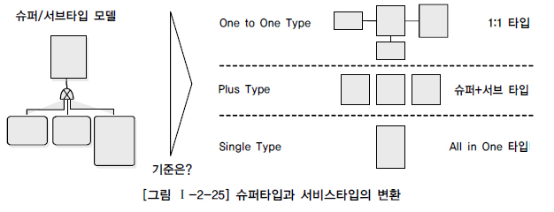
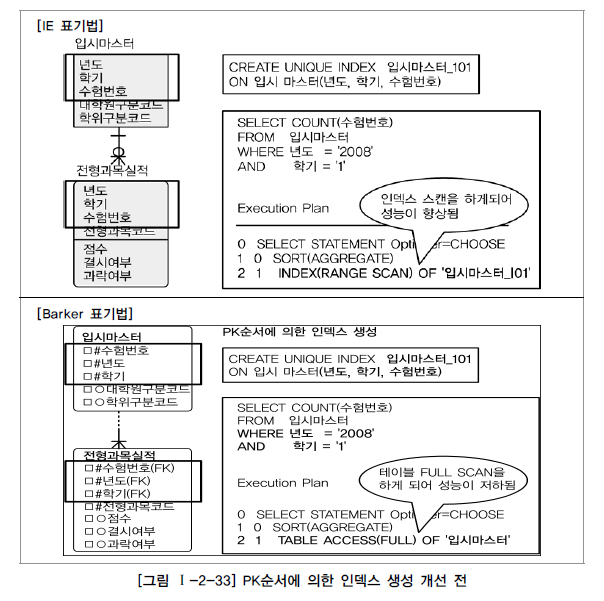
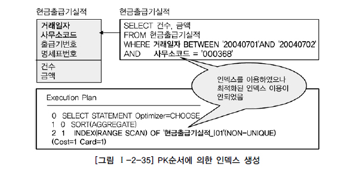
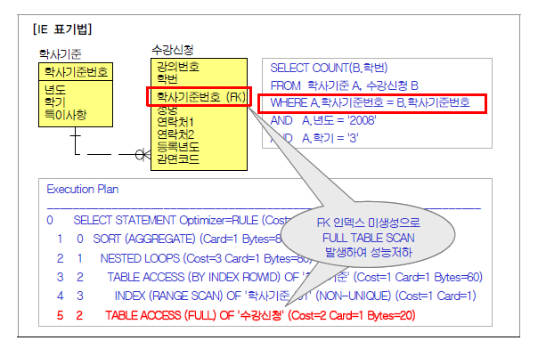

　 [대량 데이터에 따른 성능](#대량-데이터에-따른-성능)\
　　 [1. 대량 데이터발생에 따른 테이블 분할 개요](#1-대량-데이터발생에-따른-테이블-분할-개요)\
　　 [2. 한 테이블에 많은 수의 칼럼을 가지고 있는 경우](#2-한-테이블에-많은-수의-칼럼을-가지고-있는-경우)\
　　 [3. 대량 데이터 저장 및 처리로 인해 성능](#3-대량-데이터-저장-및-처리로-인해-성능)\
　　　 [가. RANGE PARTITION 적용](#가-range-partition-적용)\
　　　 [나. LIST PARTITION 적용](#나-list-partition-적용)\
　　　 [다. HASH PARTITION 적용](#다-hash-partition-적용)\
　　 [4. 테이블에 대한 수평분할/수직분할의 절차](#4-테이블에-대한-수평분할수직분할의-절차)\
　 [데이터베이스 구조와 성능](#데이터베이스-구조와-성능)\
　　 [1. 슈퍼타입/서브타입 모델의 성능고려 방법](#1-슈퍼타입서브타입-모델의-성능고려-방법)\
　　　 [가. 슈퍼/서브타입 데이터 모델의 개요](#가-슈퍼서브타입-데이터-모델의-개요)\
　　　 [나. 슈퍼/서브타입 데이터 모델의 변환](#나-슈퍼서브타입-데이터-모델의-변환)\
　　　 [다. 슈퍼/서브 타입 데이터 모델의 변환기술](#다-슈퍼서브-타입-데이터-모델의-변환기술)\
　　　 [라. 슈퍼/서브타입 데이터 모델의 변환타입 비교](#라-슈퍼서브타입-데이터-모델의-변환타입-비교)\
　　 [2. 인덱스 특성을 고려한 PK/FK 데이터베이스 성능향상](#2-인덱스-특성을-고려한-pkfk-데이터베이스-성능향상)\
　　　 [가. PK/FK 칼럼 순서와 성능개요](#가-pkfk-칼럼-순서와-성능개요)\
　　　 [가. PK/FK 칼럼 순서와 성능개요 데이터를 조회할 때 가장 효과적으로 처리될 수 있도록 접근경로를 제공하는 오브젝트가 바로 인덱스이다. 일반적으로 데이터베이스 테이블에서는 균형 잡힌 트리구조의 B*Tree구조를 많이 사용한다. 우리는 B*Tree구조의 내부 알고리즘까지는 알 필요가 없더라도 그 구조를 이용할 때 정렬되어 있는 특징으로 인해 데이터베이스 설계에 이 특징에 따라 설계에 반영해야 할 요소에 대해서는 반드시 알고 있어야 좋은 데이터 모델을 만들어 낼 수 있게 된다.](#가-pkfk-칼럼-순서와-성능개요-데이터를-조회할-때-가장-효과적으로-처리될-수-있도록-접근경로를-제공하는-오브젝트가-바로-인덱스이다-일반적으로-데이터베이스-테이블에서는-균형-잡힌-트리구조의-btree구조를-많이-사용한다-우리는-btree구조의-내부-알고리즘까지는-알-필요가-없더라도-그-구조를-이용할-때-정렬되어-있는-특징으로-인해-데이터베이스-설계에-이-특징에-따라-설계에-반영해야-할-요소에-대해서는-반드시-알고-있어야-좋은-데이터-모델을-만들어-낼-수-있게-된다)\
　　　 [나. PK칼럼의 순서를 조정하지 않으면 성능이 저하 이유](#나-pk칼럼의-순서를-조정하지-않으면-성능이-저하-이유)\
　　　 [다. PK순서를 잘못 지정하여 성능이 저하된 경우 - 간단한 오류](#다-pk순서를-잘못-지정하여-성능이-저하된-경우---간단한-오류)\
　　　 [라. PK순서를 잘못 지정하여 성능이 저하된 경우 - 복잡한 오류](#라-pk순서를-잘못-지정하여-성능이-저하된-경우---복잡한-오류)\
　　 [3. 물리적인 테이블에 FK제약이 걸려있지 않을 경우 인덱스 미생성으로 성능저하](#3-물리적인-테이블에-fk제약이-걸려있지-않을-경우-인덱스-미생성으로-성능저하)\
　 [분산 데이터베이스와 성능](#분산-데이터베이스와-성능)\
　　 [1. 분산 데이터베이스의 개요](#1-분산-데이터베이스의-개요)\
　　 [2. 분산 데이터베이스의 투명성(Transparency)](#2-분산-데이터베이스의-투명성transparency)\
　　 [3. 분산 데이터베이스의 적용 방법 및 장단점](#3-분산-데이터베이스의-적용-방법-및-장단점)\
　　　 [가. 분산 데이터베이스 적용방법](#가-분산-데이터베이스-적용방법)\
　　　 [나. 분산 데이터베이스 장단점](#나-분산-데이터베이스-장단점)\
　　 [4. 분산 데이터베이스의 활용 방향성](#4-분산-데이터베이스의-활용-방향성)\
　　 [5. 데이터베이스 분산구성의 가치](#5-데이터베이스-분산구성의-가치)\
　　 [6. 분산 데이터베이스의 적용 기법](#6-분산-데이터베이스의-적용-기법)\
　　　 [가. 테이블 위치 분산](#가-테이블-위치-분산)\
　　　 [나. 테이블 분할(Fragmentation) 분산](#나-테이블-분할fragmentation-분산)\
　　　 [다. 테이블 복제(Replication) 분산](#다-테이블-복제replication-분산)\
　　　 [라. 테이블 요약(Summarization) 분산](#라-테이블-요약summarization-분산)\
　　 [7. 분산 데이터베이스를 적용하여 성능이 향상된 사례](#7-분산-데이터베이스를-적용하여-성능이-향상된-사례)\
*****
# 대량 데이터에 따른 성능 

## 1. 대량 데이터발생에 따른 테이블 분할 개요 

아무리 설계가 잘되어 있는 데이터 모델이라고 하더라도 대량의 데이터가 하나의 테이블에 집약되어 있고 하나의 하드웨어 공간에 저장되어 있으면 성능저하를 피하기가 힘들다. 이런 원리는 하나의 고속도로 차선을 넓게 시공하여 건설해도 교통량이 많게 되면 이 넓은 도로가 정체현상을 보이는 것과 비슷한 원리로 이해할 수 있다. 일의 처리되는 양이 한군데에 몰리는 현상은 어떤 업무에 있어서 중요한 업무에 해당되는 데이터가 특정 테이블에 있는 경우에 발생이 되는데 이런 경우 트랜잭션이 분산 처리될 수 있도록 테이블단위에서 분할의 방법을 적용할 필요가 있는 것이다. 
 

한 테이블에 데이터가 대량으로 집중되거나 하나의 테이블에 여러 개의 칼럼이 존재하여 디스크에 많은 블록을 점유하는 경우는 모두 성능저하를 유발할 수 있는 경우이다. 하나의 테이블에 대량의 데이터가 존재하는 경우에는 인덱스의 Tree구조가 너무 커져 효율성이 떨어져 데이터를 처리(입력, 수정, 삭제, 조회)할 때 디스크 I/O를 많이 유발하게 된다. 또한 한 테이블에 많은 수의 칼럼이 존재하게 되면 데이터가 디스크의 여러 블록에 존재하므로 인해 디스크에서 데이터를 읽는 I/O량이 많아지게 되어 성능이 저하되게 된다. 
대량의 데이터가 처리되는 테이블에 성능이 저하되는 이유는 SQL문장에서 데이터를 처리하기 위한 I/O의 양이 증가하기 때문이다. 당연하게 데이터의 양이 많아지면 그것을 처리하기 위한 I/O량이 많아질 것이라고 막연하게 생각할 수 있지만, 인덱스를 적절하게 구성하여 이용하게 하면 I/O를 줄일 수 있을 것이라고 생각할 수 있다. 조회조건에 따른 인덱스를 적절하게 이용하면 해당 테이블에 데이터가 아무리 많아도 원하는 데이터만 접근하면 되기 때문에 I/O의 양이 그다지 증가하지 않을 것으로 생각할 수 있다. 그러나 대량의 데이터가 하나의 테이블에 존재하게 되면 인덱스를 생성할 때 인덱스의 크기(용량)가 커지게 되고 그렇게 되면 인덱스를 찾아가는 단계가 깊어지게 되어 조회의 성능에도 영향을 미치게 된다. 인덱스 크기가 커질 경우 조회의 성능에는 영향을 미치는 정도가 작지만 데이터를 입력/수정/삭제하는 트랜잭션의 경우 인덱스의 특성상 일량이 증가하여 더 많이 성능의 저하를 유발하게 된다. 또한 데이터에 대한 범위 조회시 더 많은 I/O 유발할 수 있게 되어 성능저하를 유발할 수 있게 된다. 
칼럼이 많아지게 되면 물리적인 디스크에 여러 블록에 데이터가 저장되게 된다. 따라서 데이터를 처리할 때 여러 블록에서 데이터를 I/O해야 하는 즉 SQL문장의 성능이 저하될 수 특징을 가지게 된다. 물론, 테이블에 칼럼이 많아지는 현상은 정규화이론인 함수적 종속성에 근거하여 당연히 하나의 테이블에 설계할 수는 있다. 그러나 대량 데이터를 가진 테이블에서 불필요하게 많은 양의 I/O를 유발하여 성능이 저하되는 경우에는 이것을 기술적으로 분석하여 성능을 향상하는 방법으로 분할할 수 있다. 
 

프로젝트를 수행할 때 때로는 하나의 테이블에 300개 이상의 칼럼을 가지고 있는 경우가 있다. 컴퓨터 화면 하나에는 볼 수가 없어서 스크롤을 하면서 하나의 테이블에 있는 칼럼을 구경해야 할 정도이다. 이렇게 많은 칼럼은 로우체이닝과 로우마이그레이션이 많아지게 되어 성능이 저하된다. 
로우 길이가 너무 길어서 데이터 블록 하나에 데이터가 모두 저장되지 않고 두 개 이상의 블록에 걸쳐 하나의 로우가 저장되어 있는 형태가 로우체이닝(Row Chaining) 현상이다. 또한 로우마이그레이션(Row Migration)은 데이터 블록에서 수정이 발생하면 수정된 데이터를 해당 데이터 블록에서 저장하지 못하고 다른 블록의 빈 공간을 찾아 저장하는 방식이다. 로우체이닝과 로우마이그레이션이 발생하여 많은 블록에 데이터가 저장되면 데이터베이스 메모리에서 디스크와 I/O(입력/출력)가 발생할 때 불필요하게 I/O가 많이 발생하여 성능이 저하된다. 

## 2. 한 테이블에 많은 수의 칼럼을 가지고 있는 경우 

도서정보라고 하는 테이블에 칼럼수가 아주 많은 경우를 생각해 보자. 생략된 칼럼까지 합하면 대략 200개라고 가정한다. 만약 하나의 로우의 길이가 10KByte라고 하고 블록은 2K단위로 쪼개져 있다고 가정한다. 또한 블록에 데이터는 모두 채워진다고 가정하면 대략 하나의 로우는 5블록에 걸쳐 데이터가 저장될 것이다. 
이 때 칼럼의 앞쪽에 위치한 발행기관명, 수량, 중간에 위치한 공고일, 발행일에 대한 정보를 가져오려면 물리적으로 칼럼의 값이 블록에 넓게 산재되어 있어 디스크 I/O가 많이 일어나게 된다. 
 

200개의 칼럼을 동시에 조회하여 화면에 보여주는 경우는 드문 사례이다. 만약 200개의 칼럼이 가지고 있는 값을 모두 한 화면에 보여주기 위해서는 화면을 몇 번 스크롤 하면서 보여야 한다. 즉 이렇게 많은 칼럼을 가지고 있는 테이블에 대해서는 트랜잭션이 발생될 때 어떤 칼럼에 대해 집중적으로 발생하는지 분석하여 테이블을 쪼개어 주면 디스크 I/O가 감소하게 되어 성능이 개선되게 된다. 

[그림 Ⅰ-2-21]의 데이터 모델을 살펴보자. 
 

도서정보 테이블에는 전자출판유형에 대한 트랜잭션이 독립적으로 발생이 되는 경우가 많고 대체제품에 대한 유형의 트랜잭션이 독립적으로 발생되는 경우가 많이 있어 1:1 관계로 분리하였다. 분리된 테이블은 디스크에 적어진 칼럼이 저장이 되므로 로우마이그레이션과 로우체이닝이 많이 줄어들 수 있다. 따라서 아래와 같이 발행기관명, 수량, 중간에 위치한 공고일, 발행일을 가져오는 동일한 SQL구문에 대해서도 디스크 I/O가 줄어들어 성능이 개선되게 된다. 
 

많은 수의 칼럼을 가지는 데이터 모델 형식도 실전 프로젝트에서 흔히 나타나는 현상이다. 트랜잭션을 분석하여 적절하게 1:1 관계로 분리함으로써 성능향상이 가능하도록 해야 한다. 

## 3. 대량 데이터 저장 및 처리로 인해 성능 

테이블에 많은 양의 데이터가 예상될 경우 파티셔닝을 적용하거나 PK에 의해 테이블을 분할하는 방법을 적용할 수 있다. Oracle의 경우 크게 LIST PARTITION(특정값 지정), RANGE PARTITION(범위), HASH PARTITION(해쉬적용), COMPOSITE PARTITION(범위와 해쉬가 복합) 등이 가능하다. 
데이터량이 몇 천만건을 넘어서면 아무리 서버사양이 훌륭하고 인덱스를 잘 생성해준다고 하더라고 SQL문장의 성능이 나오지 않는다. 이 때는 논리적으로는 하나의 테이블로 보이지만 물리적으로 여러 개의 테이블스페이스에 쪼개어 저장될 수 있는 구조의 파티셔닝을 적용하도록 한다. 
### 가. RANGE PARTITION 적용 

다음은 요금테이블에 PK가 요금일자+요금번호로 구성되어 있고 데이터건수가 1억2천만 건인 대용량 테이블의 경우이다. 하나의 테이블로는 너무 많은 데이터가 존재하므로 인해 성능이 느린 경우에 해당된다. 이 때 요금의 특성상 항상 월단위로 데이터 처리를 하는 경우가 많으므로 PK인 요금일자의 년+월을 이용하여 12개의 파티션 테이블을 만들었다. 하나의 파티션 테이블당 평균 1,000만 건의 데이터가 있다고 가정한다. 
 

SQL문장을 처리할 때는 마치 하나의 테이블처럼 보이는 요금 테이블을 이용하여 처리하면 되지만 DBMS 내부적으로는 SQL WHERE 절에 비교된 요금일자에 의해 각 파티션에 있는 정보를 찾아가므로 평균 1,000만 건의 데이터가 있는 곳을 찾아도 되어 성능이 개선될 수 있다. 
가장 많이 사용하는 파티셔닝의 기준이 RANGE PARTITION이다. 대상 테이블이 날자 또는 숫자값으로 분리가 가능하고 각 영역별로 트랜잭션이 분리된다면 RANGE PARTITION을 적용한다. 또한 RANGE PARTITION은 데이터보관주기에 따라 테이블에 데이터를 쉽게 지우는 것이 가능하므로(파티션 테이블을 DROP하면 되므로) 데이터보관주기에 다른 테이블관리가 용이하다. 
### 나. LIST PARTITION 적용 

지점, 사업소, 사업장, 핵심적인 코드값 등으로 PK가 구성되어 있고 대량의 데이터가 있는 테이블이라면 값 각각에 의해 파티셔닝이 되는 LIST PARTITION을 적용할 수 있다. 

[그림 Ⅰ-2-24]의 예는 고객이라고 하는 테이블에 데이터가 1억 건이 있는데 하나의 테이블에서 데이터를 처리하기에는 SQL문장의 성능이 저하되어 지역을 나타내는 사업소코드별로 LIST PARTITION을 적용한 예이다. 
 

LIST PARTITION은 대용량 데이터를 특정값에 따라 분리 저장할 수는 있으나 RANGE PARTITION과 같이 데이터 보관주기에 따라 쉽게 삭제하는 기능은 제공될 수 없다. 
### 다. HASH PARTITION 적용 

기타 HASH PARTITION은 지정된 HASH 조건에 따라 해슁 알고리즘이 적용되어 테이블이 분리되며 설계자는 테이블에 데이터가 정확하게 어떻게 들어갔는지 알 수 없다. 역시 성능향상을 위해 사용하며 데이터 보관주기에 따라 쉽게 삭제하는 기능은 제공될 수 없다. 
데이터량이 대용량이 되면 파티셔닝의 적용은 필수적으로 파티셔닝 기준을 나눌 수 있는 조건에 따라 적절한 파티셔닝을 방법을 선택하여 성능을 향상 시키도록 한다. 

## 4. 테이블에 대한 수평분할/수직분할의 절차 

테이블에 대한 수평분할/수직분할에 대한 결정은 다음의 4가지 원칙을 적용하면 된다. 

1) 데이터 모델링을 완성한다. 
2) 데이터베이스 용량산정을 한다. 
3) 대량 데이터가 처리되는 테이블에 대해서 트랜잭션 처리 패턴을 분석한다. 
4) 칼럼 단위로 집중화된 처리가 발생하는지, 로우단위로 집중화된 처리가 발생되는지 분석하여 집중화된 단위로 테이블을 분리하는 것을 검토한다. 

용량산정은 어느 테이블에 데이터의 양이 대용량이 되는지 분석하는 것이다. 특정 테이블의 용량이 대용량인 경우 칼럼의 수가 너무 많은 지 확인한다. 칼럼의 수가 많은 경우 트랜잭션의 특성에 따라 테이블을 1:1 형태로 분리할 수 있는지 검증하면 된다. 칼럼의 수가 적지만 데이터용량이 많아 성능저하가 예상이 되는 경우 테이블에 대해 파티셔닝 전략을 고려하도록 한다. 이 때 임의로 파티셔닝할 것인지 데이터가 발생되는 시간에 따라 파티셔닝을 할 것인지를 설명된 기준에 따라 적용하면 된다.
*****
# 데이터베이스 구조와 성능 

## 1. 슈퍼타입/서브타입 모델의 성능고려 방법 
### 가. 슈퍼/서브타입 데이터 모델의 개요 

Extended ER모델이라고 부르는 이른바 슈퍼/서브타입 데이터 모델은 최근에 데이터 모델링을 할 때 자주 쓰이는 모델링 방법이다. 이 모델이 자주 쓰이는 이유는 업무를 구성하는 데이터의 특징을 공통과 차이점의 특징을 고려하여 효과적으로 표현할 수 있기 때문이다. 즉, 공통의 부분을 슈퍼타입으로 모델링하고 공통으로부터 상속받아 다른 엔터티와 차이가 있는 속성에 대해서는 별도의 서브엔터티로 구분하여 업무의 모습을 정확하게 표현하면서 물리적인 데이터 모델로 변환을 할 때 선택의 폭을 넓힐 수 있는 장점이 있다. 이러한 장점 때문에 많은 프로젝트에서 슈퍼/서브타입을 활용한 데이터 모델의 사례가 증가하고 있다. 
당연히 슈퍼/서브타입의 데이터 모델은 논리적인 데이터 모델에서 이용되는 형태이고 분석/설계단계를 구분하자면, 분석단계에서 많이 쓰이는 모델이다. 따라서 물리적인 데이터 모델을 설계하는 단계에서는 슈퍼/서브타입 데이터 모델을 일정한 기준에 의해 변환을 해야 한다. 그런데 실제로 프로젝트 현장에서는 이것을 변환하는 방법에 대해 정확한 노하우가 없기 때문에 막연하게 1:1로 변환하거나 아니면 하나의 테이블로 구성해 버리는 현상이 나타난다. 
물리적인 데이터 모델이 성능을 고려한 데이터 모델이 되어야 한다는 점을 고려하면 이렇게 막연하게 슈퍼/서브타입을 아무런 기준없이 변환하는 것 자체가 성능이 저하될 수 있는 위험이 있음을 기억해야 한다. 
### 나. 슈퍼/서브타입 데이터 모델의 변환 

성능을 고려한 슈퍼타입과 서브타입의 모델 변환의 방법을 알아보면 [그림 Ⅰ-2-25]와 같다. 
 

슈퍼/서브타입에 대한 변환을 잘못하면 성능이 저하되는 이유는 트랜잭션 특성을 고려하지 않고 테이블이 설계되었기 때문이다. 이것을 3가지 경우의 수로 정리하면 설명하면 다음과 같다. 1) 트랜잭션은 항상 일괄로 처리하는데 테이블은 개별로 유지되어 Union연산에 의해 성능이 저하될 수 있다. 2) 트랜잭션은 항상 서브타입 개별로 처리하는데 테이블은 하나로 통합되어 있어 불필요하게 많은 양의 데이터가 집약되어 있어 성능이 저하되는 경우가 있다. 3) 트랜잭션은 항상 슈퍼+서브 타입을 공통으로 처리하는데 개별로 유지되어 있거나 하나의 테이블로 집약되어 있어 성능이 저하되는 경우가 있다. 

해당 테이블에 발생되는 성능이 중요한 트랜잭션이 빈번하게 처리되는 기준에 따라 테이블을 설계해야 이러한 성능저하 현상을 예방할 수 있음을 기억해야 한다. 슈퍼/서브타입을 성능을 고려한 물리적인 데이터 모델로 변환하는 기준은 데이터 양과 해당 테이블에 발생되는 트랜잭션의 유형에 따라 결정된다. 
 

데이터의 양은 데이터량이 소량일 경우 성능에 영향을 미치지 않기 때문에 데이터처리의 유연성을 고려하여 가급적 1:1 관계를 유지하는 것이 바람직하다. 그러나 데이터용량이 많아지는 경우 그리고 해당 업무적인 특징이 성능에 민감한 경우는 트랜잭션이 해당 테이블에 어떻게 발생되는지에 따라 3가지 변환방법을 참조하여 상황에 맞게 변환하도록 해야 한다. 
### 다. 슈퍼/서브 타입 데이터 모델의 변환기술 

논리적인 데이터 모델에서 설계한 슈퍼타입/서브타입 모델을 물리적인 데이터 모델로 전환할 때 주로 어떤 유형의 트랜잭션이 발생하는지 검증해야 한다. 물론 데이터량이 아주 작다면, 예를 들어 10만 건도 되지 않는다면 그리고 시스템을 운영하는 중에도 증가하지 않는다면 트랜잭션의 성격을 고려하지 않고 전체를 하나의 테이블로 묶어도 좋은 방법이다. 
그러나 데이터량이 많이 존재하고 지속적으로 증가하는 양도 많다면 슈퍼타입/서브타입에 대해 물리적인 데이터 모델로 변환하는 세 가지 유형에 대해 세심하게 적용을 해야 한다. 

1) 개별로 발생되는 트랜잭션에 대해서는 개별 테이블로 구성 
업무적으로 발생되는 트랜잭션이 슈퍼타입과 서브타입 각각에 대해 발생하는 것이다. 
[그림 Ⅰ-2-27]의 업무화면을 보면 공통으로 처리하는 슈퍼타입테이블인 당사자 정보를 미리 조회하고 원하는 내용을 클릭하면 거기에 따라서 서브타입인 세부적인 정보 즉 이해관계인, 매수인, 대리인에 대한 내용을 조회하는 형식이다. 즉 슈퍼타입이 각 서브타입에 대해 기준역할을 하는 형식으로 사용할 때 이러한 유형의 트랜잭션이 발생이 된다. 
 

위와 같이 슈퍼타입과 서브타입각각에 대해 독립적으로 트랜잭션이 발생이 되면 슈퍼타입에도 꼭 필요한 속성만을 가지게 하고 서브타입에도 꼭 필요한 속성 및 자신이 타입에 맞는 데이터만 가지게 하기 위해서 모두 분리하여 1:1 관계를 갖도록 한다. 
실전프로젝트에서는 데이터량이 대용량으로 존재하는 경우에 공통으로 이용하는 슈퍼타입의 속성의 수가 너무 많아져 디스크 I/O가 많아지는 것을 방지하기 위해 위와 같이 각각을 1:1 관계로 가져가는 경우도 있다. 

2) 슈퍼타입+서브타입에 대해 발생되는 트랜잭션에 대해서는 슈퍼타입+서브타입 테이블로 구성 
만약 대리인이 10만 건, 매수인 500만 건, 이해관계인 500만 건의 데이터가 존재한다고 가정하고 슈퍼타입과 서브타입이 모두 하나의 테이블로 통합되어 있다고 가정하자. 매수인, 이해관계인에 대한 정보는 배제하고 10만 건뿐인 대리인에 대한 데이터만 처리할 경우 다른 테이블과 같이 데이터가 1천10만 건이 저장되어 있는 곳에서 처리해야 하므로 불필요한 성능저하 현상이 유발된다. 즉 대리인에 대한 처리가 개별적으로 많이 발생하는데 매수인과 이해관계인의 데이터까지 포함되어 있으므로 최대 10만 건을 읽어 처리할 수 있는 업무가 최대 1천10만 건을 읽어 처리하는 경우가 발생될 수 있다. 
이와 같이 슈퍼타입과 서브타입을 묶어 트랜잭션이 발생하는 업무특징을 가지고 있을 때에는 다음 데이터 모델과 같이 슈퍼타입+각서브타입을 하나로 묶어 별도의 테이블로 구성하는 것이 효율적이다. 
업무적인 특성상 실전 프로젝트에서 슈퍼타입/서브타입모델은 위와 같이 각각이 슈퍼타입+서브타입으로 묶여 구성하는 경우가 많다. 
 

3) 전체를 하나로 묶어 트랜잭션이 발생할 때는 하나의 테이블로 구성 
대리인 10만 건, 매수인 500만 건, 이해관계인 500만 건의 데이터가 존재한다고 하더라고 데이터를 처리할 때 대리인, 매수인, 이해관계인을 항상 통합하여 처리한다고 하면 테이블을 개별로 분리해야 불필요한 조인을 유발하거나 불필요한 UNION ALL과 같은 SQL구문이 작성되어 성능이 저하된다. 비록 슈퍼타입과 서브타입의 테이블들을 하나로 묶었을 때 각각의 속성별로 제약사항(NULL/NOT NULL, 기본값, 체크값)을 정확하게 지정하지 못할지라도 대용량이고 성능향상이 필요하다면 하나의 테이블로 묶어서 만들어 준다. 

3가지 전개 방식이 아주 간단한 원리 같은데 이것도 실전 프로젝트에서 적용하면 쉽지 않은 경우가 많이 나타난다. 때로는 각각의 유형이 혼합되어 있는 경우도 있다. 혼합된 트랜잭션 유형이 있는 경우는 많이 발생하는 트랜잭션 유형에 따라 구성하면 된다. 
### 라. 슈퍼/서브타입 데이터 모델의 변환타입 비교 
 

[표 Ⅰ-2-4]와 같이 각 성능이 좋을 수도 나쁠 수도 있기 때문에 변환모델의 선택은 철저하게 데이터베이스에 발생되는 트랜잭션의 유형에 따라 선택을 해야 한다. 

## 2. 인덱스 특성을 고려한 PK/FK 데이터베이스 성능향상 
### 가. PK/FK 칼럼 순서와 성능개요 

### 가. PK/FK 칼럼 순서와 성능개요 데이터를 조회할 때 가장 효과적으로 처리될 수 있도록 접근경로를 제공하는 오브젝트가 바로 인덱스이다. 일반적으로 데이터베이스 테이블에서는 균형 잡힌 트리구조의 B*Tree구조를 많이 사용한다. 우리는 B*Tree구조의 내부 알고리즘까지는 알 필요가 없더라도 그 구조를 이용할 때 정렬되어 있는 특징으로 인해 데이터베이스 설계에 이 특징에 따라 설계에 반영해야 할 요소에 대해서는 반드시 알고 있어야 좋은 데이터 모델을 만들어 낼 수 있게 된다. 
프로젝트에서 PK/FK설계는 업무적 의미로도 매우 중요한 의미를 가지고 있지만 데이터를 접근할 때 경로를 제공하는 성능의 측면에서도 중요한 의미를 가지고 있기 때문에 성능을 고려한 데이터베이스 설계가 될 수 있도록 설계단계 말에 칼럼의 순서를 조정할 필요가 있다. 
일반적으로 프로젝트에서는 PK/FK 칼럼 순서의 중요성을 인지하지 못한 채로 데이터 모델링이 되어 있는 그 상태대로 바로 DDL을 생성함으로써 데이터베이스 데이터처리 성능에 문제를 유발하는 경우가 빈번하게 발생이 된다. 
 

간단한 것 같지만 실전 프로젝트에서는 아주 중요한 내용이 바로 PK순서이다. 성능저하 현상이 많은 부분이 PK가 여러 개의 속성으로 구성된 복합식별자 일 때 PK순서에 대해 별로 고려하지 않고 데이터 모델링을 한 경우에 해당된다.&lt;&gt;br 특히 물리적인 데이터 모델링 단계에서는 스스로 생성된 PK순서 이외에 다른 엔터티로부터 상속받아 발생되는 PK순서까지 항상 주의하여 표시하도록 해야 한다. PK는 해당 해당테이블의 데이터를 접근할 가장 빈번하게 사용되는 유일한 인덱스(Unique Index)를 모두 자동 생성한다. PK순서를 결정하는 기준은 인덱스 정렬구조를 이해한 상태에서 인덱스를 효율적으로 이용할 수 있도록 PK순서를 지정해야 한다. 즉 인덱스의 특징은 여러 개의 속성이 하나의 인덱스로 구성되어 있을 때 앞쪽에 위치한 속성의 값이 비교자로 있어야 인덱스가 좋은 효율을 나타낼 수 있다. 앞쪽에 위치한 속성 값이 가급적 ‘=’ 아니면 최소한 범위 ‘BETWEEN’ ‘&lt; &gt;’가 들어와야 인덱스를 이용할 수 있는 것이다. 
데이터 모델링 때 결정한 PK순서와는 다르게 DDL문장을 통해 PK순서를 다르게 생성할 수도 있다. 그러나 대부분의 프로젝트에서는 데이터 모델의 PK 순서에 따라 그대로 PK를 생성한다. 만약 다르게 생성한다고 하더라도 데이터 모델과 데이터베이스 테이블의 구조가 다른 것처럼 보여 유지보수에 어려움이 많을 것이다. 또한 FK라고 하더라도 데이터를 조회할 때 조인의 경로를 제공하는 역할을 수행하므로 FK에 대해서는 반드시 인덱스를 생성하도록 하고 인덱스 칼럼의 순서도 조회의 조건을 고려하여 접근이 가장 효율적인 칼럼 순서대로 인덱스를 생성하도록 주의해야 한다. 
### 나. PK칼럼의 순서를 조정하지 않으면 성능이 저하 이유 

먼저 데이터 모델링에서 엔터티를 설계하면 그에 따라 DDL이 생성이 되고 생성된 DDL에 따라 인덱스가 생성된다. 이 때 우리가 알아야 할 구조는 인덱스의 정렬구조에 해당된다. 
[그림 Ⅰ-2-30]은 인덱스의 정렬구조가 생성되는 구조를 보여주고 있다. 
 

[그림 Ⅰ-2-30]에서 보면 테이블에서 데이터 모델의 PK순서에 따라 DDL이 그대로 생성이 되고 테이블의 데이터가 주문번호가 가장먼저 정렬되고 그에 따라 주문일자가 정렬이 되고 마지막으로 주문목록코드가 정렬되는 것을 알 수 있다. 이러한 정렬 구조로 인해 데이터를 접근하는 트랜잭션의 조건에 따라 다른 인덱스 접근방식을 보여주게 된다. 
위와 같은 인덱스의 정렬 구조에서 SQL구문의 조건에 따라 인덱스를 처리하는 범위가 달라지게 된다. 맨 앞에 있는 인덱스 칼럼에 대해 조회 조건이 들어올 때 데이터를 접근하는 방법은 [그림 Ⅰ-2-31]과 같다. 
 

인덱스의 정렬된 첫 번째 칼럼에 비교가 되었기 때문에 순차적으로 데이터를 찾아가게 된다. 맨 앞에 있는 칼럼이 제외된 상태에서 데이터를 조회 할 경우 데이터를 비교하는 범위가 매우 넓어지게 되어 성능 저하를 유발하게 된다. 
 

[그림 Ⅰ-2-32]의 예에서는 주문번호에 대한 비교값이 들어오지 않으므로 인해 인덱스 전체를 읽어야만 원하는 데이터를 찾을 수 있게 된다. 이러한 이유로 인덱스를 읽고 테이블 블록에서 읽어 처리하는데 I/O가 많이 발생하게 되므로 옵티마이저는 차라리 테이블에 가서 전체를 읽는 방식으로 처리하게 된다. 
이러한 모습으로 인덱스의 정렬구조를 이해한 상태에서 인덱스에 접근하는 접근유형을 비교해보면 어떠한 인덱스를 태워야 하는지 어떠한 조건이 들어와야 데이터를 처리하는 양을 줄여 성능을 향상시킬 수 있는지 알 수 있게 된다. 
정리하면, PK의 순서를 인덱스 특징에 맞게 고려하지 않고 바로 그대로 생성하게 되면, 테이블에 접근하는 트랜잭션의 특징에 효율적이지 않은 인덱스가 생성되어 있으므로 인덱스의 범위를 넓게 이용하거나 Full Scan을 유발하게 되어 성능이 저하된다고 정리할 수 있다. 
다음은 실전 프로젝트에서 발생되는 예를 통해 PK나 FK의 성능저하 사항을 알아보도록 한다. 
### 다. PK순서를 잘못 지정하여 성능이 저하된 경우 - 간단한 오류 

입시마스터라는 테이블의 PK는 수험번호+년도+학기로 구성되어 있고 전형과목실적 테이블은 입시마스터 테이블에서 상속받은 수험번호+년도+학기에 전형과목코드로 PK가 구성되어 있는 복합식별자 구조의 테이블이다. 입시마스터에는 200만 건의 데이터가 있고 학사는 4학기로 구성되어 있고 데이터는 5년간 보관되어 있다. 그러므로 한 학기당 평균 2만 건의 데이터가 있다고 가정하자. 
 

이 테이블 구조에서 다음과 같은 SQL구문이 실행되면 입시마스터 테이블에 있는 인덱스 입시마스터_I01을 이용할 수 있을까? 
>SELECT COUNT(수험번호) FROM 입시마스터 WHERE 년도 = '2008' AND 학기 = '1' 

 

입시마스터_I01 인덱스가 수험번호+년도+학기 중 수험번호에 대한 값이 WHERE절에 들어오지 않으므로 FULL TABLE SCAN이 발생, 200만 건의 데이터를 모두 읽게 되어 성능이 저하되었다. 
입시마스터 테이블에 데이터를 조회할 때 년도와 학기에 대한 내용이 빈번하게 들어오므로 [그림 Ⅰ-2-34]와 같이 PK순서를 변경함으로써 인덱스를 이용 가능하도록 할 수 있다. 즉, 생성된 인덱스가 정상적으로 이용이 되어 평균 2만 건의 데이터를 처리함으로써 성능이 개선된 모습이다. 
### 라. PK순서를 잘못 지정하여 성능이 저하된 경우 - 복잡한 오류 

현금출급기실적의 PK는 거래일자+사무소코드? SQL문장에서는 조회를 할 때 사무소코드가 ‘=’로 들어오고 거래일자에 대해서는 ‘BETWEEN’ 조회를 하고 있다. 이 때 SQL은 정상적으로 인덱스를 이용할 수 있지만 인덱스 효율이 떨어져 성능이 저하되는 경우에 해당된다. 

해당 테이블에 발생하는 SQL은 다음과 같이 작성되었다. 
>SELECT 건수, 금액 FROM 현금출급기실적 WHERE 거래일자 BETWEEN '20040701' AND '20040702' AND 사무소코드 = '000368' 

 

실행계획을 분석해 보면 인덱스가 정상적으로 이용되었기 때문에 SQL문장은 튜닝이 잘된 것으로 착각할 수 있다. 문제는 인덱스를 이용하기는 하는데 얼마나 효율적으로 이용하는지 검증이 필요하다. 아래 그림은 거래일자+사무소코드 순서로 인덱스를 구성한 경우와 사무소코드+거래일자 순서로 인덱스를 구성한 경우 데이터를 처리하는 범위의 차이를 보여주는 그림이다. 거래일자+사무소코드로 구성된 그림을 보면 BETWEEN 비교를 한 거래일자 ‘20040701’이 인덱스의 앞에 위치하기 때문에 범위가 넓어졌고 사무소코드+거래일자로 구성된 인덱스의 경우 ‘=’비교를 한 사무소코드 ‘000368’이 인덱스 앞에 위치하여 범위가 좁아졌다. 
 

그러므로 이 경우 인덱스순서를 고려하여 데이터 모델의 PK순서를 거래일자+사무소코드+출급기번호+명세표번호에서 사무소코드+거래일자+출급기번호+명세표번호로 수정하여 성능을 개선할 수 있다. 물론 테이블의 PK구조를 그대로 둔 상태에서 인덱스만 하나 더 만들어도 성능은 개선될 수 있다. 이 때 이미 만들어진 PK 인덱스가 전혀 사용되지 않는다면 입력, 수정, 삭제시 불필요한 인덱스로 인해 더 성능이 저하되어 좋지 않다. 최적화된 인덱스 생성을 위해 PK순서변경을 통한 인덱스 생성이 바람직하다. 
그러면 테이블의 PK의 속성이 A, B가 있을 때 A+B형태로도 빈번하게 조회가 되고 B+A로도 빈번하게 조회되는 경우에는 어떻게 할 것인가? 이 때는 좀 더 자주 이용되는 조회의 형태대로 PK순서를 구성하여 이용하게 하고 순서를 바꾼 인덱스를 추가로 생성하는 것이 필요하다. 

## 3. 물리적인 테이블에 FK제약이 걸려있지 않을 경우 인덱스 미생성으로 성능저하 

물리적인 테이블에 FK를 사용하지 않아도 데이터 모델 관계에 의해 상속받은 FK속성들은 SQL WHERE 절에서 조인으로 이용되는 경우가 많이 있으므로 FK 인덱스를 생성해야 성능이 좋은 경우가 빈번하다. 
다음 그림은 학사기준과 수강신청에 대한 데이터 모델이다. 물리적인 테이블에는 두 테이블사이에 FK 참조무결성 관계가 걸려 있지 않는다고 가정한다. 또한 학사기준에는 데이터가 5만 건이 있고 수강신청에 데이터가 500만 건이 있다고 가정하자. 
? 

비록 수강신청 테이블에 있는 학사기준번호가 SQL WHERE 절에 비교자로 들어오지는 않았지만 수강신청 테이블에서 상속받은 학사기준번호에 대해 인덱스를 생성하지 않으므로 인해 학사기준과 수강신청 테이블이 조인이 되면서 500만 건의 수강신청 테이블이 FULL TABLE SCAN이 발생되어 성능이 저하되었다. 이 때는 수강신청 테이블에 FK 인덱스를 생성하여 성능을 개선할 수 있다. 
? 

비록 물리적으로 학사기준과 수강신청이 연결되어 있지 않다고 하더라도 학사기준으로부터 상속받은 FK에 대해 FK인덱스를 생성함으로써 SQL문장이 조인이 발생할 때 성능저하를 예방할 수 있다. 
FK인덱스를 적절하게 설계하여 구축하지 않았을 경우 개발초기에는 데이터량이 얼마 되지 않아 성능저하가 나타나지 않다가 시스템을 오픈하고 데이터량이 누적될수록 SQL성능이 나빠짐으로 인해 데이터베이스서버에 심각한 장애현상을 초래하는 경우가 많이 있다. 
그러므로 물리적인 테이블에 FK 제약 걸었을 때는 반드시 FK인덱스를 생성하도록 하고 FK제약이 걸리지 않았을 경우에는 FK인덱스를 생성하는 것을 기본정책으로 하되 발생되는 트랜잭션에 의해 거의 활용되지 않았을 때에만 FK 인덱스를 지우는 방법으로 하는 것이 적절한 방법이 된다.
*****
# 분산 데이터베이스와 성능 

## 1. 분산 데이터베이스의 개요 

1990년대에는 데이터베이스를 분산하여 저장하고 그것을 하나의 데이터베이스로 인식하여 사용하는 기술은 아주 난이도가 높은 고급기술로 인식되었다. 2000년도에 클라우드 컴퓨팅, SOA를 인식하듯 분산 데이터베이스를 인식하고 연구·도입하려는 기업이 많았었다. DBMS의 기능이 강해지고 네트워크 속도가 빨라지면서 분산 데이터베이스가 초기에 예상한 만큼 확산되지는 않았지만, 여전히 많은 데이터베이스는 네트워크를 통한 데이터베이스 간의 공유체계를 통해 분산 데이터베이스를 활용하고 있다. 
분산데이터베이스의 정의는 다음과 같다. 

* 여러 곳으로 분산되어있는 데이터베이스를 하나의 가상 시스템으로 사용할 수 있도록 한 데이터베이스 
* 논리적으로 동일한 시스템에 속하지만, 컴퓨터 네트워크를 통해 물리적으로 분산되어 있는 데이터들의 모임. 물리적 Site 분산, 논리적으로 사용자 통합·공유 

즉, 분산 데이터베이스는 데이터베이스를 연결하는 빠른 네트워크 환경을 이용하여 데이터베이스를 여러 지역 여러 노드로 위치시켜 사용성/성능 등을 극대화 시킨 데이터베이스라고 정의할 수 있다.
## 2. 분산 데이터베이스의 투명성(Transparency) 

분산데이터베이스가 되기 위해서는 6가지 투명성(Transparency)을 만족해야 한다. 

1) 분할 투명성 (단편화) : 하나의 논리적 Relation이 여러 단편으로 분할되어 각 단편의 사본이 여러 site에 저장 
2) 위치 투명성 : 사용하려는 데이터의 저장 장소 명시 불필요. 위치정보가 System Catalog에 유지되어야 함 
3) 지역사상 투명성 : 지역DBMS와 물리적 DB사이의 Mapping 보장. 각 지역시스템 이름과 무관한 이름 사용 가능 
4) 중복 투명성 : DB 객체가 여러 site에 중복 되어 있는지 알 필요가 없는 성질 
5) 장애 투명성 : 구성요소(DBMS, Computer)의 장애에 무관한 Transaction의 원자성 유지 
6) 병행 투명성 : 다수 Transaction 동시 수행시 결과의 일관성 유지, Time Stamp, 분산 2단계 Locking을 이용 구현 

전통적인 분산 데이터베이스 구축과 같이, 분산 환경의 데이터베이스를 위와 같은 특징 모두를 만족하면서 구축하는 사례는 최근에는 드물다. 최근에는 분산 환경의 데이터베이스를 구축하기보다 통합하여 데이터베이스를 구축하는 사례가 더 많이 있다. 그럼에도 불구하고 위의 분산 환경의 데이터베이스를 업무적인 특징 및 지역적인 특징에 따라 적절하게 활용하기만 하면, 다양한 장점을 제공하는 특징을 가지고 있기 때문에 대량 데이터처리의 지역적 처리나 글로벌 처리 등에서는 분산 데이터베이스가 유용하게 활용되고 있다. 

## 3. 분산 데이터베이스의 적용 방법 및 장단점 
### 가. 분산 데이터베이스 적용방법 

분산 환경의 데이터베이스를 성능이 우수하게 현장에서 가치 있게 사용하는 방법은 업무의 흐름을 보고 업무구성에 따른 아키텍처 특징에 따라 데이터베이스를 구성하는 것이다. 단순히 분산 환경에서 데이터베이스를 구축하는 것이 목적이 아니라, 업무의 특징에 따라 데이터베이스 분산구조를 선택적으로 설계하는 능력이 필요한 것이다. 이러한 측면만을 보았을 때는 데이터베이스 분산설계라는 측면보다는 데이터베이스 구조설계(아키텍처)라는 의미로 이해해도 무방할 것이다. 
### 나. 분산 데이터베이스 장단점 

## 4. 분산 데이터베이스의 활용 방향성 

분산 데이터베이스는 업무적인 기능이 다양해지고 데이터의 양이 기하급수적으로 증가하는 최근 데이터베이스 환경에서 적용하는 고급화된 기술이다. 업무적인 특징에 따라 분산 데이터베이스를 활용하는 기술이 필요하다. 

## 5. 데이터베이스 분산구성의 가치 

데이터를 분산 환경으로 구성하였을 때 가장 핵심적인 가치는 바로 통합된 데이터베이스에서 제공할 수 없는 빠른 성능을 제공한다는 점이다. 원거리 또는 다른 서버에 접속하여 처리하므로 인해 발생되는 네트워크 부하 및 트랜잭션 집중에 따른 성능 저하의 원인을 분산된 데이터베이스 환경을 구축하므로 빠른 성능을 제공하는 것이 가능해 진다. 바로 이 점 때문에 분산 환경의 데이터베이스를 구축하게 되는 것이다. 

## 6. 분산 데이터베이스의 적용 기법 

데이터베이스의 분산의 종류에는 테이블 위치 분산과 테이블 분할 분산, 테이블 복제 분산, 테이블 요약 분산 전략이 있다. 그 중에서도 가장 많이 사용하는 방식의 테이블의 복제 분할 분산의 방법이고 이 방법은 성능이 저하되는 많은 데이터베이스에서 가장 유용하게 적용할 수 있는 기술적인 방법이 된다. 분산 환경으로 데이터베이스를 설계하는 방법은 일단 통합 데이터 모델링을 하고 각 테이블별로 업무적인 특징에 따라 지역 또는 서버별로 테이블을 분산 배치나 복제 배치하는 형태로 설계할 수 있다. 
### 가. 테이블 위치 분산 

테이블 위치 분산은 테이블의 구조는 변하지 않는다. 또한 테이블이 다른 데이터베이스에 중복되어 생성되지도 않는다. 다만 설계된 테이블의 위치를 각각 다르게 위치시키는 것이다. 예를 들어, 자재품목은 본사에서 구입하여 관리하고 각 지사별로 자재품목을 이용하여 제품을 생산한다고 하면 [그림 Ⅰ-2-41]과 같이 데이터베이스를 본사와 지사단위로 분산시킬 수 있다. 
 

[그림 Ⅰ-2-41]의 분산방법은 설계된 테이블 각각이 지역별로 분산되어 생성되는 경우이다. 
각각의 테이블마다 위치가 다르게 지정되어야 한다면 [그림 Ⅰ-2-42]의 표와 같이 각각 테이블마다 위치를 표기하여 테이블을 생성하도록 한다. 
 

테이블별 위치 분산은 정보를 이용하는 형태가 각 위치별로 차이가 있을 경우에 이용한다. 테이블의 위치가 위치별로 다르므로 테이블의 위치를 파악할 수 있는 도식화된 위치별 데이터베이스 문서가 필요하다. 
### 나. 테이블 분할(Fragmentation) 분산 

테이블 분할 분산은 단순히 위치만 다른 곳에 두는 것이 아니라 각각의 테이블을 쪼개어 분산하는 방법이다. 테이블을 분할하여 분산하는 방법은 테이블을 나누는 기준에 따라 두 가지로 구분된다. 첫 번째는 테이블의 로우(Row)단위로 분리하는 수평분할(Horizontal Fragmentation)이 있고 두 번째는 테이블을 칼럼(Column) 단위로 분할하는 수직분할(Vertical Fragmentation)이 있다. 

* 수평분할(Horizontal Fragmentation) 

지사(Node)에 따라 테이블을 특정 칼럼의 값을 기준으로 로우(Row)를 분리한다. 칼럼은 분리되지 않는다. 모든 데이터가 각 지사별로 분리되어 있는 형태를 가지고 있다. 각 지사에 있는 데이터와 다??며, 데이터를 한군데 집합시켜 놓아도 Primary Key에 의해 중복이 발생되지 않는다. 

이와 같이 수평분할을 이용하는 경우는 각 지사(Node)별로 사용하는 로우(Row)가 다를 때 이용한다. 데이터를 수정할 때는 타 지사에 있는 데이터를 원칙적으로 수정하지 않고 자신의 데이터에 대해서 수정하도록 한다. 각 지사에 존재하는 테이블에 대해서 통합처리를 해야 하는 경우는 조인(JOIN)이 발생하여 성능 저하가 예상되므로 통합처리 프로세스가 많은지를 먼저 검토한 이후에 많지 않은 경우에 수평분할을 해야 한다. 
데이터가 지사별로 별도로 존재하므로 중복은 발생하지 않는다. 대신 타 지사에 있는 데이터가 지사구분이 변경되면 단순히 수정이 발생하는 것 이외에 변경된 지사로 데이터를 이송해야 한다. 한 시점에는 한 지사(Node)에서 하나의 데이터만이 존재하므로 데이터의 무결성은 보장되는 형태이다. 
지사(Node)별로 데이터베이스를 운영하는 경우는 데이터베이스가 속한 서버가 지사(Node)에 존재하던지 아니면 본사에 통합해서 존재하건 간에 데이터베이스 테이블들은 수평 분할하여 존재한다. 
지사별로 운영하는 테이블들의 예를 들어보자. 테이블 고객, 생산제품, 협력회사, 사원, 부서 테이블이 지사1과 지사2에서 일의 시작과 끝이 항상 다르게 발생한다고 하면 각 테이블은 지사별로 수평 분할하여 [그림 Ⅰ-2-44]의 표와 같이 생성되게 된다. 
 

* 수직분할(Vertical Fragmentation) 

지사(Node)에 따라 테이블 칼럼을 기준으로 칼럼(Row)을 분리한다. 로우(Row) 단위로는 분리되지 않는다. 모든 데이터가 각 지사별로 분리되어 있는 형태를 가지고 있다. 칼럼을 기준으로 분할하였기 때문에 각각의 테이블에는 동일한 Primary Key구조와 값을 가지고 있어야 한다. 지사별로 쪼개어진 테이블들을 조합하면 Primary Key가 동일한 데이터의 조합이 가능해야 하며 하나의 완전한 테이블이 구성되어야 한다. 데이터를 한군데 집합시켜 놓아도 동일한 Primary Key는 하나로 표현하면 되므로 데이터 중복은 발생되지 않는다. 

예를 들어 제품의 재고량은 각 지사별로 관리하고 제품에 대한 단가는 본사에서 관리한다고 하면 본사 테이블에는 제품번호, 단가가 존재하고 지사에는 제품번호, 재고량이 존재한다. 이를 본사와 지사단위로 분리된 칼럼의 모습을 도식화 하면 다음과 같이 나타난다. 
 

테이블의 전체 칼럼 데이터를 보기 위해서는 각 지사(Node)별로 흩어져 있는 테이블들을 조인(JOIN)하여 가져와야 하므로 가능하면 통합하여 처리하는 프로세스가 많은 경우에는 이용하지 않도록 한다. 일반적으로 실제 프로젝트에서는 이와 같이 칼럼을 쪼개는 테이블의 수직분할 분산 환경을 구성하는 사례는 드물다. 
### 다. 테이블 복제(Replication) 분산 

테이블 복제(Replication) 분산은 동일한 테이블을 다른 지역이나 서버에서 동시에 생성하여 관리하는 유형이다. 
마스터 데이터베이스에서 테이블의 일부의 내용만 다른 지역이나 서버에 위치시키는 부분복제(Segment Replication)가 있고 마스터 데이터베이스의 테이블의 내용을 각 지역이나 서버에 존재시키는 광역복제(Broadcast Replication)가 있다. 

* 부분복제(Segment Replication) 

통합된 테이블을 한군데(본사)에 가지고 있으면서 각 지사별로는 지사에 해당된 로우(Row)를 가지고 있는 형태이다. 지사에 존재하는 데이터는 반드시 본사에 존재하게 된다. 즉 본사의 데이터는 지사데이터의 합이 되는 것이다. 각 지사에서 데이터 처리가 용이할 뿐만 아니라 전체 데이터에 대한 통합처리도 본사에 있는 통합 테이블을 이용하게 되므로 여러 테이블에 조인(JOIN)이 발생하지 않는 빠른 작업 수행이 가능해진다. 

[그림 Ⅰ-2-47]을 보면, 본사 데이터베이스에 있는 테이블에는 테이블의 전체 내용이 들어가고 각 지사 데이터베이스에 있는 테이블에는 지사별로 관계된 데이터만 들어가게 된다. 수평분할 분산과 마찬가지로 지사간에는 데이터의 중복이 발생하지 않으나 본사와 지사간에는 데이터의 중복이 항상 발생하게 되는 경우이다. 
보통 전국에 있는 고객을 관리할 때 본사에는 전국고객에 대한 정보를 관리하고 지사에는 각 지사와 거래하는 고객정보를 관리한다. 본사의 데이터를 이용하여 통계, 이동 등을 관리하며 지사에 있는 데이터를 이용하여 지사별로 빠른 업무수행을 한다. 보통 지사에 데이터가 먼저 발생하고 본사에 데이터는 지사에 데이터를 이용하여 통합하여 발생된다. 
 

실제 프로젝트에서 많이 사용하는 데이터베이스 분산기법에 해당한다. 각 지사별로 업무수행이 용이하고 본사에 있는 데이터를 이용하여 보고서를 출력하거나 통계를 산정하는 등 다양한 업무형태로 이용 가능하다. 
다른 지역간의 데이터를 복제(Replication)하는데 많은 시간이 소요되고 데이터베이스와 서버에 부하(Load)가 발생하므로 보통 실시간(On-Line) 처리에 의해 복사하는 것보다는 야간에 배치 작업에 의해 수행되는 경우가 많이 있다. 
또한 본사와 지사 양쪽 모두 데이터를 수정하여 전송하는 경우 데이터의 정합성을 일치시키는 것이 어렵기 때문에 가능하면 한쪽(지사)에서 데이터의 수정이 발생하여 본사로 복제(Replication)를 하도록 한다. 

* 광역복제(Broadcast Replication) 

통합된 테이블을 한군데(본사)에 가지고 있으면서 각 지사에도 본사와 동일한 데이터를 모두 가지고 있는 형태이다. 지사에 존재하는 데이터는 반드시 본사에 존재하게 된다. 모든 지사에 있는 데이터량과 본사에 있는 데이터량이 다 동일하다. 본사와 지사모두 동일한 정보를 가지고 있으므로 본사나 지사나 데이터처리에 특별한 제약을 받지는 않는다. 

예를 들어, 본사에서 코드테이블에 데이터에 대해 입력, 수정, 삭제가 발생하고 각 지사에서는 코드데이터를 이용하는 프로세스가 발생한다. 즉 본사에서는 데이터를 관리하고 지사에서는 이 데이터를 읽어 업무프로세스를 발생시키는 것이다. 
 

광역복제(Broadcast Replication) 역시 실제 프로젝트에서 많이 사용하는 데이터베이스 분산기법에 해당한다. 부분복제의 경우는 지사에서 데이터에 대한 입력, 수정, 삭제가 발생하여 본사에서 이용하는 방식이 많은 반면 광역복제(Broadcast Replication)의 경우에는 본사에서 데이터가 입력, 수정, 삭제가 되어 지사에서 이용하는 형태가 차이점이다. 
부분복제와 마찬가지로 데이터를 복제(Replication)하는데 많은 시간이 소요되고 데이터베이스와 서버에 부하(Load)가 발생하므로 보통 실시간(On-Line) 처리에 의해 복사하는 것보다는 배치에 의해 복제가 되도록 한다. 
### 라. 테이블 요약(Summarization) 분산 

테이블 요약(Summarization) 분산은 지역간에 또는 서버 간에 데이터가 비슷하지만 서로 다른 유형으로 존재하는 경우 있다. 요약의 방식에 따라, 동일한 테이블 구조를 가지고 있으면서 분산되어 있는 동일한 내용의 데이터를 이용하여 통합된 데이터를 산출하는 방식의 분석요약(Rollup Summarization)과 분산되어 있는 다른 내용의 데이터를 이용하여 통합된 데이터를 산출하는 방식의 통합요약(Consolidation Summarization)이 있다. 

* 분석요약(Rollup Replication) 

분석요약(Rollup Replication)은 각 지사별로 존재하는 요약정보를 본사에 통합하여 다시 전체에 대해서 요약정보를 산출하는 분산방법이다. 

[그림 Ⅰ-2-51]에서 보면, 테이블에 있는 모든 칼럼(Column)과 로우(Row)가 지사에도 동일하게 존재하지만, 각 지사에는 동일한 내용에 대해 지사별로 요약되어 있는 정보를 가지고 있고 본사에는 각 지사의 요약정보를 통합하여 재산출하여 전체에 대한 요약정보를 가지고 있는 것으로 표시되어 있다. 
예를 들어, 제품별 판매실적이라는 테이블이 존재한다고 가정하자. 각 지사에서는 취급제품이 동일하다. 지사별로 판매된 제품에 대해서 지사별로 판매실적이 관리된다. 지사1과 지사2에도 동일한 제품이 취급이 되므로 이를 본사에서 판매실적을 집계할 경우에는 통합된 판매실적을 관리할 수 있는 것이다. 
 

각종 통계데이터를 산정할 경우에, 모든 지사의 데이터를 이용하여 처리하면 성능이 지연되고 각 지사 서버에 부하를 주기 때문에 업무에 장애가 발생할 수 있다. 통합 통계데이터에 대한 정보제공에 용이한 분산방법이다. 본사에 분석 요약된 테이블을 생성하고 데이터는 역시 일반 업무가 종료되는 야간에 수행하여 생성한다. 

* 통합요약(Consolidation Replication) 

통합요약(Consolidation Replication)은 각 지사별로 존재하는 다른 내용의 정보를 본사에 통합하여 다시 전체에 대해서 요약정보를 산출하는 분산방법이다. 

[그림 Ⅰ-2-53]에서 보면, 테이블에 있는 모든 칼럼(Column)과 로우(Row)가 지사에도 동일하게 존재하지만 각 지사에는 타지사와 다른 요약정보를 가지고 있고 본사에는 각 지사의 요약정보를 데이터를 같은 위치에 두는 것으로 통합하여 전체에 대한 요약정보를 가지고 있는 것으로 표시된다. 
 

본사에 통계데이터를 산정하는 유형은 분석요약과 비슷하나 통합요약은 단지 지사에서 산출한 요약정보를 한군데 취합하여 보여주는 형태이다. 분석요약은 지사에 있는 데이터를 이용하여 본사에서 통합하여 요약 데이터를 산정하였지만 통합요약에서는 지사에서 요약한 정보를 본사에서 취합하여 각 지사별로 데이터를 비교하기 위해 이용되는 것이다. 
각종 통계데이터를 산정할 경우에, 모든 지사의 데이터를 조인하여 처리하면 성능이 지연되고 각 지사 서버에 부하(LOAD)를 주기 때문에 업무에 장애가 발생할 수 있다. [그림 Ⅰ-2-54]와 같은 방법은 통합 통계데이터에 대한 정보제공에 용이한 분산방법이다. 본사에 통합 요약된 테이블을 생성하고 데이터는 역시 일반 업무가 종료되는 야간에 수행하여 생성하는 것이 일반적인 적용방법이다. 

## 7. 분산 데이터베이스를 적용하여 성능이 향상된 사례 

프로젝트를 수행할 때 단순한 분산 환경의 원리를 이해하지 않고 데이터베이스를 설계하여 성능이 저하되는 경우가 빈번하다. 특히 복제분산의 원리를 간단하게 응용하면 많은 업무적인 특성이 있는 곳에서 그 성능을 향상시켜 설계할 수 있다. 
[그림 Ⅰ-2-55]는 개인정보를 관리하는 데이터베이스가 인사 데이터베이스일 때 분산이 안된 경우의 각 서버에 독립적으로 테이블이 있을 때 트랜잭션과 복제분산을 통해 테이블의 정보가 양쪽에 있을 때 트랜잭션 처리의 특성을 보여주는 그림이다. 단순한 개념도 이지만 위의 원리가 복잡한 업무처리에서 효과적으로 성능을 향상시킬 수 있음을 주목해야 한다. 
 

데이터베이스 분산 설계는 다음과 같은 경우에 적용하면 효과적이다. 

* 성능이 중요한 사이트에 적용해야 한다. 
* 공통코드, 기준정보, 마스터 데이터 등에 대해 분산환경을 구성하면 성능이 좋아진다. 
* 실시간 동기화가 요구되지 않을 때 좋다. 거의 실시간(Near Real Time)의 업무적인 특징을 가지고 있을 때도 분산 환경을 구성할 수 있다 
* 특정 서버에 부하가 집중이 될 때 부하를 분산할 때도 좋다. 
* 백업 사이트(Disaster Recovery Site)를 구성할 때 간단하게 분산기능을 적용하여 구성할 수 있다. 

