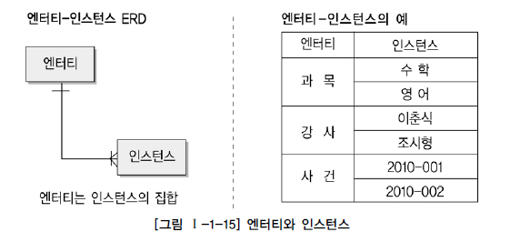

* # 과목 Ⅰ. 데이터 모델링의 이해
   + ## 제1장 데이터 모델링의 이해
     + ### 제1절 데이터 모델의 이해
       + #### 1. 모델링의 이해
         + ##### 가. 모델링의 정의
           > * 가설적 또는 일정 양식에 맞춘 표현
         + ##### 나. 모델링의 특징
           > * 추상화 : 현실세계를 일정한 형식에 맞춰 표현
           > * 단순화 : 현실세계를 약속한 규약에 의해 제한된 표기
           > * 명확화 : 애매모호함 제거
         + ##### 다. 모델링의 세 가지 관점
           > 데이터 관점, 프로세스 관점, 데이터와 프로세스의 상관관점
       + #### 2. 데이터 모델의 기본 개념의 이해
         + ##### 가. 모델링의 정의
         + ##### 나. 데이터 모델이 제공하는 기능
           > 가시화, 명세화, 구조화, 문서화
       + #### 3. 데이터 모델링의 중요성 및 유의점
         + ##### 가. 파급효과(Leverage)
         + ##### 나. 복잡한 정보 요구 사항의 간결한 표현
         + ##### 다. 데이터 품질(Data Quality)
           > 데이터 = 기업의 중요 자산
       + #### 4. 데이터 모델링의 3단계 진행
         + ##### 가. 개념적 데이터 모델링(Conceptual Data Modeling)
           > 추상적. 업무중심적. 포괄전. 전사적데이터 모델링, EA수립시.
         + ##### 나. 논리적 데이터 모델링(Logical Data Modeling)
           > KEY, 속성, 관계 표현. 재사용성 높음. **정규화**진행.
         + ##### 다. 물리적 데이터 모델링(Physical Data Modeling)
           > 실제 DB 이식 가능할 수준의 설계. 물리적 스키마
       + #### 5. 프로젝트 생명주기(Life Cycle)에서 데이터 모델링
         
       + #### 6. 데이터 모델링에서 데이터독립성의 이해
         + ##### 가. 데이터독립성의 필요성
         + ##### 나. 데이터베이스 3단계 구조
           > 외부단계, 개념적 단계, 내부적 단계
         + ##### 다. 데이터독립성 요소
           
         + ##### 라. 두 영역의 데이터독립성
           
         + ##### 마. 사상(Mapping)
           
       + #### 7. 데이터 모델링의 중요한 세 가지 개념
         + ##### 가. 데이터 모델링의 세 가지 요소
          > 1) 업무가 관여하는 어떤 것(Things) : 이주일 심순애
          > 2) 어떤 것이 가지는 성격(Attributes) : 친절, 세심하며 활발함
          > 3) 업무가 관여하는 어떤 것 간의 관계(Relationships) : 연인사이
         + ##### 나. 단수와 집합(복수)의 명명
          
       + #### 8. 데이터 모델링의 이해관계자
         + ##### 가. 이해관계자의 데이터 모델링 중요성 인식
         + ##### 나. 데이터 모델링의 이해관계자
       + #### 9. 데이터 모델의 표기법인 ERD의 이해
         + ##### 가. 데이터 모델 표기법
         + ##### 나. ERD(Entity Relationship Diagram) 표기법을 이용하여 모델링하는 방법
           + ###### 1) ERD 작업순서
           + ###### 2) 엔터티 배치
           + ###### 3) ERD 관계의 연결
           + ###### 4) ERD 관계명의 표시
           + ###### 5) ERD 관계 관계차수와 선택성 표시
       + #### 10. 좋은 데이터 모델의 요소
         + ##### 가. 완전성(Completeness)
           > 모든 데이터가 데이터 모델에 정의되어 있어야 함.
         + ##### 나. 중복배제(Non-Redundancy)
           > 한번만 기록(ex 나이,생년월일)
         + ##### 다. 업무규칙(Business Rules)
         + ##### 라. 데이터 재사용(Data Reusability)
           > 확장성을 위해 통합, 재활용할것.
         + ##### 마. 의사소통(Communication)
         + ##### 바. 통합성(Integration)
           > 조직의 전체에서 한번만 정의하고 참조,활용.
     + ### 제2절 엔터티(Entity)
       + #### 1. 엔터티의 개념
       + #### 2. 엔터티와 인스턴스에 대한 내용과 표기법
         
       + #### 3. 엔터티의 특징
         + ##### 가. 업무에서 필요로 하는 정보
           > 병원의 환자엔터티, 회사의 환자엔터티
         + ##### 나. 식별이 가능해야 함
           > 직원엔터디 : 사번(식별자o) 이름(식별자x)
         + ##### 다. 인스턴스의 집합
           
         + ##### 라. 업무프로세스에 의해 이용
         + ##### 마. 속성을 포함
         + ##### 바. 관계의 존재
           > 통계를 위한 엔터티는 관계가 없어도 유효
       + #### 4. 엔터티의 분류
         + ##### 가. 유무(有無)형에 따른 분류
           > * 유형엔터티 : 사원, 물품, 강사 (물리적 형태)
           > * 개념엔터티 : 조직, 보험상품 (물리적 형태 없는 개념적 정보)
           > * 사건엔터티 : 주문, 청구, 미납 (업무에 따라 발생. 발생량 많음)
         + ##### 나. 발생시점(發生時點)에 따른 분류
           + ###### 1) 기본엔터티
             > 독립적 생성 가능. 타 엔터티의 부모역할.
             > * 사원, 부서, 고객, 상품, 자재
           + ###### 2) 중심엔터티
             > * 계약, 사고, 예금원장, 청구, 주문, 매출
           + ###### 3) 행위엔터티
             > 두 개 이상의 부모엔터티로부터 발생. 자주 변경.
             >  * 주문목록, 사원변경이력
         + ##### 다. 엔터티 분류 방법의 예
           
       + #### 5. 엔터티의 명명
         > 현업용어, 약어지양, 단수명사, 유일부여, 생성이름대로 부여
         > * 고객제품 : 고객의 제품인가 고객이 주문한 제품인가?
     + ### 제3절 속성(Attribute)
       + #### 1. 속성 (Attribute)의 개념
         
         > * 업무에서 필요로 한다.
         > * 의미상 더 이상 분리되지 않는다.
         > * 엔터티를 설명하고 인스턴스의 구성요소가 된다.
       + #### 2. 엔터티, 인스턴스와 속성, 속성값에 대한 내용과 표기법
         + ##### 가. 엔터티, 인스턴스, 속성, 속성값의 관계
           > * 한 개의 엔터티는 두 개 이상의 인스턴스의 집합
           > * 한 개의 엔터티는 두 개 이상의 속성을 갖는다.
           > * 한 개의 속성은 한 개의 속성값을 갖는다.
         + ##### 나. 속성의 표기법
       + #### 3. 속성의 특징
         > * 해당 업무에서 필요하고 관리하고자 하는 정보
         > * 정규화 이론에 근간하여 정해진 주식별자에 함수적 종속성
         > * 하나의 속성에는 한 개의 값. 여러 개의 값이 있는 다중값일 경우 별도의 엔터티를 이용하여 분리
       + #### 4. 속성의 분류
         + ##### 가. 속성의 특성에 따른 분류
           + ###### 1) 기본속성
           + ###### 2) 설계속성
           + ###### 3) 파생속성
           
         + ##### 나. 엔터티 구성방식에 따른 분류
           > * 엔터티를 식별 : PK(Primary Key)속성 (사원번호)
           > * 다른 엔터티와의 관계에서 포함된 속성 :  FK(Foreign Key)속성 (부서코드)
           > * 엔터티에 포함되어 있고 PK, FK에 포함되지 않은 속성 : 일반속성 (사원명, 주소)
           > ***
           > 세부 의미를 쪼갤수 있는가 : 복합속성(주소 시구동), 단순속성(나이,성별)
           > ***
           > 속성값의 단복수에따라 : 단일값속성(주민번호), 다중값속성(전화번호)
           > 다중값 속성은 별도 엔터티 만들어 관계로 연결해야함.
       + #### 5. 도메인(Domain)
         > 데이터타입, 크기, 제약사항 (ex.길이가 20자리)
       + #### 6. 속성의 명명(Naming)
         
     + ### 제4절 관계(Relationship)
       + #### 1. 관계의 개념
         + ##### 가. 관계의 정의
         + ##### 나. 관계의 패어링
       + #### 2. 관계의 분류
       + #### 3. 관계의 표기법
         + ##### 가. 관계명(Membership)
         + ##### 나. 관계차수(Degree/Cardinality)
           + ###### 1) 1:1 관계를 표시하는 방법
           + ###### 2) 1:M 관계를 표시하는 방법
           + ###### 3) M:M 관계를 표시하는 방법
         + ##### 다. 관계선택사양(Optionality)
       + #### 4. 관계의 정의 및 읽는 방법
         + ##### 가. 관계 체크사항
         + ##### 나. 관계 읽기
           
     + ### 제5절 식별자
       + #### 1. 식별자(Identifiers) 개념
         > 엔터티에 구성된 속성 중 대표할 수 있는 속성
         > 하나의 엔터티는 반드시 하나의 유일한 식별자가 존재해야 한다.
         > 식별자:논리 데이터 모델링, 키:물리 데이터 모델링 단계에서 사용한다.
       + #### 2. 식별자의 특징
         
       + #### 3. 식별자 분류 및 표기법
         + ##### 가. 식별자 분류
           
         + ##### 나. 식별자 표기법
           
       + #### 4. 주식별자 도출기준
         + ##### 가. 해당 업무에서 자주 이용되는 속성을 주식별자로 지정하도록 함
         + ##### 나. 명칭, 내역 등과 같이 이름으로 기술되는 것은 피함
           > 부서이름(x), 부서코드(o)
         + ##### 다. 속성의 수가 많아지지 않도록 함
           > 인조식별자 도입
       + #### 5. 식별자관계와 비식별자관계에 따른 식별자
         + ##### 가. 식별자관계와 비식별자 관계의 결정
           > 부모 엔터티의 속성(외부식별자)을 주식별자로 쓸것인가 연결속성으로만 쓸것인가
         + ##### 나. 식별자관계
           > 주식별자로 사용. 1:1, 1:M관계
         + ##### 다. 비식별자관계
           > 1. 부모없이 생성가능.
           > 2. 데이터 생명주기 다름(부모가 먼저 소멸 가능.)
           > 3. 여러개의 엔터티가 통합되었을때 각각의 별도 관계(방문,인터넷,전화접수)
           > 4. 주식별자도 가능하나 별도 구성이 더 유리(계약번호,계약사원번호)
         + ##### 라. 식별자 관계로만 설정할 경우의 문제점
           > 하위테이블과 연결시 식별자수 많아짐. 쿼리 복잡
         + ##### 마. 비식별자 관계로만 설정할 경우의 문제점
           > 부모엔터티까지 찾아가서 데이터를 찾아야 하는 문제.
         + ##### 바. 식별자관계와 비식별자관계 모델링
           + ###### 1) 비식별자관계 선택 프로세스
             
           + ###### 2) 식별자와 비식별자관계 비교
             
           + ###### 3) 식별자와 비식별자를 적용한 데이터 모델

   + ## 제2장 데이터 모델과 SQL
     + ### 제1절 정규화
       + #### 1. 제1정규형 : 모든 속성은 반드시 하나의 값을 가져야 한다
       + #### 2. 제2정규형 : 엔터티의 일반속성은 주식별자 전체에 종속적이어야 한다
       + #### 3. 제3정규형 : 엔터티의 일반속성 간에는 서로 종속적이지 않는다
       + #### 4. 반정규화와 성능
         + ##### 가. 반정규화를 적용한 모델에서 성능이 향상될 수 있는 경우
         + ##### 나. 반정규화를 적용한 모델에서 성능이 저하될 수 있는 경우
     + ### 제2절 관계와 조인의 이해
       + #### 1. 조인
       + #### 2. 계층형 데이터 모델
       + #### 3. 상호배타적 관계
     + ### 제3절 모델이 표현하는 트랜잭션의 이해
     + ### 제4절 Null 속성의 이해
       + #### 1. Null 값의 연산은 언제나 Null이다
       + #### 2. 집계함수는 Null 값을 제외하고 처리한다
     + ### 제5절 본질식별자 vs. 인조식별자
       + #### 1. 중복 데이터로 인한 품질 문제
       + #### 2. 불필요한 인덱스 생성

* # 과목 Ⅱ. SQL 기본과 활용
   + ## 제1장 SQL 기본
     + ### 제1절 관계형 데이터베이스 개요
       + #### 1. 데이터베이스
       + #### 2. SQL(Structured Query Language)
       + #### 3. STANDARD SQL 개요
         + ##### 가. 일반 집합 연산자
           
         + ##### 나. 순수 관계 연산자
           
       + #### 4. 테이블
       + #### 5. ERD(Entity Relationship Diagram)
       + #### 6. 데이터 유형
     + ### 제2절 SELECT 문
       + #### 1. SELECT
       + #### 2. 산술 연산자와 합성 연산자
         > 산술:+-/* , 합성:||
     + ### 제3절 함수
       + #### 1. 내장 함수(BUILT-IN FUNCTION) 개요
         
         > 입력값이 많아도 출력은 하나만. M:1
         > * 사용자 정의 함수
         > * 내장 함수(단일행 함수, 다중행 함수(집계함수,그룹함수,윈도우함수) )
       + #### 2. 문자형 함수
         
       + #### 3. 숫자형 함수
         
         
       + #### 4. 날짜형 함수
         
         
       + #### 5. 변환형 함수
         > 명시적 데이터 유형 변환, 암시적 데이터 유형 변환
         > TO_NUMBER, TO_CHAT, TO_DATE
       + #### 6. CASE 표현
       + #### 7. NULL 관련 함수
         + ##### 가. NVL/ISNULL 함수
         + ##### 나. NULL과 공집합
           > 공집합일경우 NVL 미작동. 집계함수와 스칼라 서브쿼리는 공집합이 아닌 NULL 리턴
         + ##### 다. NULLIF
         + ##### 라. 기타 NULL 관련 함수 (COALESCE)
           > 최초 NULL이 아닌값 리턴. 모두 NULL일때 NULL 리턴
     + ### 제4절 WHERE 절
       + #### 1. WHERE 조건절 개요
       + #### 2. 연산자의 종류
         
         
         > * 괄호로 묶은 연산이 제일 먼저 연산 처리된다.
         > * 연산자들 중에는 부정 연산자(NOT)가 먼저 처리되고,
         > * 비교 연산자(=,>,>=,<,<=), SQL 비교 연산자(BETWEEN a AND b, IN (list), LIKE, IS NULL)가 처리되고,
         > * 논리 연산자 중에서는 AND, OR의 순으로 처리된다.
       + #### 3. 비교 연산자
       + #### 4. SQL 연산자
       + #### 5. 논리 연산자
       + #### 6. 부정 연산자
     + ### 제5절 GROUP BY, HAVING 절
       + #### 1. 집계 함수(Aggregate Function)
       + #### 2. GROUP BY 절
       + #### 3. HAVING 절
       + #### 4. CASE 표현을 활용한 월별 데이터 집계
       + #### 5. 집계 함수와 NULL 처리
     + ### 제6절 ORDER BY 절
       + #### 1. ORDER BY 정렬
         > Oracle에서는 Null값이 가장 큰값. 오름차순 마지막. 이외는 반대
       + #### 2. SELECT 문장 실행 순서
         >```sql
         > ⑤ - SELECT 칼럼 명 [ALIAS명]
         > ① - FROM 테이블명
         > ② - WHERE 조건식
         > ③ - GROUP BY 칼럼(Column) 이나 표현식
         > ④ - HAVING 그룹조건식
         > ⑥ - ORDER BY 칼럼(Column) 이나 표현식;
         >```
         + ① 발췌 대상 테이블을 참조한다. (FROM)
         + ② 발췌 대상 데이터가 아닌 것은 제거한다. (WHERE)
         + ③ 행들을 소그룹화 한다. (GROUP BY)
         + ④ 그룹핑된 값의 조건에 맞는 것만을 출력한다. (HAVING)
         + ⑤ 데이터 값을 출력/계산한다. (SELECT)
         + ⑥ 데이터를 정렬한다. (ORDER BY)
     + ### 제7절 조인
       + #### 1. JOIN 개요
       + #### 2. EQUI JOIN
       + #### 3. Non EQUI JOIN
       + #### 4. 3개 이상 TABLE JOIN
       + #### 5. OUTER JOIN

     + ### 제8절 표준 조인
       + #### 1. FROM 절 JOIN 형태
       + #### 2. INNER JOIN
       + #### 3. NATURAL JOIN
         > 동일한 이름을 갖는 모든 칼럼들에 대해 EQUL JOIN
         > USING, ON, WHERE 절에서 JOIN 조건 정의 불가
       + #### 4. USING 조건절
         > 원하는 컬럼. USING (DEPTNO)
       + #### 5. ON 조건절
         + ##### 가. WHERE 절과의 혼용
         + ##### 나. ON 조건절 + 데이터 검증 조건 추가
         + ##### 다. ON 조건절 예제
         + ##### 라. 다중 테이블 JOIN
       + #### 6. CROSS JOIN
       + #### 7. OUTER JOIN
         + ##### 가. LEFT OUTER JOIN
           > 표기된 좌측 테이블에 해당하는 데이터를 먼저 읽은 후, 나중 표기된 우측 테이블에서 JOIN 대상 데이터를 읽어 온다.
           > OUTER 생략 가능. LEFT JOIN, RIGHT JOIN, FULL JOIN
         + ##### 나. RIGHT OUTER JOIN
         + ##### 다. FULL OUTER JOIN
       + #### 8. INNER vs OUTER vs CROSS JOIN 비교
         

   + ## 제2장 SQL 활용
     + ### 제1절 서브 쿼리
       + #### 1. 단일 행 서브 쿼리
       + #### 2. 다중 행 서브쿼리
         > IN, ALL, ANY, EXISTS
       + #### 3. 다중 칼럼 서브쿼리
         > (COL1, COL2) IN ( SELECT ... )
       + #### 4. 연관 서브쿼리
         > 서브쿼리 내에 메인쿼리 칼럼이 사용
       + #### 5. 그밖에 위치에서 사용하는 서브쿼리
         + ##### 가. SELECT 절에 서브쿼리 사용하기
         + ##### 나. FROM 절에서 서브쿼리 사용하기
           > = 인라인 뷰(Inline View) = 동적 뷰
         + ##### 다. HAVING 절에서 서브쿼리 사용하기
       + #### 6. 뷰(View)
         
     + ### 제2절 집합 연산자
       
     + ### 제3절 그룹 함수
       + #### 1. 데이터 분석 개요
         > * AGGREGATE FUNCTION : COUNT, SUM, AVG, MAX, MIN
         > * GROUP FUNCTION : ROOLLUP, CUBE, GROUPING SETS
         > * WINDOW FUNCTION : ANALYTIC FUNCTION, RANK FUNCTION
       + #### 2. ROLLUP 함수
         > GROUP BY ROLLUP (DNAME, JOB)
         > * L1 - GROUP BY 수행시 생성되는 표준 집계 (9건)
         > * L2 - DNAME 별 모든 JOB의 SUBTOTAL (3건)
         > * L3 - GRAND TOTAL (마지막 행, 1건)
         > GROUP BY DNAME, ROLLUP(JOB) // JOB의 부분합만 출력
         > GROUPING(DNAME) 그룹핑중이면 1
         > CASE GROUPING(DNAME) WHEN 1 THEN 'All Departments' ELSE DNAME END
       + #### 3. CUBE 함수
         > GROUP BY CUBE (DNAME, JOB);
         > DNAME,JOB,DNAME+JOB,모든값에 대한 각각의 GROUP BY
         > ROLLUP + JOB GROUP BY
       + #### 4. GROUPING SETS 함수
         > GROUPING SETS (DNAME, JOB);
         > DNAME GROUP BY, JOB GROUP BY. 수평적.
     + ### 제4절 윈도우 함수
       + #### 1. WINDOW FUNCTION 개요
         >```sql
         > SELECT WINDOW_FUNCTION (ARGUMENTS) OVER ( 
         >    [PARTITION BY 칼럼] [ORDER BY 절] [WINDOWING 절] 
         > ) FROM 테이블명;
         > ```
         > * BETWEEN 사용 타입 
         > ROWS | RANGE BETWEEN 
         > UNBOUNDED PRECEDING | CURRENT ROW | VALUE_EXPR PRECEDING/FOLLOWING
         > AND 
         > UNBOUNDED FOLLOWING | CURRENT ROW | VALUE_EXPR PRECEDING/FOLLOWING
         > * BETWEEN 미사용 타입
         > ROWS | RANGE
         > UNBOUNDED PRECEDING | CURRENT ROW | VALUE_EXPR PRECEDING
         > ***
         > RANGE UNBOUNDED PRECEDING : 현재 행을 기준으로 파티션 내의 첫 번째 행까지의 범위를 지정한다.
         > RANGE BETWEEN 50 PRECEDING AND 150 FOLLOWING : 현재 행의 급여값을 기준으로 급여가 -50에서 +150의 범위 내에 포함된 모든 행이 대상이 된다.
         > ROWS BETWEEN 1 PRECEDING AND 1 FOLLOWING : 현재 행을 기준으로 파티션 내에서 앞의 한 건, 현재 행, 뒤의 한 건을 범위로 지정한다.
         > ROWS BETWEEN CURRENT ROW AND UNBOUNDED FOLLOWING: 현재 행을 포함해서 파티션 내의 마지막 행까지의 범위를 지정한다.
       + #### 2. 그룹 내 순위 함수
         + ##### 가. RANK 함수
           > 1,2,2,4
         + ##### 나. DENSE_RANK 함수
           > 1,2,2,3
         + ##### 다. ROW_NUMBER 함수
           > 1,2,3,4
       + #### 3. 일반 집계 함수
         + ##### 가. SUM 함수
           > 7699-WARD와 7699-MARTIN의 급여가 같으므로, 같은 ORDER로 취급하여 950+1250+1250=3450의 값이 되었다. 7698-TURNER의 경우 950+1250+1250+1500=4950의 누적합을 가진다.
         + ##### 나. MAX 함수
         + ##### 다. MIN 함수
         + ##### 라. AVG 함수
         + ##### 마. COUNT 함수
       + #### 4. 그룹 내 행 순서 함수
         + ##### 가. FIRST_VALUE 함수
         + ##### 나. LAST_VALUE 함수
         + ##### 다. LAG 함수
           > LAG(SAL, 2, 0) 두행앞의 SAL 가져오고, 값이없는 경우는 0
         + ##### 라. LEAD 함수
       + #### 5. 그룹 내 비율 함수
         + ##### 가. RATIO_TO_REPORT 함수
           > 전체합을 1로 놓고 현재값의 백분율. 모두 더하면 1이 된다.
         + ##### 나. PERCENT_RANK 함수
           > 빠른순서0,늦은순서1 : 0,0,0.5,0.75,1
         + ##### 다. CUME_DIST 함수
           > 현재행보다 작거나 같은 누적 : 0.33,0.66,1.00
         + ##### 라. NTILE 함수
           > N등분 구역 리턴. 14건일때 NTILE(4) : 4,4,3,3
     + ### 제5절 Top N 쿼리
       + #### 1. ROWNUM 슈도 칼럼
       + #### 2. TOP 절
       + #### 3. ROW LIMITING 절
     + ### 제6절 계층형 질의와 셀프 조인
       + #### 1. 개요
       + #### 2. 셀프 조인
       + #### 3. 계층형 질의
         + ##### 가. Oracle 계층형 질의
           > ```sql
           > SELECT LEVEL, LPAD(' ', 4 * (LEVEL -1)) || 사원 사원
           >      , 관리자, CONNECT_BY_ISLEAF ISLEAF
           >   FROM 사원
           >  START WITH 관리자 IS NULL
           > CONNECT BY PRIOR 사원 = 관리자;
           > ```
           > START WITH : 계층 구조 전개의 시작 위치 지정. 루트 데이터 지정
           > CONNECT BY : 자식 데이터 지정
           > PRIOR : CONNECT BY절에 사용되며, 현재 읽은 칼럼을 지정한다. PRIOR 자식 = 부모 형태를 사용하면 계층구조에서 자식 데이터에서 부모 데이터(자식 → 부모) 방향으로 전개하는 순방향 전개를 한다. 그리고 PRIOR 부모 = 자식 형태를 사용하면 반대로 부모 데이터에서 자식 데이터(부모 → 자식) 방향으로 전개하는 역방향 전개를 한다.
           > NOCYCLE : 데이터를 전개하면서 이미 나타났던 동일한 데이터가 전개 중에 다시 나타난다면 이것을 가리켜 사이클(Cycle)이 형성되었다라고 말한다. 사이클이 발생한 데이터는 런타임 오류가 발생한다. 그렇지만 NOCYCLE를 추가하면 사이클이 발생한 이후의 데이터는 전개하지 않는다.
           > ORDER SIBLINGS BY : 형제 노드(동일 LEVEL) 사이에서 정렬을 수행한다.
           > WHERE : 모든 전개를 수행한 후에 지정된 조건을 만족하는 데이터만 추출한다.(필터링)
           
           
         + ##### 나. SQL Server 계층형 질의
           > WITH TA AS ( 앵커 멤버(Anchor Member) UNION ALL 재귀 멤버(Recursive Member))
     + ### 제7절 PIVOT 절과 UNPIVOT 절
       + #### 1. 개요
       + #### 2. PIVOT 절
       + #### 2. UNPIVOT 절
     + ### 제8절 정규 표현식
       + #### 1. 개요
       + #### 2. 기본 문법
         + ##### 가. POSIX 연산자
         + ##### 나. PERL 정규 표현식 연산자
       + #### 3. 정규 표현식 조건과 함수
         + ##### 가. REGEXP_LIKE 조건
         + ##### 나. REGEXP_REPLACE 함수
         + ##### 다. REGEXP_SUBSTR 함수
         + ##### 라. REGEXP_INSTR 함수
         + ##### 마. REGEXP_COUNT 함수
   + ## 제3장 관리 구문
     + ### 제1절 DML(Data Manipulation Language)
       + #### 1. INSERT
         + ##### 가. 단일 행 INSERT 문
         + ##### 나. 서브 쿼리를 이용한 다중 행 INSERT 문
       + #### 2. UPDATE
       + #### 3. DELETE
       + #### 4. MERGE
     + ### 제2절 TCL(Transaction Control Language)
       + #### 1. 트랜잭션 개요
         > ![IMG] (/images_files/SQL_170.jpg)
       + #### 2. COMMIT
       + #### 3. ROLLBACK
       + #### 4. SAVEPOINT
         > ```sql
         > --Oracle
         > SAVEPOINT SVPT1; -- 저장점 생성
         > ROLLBACK TO SVPT1; -- 저장점까지 롤백
         > --SQL Server
         > SAVE TRANSACTION SVTR1;
         > ROLLBACK TRANSACTION SVTR1;
         > ```
     + ### 제3절 DDL
       + #### 1. CREATE TABLE
         + ##### 가. 테이블과 칼럼 정의
         + ##### 나. CREATE TABLE
         + ##### 다. 제약조건(CONSTRAINT)
         + ##### 라. 생성된 테이블 구조 확인
           > DESCRIBE 테이블명; DESC 테이블명; sp_help 'dbo.테이블명'
         + ##### 마. SELECT 문장을 통한 테이블 생성 사례
       + #### 2. ALTER TABLE
         + ##### 가. ADD COLUMN
           > ```sql
           > ALTER TABLE PLAYER ADD (ADDRESS VARCHAR2(80));
           > ```
         + ##### 나. DROP COLUMN
           > ```sql
           > ALTER TABLE PLAYER DROP COLUMN ADDRESS;
           > ```
         + ##### 다. MODIFY COLUMN
           > 해당 칼럼의 크기를 늘릴 수는 있지만 줄이지는 못한다.
           > 해당 칼럼이 NULL 값만 가지고 있거나 테이블에 아무 행도 없으면 칼럼의 폭을 줄일 수 있다.
           > 해당 칼럼이 NULL 값만을 가지고 있으면 데이터 유형을 변경할 수 있다.
           > 해당 칼럼의 DEFAULT 값을 바꾸면 변경 작업 이후 발생하는 행 삽입에만 영향을 미치게 된다.
           > 해당 칼럼에 NULL 값이 없을 경우에만 NOT NULL 제약조건을 추가할 수 있다.
           > ```sql
           > ALTER TABLE TEAM_TEMP MODIFY (
           >     ORIG_YYYY VARCHAR2(8) DEFAULT '20020129' NOT NULL
           > );
           > ***
           > ALTER TABLE PLAYER RENAME COLUMN PLAYER_ID TO TEMP_ID; -- Oracle
           > sp_rename 'dbo.TEAM_TEMP.TEAM_ID', 'TEAM_TEMP_ID', 'COLUMN'; -- SQLServer
           > ```
         + ##### 라. DROP CONSTRAINT
           > ```sql
           > ALTER TABLE PLAYER DROP CONSTRAINT PLAYER_FK;
           > ```
         + ##### 마. ADD CONSTRAINT
           > ```sql
           > ALTER TABLE PLAYER ADD 
           > CONSTRAINT PLAYER_FK FOREIGN KEY (TEAM_ID) REFERENCES TEAM(TEAM_ID);
           > ***
           > DROP TABLE TEAM;
           > ERROR: 외래 키에 의해 참조되는 고유/기본 키가 테이블에 있다.
           > ```
       + #### 3. RENAME TABLE
         >```sql
         > RENAME TEAM TO TEAM_BACKUP;
         > sp_rename 'dbo.TEAM','TEAM_BACKUP';
         > ```
       + #### 4. DROP TABLE
       + #### 5. TRUNCATE TABLE
     + ### 제4절 DCL(Data Control Languge)
       + #### 1. DCL 개요
         > DDL : 테이블 생성과 조작에 관련된 명령어
         > DML : 데이터를 조작하기 위한 명령어
         > TCL : TRANSACTION을 제어하기 위한 명령어
         > DCL : 유저를 생성하고 권한을 제어할 수 있는 명령어
       + #### 2. 유저와 권한
         + ##### 가. 유저 생성과 시스템 권한 부여
           > ```sql
           > GRANT CREATE USER TO SCOTT;
           > CREATE USER PJS IDENTIFIED BY KOREA7;
           > ```
         + ##### 나. OBJECT에 대한 권한 부여
           > ```sql
           > GRANT SELECT ON MENU TO SCOTT;
           > ```
       + #### 3. Role을 이용한 권한 부여
         > ```sql
         > REVOKE CREATE SESSION, CREATE TABLE FROM JISUNG;
         > 권한이 취소되었다.
         > 
         > * CASCADE 옵션을 주면 해당 유저가 생성한 오브젝트를 먼저 삭제한 후 유저를 삭제한다.
         > DROP USER JISUNG CASCADE;
         > ```

* # 과목 Ⅲ. SQL 고급 활용 및 튜닝
   + ## 제1장 SQL 수행 구조
     + ### 제1절 데이터베이스 아키텍처
       + #### 1. 데이터베이스 구조
         + ##### 가. Oracle 구조
           > * SGA 공유 메모리 영역과 이를 액세스하는 프로세스 집합을 합쳐서 인스턴스(Instance)라고 부른다.
           > * 하나의 인스턴스가 하나의 데이터베이스만 액세스
           > * RAC(Real Application Cluster) 환경에서는 여러 인스턴스가 하나의 데이터베이스를 액세스할 수 있다.
           > * 하나의 인스턴스가 여러 데이터베이스를 액세스할 수는 없다.
           
         + ##### 나. SQL Server 구조
           > * 하나의 인스턴스 당 최고 32,767개의 데이터베이스를 정의해 사용할 수 있다.
           > * master, model, msdb, tempdb 등의 시스템 데이터베이스가 만들어지며, 여기에 사용자 데이터베이스를 추가로 생성하는 구조
           > * 데이터베이스 하나를 만들 때마다 주(Primary 또는 Main) 데이터 파일(.mdf)과 트랜잭션 로그 파일(.ldf)이 하나씩 생성.
           > * 저장할 데이터가 많으면 보조(Non-Primary) 데이터 파일을 추가(.ndf)
           
       + #### 2. 프로세스
         + ##### 가. 서버 프로세스(Server Processes)
           > * SQL을 파싱하고 필요하면 최적화를 수행
           > * 커서를 열어 SQL을 실행. 블록을 읽고 정렬해서 클라이언트가 요청한 결과집합 생성. 네트워크를 통해 전송
           + ###### 1) 전용 서버 방식
             > 처음 연결요청을 받는 리스너가 서버 프로세스(Window 환경에서는 쓰레드)를 생성
             > 사용자 프로세스를 위해 전용(Dedicated) 서비스를 제공
             > 전용 서버 방식을 사용하는 OLTP성 애플리케이션에선 Connection Pooling 기법 필수
             > (ex. 50개의 서버 프로세스와 연결된 50개의 사용자 프로세스를 공유해서 반복 재사용)
           + ###### 2) 공유 서버 방식
             > 하나의 서버 프로세스를 여러 사용자 세션이 공유(Connection Pooling 기법을 DBMS 내부에 구현)
             > 미리 여러 개의 서버 프로세스를 띄어 놓고 이를 공유해서 반복 재사용
             > 사용자 프로세스는 서버 프로세스와 직접 통신하지 않고 Dispatcher 프로세스를 거친다.
             > 사용자 명령이 Dispatcher에게 전달되면 Dispatcher는 이를 SGA에 있는 요청 큐(Request Queue)에 등록
             > 이후 가장 먼저 가용해진 서버 프로세스가 요청 큐에 있는 사용자 명령을 꺼내서 처리하고, 그 결과를 응답 큐(Response Queue)에 등록
             > 응답 큐를 모니터링하던 Dispatcher가 응답 결과를 발견하면 사용자 프로세스에게 전송
         + ##### 나. 백그라운드 프로세스(Background Processes)
           
       + #### 3. 데이터 저장 구조
         + ##### 가. 데이터 파일
           
           + ###### 1) 블록(=페이지)
             > 데이터 읽고 쓰는 단위. 논리적으로 인접
             > Oracle:2KB,4KB,8KB,16KB,32KB,64KB / SQL Server:8KB 
           + ###### 2) 익스텐트
             > 테이블 스페이스로부터 공간을 할당하는 단위. 서로 인접하지 않는다.
             > 블록8KB. 익스텐트64KB 정의했다면, 공간 부족시 테이블 스페이스로부터 8개의 연속된 블록을 찾아(찾지 못하면 새로 생성) 세그먼트에 할당
             > Oracle은 한 익스텐트에 속한 모든 블록을 단일 오브젝트가 사용하지만, SQL Server에서는 2개 이상 오브젝트가 나누어 사용할 수도 있다. SQL Server는 다음 2가지 타입의 익스텐트를 사용한다.
             > * 균일(Uniform) 익스텐트 : 64KB 이상의 공간을 필요로 하는 테이블이나 인덱스를 위해 사용되며, 8개 페이지 단위로 할당된 익스텐트를 단일 오브젝트가 모두 사용
             > * 혼합(Mixed) 익스텐트 : 한 익스텐트에 할당된 8개 페이지를 여러 오브젝트가 나누어 사용하는 형태다. 모든 테이블이 처음에는 혼합 익스텐트로 시작하지만 64KB를 넘으면서 2번째부터 균일 익스텐트를 사용
           + ###### 3) 세그먼트
             >  테이블, 인덱스, Undo처럼 저장공간을 필요로 하는 데이터베이스 오브젝트
             >  저장공간을 필요로 한다는 것은 한 개 이상의 익스텐트를 사용함을 뜻한다. 
             >  테이블 생성시, 내부적으로 테이블 세그먼트가 생성(1:1)
             >  인덱스 생성시, 내부적으로 인덱스 세그먼트가 생성(1:1)
             >  파티션 생성시, 내부적으로 파티션 세그먼트가 생성(1:M)(디스크 경합을 줄이고 I/O 분산 효과)
           + ###### 4) 테이블스페이스
             > 여러 데이터 파일로 구성
         + ##### 나. 임시 데이터 파일
           > 대량의 정렬, 해시 작업 중 메모리 부족시 중간 결과집합을 저장하는 용도  
           > 임시 저장 후 자동 삭제. Redo 정보를 생성하지 않기 때문에 복구불가  
           > Oracle : 임시 테이블 스페이스를 여러 개 생성해 두고, 사용자마다 별도의 임시 테이블 스페이스를 지정 가능  
           > SQL Server : 단 하나의 tempdb 데이터베이스를 사용. 전역 리소스로서 시스템에 연결된 모든 사용자의 임시 데이터 저장  
         + ##### 다. 로그 파일  
           > DB 버퍼 캐시에 가해지는 모든 변경사항을 기록하는 파일 : Oracle:Redo로그 / SQL Server:트랜잭션 로그
           > 로그 파일에 Append 방식으로 빠르게 기록 후 버퍼 블록과 데이터 파일 간 동기화는 적절한 수단(DBWR, Checkpoint)을 이용해 배치(Batch) 방식으로 일괄 처리
           > Fast Commit 메커니즘 : 사용자의 갱신내용이 메모리상의 버퍼 블록에만 기록된 채 아직 디스크에 기록되지 않았더라도 Redo 로그를 믿고 빠르게 커밋을 완료(인스턴스 장애가 발생하더라도 로그 파일을 이용해 언제든 복구 가능)
           > * Online Redo 로그(Oracle)<br>
           > 캐시 복구 : 마지막 체크포인트 이후부터 사고 발생 직전까지 수행되었던 트랜잭션들을 Redo 로그를 이용해 재현<br>
           > 최소 두 개 이상의 파일로 구성. 현재 사용 중인 파일이 꽉 차면 다음 파일로 로그 스위칭(log switching)이 발생하며, 계속 로그를 써 나가다가 모든 파일이 꽉 차면 다시 첫 번째 파일부터 재사용하는 라운드 로빈(round-robin) 방식을 사용<br>
           >  * 트랜잭션 로그(SQL Server)  
           > Online Redo 로그와 대응. 데이터베이스마다 트랜잭션 로그 파일이 하나씩 생기며, 확장자는 ldf이다.  
           > 내부적으로 '가상 로그 파일이라 불리는 더 작은 단위의 세그먼트로 나뉨. 이 가상 로그 파일의 개수가 너무 많아지지 않도록 주의  
           > (ex. 로그 파일을 넉넉한 크기로 만들어 자동 증가가 발생하지 않도록 하거나, 증가하는 단위를 크게 지정하는 등)  
           >  * Archived(=Offline) Redo 로그  
           >  Oracle에서 Online Redo 로그가 재사용되기 전에 다른 위치로 백업해 둔 파일.  
           >  디스크가 깨지는 등 물리적인 저장 매체에 문제가 생겼을 때 복구용.  
       + #### 4. 메모리 구조
         > * 시스템 공유 메모리 영역
         >   * 여러 프로세스(또는 쓰레드)가 동시에 액세스할 수 있는 메모리 영역
         >   * Oracle : System Global Area(SGA) / SQL Server : Memory Pool
         >   * DB 버퍼 캐시, 공유 풀, 로그 버퍼. (Large 풀(Large Pool), 자바 풀(Java Pool), 시스템 구조와 제어 구조를 캐싱하는 영역)
         >   * 래치(Latch), 버퍼 Lock, 라이브러리 캐시 Lock/Pin 같은 액세스 직렬화 메커니즘이 사용
         > * 프로세스 전용 메모리 영역
         >   * Oracle:서버 프로세스 자신만의 전용 메모리 영역(Process Global Area(PGA)) 
         >   * SQL Server는 프로세스 전용 메모리 영역을 갖지 않는다(부모 프로세스의 메모리 영역을 사용).
         >   * 데이터를 정렬하고 세션과 커서에 관한 상태 정보를 저장하는 용도로 사용
         + ##### 가. DB 버퍼 캐시(DB Buffer Cache)
           + ###### 1) 버퍼 블록의 상태
             > Free 버퍼, Dirty 버퍼, Pinned 버퍼
           + ###### 2) LRU 알고리즘
             > least recently used. 액세스 빈도가 낮은 쪽(LRU end) 데이터 블록부터 밀어내는 방식
         + ##### 나. 공유 풀(Shared Pool)
           > (=SQL Server : Procedure Cache)
           > * 딕셔너리 캐시
           >   * 데이터베이스 딕셔너리(Dictionary) : 테이블, 인덱스, 테이블 스페이스, 데이터 파일, 세그먼트, 익스텐트, 사용자, 제약에 관한 메타 정보 저장. 
           >   * 딕셔너리 캐시 : 딕셔너리 정보를 캐싱하는 메모리 영역
           >   * ex. 입력한 주문 데이터는 데이터 파일에 저장됐다가 버퍼 캐시를 경유해 읽히지만, 테이블 메타 정보는 딕셔너리에 저장됐다가 딕셔너리 캐시를 경유해 읽힌다.
           > * 라이브러리 캐시
           >   * 사용자가 수행한 SQL문과 실행계획, 저장 프로시저를 저장
         + ##### 다. 로그 버퍼(Log Buffer)
           > * Redo 로그 버퍼 > LGWR 프로세스가 Redo 로그 파일에 기록(Log Force at commit) > DB 버퍼 캐시
         + ##### 라. PGA(Process Global Area)
           > * 다른 프로세스와 공유되지 않는 독립적인 메모리 공간. 래치 메커니즘이 필요 없어 SGA 버퍼 캐시 대비 빠름
           > * User Global Area(UGA)
           >   * (=SQL Server:Memory Pool 안에 있는 Connection Context)
           >   * 각 세션을 위한 독립적인 메모리 공간
           >   *  전용 서버 방식 : PGA에 할당 
           >   *  공유 서버 방식 : SGA에 할당(Large Pool이 설정됐을 때는 Large Pool에, 그렇지 않을 때는 Shared Pool에 할당)
           > * Call Global Area(CGA)
           >   * Call이 진행되는 동안에만 필요한 데이터 캐시(다음 Call까지 계속 참조되어야 하는 정보는 UGA에 캐시)
           >   * Parse Call, Execute Call, Fetch Call 마다 매번 할당.
           >   * Call이 진행되는 동안 Recursive Call이 발생하면 그 안에서도 Parse, Execute, Fetch 단계별로 추가로 할당
           >   * Call이 끝나면 PGA로 반환
           > * Sort Area
           >   * (=SQL Server:Memory Pool)
           >   * 소트 오퍼레이션이 진행되는 동안 공간이 부족해질 때마다 청크(Chunk) 단위로 조금씩 할당
     + ### TODO 제2절 SQL 처리 과정
       + #### 1. 구조적, 집합적, 선언적 질의 언어
       + #### 2. SQL 처리 과정
       + #### 3. SQL 옵티마이저
       + #### 4. 실행계획과 비용
       + #### 5. 옵티마이저 힌트
         + ##### 가. Oracle 힌트
           + ###### 1) 힌트 기술 방법
           + ###### 2) 힌트가 무시되는 경우
         + ##### 나. SQL Server 힌트
     + ### 제3절 데이터베이스 I/O 메커니즘
       + #### 1. 블록 단위 I/O
       + #### 2. 메모리 I/O vs. 디스크I/O
         + ##### 가. I/O 효율화 튜닝의 중요성
         + ##### 나. 버퍼 캐시 히트율(Buffer Cache Hit Ratio)
         + ##### 다. 네트워크, 파일시스템 캐시가 I/O 효율에 미치는 영향
       + #### 3. Sequential I/O vs. Random I/O
         + ##### 가. Sequential 액세스에 의한 선택 비중 높이기
         + ##### 나. Random 액세스 발생량 줄이기
       + #### 4. Single Block I/O vs. MultiBlock I/O
       + #### 5. I/O 효율화 원리
         + ##### 가. 필요한 최소 블록만 읽도록 SQL 작성
         + ##### 나. 최적의 옵티마이징 팩터 제공
         + ##### 다. 필요하다면, 옵티마이저 힌트를 사용해 최적의 액세스 경로로 유도
   + ## 제2장 SQL 분석 도구
     + ### 제1절 예상 실행계획
       + #### 1. Oracle
         + ##### 가. Explain Plan
         + ##### 나. AutoTrace
         + ##### 다. DBMS_XPLAN 패키지
       + #### 2. SQL Server
     + ### 제2절 SQL 트레이스
       + #### 1. Oracle
         + ##### 가. SQL 트레이스 수집
         + ##### 나. SQL 트레이스 포맷팅
         + ##### 다. SQL 트레이스 분석
         + ##### 라. DBMS_XPLAN 패키지
       + #### 2. SQL Server
     + ### 제3절 응답 시간 분석
       + #### 1. 대기 이벤트
         + ##### 가. 라이브러리 캐시 부하
         + ##### 나. 데이터베이스 Call과 네트워크 부하
         + ##### 다. 디스크 I/O 부하
         + ##### 라. 버퍼 캐시 경합
         + ##### 마. Lock 관련 대기 이벤트
       + #### 2. 응답 시간 분석
       + #### 3. AWR
         + ##### 가. AWR 기본 사용법
         + ##### 나. AWR 리포트 분석
           + ###### 1) 부하 프로필
           + ###### 2) 인스턴스 효율성
           + ###### 3) 공유 풀 통계
           + ###### 4) 최상위 5개 대기 이벤트
   + ## 제3장 인덱스 튜닝
     + ### 제1절 인덱스 기본 원리
       + #### 1. 인덱스 구조
         + ##### 가. 인덱스 기본
         + ##### 나. 인덱스 탐색
       + #### 2. 다양한 인덱스 스캔 방식
         + ##### 가. Index Range Scan
         + ##### 나. Index Full Scan
         + ##### 다. Index Unique Scan
         + ##### 라. Index Skip Scan
         + ##### 마. Index Fast Full Scan
         + ##### 바. Index Range Scan Descending
       + #### 3. 인덱스 종류
         + ##### 가. B*Tree 인덱스
           + ###### 1) Unbalanced Index
           + ###### 2) Index Skew
           + ###### 3) Index Sparse
           + ###### 4) 인덱스 재생성
         + ##### 나. 비트맵 인덱스
         + ##### 다. 함수기반 인덱스
         + ##### 라. 리버스 키 인덱스
         + ##### 마. 클러스터 인덱스
         + ##### 바. 클러스터형 인덱스/IOT
           + ###### 1) 클러스터형 인덱스와 IOT 구조
           + ###### 2) 클러스터형 인덱스와 IOT 활용
           + ###### 3) 2차 인덱스로부터 클러스터형 인덱스와 IOT 참조 방식
       + #### 4. 인덱스 튜닝 기초
         + ##### 가. 범위 스캔이 불가능하거나 인덱스 사용이 불가능한 경우
         + ##### 나. 인덱스 칼럼의 가공
         + ##### 다. 묵시적 형변환
     + ### 제2절 테이블 액세스 최소화
       + #### 1. 인덱스 ROWID에 의한 테이블 랜덤 액세스
         + ##### 가. 인덱스 ROWID에 의한 테이블 액세스 구조
         + ##### 나. 클러스터링 팩터
         + ##### 다. 인덱스 손익분기점
         + ##### 라. 손익분기점 극복하기
       + #### 2. 테이블 액세스 최소화 튜닝
         + ##### 가. 인덱스 칼럼 추가
         + ##### 나. Covered Index
         + ##### 다. Include Index
         + ##### 라. IOT, 클러스터형 인덱스, 클러스터 테이블 활용
         + ##### 마. 수동으로 클러스터링 팩터 높이기
         + ##### 바. 배치 I/O
     + ### 제3절 인덱스 스캔 효율화
       + #### 1. 인덱스 선행 칼럼이 범위조건일 때의 비효율
       + #### 2. 범위조건을 In-List로 전환
       + #### 3. 범위조건을 2개 이상 사용할 때의 비효율
     + ### 제4절 인덱스 설계
       + #### 1. 결합 인덱스 구성을 위한 기본 공식
       + #### 2. 추가적인 고려사항
       + #### 3. 인덱스 설계도 작성
   + ## 제4장 조인 튜닝
     + ### 제1절 NL 조인
       + #### 1. 기본 메커니즘
       + #### 2. NL Join 수행 과정 분석
       + #### 3. NL Join의 특징
       + #### 4. NL 조인 확장 메커니즘
         + ##### 가. 전통적인 실행계획
         + ##### 나. 테이블 Prefetch 실행계획
         + ##### 다. 배치 I/O 실행계획
     + ### 제2절 소트 머지 조인
       + #### 1. 기본 메커니즘
       + #### 2. Sort Merge Join의 특징
     + ### 제3절 해시 조인
       + #### 1. 기본 메커니즘
       + #### 2. Build Input이 가용 메모리 공간을 초과할 때 처리 방식
         + ##### 가. 파티션 단계
         + ##### 나. 조인 단계
       + #### 3. Build Input 해시 키 값에 중복이 많을 때 발생하는 비효율
       + #### 4. Hash Join 사용기준
     + ### 제4절 스칼라 서브쿼리
       + #### 1. Scalar Subquery의 캐싱 효과
       + #### 2. 두 개 이상의 값을 리턴하고 싶을때
       + #### 3. 스칼라 서브 쿼리 Unnesting
     + ### 제5절 고급 조인 기법
       + #### 1. 인라인 뷰 활용
       + #### 2. 배타적 관계의 조인
       + #### 3. 부등호 조인
       + #### 4. Between 조인
         + ##### 가. 선분이력이란?
         + ##### 나. 선분이력 기본 조회 패턴
         + ##### 다. 선분이력 조인
           + ###### 1) 과거,현재,미래의 임의 시점 조회
           + ###### 2) 현재 시점 조회
         + ##### 라. Between 조인
       + #### 5. ROWID 활용
   + ## 제5장 SQL 옵티마이저
     + ### 제1절 SQL 옵티마이징 원리
       + #### 1. 옵티마이저 소개
         + ##### 가. 옵티마이저 종류
           + ###### 1) 규칙기반 옵티마이저
           + ###### 2) 비용기반 옵티마이저
         + ##### 나. 최적화 목표
           + ###### 1) 전체 처리속도 최적화
           + ###### 2) 최초 응답속도 최적화
       + #### 2. 옵티마이저 행동에 영향을 미치는 요소
         + ##### 가. SQL과 연산자 형태
         + ##### 나. 옵티마이징 팩터
         + ##### 다. DBMS 제약 설정
         + ##### 라. 옵티마이저 힌트
         + ##### 마. 통계정보
         + ##### 바. 옵티마이저 관련 파라미터
         + ##### 사. DBMS 버전과 종류
       + #### 3. 옵티마이저의 한계
         + ##### 가. 옵티마이징 팩터의 부족
         + ##### 나. 통계정보의 부정확성
         + ##### 다. 바인드 변수 사용 시 균등분포 가정
         + ##### 라. 비현실적인 가정
         + ##### 마. 규칙에 의존하는 CBO
         + ##### 바. 하드웨어 성능
       + #### 4. 통계정보를 이용한 비용계산 원리
         + ##### 가. 선택도
         + ##### 나. 카디널리티
         + ##### 다. 히스토그램
         + ##### 라. 비용
     + ### 제2절 SQL 공유 및 재사용
       + #### 1. 소프트 파싱 vs. 하드 파싱
         + ##### 가. SQL 공유 및 재사용의 필요성
         + ##### 나. 실행계획 공유 조건
         + ##### 다. 실행계획을 공유하지 못하는 경우
       + #### 2. 바인드 변수 사용하기
         + ##### 가. 바인드 변수의 중요성
         + ##### 나. 바인드 변수 사용 시 주의사항
         + ##### 다. 바인드 변수 부작용을 극복하기 위한 노력
       + #### 3. 애플리케이션 커서 캐싱
       + #### 4. Static SQL vs. Dynamic SQL
         + ##### 가. Static SQL
         + ##### 나. Dynamic SQL
         + ##### 다. 바인드 변수의 중요성 재강조
     + ### 제3절 쿼리 변환
       + #### 1. 쿼리변환이란?
       + #### 2. 서브쿼리 Unnesting
       + #### 3. 뷰 Merging
       + #### 4. 조건절 Pushing
         + ##### 가. 조건절(Predicate) Pushdown
         + ##### 나. 조건절(Predicate) Pullup
         + ##### 다. 조인 조건(Join Predicate) Pushdown
       + #### 5. 조건절 이행
       + #### 6. 불필요한 조인 제거
       + #### 7. OR 조건을 Union으로 변환
       + #### 8. 기타 쿼리 변환
         + ##### 가. 집합 연산을 조인으로 변환
         + ##### 나. 조인 칼럼에 IS NOT NULL 조건 추가
         + ##### 다. 필터 조건 추가
         + ##### 라. 조건절 비교 순서
   + ## 제6장 고급 SQL 튜닝
     + ### 제1절 소트 튜닝
       + #### 1. 소트와 성능
         + ##### 가. 메모리 소트와 디스크 소트
         + ##### 나. 소트를 발생시키는 오퍼레이션
           + ###### 1) Sort Aggregate
           + ###### 2) Sort Order By
           + ###### 3) Sort Group By
           + ###### 4) Sort Unique
           + ###### 5) Sort Join
           + ###### 6) Window Sort
         + ##### 다. 소트 튜닝 요약
       + #### 2. 데이터 모델 측면에서의 검토
       + #### 3. 소트가 발생하지 않도록 SQL 작성
         + ##### 가. Union을 Union All로 대체
         + ##### 나. Distinct를 Exists 서브쿼리로 대체
         + ##### 다. 불필요한 Count 연산 제거
       + #### 4. 인덱스를 이용한 소트 연산 대체
         + ##### 가. Sort Order By 대체
         + ##### 나. Sort Group By 대체
         + ##### 다. 인덱스를 활용한 Min, Max 구하기
       + #### 5. 소트 영역을 적게 사용하도록 SQL 작성
         + ##### 가. 소트 완료 후 데이터 가공
         + ##### 나. Top N 쿼리
         + ##### 다. Top N 쿼리를 이용한 효과적인 이력 조회
       + #### 6. 소트 영역 크기 조정
     + ### 제2절 DML 튜닝
       + #### 1. 인덱스 유지 비용
       + #### 2. Insert 튜닝
         + ##### 가. Oracle Insert 튜닝
         + ##### 나. SQL Server Insert 튜닝
       + #### 3. Update 튜닝
         + ##### 가. Truncate & Insert 방식 사용
         + ##### 나. 조인을 내포한 Update 튜닝
     + ### 제3절 데이터베이스 Call 최소화
       + #### 1. 데이터베이스 Call 종류
         + ##### 가. SQL 커서에 대한 작업 요청에 따른 구분
           + ###### 1) Parse Call
           + ###### 2) Execute Call
           + ###### 3) Fetch Call
         + ##### 나. Call 발생 위치에 따른 구분
           + ###### 1) User Call
           + ###### 2) Recursive Call
       + #### 2. 데이터베이스 Call과 성능
         + ##### 가. One SQL 구현의 중요성
         + ##### 나. 데이터베이스 Call과 시스템 확장성
       + #### 3. Array Processing 활용
       + #### 4. Fetch Call 최소화
         + ##### 가. 부분범위처리 원리
         + ##### 나. ArraySize 조정에 의한 Fetch Call 감소 및 블록 I/O 감소 효과
       + #### 5. 페이지 처리 활용
       + #### 6. 분산 쿼리
       + #### 7. 사용자 정의 함수/프로시저의 특징과 성능
         + ##### 가. 사용자 정의 함수/프로시저의 특징
         + ##### 나. 사용자 정의 함수/프로시저에 의한 성능 저하 해소 방안
     + ### 제4절 파티셔닝
       + #### 1. 파티션 개요
       + #### 2. 파티션 유형
         + ##### 가. RANGE 파티셔닝
         + ##### 나. HASH 파티셔닝
         + ##### 다. LIST 파티셔닝
         + ##### 라. Composite 파티셔닝
       + #### 3. 파티션 Pruning
         + ##### 가. 정적(Static) 파티션 Pruning
         + ##### 나. 동적(Dynamic) 파티션 Pruning
       + #### 4. 인덱스 파티셔닝
         + ##### 가. Local 파티션 인덱스 vs. Global 파티션 인덱스
         + ##### 나. Prefixed 파티션 인덱스 vs. NonPrefixed 파티션 인덱스
         + ##### 다. 인덱스 파티셔닝 가이드
     + ### 제5절 대용량 배치 프로그램 튜닝
       + #### 1. 배치 프로그램 튜닝 개요
         + ##### 가. 배치 프로그램이란
         + ##### 나. 배치 환경의 변화
         + ##### 다. 성능 개선 목표 설정
         + ##### 라. 배치 프로그램 구현 패턴과 튜닝 방안
       + #### 2. 병렬 처리 활용
         + ##### 가. Query Coordinator와 병렬 서버 프로세스
         + ##### 나. Intra-Operation Parallelism과 Inter-Operation Parallelism
         + ##### 다. 테이블 큐
         + ##### 라. IN-OUT 오퍼레이션
         + ##### 마. 데이터 재분배
         + ##### 바. pq_distribute 힌트 활용
           + ###### 1) pq_distribute 힌트의 용도
           + ###### 2) pq_distribute 사용법
           + ###### 3) pq_distribute 힌트를 이용한 튜닝 사례
         + ##### 사. 병렬 처리 시 주의사항
     + ### 제6절 고급 SQL 활용
       + #### 1. CASE문 활용
       + #### 2. 데이터 복제 기법 활용
       + #### 3. Union All을 활용한 M:M 관계의 조인
       + #### 4. 페이징 처리
         + ##### 가. 일반적인 페이징 처리용 SQL
         + ##### 나. 뒤쪽 페이지까지 자주 조회할 때
         + ##### 다. Union All 활용
       + #### 5. 윈도우 함수 활용
       + #### 6. With 구문 활용
   + ## 제7장 Lock과 트랜잭션 동시성 제어
     + ### 제1절 Lock
       + #### 1. Lock 기본
         + ##### 가. Lock이란?
         + ##### 나. 공유 Lock과 배타적 Lock
           + ###### 1) 공유 Lock
           + ###### 2) 배타적 Lock
         + ##### 다. 블로킹과 교착상태
           + ###### 1) 블로킹
           + ###### 2) 교착상태
       + #### 2. SQL Server Lock
         + ##### 가. Lock 종류
           + ###### 1) 공유 Lock
           + ###### 2) 배타적 Lock
           + ###### 3) 갱신 Lock
           + ###### 4) 의도 Lock
           + ###### 5) 스키마 Lock
           + ###### 6) Bulk Update Lock
         + ##### 나. Lock 레벨과 Escalation
         + ##### 다. Lock 호환성
       + #### 3. Oracle Lock
         + ##### 가. 로우 Lock
         + ##### 나. 테이블 Lock
     + ### 제2절 트랜잭션
       + #### 1. 트랜잭션의 특징
       + #### 2. 트랜잭션 격리성
         + ##### 가. 낮은 단계의 격리성 수준에서 발생할 수 있는 현상들
           + ###### 1) Dirty Read
           + ###### 2) Non-Repeatable Read
           + ###### 3) Phantom Read
         + ##### 나. 트랜잭션 격리성 수준
     + ### 제3절 동시성 제어
       + #### 1. 비관적 동시성 제어 vs. 낙관적 동시성 제어
         + ##### 가. 비관적 동시성 제어
         + ##### 나. 낙관적 동시성 제어
       + #### 2. 다중버전 동시성 제어
         + ##### 가. 일반적인 Locking 메커니즘의 문제점
         + ##### 나. 다중버전 동시성 제어
         + ##### 다. 문장수준 읽기 일관성
         + ##### 라. 트랜잭션 수준 읽기
         + ##### 마. Snapshot too old


******
******
* # .
  + ## 정리중
     + ### 대량 데이터에 따른 성능
       + #### 1. 대량 데이터발생에 따른 테이블 분할 개요
       + #### 2. 한 테이블에 많은 수의 칼럼을 가지고 있는 경우
       + #### 3. 대량 데이터 저장 및 처리로 인해 성능
         + ##### 가. RANGE PARTITION 적용
         + ##### 나. LIST PARTITION 적용
         + ##### 다. HASH PARTITION 적용
       + #### 4. 테이블에 대한 수평분할/수직분할의 절차
     + ### 데이터베이스 구조와 성능
       + #### 1. 슈퍼타입/서브타입 모델의 성능고려 방법
         + ##### 가. 슈퍼/서브타입 데이터 모델의 개요
         + ##### 나. 슈퍼/서브타입 데이터 모델의 변환
         + ##### 다. 슈퍼/서브 타입 데이터 모델의 변환기술
         + ##### 라. 슈퍼/서브타입 데이터 모델의 변환타입 비교
       + #### 2. 인덱스 특성을 고려한 PK/FK 데이터베이스 성능향상
         + ##### 가. PK/FK 칼럼 순서와 성능개요
         + ##### 가. PK/FK 칼럼 순서와 성능개요 데이터를 조회할 때 가장 효과적으로 처리될 수 있도록 접근경로를 제공하는 오브젝트가 바로 인덱스이다. 일반적으로 데이터베이스 테이블에서는 균형 잡힌 트리구조의 BTree구조를 많이 사용한다. 우리는 BTree구조의 내부 알고리즘까지는 알 필요가 없더라도 그 구조를 이용할 때 정렬되어 있는 특징으로 인해 데이터베이스 설계에 이 특징에 따라 설계에 반영해야 할 요소에 대해서는 반드시 알고 있어야 좋은 데이터 모델을 만들어 낼 수 있게 된다.
         + ##### 나. PK칼럼의 순서를 조정하지 않으면 성능이 저하 이유
         + ##### 다. PK순서를 잘못 지정하여 성능이 저하된 경우 - 간단한 오류
         + ##### 라. PK순서를 잘못 지정하여 성능이 저하된 경우 - 복잡한 오류
       + #### 3. 물리적인 테이블에 FK제약이 걸려있지 않을 경우 인덱스 미생성으로 성능저하
     + ### 분산 데이터베이스와 성능
       + #### 1. 분산 데이터베이스의 개요
       + #### 2. 분산 데이터베이스의 투명성(Transparency)
       + #### 3. 분산 데이터베이스의 적용 방법 및 장단점
         + ##### 가. 분산 데이터베이스 적용방법
         + ##### 나. 분산 데이터베이스 장단점
       + #### 4. 분산 데이터베이스의 활용 방향성
       + #### 5. 데이터베이스 분산구성의 가치
       + #### 6. 분산 데이터베이스의 적용 기법
         + ##### 가. 테이블 위치 분산
         + ##### 나. 테이블 분할(Fragmentation) 분산
         + ##### 다. 테이블 복제(Replication) 분산
         + ##### 라. 테이블 요약(Summarization) 분산
       + #### 7. 분산 데이터베이스를 적용하여 성능이 향상된 사례
       + #### 7. ROWNUM, TOP 사용
       + #### 5. 대기 이벤트
         + ##### 가. 라이브러리 캐시 부하
         + ##### 나. 데이터베이스 Call과 네트워크 부하
         + ##### 다. 디스크 I/O 부하
         + ##### 라. 버퍼 캐시 경합
         + ##### 마. Lock 관련 대기 이벤트
       + #### 2. 데이터 모델의 기본 개념의 이해
       + #### 1. SQL 처리과정
         + ##### 가. SQL 파싱(Parsing)
         + ##### 나. SQL 최적화(Optimization)
       + #### 2. 캐싱된 SQL 공유
         + ##### 가. 실행계획 공유 조건
         + ##### 나. 실행계획을 공유하지 못하는 경우
       + #### 5. 애플리케이션 커서 캐싱


